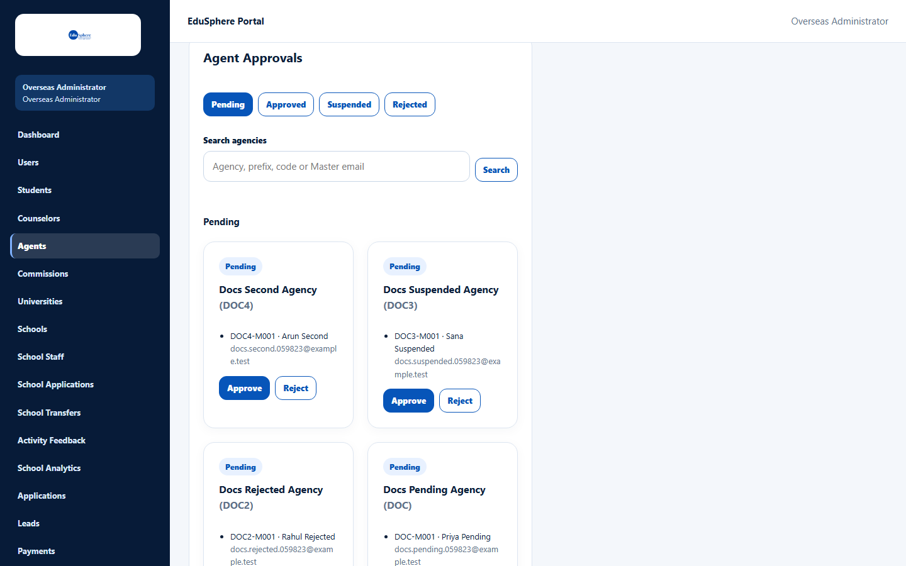
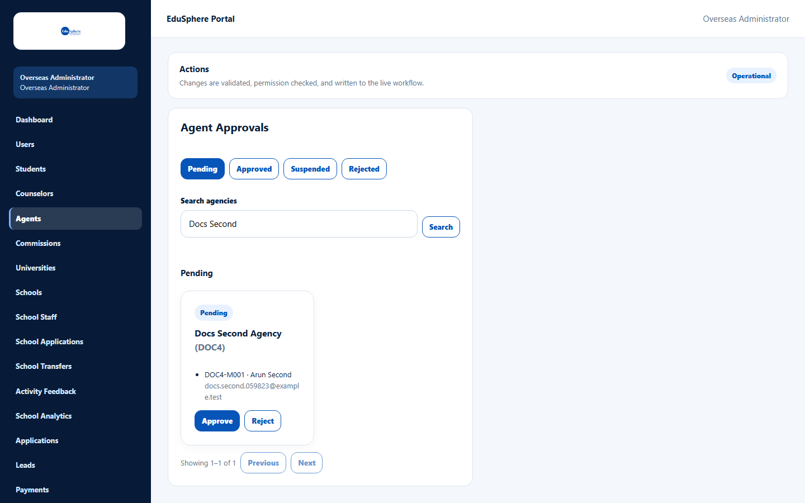
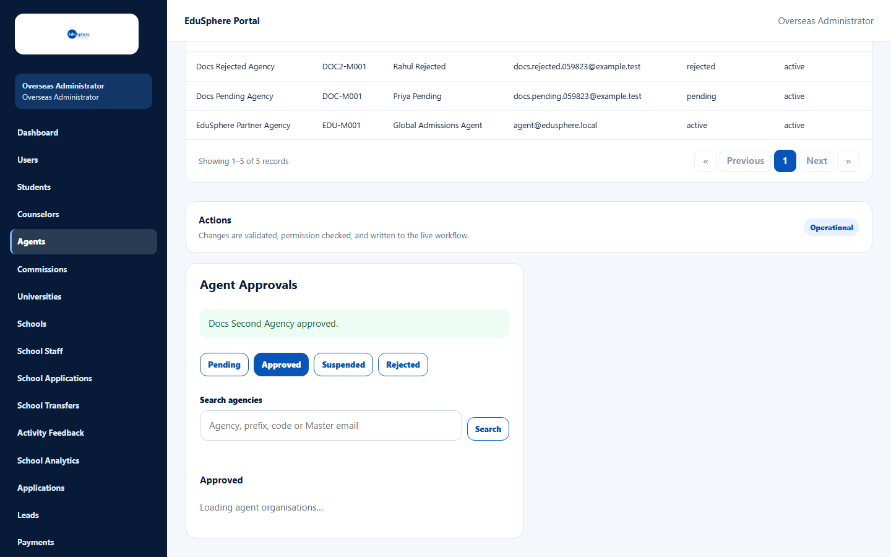
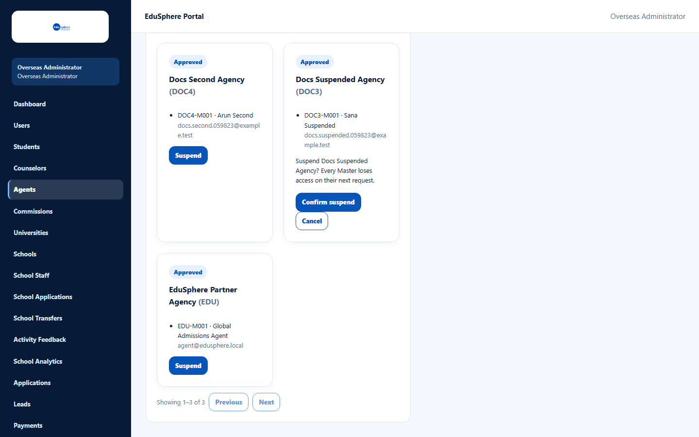
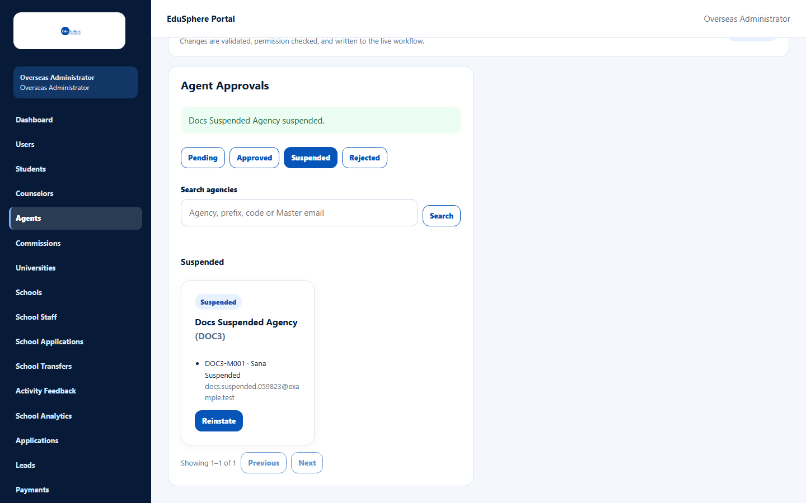
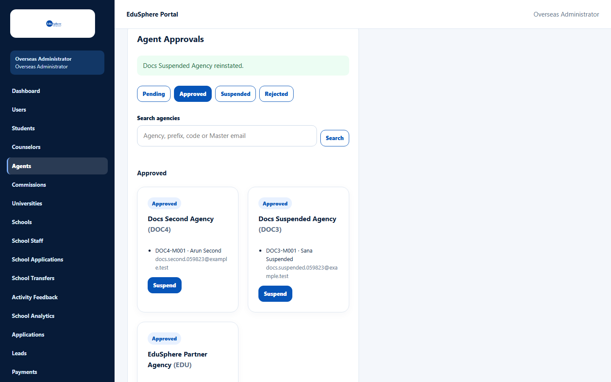
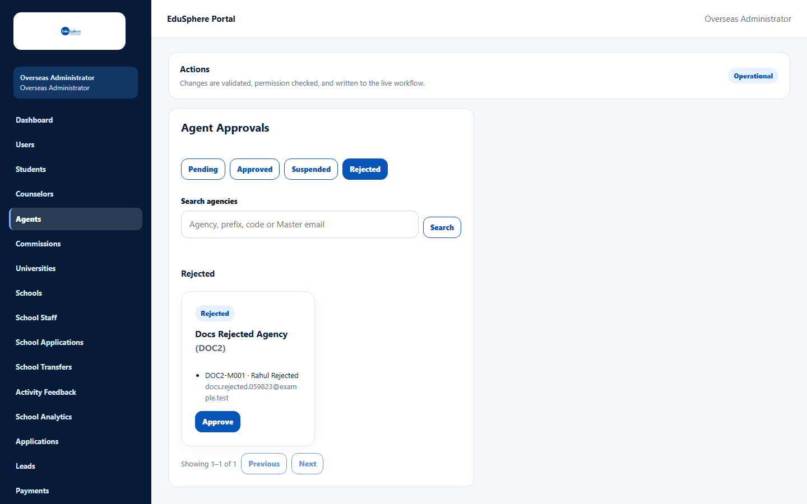

# Approve, reject, suspend or reinstate agencies

> Doc ID: DOC-ADM-001 · Verified 2026-10-05 against `main` @ `6a9be770` (docs branch) · Roles: Overseas Admin

## Purpose
Decide which education agencies may use EduSphere. New agencies register themselves and wait as **Pending** until an
Overseas Admin approves or rejects them. Approved agencies can later be suspended (all their logins are blocked) and
reinstated.

## Who Can Use This Feature
**Overseas Admin.** A Super Admin who opens this page sees "Access unavailable — Workspace not found" (see
[Super Admin access](adm-007-super-admin-access.md)).

## Prerequisites
At least one agency has registered (see [Register an agency](../user-manual/account-access/auth-001-register-an-agency.md)).

## How to Access
Overseas Admin sidebar > **Agents**.

The page has two parts:
- **Agent Masters** — a table of every Master of every agency (Agency, Code, Name, Email, Agency status, Master
  status). Use **Search records**, **Filter by** a column, the column headings to sort, and **Rows per page**.
- **Agent Approvals** — the panel where you act on agencies, with the tabs **Pending**, **Approved**, **Suspended**
  and **Rejected**.

## Steps

### Step 1 — Review pending agencies
Open **Agents** and scroll to **Agent Approvals**. The **Pending** tab lists each waiting agency with its name, prefix
and Masters (code, name, email).

### Step 2 — Find an agency (optional)
Type an agency name, prefix, Master code or Master email in **Search agencies** and click **Search**.

### Step 3 — Approve or reject
- Click **Approve** to let the agency use EduSphere. The message "{agency} approved." appears and the panel switches
  to the **Approved** tab.
- Click **Reject** to refuse the registration. The agency moves to the **Rejected** tab.

The agency's Masters can use the portal from their next page load. **EduSphere does not email or notify the agency**,
so tell them yourself if needed.

### Step 4 — Suspend an approved agency
1. On the **Approved** tab, click **Suspend** on the agency.
2. Read the confirmation "Suspend {agency}? Every Master loses access on their next request."
3. Click **Confirm suspend** (or **Cancel**).

The agency moves to the **Suspended** tab. All its Masters and staff now see "Your agency's account is suspended".

### Step 5 — Reinstate or re-approve
- **Suspended** tab: click **Reinstate** to restore access. The message "{agency} reinstated." appears.

- **Rejected** tab: click **Approve** if a rejected agency should be allowed after all.

## Fields
| Field | Description | Required | Example |
|---|---|---|---|
| Search agencies | Agency name, prefix, Master code or Master email (up to 100 characters). | No | Docs Second |

## Expected Result
| Action | Allowed from | Result |
|---|---|---|
| Approve | Pending, Rejected | Approved (agency can work) |
| Reject | Pending | Rejected (agency sees "pending approval") |
| Suspend | Approved | Suspended (all logins blocked) |
| Reinstate | Suspended | Approved |

Every action is recorded in the audit log.

## Validation Messages
| Message | When |
|---|---|
| Cannot {action} an organisation that is {status} | Someone else changed the agency's status first; reload the page. |
| Unable to load agent organisations. | The list could not load; click **Retry**. |
| No organisations awaiting approval. / No approved organisations. / No suspended organisations. / No rejected organisations. | The tab is empty. |

## Common Errors
**Problem:** An agency says it cannot work although you approved it.
**Cause:** They are looking at an old page.
**Resolution:** Ask them to reload or sign in again.

**Problem:** A rejected agency says it is still "pending approval".
**Cause:** Rejected agencies see the same message as pending ones.
**Resolution:** Tell the agency directly that the registration was rejected.

## Tips
- Staff logins never appear here; agencies manage their own staff.
- You can also suspend and reinstate from **Agent network** (see [Suspend or reinstate an agency](adm-004-suspend-reinstate.md)).

## Related Features
- User manual: [Register an agency](../user-manual/account-access/auth-001-register-an-agency.md),
  ["Access unavailable" messages](../user-manual/account-access/auth-003-access-unavailable.md)
