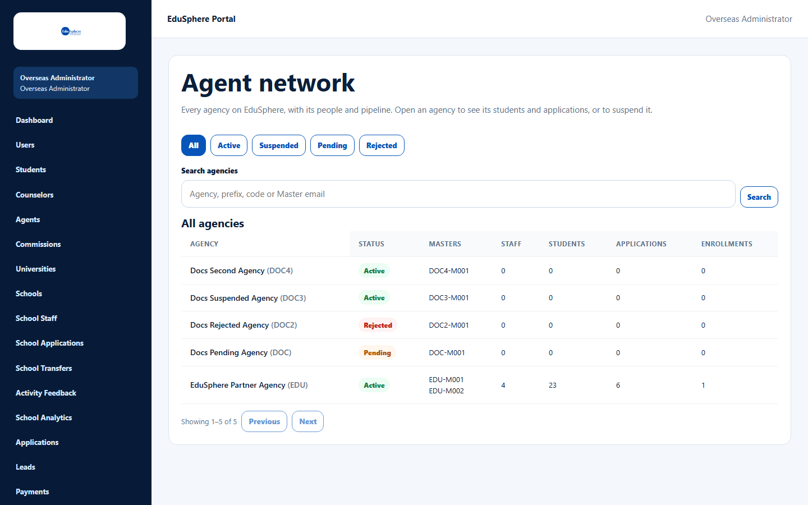
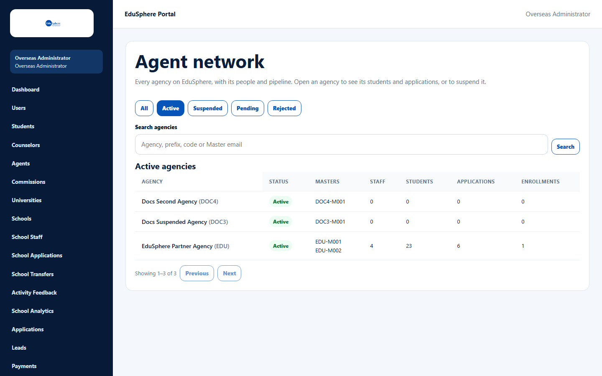
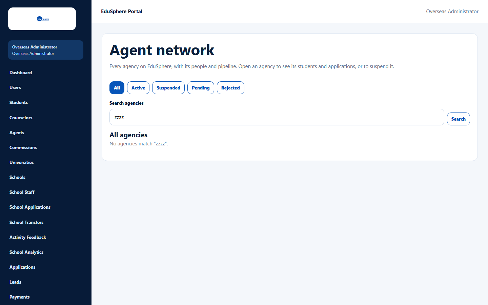

# Agent network

> Doc ID: DOC-ADM-002 · Verified 2026-10-05 against docs commit `717d6aa8` (`main` @ `6a9be770`) · Roles: Overseas Admin, Super Admin (read-only)

## Purpose
See every agency on EduSphere with its people and pipeline, and open an agency for details.

## Who Can Use This Feature
- **Overseas Admin:** view and open agencies (and suspend them from the detail page).
- **Super Admin:** view only (see [Super Admin access](adm-007-super-admin-access.md)).

## Prerequisites
None.

## How to Access
Overseas Admin sidebar > **Agent network**.

## Steps

### Step 1 — Read the list
"Every agency on EduSphere, with its people and pipeline. Open an agency to see its students and applications, or to
suspend it." The table shows **Agency** (name and prefix), **Status**, **Masters**, **Staff**, **Students**,
**Applications** and **Enrollments**, newest first, 20 per page.

### Step 2 — Filter and search
- Status tabs: **All**, **Active**, **Suspended**, **Pending**, **Rejected**.
- **Search agencies** — agency name, prefix, Master code or Master email, then **Search**.

### Step 3 — Open an agency
Click the agency name to open its detail page (see [Agency detail](adm-003-agency-detail.md)).

## Fields
| Field | Description | Required | Example |
|---|---|---|---|
| Search agencies | Name, prefix, Master code or Master email. | No | Docs Second |

## Expected Result
The list shows the agencies matching the tab and search.

## Validation Messages
| Message | When |
|---|---|
| No agencies match “{search}”. | Nothing matches the search. |
| No agencies yet. / No active agencies. / No suspended agencies. / No pending agencies. / No rejected agencies. | The tab is empty. |
| Unable to load agencies. | Loading failed; click **Retry**. |

## Common Errors
None observed.

## Tips
- Approving or rejecting new agencies is done under **Agents** (see [Agency approvals](adm-001-agency-approvals.md)).

## Related Features
- [Agency detail](adm-003-agency-detail.md)
- [Suspend or reinstate an agency](adm-004-suspend-reinstate.md)
