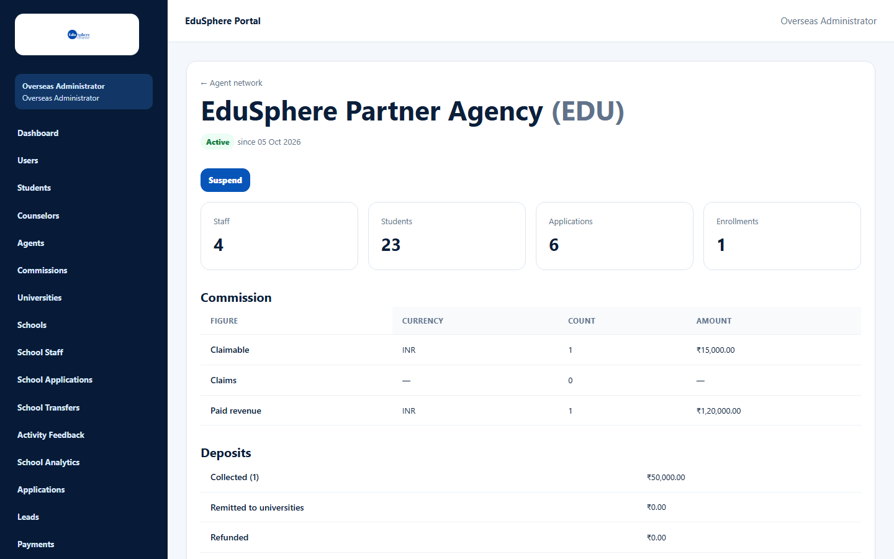
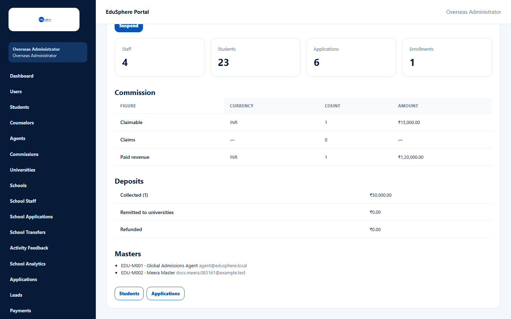
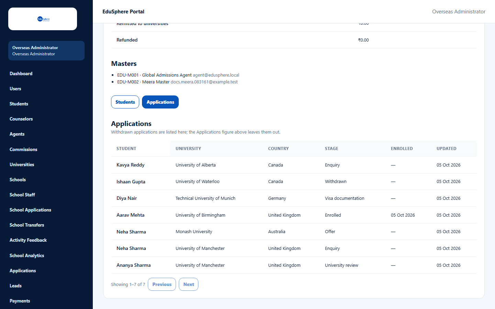

# Agency detail

> Doc ID: DOC-ADM-003 · Partly verified 2026-10-05 against docs commit `717d6aa8` (`main` @ `6a9be770`) · Roles: Overseas Admin, Super Admin (read-only)

## Purpose
See one agency in full: its status, size, money (commissions and deposits), Masters, and a read-only view of its
students and applications.

## Who Can Use This Feature
Overseas Admin; Super Admin (read-only).

## Prerequisites
None.

## How to Access
Agent network > click the agency name. **← Agent network** returns to the list.

## Steps

### Step 1 — Read the summary
The page shows the agency name and prefix, its status ("Active since {date}"), the **Suspend** button (Overseas
Admin, active agencies), and figures for **Staff**, **Students**, **Applications** and **Enrollments**.

### Step 2 — Read the money
- **Commission** — rows **Claimable**, **Claims** and **Paid revenue**, each with Currency, Count and Amount. Each
  currency has its own row; amounts are never added across currencies.
- **Deposits** — **Collected (N)**, **Remitted to universities** and **Refunded** (₹).
- **Masters** — each Master's code, name and email.

### Step 3 — Look at the agency's records
Under **Agency records**, choose **Students** or **Applications**.
- Students: Student, Assigned to, Login, Applications, Added (Active/Archived sub-filter — VERIFICATION REQUIRED).
- Applications: Student, University, Country, Stage, Enrolled, Updated.

No phone numbers or student emails are shown. Every time you open these records, EduSphere records it in the audit log.

## Fields
None.

## Expected Result
A read-only picture of the agency.

## Validation Messages
| Message | When |
|---|---|
| 404 — This page could not be found. | The address does not contain a valid agency id. |
| Unable to load this agency. / Unable to load students. / Unable to load applications. | Loading failed. |

## Common Errors
**Problem:** "This page could not be found."
**Cause:** The link is broken or the id was typed wrongly.
**Resolution:** Open the agency from **Agent network**.

## Tips
- The detail page cannot approve or reject; pending and rejected agencies show a **Review in Agent Approvals** link.

## Related Features
- [Suspend or reinstate an agency](adm-004-suspend-reinstate.md)
- [Agent deposits](adm-005-agent-deposits.md)
