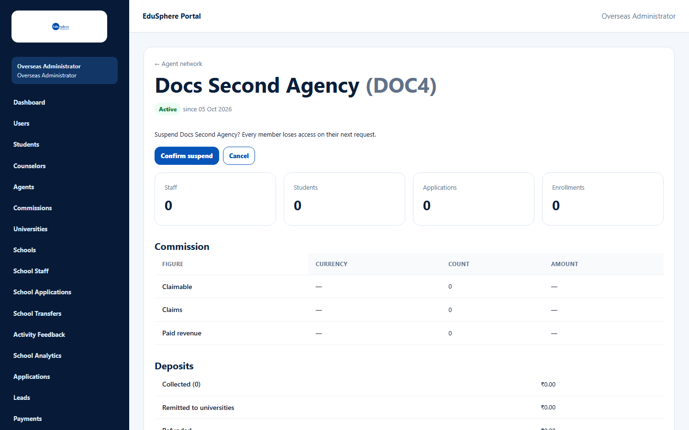
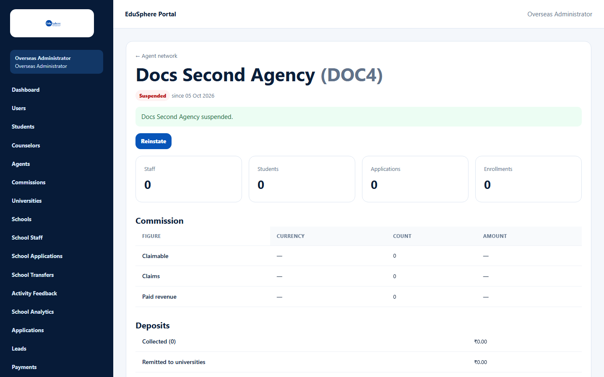
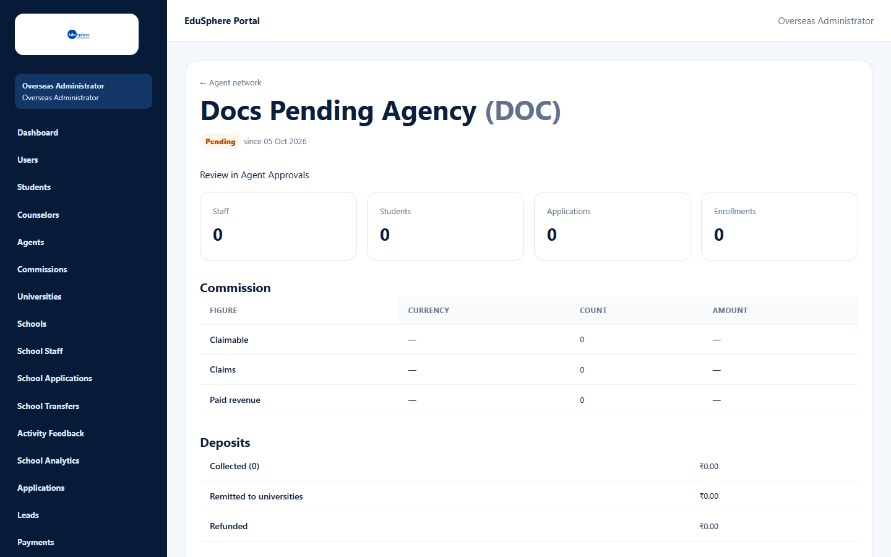

# Suspend or reinstate an agency

> Doc ID: DOC-ADM-004 · Verified 2026-10-05 against docs commit `717d6aa8` (`main` @ `6a9be770`) · Roles: Overseas Admin

## Purpose
Block an agency's access immediately (for example during an investigation), and restore it later.

## Who Can Use This Feature
**Overseas Admin.** Super Admin does not see these buttons.

## Prerequisites
The agency is active (to suspend) or suspended (to reinstate).

## How to Access
Agent network > agency name > **Suspend** / **Reinstate**. (The same actions are on **Agents** — see
[Agency approvals](adm-001-agency-approvals.md).)

## Steps

### Step 1 — Suspend
1. Click **Suspend**.
2. Read "Suspend {agency}? Every member loses access on their next request." and click **Confirm suspend**
   (or **Cancel** / Escape).

The message "{agency} suspended." appears, the status changes to **Suspended** and a **Reinstate** button appears.

### Step 2 — Reinstate
Click **Reinstate**. The message "{agency} reinstated." appears and the agency can work again.

### Pending or rejected agencies
Their detail page shows **Review in Agent Approvals** instead of Suspend.

## Fields
None.

## Expected Result
Suspended: every Master and staff member sees "Your agency's account is suspended" on their next page.
Reinstated: access returns on their next page.

## Validation Messages
| Message | When |
|---|---|
| Cannot {action} an organisation that is {status} | Someone else changed the status first; reload. |
| Unable to {action} this agency. | The action failed. |

## Common Errors
None observed.

## Tips
- EduSphere does not notify the agency — tell them yourself.

## Related Features
- [Agency approvals](adm-001-agency-approvals.md)
- User manual: ["Access unavailable" messages](../user-manual/account-access/auth-003-access-unavailable.md)
