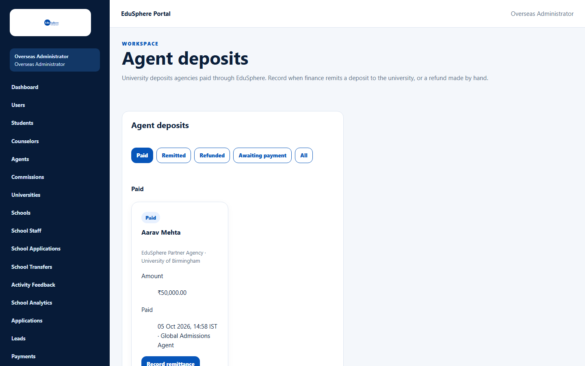
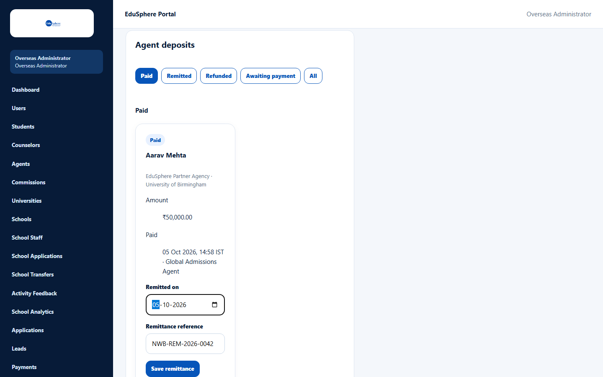
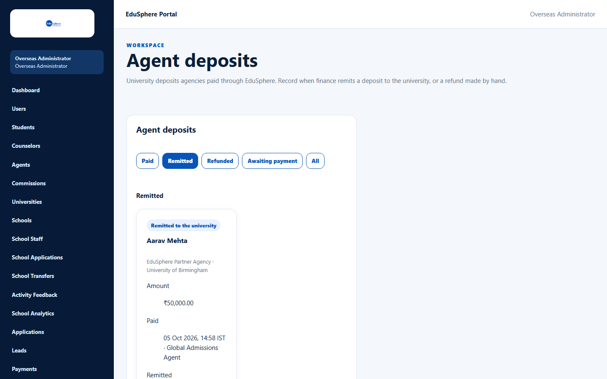
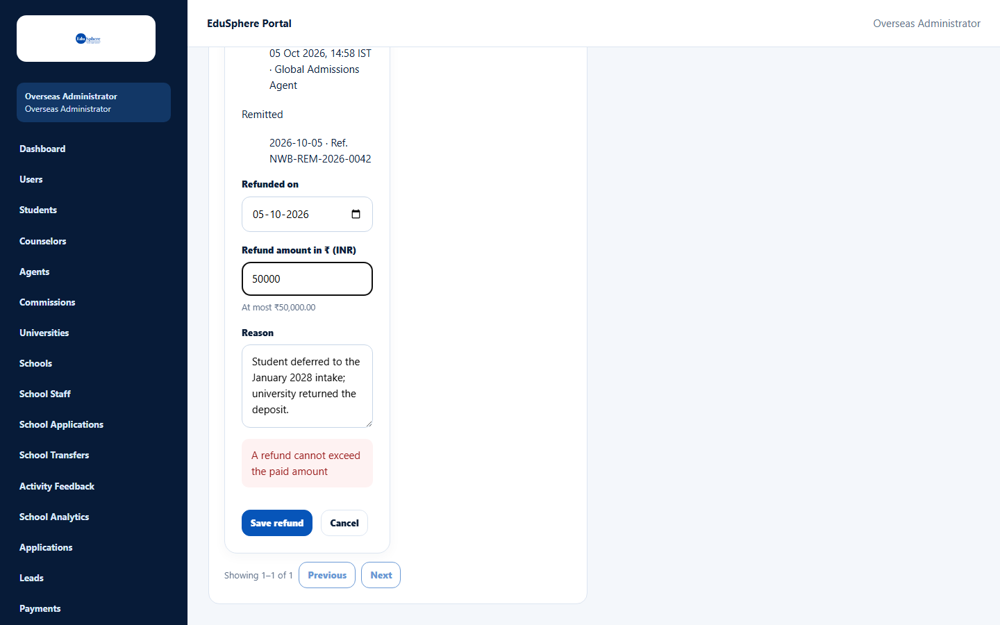
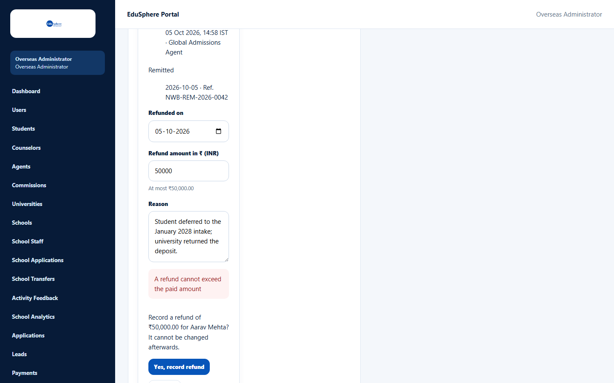
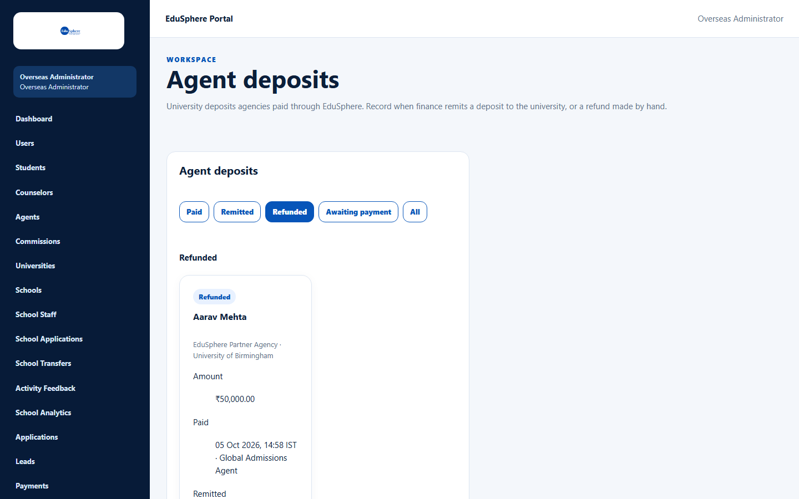
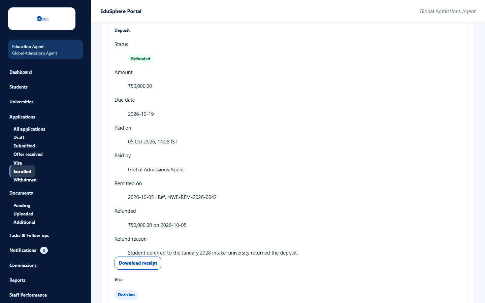
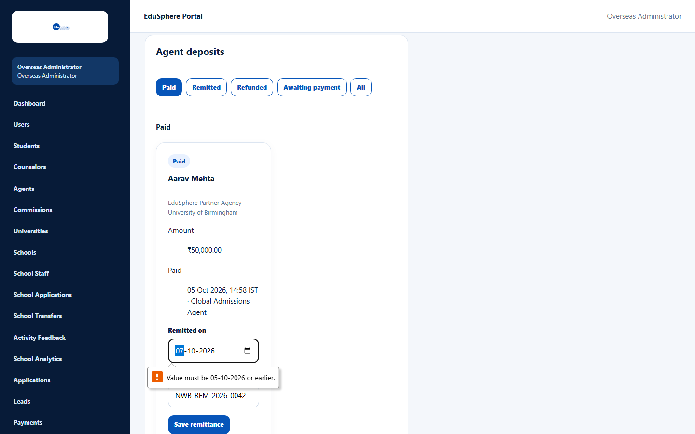
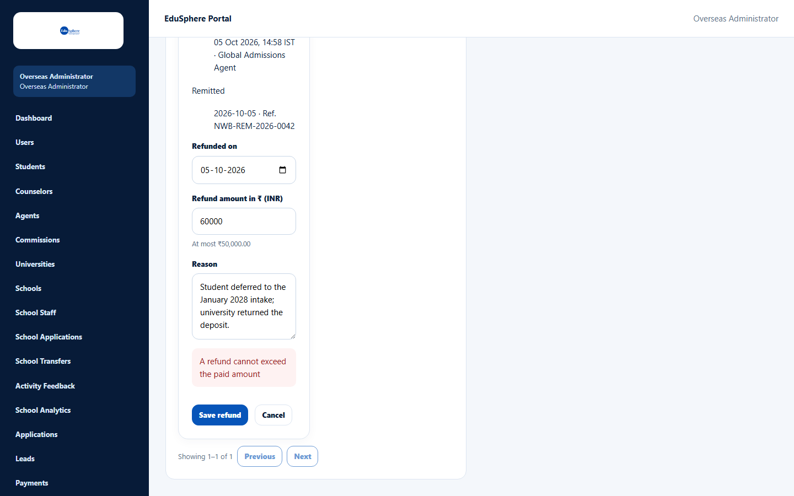

# Agent deposits — remittance and refund

> Doc ID: DOC-ADM-005 · Verified 2026-10-05 against docs commit `717d6aa8` (`main` @ `6a9be770`) · Roles: Overseas Admin

## Purpose
Track university deposits that agencies paid through EduSphere, and record when finance forwards a deposit to the
university (remittance) or refunds it.

## Who Can Use This Feature
**Overseas Admin.** Super Admin can see the list but cannot record anything.

## Prerequisites
An agency has paid a deposit (see the user manual: [Deposit and payment](../user-manual/applications/app-007-deposit-and-payment.md)).

## How to Access
Overseas Admin sidebar > **Agent deposits**.

## Steps

### Step 1 — Find the deposit
"University deposits agencies paid through EduSphere. Record when finance remits a deposit to the university, or a
refund made by hand." Tabs: **Paid** (default), **Remitted**, **Refunded**, **Awaiting payment**, **All**. Each card
shows the student, agency and university, **Amount** and when and by whom it was **Paid**.

### Step 2 — Record a remittance
1. On a **Paid** deposit, click **Record remittance**.
2. Enter **Remitted on** (not in the future, not before the payment) and the **Remittance reference**.
3. Click **Save remittance**. The message "Remittance recorded for {student}." appears and the deposit moves to
   **Remitted**.

### Step 3 — Record a refund
1. On a **Paid** or **Remitted** deposit, click **Record refund**.
2. Enter **Refunded on**, the **Refund amount in ₹ (INR)** ("At most ₹{paid amount}") and the **Reason**.
3. Click **Save refund**, read "Record a refund of ₹{amount} for {student}? It cannot be changed afterwards." and click
   **Yes, record refund** (or **Go back**).

The message "Refund recorded for {student}." appears and the deposit moves to **Refunded**.

The agency sees the remittance and refund on the application's Deposit section:

## Fields
| Field | Description | Required | Example |
|---|---|---|---|
| Remitted on | Date finance sent the money. | Yes (remittance) | 05-10-2026 |
| Remittance reference | Bank or finance reference, up to 100 characters. | Yes (remittance) | NWB-REM-2026-0042 |
| Refunded on | Date of the refund. | Yes (refund) | 05-10-2026 |
| Refund amount in ₹ (INR) | More than ₹0 and at most the paid amount. | Yes (refund) | 50000 |
| Reason | Why the deposit was refunded, up to 500 characters. | Yes (refund) | Student deferred to the January 2028 intake. |

## Expected Result
| Status | Actions available |
|---|---|
| Paid | Record remittance, Record refund |
| Remitted | Record refund |
| Refunded / Awaiting payment | None |

Each remittance and refund is written to the audit log. One refund per deposit; the refund is recorded by hand
(EduSphere does not send money back through Razorpay).

## Validation Messages
| Message | When |
|---|---|
| Value must be {today} or earlier. (browser message) | The date is in the future. |
| The date cannot be before the deposit was paid | The date is before the payment. |
| Enter the remittance reference / Enter the refund reason | A required field is empty. |
| A refund cannot exceed the paid amount | The refund amount is more than was paid (shown after confirming). |
| Only a paid deposit can be marked remitted / Only a paid or remitted deposit can be refunded | Wrong status. |
| Only an Overseas Admin can record remittances and refunds | A Super Admin tried. |

## Common Errors
**Problem:** "A refund cannot exceed the paid amount".
**Cause:** The amount is higher than the deposit.
**Resolution:** Click **Go back** if needed and enter at most the amount shown under the field.

## Tips
- A refund cannot be changed after it is recorded — check the amount before confirming.

## Related Features
- User manual: [Deposit and payment](../user-manual/applications/app-007-deposit-and-payment.md)
- [Agency detail](adm-003-agency-detail.md) — deposit totals per agency
