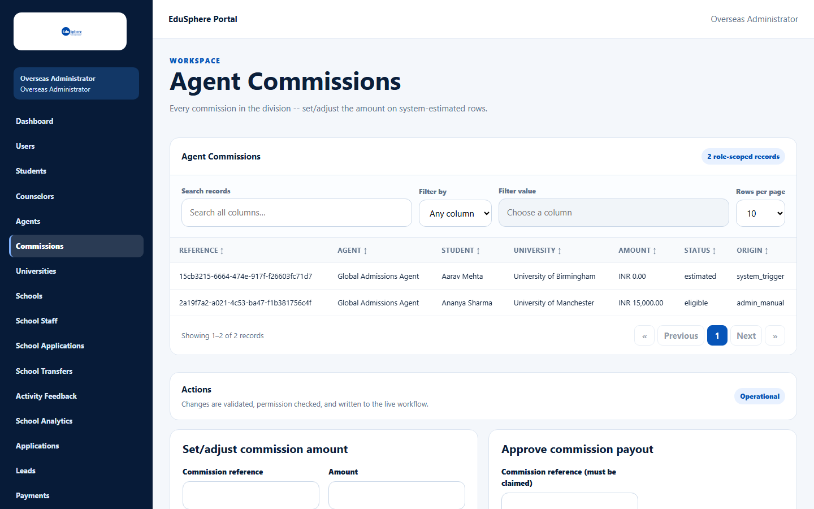
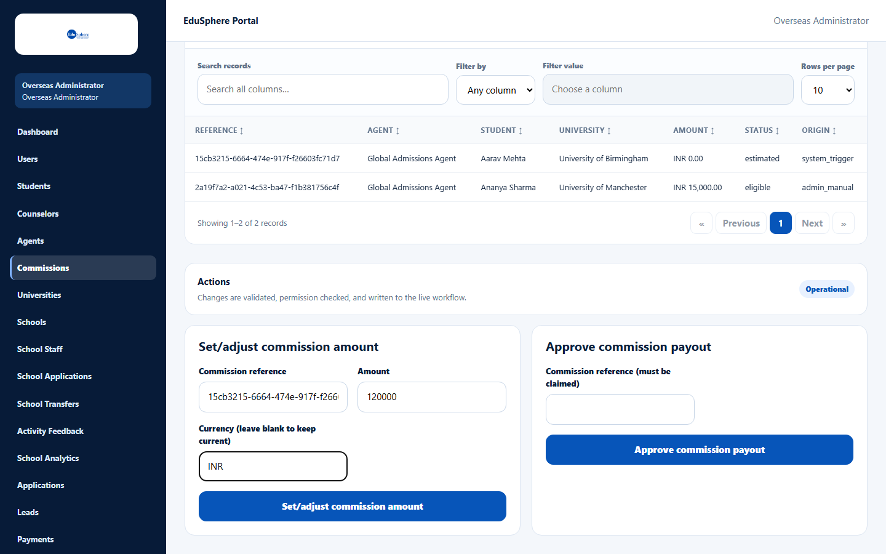
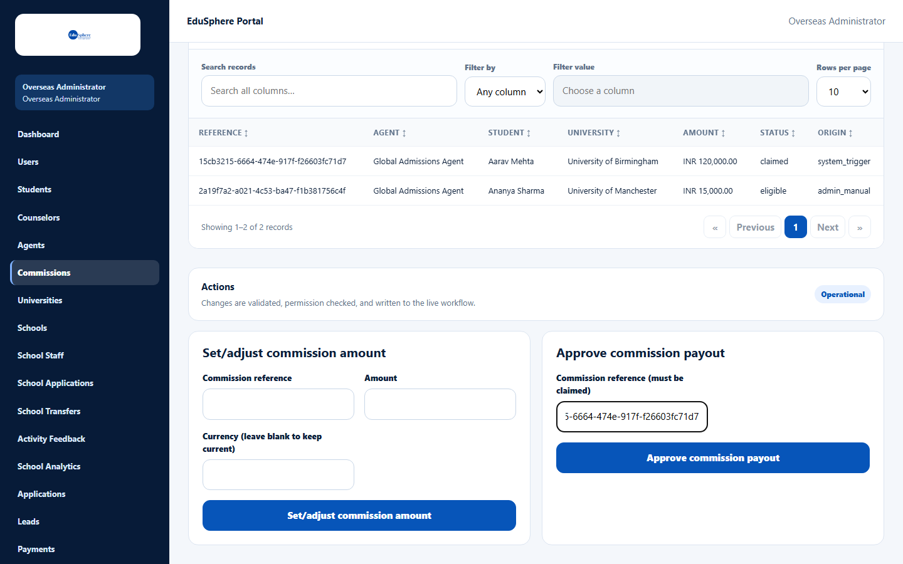
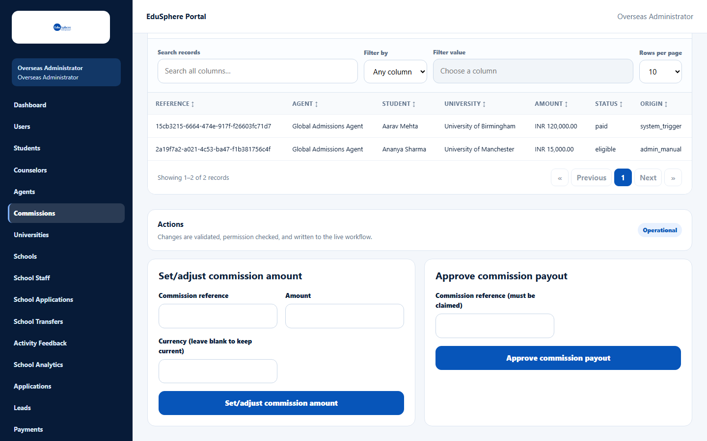

# Commission amounts and payouts

> Doc ID: DOC-ADM-006 · Verified 2026-10-05 against docs commit `717d6aa8` (`main` @ `6a9be770`) · Roles: Overseas Admin

## Purpose
Set the amount of each agency commission and approve its payout after the agency claims it.

## Who Can Use This Feature
**Overseas Admin.** A Super Admin cannot open this page ("Access unavailable — Workspace not found"; see
[Super Admin access](adm-007-super-admin-access.md)).

## Prerequisites
A commission exists — created automatically with status **estimated** when an application reaches **Enrolled**.

## How to Access
Overseas Admin sidebar > **Commissions**.

## Steps

### Step 1 — Find the commission
The table **Agent Commissions** ("Every commission in the division -- set/adjust the amount on system-estimated
rows.") lists Reference, Agent, Student, University, Amount, Status and Origin (**system_trigger** for automatic,
**admin_manual** for manually created).

### Step 2 — Set the amount
In **Set/adjust commission amount**, enter the **Commission reference** (copy it from the table), the **Amount** and
optionally the **Currency (leave blank to keep current)**, then submit. The message **Commission amount updated.**
appears and an estimated commission becomes **eligible** — the agency can now claim it.

### Step 3 — Approve the payout
After the agency claims the commission (status **claimed**), enter its reference in **Approve commission payout**
("Commission reference (must be claimed)") and submit. The message **Payout approved -- commission marked paid.**
appears and the status becomes **paid**.

## Fields
| Field | Description | Required | Example |
|---|---|---|---|
| Commission reference | The commission's Reference. | Yes | 15cb3215-6664-474e-917f-f26603fc71d7 |
| Amount | Commission amount. | Yes (set amount) | 120000 |
| Currency (leave blank to keep current) | Currency code. | No | INR |

## Expected Result
| Status | Set by |
|---|---|
| estimated | System, at enrollment |
| eligible | Overseas Admin sets the amount (manually created commissions start here) |
| claimed | Agency Master claims |
| payout_pending → paid | Overseas Admin approves the payout |

## Validation Messages
| Message | When |
|---|---|
| Commission amount can no longer be adjusted once claimed | The agency already claimed it. |
| Commission must be claimed by the Agent before payout can be approved | Not claimed yet. |
| The Overseas Admin who created this commission cannot also approve its own payout | Manually created commissions need a second admin to approve. |
| Commission not found | Wrong reference. |

## Common Errors
**Problem:** "…cannot also approve its own payout".
**Cause:** You created this commission manually (Origin **admin_manual**).
**Resolution:** Ask another Overseas Admin to approve the payout.

## Tips
- Set the amount promptly: an agency can claim an **estimated** commission, and after a claim the amount can no longer be set (it stays 0).
- Commissions created automatically at enrollment (**system_trigger**) can be approved by the same admin who set the amount.

## Related Features
- User manual: [View and claim commissions](../user-manual/commissions/comm-001-commissions.md)
