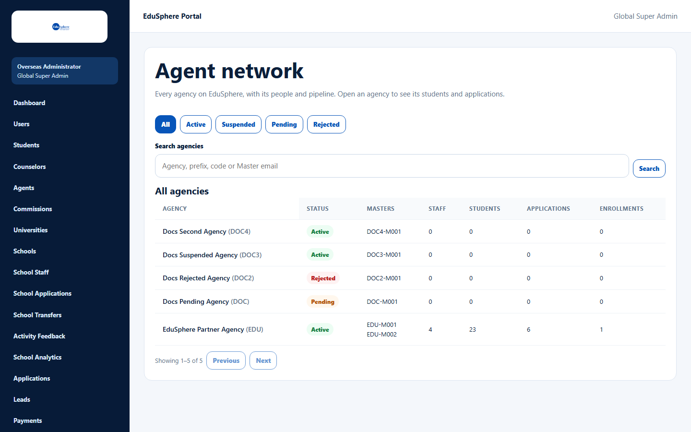
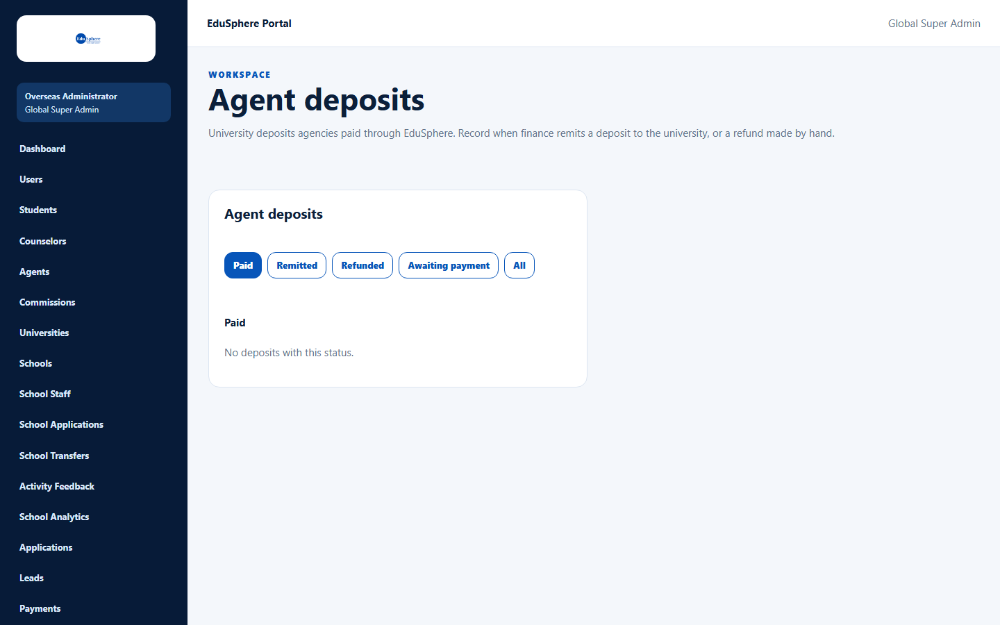
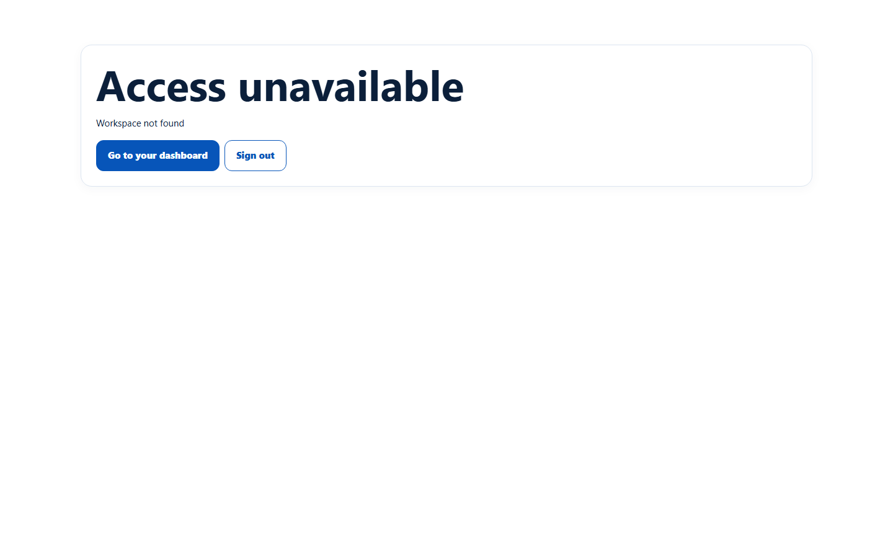

# Super Admin access to agency screens

> Doc ID: DOC-ADM-007 · Verified 2026-10-05 against docs commit `717d6aa8` (`main` @ `6a9be770`) · Roles: Super Admin

## Purpose
Explains what a Super Admin can see and do on the agency screens. Agency management is the Overseas Admin's job; a
Super Admin mostly has read-only access.

## Who Can Use This Feature
**Super Admin** (signs in at `/admin/login` and lands on `/admin`).

## Prerequisites
None.

## How to Access
The Super Admin sidebar has **no** agency links. Type the addresses below in the browser.

## Steps

### What works
| Address | Screen | What a Super Admin can do |
|---|---|---|
| `/overseas/admin/agent-network` | Agent network | View, filter, search; open agencies (read-only — no Suspend) |
| `/overseas/admin/agent-network/{id}` | Agency detail | View summary, money and records (no Suspend/Reinstate) |
| `/overseas/admin/agent-deposits` | Agent deposits | View the tabs; no Record remittance / Record refund |

### What does not work
| Address | Result |
|---|---|
| `/overseas/admin/agents` (agency approvals) | "Access unavailable — Workspace not found" |
| `/overseas/admin/commissions` | "Access unavailable — Workspace not found" |
| `/overseas/admin/applications` | "Access unavailable — Workspace not found" |

## Fields
None.

## Expected Result
Approvals, suspensions, deposits and commissions are handled by an Overseas Admin account.

## Validation Messages
| Message | When |
|---|---|
| Access unavailable — Workspace not found | The Overseas Admin workspace page is not available to Super Admin (the page has no data for a user without a division). |

## Common Errors
**Problem:** A Super Admin cannot approve an agency.
**Cause:** The Agents screen is only available to Overseas Admins.
**Resolution:** Sign in with an Overseas Admin account.

## Tips
- Use an Overseas Admin account for day-to-day agency administration.
- These are screen restrictions. The API itself accepts some agency and commission actions from a Super Admin; this is
  recorded as a product finding in the documentation review report.

## Related Features
- [Agent network](adm-002-agent-network.md)
- [Agent deposits](adm-005-agent-deposits.md)
