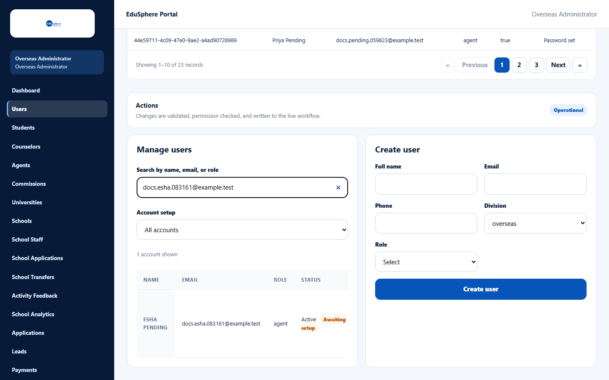
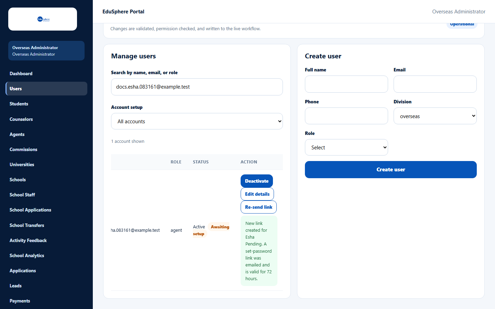

# Re-send a set-password link

> Doc ID: DOC-ADM-008 · Verified 2026-10-05 against docs commit `717d6aa8` (`main` @ `6a9be770`) · Roles: Overseas Admin

## Purpose
Send a new "set your password" link to an agency staff member or invited Master who has not set a password yet (for
example the first email was lost or the link expired).

## Who Can Use This Feature
**Overseas Admin.** (Agency Masters can do the same for their own staff with **Reset** on the Team page.)

## Prerequisites
The account is active and still waiting for setup (its password has never been set).

## How to Access
Overseas Admin sidebar > **Users** > **Manage users**.

## Steps

### Step 1 — Find the account
In **Search by name, email, or role**, type the person's email and press Enter. Optionally set **Account setup** to
show only accounts awaiting setup. The row's status shows **Awaiting setup**.

### Step 2 — Re-send
Click **Re-send link** on the row. The message "New link created for {name}. A set-password link was emailed and is
valid for 72 hours." appears.

## Fields
| Field | Description | Required | Example |
|---|---|---|---|
| Search by name, email, or role | Finds the account. | No | esha@agency.example |
| Account setup | Filters by setup state. | No | All accounts |

## Expected Result
The person receives a new email; the previous link stops working.

## Validation Messages
| Message | When |
|---|---|
| A link was just sent; wait N seconds before re-sending | Re-send was pressed again within a minute. |
| This account has no pending invitation (its password is already set) | The person already set a password — they should use **Forgot your password?** instead. |
| Reactivate this account before re-sending its link | The account is deactivated. |
| …The email was not delivered (…). Re-send the link from the Users page or dashboard once email works… | The email could not be sent. |

## Common Errors
**Problem:** No **Re-send link** button on the row.
**Cause:** The person has already set a password, or the account is deactivated.
**Resolution:** Ask them to use **Forgot your password?** on the sign-in page.

## Tips
- The Users page lists users of every Overseas role; search by email to find agency staff quickly.

## Related Features
- User manual: [Create a staff login](../user-manual/team/team-002-create-staff.md),
  [Reset your password](../user-manual/account-access/auth-004-reset-password.md)
