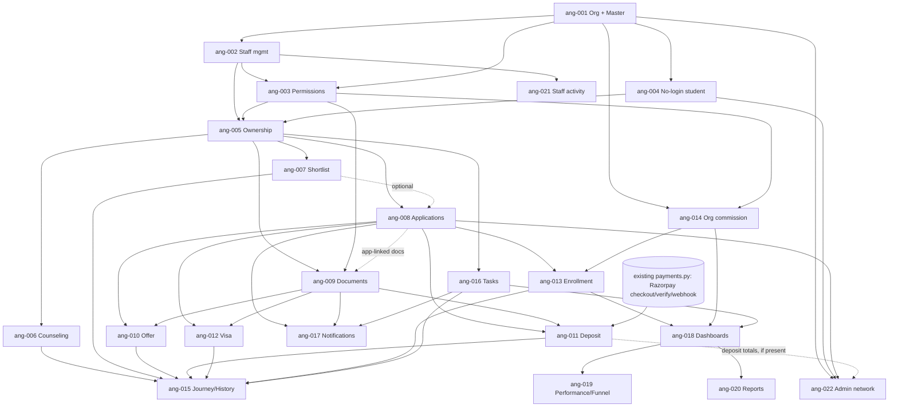

# Agent CRM — Engineering Enhancement Backlog (`ang-001` … `ang-022`)

NO-ASSUMPTION MODE. Prepared 2026-09-28 at the user's request. **No code was written or changed.**

> **Status note, 2026-10-02 (added when this file was first committed; the body below is unchanged from 2026-09-28).**
> The repo's feature IDs are `AGN-0xx`; this backlog's `ang-0xx` items map to them as shown. Statuses and decision
> numbers in the body are as of 2026-09-28 and are **not** refreshed — the authoritative status is
> `ENHANCEMENT_BACKLOG.md` and `RTM.md`.
>
> | Shipped / in review | Covers | Decision | Delivery |
> |---|---|---|---|
> | `AGN-001` | ang-001 (organisation tenant, Masters) | `DEC-SCOPE-038` | PR #26 (merged) |
> | `AGN-002` | ang-002 (staff logins) | `DEC-SCOPE-040` | PR #28 (merged) |
> | `AGN-004` | ang-004 (no-login students) and the assignment part of ang-005 (G4 assigned-only scope) | `DEC-SCOPE-042` | PR #29 (merged) |
> | `AGN-003` | ang-003 (Master vs Staff permission matrix) | `DEC-SCOPE-044` | PR #33 (merged) |
> | `AGN-021` | ang-021 (staff activity view) | `DEC-SCOPE-046` | PR #35 (merged) |
> | `AGN-005` | closes the ang-003 §6 matrix gap for the AGN-004 student routes (tests and docs; not ang-005) | — | PR #36 (merged) |
> | `AGN-006` | ang-006 (counseling record) | `DEC-SCOPE-048` | PR #38 (merged) |
> | `AGN-007` | ang-007 (university shortlist, agency university database) | `DEC-SCOPE-049` | PR #39 (merged) |
> | `AGN-008` | ang-008 (applications for no-login students, sidebar filters) | `DEC-SCOPE-050` | branch `feature/agn-008-agent-applications` (PR pending; browser QA done, Codex review pending) |
> | `AGN-009` | ang-009 (documents: upload, download, verify, reject with a reason, requests, history; Pending/Uploaded/Additional) | `DEC-SCOPE-052` | branch `feature/agn-009-agent-documents` (implemented; browser validation and Codex review pending) |
> | `AGN-016` | ang-016 (tasks and follow-ups; "Pending actions" KPI only — the rest of ang-018 stays open) | `DEC-SCOPE-053` | branch `feature/agn-016-tasks-followups` (implemented; browser QA, full suites and Codex review pending) |
>
> Not started: ang-010 … ang-020 and ang-022. ang-005 is covered only as far as `AGN-004` D4/G4 (Master assigns a
> student to a staff member; staff see assigned students only) — check its remaining acceptance criteria before planning it.
> **Citation note:** the "`DEC-SCOPE-035`" this file cites as its scope decision was renumbered before merge;
> `DEC-SCOPE-035` on `main` is `ENH-027` (psychometric). AGN-004 and AGN-007 recorded this mis-citation; each shipped
> feature's own decision above is the one to follow.

- **Source:** `functionalities/edusphere_markdown/Agent CRM Functionalities.md` = `EVID-015` (`DERIVED_BLUEPRINT`).
  Read end-to-end (539 lines); the section-by-section coverage audit is in §1.
- **Scope authority:** `DEC-SCOPE-035` (2026-09-28, `EXPLICIT_APPROVAL`, decisions D1–D4), `DEC-ROLE-004` (agent
  students have no login; the agent acts on their behalf), `DEC-SCOPE-004`/`005` (agent approval, commission model) and
  `DEC-SCOPE-019` (no admin-known credential).
- **User instruction for this pass:** "some of the functionalities already exist" (verified in §0) and "students under
  the agent don't require login" (= `DEC-ROLE-004`, now implemented through `DEC-SCOPE-035` D3).
- **Method:** the graphify graph was queried first, then its findings were checked against source. The architecture
  context is in `docs/architecture/ARCHITECTURE_BASELINE.md`.
- **Gates:** every item is still behind `APPROVAL_GATES.md` GATE-09 (Coding). All 16 questions in §3 were answered on
  2026-09-28 (`DEC-SCOPE-035` D5–D21).
- **Decision-ID reconciliation pending (`AGN-001`):** this scope decision was renumbered `033` → `035` after
  `ENH-024`/`ENH-016` took `DEC-SCOPE-033`/`034` on `main` (PR #20, #22). The `feature/agn-001-multi-tenant-agent-crm`
  worktree still records its Agent CRM entry as `DEC-SCOPE-034` in uncommitted edits. Renumber it when that branch next
  merges `main`, and confirm whether it is the same decision as `DEC-SCOPE-035` or a separate one.

---

## 0. What already exists (verified in code, not assumed)

| Capability | Where | State vs this source |
|---|---|---|
| Agent self-registration + Overseas Admin approve/reject (`AGT-001`) | `auth.register` (`approval_status="pending"`), `admin.agents_router` `/overseas-admin/agents/{id}/approve|reject`, `GET /overseas-admin/agents`, `rbac.agent_is_approved`, `workflows._require` | **Keep.** Today this approves a *person*; it must become approval of the *organization* (ang-001). |
| Agent role | `rbac.PERMISSIONS["agent"]`, division `overseas`, one `User` per agent | **Single-user.** No organization, no staff, no Master/Staff split. |
| Referred-student roster (`AGT-002`) | `AgentStudent(agent_id→users, student_id→users)`, `GET/POST /workflows/overseas/agent/students` | **Conflicts with `DEC-ROLE-004`:** it links *existing self-registered `overseas_student` logins*. There is no way to create a student. |
| Agent creates an application | `POST /workflows/overseas/applications` (agent allowed when the `AgentStudent` link is active); `AgentApplicationCreatePanel.tsx` | Partial. Needs a `users` student (`student_id` required, `role=overseas_student`). |
| Agent lists applications | `GET /workflows/overseas/applications` (filtered by `agent_id == user.id`, `limit 500`, inner join on `User`) | Partial. Rows without a `User` student would silently disappear (inner join). |
| Agent changes status | — | **Missing.** `PATCH …/applications/{id}` allows counselor/university_rep/admin only; `/advance` allows counselor only. |
| Agent uploads/downloads documents | `POST /workflows/overseas/documents`, `GET …/documents/{id}/download` (agent scoped via `AgentStudent`) | Partial. `StudentDocument.student_id` is NOT NULL → `users`. Verify is counselor/admin only; there is no *reject* reason flow, no "request additional", no history. |
| Visa | `VisaCase` (`checklist→documentation→interview_prep→tracking→decision`), create/update counselor/admin only | Agent has **no** visa access. There is no application date, interview date or decision outcome (`VISA_DECISION_DISCLAIMER`). |
| Offer | `OverseasApplication.offer_letter_url`, stage `offer` | No conditional/unconditional type, date, deadline or conditions. |
| Deposit | — | **Missing.** `Payment.user_id` is NOT NULL → `users`, so it cannot hold a no-login student. |
| Enrollment | stage `enrolled` → `_maybe_trigger_agent_commission` (`AGT-003`) | Status only. No enrollment date, university student ID or confirmation. |
| Commission (`AGT-003`/`004`) | `AgentCommission(agent_id→users)`, claim, admin amount, payout approval | **Keep**, but it is keyed to a person, not an organization. |
| Agent portal | `PORTAL_NAV["overseas/agent"]` = dashboard/students/applications/documents/commissions/reports; `services/portal._agent` | A generic read-only table view. The KPIs are computed in Python over full row lists. |
| Tasks/follow-ups, staff mgmt, performance, funnel, assignment, counseling, shortlist | — | **Missing.** |

**Existing defect noticed (report only, not fixed):** the "Offers" count in `services/portal._agent` (reports section) and
in `portal.py:554,603` counts `status in {"offer_received","accepted"}`. The confirmed stage list
(`OVERSEAS_APPLICATION_STAGES`) uses `"offer"`, so applications moved through `/advance` are never counted as offers.
It is carried into ang-018 as a regression to fix deliberately.

---

## 1. Source coverage audit (section by section)

| Source § | Content | Covered by | Notes |
|---|---|---|---|
| Preamble / §1 | 2-level login per agent org: Master (full), Staff (student journey only); Master creates/manages/deactivates/monitors staff | ang-001, ang-002, ang-003 | — |
| §2 Master dashboard | 14 KPIs (Total Students … Commission/Revenue, Reports) | ang-018 | Revenue = commission only (D15) |
| §2 Students | create, edit, view all, assign, reassign, delete/archive, complete history | ang-004, ang-005, ang-015 | archive; hard delete only if empty (D13) |
| §2 Applications | create, edit, view all, change status, monitor deadlines, application performance | ang-008, ang-017, ang-019 | mapped onto existing stages; agents advance (D7, D8) |
| §2 Documents | upload, download, verify, reject, request additional, complete history | ang-009 | — |
| §2 Staff | create login, edit, activate/deactivate, reset password, assign students, set permissions, view activity, view performance | ang-002, ang-003, ang-005, ang-021, ang-019 | reset = re-issue link (D2) |
| §2 Reports | student, application, university, country, intake, staff performance, enrollment, commission | ang-020 | structured month + year intake (D16) |
| §3 Staff creation | Staff ID (auto), Name, Email, Mobile, Designation, Branch, Username, Temporary Password, Joining Date, Status, Assigned Students, Permission Level; codes `ABC-M001`/`ABC-S001` | ang-001 (codes), ang-002 | **Username/Temporary Password not built (D2).** Branch = managed list (D10) |
| §4 Staff sidebar | Dashboard; My Students (All/Add/Journey); Applications (All/Draft/Submitted/Offer Received/Visa/Enrolled); Documents (Pending/Uploaded/Additional); Tasks & Follow-ups; Notifications | ang-018 (nav), ang-008, ang-009, ang-016, ang-017 | Draft/Submitted derived from `submitted_at` (D7) |
| §5 Step 1 Create student | personal, academic, contact, preferred country/course/intake | ang-004 | — |
| §5 Step 2 Counseling | completed, career interest, course pref, country pref, budget, remarks | ang-006 | — |
| §5 Step 3 Shortlisting | university, course, country, intake, tuition fee, entry requirements | ang-007 | D4 |
| §5 Step 4 Documents | passport, academic certs, transcripts, English test, CV, SOP, LOR, financial, other | ang-009 | — |
| §5 Step 5 Application | university, course, intake, submit, application ID, submission date, status | ang-008 | — |
| §5 Step 6 Offer | conditional/unconditional, offer date, deadline, conditions, document | ang-010 | — |
| §5 Step 7 Deposit | required, amount, payment status, date, receipt | ang-011 | collected via Razorpay, agent pays (D11, D12) |
| §5 Step 8 Visa | documents, application date, appointment, interview, status, decision | ang-012 | approved/refused/withdrawn (D14) |
| §5 Step 9 Enrollment | confirmed, university, course, intake, date, student ID, final status | ang-013 | — |
| §6 Permission matrix | 23 rows Master vs Staff | ang-003 (enforced by every item) | the two toggles (D6) |
| §7 Staff ownership | "Assigned Staff" on every student; staff see only their own | ang-005 | — |
| §8 Staff performance | per-staff counts + funnel | ang-019 | — |
| §9 Login hierarchy | EduSphere Admin → Org → Master(s) → Staff → Students | ang-001, ang-022 | up to 3 Masters (D5) |
| "Best approach" | multi-tenant; central admin sees network "according to the permissions you define" | ang-001, ang-022 | read-all, limited actions (D17) |
| "Best approach" | integration with University Partnership CRM and School CRM (School → Agent → University) | **Not itemised** | Depends on `EVID-020` (unapproved) → **out of scope for now (D21)** |
| §6 "CRM Settings" | Master only | **Not itemised** | **Deferred until defined (D20)** |

---

## 2. Backlog summary

| ID | Title | Cx | Risk | Migration | Depends on |
|---|---|---|---|---|---|
| ang-001 | Agent Organization tenant + Master account foundation | L | High | Yes | — |
| ang-002 | Staff account management + branches (create/edit/activate/deactivate/re-issue link) | M | High | Yes | 001 |
| ang-003 | Master vs Staff permission model and enforcement | M | High | Yes (flags) | 001, 002 |
| ang-004 | No-login agent student record (create/edit/view/archive) | L | High | Yes | 001 |
| ang-005 | Staff ownership: assign/reassign + scoped visibility | M | High | Yes | 002, 003, 004 |
| ang-006 | Counseling record (Step 2) | S | Low | Yes | 004, 005 |
| ang-007 | University shortlisting (Step 3) | M | Medium | Yes | 004, 005 |
| ang-008 | Applications on behalf of no-login students (Step 5) | L | High | Yes | 004, 005 |
| ang-009 | Documents: upload/verify/reject/request/history (Step 4) | L | High | Yes | 003, 004, 005, (008) |
| ang-010 | Offer details (Step 6) | M | Medium | Yes | 008, 009 |
| ang-011 | Deposit collection through Razorpay (Step 7) | L | High | Yes | 008, 009 |
| ang-012 | Visa for agent-managed applications (Step 8) | M | Medium | Yes | 008, 009 |
| ang-013 | Enrollment confirmation + commission trigger (Step 9) | M | High | Yes | 008, 014 |
| ang-014 | Organization-level commission | M | High | Yes | 001, 003 |
| ang-015 | Student journey view and complete history | M | Low | No | 004–013 (incremental) |
| ang-016 | Tasks and follow-ups | M | Medium | Yes | 004, 005 |
| ang-017 | Agent notifications + deadline reminders | M | Medium | No* | 008, 009, 016 |
| ang-018 | Master/Staff dashboards and role-specific navigation | M | Medium | No | 005, 008–014 |
| ang-019 | Staff performance and student funnel | M | Medium | No | 018 |
| ang-020 | Reports (8) + CSV export | M | Medium | No | 018 |
| ang-021 | Staff activity view | S | Medium | No | 002 |
| ang-022 | EduSphere Admin: agent network oversight | M | Medium | No | 001, 004, 008 |

\* ang-017 needs the first Celery `beat_schedule` (config, not schema).

---

## 3. Questions — all answered 2026-09-28 (`DEC-SCOPE-035` D5–D21)

Every question below was put to the user directly and answered in-session (`EXPLICIT_APPROVAL`). No item is blocked on
an open question any more. Remaining "spec decision" notes inside items are design details for each item's spec, not
scope questions.

| Q | Question | Answer | Decision | Items |
|---|---|---|---|---|
| Q-01 | Masters per organization | **At most 3.** An existing Master invites more (set-password link) and can deactivate a Master, but never the last active one | D5 | 001, 002 |
| Q-02 | Staff "Branch" | **Master-managed branch list.** Display and report filter only; no visibility effect | D10 | 002, 020 |
| Q-03 | Permission levels | **Fixed §6 matrix + 2 toggles:** `can_verify_documents`, `can_view_own_reports` | D6 | 003 |
| Q-04 | Sidebar statuses vs stages | **Map onto existing stages.** Draft = not submitted, Submitted = has `submitted_at` (new); stage list unchanged | D7 | 008, 018 |
| Q-05 | Who advances agent applications | **Agent Master and Staff** (forward-only + history); no EduSphere counselor required | D8 | 008, 010, 012, 013 |
| Q-06 | Deposit money flow | **Collected through EduSphere Razorpay; the agent (Master or Staff) pays at checkout** on the student's behalf. No link is sent to the student | D11 | 011 |
| Q-06b | Settlement and refunds | **EduSphere finance remits outside the system; Overseas Admin marks it `remitted`.** Refunds are recorded manually by Overseas Admin; no refund API | D12 | 011, 022 |
| Q-07 | Hard delete | **Archive always; hard delete only when the student has no applications, documents or payments** | D13 | 004 |
| Q-08 | Visa outcomes | **approved / refused / withdrawn**, at the `decision` stage only | D14 | 012 |
| Q-09 | Legacy agents and linked logins | **Each existing agent → Master of an auto-created org; legacy links stay read-only; the "link existing login" action is retired** | D9 | 001, 004 |
| Q-10 | "Revenue" | **Commission only** | D15 | 018 |
| Q-11 | CRM Settings | **Deferred until defined; not built** | D20 | — |
| Q-12 | Intake | **Structured month + year on new agent records**; existing free text unchanged | D16 | 004, 008, 020 |
| Q-13 | Central admin powers | **Read-all; act only on org approve/suspend, commission, and deposit remit/refund recording.** No edits to agent students | D17 | 022 |
| Q-14 | Cross-org duplicate students | **Allowed, orgs isolated;** duplicate warning within the same org only; commission per application | D18 | 004, 013 |
| Q-15 | School → Agent handover | **Out of scope for now** | D21 | — |
| Q-16 | Notification channels | **In-app + email to agent Masters/Staff; students get nothing** | D19 | 017 |

---

## 4. Backlog items

Conventions used below: **"org scope"** means every query filters on the caller's `agent_organization_id` (tenant
isolation). **"own scope"** means Staff additionally only see students where they are the assigned staff. Proposed
table and column names are placeholders for the design spec, not decisions.

---

### ang-001 — Agent Organization tenant + Master account foundation

- **Business requirement:** every agent company is a separate CRM tenant ("multi-tenant Agent CRM") with a Master login that has full access (§1, §9, Best approach). Codes like `ABC-M001` identify accounts.
- **Existing behavior:** an agent is a single `User(role="agent", division="overseas")`. Approval is per user (`UserRoleAssignment.approval_status`). There is no organization, and all agent data is keyed on `users.id`.
- **Expected behavior:** new `AgentOrganization` (name, unique code prefix e.g. `ABC`, status `pending|active|suspended`, approval fields, sequence counters). Membership table (user → org, member type `master|staff`, member code `ABC-M001`, status). Agent self-registration creates a pending org plus its first Master. Overseas Admin approves or rejects the **org**. A suspended org blocks all of its members. One shared helper resolves `(org_id, member_type)` for the current user and is the single tenant-isolation point. Existing agents are migrated to one auto-created org each and become its Master; their legacy `AgentStudent` links stay read-only (D9). **Up to 3 active Masters per org** (D5): any active Master can invite another Master (set-password link, as in ang-002) and deactivate one, but never the last active Master.
- **User roles affected:** `agent` (becomes Master), `overseas_admin`, `super_admin`.
- **Frontend impact:** registration form gains an organization name (+ code prefix, or server-generated); `AgentApprovalPanel` shows orgs; Master sees the org name and code in `PortalShell`.
- **Backend impact:** new org-scope helper (recommended: `app/api/agent_scope.py`, not inside `workflows.py`); `rbac.agent_is_approved` → "org active and member active"; `auth.register`; `admin.approve_agent/reject_agent/list_agents`.
- **Database impact:** `agent_organizations` and `agent_members` tables; data migration for existing agents; code-sequence uniqueness (`uq_agent_member_code`).
- **API impact:** `/overseas-admin/agents*` responses become org-shaped (breaking for `AgentApprovalPanel` and its tests); new `GET /agent/organization` (own org summary); `POST /agent/masters` (invite, cap 3), `POST /agent/masters/{id}/deactivate|activate`; `POST /workflows/overseas/agent/students` (link an existing login) **retired** (D9).
- **Integration impact:** none.
- **Authentication impact:** login is unchanged. Since `get_current_user` reloads `User.active` every request, suspending an org must also be checked per request (via the helper), not only at login.
- **Authorization impact:** new tenant boundary. Master = full within the org. Every agent route must go through the helper. The legacy `user.role == "agent"` checks (≈23 call sites in `workflows.py`, `portal.py`) keep working for Masters.
- **Security impact:** **highest in this backlog.** Cross-tenant IDOR is the main risk. The org id must come from the membership row, never from the client. Code prefix uniqueness and enumeration need care.
- **Performance impact:** one extra membership lookup per request (can be eager-loaded with `role_assignments`).
- **Reusable existing modules:** `UserRoleAssignment` approval pattern, `admin.agents_router`, `AuditLog`, `core/identifiers.py` (code generation), `AgentApprovalPanel.tsx`.
- **Dependencies:** none (foundation).
- **Acceptance criteria:**
  1. Registering as an agent creates exactly one pending org and one Master member with code `<PREFIX>-M001`.
  2. Until the org is approved, the Master is denied every agent route (today's `AGT-001-AC02` behavior, preserved).
  3. Approve and reject act on the org and write an audit row.
  4. Suspending an org denies every member on their next request.
  5. After migration, each pre-existing agent is the Master of its own active or pending org with unchanged data access.
  6. No agent route returns data from another org (a cross-tenant test exists for every read and write).
  7. A 4th Master invite → 422; deactivating the last active Master → 422; Master codes `M001`–`M003` are never reused.
- **Positive scenarios:** register → approve → Master logs in and sees an empty CRM; a migrated agent keeps its students, applications and commissions.
- **Negative scenarios:** a pending/rejected/suspended org is denied (403); a non-admin approving → 403; a Master of org A requesting an org B id → 404/403 (no existence leak).
- **Edge cases:** duplicate code prefix (409 or auto-suffix); a legacy agent with a `rejected` assignment is migrated as a rejected org; two Masters concurrently inviting a 3rd and 4th (lock the org row, so the cap holds); a Master deactivated while the others are active.
- **Regression risks:** `test_agt_001…004`, `AgentApprovalPanel` E2E, `_require`/`agent_is_approved` shared by all overseas routes, and the portal dispatcher.
- **Complexity:** large · **Risk:** high

---

### ang-002 — Staff account management

- **Business requirement:** Master creates, edits, activates/deactivates and resets staff logins; Staff ID is auto-generated (§2 Staff, §3).
- **Existing behavior:** none. The only similar flow is school staff provisioning (`admin.py` `/overseas-admin/school-staff`, `services/provisioning.py`).
- **Expected behavior:** Master → "Staff Management → + Add Staff" with Name, Email, Mobile, Designation, Branch (picked from the org's Master-managed branch list, D10), Joining Date, Status, Permission Level (ang-003) and optional initial Assigned Students (ang-005). The system creates `User(role="agent_staff", division="overseas")`, a membership row with code `<PREFIX>-S00n`, and emails a set-password link (`DEC-SCOPE-035` D2). Edit covers these fields. Deactivate/activate toggles `User.active` and the member status. "Reset password" re-issues the link. **Username and Temporary Password are not built.**
- **User roles affected:** Master (actor), `agent_staff` (new).
- **Frontend impact:** new `/overseas/agent/staff` list and form panel; a staff detail page; a Branches list editor for Masters.
- **Backend impact:** staff CRUD routes (org scope, Master only); `rbac.PERMISSIONS["agent_staff"]`; `provisioning` reuse; `auth.login` must accept the `agent_staff` role in the overseas division.
- **Database impact:** staff fields on `agent_members` (designation, `branch_id`, joining_date); new `agent_branches` table (org, name, active; unique name per org); unique email is already enforced on `users`.
- **API impact:** `GET/POST /agent/staff`, `PATCH /agent/staff/{id}`, `POST /agent/staff/{id}/activate|deactivate|resend-link`; `GET/POST/PATCH /agent/branches` (Master only).
- **Integration impact:** SMTP (welcome/set-password email). Unconfigured SMTP → reportable `not_configured` (existing ENH-003 behavior).
- **Authentication impact:** new role can log in; deactivated staff are rejected by `get_current_user` on the next request; set-password tokens use `PasswordResetToken`.
- **Authorization impact:** only the Master of the same org may manage staff; Staff can never manage staff (§6).
- **Security impact:** the email already belongs to another user/org → 409 without revealing which org; rate of link re-issue; the Master never receives a token or password.
- **Performance impact:** negligible.
- **Reusable existing modules:** `services/provisioning.py`, `PasswordResetToken`, `mailer.send_welcome_email`, `AdminSchoolStaffPanel.tsx` / `SchoolTeamPanel.tsx` patterns, ENH-010 activation pattern (`update_team_account`).
- **Dependencies:** ang-001.
- **Acceptance criteria:** creating staff yields code `<PREFIX>-S001`, `S002`, … unique per org and never reused; a set-password email is sent or reported; deactivated staff cannot call any API; reactivation restores access; a Master of another org cannot see or edit this staff member; every action is audited.
- **Positive scenarios:** create → email → staff sets password → logs in to the staff sidebar.
- **Negative scenarios:** Staff calling staff endpoints → 403; duplicate email → 409; invalid email → 422; a Master deactivating themselves → refused.
- **Edge cases:** deactivating staff who own students (their students stay assigned but become unowned-in-practice; see ang-005); re-issuing a link while an older one is unused (the old one is superseded); a concurrent code generation race (lock the org row).
- **Regression risks:** `auth.login` division/role handling; `provisioning` shared with school/admin flows (ENH-003 tests).
- **Complexity:** medium · **Risk:** high

---

### ang-003 — Master vs Staff permission model and enforcement

- **Business requirement:** the §6 matrix: Staff are limited to the student journey, with no admin modules; "Set permissions" / "Permission Level".
- **Existing behavior:** a single `agent` permission bundle; no staff concept.
- **Expected behavior:** one server-side capability check, e.g. `require_agent_capability(user, "documents.reject")`, backed by a fixed matrix of Master = all and Staff = the §6 ✅ rows, plus exactly two per-staff toggles (D6: `can_verify_documents`, `can_view_own_reports`). No named levels and no other toggles. Staff are denied: delete student, assign students, add university, staff management, staff performance, commission, CRM settings, and full reports.
- **User roles affected:** Master, Staff.
- **Frontend impact:** navigation and buttons are hidden according to capabilities (cosmetic; the server enforces); a permission toggle editor in the staff form.
- **Backend impact:** capability helper next to the ang-001 scope helper; used by every ang route.
- **Database impact:** toggle columns (or a JSON of flags) on `agent_members`.
- **API impact:** `GET /agent/me/capabilities` for the UI.
- **Integration impact:** none.
- **Authentication impact:** none.
- **Authorization impact:** this item *is* the authorization model, applied per request (not cached in the JWT), so a toggle change takes effect immediately.
- **Security impact:** deny-by-default; unknown capability → deny; a Staff member cannot grant themselves toggles.
- **Performance impact:** no additional query if loaded with the membership row.
- **Reusable existing modules:** `core/rbac.py` deny-by-default style, `deps.require_*` factory pattern.
- **Dependencies:** ang-001, ang-002.
- **Acceptance criteria:** every ❌ cell in §6 returns 403 for Staff with a test; every ✅ cell succeeds; toggles flip the two optional rows; a toggle change applies on the next request.
- **Positive scenarios:** Staff with `can_verify_documents` verifies a document.
- **Negative scenarios:** Staff without the toggle verifies → 403; Staff rejects a document → 403 (§6 ❌ regardless of toggle); Staff calls `/agent/staff` → 403.
- **Edge cases:** Staff cannot be promoted to Master in place (a Master is always a separate invite, D5); a toggle removed while the staff member has a form open.
- **Regression risks:** low on its own; high if any ang route forgets the helper (mitigate with a route-table test that asserts every `/agent/*` route declares a capability).
- **Complexity:** medium · **Risk:** high

---

### ang-004 — No-login agent student record

- **Business requirement:** Master/Staff create, edit, view and archive students who never log in (§2 Students, §5 Step 1; `DEC-ROLE-004`; `DEC-SCOPE-035` D3).
- **Existing behavior:** agents can only *link* an existing self-registered `overseas_student` login (`POST /workflows/overseas/agent/students`). There is no create.
- **Expected behavior:** new org-owned student record (no `users` row) with an auto student reference, personal (name, DOB, gender, nationality, passport no. — field list to confirm in the spec), academic (highest qualification, institution, score, year), contact (email, phone, address), preferences (country, course, intake as structured month + year, D16), assigned staff (ang-005) and status `active|archived`. Staff create students assigned to themselves. Master and Staff may edit (within scope). Only the Master archives; the Master may hard-delete only a student with no applications, documents or payments (D13). Duplicate warning within the org only, on email/phone/passport; the same person may exist in other orgs, which stay isolated (D18). Legacy linked-login students (D9) are listed read-only under a separate "Legacy linked students" view.
- **User roles affected:** Master, Staff.
- **Frontend impact:** "My Students → All Students / Add Student"; student form and detail page.
- **Backend impact:** CRUD routes in a new agent router module (not `workflows.py`); duplicate-check query; archive semantics.
- **Database impact:** new table (e.g. `agent_managed_students`) with `agent_organization_id` indexed, `assigned_staff_user_id`, a unique student reference; the legacy `agent_students` table stays as it is, read-only (D9).
- **API impact:** `GET/POST /agent/students`, `GET/PATCH /agent/students/{id}`, `POST /agent/students/{id}/archive`, `DELETE /agent/students/{id}` (Master, only when empty → else 409), `GET /agent/legacy-students` (read-only). Paginated list (`Page<T>` envelope).
- **Integration impact:** none.
- **Authentication impact:** none. The student never authenticates.
- **Authorization impact:** org scope for all; own scope for Staff; archive is Master only.
- **Security impact:** passport number and DOB are sensitive PII. Never log them; restrict their appearance in list payloads; audit metadata carries IDs only (existing convention).
- **Performance impact:** list pagination, indexes on `(agent_organization_id, assigned_staff_user_id, status)`.
- **Reusable existing modules:** `SchoolStudent` model/validation (`_master_fields_or_422`, `SchoolStudentFields.tsx` pattern), `core/identifiers` student code, `_flush_or_409`, `apiErrors.sendJson`, `isPage`.
- **Dependencies:** ang-001.
- **Acceptance criteria:** create/edit/view/archive work for the right roles; an archived student leaves default lists but remains in history and reports; Staff cannot see a student assigned to someone else (404); no `users` row is ever created for an agent student; the within-org duplicate warning fires.
- **Positive scenarios:** Staff adds a student → it appears in their list; Master sees every student.
- **Negative scenarios:** missing name → 422; Staff archiving → 403; cross-org GET → 404.
- **Edge cases:** archiving a student with live applications (block, or allow with a warning: spec decision); editing while reassigned; very long names or non-Latin scripts.
- **Regression risks:** `AGT-002` tests and the agent portal "students" section (`services/portal._agent`) if the legacy table is touched.
- **Complexity:** large · **Risk:** high

---

### ang-005 — Staff ownership: assign / reassign + scoped visibility

- **Business requirement:** "Assigned Staff" on every student; Staff see only their assigned students; Master assigns and reassigns (§2, §6, §7).
- **Existing behavior:** none.
- **Expected behavior:** Master assigns a student to one active staff member (or to themselves). Reassignment moves the ownership of the student's applications, documents and tasks visibility with it (derived from the student, not copied). Assignment history is kept. Deactivated staff's students show as "needs reassignment".
- **User roles affected:** Master (actor), Staff (visibility).
- **Frontend impact:** assign/reassign control on the student list and detail pages, a bulk reassign, and a "Students by Staff" filter.
- **Backend impact:** assignment route; own-scope query helper (analogue of `schools._scoped_students_query`) used by ang-004/006–016.
- **Database impact:** assignment history table (student, from, to, by, at).
- **API impact:** `POST /agent/students/{id}/assign`, `POST /agent/students/bulk-assign`.
- **Integration impact:** none.
- **Authentication impact:** none.
- **Authorization impact:** Master only; the target must be an active member of the same org.
- **Security impact:** the scope helper is the single enforcement point for Staff. It needs IDOR tests on every child resource (application, document, task by id).
- **Performance impact:** row locks on bulk reassignment (lock in `ORDER BY id`, existing convention).
- **Reusable existing modules:** `_scoped_students_query` pattern, `with_for_update` ordering, `AuditLog`, ENH-005 transfer history pattern.
- **Dependencies:** ang-002, ang-003, ang-004.
- **Acceptance criteria:** after reassignment the old Staff lose access and the new Staff gain it immediately, for the student and every child record; history shows every change; assigning to staff in another org or to inactive staff → 422.
- **Positive scenarios:** Master bulk-moves 20 students from Priya to Rahul.
- **Negative scenarios:** Staff calls assign → 403; assign to a deactivated member → 422.
- **Edge cases:** reassigning while the old Staff are mid-edit (the stale write is refused on its next request); unassigned students (visible to Master only).
- **Regression risks:** none existing; all later ang items depend on it.
- **Complexity:** medium · **Risk:** high

---

### ang-006 — Counseling record (Step 2)

- **Business requirement:** record counseling completed, career interest, course preference, country preference, budget and remarks.
- **Existing behavior:** none for agents (the school `SchoolCareerRecord` is a different domain).
- **Expected behavior:** one current counseling record per student (history via audit or versions: spec choice), editable by Master and Staff in scope; "counseling completed" date/flag.
- **User roles affected:** Master, Staff.
- **Frontend impact:** a Counseling step panel in the journey view.
- **Backend impact:** CRUD route.
- **Database impact:** new table `agent_counseling_records` (budget as amount + currency).
- **API impact:** `GET/PUT /agent/students/{id}/counseling`.
- **Integration impact:** none.
- **Authentication impact:** none.
- **Authorization impact:** org and own scope.
- **Security impact:** remarks are free text; do not audit their content.
- **Performance impact:** negligible.
- **Reusable existing modules:** ENH-026 career-record field/validation pattern (`CareerRecordForm.tsx`).
- **Dependencies:** ang-004, ang-005.
- **Acceptance criteria:** save and read back the record; a negative budget → 422; out-of-scope → 404.
- **Positive / Negative / Edge:** save partial then complete / non-numeric budget / currency missing with an amount.
- **Regression risks:** low.
- **Complexity:** small · **Risk:** low

---

### ang-007 — University shortlisting (Step 3)

- **Business requirement:** add university, course, country, intake, tuition fee and entry requirements to a student's shortlist. University DB: Master "Full", Staff "View"; "Add University" is Master only (§6; `DEC-SCOPE-035` D4).
- **Existing behavior:** global `University`/`OverseasCourse` catalogue (admin-owned, public read); no shortlist.
- **Expected behavior:** shortlist entries referencing a catalogue university/course **or** free-text entries private to the org (Master creates free-text ones; Staff only pick from the catalogue or from existing org entries: to confirm in the spec). An entry can be turned into an application (ang-008).
- **User roles affected:** Master, Staff.
- **Frontend impact:** a shortlist panel with catalogue search (reuse `UniversityCatalogue` data) and an "add custom" form for the Master.
- **Backend impact:** shortlist CRUD; a catalogue search endpoint already exists publicly.
- **Database impact:** `agent_shortlist_entries` (nullable `university_id`/`course_id` + free-text name fields, CHECK: one of the two).
- **API impact:** `GET/POST/DELETE /agent/students/{id}/shortlist`.
- **Integration impact:** none.
- **Authentication impact:** none.
- **Authorization impact:** org/own scope; custom entries are Master only (per §6 "Add University").
- **Security impact:** free-text entries must never leak into the global catalogue or other orgs.
- **Performance impact:** catalogue search is already public; add pagination if it isn't.
- **Reusable existing modules:** `public.py` university/course reads, `UniversityCatalogue.tsx`.
- **Dependencies:** ang-004, ang-005.
- **Acceptance criteria:** a catalogue-backed and a free-text entry both save; a free-text entry is invisible to other orgs and to `/public`; a course must belong to the chosen university (existing rule).
- **Positive / Negative / Edge:** shortlist 5 universities / course mismatched to university → 422 / catalogue university later deleted or renamed.
- **Regression risks:** low.
- **Complexity:** medium · **Risk:** medium

---

### ang-008 — Applications on behalf of no-login students (Step 5)

- **Business requirement:** create, edit, view, change status, application ID, submission date and deadlines; Staff sidebar filters (§2, §4, §5).
- **Existing behavior:** agent can create applications only for `users` students linked via `AgentStudent`; list uses an inner join on `User`; agent cannot change status; `OverseasApplication.student_id` or `school_student_id` must be set (app-level rule).
- **Expected behavior:** add a third owner, `agent_managed_student_id`, keeping the "exactly one owner" rule at every write site (`DEC-SCOPE-018` precedent), plus `agent_organization_id` for tenant filtering. Fields: university/course (catalogue) or from the shortlist, intake (structured month + year, D16), application reference (university's application ID), `submitted_at`, application deadline. Master/Staff change status (D8), forward-only along the stage list, with `ApplicationStatusHistory`; commission trigger preserved (ang-013/014). List filters: All/Draft/Submitted/Offer/Visa/Enrolled (D7: Draft = no `submitted_at`, Submitted = `submitted_at` set and stage before `offer`).
- **User roles affected:** Master, Staff; `overseas_admin` and university_rep (existing reads must still work).
- **Frontend impact:** Applications pages with filters, create/edit form, status stepper; `AgentApplicationCreatePanel` replaced or extended.
- **Backend impact:** new agent application routes. Existing `list_overseas_applications`, `_assigned_application`, `update_overseas_application`, `advance_overseas_application`, `get_application_status` and every `User` inner join must tolerate the new owner type (`outerjoin`, not silent drops). Duplicate check per (owner, university, course).
- **Database impact:** `overseas_applications` + `agent_managed_student_id` (FK, nullable, indexed), `agent_organization_id`, `submitted_at`, `deadline`; migration only adds nullable columns.
- **API impact:** `GET/POST /agent/applications`, `PATCH /agent/applications/{id}`, `POST /agent/applications/{id}/status`; university_rep and admin views now include agent-managed rows (a new owner shape in responses).
- **Integration impact:** notification to the student is **not** sent (no login, D19); the university_rep update route today notifies the student `User`, so it must skip safely.
- **Authentication impact:** none.
- **Authorization impact:** org/own scope via the student. The existing counselor/admin/university_rep scopes are unchanged.
- **Security impact:** IDOR on application id across orgs; the existing `agent_id == user.id` checks must become org-based without widening legacy access.
- **Performance impact:** existing list has `limit(500)` and no pagination → paginate the new list; index `(agent_organization_id, status)`.
- **Reusable existing modules:** `OVERSEAS_APPLICATION_STAGES`, `ApplicationStatusHistory`, `_maybe_trigger_agent_commission`, `_audit`, forward-only rule from `advance_overseas_application`.
- **Dependencies:** ang-004, ang-005 (ang-007 optional input).
- **Acceptance criteria:** create/edit/status-change for an agent student with history rows; filters return correct subsets; the admin and university_rep lists include the application with the owner shown correctly; no response anywhere crashes on a NULL `student_id`; a backward status change → 422; a duplicate (same student, university and course, not withdrawn) → 409.
- **Positive scenarios:** Staff create → submit (sets `submitted_at`) → move to offer.
- **Negative scenarios:** Staff move another staff member's application → 404; invalid stage → 422; an application for an archived student → 422.
- **Edge cases:** two owners set by a buggy client → 422; a bridged School application and an agent application for the same university; `enrolled` reached twice (no duplicate commission; existing guard).
- **Regression risks:** **high.** `test_ovs_002/003/004`, `test_sch_010_overseas_bridge`, `test_agt_003`, and `services/portal` counselor, admin and university views all read `overseas_applications` with `User` joins.
- **Complexity:** large · **Risk:** high

---

### ang-009 — Documents: upload, download, verify, reject, request additional, history (Step 4)

- **Business requirement:** §2 Documents and §5 Step 4 document types; Staff sidebar Pending/Uploaded/Additional; §6: Staff verify is optional and Staff cannot reject.
- **Existing behavior:** `StudentDocument.student_id` NOT NULL → `users`; agent may upload/download for linked `users` students; verify is counselor/admin only; `verification_status` is free-ish (`pending`/`verified` + anything in the payload: a latent validation gap); no reject reason, no request, no history.
- **Expected behavior:** documents owned by an agent student (nullable `student_id` + `agent_managed_student_id`, exactly one), optionally tied to an application; a fixed document-type list (§5 Step 4 + "Other"); statuses `pending|verified|rejected` with a mandatory reason on reject; "request additional document" creates an open request that a later upload fulfils; per-document event history (uploaded/verified/rejected/replaced/requested/downloaded).
- **User roles affected:** Master, Staff.
- **Frontend impact:** Documents pages (Pending/Uploaded/Additional), upload via the existing presign flow, verify/reject actions, a history drawer.
- **Backend impact:** new agent document routes; the existing `add_document`/`verify_document`/`download_student_document` must tolerate NULL `student_id` (`db.get(User, None)` is the same trap as `DEC-SCOPE-018`'s); validate `verification_status` against an allowlist.
- **Database impact:** alter `student_documents` (nullable `student_id`, new FK, CHECK exactly-one); new `document_requests` and `document_events` tables.
- **API impact:** `POST /agent/documents`, `POST /agent/documents/{id}/verify|reject`, `POST /agent/students/{id}/document-requests`, `GET /agent/documents/{id}/history`, `GET …/download`.
- **Integration impact:** S3/local storage (existing presign, MIME allowlist, 20 MB cap).
- **Authentication impact:** none.
- **Authorization impact:** org/own scope; verify = Master or Staff with the toggle; reject = Master only.
- **Security impact:** passports and financial documents → presigned download only after the scope check (existing OVS-DOC-02 rule); audit each download; no public `/local-files` URL returned in list payloads (the existing agent portal `documents` section returns `file_url` raw, which must not be copied).
- **Performance impact:** history queries paginated; uploads go directly to storage.
- **Reusable existing modules:** `services/storage.py`, `files.py` presign, `download_student_document` normalization, `ProfileDocumentUpload.tsx`, `DocumentDownloadPanel.tsx`, ENH-021 certificate audit pattern.
- **Dependencies:** ang-003, ang-004, ang-005 (ang-008 for application-linked documents).
- **Acceptance criteria:** upload → pending; verify/reject per role matrix; reject without a reason → 422; a request shows under "Additional" until fulfilled; history lists every event in order; an out-of-scope download → 404/403; existing student/counselor document flows unchanged.
- **Positive scenarios:** Staff upload passport → Master rejects (blurred) → Staff re-upload → Master verifies.
- **Negative scenarios:** disallowed MIME type → 422; oversize → 413/422; Staff reject → 403.
- **Edge cases:** replacing a verified document (resets it to pending; the old file is kept in history); a request fulfilled by a wrong-type upload; deleting a student's document while an application references it.
- **Regression risks:** `test_ovs_005_documents`, `test_visa_001_checklist` (the checklist reads verification status), student `downloads` portal section.
- **Complexity:** large · **Risk:** high

---

### ang-010 — Offer details (Step 6)

- **Business requirement:** conditional/unconditional offer, offer date, deadline, conditions and offer document.
- **Existing behavior:** `offer_letter_url` + stage `offer` only.
- **Expected behavior:** offer fields on the application (or a 1:1 offer table: spec choice); the offer document is an ang-009 document (type `offer_letter`); a conditional offer lists its conditions and can be converted to unconditional; recording an offer moves the stage to `offer` if earlier (D8).
- **User roles affected:** Master, Staff.
- **Frontend impact:** an Offer step form in the journey.
- **Backend impact:** offer route; stage sync; `ApplicationStatusHistory`.
- **Database impact:** new columns or `application_offers` table.
- **API impact:** `PUT /agent/applications/{id}/offer`.
- **Integration impact:** none.
- **Authentication impact:** none.
- **Authorization impact:** org/own scope.
- **Security impact:** the offer document follows ang-009 download rules.
- **Performance impact:** negligible.
- **Reusable existing modules:** ang-009 documents, `ApplicationStatusHistory`.
- **Dependencies:** ang-008, ang-009.
- **Acceptance criteria:** an offer deadline before the offer date → 422; a conditional offer requires conditions; switching to unconditional is recorded in history; the offer counts in dashboards (fixes the §0 defect for this path).
- **Positive / Negative / Edge:** record a conditional offer, then an unconditional one / missing type → 422 / multiple offers for one application (replace vs keep: spec decision).
- **Regression risks:** counselor/admin views of `offer_letter_url` (keep it populated or map it).
- **Complexity:** medium · **Risk:** medium

---

### ang-011 — Deposit collection through Razorpay (Step 7)

- **Business requirement:** deposit required, amount, payment status, payment date and receipt (§5 Step 7). The money is **collected through EduSphere's Razorpay** integration. The agent (Master or Staff) pays at checkout on the student's behalf (D11). EduSphere finance remits it to the university outside the system, and Overseas Admin records remittance and refunds by hand (D12).
- **Existing behavior:** `payments.py` has idempotency-key checkout (`POST /payments/{id}/checkout`), signature verification (`/verify`), a signed and deduplicated webhook (`/webhooks/razorpay`, `PaymentWebhookEvent`), and invoice/receipt PDFs (`_ensure_invoice`/`_ensure_receipt`). **The checkout is Self-only:** `Payment.user_id` must equal the caller (`payments.py:154`, STU-010-AC04). `Payment.user_id` is NOT NULL → `users`. No deposit concept exists.
- **Expected behavior:**
  1. Master or Staff set the deposit on an agent-managed application: required yes/no, amount + currency, due date.
  2. **Pay:** the paying member starts checkout. A `Payment` row is created for **that member** (`user_id` = payer, `division="overseas"`, `reference_type="agent_deposit"`, `reference_id` = application id). This keeps the existing Self-only checkout rule intact, and any Master or Staff member in scope can pay without transferring ownership of a shared row.
  3. The Razorpay order, verify and webhook paths are reused unchanged. The webhook stays the source of truth for `paid`.
  4. On `paid`, the deposit status becomes `paid` with the paid date and a system receipt PDF. The receipt shows the paying member **and** the student name.
  5. Deposit status: `not_required | pending | paid | remitted | refunded`. `remitted` (with a remittance date and reference) and `refunded` (with a date, amount and reason) are set only by Overseas Admin (ang-022).
  6. At most one successful payment per deposit. Partial payments are not supported (spec to confirm).
- **User roles affected:** Master, Staff (pay); `overseas_admin` (remit/refund); finance (off-system).
- **Frontend impact:**
  - a Deposit step form with a "Pay deposit" button (Razorpay Checkout.js, reusing the `FeePaymentPanel.tsx` flow) and a receipt download;
  - an admin "Agent deposits" list with remit/refund actions (owned by this item).
- **Backend impact:**
  - deposit set/update route;
  - checkout creation for `agent_deposit` (creates the payer's `Payment` row, then calls the existing checkout);
  - a webhook/verify handler branch that updates the deposit on `paid`;
  - admin remit/refund routes;
  - a guard that one deposit can't be paid twice (lock the deposit row; reject a new checkout while a payment is `paid` or in-flight).
- **Database impact:** `application_deposits` (application FK unique, amount, currency, due_date, status, paid_payment_id FK → `payments`, paid_at, remitted_at, remittance_reference, refunded_at, refund_amount, refund_reason). `payments` itself needs **no** schema change (`reference_type`/`reference_id` already exist).
- **API impact:** `PUT /agent/applications/{id}/deposit`, `POST /agent/applications/{id}/deposit/checkout` (Idempotency-Key required), `GET …/deposit/receipt`; admin `POST /overseas-admin/deposits/{id}/remit|refund`, `GET /overseas-admin/deposits`.
- **Integration impact:** **Razorpay** (orders, Checkout.js, webhook). The webhook must map `agent_deposit` payments back to the deposit. Unconfigured Razorpay → `configuration_required` (existing behavior), so the UI must say payment is unavailable rather than fail.
- **Authentication impact:** none (the payer is a logged-in agent member).
- **Authorization impact:** pay = Master or Staff with the student in scope; remit/refund = Overseas Admin only (D17); Staff/Master can never mark `remitted`/`refunded`.
- **Security impact:** **high.**
  - The amount must be read from the stored deposit server-side, never from the checkout request.
  - Webhook signature and dedup are reused as-is.
  - Double-payment prevention under concurrency is needed.
  - Every pay, remit and refund is audited with the actor.
  - The receipt download is scoped like ang-009.
- **Performance impact:** negligible. The Razorpay call is synchronous in the request, as today.
- **Reusable existing modules:** `payments.py` (checkout, verify, webhook, `_ensure_receipt`), `services/payment.PaymentService`, `billing_documents.generate_receipt_pdf`, `PaymentWebhookEvent`, `FeePaymentPanel.tsx`, `test_pay_001_stu_010_payment_gateway.py` fixtures.
- **Dependencies:** ang-008, ang-009 (receipt/document access). ang-011 owns the admin "Agent deposits" screen and API, so it does not wait for ang-022. If ang-022 has already landed, the screen is linked from its Agent Network page.
- **Acceptance criteria:**
  1. Master/Staff can start a checkout only for a deposit in their scope. The order amount equals the stored deposit amount.
  2. A signed webhook marks the payment and the deposit `paid` exactly once (a replayed webhook is a no-op).
  3. A second checkout on a `paid` deposit → 409.
  4. Only Overseas Admin can set `remitted`/`refunded`; a refund amount can't exceed the paid amount.
  5. The receipt shows the payer and the student.
  6. With Razorpay unconfigured, the UI shows "payment unavailable" and nothing is marked paid.
- **Positive scenarios:** Staff pay → webhook → paid + receipt → Overseas Admin marks remitted; Master pays a deposit created by Staff.
- **Negative scenarios:** tampered amount in the request is ignored; invalid webhook signature → rejected; Staff try to mark remitted → 403; paying for an out-of-scope student → 404.
- **Edge cases:** checkout abandoned (the payment stays pending; a new checkout with a new idempotency key is allowed); two members paying at the same moment (only one order can be created, via a row lock); a deposit amount edited after a pending checkout (invalidate the pending order); a refund after remittance; currency not INR.
- **Regression risks:** **medium–high.** The shared payment webhook/verify path (`test_pay_001_stu_010_payment_gateway.py`, `test_admin_payment_discount.py`), `GET /payments/mine` (agent members will now see deposit payments there; decide whether to filter), and invoice numbering.
- **Complexity:** large · **Risk:** high

---

### ang-012 — Visa for agent-managed applications (Step 8)

- **Business requirement:** visa documents, application date, appointment, interview, status and decision.
- **Existing behavior:** `VisaCase` stages exist; create/update is counselor/admin only; no application date, interview date or decision outcome; the checklist blocks advancing on unverified documents.
- **Expected behavior:** Master/Staff create and update the visa case for agent-managed applications; add visa application date, interview date/time and decision `approved|refused|withdrawn` (D14); visa documents are ang-009 documents; existing checklist gating reused.
- **User roles affected:** Master, Staff; existing counselor/admin flows unchanged.
- **Frontend impact:** a Visa step panel (reuse `VisaChecklistPanel`/`CounselorVisaPanel` ideas).
- **Backend impact:** agent visa routes, or widening `create_visa_case`/`update_visa` `_require` + scope; the decision field is validated.
- **Database impact:** `visa_cases` + application_date, interview_at, decision (nullable).
- **API impact:** `POST/PATCH /agent/applications/{id}/visa`.
- **Integration impact:** none.
- **Authentication impact:** none.
- **Authorization impact:** org/own scope.
- **Security impact:** visa documents are highly sensitive; same rules as ang-009.
- **Performance impact:** negligible.
- **Reusable existing modules:** `VISA_CASE_STAGES`, checklist logic (`get_visa_checklist`), `_require_bridged_visa_entitlement` pattern (not tier-gated for agents).
- **Dependencies:** ang-008, ang-009.
- **Acceptance criteria:** a decision can be set only at stage `decision`; the interview date may not precede the application date; the existing checklist rule blocks advancing past `checklist` with unverified documents.
- **Positive / Negative / Edge:** full visa flow to approved / decision without stage → 422 / a refused visa then re-application (new case vs reopen: spec).
- **Regression risks:** `test_visa_001/002/003`.
- **Complexity:** medium · **Risk:** medium

---

### ang-013 — Enrollment confirmation + commission trigger (Step 9)

- **Business requirement:** enrollment confirmed, university, course, intake, enrollment date, university student ID, final status ENROLLED.
- **Existing behavior:** stage `enrolled` fires `_maybe_trigger_agent_commission` (keyed to `application.agent_id`).
- **Expected behavior:** an enrollment form that sets the date and university student ID and moves the stage to `enrolled`; the commission trigger fires for the **organization** (ang-014); university/course/intake shown from the application (editable only if they changed at enrollment: spec).
- **User roles affected:** Master, Staff; `overseas_admin` (commission follow-up).
- **Frontend impact:** an Enrollment step with a final-status badge.
- **Backend impact:** enrollment route; commission trigger path.
- **Database impact:** columns `enrollment_date`, `university_student_id`, `enrollment_confirmed_at`.
- **API impact:** `PUT /agent/applications/{id}/enrollment`.
- **Integration impact:** Overseas Admin notification of an estimated commission (existing).
- **Authentication impact:** none.
- **Authorization impact:** org/own scope. Confirming enrollment is the commission-triggering act, so consider Master-only (spec decision).
- **Security impact:** it is a financial trigger, so it must be audited with actor and idempotent.
- **Performance impact:** negligible.
- **Reusable existing modules:** `_maybe_trigger_agent_commission`, `AgentCommission` unique-per-application.
- **Dependencies:** ang-008, ang-014.
- **Acceptance criteria:** enrolling creates exactly one estimated commission for the org; re-saving does not duplicate it; an enrollment date is required; a future date beyond intake is flagged (a warning, not blocked).
- **Positive / Negative / Edge:** enroll → commission estimated / missing date → 422 / enrolled then withdrawn (commission reversal: not modeled; confirm).
- **Regression risks:** `test_agt_003_commission_accrual`.
- **Complexity:** medium · **Risk:** high
- **Status (2026-10-02):** implemented as `AGN-013` (`DEC-SCOPE-054`: Master only, best-effort intake check, trigger unchanged,
  `PUT …/crm/applications/{id}/enrollment`); browser validation and Codex review pending. See `ENHANCEMENT_BACKLOG.md` §AGN-013.

---

### ang-014 — Organization-level commission

- **Business requirement:** Commission is Master only (§6); Commission/Revenue on the Master dashboard; commission reports.
- **Existing behavior:** `AgentCommission.agent_id` → `users`; agent claims; admin sets the amount and approves payout (`AGT-003/004`).
- **Expected behavior:** commission belongs to the org (`agent_organization_id`, backfilled from the Master); only Masters view and claim; Staff see nothing; admin flows unchanged except for showing the org.
- **User roles affected:** Master, `overseas_admin`.
- **Frontend impact:** Commissions page gated to Master; admin panels show the org name.
- **Backend impact:** `agent_commissions`/`claim_commission` routes switch to org scope; `approve_commission_payout` shows the org.
- **Database impact:** add `agent_organization_id` (backfill, then NOT NULL).
- **API impact:** response gains org fields; the endpoint paths stay.
- **Integration impact:** notifications go to the org's Masters.
- **Authentication impact:** none.
- **Authorization impact:** Master only; tenant-scoped.
- **Security impact:** financial data; Staff exclusion must be tested.
- **Performance impact:** negligible.
- **Reusable existing modules:** all `AGT-003/004` code and tests.
- **Dependencies:** ang-001, ang-003.
- **Acceptance criteria:** existing commissions are visible to the migrated Master; Staff → 403 on every commission route; the same-admin payout rules are unchanged.
- **Positive / Negative / Edge:** Master claims / Staff claim → 403 / org with two Masters (both see; one claims).
- **Regression risks:** `test_agt_003`, `test_agt_004`.
- **Complexity:** medium · **Risk:** high

---

### ang-015 — Student journey view and complete history

- **Business requirement:** "Student Journey" (§4) and "View complete student history" (§2): Create → Counseling → Shortlist → Documents → Application → Offer → Deposit → Visa → Enrollment.
- **Existing behavior:** none for agents; the school equivalent is `SchoolStudentTimeline` / Student 360.
- **Expected behavior:** a per-student page with a step tracker (the furthest step reached per application) and a merged chronological timeline from status history, document events, assignment history, counseling and tasks.
- **User roles affected:** Master, Staff.
- **Frontend impact:** new journey page composed of the step panels from ang-006–013.
- **Backend impact:** a read aggregation endpoint.
- **Database impact:** none.
- **API impact:** `GET /agent/students/{id}/journey`, `GET /agent/students/{id}/timeline` (paginated).
- **Integration impact:** none.
- **Authentication impact:** none.
- **Authorization impact:** org/own scope.
- **Security impact:** the timeline must not expose other orgs' actors; show staff names only within the org.
- **Performance impact:** multi-source merge. Bound it by page and use indexed `created_at` queries.
- **Reusable existing modules:** `schools.student_timeline` pattern, `SchoolStudentTimeline.tsx`, `Student360Tabs.tsx`.
- **Dependencies:** ang-004–013 (can ship incrementally as steps land).
- **Acceptance criteria:** every event from the source items appears once, in order, with its actor; the step tracker matches the stored data.
- **Positive / Negative / Edge:** full journey / out-of-scope → 404 / a student with several applications at different steps.
- **Regression risks:** low.
- **Complexity:** medium · **Risk:** low

---

### ang-016 — Tasks and follow-ups

- **Business requirement:** "Tasks & Follow-ups" (§4); "Pending Actions" KPI (§2).
- **Existing behavior:** only `OverseasApplication.next_action` free text; no task entity.
- **Expected behavior:** tasks linked to a student (optionally an application): title, due date, assignee (defaults to the assigned staff), status `open|done|cancelled`; My Tasks list with overdue highlighting; the Master sees all.
- **User roles affected:** Master, Staff.
- **Frontend impact:** Tasks page, a task widget in the journey page.
- **Backend impact:** task CRUD.
- **Database impact:** `agent_tasks` table, indexed `(assignee, status, due_at)`.
- **API impact:** `GET/POST /agent/tasks`, `PATCH /agent/tasks/{id}`.
- **Integration impact:** feeds ang-017 reminders.
- **Authentication impact:** none.
- **Authorization impact:** org scope; Staff see tasks on their own students or assigned to them.
- **Security impact:** assigning a task to a member of another org must be impossible.
- **Performance impact:** indexed lists.
- **Reusable existing modules:** `DataTable`, `LocalTime`, `formatDate`.
- **Dependencies:** ang-004, ang-005.
- **Acceptance criteria:** CRUD per scope; overdue = due before now and open; a reassigned student's open tasks follow the new owner (spec: or stay).
- **Positive / Negative / Edge:** create/complete / due date in the past on create (allowed with a warning?) / task on an archived student.
- **Regression risks:** none.
- **Complexity:** medium · **Risk:** medium

---

### ang-017 — Agent notifications + deadline reminders

- **Business requirement:** "Notifications" (§4); "Monitor deadlines" (§2).
- **Existing behavior:** `Notification` (user-based, in-app) + `send_notification` channels; **no scheduled jobs** (Celery beat has no schedule).
- **Expected behavior:** in-app **and email** (D19) notifications to the assigned staff (and Master where relevant) on: assignment/reassignment, document requested/rejected, status change by someone else, task assigned. A daily scheduled job sends reminders for application deadlines, offer deadlines and overdue tasks (dedupe: once per item per day).
- **User roles affected:** Master, Staff.
- **Frontend impact:** Notifications page (reuse `SchoolNotificationList` pattern), an unread badge.
- **Backend impact:** event hooks in ang routes; the **first** Celery beat schedule + task; an idempotency marker.
- **Database impact:** none required (a dedupe key could reuse `Notification` fields or need a small table: spec).
- **API impact:** `GET /agent/notifications`, `POST …/read`.
- **Integration impact:** SMTP/webhooks via existing `send_notification`; Celery worker and beat.
- **Authentication impact:** none.
- **Authorization impact:** users only read their own notifications.
- **Security impact:** notification bodies carry no passport or other PII.
- **Performance impact:** the batch job must query indexed deadlines, not scan all applications; sends happen outside the request path (in the worker).
- **Reusable existing modules:** `workflows._notify_user`, `Notification`, `NotificationDelivery`, `worker.celery` retry pattern.
- **Dependencies:** ang-008, ang-009, ang-016.
- **Acceptance criteria:** each event produces exactly one notification to the right person; reminders are not sent twice for the same deadline/day; a failed email is recorded, never raised.
- **Positive / Negative / Edge:** deadline in 3 days → reminder / deactivated staff not notified / time zone of the "day" boundary (IST, as for tiers: confirm).
- **Regression risks:** introducing beat affects deployment (compose `beat` already exists but has been idle).
- **Complexity:** medium · **Risk:** medium

---

### ang-018 — Master / Staff dashboards and role-specific navigation

- **Business requirement:** Master dashboard with 14 KPIs (§2); Staff "Dashboard ✅ Limited" and the Staff sidebar (§4, §6).
- **Existing behavior:** `services/portal._agent` dashboard with 4 KPIs computed in Python over full lists; generic `PortalPage` nav `PORTAL_NAV["overseas/agent"]`; the offers-count defect (§0).
- **Expected behavior:** a Master dashboard with KPIs: Total Students, Students by Staff, Total Applications, by Country, by University, Offers, Visa Applications, Visa Approvals, Enrollments, Pending Documents, Pending Actions (open tasks), Staff Performance summary, Commission (commission only, D15), links to Reports. The Staff dashboard shows the same KPIs restricted to own scope, excluding commission and staff metrics. Separate nav trees for Master and Staff (`PORTAL_NAV` or a dedicated `AGENT_NAV` like `SCHOOL_NAV`).
- **User roles affected:** Master, Staff.
- **Frontend impact:** new dashboard pages and components (reuse `SchoolDashboardPanel`, `SchoolReportCharts`), navigation.
- **Backend impact:** SQL aggregate endpoint (GROUP BY, not Python loops); fix the offers definition.
- **Database impact:** none (indexes from earlier items).
- **API impact:** `GET /agent/dashboard`.
- **Integration impact:** none.
- **Authentication impact:** none.
- **Authorization impact:** the scope of every KPI follows ang-003/005.
- **Security impact:** Staff must not infer other staff's numbers.
- **Performance impact:** **medium.** Aggregate queries with org filters; consider short-lived caching later (none exists today).
- **Reusable existing modules:** `schools._school_dashboard_payload` (KPI shape `_school_dashboard_kpi`), `SchoolDashboardPanel.tsx`, `SchoolReportCharts.tsx`, `PortalShell`.
- **Dependencies:** ang-005, ang-008 … ang-014.
- **Acceptance criteria:** each KPI equals a hand-computed fixture count; Staff numbers include only their own students; offers are counted by stage and by offer record, consistently.
- **Positive / Negative / Edge:** seeded org with 3 staff / Staff requesting the Master variant → own-scope data only / empty org shows zeros, not errors.
- **Regression risks:** the existing agent portal sections and tests that assert the old 4 KPIs (`test_agt_002`, portal tests).
- **Complexity:** medium · **Risk:** medium

---

### ang-019 — Staff performance and student funnel

- **Business requirement:** per-staff Students, Applications, Offers, Visa Applications, Visa Approvals, Enrollments, and the funnel Students → Applications → Submitted → Offers → Visa → Enrolled (§8).
- **Existing behavior:** none.
- **Expected behavior:** a Master-only per-staff table and funnel, filterable by date range and branch (D10); funnel counts are distinct students reaching each stage.
- **User roles affected:** Master.
- **Frontend impact:** Staff Performance page, funnel chart.
- **Backend impact:** aggregate endpoint.
- **Database impact:** none.
- **API impact:** `GET /agent/performance?from=&to=`.
- **Integration impact:** none.
- **Authentication impact:** none.
- **Authorization impact:** Master only (§6).
- **Security impact:** none beyond scope.
- **Performance impact:** GROUP BY staff with date filters; indexes on `created_at`/`submitted_at`.
- **Reusable existing modules:** ang-018 queries, `SchoolReportCharts`.
- **Dependencies:** ang-018.
- **Acceptance criteria:** funnel stages are monotonic non-increasing for a fixture; a reassigned student counts for the current owner (or the owner at the time: **spec decision**).
- **Positive / Negative / Edge:** date-range filter / Staff calling it → 403 / deactivated staff still listed historically.
- **Regression risks:** none.
- **Complexity:** medium · **Risk:** medium

---

### ang-020 — Reports (8) + CSV export

- **Business requirement:** Student, Application, University, Country, Intake, Staff performance, Enrollment and Commission reports (§2); Staff reports "❌/Limited".
- **Existing behavior:** agent `reports` portal section (4 metrics); no export.
- **Expected behavior:** filterable report tables (date, staff, country, university, intake, status) with CSV download; Staff get only own-scope student/application reports if `can_view_own_reports` is on (D6).
- **User roles affected:** Master, Staff (limited).
- **Frontend impact:** Reports page with tabs and export buttons (reuse `ReportPreview`, `AuditExportPanel` patterns).
- **Backend impact:** report endpoints + CSV streaming.
- **Database impact:** none. Intake reports group by the structured intake (D16); legacy free-text intakes appear as an "Unstructured" bucket.
- **API impact:** `GET /agent/reports/{type}?…&format=csv`.
- **Integration impact:** none.
- **Authentication impact:** none.
- **Authorization impact:** per report type per role.
- **Security impact:** CSV injection (escape leading `=+-@`); exports are audited; no passport numbers in exports unless explicitly required.
- **Performance impact:** stream large exports; enforce row caps.
- **Reusable existing modules:** ENH-015 reports/downloads pattern, `school_reports`, `AuditExportPanel`.
- **Dependencies:** ang-018 (shared aggregates).
- **Acceptance criteria:** each report matches fixture data; the CSV opens with correct headers; Staff without the toggle → 403.
- **Positive / Negative / Edge:** export 10k rows / Staff commission report → 403 / unicode names in CSV.
- **Regression risks:** low.
- **Complexity:** medium · **Risk:** medium

---

### ang-021 — Staff activity view

- **Business requirement:** "View staff activity" (§2 Staff).
- **Existing behavior:** `AuditLog` rows written by many routes; admin audit view exists (`admin.audit`).
- **Expected behavior:** a Master-only, per-staff, paginated activity feed built from `AuditLog` for that org's members (action, entity, time), with human-readable labels.
- **User roles affected:** Master.
- **Frontend impact:** an Activity tab on the staff detail page.
- **Backend impact:** audit query filtered by user ids in the org; action → label map.
- **Database impact:** none (index `audit_logs(user_id, created_at)`; verify it exists).
- **API impact:** `GET /agent/staff/{id}/activity`.
- **Integration impact:** none.
- **Authentication impact:** none.
- **Authorization impact:** Master of the same org only.
- **Security impact:** audit metadata must stay free of PII (existing convention); do not expose rows for actions on other orgs.
- **Performance impact:** paginated and indexed.
- **Reusable existing modules:** `AuditLog`, `admin.audit`, `AuditExportPanel`.
- **Dependencies:** ang-002 (useful only after other ang items write audit rows).
- **Acceptance criteria:** a Staff member's actions appear within one page load; other orgs' users → 404.
- **Positive / Negative / Edge:** filter by date / Staff access → 403 / a staff member who performed no actions.
- **Regression risks:** none.
- **Complexity:** small · **Risk:** medium

---

### ang-022 — EduSphere Admin: agent network oversight

- **Business requirement:** "Edusphere's central admin can see the overall agent network and student/application data according to the permissions you define" (Best approach; §9).
- **Existing behavior:** `GET /overseas-admin/agents` (approval list); admin sees all overseas applications (User-joined).
- **Expected behavior (D17):** an Overseas Admin network page listing orgs with status, Masters, staff count, student/application/enrollment counts, commission totals and deposit totals; read-only drill-down to an org's students and applications; suspend/reactivate org (ties to ang-001); deposit totals per org once ang-011 exists (the "Agent deposits" screen itself belongs to ang-011).
- **User roles affected:** `overseas_admin`, `super_admin`.
- **Frontend impact:** admin Agent Network page + org detail.
- **Backend impact:** admin aggregate endpoints; suspend/reactivate.
- **Database impact:** none.
- **API impact:** `GET /overseas-admin/agent-organizations`, `GET …/{id}`, `POST …/{id}/suspend|reactivate`.
- **Integration impact:** none.
- **Authentication impact:** none.
- **Authorization impact:** admin only; read-only on agent student data (D17).
- **Security impact:** broad PII visibility for admins, so audit admin drill-down reads of student records.
- **Performance impact:** aggregates across all orgs; paginate orgs.
- **Reusable existing modules:** `admin.agents_router`, `AgentApprovalPanel.tsx`, `AdminSchoolApplicationsPanel` list patterns.
- **Dependencies:** ang-001, ang-004, ang-008.
- **Acceptance criteria:** counts match fixtures; suspend blocks the org immediately (ang-001 AC4); non-admin → 403.
- **Positive / Negative / Edge:** drill into an org / an agent user calling it → 403 / org with zero students.
- **Regression risks:** `AgentApprovalPanel` E2E.
- **Complexity:** medium · **Risk:** medium

---

## 5. Dependency graph and sequencing

### 5.1 Must be sequential
1. **ang-001 → ang-002 → ang-003 → ang-005.** The tenant, the staff, the permission model and the ownership scope are one security spine. Every later item calls these helpers.
2. **ang-004 → ang-005 → ang-008.** Applications need a no-login owner and a scope.
3. **ang-008 → ang-010 / 011 / 012 / 013.** Each journey step after Application writes to the application row.
4. **ang-014 → ang-013.** The enrollment trigger must accrue to the org, not the person.
5. **ang-018 → ang-019, ang-020.** They share the aggregate queries.

### 5.2 Can run independently (after their prerequisites land)
- After ang-005: **ang-006, ang-007, ang-016** are independent of each other and of ang-008.
- After ang-008 + ang-009: **ang-010, ang-011, ang-012** are independent of each other.
- **ang-021** (after ang-002) and **ang-022** (after ang-001/004/008) are independent of the journey work.
- **ang-014** can proceed in parallel with ang-004/005 once ang-001 and ang-003 exist.
- **ang-015** grows incrementally; it can start once any two steps exist.

### 5.3 Items touching common files/modules (serialize their merges)
| Shared file/module | Items | Why it matters |
|---|---|---|
| `app/models.py` (single file) | 001, 002, 004, 005, 006, 007, 008, 009, 010, 011, 012, 013, 014, 016 | Merge conflicts; one migration head at a time |
| `alembic/versions` (linear chain) | every migration item | Revisions must be renumbered on rebase; never two open heads |
| `app/api/workflows.py` (`_require`, `_assigned_application`, application/document/visa routes, commission trigger) | 001, 008, 009, 012, 013, 014 | Shared by every Overseas feature; highest regression blast radius |
| `app/core/rbac.py` (`PERMISSIONS`, `agent_is_approved`) | 001, 002, 003 | Global authorization |
| `app/api/admin.py` (`agents_router`, commission payout) | 001, 014, 022 | Admin approval and payout flows |
| `app/services/portal.py` (`_agent`, counselor/admin views that join `User`) | 004, 008, 009, 018 | Inner joins drop no-login rows; KPIs |
| `app/api/auth.py` (register/login) | 001, 002 | Login path for every role |
| `app/schemas.py` | most items | Merge conflicts only |
| `StudentDocument` / `OverseasApplication` / `VisaCase` / `AgentCommission` tables | 008–014 | Existing student, counselor and School-bridge flows read them |
| `apps/web/lib/navigation.ts`, `PortalShell`, `PortalPage` | 002, 018, and every new page | Nav trees |
| `services/provisioning.py`, `mailer.py` | 002, 017 | Shared with School/admin provisioning (ENH-003) |
| `worker.py` + compose `beat` | 017 | First scheduled job in the system |
| `app/api/payments.py` (checkout, verify, webhook), `billing_documents.py`, `FeePaymentPanel.tsx` | 011 | Shared with student fee payments (`STU-010`/`PAY-001`); the webhook branch for `agent_deposit` must not change existing payment behavior |

**Recommendation:** put new agent routes in a new module (e.g. `app/api/agent_crm.py` + `agent_scope.py`) rather than
growing `workflows.py`, and touch `workflows.py` only for the owner-tolerance changes (ang-008/009/012/013) and the
org-scoped commission (ang-014).

### 5.4 Items requiring migrations
ang-001 (orgs, members, **data migration of existing agents**), ang-002 (staff fields, `agent_branches`), ang-003 (permission flags),
ang-004 (agent-managed students; legacy `agent_students` untouched and read-only per D9), ang-005 (assignment history), ang-006
(counseling), ang-007 (shortlist), ang-008 (`overseas_applications` owner FK, org, `submitted_at`, deadline), ang-009
(`student_documents.student_id` → nullable + new FK + CHECK; `document_requests`; `document_events`), ang-010 (offer),
ang-011 (`application_deposits`; `payments` unchanged), ang-012 (`visa_cases` fields), ang-013 (enrollment fields), ang-014 (`agent_commissions` org id,
backfill then NOT NULL), ang-016 (tasks).
**No schema migration:** ang-015, 017 (unless a dedupe table is chosen), 018, 019, 020, 021, 022.
**Highest-risk migrations:** ang-001 (data backfill + auth semantics), ang-011 (money: a new table linked to `payments`), ang-009 (relaxing a NOT NULL on a table the
student-facing flows depend on) and ang-014 (backfill + NOT NULL on financial rows). Each needs a rehearsed upgrade and a
downgrade path. The next free revision number is `0044`.

### 5.5 Implement first (summary — the full session-by-session plan is §6)
1. ~~Answer the blocking questions~~: **done 2026-09-28** (`DEC-SCOPE-035` D5–D21). Next, each item needs a design spec (`docs/superpowers/specs/`) before coding.
2. **ang-001** (tenant + Master + migration of existing agents). Everything depends on it, and it carries the highest
   security and regression risk. Land it alone, with a full backend regression (it touches `_require`, which gates every
   Overseas route, as `AGT-001` did).
3. **ang-002 + ang-003** together (staff can't exist safely without the permission model).
4. **ang-004 + ang-005** (the no-login student and the ownership scope). Close the `DEC-ROLE-004` gap here.
5. **ang-008 → ang-009**, then the parallel journey steps (010/011/012), then **ang-014 → ang-013**.
6. Views last: 015, 016/017, 018 → 019/020, 021, 022.

Per project convention, run the full backend and E2E regression every 3–4 features, and in addition always after
ang-001, ang-008, ang-009, ang-011 and ang-014, because they change shared Overseas code paths.

---

## 6. Execution plan — waves, parallel lanes, same-session bundles

### 6.1 Ground rules

- **One Feature ID at a time** (`CLAUDE.md` → Coding). A **same-session bundle** is two items done **back to back** in one
  session: the first passes all its gates and is committed before the second starts. Nothing is ever half-built alongside
  another item. **Parallel** means separate sessions, each on its own git worktree and branch (`superpowers:using-git-worktrees`).
- **Per item, in order:** design spec (`docs/superpowers/specs/`) → plan (`docs/superpowers/plans/`) → TDD
  implementation → item gates (acceptance, security, RBAC/tenant scope, tests, build, migration, responsive,
  accessibility, docs) → merge.
- **Test isolation for parallel lanes.** Parallel lanes must **not** run migrations or tests against the shared dev
  database: two branches with different Alembic heads on one database corrupt each other, and shared-DB debris is a
  known issue (RAID I-06/I-07/I-41). Each lane runs its tests through `scripts/ci-local.ps1`, which creates a throwaway
  Compose project per run (`edusphere-ci-<pid>-<rand>`). The shared dev stack is used only by the lane that merges next.
  The user starts and stops Docker; sessions do not.
- **Maximum 3 lanes at once.** More lanes than that means more merge conflicts in `models.py` and the migration chain than
  the parallelism saves.

### 6.2 Conflict-avoidance rules (apply to every lane)

| Hot spot | Rule |
|---|---|
| Alembic chain (linear, numbered) | Do **not** pre-assign numbers. A branch creates its revision against the current `main` head. The lane that merges **second** rebases, renumbers to the next free number and updates `down_revision`, then reruns its upgrade/downgrade test. Never merge with two heads (`alembic heads` must print one line). |
| `app/models.py`, `app/schemas.py` (single files) | New classes are appended at the end of the agent section. A rebase conflict here is resolved by keeping both blocks. |
| New agent routes | Put them in a package, `app/api/agent/` with one module per item (`staff.py`, `students.py`, `applications.py`, …), plus a shared `scope.py` created by ang-001. Only `main.py`'s router list is shared (a one-line conflict per item). **Do not grow `workflows.py`.** |
| `app/api/workflows.py` | Edited only by ang-001, 008, 009, 012, 013 and 014. Never two of these in parallel lanes, except ang-009 ∥ ang-013 in Wave 5 (they touch different functions; rebase carefully). |
| `app/core/rbac.py` | Edited only by ang-001, 002 and 003, all in sessions S1–S2 of Lane A, never in parallel. |
| `apps/web/lib/navigation.ts` | Each item adds its own nav entries; a rebase conflict here is resolved by keeping both. |
| `app/api/payments.py` | ang-011 only. |

### 6.3 Waves

| Wave | Lane A (critical path) | Lane B | Lane C | Merge order inside the wave | Regression checkpoint after the wave |
|---|---|---|---|---|---|
| **W0** (docs only) | Specs: ang-001, then ang-002/003 and ang-004/005 | — | — | — | — |
| **W1** | **S1:** ang-001 *(alone: every later item depends on its tenant scope helper)* | — | — | — | **R0 — full backend + E2E** (ang-001 changes `_require`, which gates every Overseas route) |
| **W2** | **S2 bundle:** ang-002 → ang-003 | **S3:** ang-004 | — | S2 then S3 | Module tests only |
| **W3** | **S4:** ang-005 | **S5 bundle:** ang-014 → ang-021 | — | S5 then S4 (ang-014 is smaller and must precede ang-013) | **R1 — full backend + E2E** (7 features since R0; mandatory after ang-014) |
| **W4** | **S6:** ang-008 | **S7 bundle:** ang-006 → ang-007 | **S8:** ang-016 | S7, S8, then S6 last (S6 has the widest blast radius and should rebase onto the others) | **R2 — full backend + E2E** (mandatory after ang-008) |
| **W5** | **S9:** ang-009 | **S10:** ang-013 | **S11:** ang-022 | S10, S11, then S9 | **R3 — full backend + E2E** (mandatory after ang-009) |
| **W6** | **S12:** ang-011 *(payments; alone in its lane)* | **S13 bundle:** ang-010 → ang-012 | **S14:** ang-017 | S13, S14, then S12 | **R4 — full backend + E2E** (mandatory after ang-011; includes payment tests) |
| **W7** | **S15:** ang-018 | **S16:** ang-015 | — | S16 then S15 | Module tests only |
| **W8** | **S17:** ang-019 | **S18:** ang-020 | — | either order | **R5 — final full backend + E2E + responsive/accessibility pass** |

**Totals:** 22 items in 18 sessions over 8 waves (plus the W0 specs). The critical path is S1 → S2 → S4 → S6 → S9 → S12 →
S15 → S17: 9 items, which bounds the calendar time regardless of how many lanes run.

### 6.4 Why each bundle, and why each pair can run in parallel

| Session / pairing | Reason |
|---|---|
| **S2 bundle ang-002 → ang-003** | Staff accounts can't be exposed safely without the permission model. Both edit `rbac.py` and `agent_members`, so doing them back to back avoids a conflict and a half-secured merge. |
| **S5 bundle ang-014 → ang-021** | Both are small, Master-only views over existing data (commission, audit log), and neither touches the student model. |
| **S7 bundle ang-006 → ang-007** | Both are per-student sub-records built on the same pattern (org/own scope, one table each). The second reuses the first's scaffolding. |
| **S13 bundle ang-010 → ang-012** | Both are per-application step records that use ang-009 documents and the D8 stage rule. They share the form, validation and history pattern. |
| W2: ang-004 ∥ ang-002/003 | ang-004 needs only ang-001. Its scope check uses the ang-001 helper, and own-scope (Staff) filtering arrives in ang-005. Shared files: `models.py` and migrations only. |
| W3: ang-014 ∥ ang-005 | ang-014 needs 001 + 003 (done in W2) and touches commission code only. ang-005 touches the student scope. No shared functions. |
| W4: ang-006/007 ∥ ang-016 ∥ ang-008 | All need only ang-005. They use separate new tables. Only ang-008 touches `workflows.py`. |
| W5: ang-009 ∥ ang-013 ∥ ang-022 | ang-013 needs 008 + 014 (done); ang-022 needs 001/004/008 (done) and is admin-only. ang-009 and ang-013 both edit `workflows.py` in different functions (documents vs the commission trigger), which is the only accepted parallel exception (§6.2). |
| W6: ang-011 ∥ ang-010/012 ∥ ang-017 | All need 008 + 009 (done); ang-017 also needs ang-016 (done). ang-011 is the only item touching `payments.py`. |
| W7: ang-018 ∥ ang-015 | Both are read-only aggregations over finished data; no schema change and no shared endpoints. |
| W8: ang-019 ∥ ang-020 | Both build on ang-018's aggregate queries and are otherwise independent. |

### 6.5 Never run in parallel

- **ang-001 with anything:** it changes the authorization path every agent and Overseas route uses.
- **ang-008 with ang-009:** both change how `workflows.py` resolves an application's owner (`_assigned_application`, the
  `User` joins), and documents can be linked to applications.
- **ang-002/003 with ang-005:** ang-005's own-scope helper depends on the final staff and permission model.
- **ang-014 with ang-013:** the enrollment trigger must accrue to the organization (ang-014) before ang-013 builds on it.
- **ang-018 before W6 finishes:** its KPIs read every journey table; building it earlier would mean reworking it.

### 6.6 Single-lane fallback (one session at a time)

If only one session runs at a time, use this order, which keeps every dependency satisfied and the regression checkpoints
in the same places:

`001` ‖R0‖ → `002` → `003` → `004` → `005` → `014` → `021` ‖R1‖ → `006` → `007` → `016` → `008` ‖R2‖ → `009` → `013` →
`022` ‖R3‖ → `010` → `012` → `017` → `011` ‖R4‖ → `015` → `018` → `019` → `020` ‖R5‖
