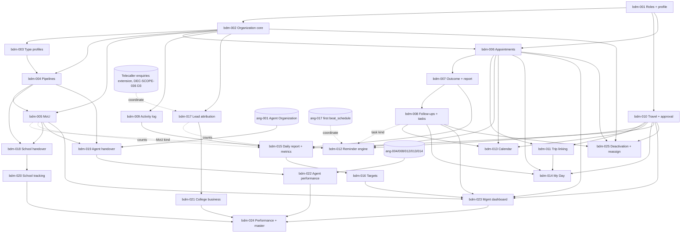

# BDM CRM — Engineering Enhancement Backlog (`bdm-001` … `bdm-025`)

NO-ASSUMPTION MODE. Prepared 2026-09-28 at the user's request. **No code was written or changed.**

- **Source:** `functionalities/edusphere_markdown/BDM Functionalities.md` = `EVID-016` (`DERIVED_BLUEPRINT`).
  I read it end to end (1,424 lines). The section-by-section coverage audit is in §1.
- **Scope authority:** `DEC-SCOPE-055` (2026-09-28, `EXPLICIT_APPROVAL`, D1–D9, asked in-session). Related decisions:
  - `DEC-SCOPE-035`: the Agent CRM, `ang-NNN`.
  - `DEC-SCOPE-036`: the Telecaller CRM. It reserves `tel-NNN` and says leads extend `enquiries` (D3).
  - `DEC-SCOPE-012`: Overseas Admin creates Schools.
  - `DEC-SCOPE-019`: no admin-known credential.
- **ID prefix:** `bdm-NNN`. The user asked for `tel-NNN`, but that prefix is reserved for the Telecaller CRM (`DEC-SCOPE-036`), so the user chose `bdm-NNN` (D2).
- **Method:** I queried the graphify graph first, then checked each finding against source. The architecture context is in `docs/architecture/ARCHITECTURE_BASELINE.md`.
- **Gates:** every item is behind `APPROVAL_GATES.md` GATE-09 (Coding). All 23 questions in §3.2–§3.3 were answered on 2026-09-28 (`DEC-SCOPE-055` D10–D32). Every source line is traced to an item in Appendix A, and every counted figure is defined in Appendix B.
- **Authorization convention (user, 2026-09-28):** new routes follow the existing inline pattern: a `User.role` check, then scope helpers, then the write. They do not use the `require_*` dependencies.

---

## 0. What already exists (verified in code, not assumed)

| Capability | Where | State vs this source |
|---|---|---|
| BDM role | — | **Missing.** There are no `bdm` or `bdm_manager` roles in `rbac.PERMISSIONS`. `admin.create_user` (`admin.py:380`) only allows the fixed per-division role sets. |
| "Edusphere BDM" on a School | `School.edusphere_bdm` (`models.py`, String 200, free text, ENH-009) | Plain text, not linked to any user. `DEC-SCOPE-025` kept it as text *because* no BDM role existed. That blocker is now lifted (bdm-018). |
| School MoU reference / visit schedule | `School.mou_reference`, `School.monthly_visit_schedule`, `School.partnership_date` | Text and date only. There is no MoU lifecycle. |
| School creation | Overseas Admin (`SCH-003`, `DEC-SCOPE-012`) seeds the School and its Coordinator | **Keep.** The BDM hands over to this flow (D8). |
| Agent organization | `ang-001` design spec only (worktree `feature/agn-001-multi-tenant-agent-crm`, no code) | **Not built.** bdm-019 depends on it (D7). |
| Appointments | `Appointment` (`appointments`: division, `student_id`/`staff_id` → users, `scheduled_at`, type, mode, status) | Overseas student counselling slots. **Not reusable** for institution meetings: it has no organization, no contact, no location and no outcome. A separate table is proposed. |
| Leads | `Enquiry` (`enquiries`: division, name, email, phone, source, status, `owner_id`, `metadata_json`), `admin.leads`/`update_lead`, Zoho sync task | The lead store. `DEC-SCOPE-036` D3 extends it for the Telecaller CRM, and BDM attribution adds to the same table (bdm-017, D5). |
| Notifications | `Notification` + `NotificationDelivery`, `workflows._notify_user`, `integrations.send_notification`, `services/mailer.py` (SMTP) | **Reuse** for reminders (in-app + email, D6). |
| Scheduler | `worker.py` Celery; the compose `beat` container runs with **no `beat_schedule`** | Nothing is scheduled today. bdm-012 would add the system's first periodic job, unless the Agent CRM's ang-017 lands first. |
| Calendar/meeting providers | `services/meetings.py` (Google Meet / Zoho Meeting creation) | Available. Whether BDM appointments sync to an external calendar is Q-11. |
| School service data (activity tracking) | `SchoolStudent`, `SchoolCareerRecord` (`guidance_session`/`counselling_note`/`recommendation`), `SchoolPsychometricRecord`, `SchoolLanguageRecord`, `SchoolTestPrepRecord`, `PortfolioEntry`; aggregation in `school_analytics.py` / `schools.service_usage()` | Mostly tracked. "University guidance" and "student profile completion" have **no** direct record (Q-15). |
| IT (college) funnel data | `Enrollment`, `Certificate`, `JobApplication`, `JobOffer`, `PlacementProfile`, `Payment` (`reference_type`, INR) | Training, certification and placement exist. **IT internship does not exist** (`PortfolioEntry` internship is School-only). Placement or internship *revenue* is not modelled (Q-08). |
| Audit | `AuditLog` | Reuse for every state change. |
| Date convention | `_today_ist()` in `schools.py` | IST business dates; reuse it for "today", "tomorrow" and monthly windows. |

---

## 1. Source coverage audit (section by section)

| Source § (lines) | Content | Covered by | Notes |
|---|---|---|---|
| Preamble (1–3) | Dedicated BDM Activity & Travel module for college/agent/school outreach | whole backlog | — |
| §1 BDM Management (5–25) | Name, Employee ID, Designation, Department, Territory, Mobile, Email, Reporting Manager, Active/Inactive | bdm-001, bdm-025 | one `bdm` role + `bdm_type` (D3); manager = `bdm_manager` (D4) |
| §2 Appointments (27–93) | 15 fields; 8 common types; 6 statuses | bdm-006 | types per BDM type (C-/S-/A- lists) |
| §3 Travel (95–147) | 17 fields; 6 modes | bdm-010 | approval by the reporting manager (Q-05) |
| §4 Travel + appointment linking (149–170) | Trip with N appointments, time/org/meeting/status table | bdm-011 | — |
| §5 Calendar (172–196) | Daily: appointments, travel, meetings, follow-ups, seminars, tasks. Weekly plan | bdm-013 | external sync is Q-11 |
| §6 Appointment reminders (198–227) | 1 day before with Confirm/Reschedule/Cancel; 1 hour before | bdm-012 | in-app + email, deep links (D6) |
| §7 Travel reminder (229–248) | Day before: View Appointments / View Expenses / Add Remarks | bdm-012, bdm-011 | — |
| §8 Appointment outcome (250–283) | 9 outcomes, meeting summary, next action, next follow-up | bdm-007, bdm-008 | — |
| §9 Organization CRM (285–337) | 16 fields; 7 organization types | bdm-002, bdm-003 | new linked table (D5 of scope set, see §3) |
| §10 MoU tracking (339–369) | 9 statuses; "proposal sent 5 days ago" reminder | bdm-005, bdm-012 | the day count is Q-10 |
| §11 Daily activity report (371–397) | 11 counts | bdm-009, bdm-015 | derived from logs and records (D9) |
| §12 Targets (399–411) | Monthly target vs achieved, 7 KPIs | bdm-016 | the KPI catalogue is Q-12 |
| §13 Management dashboard (413–434) | 8 KPIs + 5 alert kinds | bdm-023 | — |
| §14 Workflow (436–474) | Login → dashboard → appointments/travel/organizations → outcome → follow-up → lead/MoU/business | bdm-006…bdm-017 (end to end) | narrative; no separate item |
| §15 My Day (476–506) | Today's appointments, upcoming travel, follow-ups by type | bdm-014 | — |
| Part 2 intro (508–518) | Common framework, customised per Agent/School/College | bdm-001 (`bdm_type`), bdm-003, bdm-004, bdm-006, bdm-015, bdm-016 | D3 |
| Agent §A (528–559) | Today's overview (8) + 8 monthly KPIs | bdm-014, bdm-016 | — |
| Agent §B (561–613) | 23 agent fields; 8-state status | bdm-003, bdm-004 | the status list vs the pipeline is Q-04 |
| Agent §C (615–653) | 9 appointment types; 8 outcomes | bdm-006, bdm-007 | — |
| Agent §D (655–683) | Agent trip: agents to visit, costs, approval | bdm-010, bdm-011 | — |
| Agent §E (685–741) | 14-step recruitment pipeline (11 stages + 3 volume steps: Students, Applications, Enrollments) | bdm-004, bdm-019, bdm-022 | the handover to `ang-001` (D7) |
| Agent §F (743–757) | Agent → Students → Applications → Offers → Visa → Enrolled → Revenue | bdm-022 | the revenue definition is Q-08 |
| Agent §G (759–781) | 11 daily counts | bdm-015 | — |
| School §A (793–825) | Today's overview (8) + 9 KPIs | bdm-014, bdm-016 | — |
| School §B (827–871) | 21 school fields | bdm-003, bdm-018 | the link to `schools` (D8) |
| School §C (873–895) | 11 appointment types | bdm-006 | — |
| School §D (897–951) | 14-stage pipeline to University Planning | bdm-004, bdm-018, bdm-020 | post-onboarding stages read live (D8) |
| School §E (953–980) | Per-school student development counts | bdm-020 | two metrics have no data (Q-15) |
| School §F (982–998) | School trip with appointments | bdm-011 | — |
| School §G (1000–1022) | 11 daily counts | bdm-015 | — |
| College §A (1032–1064) | Today's overview (8) + 9 KPIs | bdm-014, bdm-016 | — |
| College §B (1066–1108) | 22 college fields | bdm-003 | — |
| College §C (1110–1134) | 12 appointment types | bdm-006 | — |
| College §D (1136–1190) | 14-stage pipeline to Placement | bdm-004, bdm-021 | — |
| College §E (1192–1222) | Student funnel (7 stages) + 4 revenue lines | bdm-021 | internship and placement revenue are Q-08 |
| College §F (1224–1252) | Trip auto-calculation: meetings, cost, expected leads, expected revenue | bdm-011 | "expected" figures are Q-07 |
| §4 Common (1254–1334) | Calendar; travel request/approval/expenses/report; activity channels; meeting-report fields; Target→Actual→%; 5 reminder kinds | bdm-008, bdm-009, bdm-010, bdm-011, bdm-012, bdm-013, bdm-007, bdm-016 | — |
| §5 Management view (1336–1357) | KPI × BDM type table; drill down BDM → Org → Appointment → Travel → Outcome → Lead → Student → Revenue | bdm-024 | — |
| §6 Master dashboard (1359–1420) | Hierarchy map per type; the three value chains | bdm-024 | a hierarchy diagram, not a geographic map |
| Trailing "Top/Bottom of Form" (508, 1422–1424) | Copy-paste artefacts | — | not requirements |

**Not in the source, so not added:** GPS check-in, geographic maps, expense reimbursement payouts, lead import, CSV export, and any communication *to* organization contacts. Each would need its own request.

---

## 2. Backlog summary

| ID | Title | Cx | Risk | Migration | Depends on |
|---|---|---|---|---|---|
| bdm-001 | BDM + BDM Manager roles, BDM profile, account provisioning | M | High | Yes | — |
| bdm-002 | Organization CRM core (common fields, contacts, assignment, scope) | L | High | Yes | 001 |
| bdm-003 | Type-specific organization profiles (Agent / School / College) | M | Medium | Yes | 002 |
| bdm-004 | Organization pipelines per BDM type + stage history | M | Medium | Yes | 002, 003 |
| bdm-005 | MoU tracking | M | Medium | Yes | 002, 004 (D28) |
| bdm-006 | Appointments (types per BDM type, status lifecycle, reschedule) | L | Medium | Yes | 001, 002 |
| bdm-007 | Appointment outcome + meeting report | M | Medium | Yes | 006 |
| bdm-008 | Follow-ups and tasks | M | Medium | Yes | 002, 007 |
| bdm-009 | Activity log (call / WhatsApp / email / visit / meeting) | S | Low | Yes | 002 |
| bdm-010 | Travel requests, approval, modes, costs, expenses | L | Medium | Yes | 001 |
| bdm-011 | Trip ↔ appointment linking, trip view, travel report, productivity | M | Medium | Yes | 006, 010 |
| bdm-012 | Reminder engine (first Celery `beat_schedule`) | L | High | Yes | 006, 010 (+005, 008 kinds) |
| bdm-013 | BDM calendar (daily / weekly) | M | Low | No | 006, 008, 010 |
| bdm-014 | My Day + type-specific BDM dashboard | M | Low | No | 006, 008, 010, 011 |
| bdm-015 | Daily activity report (derived + note + submit) | M | Medium | Yes | 007, 009, 010, (005, 017) |
| bdm-016 | Monthly targets (manager-set, achieved computed) | M | Medium | Yes | 015 |
| bdm-017 | Student lead attribution to organizations (`enquiries`) | M | High | Yes | 002 |
| bdm-018 | School onboarding handover + `schools` link | M | High | Yes | 004, 005 |
| bdm-019 | Agent onboarding handover + Agent Organization link | M | High | Yes | 004, 005, **ang-001** |
| bdm-020 | School activity tracking (live, per school) | M | Medium | No | 018 |
| bdm-021 | College business tracking: student funnel + revenue | L | High | No | 017 |
| bdm-022 | Agent performance drill-down | M | Medium | No | 019, **ang-004/008/013/014** |
| bdm-023 | Management dashboard: overview + alerts | M | Medium | No | 005, 006, 008, 010, 016 |
| bdm-024 | BDM performance by type + drill-down + master dashboard | L | Medium | No | 020, 021, 022, 023 |
| bdm-025 | BDM deactivation, portfolio reassignment, manager change | M | High | Yes | 002, 006, 008, 010 |

---

## 3. Decisions and questions

### 3.1 Answered in-session 2026-09-28 (`EXPLICIT_APPROVAL`, recorded as `DEC-SCOPE-055`)

| # | Question | Answer | Items |
|---|---|---|---|
| D1 | Is the BDM CRM (all of `EVID-016`) in scope? | **Yes, all in scope.** Individual items keep their own questions and stay behind GATE-09 | all |
| D2 | ID prefix (`tel-NNN` is reserved for the Telecaller CRM) | **`bdm-NNN`** | all |
| D3 | Role model | **One `bdm` role + `bdm_type` (agent / school / college).** Division is derived: college → `it`, agent/school → `overseas` | 001 and every item |
| D4 | Who is "Management" | **A new `bdm_manager` role** (= the Reporting Manager): sees and approves only the BDMs who report to them. `super_admin` sees all BDMs | 001, 010, 016, 023, 024 |
| D5 | Organization storage | **A new `bdm_organizations` table**, with optional FKs to the real `schools` row or Agent Organization once onboarded. Partner records stay owned by their existing admins | 002, 018, 019 |
| D5b | Leads and revenue | **Attributed live data:** BDM leads are `enquiries` rows tagged with the organization. The funnel and revenue are computed from real records; stages that can't be attributed are shown as "not tracked" | 017, 020, 021, 022, 024 |
| D6 | Reminder channels | **In-app + email** (Celery beat + SMTP). Buttons are deep links that require login. No WhatsApp for now | 012 |
| D7 | Agent onboarding | **BDM hands over and reads status:** at Agreement Signed the BDM requests onboarding; Overseas Admin creates or approves the Agent Organization (`ang-001`), which links back. Later stages are read live. The BDM never creates logins | 019, 022 |
| D8 | School onboarding | **The same handover pattern:** Overseas Admin creates the School through `SCH-003` and links it. Later stages and activity tracking are read live. `schools.edusphere_bdm` becomes the linked BDM | 018, 020 |
| D9 | Daily activity report | **Derived + activity log:** BDMs log individual activities, the report is computed from those and the other records, and the BDM adds an end-of-day note and submits | 009, 015 |

### 3.2 Item questions — all answered 2026-09-28 (`DEC-SCOPE-055` D10–D29)

Every question below was put to the user directly, one at a time, and answered in-session (`EXPLICIT_APPROVAL`). No item is blocked on an open scope question. The "spec decision" notes inside items are design details for each item's spec.

| Q | Question | Answer | Decision | Items |
|---|---|---|---|---|
| Q-01 | Who creates and edits BDM / BDM Manager accounts | **Split by division:** `super_admin` creates both roles, any type. `it_admin` creates College BDMs. `overseas_admin` creates Agent + School BDMs. Managers are created by `super_admin` only | D10 | 001, 025 |
| Q-02 | Which organizations a BDM sees | **Read every organization of their `bdm_type`; edit only those assigned to them** | D11 | 002 and all scoped items |
| Q-03 | Owner of University / Corporate / Training Institute / Other organizations | **The creating BDM's type:** any BDM may create them, and they belong to that BDM's module | D12 | 002, 003 |
| Q-04 | Agent status vs recruitment pipeline | **One 14-step pipeline; the 8-value status is derived** from it ("Inactive" = linked Agent Organization suspended/inactive) | D13 | 003, 004, 019 |
| Q-05 | Travel approval | **Every trip needs the reporting manager's approval before it starts.** A rejection needs a reason; the trip can be edited and resubmitted; linked appointments stay but show "trip not approved" | D14 | 010, 011 |
| Q-06 | Expense detail / reimbursement | **Itemized lines** (category travel/stay/food/local/other, INR amount, optional receipt); actual cost = sum of lines. **No reimbursement payout in EduSphere** | D15 | 010, 011 |
| Q-07 | Trip expected leads/revenue | **BDM estimate per appointment**, summed per trip and shown beside the actuals | D16 | 006, 011 |
| Q-08 | Revenue definitions | **Paid fees only:** revenue = paid `payments` of attributed students. Internship, placement, other and university-commission revenue are **"not tracked"** until a data model is approved | D17 | 021, 022, 024 |
| Q-09 | Reminder timing | **IST, fixed:** appointments at 09:00 the day before + exactly 1 h before; travel at 09:00 the day before; follow-ups and tasks at 09:00 on the due day | D18 | 012 |
| Q-10 | MoU reminder rules | **5 days after Proposal Sent / Draft Shared, repeating every 5 days** while it stays there; **30 days before** an Active MoU's valid-until (renewal) date | D19 | 005, 012 |
| Q-11 | External calendar sync | **Internal only**; sync can be a later item | D20 | 013 |
| Q-12 | Target KPIs | **Fixed catalogue per type** (the source tables + the §12 common list), each with a written metric definition; **monthly only** | D21 | 016 |
| Q-13 | Daily report rules | **Not enforced;** "not submitted" is a manager alert; submitting snapshots and locks the report and that day's activity edits; the manager can comment | D22 | 009, 015, 023 |
| Q-14 | Lead capture | **The BDM enters each lead individually** against the organization. No bulk upload, no referral link. "Students contacted" = leads entered | D23 | 017, 021 |
| Q-15 | Unmapped school metrics | **"Not tracked"** (university guidance, student profile completion) | D24 | 020 |
| Q-16 | Legacy `schools.edusphere_bdm` text | **Keep it as read-only history; link manually** (on handover or by Overseas Admin). No automatic name matching | D25 | 018 |
| Q-17 | Manager division / types / BDM work | **Division `global`; any mix of BDM types; managers do not own appointments or trips** | D26 | 001, 023, 024 |
| Q-18 | Duplicate organizations | **Warn (never block, never merge)** on the same module + normalized name + city; the BDM must acknowledge | D27 | 002 |
| Q-19 | MoU → pipeline | **"Signed" advances the pipeline to MoU/Agreement Signed, forward only**; other MoU statuses don't touch the pipeline | D28 | 004, 005 |
| Q-20 | Communication to organization contacts | **Nothing.** Contacts are data only; BDMs communicate outside the system | D29 | 006, 012 |

### 3.3 Definition questions from the field-level trace — answered 2026-09-28 (`DEC-SCOPE-055` D30–D32)

| Q | Question | Answer | Decision | Items |
|---|---|---|---|---|
| Q-21 | School §A "School activities" | **The BDM's own school events today:** appointments of type Seminar, Workshop, Parent/Teacher Orientation, and the Career Guidance / Psychometric / Profile Building presentations | D30 | 014 |
| Q-22 | School "Career guidance / Psychometric sessions" (daily) and "Career Guidance / Psychometric Tests" (KPIs) | **Split:** the daily counts = the BDM's completed presentation appointments of those types. The monthly KPIs = students in the BDM's linked schools with a completed career guidance session / psychometric result that month (live School data) | D31 | 015, 016, 020 |
| Q-23 | "Active Agents", "Active Schools", "New Agents" | **From the linked partner records:** Active Agent = linked Agent Organization with status active. Active School = linked School whose tier is set and not expired today. New Agents = agent organizations whose onboarding link was completed in the month. "Not tracked" until a link exists | D32 | 016, 023, 024 |

**Consequences derived from the existing decisions (not new choices):**
- Under D17, agent-student deposits collected through Razorpay (`DEC-SCOPE-035` D11/D12) are **pass-through** money that is remitted to the university. They are **not** EduSphere revenue and are excluded, so Agent revenue is "not tracked".
- School students have no `users` row and no `payments`, so School revenue is also "not tracked".
- In practice, the only computed revenue is College training fees (bdm-021).

---

## 4. Backlog items

Conventions used below:

- **"type scope":** a BDM reads organizations of their own `bdm_type` (per Q-02).
- **"own scope":** the BDM writes only records they own or are assigned to.
- **"team scope":** a `bdm_manager` reads and acts on BDMs whose reporting manager is them. `super_admin` has all.
- Proposed table, column and route names are placeholders for each design spec, not decisions.
- New backend routes go in a package, `app/api/bdm/`, with a shared `scope.py` created by bdm-001. New pages go under `/bdm/*` (BDM) and `/bdm/manager/*`.

---

### bdm-001 — BDM + BDM Manager roles, BDM profile, account provisioning

> **Status (2026-10-02):** implemented on branch `feature/bdm-001-bdm-profile`, at `c81de8f`. **Verified with fresh evidence:**
> - lite backend set: 422 passed;
> - full web unit suite: 1778/1778;
> - `tsc`, `eslint` (0 errors), `next build`: pass;
> - Playwright (5 specs): 30/30;
> - browser verification: 26/26;
> - browser QA-01..16 fixed.
>
> **Open before merge:** the full backend suite (run by the owner), and Playwright/browser re-checks on the code merged from main (`ad5bda8`). **AC07 settled (2026-10-02):** the owner deferred to the recommendation. An edit of user fields only does not snapshot the profile, which matches spec §5.5 and the code; the spec's AC07 wording was updated to say so. Decisions B1–B11 are in `DEC-SCOPE-055`. Deviations from this entry, settled in the design: routes live in a flat `app/api/bdm.py` + `app/services/bdm.py` (the codebase has no route packages); the BDM create form is a new admin "BDMs" page (`AdminBdmPanel`), not `AdminUserManagementPanel`; managers have no profile row (B6); a manager's reset ends at `/admin/login` via `login_portal` (B1). Spec: `docs/superpowers/specs/2026-10-02-bdm-001-bdm-profile-design.md`.

- **Business requirement:** every BDM has a profile (Name, Employee ID, Designation, Department, Territory, Mobile, Email, Reporting Manager, Active/Inactive; §1). BDMs work in one of three modules, Agent, School or College (Part 2), and report to management.
- **Existing behavior:** there are no `bdm` or `bdm_manager` roles, and `admin.create_user` rejects any role outside the fixed per-division sets. BDM names exist only as free text on `schools.edusphere_bdm`.
- **Expected behavior:**
  - Two new roles, `bdm` and `bdm_manager`, are added to `rbac.PERMISSIONS`, the create-user role sets, `ROLE_DASHBOARD_PATH` and the navigation.
  - A new `bdm_profiles` table (1:1 with `users`) holds `bdm_type` (`agent|school|college`), `employee_id` (unique), designation, department, territory and `reporting_manager_user_id` (→ a `bdm_manager` user).
  - Name, email, mobile and active status stay on `users`.
  - Division is derived from `bdm_type`: college → `it`, agent/school → `overseas`. The manager's division is per Q-17.
  - Accounts are created by an admin (Q-01) with the `DEC-SCOPE-019` set-password link (`services/provisioning.py`).
  - Profiles can be edited. Activate/deactivate uses `users.active`; the reassignment side effects are in bdm-025.
  - `app/api/bdm/scope.py` provides `bdm_context(user)` and the type/own/team scope helpers that every later item calls.
- **User roles affected:** new `bdm` and `bdm_manager`; `super_admin`, `it_admin` and `overseas_admin` (creators, per Q-01).
- **Frontend impact:**
  - `AdminUserManagementPanel` gains the two roles, plus the BDM fields shown when the role is `bdm`.
  - New `/bdm/profile` (read-only for the BDM) and `/bdm/manager/team` (the manager's list of their BDMs).
  - `middleware.ts` matcher gains `/bdm`.
- **Backend impact:** `rbac.py` (roles), `admin.create_user`/`update_user` (roles, BDM fields, validation), the new `app/api/bdm/` package with `scope.py` and `profiles.py`, and `main.py` router registration.
- **Database impact:** the `bdm_profiles` table, a unique `employee_id`, a FK to `users` for the reporting manager, and a CHECK on `bdm_type`.
- **API impact:**
  - `POST/PATCH /admin/users` accepts the new roles and a `bdm_profile` object.
  - New: `GET /bdm/me`, `GET /bdm/manager/team`, `GET /admin/bdms`.
- **Integration impact:** the welcome email reuses `mailer.send_welcome_email`.
- **Authentication impact:** none. Login is by email and cookies, as for other roles.
- **Authorization impact:**
  - New role checks.
  - A manager's team scope is `bdm_profiles.reporting_manager_user_id == user.id`.
  - A BDM without a profile row is denied every BDM route (403, "BDM profile not set up").
- **Security impact:** a new internal role with access to institutional contact data. `reporting_manager_user_id` must point to an active `bdm_manager`, never to arbitrary users, so that no one can grant themselves a team.
- **Performance impact:** one profile lookup per BDM request (can be eager-loaded).
- **Reusable existing modules:** `admin.create_user`, `services/provisioning.issue_welcome_token`/`deliver_welcome_link`, `AdminUserManagementPanel`, `PortalShell`, `lib/navigation.ts`, `AuditLog`.
- **Dependencies:** none (foundation).
- **Acceptance criteria:**
  1. An authorized admin can create a `bdm` with a type, employee ID and reporting manager. The account gets a set-password link, and no password is ever set by the admin.
  2. The BDM's division equals the division mapped from their type. A mismatched division → 422.
  3. A duplicate `employee_id` → 409.
  4. The reporting manager must be an active `bdm_manager`, otherwise 422.
  5. After login, a BDM lands on `/bdm/my-day`, and a manager on `/bdm/manager/dashboard`.
  6. A manager's team list contains exactly the BDMs who report to them.
  7. Every create or edit writes an `AuditLog` row.
- **Positive scenarios:** a super_admin creates a College BDM reporting to manager M; the BDM sets a password and lands on My Day; M sees them in the team list.
- **Negative scenarios:** it_admin creates an Agent BDM (per Q-01) → 403; a `bdm` role without a profile → 422; a BDM calling a manager route → 403; a manager reading another manager's BDM → 404.
- **Edge cases:** a manager deactivated while they still have BDMs (their BDMs are flagged "no active manager" in admin, and approvals route to super_admin); a BDM's type changed after they own data (blocked while they own open records, or goes through bdm-025); the same email already used by another role.
- **Regression risks:** `admin.create_user` is used by every admin user flow (`test_adm_*`, ENH-003 provisioning tests); `ROLE_DASHBOARD_PATH` and `HeaderAuthActions`; `middleware.ts`.
- **Complexity:** medium · **Risk:** high

---

### bdm-002 — Organization CRM core (common fields, contacts, assignment, scope)

- **Business requirement:** an Organization CRM for the institutions BDMs meet: Organization Name, Type, City, State, Contact Person, Designation, Phone, Email, Website, Existing Partner?, Courses Interested, Number of Students, Last Meeting, Next Meeting, Assigned BDM (§9). The types are College, University, Agent, School, Corporate, Training Institute and Other.
- **Existing behavior:** there is no prospect or organization store. `schools` holds onboarded partner schools only, and `universities` is the global catalogue.
- **Expected behavior:**
  - A new `bdm_organizations` table holds: code (e.g. `ORG-000123`), `org_type`, `bdm_type` (owning module, per Q-03), name, city, state, address, phone, email, website, `existing_partner`, courses of interest, student strength, `assigned_bdm_user_id`, created_by, and `archived_at`.
  - A child table `bdm_organization_contacts` (name, designation, role tag, phone, email, `is_primary`) covers the source's multiple named contacts: Principal, Dean, HOD, Placement Officer, Counselor and Management Contact.
  - **Last Meeting and Next Meeting are computed** from appointments (bdm-006), not stored.
  - Duplicate warning per Q-18. Create, edit and archive; no hard delete once the organization has linked records.
- **User roles affected:** `bdm` (create/edit in own scope), `bdm_manager` (team scope; reassign), `super_admin`.
- **Frontend impact:** `/bdm/organizations` (list with filters: type, stage, city, assigned BDM; paginated), `/bdm/organizations/new`, `/bdm/organizations/[id]` (profile + contacts; later tabs for pipeline, MoU, appointments, activity and leads).
- **Backend impact:** `app/api/bdm/organizations.py`; the organization-scope helper in `scope.py`.
- **Database impact:** the `bdm_organizations` and `bdm_organization_contacts` tables; indexes on `(bdm_type, assigned_bdm_user_id)` and on the normalized name + city; CHECKs on `org_type` and `bdm_type`.
- **API impact:** `GET/POST /bdm/organizations`, `GET/PATCH /bdm/organizations/{id}`, `POST /bdm/organizations/{id}/archive`, `POST/PATCH/DELETE /bdm/organizations/{id}/contacts[/{cid}]`, and `POST /bdm/organizations/{id}/assign` (manager). Lists use `{items,total,limit,offset}`.
- **Integration impact:** none.
- **Authentication impact:** none.
- **Authorization impact:** the type/own/team scope from bdm-001. A BDM of type `school` can never read or write `bdm_type=agent` organizations. The organization id always resolves through the scope helper (404 outside scope).
- **Security impact:** contact PII (names, phones, emails). IDOR across types and across BDMs is the main risk, so a cross-scope test is needed for every route. Input lengths and email format are validated (`_valid_email`).
- **Performance impact:** the list is paginated and "last/next meeting" uses a single aggregate subquery (no N+1).
- **Reusable existing modules:** `admin._valid_email`/`_fit`, the `core/identifiers` code generation, `DataTable`, `FormMessage`, `sendJson`, the `isPage` guard, and the `SchoolStudentFields` form pattern.
- **Dependencies:** bdm-001.
- **Acceptance criteria:**
  1. A BDM can create an organization in their own `bdm_type` with at least one contact; the code is unique and generated by the server.
  2. A likely duplicate returns a warning the BDM must acknowledge (Q-18), and is never silently merged.
  3. A BDM sees organizations according to Q-02 and can edit only those assigned to them.
  4. A manager can reassign an organization among their own BDMs of the same type, with an audit row.
  5. Archived organizations are hidden by default and can be shown with a filter; they cannot receive new appointments.
  6. Last Meeting and Next Meeting reflect completed and upcoming appointments once bdm-006 exists (until then they show "—").
- **Positive scenarios:** create a college with Principal and Placement Officer contacts; filter by city; the manager reassigns it.
- **Negative scenarios:** a School BDM opening a college org id → 404; editing an organization assigned to another BDM → 403; reassigning to a BDM of another type or another team → 422.
- **Edge cases:** an organization with no contacts yet (allowed, flagged); two BDMs creating the same college concurrently (both succeed, and each sees the duplicate warning afterwards); archiving an organization that has future appointments (blocked, or those appointments must be cancelled first).
- **Regression risks:** none to existing flows (new tables). `main.py` router list only.
- **Complexity:** large · **Risk:** high

---

### bdm-003 — Type-specific organization profiles (Agent / School / College)

- **Business requirement:** each module has its own database fields.
  - Agent §B: Agency Name, Owner, Country, Address, Territory, Source, Number of Staff, Commission, Agreement, MoU.
  - School §B: Board, School Type, Principal, Management Contact, Counselor, Student Strength, Grades, Contract, Renewal Date.
  - College §B: University/Affiliation, College Type, Principal, Dean, HOD, Placement Officer, Courses.
- **Existing behavior:** none.
- **Expected behavior:**
  - Type-specific attributes are stored as nullable typed columns on `bdm_organizations`, or in a 1:1 extension table per type (a spec decision; typed columns are preferred for filtering).
  - Named-person fields (Principal, Dean, HOD, Placement Officer, Counselor, Management Contact, Owner) are **contacts with a role tag** (bdm-002), not duplicate text columns.
  - Live figures in the agent profile (Students, Applications, Enrollments, Commission) and the "Master Login" field are **not stored**. They are read after onboarding (bdm-019/022).
  - "Agreement", "MoU" and "Contract" (Agent §B, School §B, College §B) and the School "Renewal Date" are **the bdm-005 MoU record** (reference, status, validity; `valid_until` = the renewal date). They are not separate columns.
  - "Last Meeting" and "Next Follow-up" (College §B) are computed from bdm-006/008.
  - **Two different course fields:**
    - "Courses Interested" (§9, every type) = the EduSphere programs the organization is interested in. It is a multi-select from the `programs` catalogue, plus free text for items not in the catalogue.
    - "Courses" (College §B) = the courses the college itself teaches (e.g. B.Tech CSE, MBA). It is free text or a list.
  - Agent "Number of Staff" is BDM-entered before onboarding. After the bdm-019 link it shows the live staff count from the Agent CRM, with the entered value kept.
  - Agent "Commission" is read-only, from the Agent CRM (ang-014) once linked (the commission payable to the agent). It is not EduSphere revenue (D17).
  - The form shows only the fields for the organization's type.
- **User roles affected:** `bdm`, `bdm_manager`.
- **Frontend impact:** the organization form and profile render a type-specific field set; the list gains type-specific filters (Board, Affiliation, Territory).
- **Backend impact:** schema validation per `org_type`, in `organizations.py`.
- **Database impact:** additive nullable columns or extension tables, with CHECKs for enumerations (board, school type, college type).
- **API impact:** the organization payload gains a `profile` object validated per type (422 for fields that don't apply to the type).
- **Integration impact:** none.
- **Authentication impact:** none.
- **Authorization impact:** as bdm-002.
- **Security impact:** as bdm-002.
- **Performance impact:** negligible.
- **Reusable existing modules:** the `School` field definitions and validators from ENH-009 (board list, grades), and the `SchoolStudentFields` component pattern.
- **Dependencies:** bdm-002.
- **Acceptance criteria:**
  1. Each type's form shows exactly its source field list, with the named people stored as tagged contacts.
  2. Sending a field that belongs to another type → 422.
  3. Enumerated fields reject unknown values.
  4. Live agent metrics are never editable.
- **Positive scenarios:** create a school with board CBSE, grades 6–12 and renewal date; create an agent with country, territory and source.
- **Negative scenarios:** a college payload with `board` → 422; an invalid email on a contact → 422.
- **Edge cases:** an org type of `other`/`corporate` (only common fields); changing `org_type` after creation (blocked once type-specific data exists, or needs an explicit clear).
- **Regression risks:** low.
- **Complexity:** medium · **Risk:** medium

---

### bdm-004 — Organization pipelines per BDM type + stage history

- **Business requirement:** a separate pipeline per module.
  - Agent §E: 14 steps, Prospect → … → Enrollments. The first 11 are stages; Students / Applications / Enrollments are volumes read from the Agent CRM. The 8-value agent status (§B) is derived (D13).
  - School §D: 14 stages, Prospect → … → University Planning.
  - College §D: 14 stages, Prospect → … → Placement.
- **Existing behavior:** none.
- **Expected behavior:**
  - `bdm_organizations.pipeline_stage`, validated against the stage list for the organization's `bdm_type`, plus a `bdm_pipeline_history` table (from, to, by, at, note).
  - **Manual stages** run up to the handover point: Agreement Signed / MoU Signed / Signed.
  - **Post-handover stages are read live** and not set by hand (D7, D8). For agents that means Onboarding / Master Login / Staff Logins / Active / Students / Applications / Enrollments; for schools, Onboarding / Users Created / Career Guidance / Psychometric / Profile Building / University Planning. College stages after "College Activated" are funnel counts (bdm-021), not a stage.
  - Forward moves are free. Backward moves need a reason. "Lost/Not interested" is a terminal flag with a reason.
  - The agent status (Q-04) is derived from, or kept alongside, the pipeline stage.
  - MoU coupling per Q-19.
- **User roles affected:** `bdm` (own scope), `bdm_manager` (team scope).
- **Frontend impact:** a pipeline stepper on the organization profile; a board or grouped list per stage on `/bdm/pipeline`; the history timeline.
- **Backend impact:** `app/api/bdm/pipeline.py`, with the stage catalogues in one constants module per type.
- **Database impact:** the stage column, a CHECK per type (or validation in the application), the history table and an index on `(bdm_type, pipeline_stage)`.
- **API impact:** `POST /bdm/organizations/{id}/stage` (`{to_stage, note}`), `GET /bdm/pipeline?stage=` (counts + page).
- **Integration impact:** none.
- **Authentication impact:** none.
- **Authorization impact:** own scope for moves; the manager can move any organization in their team.
- **Security impact:** low.
- **Performance impact:** the pipeline counts come from a single grouped query.
- **Reusable existing modules:** the forward-only + history pattern from `ApplicationStatusHistory` and `workflows` advance; `SchoolStudentTimeline`.
- **Dependencies:** bdm-002, bdm-003.
- **Acceptance criteria:**
  1. Stage lists match the source per type.
  2. Every move writes a history row and an audit row.
  3. Backward moves without a note → 422.
  4. Post-handover stages cannot be set manually (422) and show live status once linked.
  5. The pipeline view shows per-stage counts in the BDM's scope.
- **Positive scenarios:** a college moves from Prospect to Presentation to Proposal.
- **Negative scenarios:** setting "Master Login Created" by hand → 422; a stage from another type's list → 422.
- **Edge cases:** an organization marked lost and later revived (a new history row; the terminal flag is cleared with a reason); an organization whose type-specific stage list changes in a future release.
- **Regression risks:** low.
- **Complexity:** medium · **Risk:** medium

---

### bdm-005 — MoU tracking

- **Business requirement:** MoU status: Prospect, Discussion Started, Proposal Sent, Under Negotiation, Draft Shared, Signed, Active, Expired, Rejected (§10). The CRM reminds the BDM when a proposal has been waiting (e.g. 5 days), and the school/college databases carry MoU, Agreement, Contract and Renewal Date.
- **Existing behavior:** `schools.mou_reference` (text) and `partnership_date` only.
- **Expected behavior:**
  - A `bdm_mous` table (one current MoU per organization, history kept): status, `proposal_sent_on`, `signed_on`, `valid_from`, `valid_until` (renewal date), reference, optional document (uploaded through `services/storage`), notes; plus status history.
  - `Expired` is set automatically after `valid_until`, by the bdm-012 job or at read time.
  - Coupling with the pipeline per Q-19.
  - The MoU-follow-up and renewal reminder kinds are registered with bdm-012.
- **User roles affected:** `bdm`, `bdm_manager`.
- **Frontend impact:** an MoU card on the organization profile (status stepper, dates, document); `/bdm/mous` list with a status filter (feeds "MoUs pending / in progress / signed").
- **Backend impact:** `app/api/bdm/mous.py`; document upload through the existing `files` presign or local-upload path.
- **Database impact:** the `bdm_mous` and `bdm_mou_history` tables; CHECK status; CHECK `valid_until >= valid_from`.
- **API impact:** `GET/POST/PATCH /bdm/organizations/{id}/mou`, `GET /bdm/mous`.
- **Integration impact:** file storage (S3 or local).
- **Authentication impact:** none.
- **Authorization impact:** own/team scope. Downloading an MoU document requires scope, so the document must not be served through the unauthenticated `/local-files` mount (see baseline §26).
- **Security impact:** signed agreements are confidential. Document access has to be checked per request (a presigned or streamed download, not a guessable static path).
- **Performance impact:** negligible.
- **Reusable existing modules:** `services/storage`, `files.presign`, `image_metadata.strip_metadata`, `DocumentDownloadPanel`, the history pattern.
- **Dependencies:** bdm-002, bdm-004 (D28: MoU Signed advances the pipeline).
- **Acceptance criteria:**
  1. Every status change is recorded with actor and time.
  2. `Signed`/`Active` need `signed_on`, and `Active` needs a validity window.
  3. Past `valid_until` reads as `Expired`.
  4. A document is downloadable only in scope.
  5. The status list matches the source exactly.
- **Positive scenarios:** Proposal Sent → Under Negotiation → Signed with a document → Active.
- **Negative scenarios:** Signed without a date → 422; a download by an out-of-scope BDM → 404.
- **Edge cases:** renewing an expired MoU (a new MoU row, old one kept); a rejected MoU re-opened; an organization with an MoU but no pipeline movement.
- **Regression risks:** file-serving path changes, if any are made for secure download.
- **Complexity:** medium · **Risk:** medium

---

### bdm-006 — Appointments (types per BDM type, status lifecycle, reschedule)

- **Business requirement:** BDMs create and manage appointments with the §2 fields: Appointment ID, BDM, Organization, Contact Person, Designation, Mobile, Email, Date, Time, Type, Location, Purpose, Status, Remarks, Next Follow-up.
  - **Types, common list (§2):** College, Agent, School, MoU Discussion, Student/Institution, Seminar/Workshop, Corporate, Other.
  - **Types, per module:** Agent §C (9), School §C (11), College §C (12).
  - **Statuses:** Scheduled, Confirmed, Rescheduled, Completed, Cancelled, No Show.
- **Existing behavior:** `appointments` is overseas student counselling and is not reused (§0).
- **Expected behavior:**
  - A new `bdm_appointments` table: code, `bdm_user_id`, `organization_id`, `contact_id` (the contact snapshot is copied at booking), `starts_at` (timestamptz; the date and time come from it), duration, type (validated against the list for the BDM's type), location, purpose, status, remarks, `trip_id` (nullable, bdm-011), `expected_leads` / `expected_revenue` (per Q-07).
  - A `bdm_appointment_events` table records status and reschedule history.
  - "Rescheduled" keeps the original time in history. Cancel and No Show need a reason.
  - "Completed" is only allowed once the start time has passed, and it requires the outcome (bdm-007).
  - "Next Follow-up" is captured through the outcome (bdm-007/008), not duplicated here.
  - The §4 example's "Pending" is **not a seventh status**. It is how an appointment in `scheduled` (not yet confirmed) is displayed next to confirmed ones. The stored statuses remain the six in §2.
- **User roles affected:** `bdm` (own), `bdm_manager` (team read; may create on behalf of a team BDM, a spec decision).
- **Frontend impact:** `/bdm/appointments` (list + filters: date range, status, type, organization), create/edit form (contact picker from the organization's contacts), detail page with the history; the "Add appointment" action on the organization profile.
- **Backend impact:** `app/api/bdm/appointments.py`; the type catalogues are shared with bdm-004's constants.
- **Database impact:** the `bdm_appointments` and `bdm_appointment_events` tables; index `(bdm_user_id, starts_at)`; CHECK status.
- **API impact:** `GET/POST /bdm/appointments`, `GET/PATCH /bdm/appointments/{id}`, `POST /bdm/appointments/{id}/confirm|reschedule|cancel|no-show`.
- **Integration impact:** none (external calendar per Q-11; contacts per Q-20).
- **Authentication impact:** none.
- **Authorization impact:** own scope for writes; the organization must be in the BDM's type scope.
- **Security impact:** low (internal data).
- **Performance impact:** date-range queries on an indexed column; pagination.
- **Reusable existing modules:** `LocalTime`, `formatDate`, the `BatchSlotPicker` UX pattern, `FormMessage`, `sendJson`.
- **Dependencies:** bdm-001, bdm-002.
- **Acceptance criteria:**
  1. All §2 fields are captured.
  2. The type list depends on the BDM's type and includes the common types.
  3. Every status transition is recorded; the allowed transitions are documented and enforced.
  4. Reschedule keeps the old time in history and sets the status to Rescheduled.
  5. Completed requires an outcome and a past start time.
  6. Appointments on archived organizations → 422.
- **Positive scenarios:** book → confirm → complete with outcome; reschedule twice.
- **Negative scenarios:** Completed before the start time → 422; a type from another module → 422; editing another BDM's appointment → 403/404.
- **Edge cases:** two appointments overlapping for the same BDM (warn, not block); an appointment spanning midnight; changing the timezone display (stored in UTC, shown in IST); cancelling an appointment that belongs to an approved trip (the trip's counts update).
- **Regression risks:** none (new table). The name clash with the existing `Appointment` class needs care in `models.py` imports.
- **Complexity:** large · **Risk:** medium

---

### bdm-007 — Appointment outcome + meeting report

- **Business requirement:** after every meeting the BDM must record the outcome.
  - **Common outcomes (§8):** Interested, MoU Discussion Required, Student Leads Expected, Course Promotion Interested, Follow-up Required, Commercial Discussion, Not Interested, Reschedule, Other.
  - **Agent outcomes (§C):** Interested, Agreement Required, Product Training Required, Follow-up, Documents Required, Onboarding Required, Active Business Expected, Not Interested.
  - **Meeting report fields (§4 Common):** outcome, discussion, requirements, opportunity, next action, responsible person, follow-up date.
- **Existing behavior:** none.
- **Expected behavior:**
  - A `bdm_meeting_reports` table (1:1 with a completed appointment): outcome (validated per type), summary/discussion, requirements, opportunity, next action, responsible person (free text or an internal user), next follow-up date.
  - Submitting it completes the appointment.
  - A next follow-up date creates a follow-up (bdm-008).
  - The outcome "Reschedule" creates a new appointment draft linked to the original.
- **User roles affected:** `bdm` (writer), `bdm_manager` (read).
- **Frontend impact:** an outcome form on the appointment detail page; a "Outcome pending" badge on past, unreported appointments.
- **Backend impact:** `appointments.py` (outcome endpoint); a follow-up is created in the same transaction.
- **Database impact:** the `bdm_meeting_reports` table; CHECK outcome.
- **API impact:** `POST /bdm/appointments/{id}/outcome`, `GET` included in the appointment detail.
- **Integration impact:** none.
- **Authentication impact:** none.
- **Authorization impact:** only the appointment's BDM (or their manager, a spec decision) may file it.
- **Security impact:** low.
- **Performance impact:** negligible.
- **Reusable existing modules:** the `CareerRecordForm` / `ActivityFeedbackForm` patterns, and `UnsentFeedbackNote` (keeping entries when the network drops).
- **Dependencies:** bdm-006.
- **Acceptance criteria:**
  1. An appointment cannot be Completed without a report.
  2. The outcome lists match the source per type.
  3. A follow-up date creates exactly one follow-up.
  4. The report is editable by its author for a period set in the spec, then read-only.
  5. Past appointments without an outcome appear in the alerts (bdm-023).
- **Positive scenarios:** Interested + next action "Send proposal" + follow-up on 22 Sep.
- **Negative scenarios:** a report on a future appointment → 422; a report by another BDM → 403.
- **Edge cases:** the outcome "Not Interested" (no follow-up required; this may also mark the pipeline as lost, a spec decision); duplicate submission (idempotent 409).
- **Regression risks:** low.
- **Complexity:** medium · **Risk:** medium

---

### bdm-008 — Follow-ups and tasks

- **Business requirement:** follow-ups by organization type (college/agent/MoU follow-ups, §15), "Follow-up overdue" alerts (§13), tasks on the calendar (§5), and the task reminder (§4).
- **Existing behavior:** none. `ang-016` plans agent-side tasks for the Agent CRM, but they are a different tenant and are not shared.
- **Expected behavior:**
  - A `bdm_tasks` table: kind (`follow_up|task`), title, due date/time, `organization_id` (optional for a general task), source (`appointment_outcome|mou|manual`), assignee (the BDM), status (`open|done|cancelled`), `completed_at`.
  - Overdue = open and past due.
  - Completing a follow-up can prompt for an activity log entry (bdm-009) or a new appointment.
- **User roles affected:** `bdm`, `bdm_manager` (read team; may assign a task to a team BDM, a spec decision).
- **Frontend impact:** `/bdm/follow-ups` (tabs: today / overdue / upcoming; grouped by organization type); a quick-complete action; tasks on the organization profile.
- **Backend impact:** `app/api/bdm/tasks.py`; creation hooks in bdm-007 and bdm-005.
- **Database impact:** the `bdm_tasks` table; index `(assignee, status, due_at)`.
- **API impact:** `GET/POST /bdm/tasks`, `PATCH /bdm/tasks/{id}`, `POST /bdm/tasks/{id}/complete`.
- **Integration impact:** none.
- **Authentication impact:** none.
- **Authorization impact:** own scope; team scope for managers.
- **Security impact:** low.
- **Performance impact:** indexed due-date queries (the My Day, calendar and alerts views read this table).
- **Reusable existing modules:** `ang-016`'s design (pattern only), `LocalTime`, `DataTable`.
- **Dependencies:** bdm-002, bdm-007.
- **Acceptance criteria:**
  1. Follow-ups come from outcomes and MoUs and can be created manually.
  2. Overdue is computed on IST dates.
  3. Completed and cancelled follow-ups are kept.
  4. The counts by organization type match the list.
- **Positive scenarios:** the outcome creates a follow-up for 22 Sep; on 23 Sep it shows as overdue; the BDM completes it.
- **Negative scenarios:** completing another BDM's task → 403; a due date before creation → 422.
- **Edge cases:** the organization is archived while follow-ups are open (they are cancelled with a reason); the BDM is deactivated (bdm-025).
- **Regression risks:** low.
- **Complexity:** medium · **Risk:** medium

---

### bdm-009 — Activity log (call / WhatsApp / email / visit / meeting)

- **Business requirement:** "Activity: Calls, WhatsApp, Emails, Meetings, Visits, Follow-ups" (§4 Common). The daily reports count calls made, organizations contacted and school visits (§11, §G).
- **Existing behavior:** none. There is no telephony integration.
- **Expected behavior:** a `bdm_activities` table: channel (`call|whatsapp|email|visit|meeting|other`), `organization_id`, contact (optional), occurred_at, direction, short note, and an optional link to an appointment or task. The log is manual (D9); nothing is sent from the system. "Organizations contacted" = distinct organizations with an activity that day.
- **User roles affected:** `bdm`, `bdm_manager` (read).
- **Frontend impact:** a quick "Log activity" action (from the organization, a follow-up or My Day); an activity timeline on the organization profile.
- **Backend impact:** `app/api/bdm/activities.py`.
- **Database impact:** the `bdm_activities` table; index `(bdm_user_id, occurred_at)`.
- **API impact:** `GET/POST /bdm/activities`, `PATCH/DELETE /bdm/activities/{id}` (same day only, a spec decision).
- **Integration impact:** none (no dialer or WhatsApp API).
- **Authentication impact:** none.
- **Authorization impact:** own scope.
- **Security impact:** low.
- **Performance impact:** indexed.
- **Reusable existing modules:** the `SchoolStudentTimeline` pattern.
- **Dependencies:** bdm-002.
- **Acceptance criteria:**
  1. Each channel is loggable against an organization.
  2. Future `occurred_at` → 422.
  3. The day's counts per channel are exact.
  4. Edits after the daily report is submitted are blocked (bdm-015).
- **Positive scenarios:** log 12 calls to 5 colleges; the timeline shows them.
- **Negative scenarios:** logging against an out-of-scope organization → 404.
- **Edge cases:** an activity with no organization (a prospect not yet created, so it is not allowed and the BDM must create the organization first); backdated entries (allowed within a window set in the spec).
- **Regression risks:** none.
- **Complexity:** small · **Risk:** low

---

### bdm-010 — Travel requests, approval, modes, costs, expenses

- **Business requirement:** track travel with the §3 fields: Travel ID, BDM, Travel Date, Return Date, From, To, Purpose, Organization, Appointment date and time, Mode, Accommodation Required, Estimated Cost, Actual Cost, Approval Status, Travel Status, Remarks. The modes are Flight, Train, Bus, Car, Cab and Local. Also the common Travel list (§4): request, approval, expenses, actual cost and travel report.
- **Existing behavior:** none.
- **Expected behavior:**
  - A `bdm_trips` table: code, `bdm_user_id`, travel/return dates, from, to (multi-city is a spec decision), purpose, mode, accommodation, estimated cost, approval status (`draft|submitted|approved|rejected`), approver, approved_at, rejection reason, travel status (`planned|in_progress|completed|cancelled`), remarks.
  - A `bdm_trip_expenses` table per Q-06.
  - The §3 fields "Organization/College/Agent" and "Appointment Date/Time" are **not stored on the trip**. They come from the appointments linked in bdm-011 (the trip lists every organization and time), so one trip can cover several organizations, as the source's own examples show.
  - Actual cost = sum of the expenses (D15).
  - **Remarks stay editable** after approval and after completion: this is the travel reminder's "Add Remarks" button (§7). Every edit is audited.
  - The approval flow goes to the BDM's reporting manager (D4, Q-05). A trip becomes read-only after approval, apart from expenses and status.
  - The "Travel approval pending" alert feeds bdm-023.
- **User roles affected:** `bdm` (requester), `bdm_manager` (approver, team scope), `super_admin` (fallback approver when there is no active manager).
- **Frontend impact:** `/bdm/travel` (list, create, detail with expenses); `/bdm/manager/approvals` (a queue with approve/reject + reason).
- **Backend impact:** `app/api/bdm/travel.py`.
- **Database impact:** the `bdm_trips` and `bdm_trip_expenses` tables; CHECKs (return ≥ travel date, costs ≥ 0, mode, statuses).
- **API impact:** `GET/POST /bdm/trips`, `PATCH /bdm/trips/{id}`, `POST /bdm/trips/{id}/submit|approve|reject|start|complete|cancel`, `POST/PATCH/DELETE /bdm/trips/{id}/expenses[/{eid}]`.
- **Integration impact:** receipts go through file storage if Q-06 includes receipts.
- **Authentication impact:** none.
- **Authorization impact:**
  - Only the BDM's own reporting manager (or super_admin) can approve.
  - A BDM can never approve their own trip.
  - The manager's scope is the team.
- **Security impact:** financial figures, so the approval must be separation-of-duties enforced and audited. Receipt downloads need a scope check (not `/local-files`).
- **Performance impact:** negligible.
- **Reusable existing modules:** the two-actor approval pattern from `DEC-ROLE-007` (results verify/publish) and `AGT-004` (payout), `services/storage`, `AuditLog`, `FormMessage`.
- **Dependencies:** bdm-001.
- **Acceptance criteria:**
  1. All §3 fields and the 6 modes are supported.
  2. Submit → the manager is notified (in-app).
  3. Approve and reject write an audit row; a rejection needs a reason.
  4. Self-approval is impossible.
  5. Actual cost follows Q-06.
  6. Currency is INR.
- **Positive scenarios:** a BDM submits Hyderabad → Vijayawada, the manager approves, expenses are added after the trip and it is completed.
- **Negative scenarios:** a manager approving another team's trip → 404; editing an approved trip's dates → 422; a negative expense → 422.
- **Edge cases:** the manager is deactivated while a trip is pending (routes to super_admin); a trip cancelled after approval with expenses already incurred; a same-day local trip.
- **Regression risks:** none (new tables).
- **Complexity:** large · **Risk:** medium

---

### bdm-011 — Trip ↔ appointment linking, trip view, travel report, productivity

- **Business requirement:** "Instead of keeping travel and appointments separately, connect them" (§4). The trip view lists its appointments with time, organization, meeting and status. The Agent trip shows the agents to be visited, and the College trip auto-calculates Total Meetings, Travel Cost, Expected Leads and Expected Revenue so management can judge productivity (College §F). The common Travel section includes a travel report.
- **Existing behavior:** none.
- **Expected behavior:**
  - `bdm_appointments.trip_id`. An appointment can link to a trip whose date range covers it; it is out of range otherwise.
  - The trip detail shows the itinerary table (time / organization / type / status).
  - The computed trip metrics are: meetings planned and completed, estimated vs actual cost, expected leads/revenue (Q-07) vs actual leads (bdm-017) and revenue (Q-08), and cost per completed meeting.
  - The travel report is a read-only per-trip summary, including the remarks added after the trip.
  - Deep-link targets for the travel reminder's "View Appointments / View Expenses / Add Remarks" buttons.
- **User roles affected:** `bdm`, `bdm_manager`.
- **Frontend impact:** the trip detail gains an itinerary and a productivity panel; the appointment form gets a trip picker; `/bdm/travel/[id]/report`.
- **Backend impact:** `travel.py` and `appointments.py`, plus the aggregation.
- **Database impact:** a nullable `trip_id` FK on `bdm_appointments` (plus expected-figure columns if Q-07 = BDM-entered).
- **API impact:** `PATCH /bdm/appointments/{id}` (trip link); `GET /bdm/trips/{id}` includes the itinerary and metrics; `GET /bdm/trips/{id}/report`.
- **Integration impact:** none.
- **Authentication impact:** none.
- **Authorization impact:** an appointment and its trip must belong to the same BDM.
- **Security impact:** low.
- **Performance impact:** one aggregate query per trip.
- **Reusable existing modules:** `ReportPreview`, `SchoolKpiBoard` (the KPI tiles).
- **Dependencies:** bdm-006, bdm-010 (bdm-017 for actual leads).
- **Acceptance criteria:**
  1. Linking an appointment outside the trip's dates → 422.
  2. Counts and costs are exact; actual leads and revenue show "not tracked" until their sources exist.
  3. The report is available after the trip completes.
  4. The source example (3 appointments on 18 Sep) renders as in §4.
- **Positive scenarios:** a trip with 3 linked appointments shows 3 planned and 2 completed.
- **Negative scenarios:** linking another BDM's appointment → 404.
- **Edge cases:** an appointment moved to a date outside its trip after rescheduling (it is automatically unlinked, with a notice); a cancelled trip with linked appointments.
- **Regression risks:** low.
- **Complexity:** medium · **Risk:** medium

---

### bdm-012 — Reminder engine (first Celery `beat_schedule`)

- **Business requirement:** automatic reminders.
  - **Appointments (§6):** 1 day before, with Confirm / Reschedule / Cancel; and 1 hour before.
  - **Travel (§7):** the day before, with View Appointments / Expenses / Add Remarks.
  - **MoU (§10):** "proposal sent 5 days ago".
  - **Follow-ups and tasks (§4 Common).**
- **Existing behavior:** no scheduled jobs (`beat` has no schedule); notifications are created only inline during requests.
- **Expected behavior:**
  - A periodic Celery task (e.g. every 5 minutes) finds due reminders.
  - For each one it creates an in-app `Notification` (with `action_url`) and sends an SMTP email (D6).
  - It records a row in a `bdm_reminders_sent` table (kind, entity id, fire key) so each reminder fires **exactly once**, even with retries or overlapping runs.
  - The buttons are deep links to the entity with the action pre-selected. The action itself runs in-app after login, never from an unauthenticated email link.
  - Timing per Q-09 and Q-10; IST.
  - Unconfigured SMTP → in-app only, and the delivery status is recorded as `not_configured`.
  - **Message content per the source:**
    - Appointment, 1 day before (§6): time, organization, contact name, purpose, location, "Please confirm your appointment", and the buttons Confirmed / Reschedule / Cancel.
    - Appointment, 1 hour before: organization, time, location.
    - Travel (§7): destination, travel date, BDM, purpose, number of appointments, and the buttons View Appointments / View Expenses / Add Remarks.
    - MoU (§10): the organization, "proposal was sent N days ago", and "follow up with the contact person".
    - Follow-up / task: title, organization, due date.
    - Contact phone and email are never included (D29 spirit, minimal PII).
- **User roles affected:** `bdm` (recipient), `bdm_manager` (optionally a digest, a spec decision).
- **Frontend impact:** the notification list already exists; reminder entries link to the appointment, trip, MoU or task pages, which accept `?action=confirm|reschedule|cancel` and open the matching dialog.
- **Backend impact:** `worker.py` (`beat_schedule` plus the task); a reminder service module (`app/services/bdm_reminders.py`); `mailer.py` gains a BDM reminder template.
- **Database impact:** the `bdm_reminders_sent` table with a unique `(kind, entity_id, fire_key)`.
- **API impact:** none new, apart from the action query parameters on existing pages.
- **Integration impact:** SMTP (existing). **The first `beat_schedule` in the system:** the compose `beat` service is now doing real work, and ang-017 and the Telecaller reminders will share it.
- **Authentication impact:** email links contain no tokens; opening one requires a session.
- **Authorization impact:** each reminder goes only to the owning BDM (as of fire time, after any reassignment).
- **Security impact:** reminder emails carry organization names and contact names; keep them minimal (no phone or email in the body, a spec decision). No actions are possible without logging in.
- **Performance impact:** the periodic query scans indexed time columns over a small window. It must be idempotent and bounded (per-run limits).
- **Reusable existing modules:** `worker.celery`, the `sync_enquiry_to_crm_task` retry pattern, `Notification`/`NotificationDelivery`, `mailer`, `integrations.send_notification`.
- **Dependencies:** bdm-006, bdm-010. The MoU and task kinds follow bdm-005 and bdm-008. Coordinate with ang-017 (whichever lands first creates `beat_schedule`).
- **Acceptance criteria:**
  1. Each reminder kind fires once at its configured time (Q-09/Q-10).
  2. Cancelled or completed entities do not fire.
  3. A rescheduled appointment fires relative to the new time.
  4. Re-running the job sends no duplicates.
  5. Email failure is recorded on `NotificationDelivery` and never lost silently.
  6. Deep links open the right dialog.
- **Positive scenarios:** an appointment tomorrow at 10:00 → an in-app and email reminder at 09:00 today; another at 09:00 tomorrow.
- **Negative scenarios:** SMTP down → the in-app reminder still exists and the delivery is recorded as failed; a reassigned appointment → the reminder goes to the new BDM only.
- **Edge cases:** an appointment created less than 1 hour before its start (only the 1-hour reminder fires, or none if it has passed); `beat` not running (reminders catch up on the next run within a grace window, otherwise they are skipped and logged); DST (not applicable to IST, but the times are stored in UTC).
- **Regression risks:** Celery worker/beat configuration shared with the CRM sync task; compose; `mailer`.
- **Complexity:** large · **Risk:** high

---

### bdm-013 — BDM calendar (daily / weekly)

- **Business requirement:** each BDM has a calendar showing appointments, travel, meetings, follow-ups, seminars and tasks, in daily and weekly views (§5, §4 Common). The weekly example shows each day with its city and theme.
- **Existing behavior:** none.
- **Expected behavior:**
  - A read-only merged feed of appointments (seminar and workshop types flagged), trips (date spans), follow-ups and tasks.
  - Day view and week view, with a per-day headline in the §5 style ("Vijayawada – College Meetings"): the trip destination (if any) + the dominant appointment type.
  - A trip's **return date is shown as "Return travel"**, and a day with only follow-ups reads "Follow-ups" (the §5 Thursday/Friday rows).
  - Managers can view any team BDM's calendar.
  - No drag-and-drop editing; links open each item.
- **User roles affected:** `bdm`, `bdm_manager`.
- **Frontend impact:** `/bdm/calendar?view=day|week&date=`; responsive (a list layout on phones); accessible (a table or list, not a canvas).
- **Backend impact:** `app/api/bdm/calendar.py`, an aggregation over 4 tables.
- **Database impact:** none.
- **API impact:** `GET /bdm/calendar?from=&to=&bdm_id=` (the range is capped, e.g. 31 days).
- **Integration impact:** none (Q-11).
- **Authentication impact:** none.
- **Authorization impact:** own scope; team scope for managers (`bdm_id` validated).
- **Security impact:** low.
- **Performance impact:** 4 indexed range queries; the range cap matters.
- **Reusable existing modules:** `LocalTime`, `formatDate`, `PortalShell`.
- **Dependencies:** bdm-006, bdm-008, bdm-010.
- **Acceptance criteria:**
  1. Every item type appears on the right day or days.
  2. The week view reproduces the §5 example layout.
  3. A range larger than the cap → 422.
  4. The phone layout has no horizontal scroll.
  5. Keyboard navigable.
- **Positive scenarios:** a week with a 3-day trip and 6 appointments.
- **Negative scenarios:** a manager requesting a non-team BDM → 404.
- **Edge cases:** a multi-day trip across a week boundary; an empty week.
- **Regression risks:** none.
- **Complexity:** medium · **Risk:** low

---

### bdm-014 — My Day + type-specific BDM dashboard

- **Business requirement:**
  - **My Day (§15):** today's appointments, upcoming travel with appointment counts, and follow-ups grouped by organization type.
  - **Type dashboards (Agent/School/College §A, "Today's Overview"):** e.g. new agent leads, pending agreements, agents awaiting onboarding, principal meetings, MoUs pending, placement-cell meetings, and so on.
- **Existing behavior:** none.
- **Expected behavior:**
  - `/bdm/my-day` is the landing page.
  - The top section is common (§15).
  - A second section shows the type-specific overview tiles, each computed from the BDM's own records (appointments of a given type today, organizations in a given pipeline stage, MoUs pending, open tasks).
  - Tiles whose source doesn't exist yet show "not tracked" rather than 0.
  - **Every tile is defined in Appendix B (T-C*, T-A*, T-S*, T-K*).** "School activities" = the BDM's own event appointments today (D30).
- **User roles affected:** `bdm`.
- **Frontend impact:** the new page (server component) with `SchoolKpiBoard`-style tiles and lists; responsive.
- **Backend impact:** `app/api/bdm/dashboard.py`; one endpoint returning all the tiles, using grouped queries.
- **Database impact:** none.
- **API impact:** `GET /bdm/my-day`.
- **Integration impact:** none.
- **Authentication impact:** none.
- **Authorization impact:** own scope only.
- **Security impact:** low.
- **Performance impact:** the landing page loads on every login. It should use a fixed number of queries whatever the data volume (as `service_usage` does); no N+1.
- **Reusable existing modules:** `SchoolKpiBoard`, `_school_dashboard_kpi` (the tracked/not-tracked tile shape), `PortalShell`.
- **Dependencies:** bdm-006, bdm-008, bdm-010, bdm-011 (the tiles from bdm-004/005/017 appear as they land).
- **Acceptance criteria:**
  1. The §15 example renders from the real data.
  2. Each type shows exactly its §A tile list.
  3. Untracked tiles are labelled, never faked.
  4. The query count is constant (verified by a test).
- **Positive scenarios:** a College BDM sees 3 appointments today, 2 upcoming trips and follow-ups 4/2/1.
- **Negative scenarios:** a manager hitting `/bdm/my-day` (redirected to the manager dashboard).
- **Edge cases:** a new BDM with no data (empty states with calls to action).
- **Regression risks:** none.
- **Complexity:** medium · **Risk:** low

---

### bdm-015 — Daily activity report (derived + note + submit)

- **Business requirement:** an end-of-day report.
  - **Common (§11):** Calls Made, Colleges Contacted, Agents Contacted, Meetings Completed, Appointments Fixed, Travel Completed, Proposals Sent, MoUs Discussed, MoUs Signed, Student Leads Generated, Follow-ups Completed.
  - **Type variants:** Agent §G, School §G and College (common).
- **Existing behavior:** none.
- **Expected behavior (D9):**
  - `/bdm/daily-report?date=` computes every count from the day's records: activities by channel, distinct organizations contacted by type, appointments completed or created, trips completed, MoU status changes, leads attributed (bdm-017), follow-ups completed, and for School BDMs, sessions.
  - The BDM adds a note and **submits**. Submission snapshots the counts into `bdm_daily_reports` (so later edits do not rewrite history) and locks that day's activity edits (Q-13).
  - Counts that need unbuilt sources show "not tracked".
  - The manager sees submitted and missing reports for the team.
- **User roles affected:** `bdm`, `bdm_manager`.
- **Frontend impact:** the daily report page (preview → submit); a team view for managers (a date × BDM grid showing submitted/missing).
- **Backend impact:** `app/api/bdm/daily_reports.py`, plus a shared **metrics module** (`app/services/bdm_metrics.py`) that bdm-016, bdm-023 and bdm-024 reuse.
- **Database impact:** the `bdm_daily_reports` table (bdm, date, counts JSON snapshot, note, submitted_at; unique `(bdm_user_id, report_date)`).
- **API impact:** `GET /bdm/daily-reports/{date}` (live preview or snapshot), `POST /bdm/daily-reports/{date}/submit`, `GET /bdm/manager/daily-reports?date=`.
- **Integration impact:** none.
- **Authentication impact:** none.
- **Authorization impact:** own report; the manager reads the team's.
- **Security impact:** low.
- **Performance impact:** one grouped query per source for the day; the snapshot avoids recomputing history.
- **Reusable existing modules:** `schools.service_usage` (the one-grouped-query-per-source pattern), `ReportPreview`, `AuditLog`.
- **Metric definitions:** Appendix B, rows M-01…M-32. School "Career guidance / Psychometric sessions" = the BDM's own completed presentation appointments (D31).
- **Dependencies:** bdm-007, bdm-009, bdm-010 (bdm-005 and bdm-017 add counts as they land).
- **Acceptance criteria:**
  1. Every §11/§G count is either computed exactly or labelled "not tracked".
  2. A submit on the same date twice → 409.
  3. The snapshot is unchanged by later record edits.
  4. The manager sees who has not submitted.
- **Positive scenarios:** a BDM logs activities, completes 3 meetings and submits at 18:30.
- **Negative scenarios:** submitting a future date → 422; submitting for another BDM → 403.
- **Edge cases:** a late submission the next day (allowed for the previous day within a window set in the spec); a day with no activity (it can be submitted with a note, e.g. leave).
- **Regression risks:** none.
- **Complexity:** medium · **Risk:** medium

---

### bdm-016 — Monthly targets (manager-set, achieved computed)

- **Business requirement:** management sets monthly targets (§12), shown as Target → Actual → Achievement % (§4 Common), with a KPI table per type (Agent §A 8 KPIs, School §A 9, College §A 9).
- **Existing behavior:** none.
- **Expected behavior:**
  - A `bdm_targets` table: bdm, month (first day), KPI key (from the type's catalogue per Q-12), target value, set_by, set_at.
  - Achieved is computed live from `bdm_metrics` for that month.
  - Achievement % = achieved ÷ target, with a target of 0 shown as "—".
  - KPIs that need unbuilt sources (e.g. Enrollments before the Agent CRM, Career Guidance before the handover) show "not tracked".
  - The manager sets targets for the team and can copy last month's; changes are audited.
- **User roles affected:** `bdm_manager` (writer), `bdm` (reads own), `super_admin`.
- **Frontend impact:** `/bdm/manager/targets` (a month × BDM × KPI grid editor); a target progress card on My Day.
- **Backend impact:** `app/api/bdm/targets.py`; the KPI catalogue constants; `bdm_metrics` monthly functions.
- **Database impact:** the `bdm_targets` table; unique `(bdm_user_id, month, kpi_key)`; CHECK target ≥ 0.
- **API impact:** `GET /bdm/targets?month=`, `PUT /bdm/manager/targets` (batch upsert), `POST /bdm/manager/targets/copy`.
- **Integration impact:** none.
- **Authentication impact:** none.
- **Authorization impact:** team scope for writes; a BDM reads only their own.
- **Security impact:** low.
- **Performance impact:** monthly aggregates per KPI source; fixed query count per page.
- **Reusable existing modules:** `bdm_metrics` (bdm-015), `SchoolKpiBoard`, `DataTable`.
- **Metric definitions:** Appendix B, the KPI catalogue K-* (each KPI → an M-row).
  - The School KPIs Career Guidance and Psychometric Tests count **students served in the linked schools** (D31).
  - Active Agents / Active Schools / New Agents follow D32.
- **Dependencies:** bdm-015.
- **Acceptance criteria:**
  1. The KPI lists match the source per type.
  2. A target for a KPI outside the BDM's type → 422.
  3. Achieved equals the documented metric definition (each KPI's definition is written in the spec).
  4. Past months stay editable only by super_admin (a spec decision).
- **Positive scenarios:** a manager sets College Meetings 30; the BDM completes 22; 73% is shown.
- **Negative scenarios:** a manager setting a target for another team's BDM → 404; a negative target → 422.
- **Edge cases:** a BDM who joins mid-month; a type change mid-month (blocked by bdm-001); a KPI definition that changes between releases.
- **Regression risks:** none.
- **Complexity:** medium · **Risk:** medium

---

### bdm-017 — Student lead attribution to organizations (`enquiries`)

- **Business requirement:** BDM work must connect to student leads and revenue ("Student Leads Generated", "Student Leads" KPIs; the College funnel Contacted → Leads → …; the drill-down "Outcome → Lead → Student → Revenue").
- **Existing behavior:** `enquiries` holds website and manual leads (`source`, `status`, `owner_id`), with admin lead management and CRM sync. There is no organization attribution. `DEC-SCOPE-036` D3 plans to extend the same table for the Telecaller CRM (not built).
- **Expected behavior (D5b):**
  - `enquiries` gains `bdm_organization_id` (nullable FK) and `bdm_user_id` (the attributing BDM).
  - A BDM creates student leads against one of their organizations (per Q-14), with `source = 'bdm'` and the division taken from the BDM's type.
  - The organization profile lists its leads and their status.
  - The link from a lead to a student account uses an explicit conversion link (`enquiries.converted_user_id`, or the Telecaller design if that lands first). Conversion is **never** guessed by matching email or phone.
  - Existing admin lead views show the organization column.
- **User roles affected:** `bdm`; `it_admin`/`overseas_admin` (lead lists); later the Telecaller CRM roles.
- **Frontend impact:** a leads tab and "Add lead" on the organization profile; the admin lead list (`AdminLeadManagementPanel`) gains an organization filter and column.
- **Backend impact:** `app/api/bdm/leads.py`; `admin.leads`/`update_lead` (filter + field); the enquiry CRM sync payload gains the organization name (a spec decision).
- **Database impact:** additive nullable columns and indexes on `enquiries`. **Shared hot spot with the Telecaller backlog.**
- **API impact:** `GET/POST /bdm/organizations/{id}/leads`; `GET /admin/leads?bdm_organization_id=`.
- **Integration impact:** Zoho/CRM webhook payload (optional field).
- **Authentication impact:** none.
- **Authorization impact:** a BDM sees only leads they attributed or leads of organizations in their scope; admins keep their current division scope.
- **Security impact:** student PII enters through a new path, so validation and rate-limits need checking (no public endpoint is added).
- **Performance impact:** index on `bdm_organization_id`.
- **Reusable existing modules:** `Enquiry`, `admin.leads`, `AdminLeadManagementPanel`, `sync_enquiry_to_crm_task`, `EnquiryForm`.
- **Dependencies:** bdm-002. **Coordinate with the Telecaller backlog** (`DEC-SCOPE-036` D3): whichever runs first defines the `enquiries` extension and conversion link, and the other rebases.
- **Acceptance criteria:**
  1. A BDM-created lead carries its organization and BDM and appears in the admin lead list.
  2. The website form and existing leads are unaffected (null attribution).
  3. Converted leads link to exactly one user through an explicit action.
  4. Lead counts per organization are exact.
- **Positive scenarios:** a BDM adds 20 leads from ABC College; the admin sees them filtered by the organization.
- **Negative scenarios:** attributing to an out-of-scope organization → 404; an invalid email → 422.
- **Edge cases:** the same student as a lead from two organizations (both kept, and the first conversion wins for revenue, a spec decision); an organization archived with leads (the leads stay).
- **Regression risks:** `test_pub_*` enquiry tests, the admin lead tests, the CRM sync task, and the counselor's routed leads (`test_cns_001`).
- **Complexity:** medium · **Risk:** high

---

### bdm-018 — School onboarding handover + `schools` link

- **Business requirement:** School §D: Signed → School Onboarding → Teachers/Parents/Students Created → Career Guidance → Psychometric → Profile Building → University Planning. School §B carries the Assigned BDM, Existing Partner?, MoU, Contract and Renewal Date.
- **Existing behavior:**
  - Overseas Admin creates a School and seeds its Coordinator (`SCH-003`).
  - `schools.edusphere_bdm` is free text.
  - Nothing connects a prospect to a School.
- **Expected behavior (D8):**
  - When a school organization's MoU is Signed, the BDM can "Request onboarding". This creates a request visible to Overseas Admin, prefilled from the organization's profile.
  - Overseas Admin creates the School through the existing flow; the created School's id is stored on the organization (`bdm_organizations.school_id`) and `schools.bdm_user_id` is set.
  - Admins may also link an existing School to an organization manually (for schools onboarded before this feature).
  - `edusphere_bdm` text is handled per Q-16.
  - The later pipeline stages are derived live from the School's data.
- **User roles affected:** `bdm` (School type), `overseas_admin`, `super_admin`.
- **Frontend impact:**
  - A "Request onboarding" action on the organization.
  - An Overseas Admin queue of onboarding requests, integrated into `AdminSchoolCreatePanel` as a prefill.
  - The School edit panel shows the linked BDM.
- **Backend impact:** `app/api/bdm/handover.py`; the School create route (`SCH-003`) accepts an optional `bdm_organization_id` to link in the same transaction; the `SchoolOut` schema adds the BDM.
- **Database impact:** `bdm_onboarding_requests` (org, kind `school|agent`, status, requested_by, resolved_by, target id); `bdm_organizations.school_id` FK (unique); `schools.bdm_user_id` FK (nullable).
- **API impact:** `POST /bdm/organizations/{id}/onboarding-request`; `GET /overseas-admin/bdm-onboarding-requests`; the School create payload gains `bdm_organization_id`; `PATCH /overseas-admin/schools/{id}` gains `bdm_user_id`.
- **Integration impact:** none.
- **Authentication impact:** none.
- **Authorization impact:**
  - Only Overseas Admin or super_admin create or link Schools (unchanged).
  - The BDM never gains any School-portal access.
  - The School's users never see BDM data.
- **Security impact:** the link must not widen access in either direction. A test pins that the BDM cannot call `/school/*` routes.
- **Performance impact:** negligible.
- **Reusable existing modules:** the `SCH-003` create flow, `AdminSchoolCreatePanel`/`AdminSchoolEditPanel`, the ENH-009 School profile fields, `AuditLog`.
- **Dependencies:** bdm-004, bdm-005.
- **Acceptance criteria:**
  1. Requesting onboarding requires the MoU to be Signed or Active.
  2. The admin sees the request with the organization's data and can create the School, which links both ways atomically.
  3. One organization ↔ at most one School.
  4. The later stages reflect the live School data.
  5. The School's existing tier, users and flows are unchanged.
- **Positive scenarios:** a BDM requests; the admin creates the School and Coordinator; the organization shows "School Onboarding → Users Created".
- **Negative scenarios:** a request before signing → 422; a BDM calling the admin endpoints → 403; linking a School already linked elsewhere → 409.
- **Edge cases:** the admin rejects the request (with a reason, and the BDM is notified); the School is created without the request, then linked manually; the School's BDM is deactivated (bdm-025).
- **Regression risks:** the SCH-003 create tests, ENH-009 profile tests, `AdminSchoolCreatePanel` E2E, and the `SchoolOut` consumers (edit panel, analytics).
- **Complexity:** medium · **Risk:** high

---

### bdm-019 — Agent onboarding handover + Agent Organization link

- **Business requirement:** Agent §E: Agreement Signed → Agent Onboarding → Master Login Created → Staff Logins Created → Active Agent → Students → Applications → Enrollments. The agent database shows Master Login, Students, Applications, Enrollments and Commission.
- **Existing behavior:** agents are single users (`AGT-001`). The multi-tenant Agent Organization is designed (`ang-001` spec) but not built.
- **Expected behavior (D7):**
  - When an agent organization reaches Agreement Signed, the BDM requests onboarding (the same `bdm_onboarding_requests` table as bdm-018).
  - Overseas Admin creates or approves the Agent Organization through ang-001, and it is linked (`bdm_organizations.agent_organization_id`).
  - The later stages are read live from ang-001/002: Master exists, Staff count > 0, org active, and student, application and enrollment counts.
  - The BDM never creates logins.
- **User roles affected:** `bdm` (Agent type), `overseas_admin`, `super_admin`.
- **Frontend impact:** the same request action; the admin's agent approval panel (ang-001 version) shows linked requests; the organization profile shows the live agent status.
- **Backend impact:** `handover.py` (agent kind); a read-only integration with the ang-001 scope module.
- **Database impact:** `bdm_organizations.agent_organization_id` FK (unique, nullable).
- **API impact:** reuses `POST /bdm/organizations/{id}/onboarding-request`; ang-001's org create/approve accepts an optional `bdm_organization_id`.
- **Integration impact:** none.
- **Authentication impact:** none.
- **Authorization impact:** the BDM gets no access to the Agent CRM tenant. Live counts are aggregates only, with no student PII.
- **Security impact:** tenant isolation. The BDM's view must never expose the agent's student records (aggregates only).
- **Performance impact:** aggregate counts per linked org (grouped).
- **Reusable existing modules:** ang-001 org model and approval, `AgentApprovalPanel`.
- **Dependencies:** bdm-004, bdm-005, **ang-001** (and ang-002 for staff counts).
- **Acceptance criteria:**
  1. A request needs Agreement Signed.
  2. The link is 1:1.
  3. Live stages come from the Agent CRM and are not editable.
  4. No agent student PII is reachable from any BDM route (tested).
- **Positive scenarios:** the admin approves the org from the request; the BDM sees Master Login Created, then Active.
- **Negative scenarios:** a request before agreement → 422; a BDM reading the agent's students → 404.
- **Edge cases:** an agent that self-registered before the BDM request (the admin links it manually); the org is suspended (the pipeline shows Inactive).
- **Regression risks:** ang-001 approval flow and tests (coordinate the merge order).
- **Complexity:** medium · **Risk:** high

---

### bdm-020 — School activity tracking (live, per school)

- **Business requirement:** for each school, management sees Total students, Career guidance completed, Psychometric completed, Foreign language students, English testing, University guidance and Student profile completion (School §E). The School KPIs include Students Onboarded, Career Guidance and Psychometric Tests.
- **Existing behavior:** the data exists per school: `SchoolStudent`, `SchoolCareerRecord`, `SchoolPsychometricRecord`, `SchoolLanguageRecord`, `SchoolTestPrepRecord`, `PortfolioEntry`. It is aggregated for admins in `school_analytics.py` and `schools.service_usage()`.
- **Expected behavior:**
  - For linked organizations (bdm-018), the organization profile and the manager views show those counts, computed with the existing aggregation helpers.
  - The unmapped metrics follow Q-15.
  - The definitions must match what the School module already reports: the same "completed" rules as ENH-016 and ENH-026.
- **User roles affected:** `bdm` (School type, own/type scope), `bdm_manager`, `super_admin`.
- **Frontend impact:** a "School activity" panel on the organization profile.
- **Backend impact:** reuse or extend `school_analytics`/`service_usage` with a function keyed by school id. No School-role routes are exposed to BDMs; there is a dedicated BDM endpoint instead.
- **Database impact:** none.
- **API impact:** `GET /bdm/organizations/{id}/school-activity`.
- **Integration impact:** none.
- **Authentication impact:** none.
- **Authorization impact:** aggregates only, never student-level data (the BDM has no student access).
- **Security impact:** make sure the aggregates can't identify individuals (small counts are acceptable; no names).
- **Performance impact:** reuse the grouped queries (constant count).
- **Reusable existing modules:** `school_analytics.students_in`/`portfolio_started_ids`, `schools.service_usage`, `SchoolServiceDeliverySummary`, `SchoolKpiBoard`.
- **Dependencies:** bdm-018.
- **Acceptance criteria:**
  1. The counts equal the School module's own analytics for the same school.
  2. The unmapped metrics follow Q-15.
  3. No endpoint returns a student row.
- **Positive scenarios:** a linked school shows 800 / 650 / 580 as in the source.
- **Negative scenarios:** an unlinked organization → "Not onboarded yet"; an out-of-scope organization → 404.
- **Edge cases:** a school with students transferred out (use the ENH-005 current-school semantics).
- **Regression risks:** changes to the shared analytics helpers (`test_enh_016_*`).
- **Complexity:** medium · **Risk:** medium

---

### bdm-021 — College business tracking: student funnel + revenue

- **Business requirement:** per college, the student funnel Contacted → Leads → Registrations → Training → Certification → Internship → Placement, and revenue (training, internship, placement, other) (College §E). The College KPIs include Training Registrations, Internship Students and Placement Candidates.
- **Existing behavior:** IT data exists (`Enrollment`, `Certificate`, `PlacementProfile`, `JobApplication`, `JobOffer`, `Payment`), but nothing links a student to a college. IT internship is not modelled.
- **Expected behavior (D5b):**
  - The funnel comes from the college's attributed leads (bdm-017) and their converted users:
    - Leads = attributed enquiries
    - Registrations = converted users
    - Training = users with an enrollment
    - Certification = users with a certificate
    - Placement = users with an accepted offer
  - Internship is "not tracked".
  - Revenue per Q-08: training revenue = paid payments of those users; the other lines are "not tracked" unless Q-08 says otherwise.
  - "Contacted" per Q-14.
  - Every stage definition is written in the spec.
- **User roles affected:** `bdm` (College type), `bdm_manager`, `super_admin`.
- **Frontend impact:** a "Business" panel on the organization profile (funnel bars + revenue lines, with "not tracked" labels).
- **Backend impact:** `bdm_metrics` college functions; read-only joins across IT tables.
- **Database impact:** none (relies on bdm-017's columns).
- **API impact:** `GET /bdm/organizations/{id}/business`.
- **Integration impact:** none.
- **Authentication impact:** none.
- **Authorization impact:** aggregates only; no student rows or payment details.
- **Security impact:** revenue figures are business-sensitive, so they are visible to the owning BDM, the manager and super_admin only (a spec decision whether BDMs see revenue at all).
- **Performance impact:** multi-table aggregate keyed by a user-id set; bounded by a constant number of queries.
- **Reusable existing modules:** `Payment` queries from `payments.py`/`portal.py`, the certificate and placement queries in `services/portal.py`.
- **Dependencies:** bdm-017.
- **Acceptance criteria:**
  1. Each funnel stage count matches its written definition on seeded data.
  2. Untracked stages and revenue lines are labelled.
  3. No per-student data is exposed.
  4. The currency is INR, and only paid payments are counted.
- **Positive scenarios:** 420 leads → 210 registrations → … shown for ABC College.
- **Negative scenarios:** a School BDM requesting the college business view → 404.
- **Edge cases:** a user attributed to two colleges (first conversion wins, as in bdm-017); refunded payments (excluded).
- **Regression risks:** none (read-only).
- **Complexity:** large · **Risk:** high (the definitions drive management decisions)

---

### bdm-022 — Agent performance drill-down

- **Business requirement:** management clicks Agent → Students → Applications → Offers → Visa → Enrollments → Revenue (Agent §F). The Agent KPIs include Active Agents, Agent Students, Applications and Enrollments.
- **Existing behavior:** agent data lives in the Agent CRM (ang-004/008/012/013/014, not built).
- **Expected behavior:**
  - For a linked agent organization (bdm-019), aggregate counts: students, applications, offers, visa (outcome approved), enrolled, and revenue per Q-08.
  - Drill-down levels are aggregate lists (e.g. applications by stage), never student names.
  - Offer counting must use the confirmed stage list: the `ang` backlog noted the existing "offer" miscount defect in `services/portal._agent`.
- **User roles affected:** `bdm_manager`, `super_admin`; `bdm` (Agent type, own organizations).
- **Frontend impact:** an "Agent performance" panel on the organization profile and in the manager drill-down.
- **Backend impact:** `bdm_metrics` agent functions, reading the Agent CRM tables through the ang scope module.
- **Database impact:** none.
- **API impact:** `GET /bdm/organizations/{id}/agent-performance`.
- **Integration impact:** none.
- **Authentication impact:** none.
- **Authorization impact:** aggregates only; tenant data is never exposed.
- **Security impact:** as bdm-019.
- **Performance impact:** grouped counts per org.
- **Reusable existing modules:** ang-018/019 funnel queries (share them rather than duplicating), `OVERSEAS_APPLICATION_STAGES`.
- **Dependencies:** bdm-019, **ang-004, ang-008, ang-012, ang-013, ang-014**.
- **Acceptance criteria:**
  1. The counts equal the Agent CRM's own funnel for the org.
  2. Offers are counted by the confirmed stage rules.
  3. Revenue follows Q-08.
  4. No student-level data.
- **Positive scenarios:** ABC Overseas 80 / 65 / 42 / 30 / 25 shown.
- **Negative scenarios:** an unlinked org → "Not onboarded yet".
- **Edge cases:** a suspended org (counts frozen, flagged).
- **Regression risks:** coupling to the Agent CRM schema (a contract test).
- **Complexity:** medium · **Risk:** medium

---

### bdm-023 — Management dashboard: overview + alerts

- **Business requirement:**
  - **Overview (§13):** Total BDMs, Today's Appointments, Upcoming Appointments, BDMs Travelling, Trips This Month, Meetings Completed, MoUs in Progress, MoUs Signed.
  - **Alerts:** Appointment not confirmed, Travel approval pending, Follow-up overdue, MoU pending, Appointment completed.
- **Existing behavior:** none.
- **Expected behavior:**
  - `/bdm/manager/dashboard` for `bdm_manager` (team scope) and super_admin (all, with a manager filter).
  - The KPI tiles come from `bdm_metrics`.
  - The alert list covers:
    - appointments within the next 24 h still `scheduled`
    - trips `submitted` and awaiting this manager
    - overdue follow-ups
    - MoUs in `proposal_sent` beyond the Q-10 threshold
    - appointments completed today
    - past appointments with no outcome
    - daily reports not submitted (Q-13)
  - Each alert links to its record.
- **User roles affected:** `bdm_manager`, `super_admin`.
- **Frontend impact:** the new page; tiles + an alert list with colour coding that has **text labels** as well (not colour alone, for accessibility).
- **Backend impact:** `dashboard.py` manager endpoint.
- **Database impact:** none.
- **API impact:** `GET /bdm/manager/dashboard`.
- **Integration impact:** none.
- **Authentication impact:** none.
- **Authorization impact:** team scope; super_admin all.
- **Security impact:** low.
- **Performance impact:** constant query count over team-sized sets.
- **Reusable existing modules:** `SchoolKpiBoard`, `LoadFailureAlert`, `bdm_metrics`.
- **Metric definitions:** Appendix B, rows T-M01…T-M08 (tiles) and AL-1…AL-7 (alerts).
- **Dependencies:** bdm-005, bdm-006, bdm-008, bdm-010, bdm-016 (target progress optional).
- **Acceptance criteria:**
  1. The 8 tiles and 5+ alert kinds are computed exactly for the team.
  2. Alerts disappear when resolved.
  3. The manager sees only the team.
  4. Accessible colour + text.
- **Positive scenarios:** the source example numbers are reproduced on seeded data.
- **Negative scenarios:** a BDM → 403.
- **Edge cases:** a manager with no BDMs (empty state); super_admin across all teams.
- **Regression risks:** none.
- **Complexity:** medium · **Risk:** medium

---

### bdm-024 — BDM performance by type + drill-down + master dashboard

- **Business requirement:**
  - **Management View (§5):** a KPI × BDM-type table (BDMs, Meetings, Travel Trips, New Organizations, MoUs, Leads, Students, Revenue). Clicking any number drills down BDM → Organization → Appointment → Travel → Outcome → Lead → Student → Revenue.
  - **Master Dashboard (§6):** the BDM hierarchy per type with each type's value chain.
- **Existing behavior:** none.
- **Expected behavior:**
  - `/bdm/manager/performance`: a period-selectable table by type (team or all), with each cell linking to a filtered list at the next level (the BDMs of that type, then that BDM's organizations, then an organization's appointments/trips/outcomes/leads, then aggregate student and revenue figures from bdm-020/021/022).
  - The master view is a structured hierarchy (type → BDMs → organizations → value-chain counts), not a map.
  - Students and Revenue are only shown where attributable (D5b, Q-08).
- **User roles affected:** `bdm_manager`, `super_admin`.
- **Frontend impact:** the new pages; drill-down through linked filtered lists (reusing the item pages with query filters); responsive tables.
- **Backend impact:** `bdm_metrics` period aggregations by type and BDM.
- **Database impact:** none.
- **API impact:** `GET /bdm/manager/performance?from=&to=&type=`, `GET /bdm/manager/hierarchy`.
- **Integration impact:** none.
- **Authentication impact:** none.
- **Authorization impact:** team or all; the drill-down never exposes student rows.
- **Security impact:** revenue visibility (as bdm-021).
- **Performance impact:** the heaviest aggregation in the backlog. Period-bounded, grouped queries; consider caching only if measured slow (there is no cache layer today).
- **Reusable existing modules:** `school_analytics` rollup patterns (ENH-016 cross-school), `CrossSchoolAnalytics`, `SchoolReportCharts`.
- **Metric definitions:** Appendix B, rows P-01…P-08 (the §5 table) and V-A/V-S/V-C (the §6 value chains). The School chain's "Future Student" = school students with an overseas application through the existing `OverseasApplication.school_student_id` bridge (`DEC-SCOPE-018`).
- **Dependencies:** bdm-020, bdm-021, bdm-022, bdm-023.
- **Acceptance criteria:**
  1. The table matches the source's rows and columns.
  2. Every number drills down to the records it counts, and the counts agree at each level.
  3. Untracked figures are labelled.
  4. The period filter works.
  5. The phone layout has no horizontal page scroll (the table scrolls inside its container).
- **Positive scenarios:** Agent 3 BDMs / 80 meetings → click → 3 BDMs → organizations.
- **Negative scenarios:** a manager viewing another team → excluded.
- **Edge cases:** BDMs who changed type or manager within the period (attributed as of each record's date, a spec decision); deactivated BDMs (included historically).
- **Regression risks:** shared analytics helpers.
- **Complexity:** large · **Risk:** medium

---

### bdm-025 — BDM deactivation, portfolio reassignment, manager change

- **Business requirement:** BDM Active/Inactive (§1) and the Reporting Manager. By the project's user-lifecycle convention, "creation" implies the full account lifecycle.
- **Existing behavior:** `users.active` blocks login (`get_current_user`). There is no ownership concept to reassign.
- **Expected behavior:**
  - Deactivating a BDM (admin, or the manager per Q-01) **requires** choosing a target BDM of the same type for their open portfolio, or explicitly leaving items unassigned for the manager's queue. The open portfolio is assigned organizations, future appointments, open follow-ups/tasks and planned/submitted trips.
  - The reassignment is atomic, audited and notifies the new owner.
  - Historical records (completed appointments, reports, daily reports, targets) keep the original BDM.
  - Changing a BDM's reporting manager moves pending travel approvals to the new manager.
  - Deactivating a manager requires reassigning their BDMs to another manager.
  - Reactivation restores login but not the old portfolio.
- **User roles affected:** `super_admin`, admins per Q-01, `bdm_manager`, `bdm`.
- **Frontend impact:** a deactivate dialog with a reassignment target and a preview of the counts; manager change in the BDM edit form.
- **Backend impact:** `app/api/bdm/lifecycle.py`; bulk reassign in one transaction; the reminder engine resolves owners at fire time (bdm-012).
- **Database impact:** an ownership history table (`bdm_assignment_history`) for organizations (and optionally other entities).
- **API impact:** `POST /admin/bdms/{id}/deactivate` (`{reassign_to, mode}`), `POST /admin/bdms/{id}/activate`, `PATCH /admin/bdms/{id}` (manager change).
- **Integration impact:** notification emails to the new owners.
- **Authentication impact:** a deactivated BDM's next request → 401 (existing behaviour).
- **Authorization impact:** the target must be active, of the same type, and within the actor's scope.
- **Security impact:** makes sure no orphaned data stays readable only by an inactive account, and no leftover access remains.
- **Performance impact:** a bulk update, bounded by the portfolio size.
- **Reusable existing modules:** the `admin.update_user` active toggle, `services/provisioning.revoke_welcome_tokens`, `AuditLog`, the ENH-003 lifecycle patterns.
- **Dependencies:** bdm-002, bdm-006, bdm-008, bdm-010.
- **Acceptance criteria:**
  1. Deactivation without a reassignment choice → 422.
  2. After deactivation the target owns every open item and no history row changes owner.
  3. Pending approvals follow a manager change.
  4. The last active manager of BDMs cannot be deactivated without moving them.
  5. Every change is audited.
- **Positive scenarios:** BDM A (40 organizations, 6 future appointments) is deactivated to BDM B; B is notified and sees them.
- **Negative scenarios:** reassigning to a different type or an inactive BDM → 422.
- **Edge cases:** a BDM with a trip in progress (the trip completes under the original BDM's name, or is reassigned, a spec decision); concurrent edits during reassignment (row locks).
- **Regression risks:** the `admin.update_user` active-toggle tests.
- **Complexity:** medium · **Risk:** high

---

## 5. Dependency graph and sequencing

### 5.1 Must be sequential

1. **bdm-001 → bdm-002 → bdm-003 → bdm-004 → bdm-005** (D28 couples MoU to the pipeline). Roles and scope, then the organization core, then the type profiles, then the pipelines. Every later item uses `scope.py` and `bdm_organizations`.
2. **bdm-006 → bdm-007 → bdm-008.** The outcome needs appointments, and follow-ups are created by outcomes.
3. **bdm-010 → bdm-011** (with bdm-006). Linking needs both trips and appointments.
4. **bdm-015 → bdm-016 → bdm-023 → bdm-024.** The shared `bdm_metrics` module is created in bdm-015 and extended by each later item.
5. **bdm-004/005 → bdm-018 → bdm-020**, and **bdm-004/005 + ang-001 → bdm-019 → bdm-022** (+ the ang journey items).
6. **bdm-017 → bdm-021.**

### 5.2 Can run independently (after their prerequisites land)

- After bdm-002: **bdm-006, bdm-009 and bdm-017** (and bdm-005 once bdm-004 exists) are independent of each other (separate new tables). bdm-017 touches `enquiries` and nothing else of the BDM module.
- **bdm-010** needs only bdm-001, so it can run in parallel with the whole organization track (002–005).
- After bdm-006 + bdm-010: **bdm-011, bdm-012 and bdm-013** are independent (bdm-013 also needs bdm-008).
- **bdm-018** (School) and **bdm-019** (Agent) are independent of each other.
- **bdm-020, bdm-021 and bdm-022** are independent of each other.
- **bdm-025** is independent of the reporting track.

### 5.3 Items touching common files/modules (serialize their merges)

| Shared file/module | Items | Why it matters |
|---|---|---|
| `app/models.py` (single file) | 001–012, 015–019, 025 | Merge conflicts. Append BDM classes in one BDM section. **`Appointment` name clash:** name the new class `BdmAppointment` |
| `alembic/versions` (linear chain) | every migration item (§5.4) | `enh-027` already holds `0045` on its branch; `ang-*` will add more. Never pre-assign numbers; the later-merging branch renumbers |
| `app/core/rbac.py` (`PERMISSIONS`) | 001 | Global authorization; also touched by ang-001/002/003 and the Telecaller role |
| `app/api/admin.py` (`create_user`/`update_user` role sets; leads; School create/edit) | 001, 017, 018, 025 | Shared by every admin flow; ang-001 also edits `agents_router` |
| `app/models.Enquiry` / `admin.leads` / `public.create_enquiry` / `worker.sync_enquiry_to_crm_task` | 017 | **Shared with the Telecaller CRM (DEC-SCOPE-036 D3)**, the counselor routed leads and Zoho sync |
| `schools` table, `SchoolOut`, SCH-003 create, `AdminSchoolCreatePanel`/`EditPanel` | 018, 020 | Used across the whole School module |
| `school_analytics.py` / `schools.service_usage` | 020, 024 | ENH-016 analytics; keep the definitions identical |
| Agent CRM modules (ang-001 scope, org tables) | 019, 022 | Must land after ang-001; contract dependency |
| `app/worker.py` + compose `beat` | 012 | The first `beat_schedule`; shared with ang-017 and the Telecaller reminders |
| `app/services/mailer.py` | 001 (welcome reuse), 012 | Shared with School invites and provisioning |
| `app/services/storage.py`, `files.py`, `/local-files` | 005, 010 | MoU documents and receipts need scoped download, not the public static mount |
| `apps/web/lib/navigation.ts` (`ROLE_DASHBOARD_PATH`, nav), `middleware.ts`, `HeaderAuthActions` | 001 and every new page | Keep both sides of a rebase conflict |
| `apps/web/components/AdminUserManagementPanel.tsx`, `AdminLeadManagementPanel.tsx` | 001, 017, 025 | Existing admin UIs with tests |
| `app/services/bdm_metrics.py` (new, created in 015) | 015, 016, 021, 022, 023, 024 | Metric definitions must stay single-sourced |
| `app/api/bdm/scope.py` (new, created in 001) | every item | The security spine; change only with a full BDM test run |
| `main.py` router list | every new router module | one-line conflicts |

**Recommendation:** all new BDM routes go in `app/api/bdm/` (one module per item) and pages under `apps/web/app/bdm/`. `admin.py`, `schools.py` and `workflows.py` are touched only where listed above, and `workflows.py` not at all.

### 5.4 Items requiring migrations

| Item | Migration content |
|---|---|
| bdm-001 | `bdm_profiles` |
| bdm-002 | `bdm_organizations`, `bdm_organization_contacts` |
| bdm-003 | type columns or extension tables |
| bdm-004 | `pipeline_stage` + `bdm_pipeline_history` |
| bdm-005 | `bdm_mous`, `bdm_mou_history` |
| bdm-006 | `bdm_appointments`, `bdm_appointment_events` |
| bdm-007 | `bdm_meeting_reports` |
| bdm-008 | `bdm_tasks` |
| bdm-009 | `bdm_activities` |
| bdm-010 | `bdm_trips`, `bdm_trip_expenses` |
| bdm-011 | `bdm_appointments.trip_id` (+ expected figures per Q-07) |
| bdm-012 | `bdm_reminders_sent` |
| bdm-015 | `bdm_daily_reports` |
| bdm-016 | `bdm_targets` |
| bdm-017 | `enquiries.bdm_organization_id`, `bdm_user_id` (+ conversion link if not provided by the Telecaller work) |
| bdm-018 | `bdm_onboarding_requests`, `bdm_organizations.school_id`, `schools.bdm_user_id` |
| bdm-019 | `bdm_organizations.agent_organization_id` |
| bdm-025 | `bdm_assignment_history` |

**No schema migration:** bdm-013, 014, 020, 021, 022, 023, 024.

**Highest-risk migrations:**
- **bdm-017:** it alters `enquiries`, which is shared with public enquiries, the admin lead list, the counselor routed leads and the Telecaller plan.
- **bdm-018:** it alters `schools`, the School module's root table.

Everything else creates new tables only. Every migration is additive with an exact `downgrade()`, per convention.

### 5.5 Implement first

1. ~~Record the scope decision and answer the item questions~~: **done 2026-09-28** (`DEC-SCOPE-055` D1–D29). Next, each item needs a design spec (`docs/superpowers/specs/`) before coding.
2. **bdm-001** alone: new roles, `scope.py` and the `admin.create_user` change. That change touches every admin user flow, so run a full backend regression after it.
3. **bdm-002 → bdm-003 → bdm-004** (the organization spine), with **bdm-010** in a parallel lane.
4. **bdm-006 → bdm-007 → bdm-008**, with **bdm-005 / bdm-009** in a parallel lane.
5. **bdm-011, bdm-012** (full regression after bdm-012: the first scheduled job), **bdm-013, bdm-014**.
6. **bdm-015 → bdm-016**, **bdm-017** (full regression: `enquiries`), **bdm-025**.
7. **bdm-018** (full regression: `schools`) → **bdm-020**. **bdm-021.**
8. **bdm-019 → bdm-022** only after the Agent CRM items they need (ang-001; ang-004/008/012/013/014).
9. **bdm-023 → bdm-024** last.

Per project convention, run the full backend and E2E regression every 3–4 features. Also run it always after bdm-001, bdm-012, bdm-017 and bdm-018, because they change shared code paths (admin user creation, Celery/beat, `enquiries`, `schools`).

---

## 6. Execution plan — waves, parallel lanes, same-session bundles

### 6.1 Ground rules

- **One Feature ID at a time** (`CLAUDE.md` → Coding). A **same-session bundle** is two items done **back to back** in one
  session: the first passes all its gates and is committed before the second starts. **Parallel** means separate
  sessions, each on its own git worktree and branch (`superpowers:using-git-worktrees`).
- **Per item, in order:**
  1. design spec (`docs/superpowers/specs/`)
  2. plan (`docs/superpowers/plans/`)
  3. TDD implementation
  4. item gates: acceptance, security, RBAC/type/own/team scope, tests, build, migration, responsive, accessibility, docs
  5. merge
- **Test isolation for parallel lanes:** lanes never run migrations or tests against the shared dev database. Each lane
  uses `scripts/ci-local.ps1`, which runs a throwaway Compose project per run. The user starts and stops Docker; sessions do not.
- **Maximum 3 lanes at once.**
- **Regression cadence:** full backend + E2E every 3–4 features, and always after bdm-001, bdm-012, bdm-017 and
  bdm-018 (the shared-code items).

### 6.2 Conflict-avoidance rules (apply to every lane)

| Hot spot | Rule |
|---|---|
| Alembic chain (linear, numbered; `enh-027` already holds `0045`) | Do **not** pre-assign numbers. A branch creates its revision against the current `main` head. The lane that merges **second** renumbers, fixes `down_revision` and reruns its upgrade/downgrade test. `alembic heads` must print one line before any merge. |
| `app/models.py`, `app/schemas.py` | All BDM classes go in one "BDM CRM" section, appended; name them `Bdm*` (never `Appointment`). Resolve rebase conflicts by keeping both blocks. |
| `app/api/bdm/scope.py` (created by bdm-001) | Changed only in S1. Any later change is its own commit with the full BDM test suite. |
| Metrics | Use a package, `app/services/bdm_metrics/`, with **one module per item** (`activity.py` 015, `targets.py` 016, `school.py` 020, `college.py` 021, `agent.py` 022, `management.py` 023/024, `today.py` 014). Parallel lanes never edit the same module; `__init__.py` only re-exports. |
| New routes / pages | `app/api/bdm/<item>.py` and `apps/web/app/bdm/...`. Only `main.py`'s router list and `lib/navigation.ts` are shared (keep both sides). |
| `app/core/rbac.py` | bdm-001 only. **Never in parallel with `ang-001/002/003`** or the Telecaller role item (they all edit `PERMISSIONS`). |
| `app/api/admin.py` | Edited by bdm-001, 017, 018 and 025, which sit in different waves (W1, W4, W6, W5). Never in parallel with `ang-001`/`ang-014`/`ang-022` (the same file). |
| `enquiries` | bdm-017 only, and never in parallel with the Telecaller `enquiries` item. The first to merge defines the extension. |
| `schools` / SCH-003 / `SchoolOut` | bdm-018 only; no other School-module branch in flight at the same time. |
| `worker.py` + compose `beat` | bdm-012 only, and never in parallel with `ang-017`. The first to merge creates `beat_schedule`; the other adds entries. |
| `services/storage.py` / file download | bdm-005 and bdm-010 add scoped download endpoints. They are in different waves (W3, W2), so there is no conflict. |

### 6.3 Waves

| Wave | Lane A (critical path) | Lane B | Lane C | Merge order inside the wave | Regression checkpoint after the wave |
|---|---|---|---|---|---|
| **W0** (docs only) | Specs: bdm-001, bdm-002/003 | Spec: bdm-010 | — | — | — |
| **W1** | **S1:** bdm-001 *(alone: roles, `scope.py`, `admin.create_user`)* | — | — | — | **R0 — full backend + E2E** (admin user creation is shared by every admin flow) |
| **W2** | **S2 bundle:** bdm-002 → bdm-003 | **S3:** bdm-010 | — | S3, then S2 | Module tests only |
| **W3** | **S4 bundle:** bdm-004 → bdm-005 | **S5:** bdm-006 | **S6:** bdm-009 | S6, S5, then S4 | **R1 — full backend + E2E** (7 features since R0) |
| **W4** | **S7 bundle:** bdm-007 → bdm-008 | **S8:** bdm-011 | **S9:** bdm-017 *(alone in its lane: `enquiries`)* | S8, S7, then S9 last | **R2 — full backend + E2E** (mandatory after bdm-017; includes `test_pub_*`, admin leads, `test_cns_001`) |
| **W5** | **S10:** bdm-012 *(alone in its lane: first `beat_schedule`)* | **S11 bundle:** bdm-013 → bdm-014 | **S12:** bdm-025 | S11, S12, then S10 | **R3 — full backend + E2E** (mandatory after bdm-012; the worker must be running) |
| **W6** | **S13 bundle:** bdm-015 → bdm-016 | **S14:** bdm-018 *(alone in its lane: `schools`)* | **S15:** bdm-021 | S15, S13, then S14 last | **R4 — full backend + E2E** (mandatory after bdm-018; includes SCH-003, ENH-009, ENH-016) |
| **W7** | **S16:** bdm-023 | **S17:** bdm-020 | — | S17, then S16 | Module tests only |
| **W8** *(gated: `ang-001`, `ang-004`, `ang-008`, `ang-012`, `ang-013`, `ang-014` merged)* | **S18 bundle:** bdm-019 → bdm-022 | — | — | — | **R5 — full backend + E2E** (touches the Agent CRM approval path) |
| **W9** | **S19:** bdm-024 | — | — | — | **R6 — final full backend + E2E + responsive/accessibility pass** |

**Totals:** 25 items in 19 sessions over 9 waves (plus the W0 specs).

**Critical path:**
- Inside this backlog: S1 → S2 → S4 → S7 → S13 → S16 → S19.
- Overall, the path is set by the **external Agent CRM gate** before W8. If the Agent CRM is late, W9 waits too.
- W1–W7 (22 items) do not depend on the Agent CRM at all.

### 6.4 Why each bundle, and why each pair can run in parallel

| Session / pairing | Reason |
|---|---|
| **S2 bundle bdm-002 → bdm-003** | The type profile columns sit on the table bdm-002 creates, and the form is the same one. Doing them back to back avoids reworking the organization form and migration twice. |
| **S4 bundle bdm-004 → bdm-005** | D28 couples them: MoU "Signed" advances the pipeline. The MoU item must call the pipeline service that bdm-004 creates. |
| **S7 bundle bdm-007 → bdm-008** | Outcomes create follow-ups in the same transaction; the task table is designed around that hook. |
| **S11 bundle bdm-013 → bdm-014** | Both are read-only aggregations over the appointments/trips/tasks tables; My Day reuses the calendar's range queries. |
| **S13 bundle bdm-015 → bdm-016** | Targets compute "achieved" through the metric functions bdm-015 writes (Appendix B M-rows). |
| **S18 bundle bdm-019 → bdm-022** | Both read the Agent CRM through the same link and the same aggregate helper. |
| W2: bdm-010 ∥ bdm-002/003 | Travel needs only bdm-001. They share no tables, and meet only in `models.py` and migrations. |
| W3: bdm-006 ∥ bdm-004/005 ∥ bdm-009 | All three need only bdm-002 and write separate new tables. None edits another's module. |
| W4: bdm-011 ∥ bdm-007/008 ∥ bdm-017 | bdm-011 adds `trip_id` to appointments. bdm-007 adds a separate report table and uses a different function in `appointments.py`, so rebase carefully (the only accepted shared-file edit in this wave). bdm-017 touches `enquiries` + `admin.leads` only. |
| W5: bdm-012 ∥ bdm-013/014 ∥ bdm-025 | bdm-012 is worker/mailer only. 013/014 are read-only. bdm-025 edits `admin.py` (lifecycle), which no other W5 item touches. |
| W6: bdm-015/016 ∥ bdm-018 ∥ bdm-021 | Separate metrics modules (`activity`/`targets` vs `college`). bdm-018 touches the School module and `admin.py`, and no other W6 item does. |
| W7: bdm-023 ∥ bdm-020 | `management.py` vs `school.py` metrics modules; separate endpoints. |

### 6.5 Never run in parallel

- **bdm-001 with anything** in this backlog, or with `ang-001/002/003` or the Telecaller role item: `rbac.py` and admin user creation.
- **bdm-002 with bdm-004/005/006/009:** they all need its table and `scope` helpers merged first.
- **bdm-017 with the Telecaller `enquiries` item.**
- **bdm-012 with `ang-017`:** the first `beat_schedule`.
- **bdm-018 with any other `schools`/SCH-003 change** (e.g. an in-flight ENH on the School profile).
- **bdm-019/022 before their Agent CRM prerequisites merge.** They read tables that don't exist yet.
- **bdm-024 before W8.** Its agent column and drill-down need bdm-022.
  - **Option (not adopted unless the user chooses it):** ship bdm-024 after W7 with the Agent column shown as "not tracked", and add the agent drill-down when bdm-022 lands. This would take the Agent CRM off this backlog's critical path.

### 6.6 Single-lane fallback (one session at a time)

`001` ‖R0‖ → `002` → `003` → `010` → `004` → `005` → `006` → `009` ‖R1‖ → `007` → `008` → `011` → `017` ‖R2‖ →
`013` → `014` → `025` → `012` ‖R3‖ → `015` → `016` → `021` → `018` ‖R4‖ → `020` → `023` → *(Agent CRM gate)* →
`019` → `022` ‖R5‖ → `024` ‖R6‖

### 6.7 Interleaving with the other CRM backlogs

- **Agent CRM (`ang-*`):**
  - Its W1 (ang-001) and this backlog's W1 (bdm-001) must be **sequential**; both edit `rbac.py` and `admin.py`.
  - After both, the two backlogs can run in parallel lanes. Count all lanes together (still max 3), and merge `models.py`/migration changes one at a time.
  - bdm W8 starts when `ang` W6 (ang-011/010/012/017) has merged, because that is when ang-013/014 are done.
- **Telecaller CRM (`tel-*`, backlog not written yet):** its `enquiries` item and bdm-017 are sequential. The same goes for its role item vs bdm-001, and its reminders vs bdm-012.
- **In-flight branches:** `feature/enh-027-psychometric-full-record` (migration `0045`) and `feature/agn-001-multi-tenant-agent-crm` (spec only). Rebase onto `main` after each merges.

---

## Appendix A — Field-level source traceability (every source line)

Generated from `EVID-016` by a script, so the source text in column 2 is taken from the file itself rather than retyped.
**All 695 non-empty lines** (1,424 lines in total, minus blank lines and the box-drawing/arrow-only lines) are mapped to an item.
The check found **0 unmapped and 0 extra lines**. Every field, list value, status, type, KPI, tile, alert, example and
narrative line has a row. Rows marked "—" are headings, narrative or copy-paste artefacts with no behaviour to build.
"Appendix B X" means the figure is defined in Appendix B.

| L# | Source point | Item(s) | How it is covered |
|---|---|---|---|
| 1 | Since Edusphere has BDMs handling college/agent/school outreach and physical travel, the CRM should have a ded | all | Module scope (D1) |
| 3 | I would add these functionalities: | — | Narrative lead-in |
| 5 | 1. BDM Management | bdm-001 | Section → BDM profile + roles |
| 7 | Each BDM should have a profile: | bdm-001 | `bdm_profiles` 1:1 with `users` |
| 9 | - BDM Name | bdm-001 | `users.full_name` |
| 11 | - Employee ID | bdm-001 | `bdm_profiles.employee_id` (unique) |
| 13 | - Designation | bdm-001 | `bdm_profiles.designation` |
| 15 | - Department | bdm-001 | `bdm_profiles.department` |
| 17 | - Territory / Assigned Area | bdm-001 | `bdm_profiles.territory` |
| 19 | - Mobile | bdm-001 | `users.phone` |
| 21 | - Email | bdm-001 | `users.email` (login identity) |
| 23 | - Reporting Manager | bdm-001, bdm-025 | `reporting_manager_user_id` → active `bdm_manager` (D4); manager change in 025 |
| 25 | - Active / Inactive | bdm-001, bdm-025 | `users.active`; deactivation requires portfolio reassignment (025) |
| 27 | 2. BDM Appointment Management | bdm-006 | Section → `bdm_appointments` |
| 29 | The CRM should allow the BDM to create and manage appointments. | bdm-006 | Create / edit / status actions |
| 31 | Appointment fields | bdm-006 | Field list |
| 33 | - Appointment ID | bdm-006 | Server-generated appointment code |
| 35 | - BDM Name | bdm-006 | `bdm_user_id` |
| 37 | - Organization Name | bdm-006 | `organization_id` (002) |
| 39 | - Contact Person | bdm-006 | `contact_id` + contact snapshot (002 contacts) |
| 41 | - Contact Designation | bdm-006 | Contact snapshot: designation |
| 43 | - Mobile Number | bdm-006 | Contact snapshot: mobile |
| 45 | - Email | bdm-006 | Contact snapshot: email |
| 47 | - Appointment Date | bdm-006 | `starts_at` (IST date) |
| 49 | - Appointment Time | bdm-006 | `starts_at` (time) |
| 51 | - Appointment Type | bdm-006 | `type`, validated per BDM type |
| 53 | - Location | bdm-006 | `location` |
| 55 | - Purpose | bdm-006 | `purpose` |
| 57 | - Status | bdm-006 | `status` (6 values) |
| 59 | - Remarks | bdm-006 | `remarks` |
| 61 | - Next Follow-up | bdm-007, bdm-008 | Captured on the meeting report; creates a follow-up task |
| 63 | Appointment Type | bdm-006 | Common type list |
| 65 | - College Meeting | bdm-006 | Common type value |
| 67 | - Agent Meeting | bdm-006 | Common type value |
| 69 | - School Meeting | bdm-006 | Common type value |
| 71 | - MoU Discussion | bdm-006 | Common type value |
| 73 | - Student/Institution Meeting | bdm-006 | Common type value |
| 75 | - Seminar / Workshop | bdm-006 | Common type value |
| 77 | - Corporate Meeting | bdm-006 | Common type value |
| 79 | - Other | bdm-006 | Common type value |
| 81 | Appointment Status | bdm-006 | Status list + enforced transitions |
| 83 | - Scheduled | bdm-006 | `scheduled` |
| 85 | - Confirmed | bdm-006 | `confirmed` |
| 87 | - Rescheduled | bdm-006 | `rescheduled` (old time kept in events) |
| 89 | - Completed | bdm-006 | `completed` (needs outcome, past start) |
| 91 | - Cancelled | bdm-006 | `cancelled` (reason) |
| 93 | - No Show | bdm-006 | `no_show` (reason) |
| 95 | 3. BDM Travel Management | bdm-010 | Section → `bdm_trips` |
| 97 | This should specifically track date of travel. | bdm-010 | `travel_date` required |
| 99 | Travel fields | bdm-010 | Field list |
| 101 | - Travel ID | bdm-010 | Server-generated trip code |
| 103 | - BDM Name | bdm-010 | `bdm_user_id` |
| 105 | - Travel Date | bdm-010 | `travel_date` |
| 107 | - Return Date | bdm-010 | `return_date` (CHECK ≥ travel date) |
| 109 | - From | bdm-010 | `from` |
| 111 | - To | bdm-010 | `to` (= Destination) |
| 113 | - Travel Purpose | bdm-010 | `purpose` |
| 115 | - Organization/College/Agent | bdm-011 | From linked appointments (one trip → many organizations) |
| 117 | - Appointment Date | bdm-011 | From linked appointments |
| 119 | - Appointment Time | bdm-011 | From linked appointments |
| 121 | - Mode of Travel | bdm-010 | `mode` |
| 123 | - Accommodation Required | bdm-010 | `accommodation_required` |
| 125 | - Estimated Travel Cost | bdm-010 | `estimated_cost` (INR) |
| 127 | - Actual Travel Cost | bdm-010 | Sum of expense lines (D15) |
| 129 | - Approval Status | bdm-010 | `approval_status` draft/submitted/approved/rejected (D14) |
| 131 | - Travel Status | bdm-010 | `travel_status` planned/in_progress/completed/cancelled |
| 133 | - Remarks | bdm-010 | `remarks` (editable after approval) |
| 135 | Travel Mode | bdm-010 | Mode list |
| 137 | - Flight | bdm-010 | Mode value |
| 139 | - Train | bdm-010 | Mode value |
| 141 | - Bus | bdm-010 | Mode value |
| 143 | - Car | bdm-010 | Mode value |
| 145 | - Cab | bdm-010 | Mode value |
| 147 | - Local Travel | bdm-010 | Mode value |
| 149 | 4. Travel + Appointment Linking | bdm-011 | Section → trip ↔ appointment link |
| 151 | This is the important part. | bdm-011 | Emphasis |
| 153 | Instead of keeping travel and appointments separately, the CRM should connect them. | bdm-011 | `bdm_appointments.trip_id` |
| 155 | Example: | bdm-011 | Example trip |
| 157 | BDM: Iqbal Khan | bdm-011 | Trip BDM |
| 158 | Travel Date: 18 September 2026 | bdm-011 | Trip travel date |
| 159 | From: Hyderabad | bdm-011 | Trip from |
| 160 | To: Vijayawada | bdm-011 | Trip to |
| 161 | Purpose: College Marketing | bdm-011 | Trip purpose |
| 162 | Appointments: 3 | bdm-011 | Computed count of linked appointments |
| 164 | Time / Organization / Meeting / Status | bdm-011 | Itinerary columns: time / organization / type / status |
| 166 | 10:00 AM / ABC College / Course Promotion / Confirmed | bdm-011 | Itinerary row |
| 167 | 1:00 PM / XYZ College / MoU Discussion / Confirmed | bdm-011 | Itinerary row |
| 168 | 4:00 PM / PQR College / Principal Meeting / Pending | bdm-011, bdm-006 | Itinerary row; "Pending" = `scheduled` shown unconfirmed |
| 170 | This gives management a complete view of the BDM's trip. | bdm-011, bdm-024 | Trip view for the BDM and management drill-down |
| 172 | 5. BDM Calendar | bdm-013 | Section → calendar |
| 174 | Each BDM should have a calendar showing: | bdm-013 | Per-BDM calendar; managers view team calendars |
| 176 | Daily | bdm-013 | Day view |
| 178 | - Appointments | bdm-013 | Appointments |
| 180 | - Travel | bdm-013 | Trips (date spans) |
| 182 | - Meetings | bdm-013 | Meeting-type appointments |
| 184 | - Follow-ups | bdm-013 | Follow-ups (008) |
| 186 | - Seminars | bdm-013 | Seminar / Workshop / Student Seminar types flagged |
| 188 | - Tasks | bdm-013 | Tasks (008) |
| 190 | Weekly | bdm-013 | Week view |
| 192 | Monday: Hyderabad – Agent Meetings | bdm-013 | Day headline: destination – dominant type |
| 193 | Tuesday: Vijayawada – College Meetings | bdm-013 | Day headline |
| 194 | Wednesday: Vijayawada – College Meetings | bdm-013 | Day headline |
| 195 | Thursday: Return Travel | bdm-013 | Return date shown as "Return travel" |
| 196 | Friday: Follow-ups | bdm-013 | Follow-up-only day reads "Follow-ups" |
| 198 | 6. Appointment Reminder Automation | bdm-012 | Section → reminder engine |
| 200 | The CRM should automatically remind the BDM. | bdm-012 | Celery beat job, in-app + email (D6) |
| 202 | 1 Day Before | bdm-012 | 09:00 IST the day before (D18) |
| 204 | Appointment Reminder | bdm-012 | Message content: Title |
| 206 | Tomorrow at 10:00 AM | bdm-012 | Message content: Time |
| 208 | Organization: ABC College | bdm-012 | Message content: Organization |
| 209 | Contact: Mr. XYZ | bdm-012 | Message content: Contact name |
| 210 | Purpose: Edusphere Course Promotion | bdm-012 | Message content: Purpose |
| 211 | Location: Vijayawada | bdm-012 | Message content: Location |
| 213 | Please confirm your appointment. | bdm-012 | Message content: Confirm prompt |
| 215 | Buttons: | bdm-012 | Message content: Deep-link buttons (login required) |
| 217 | - Confirmed | bdm-012, bdm-006 | Deep link → confirm action |
| 219 | - Reschedule | bdm-012, bdm-006 | Deep link → reschedule action |
| 221 | - Cancel | bdm-012, bdm-006 | Deep link → cancel action |
| 223 | 1 Hour Before | bdm-012 | Exactly 1 h before (D18) |
| 225 | Your appointment with ABC College is at 10:00 AM. | bdm-012 | 1-hour message: organization, time, location |
| 227 | Location: Vijayawada | bdm-012 | 1-hour message: organization, time, location |
| 229 | 7. Travel Reminder | bdm-012 | Travel reminder kind |
| 231 | Example: | bdm-012 | Example |
| 233 | Travel Reminder | bdm-012 | Title |
| 235 | Your travel to Vijayawada is scheduled for tomorrow. | bdm-012 | 09:00 IST day before; destination |
| 237 | Travel Date: 18 Sep 2026 | bdm-012 | Message content: Travel date |
| 238 | BDM: Iqbal Khan | bdm-012 | Message content: BDM |
| 239 | Purpose: College Meetings | bdm-012 | Message content: Purpose |
| 240 | Appointments: 3 | bdm-012 | Message content: Linked appointment count (011) |
| 242 | Buttons: | bdm-012 | Deep-link buttons |
| 244 | - View Appointments | bdm-011 | Trip itinerary page |
| 246 | - View Expenses | bdm-010 | Trip expenses page |
| 248 | - Add Remarks | bdm-010 | Trip remarks (editable after approval) |
| 250 | 8. Appointment Outcome | bdm-007 | Section → meeting report |
| 252 | After every meeting, BDM must update the outcome. | bdm-007 | Completion requires a report |
| 254 | Outcome options | bdm-007 | Common outcome list |
| 256 | - Interested | bdm-007 | Outcome value |
| 258 | - MoU Discussion Required | bdm-007 | Outcome value |
| 260 | - Student Leads Expected | bdm-007 | Outcome value |
| 262 | - Course Promotion Interested | bdm-007 | Outcome value |
| 264 | - Follow-up Required | bdm-007 | Outcome value |
| 266 | - Commercial Discussion | bdm-007 | Outcome value |
| 268 | - Not Interested | bdm-007 | Outcome value |
| 270 | - Reschedule | bdm-007, bdm-006 | Outcome value; creates a linked reschedule draft |
| 272 | - Other | bdm-007 | Outcome value |
| 274 | BDM Notes | bdm-007 | Report notes |
| 276 | Meeting Summary: | bdm-007 | `summary` |
| 277 | Principal interested in Edusphere IT training programs. | bdm-007 | `summary` |
| 279 | Next Action: | bdm-007 | `next_action` |
| 280 | Send proposal. | bdm-007 | `next_action` |
| 282 | Next Follow-up: | bdm-007, bdm-008 | `next_follow_up` → follow-up task |
| 283 | 22 September 2026. | bdm-007, bdm-008 | `next_follow_up` → follow-up task |
| 285 | 9. College/Agent/School Database | bdm-002 | Section → Organization CRM |
| 287 | Since BDMs will be meeting institutions, create an Organization CRM. | bdm-002 | `bdm_organizations` |
| 289 | Organization fields | bdm-002 | Field list |
| 291 | - Organization Name | bdm-002 | `name` |
| 293 | - Type | bdm-002 | `org_type` |
| 295 | - City | bdm-002 | `city` |
| 297 | - State | bdm-002 | `state` |
| 299 | - Contact Person | bdm-002 | Primary contact (`bdm_organization_contacts`) |
| 301 | - Designation | bdm-002 | Contact designation |
| 303 | - Phone | bdm-002 | `phone` |
| 305 | - Email | bdm-002 | `email` |
| 307 | - Website | bdm-002 | `website` |
| 309 | - Existing Partner? | bdm-002 | `existing_partner` |
| 311 | - MoU Status | bdm-005 | Current MoU status, displayed on the organization |
| 313 | - Courses Interested | bdm-003 | Courses Interested = EduSphere programs multi-select |
| 315 | - Number of Students | bdm-002 | `student_strength` |
| 317 | - Last Meeting | bdm-002, bdm-006 | Computed: last completed appointment |
| 319 | - Next Meeting | bdm-002, bdm-006 | Computed: next upcoming appointment |
| 321 | - Assigned BDM | bdm-002 | `assigned_bdm_user_id`; read-type/edit-own (D11) |
| 323 | Organization Type | bdm-002 | Type list |
| 325 | - College | bdm-002 | `college` |
| 327 | - University | bdm-002 | `university` (D12) |
| 329 | - Agent | bdm-002 | `agent` |
| 331 | - School | bdm-002 | `school` |
| 333 | - Corporate | bdm-002 | `corporate` (D12) |
| 335 | - Training Institute | bdm-002 | `training_institute` (D12) |
| 337 | - Other | bdm-002 | `other` (D12) |
| 339 | 10. MoU Tracking | bdm-005 | Section → `bdm_mous` |
| 341 | For BDM college/agent marketing, include: | bdm-005 | Applies to every module (School §B also has MoU) |
| 343 | MoU Status | bdm-005 | Status list + history |
| 345 | - Prospect | bdm-005 | Status value |
| 347 | - Discussion Started | bdm-005 | Status value |
| 349 | - Proposal Sent | bdm-005 | Status value |
| 351 | - Under Negotiation | bdm-005 | Status value |
| 353 | - Draft Shared | bdm-005 | Status value |
| 355 | - Signed | bdm-005, bdm-004 | Status value; advances the pipeline forward (D28) |
| 357 | - Active | bdm-005 | Status value |
| 359 | - Expired | bdm-005 | Status value; set automatically after `valid_until` |
| 361 | - Rejected | bdm-005 | Status value |
| 363 | CRM should automatically remind: | bdm-012 | MoU reminder kind |
| 365 | MoU Follow-up Due | bdm-012 | Title |
| 367 | ABC College proposal was sent 5 days ago. | bdm-012 | 5 days after Proposal Sent / Draft Shared, repeating (D19) |
| 369 | Please follow up with the contact person. | bdm-012 | Message content |
| 371 | 11. BDM Daily Activity Report | bdm-015 | Section → daily report |
| 373 | At the end of the day, BDM should update: | bdm-015 | End-of-day note + submit (D9, D22) |
| 375 | Daily Activity | bdm-015 | Count list |
| 377 | - Calls Made | bdm-015 | Appendix B M-01 |
| 379 | - Colleges Contacted | bdm-015 | Appendix B M-05 (college) |
| 381 | - Agents Contacted | bdm-015 | Appendix B M-05 (agent) |
| 383 | - Meetings Completed | bdm-015 | Appendix B M-06 |
| 385 | - Appointments Fixed | bdm-015 | Appendix B M-07 |
| 387 | - Travel Completed | bdm-015 | Appendix B M-08 |
| 389 | - Proposals Sent | bdm-015 | Appendix B M-09 |
| 391 | - MoUs Discussed | bdm-015 | Appendix B M-10 |
| 393 | - MoUs Signed | bdm-015 | Appendix B M-11 |
| 395 | - Student Leads Generated | bdm-015 | Appendix B M-12 (017) |
| 397 | - Follow-ups Completed | bdm-015 | Appendix B M-13 |
| 399 | 12. BDM Targets | bdm-016 | Section → monthly targets |
| 401 | Management can set monthly targets. | bdm-016 | Manager sets; monthly only (D21) |
| 403 | KPI / Target / Achieved | bdm-016 | Target / Achieved / % columns |
| 405 | College Meetings / 30 / 22 | bdm-016 | Appendix B K-C01 |
| 406 | Agent Meetings / 20 / 16 | bdm-016 | Appendix B K-C02 |
| 407 | New Colleges / 15 / 11 | bdm-016 | Appendix B K-C03 |
| 408 | New Agents / 10 / 8 | bdm-016 | Appendix B K-C04 (D32) |
| 409 | Appointments / 40 / 32 | bdm-016 | Appendix B K-C05 |
| 410 | MoUs / 10 / 6 | bdm-016 | Appendix B K-C06 |
| 411 | Student Leads / 300 / 245 | bdm-016 | Appendix B K-C07 |
| 413 | 13. Management Dashboard | bdm-023 | Section → manager dashboard |
| 415 | Management should be able to see: | bdm-023 | Overview tiles |
| 417 | BDM Overview | bdm-023 | Overview tiles |
| 419 | Total BDMs: 8 | bdm-023 | Appendix B T-M01 |
| 420 | Today's Appointments: 14 | bdm-023 | Appendix B T-M02 |
| 421 | Upcoming Appointments: 36 | bdm-023 | Appendix B T-M03 |
| 422 | BDMs Travelling: 4 | bdm-023 | Appendix B T-M04 |
| 423 | Trips This Month: 18 | bdm-023 | Appendix B T-M05 |
| 424 | Meetings Completed: 86 | bdm-023 | Appendix B T-M06 |
| 425 | MoUs in Progress: 21 | bdm-023 | Appendix B T-M07 |
| 426 | MoUs Signed: 9 | bdm-023 | Appendix B T-M08 |
| 428 | Alerts | bdm-023 | Alert list |
| 430 | Appointment not confirmed | bdm-023 | Appendix B AL-1 |
| 431 | Travel approval pending | bdm-023 | Appendix B AL-2 |
| 432 | Follow-up overdue | bdm-023 | Appendix B AL-3 |
| 433 | MoU pending | bdm-023 | Appendix B AL-4 |
| 434 | Appointment completed | bdm-023 | Appendix B AL-5 |
| 436 | 14. Complete BDM Workflow | all | End-to-end workflow |
| 438 | BDM LOGIN | bdm-001 | Login → role landing page |
| 442 | BDM DASHBOARD | bdm-014 | My Day / type dashboard |
| 450 | APPOINTMENTS TRAVEL ORGANIZATIONS | bdm-006, bdm-010, bdm-002 | Three entry points |
| 454 | FIX APPOINTMENT TRAVEL DATE COLLEGES | bdm-006, bdm-010, bdm-002, bdm-003 | Fix appointment / travel date / colleges |
| 456 | AGENTS | bdm-002, bdm-003 | Agents |
| 458 | CONFIRMATION FROM/TO SCHOOLS | bdm-006, bdm-010, bdm-002, bdm-003 | Confirmation / from-to / schools |
| 462 | MEETING EXPENSES CONTACT PERSON | bdm-006, bdm-007, bdm-010, bdm-002 | Meeting / expenses / contact person |
| 466 | OUTCOME APPROVAL MoU STATUS | bdm-007, bdm-010, bdm-005 | Outcome / approval / MoU status |
| 470 | FOLLOW-UP | bdm-008 | Follow-up |
| 474 | LEAD / MoU / BUSINESS | bdm-017, bdm-005, bdm-021, bdm-022 | Lead / MoU / business |
| 476 | 15. Most Important: Appointment + Travel Dashboard | bdm-014 | Section → My Day |
| 478 | I would make this a dedicated screen for every BDM: | bdm-014 | Dedicated landing screen per BDM |
| 480 | MY DAY | bdm-014 | `/bdm/my-day` |
| 482 | 13 September 2026 | bdm-014 | Today (IST) |
| 484 | Today's Appointments: 3 | bdm-014 | Appendix B T-C01 |
| 486 | 10:00 AM — ABC College | bdm-014 | Today's appointment list: time + organization |
| 487 | 1:00 PM — XYZ College | bdm-014 | Today's appointment list: time + organization |
| 488 | 4:00 PM — PQR College | bdm-014 | Today's appointment list: time + organization |
| 490 | Upcoming Travel | bdm-014 | Appendix B T-C02 |
| 492 | 18 Sep — Hyderabad → Vijayawada | bdm-014, bdm-011 | Upcoming trip: date, route, linked appointment count |
| 493 | 3 appointments scheduled | bdm-014, bdm-011 | Upcoming trip: date, route, linked appointment count |
| 495 | 22 Sep — Hyderabad → Bangalore | bdm-014, bdm-011 | Upcoming trip: date, route, linked appointment count |
| 496 | 5 appointments scheduled | bdm-014, bdm-011 | Upcoming trip: date, route, linked appointment count |
| 498 | Follow-ups | bdm-014 | Appendix B T-C03 |
| 500 | - 4 College follow-ups | bdm-014, bdm-008 | Follow-ups grouped by organization type / MoU source |
| 502 | - 2 Agent follow-ups | bdm-014, bdm-008 | Follow-ups grouped by organization type / MoU source |
| 504 | - 1 MoU follow-up | bdm-014, bdm-008 | Follow-ups grouped by organization type / MoU source |
| 506 | This way, your Edusphere CRM becomes both a Sales CRM + BDM Field Activity CRM, covering the complete cycle fr | all | Lead → appointment → travel → meeting → follow-up → MoU → business chain |
| 508 | Bottom of Form | — | Copy-paste artefact (not a requirement) |
| 510 | I would keep a common BDM framework, but customize the activities, KPIs, organization types, pipeline, and out | bdm-001 | Common framework + per-type configuration (D3) |
| 512 | 1. Agent BDM | bdm-001 | `bdm_type` value (D3) |
| 514 | 2. School BDM | bdm-001 | `bdm_type` value (D3) |
| 516 | 3. College BDM | bdm-001 | `bdm_type` value (D3) |
| 518 | EDUSPHERE BDM CRM — 3 SEPARATE MODULES | bdm-001 | Three modules = three `bdm_type` configurations |
| 520 | 1. AGENT BDM CRM | — | Agent module heading |
| 522 | Primary Objective | bdm-004, bdm-022 | Objective chain = agent pipeline + performance |
| 524 | Recruit → Activate → Support → Generate Students → Applications → Enrollments | bdm-004, bdm-022 | Objective chain = agent pipeline + performance |
| 526 | The Agent BDM is responsible for building and managing Edusphere's agent network. | — | Narrative |
| 528 | A. Agent BDM Dashboard | bdm-014 | Agent dashboard |
| 530 | Today's Overview | bdm-014 | Today's overview tiles |
| 532 | - Today's appointments | bdm-014 | Appendix B T-A1 |
| 534 | - Today's agent meetings | bdm-014 | Appendix B T-A2 |
| 536 | - Agents to follow up | bdm-014 | Appendix B T-A3 |
| 538 | - New agent leads | bdm-014 | Appendix B T-A4 |
| 540 | - Pending agreements | bdm-014 | Appendix B T-A5 |
| 542 | - Agents awaiting onboarding | bdm-014 | Appendix B T-A6 |
| 544 | - Agent-related tasks | bdm-014 | Appendix B T-A7 |
| 546 | - Travel for today/tomorrow | bdm-014 | Appendix B T-A8 |
| 548 | Monthly KPIs | bdm-016 | Agent KPI catalogue |
| 550 | KPI / Target / Actual | bdm-016 | Target / Actual columns |
| 552 | New Agent Leads / 50 / 42 | bdm-016 | Appendix B K-A01 |
| 553 | Agent Meetings / 30 / 25 | bdm-016 | Appendix B K-A02 |
| 554 | New Agents / 15 / 12 | bdm-016 | Appendix B K-A03 (D32) |
| 555 | Agreements Signed / 10 / 8 | bdm-016 | Appendix B K-A04 |
| 556 | Active Agents / 40 / 35 | bdm-016 | Appendix B K-A05 (D32) |
| 557 | Agent Students / 100 / 85 | bdm-016 | Appendix B K-A06 |
| 558 | Applications / 80 / 65 | bdm-016 | Appendix B K-A07 |
| 559 | Enrollments / 30 / 22 | bdm-016 | Appendix B K-A08 |
| 561 | B. Agent Database | bdm-003 | Agent profile |
| 563 | Each agent should have: | bdm-003 | Field list |
| 565 | - Agent ID | bdm-002 | Organization code |
| 567 | - Agency Name | bdm-002 | `name` |
| 569 | - Owner Name | bdm-002 | Contact tagged `owner` |
| 571 | - Contact Person | bdm-002 | Primary contact |
| 573 | - Mobile | bdm-002 | `phone` |
| 575 | - Email | bdm-002 | `email` |
| 577 | - Website | bdm-002 | `website` |
| 579 | - Country | bdm-003 | Agent `country` |
| 581 | - State | bdm-002 | `state` / `city` |
| 583 | - City | bdm-002 | `state` / `city` |
| 585 | - Address | bdm-002 | `address` |
| 587 | - Territory | bdm-003 | Agent `territory` / `source` |
| 589 | - Source | bdm-003 | Agent `territory` / `source` |
| 591 | - Assigned BDM | bdm-002 | `assigned_bdm_user_id` |
| 593 | - Master Login | bdm-019 | Live: Master exists in the linked Agent Organization |
| 595 | - Number of Staff | bdm-003, bdm-019 | Entered before onboarding; live staff count after link |
| 597 | - Students | bdm-022 | Live counts from the Agent CRM (A-01…A-03) |
| 599 | - Applications | bdm-022 | Live counts from the Agent CRM (A-01…A-03) |
| 601 | - Enrollments | bdm-022 | Live counts from the Agent CRM (A-01…A-03) |
| 603 | - Commission | bdm-003 | Read-only, from ang-014 once linked (not EduSphere revenue) |
| 605 | - Agreement | bdm-005 | The MoU/agreement record |
| 607 | - MoU | bdm-005 | The MoU/agreement record |
| 609 | - Status | bdm-004 | Derived from the pipeline (D13) |
| 611 | Agent Status | bdm-004 | Agent status list |
| 613 | Prospect → Contacted → Meeting → Interested → Agreement → Onboarding → Active → Inactive | bdm-004 | Derived status mapping (D13) |
| 615 | C. Agent Appointment Management | bdm-006 | Agent appointment types |
| 617 | Appointment types: | bdm-006 | Type list |
| 619 | - Agent Meeting | bdm-006 | Agent type value |
| 621 | - New Agent Presentation | bdm-006 | Agent type value |
| 623 | - Product Training | bdm-006 | Agent type value |
| 625 | - Agreement Discussion | bdm-006 | Agent type value |
| 627 | - Performance Review | bdm-006 | Agent type value |
| 629 | - Agent Onboarding | bdm-006 | Agent type value |
| 631 | - Agent Visit | bdm-006 | Agent type value |
| 633 | - Commission Discussion | bdm-006 | Agent type value |
| 635 | - Business Review | bdm-006 | Agent type value |
| 637 | Appointment outcome | bdm-007 | Agent outcome list |
| 639 | - Interested | bdm-007 | Agent outcome value |
| 641 | - Agreement Required | bdm-007 | Agent outcome value |
| 643 | - Product Training Required | bdm-007 | Agent outcome value |
| 645 | - Follow-up | bdm-007 | Agent outcome value |
| 647 | - Documents Required | bdm-007 | Agent outcome value |
| 649 | - Onboarding Required | bdm-007 | Agent outcome value |
| 651 | - Active Business Expected | bdm-007 | Agent outcome value |
| 653 | - Not Interested | bdm-007 | Agent outcome value |
| 655 | D. Agent Travel | bdm-010, bdm-011 | Agent trip |
| 657 | The Agent BDM should be able to plan: | bdm-010 | Trip planning |
| 659 | Hyderabad → Vijayawada | bdm-010 | `from` / `to` |
| 661 | Purpose: | bdm-010 | `purpose` |
| 663 | Meet 5 prospective agents | bdm-010 | `purpose` |
| 665 | The system should show: | bdm-010, bdm-011 | Trip view fields |
| 667 | - Travel date | bdm-010 | `travel_date` |
| 669 | - Return date | bdm-010 | `return_date` |
| 671 | - Destination | bdm-010 | `to` |
| 673 | - Agents to be visited | bdm-011 | Linked appointments' organizations / appointments |
| 675 | - Appointments | bdm-011 | Linked appointments' organizations / appointments |
| 677 | - Estimated cost | bdm-010 | `estimated_cost` |
| 679 | - Actual cost | bdm-010 | Expense-line sum |
| 681 | - Travel approval | bdm-010 | `approval_status` |
| 683 | - Travel status | bdm-010 | `travel_status` |
| 685 | E. Agent Recruitment Pipeline | bdm-004 | Agent pipeline |
| 687 | Agent Prospect | bdm-004 | Manual stage |
| 691 | Contacted | bdm-004 | Manual stage |
| 695 | Meeting Scheduled | bdm-004 | Manual stage |
| 699 | Meeting Completed | bdm-004 | Manual stage |
| 703 | Interested | bdm-004 | Manual stage |
| 707 | Proposal / Agreement | bdm-004 | Manual stage |
| 711 | Agreement Signed | bdm-004, bdm-019 | Manual stage; MoU Signed advances here (D28); enables the onboarding request |
| 715 | Agent Onboarding | bdm-019 | Onboarding request pending / admin creating the org (D7) |
| 719 | Master Login Created | bdm-019 | Live stage from the Agent CRM (ang-001/002; Active per D32) |
| 723 | Staff Logins Created | bdm-019 | Live stage from the Agent CRM (ang-001/002; Active per D32) |
| 727 | Active Agent | bdm-019 | Live stage from the Agent CRM (ang-001/002; Active per D32) |
| 731 | Students | bdm-022 | Volume steps from the Agent CRM |
| 735 | Applications | bdm-022 | Volume steps from the Agent CRM |
| 739 | Enrollments | bdm-022 | Volume steps from the Agent CRM |
| 741 | This is extremely important because the BDM's work should eventually connect to actual revenue. | bdm-022, bdm-024 | Revenue connection (D17) |
| 743 | F. Agent Performance | bdm-022 | Agent performance |
| 745 | Management should be able to click: | bdm-022 | Aggregate drill-down path |
| 747 | Agent → Students → Applications → Offers → Visa → Enrollments → Revenue | bdm-022 | Aggregate drill-down path |
| 749 | Example: | bdm-022 | Example |
| 751 | ABC Overseas | bdm-022 | Example |
| 752 | Students: 80 | bdm-022 | Appendix B A-01 |
| 753 | Applications: 65 | bdm-022 | Appendix B A-02 |
| 754 | Offers: 42 | bdm-022 | Appendix B A-03 |
| 755 | Visa: 30 | bdm-022 | Appendix B A-04 |
| 756 | Enrolled: 25 | bdm-022 | Appendix B A-05 |
| 757 | Revenue: ₹XX | bdm-022 | Appendix B A-06 (D17: not tracked) |
| 759 | G. Agent BDM Daily Activity | bdm-015 | Agent daily counts |
| 761 | - Calls made | bdm-015 | Appendix B M-01 |
| 763 | - Agents contacted | bdm-015 | Appendix B M-05 |
| 765 | - Meetings | bdm-015 | Appendix B M-06 |
| 767 | - New prospects | bdm-015 | Appendix B M-14 |
| 769 | - New agents | bdm-015 | Appendix B M-15 |
| 771 | - Agreements | bdm-015 | Appendix B M-11 |
| 773 | - Agent training | bdm-015 | Appendix B M-20 |
| 775 | - Follow-ups | bdm-015 | Appendix B M-13 |
| 777 | - Student leads generated | bdm-015 | Appendix B M-12 |
| 779 | - Applications generated | bdm-015 | Appendix B M-21 |
| 781 | - Enrollments generated | bdm-015 | Appendix B M-21 |
| 783 | 2. SCHOOL BDM CRM | — | School module heading |
| 785 | Primary Objective | bdm-004, bdm-020 | Objective chain = school pipeline + activity tracking |
| 787 | School Prospect → Meeting → MoU → School Activation → Student Profile Building | bdm-004, bdm-020 | Objective chain = school pipeline + activity tracking |
| 789 | The School BDM is not primarily selling individual student applications. | bdm-018 | Institutional relationship; students enter through the linked School (D8) |
| 791 | The objective is to build institutional relationships and bring school students into Edusphere's ecosystem. | bdm-018 | Institutional relationship; students enter through the linked School (D8) |
| 793 | A. School BDM Dashboard | bdm-014 | School dashboard |
| 795 | Today's Overview | bdm-014 | Today's overview tiles |
| 797 | - School appointments | bdm-014 | Appendix B T-S1 |
| 799 | - Principal meetings | bdm-014 | Appendix B T-S2 |
| 801 | - Management meetings | bdm-014 | Appendix B T-S3 |
| 803 | - Follow-ups | bdm-014 | Appendix B T-S4 |
| 805 | - School visits | bdm-014 | Appendix B T-S5 |
| 807 | - Proposals | bdm-014 | Appendix B T-S6 |
| 809 | - MoUs pending | bdm-014 | Appendix B T-S7 |
| 811 | - School activities | bdm-014 | Appendix B T-S8 (D30) |
| 813 | Monthly KPIs | bdm-016 | School KPI catalogue |
| 815 | KPI / Target / Actual | bdm-016 | Target / Actual columns |
| 817 | Schools Contacted / 50 / 42 | bdm-016 | Appendix B K-S01 |
| 818 | School Meetings / 30 / 25 | bdm-016 | Appendix B K-S02 |
| 819 | Presentations / 20 / 18 | bdm-016 | Appendix B K-S03 |
| 820 | Proposals / 15 / 12 | bdm-016 | Appendix B K-S04 |
| 821 | MoUs / 10 / 7 | bdm-016 | Appendix B K-S05 |
| 822 | Active Schools / 8 / 6 | bdm-016 | Appendix B K-S06 (D32) |
| 823 | Students Onboarded / 500 / 420 | bdm-016 | Appendix B K-S07 |
| 824 | Career Guidance / 300 / 280 | bdm-016 | Appendix B K-S08 (D31) |
| 825 | Psychometric Tests / 250 / 210 | bdm-016 | Appendix B K-S09 (D31) |
| 827 | B. School Database | bdm-003 | School profile |
| 829 | School Profile | bdm-003 | School profile |
| 831 | - School ID | bdm-002, bdm-018 | Organization code; the linked School's `school_code` shown after onboarding |
| 833 | - School Name | bdm-002 | `name` |
| 835 | - Board | bdm-003 | School `board` / `school_type` |
| 837 | - School Type | bdm-003 | School `board` / `school_type` |
| 839 | - City | bdm-002 | `city` / `state` / `address` |
| 841 | - State | bdm-002 | `city` / `state` / `address` |
| 843 | - Address | bdm-002 | `city` / `state` / `address` |
| 845 | - Principal | bdm-002 | Contact tagged principal / management / counselor |
| 847 | - Management Contact | bdm-002 | Contact tagged principal / management / counselor |
| 849 | - Counselor | bdm-002 | Contact tagged principal / management / counselor |
| 851 | - Phone | bdm-002 | `phone` / `email` / `website` |
| 853 | - Email | bdm-002 | `phone` / `email` / `website` |
| 855 | - Website | bdm-002 | `phone` / `email` / `website` |
| 857 | - Student Strength | bdm-002 | `student_strength` |
| 859 | - Grades | bdm-003 | School `grades` |
| 861 | - Assigned BDM | bdm-002 | `assigned_bdm_user_id` |
| 863 | - Existing Partner? | bdm-002 | `existing_partner` |
| 865 | - MoU | bdm-005 | The MoU/contract record |
| 867 | - Contract | bdm-005 | The MoU/contract record |
| 869 | - Renewal Date | bdm-005 | `valid_until` = renewal date |
| 871 | - Status | bdm-004 | Pipeline stage |
| 873 | C. School Appointment Types | bdm-006 | School appointment types |
| 875 | - Principal Meeting | bdm-006 | School type value |
| 877 | - Management Meeting | bdm-006 | School type value |
| 879 | - Career Guidance Presentation | bdm-006 | School type value |
| 881 | - Psychometric Presentation | bdm-006 | School type value |
| 883 | - Student Profile Building Presentation | bdm-006 | School type value |
| 885 | - Parent Orientation | bdm-006 | School type value |
| 887 | - Teacher Orientation | bdm-006 | School type value |
| 889 | - Seminar | bdm-006 | School type value |
| 891 | - Workshop | bdm-006 | School type value |
| 893 | - MoU Discussion | bdm-006 | School type value |
| 895 | - Renewal Meeting | bdm-006 | School type value |
| 897 | D. School Pipeline | bdm-004 | School pipeline |
| 899 | School Prospect | bdm-004 | Manual stage |
| 903 | Contacted | bdm-004 | Manual stage |
| 907 | Meeting | bdm-004 | Manual stage |
| 911 | Presentation | bdm-004 | Manual stage |
| 915 | Proposal | bdm-004 | Manual stage |
| 919 | Negotiation | bdm-004 | Manual stage |
| 923 | MoU | bdm-004 | Manual stage |
| 927 | Signed | bdm-004, bdm-018 | Manual stage; MoU Signed advances here (D28); enables the onboarding request |
| 931 | School Onboarding | bdm-018 | Onboarding request pending / admin creating the School (D8) |
| 935 | Teachers / Parents / Students Created | bdm-018 | Live: users/students exist in the linked School |
| 939 | Career Guidance | bdm-020 | Live stage from School data |
| 943 | Psychometric | bdm-020 | Live stage from School data |
| 947 | Student Profile Building | bdm-020 | Not tracked (no data record; same basis as D24) |
| 951 | University Planning | bdm-020 | Not tracked (no data record; same basis as D24) |
| 953 | E. School Activity Tracking | bdm-020 | School activity panel |
| 955 | For each school, management can see: | bdm-020 | Per linked school |
| 957 | Student Development | bdm-020 | Per linked school |
| 959 | - Total students | bdm-020 | Appendix B S-01 |
| 961 | - Career guidance completed | bdm-020 | Appendix B S-02 |
| 963 | - Psychometric completed | bdm-020 | Appendix B S-03 |
| 965 | - Foreign language students | bdm-020 | Appendix B S-04 |
| 967 | - English testing | bdm-020 | Appendix B S-05 |
| 969 | - University guidance | bdm-020 | Appendix B S-06 (D24: not tracked) |
| 971 | - Student profile completion | bdm-020 | Appendix B S-07 (D24: not tracked) |
| 973 | Example: | bdm-020 | Example values |
| 975 | ABC International School | bdm-020 | Example values |
| 976 | Students: 800 | bdm-020 | Example values |
| 977 | Career Guidance: 650 | bdm-020 | Example values |
| 978 | Psychometric: 580 | bdm-020 | Example values |
| 979 | Foreign Language: 300 | bdm-020 | Example values |
| 980 | University Guidance: 150 | bdm-020 | Example value (not tracked, D24) |
| 982 | F. School BDM Travel | bdm-011 | School trip |
| 984 | Example: | bdm-011 | Example |
| 986 | Travel Date: 20 September | bdm-010 | `travel_date` / route |
| 988 | Hyderabad → Vijayawada | bdm-010 | `travel_date` / route |
| 990 | Appointments: | bdm-011 | Itinerary: time / school / purpose |
| 992 | Time / School / Purpose | bdm-011 | Itinerary: time / school / purpose |
| 994 | 10 AM / ABC School / Principal Meeting | bdm-011 | Itinerary: time / school / purpose |
| 995 | 1 PM / XYZ School / Proposal | bdm-011 | Itinerary: time / school / purpose |
| 996 | 4 PM / PQR School / MoU | bdm-011 | Itinerary: time / school / purpose |
| 998 | The BDM sees all three appointments under the same trip. | bdm-011 | All appointments under one trip |
| 1000 | G. School BDM Daily Activity | bdm-015 | School daily counts |
| 1002 | - Schools contacted | bdm-015 | Appendix B M-05 |
| 1004 | - Calls | bdm-015 | Appendix B M-01 |
| 1006 | - Meetings | bdm-015 | Appendix B M-06 |
| 1008 | - School visits | bdm-015 | Appendix B M-04 |
| 1010 | - Presentations | bdm-015 | Appendix B M-18 |
| 1012 | - Proposals | bdm-015 | Appendix B M-09 |
| 1014 | - MoUs | bdm-015 | Appendix B M-11 |
| 1016 | - Follow-ups | bdm-015 | Appendix B M-13 |
| 1018 | - Students generated | bdm-015 | Appendix B M-27 |
| 1020 | - Career guidance sessions | bdm-015 | Appendix B M-25 (D31) |
| 1022 | - Psychometric sessions | bdm-015 | Appendix B M-26 (D31) |
| 1024 | 3. COLLEGE BDM CRM | — | College module heading |
| 1026 | Primary Objective | bdm-004, bdm-021 | Objective chain = college pipeline + business tracking |
| 1028 | College → MoU → Course Promotion → Student Leads → Training → Internship → Placement | bdm-004, bdm-021 | Objective chain = college pipeline + business tracking |
| 1030 | The College BDM has a slightly different business model from the School BDM. | — | Narrative |
| 1032 | A. College BDM Dashboard | bdm-014 | College dashboard |
| 1034 | Today's Overview | bdm-014 | Today's overview tiles |
| 1036 | - College meetings | bdm-014 | Appendix B T-K1 |
| 1038 | - Placement-cell meetings | bdm-014 | Appendix B T-K2 |
| 1040 | - Principal/HOD meetings | bdm-014 | Appendix B T-K3 |
| 1042 | - Course promotion activities | bdm-014 | Appendix B T-K4 |
| 1044 | - Seminars | bdm-014 | Appendix B T-K5 |
| 1046 | - Internship discussions | bdm-014 | Appendix B T-K6 |
| 1048 | - MoU follow-ups | bdm-014 | Appendix B T-K7 |
| 1050 | - Student leads | bdm-014 | Appendix B T-K8 |
| 1052 | Monthly KPIs | bdm-016 | College KPI catalogue |
| 1054 | KPI / Target / Actual | bdm-016 | Target / Actual columns |
| 1056 | Colleges Contacted / 50 / 40 | bdm-016 | Appendix B K-K01 |
| 1057 | Meetings / 30 / 25 | bdm-016 | Appendix B K-K02 |
| 1058 | Presentations / 20 / 18 | bdm-016 | Appendix B K-K03 |
| 1059 | MoUs / 10 / 7 | bdm-016 | Appendix B K-K04 |
| 1060 | Course Promotions / 15 / 12 | bdm-016 | Appendix B K-K05 |
| 1061 | Student Leads / 500 / 420 | bdm-016 | Appendix B K-K06 |
| 1062 | Training Registrations / 250 / 210 | bdm-016 | Appendix B K-K07 |
| 1063 | Internship Students / 100 / 80 | bdm-016 | Appendix B K-K08 (not tracked) |
| 1064 | Placement Candidates / 100 / 75 | bdm-016 | Appendix B K-K09 |
| 1066 | B. College Database | bdm-003 | College profile |
| 1068 | - College ID | bdm-002 | Organization code |
| 1070 | - College Name | bdm-002 | `name` |
| 1072 | - University/Affiliation | bdm-003 | College `affiliation` / `college_type` |
| 1074 | - College Type | bdm-003 | College `affiliation` / `college_type` |
| 1076 | - City | bdm-002 | `city` / `state` / `address` |
| 1078 | - State | bdm-002 | `city` / `state` / `address` |
| 1080 | - Address | bdm-002 | `city` / `state` / `address` |
| 1082 | - Principal | bdm-002 | Contact tagged principal / dean / HOD / placement officer |
| 1084 | - Dean | bdm-002 | Contact tagged principal / dean / HOD / placement officer |
| 1086 | - HOD | bdm-002 | Contact tagged principal / dean / HOD / placement officer |
| 1088 | - Placement Officer | bdm-002 | Contact tagged principal / dean / HOD / placement officer |
| 1090 | - Contact Number | bdm-002 | `phone` / `email` / `website` |
| 1092 | - Email | bdm-002 | `phone` / `email` / `website` |
| 1094 | - Website | bdm-002 | `phone` / `email` / `website` |
| 1096 | - Student Strength | bdm-002 | `student_strength` |
| 1098 | - Courses | bdm-003 | Courses the college teaches (distinct from Courses Interested) |
| 1100 | - Assigned BDM | bdm-002 | `assigned_bdm_user_id` |
| 1102 | - MoU Status | bdm-005 | Current MoU status / agreement record |
| 1104 | - Agreement | bdm-005 | Current MoU status / agreement record |
| 1106 | - Last Meeting | bdm-002, bdm-006 | Computed: last completed appointment |
| 1108 | - Next Follow-up | bdm-002, bdm-008 | Computed: next open follow-up |
| 1110 | C. College Appointment Types | bdm-006 | College appointment types |
| 1112 | - Principal Meeting | bdm-006 | College type value |
| 1114 | - HOD Meeting | bdm-006 | College type value |
| 1116 | - Placement Cell Meeting | bdm-006 | College type value |
| 1118 | - Course Promotion | bdm-006 | College type value |
| 1120 | - IT Training Presentation | bdm-006 | College type value |
| 1122 | - Student Seminar | bdm-006 | College type value |
| 1124 | - Workshop | bdm-006 | College type value |
| 1126 | - Internship Discussion | bdm-006 | College type value |
| 1128 | - Placement Discussion | bdm-006 | College type value |
| 1130 | - MoU Discussion | bdm-006 | College type value |
| 1132 | - Corporate Connect | bdm-006 | College type value |
| 1134 | - Faculty Meeting | bdm-006 | College type value |
| 1136 | D. College Pipeline | bdm-004 | College pipeline |
| 1138 | College Prospect | bdm-004 | Manual stage |
| 1142 | Contacted | bdm-004 | Manual stage |
| 1146 | Meeting | bdm-004 | Manual stage |
| 1150 | Presentation | bdm-004 | Manual stage |
| 1154 | Proposal | bdm-004 | Manual stage |
| 1158 | MoU Negotiation | bdm-004 | Manual stage |
| 1162 | MoU Signed | bdm-004 | Manual stage; MoU Signed advances here (D28) |
| 1166 | College Activated | bdm-004 | Manual stage (no college partner record exists) |
| 1170 | Course Promotion | bdm-004, bdm-021 | Volume step: M-19 |
| 1174 | Student Leads | bdm-021 | Volume steps: F-2 / F-4 |
| 1178 | Training | bdm-021 | Volume steps: F-2 / F-4 |
| 1182 | Internship | bdm-021 | Not tracked (no IT internship model) |
| 1186 | Recruitment | bdm-021 | Volume step: M-31 |
| 1190 | Placement | bdm-021 | Volume step: M-32 |
| 1192 | E. College Business Tracking | bdm-021 | College business panel |
| 1194 | This is where the College BDM CRM becomes powerful. | bdm-021 | Per college |
| 1196 | For each college, show: | bdm-021 | Per college |
| 1198 | Student Funnel | bdm-021 | Funnel |
| 1200 | Students Contacted | bdm-021 | Appendix B F-1 (D23) |
| 1202 | → Leads | bdm-021 | Appendix B F-2 |
| 1204 | → Registrations | bdm-021 | Appendix B F-3 |
| 1206 | → Training | bdm-021 | Appendix B F-4 |
| 1208 | → Certification | bdm-021 | Appendix B F-5 |
| 1210 | → Internship | bdm-021 | Appendix B F-6 (not tracked) |
| 1212 | → Placement | bdm-021 | Appendix B F-7 |
| 1214 | Revenue | bdm-021 | Revenue lines |
| 1216 | - Training revenue | bdm-021 | Appendix B R-1 |
| 1218 | - Internship revenue | bdm-021 | Appendix B R-2 (D17: not tracked) |
| 1220 | - Placement revenue | bdm-021 | Appendix B R-3 (D17: not tracked) |
| 1222 | - Other revenue | bdm-021 | Appendix B R-4 (D17: not tracked) |
| 1224 | F. College BDM Travel | bdm-011 | College trip |
| 1226 | Example: | bdm-011 | Example |
| 1228 | 25 September – Hyderabad → Bangalore | bdm-010 | `travel_date` / route |
| 1230 | 5 College Meetings: | bdm-011 | Computed meeting count |
| 1232 | - ABC Engineering College | bdm-011 | Linked appointments' organizations |
| 1234 | - XYZ Institute | bdm-011 | Linked appointments' organizations |
| 1236 | - PQR University | bdm-011 | Linked appointments' organizations |
| 1238 | - LMN College | bdm-011 | Linked appointments' organizations |
| 1240 | - DEF Institute | bdm-011 | Linked appointments' organizations |
| 1242 | The CRM should automatically calculate: | bdm-011 | Auto-calculated productivity panel |
| 1244 | Total Meetings = 5 | bdm-011 | Count of linked appointments |
| 1246 | Travel Cost = ₹XX | bdm-011, bdm-010 | Trip actual cost (expense sum) |
| 1248 | Expected Leads = XXX | bdm-011, bdm-006 | Sum of per-appointment estimates (D16) |
| 1250 | Expected Revenue = ₹XX | bdm-011, bdm-006 | Sum of per-appointment estimates (D16) |
| 1252 | This allows management to evaluate whether a travel trip was productive. | bdm-011, bdm-024 | Productivity for management review |
| 1254 | 4. COMMON BDM FUNCTIONALITY | all | Common framework (D3) |
| 1256 | Although the three BDM modules are separate, keep these common features: | all | Common framework (D3) |
| 1258 | Calendar | bdm-013 | Calendar |
| 1260 | - Meetings | bdm-013 | Meeting-type appointments |
| 1262 | - Travel | bdm-013 | Trips |
| 1264 | - Follow-ups | bdm-013 | Follow-ups |
| 1266 | - Seminars | bdm-013 | Seminar/workshop types |
| 1268 | - Tasks | bdm-013 | Tasks |
| 1270 | Travel | bdm-010 | Travel |
| 1272 | - Travel request | bdm-010 | Draft → submit |
| 1274 | - Approval | bdm-010 | Manager approval (D14) |
| 1276 | - Travel date | bdm-010 | `travel_date` |
| 1278 | - Destination | bdm-010 | `to` |
| 1280 | - Appointments | bdm-011 | Linked appointments |
| 1282 | - Expenses | bdm-010 | Expense lines / sum (D15) |
| 1284 | - Actual cost | bdm-010 | Expense lines / sum (D15) |
| 1286 | - Travel report | bdm-011 | Travel report |
| 1288 | Activity | bdm-009 | Activity log |
| 1290 | - Calls | bdm-009 | Channel `call` |
| 1292 | - WhatsApp | bdm-009 | Channel `whatsapp` |
| 1294 | - Emails | bdm-009 | Channel `email` |
| 1296 | - Meetings | bdm-009 | Channel `meeting` (+ appointments) |
| 1298 | - Visits | bdm-009 | Channel `visit` |
| 1300 | - Follow-ups | bdm-008, bdm-009 | Follow-up completion (008), optionally logged as an activity |
| 1302 | Meeting Report | bdm-007 | Meeting report |
| 1304 | After every meeting: | bdm-007 | Meeting report |
| 1306 | - Meeting outcome | bdm-007 | `outcome` |
| 1308 | - Discussion | bdm-007 | `discussion` |
| 1310 | - Requirements | bdm-007 | `requirements` |
| 1312 | - Opportunity | bdm-007 | `opportunity` |
| 1314 | - Next action | bdm-007 | `next_action` |
| 1316 | - Responsible person | bdm-007 | `responsible_person` |
| 1318 | - Follow-up date | bdm-007, bdm-008 | `next_follow_up` → task |
| 1320 | Target | bdm-016 | Targets |
| 1322 | Target → Actual → Achievement % | bdm-016 | Achieved computed; % = achieved ÷ target |
| 1324 | Reminders | bdm-012 | Reminder kinds |
| 1326 | - Appointment reminder | bdm-012 | Appointment kind |
| 1328 | - Travel reminder | bdm-012 | Travel kind |
| 1330 | - Follow-up reminder | bdm-012 | Follow-up kind |
| 1332 | - MoU reminder | bdm-012 | MoU kind (D19) |
| 1334 | - Task reminder | bdm-012 | Task kind |
| 1336 | 5. MANAGEMENT VIEW — ALL 3 BDMs | bdm-024 | BDM performance by type |
| 1338 | The Management Dashboard should have a separate: | bdm-024 | BDM performance by type |
| 1340 | BDM PERFORMANCE | bdm-024 | BDM performance by type |
| 1342 | Overview | bdm-024 | BDM performance by type |
| 1344 | KPI / Agent BDM / School BDM / College BDM | bdm-024 | Columns = BDM types |
| 1346 | BDMs / 3 / 2 / 3 | bdm-024 | Appendix B P-01 |
| 1347 | Meetings / 80 / 65 / 75 | bdm-024 | Appendix B P-02 |
| 1348 | Travel Trips / 18 / 12 / 15 | bdm-024 | Appendix B P-03 |
| 1349 | New Organizations / 25 / 18 / 22 | bdm-024 | Appendix B P-04 |
| 1350 | MoUs / 12 / 10 / 11 | bdm-024 | Appendix B P-05 |
| 1351 | Leads / 350 / 500 / 650 | bdm-024 | Appendix B P-06 |
| 1352 | Students / 280 / 420 / 520 | bdm-024 | Appendix B P-07 |
| 1353 | Revenue / ₹XX / ₹XX / ₹XX | bdm-024 | Appendix B P-08 (D17) |
| 1355 | Management can click any number and drill down to: | bdm-024 | Drill-down: every level links to the records it counts |
| 1357 | BDM → Organization → Appointment → Travel → Outcome → Lead → Student → Revenue | bdm-024 | Drill-down: every level links to the records it counts |
| 1359 | 6. BDM MASTER DASHBOARD | bdm-024 | Hierarchy view (not a geographic map) |
| 1361 | I would also give management a single BDM map: | bdm-024 | Hierarchy view (not a geographic map) |
| 1363 | BDM MANAGEMENT | bdm-024 | Manager / super_admin root |
| 1371 | AGENT BDM SCHOOL BDM COLLEGE BDM | bdm-024 | The three `bdm_type` branches |
| 1377 | Agents Schools Colleges | bdm-024 | Linked organizations per type |
| 1383 | Students Students Students | bdm-024 | P-07 per type |
| 1389 | Applications Profile Training | bdm-024 | Value-chain steps V-A / V-S / V-C |
| 1391 | Building | bdm-024 | Value-chain steps V-A / V-S / V-C |
| 1395 | Enrollment Internship | bdm-024 | Value-chain steps V-A / V-S / V-C |
| 1401 | University Recruitment | bdm-024 | Value-chain steps V-A / V-S / V-C |
| 1403 | Planning | bdm-024 | Value-chain steps V-A / V-S / V-C |
| 1407 | Placement | bdm-024 | Value-chain steps V-A / V-S / V-C |
| 1409 | The most important difference is: | bdm-024 | Value chains |
| 1411 | Agent BDM: | bdm-024 | Appendix B V-A |
| 1412 | Agent → Student → Application → Enrollment → Revenue | bdm-024 | Appendix B V-A |
| 1414 | School BDM: | bdm-024 | Appendix B V-S |
| 1415 | School → Student → Profile Building → Career/University → Future Student | bdm-024 | Appendix B V-S |
| 1417 | College BDM: | bdm-024 | Appendix B V-C |
| 1418 | College → Student → Training → Internship → Placement → Revenue | bdm-024 | Appendix B V-C |
| 1420 | This separation will make your targets, daily activities, travel plans, appointment types, pipelines, and mana | all | Per-type separation (D3) |
| 1422 | Top of Form | — | Copy-paste artefact (not a requirement) |
| 1424 | Bottom of Form | — | Copy-paste artefact (not a requirement) |

---

## Appendix B — Metric, tile, KPI and alert definitions

These are the written definitions D21 requires. Every counted figure in bdm-011, 014, 015, 016, 020–024 uses exactly
one of these. They are built from the approved answers (D5b, D9, D17, D22–D24, D30–D32) and from existing School
definitions where they exist (ENH-016, ENH-026, `schools.py` dashboard).

A bdm-015 / bdm-023 spec may tighten a definition's **wording** (e.g. exact SQL), but a change of **meaning** needs the user.

**Conventions:**
- **Window** = the day (daily report, tiles) or the month (KPIs, targets, P-rows), in IST.
- **Scope** = the BDM (own) or the manager's team.
- **"Linked"** = the organization has a `school_id` / `agent_organization_id` (bdm-018/019).
- **"Attributed users"** = `users` converted from `enquiries` whose `bdm_organization_id` is the organization (bdm-017).
- **"Not tracked"** is shown as a label, never as 0.

### B.1 Activity metrics (M-rows) — bdm-015 daily report, reused by 016/023/024

| ID | Name in source | Definition |
|---|---|---|
| M-01 | Calls made / Calls | `bdm_activities` with channel `call`, `occurred_at` in window |
| M-02 | WhatsApp | channel `whatsapp` in window |
| M-03 | Emails | channel `email` in window |
| M-04 | School visits / Visits | channel `visit` in window |
| M-05 | Colleges / Agents / Schools contacted | distinct organizations of that `org_type` with ≥1 activity (any channel) or ≥1 completed appointment in window |
| M-06 | Meetings completed / College / Agent / School meetings | appointments with status `completed` and `starts_at` in window (filtered by the organization's type where the name says so) |
| M-07 | Appointments fixed / Appointments | appointments created in window (`created_at`), excluding ones cancelled the same day |
| M-08 | Travel completed | trips moved to `completed` in window |
| M-09 | Proposals sent / Proposals | MoU transitions to `proposal_sent` in window |
| M-10 | MoUs discussed | completed appointments of type MoU Discussion or Agreement Discussion in window |
| M-11 | MoUs signed / MoUs / Agreements / Agreements Signed | MoU transitions to `signed` in window |
| M-12 | Student leads generated / Student leads | `enquiries` with `bdm_user_id` (or the organization, for team views) created in window |
| M-13 | Follow-ups completed / Follow-ups | `bdm_tasks` of kind `follow_up` completed in window |
| M-14 | New colleges / New agent leads / New prospects / New organizations | organizations created in window (filtered by type where named) |
| M-15 | New agents | agent organizations whose onboarding link (bdm-019) was completed in window (D32) |
| M-16 | Active agents | linked Agent Organizations with status active at the end of the window (D32) |
| M-17 | Active schools | linked Schools with a tier set and `tier_valid_until` ≥ the window end (D32) |
| M-18 | Presentations | completed appointments of the module's presentation types in window. **Agent:** New Agent Presentation. **School:** Career Guidance / Psychometric / Student Profile Building Presentation. **College:** IT Training Presentation |
| M-19 | Course promotions | completed College appointments of type Course Promotion in window |
| M-20 | Agent training | completed appointments of type Product Training in window |
| M-21 | Agent students / Applications / Enrollments (generated) | Agent CRM records (ang-004 / ang-008 / ang-013 enrollment) created in window for linked orgs. "Not tracked" until W8 |
| M-22 | Students onboarded | `school_students` created in window in linked Schools |
| M-23 | Career Guidance (KPI) | distinct students in linked Schools with a completed `guidance_session` career record in window (ENH-026 "completed" rule) (D31) |
| M-24 | Psychometric Tests (KPI) | distinct students in linked Schools with a completed psychometric record in window (D31) |
| M-25 | Career guidance sessions (daily) | the BDM's completed Career Guidance Presentation appointments in window (D31) |
| M-26 | Psychometric sessions (daily) | the BDM's completed Psychometric Presentation appointments in window (D31) |
| M-27 | Students generated (School daily) | M-22 for the day |
| M-28 | Training registrations | attributed users with an `enrollments` row created in window |
| M-29 | Internship students | **Not tracked** (no IT internship model) |
| M-30 | Placement candidates | attributed users with a `placement_profiles` row created in window |
| M-31 | Recruitment (college pipeline volume) | attributed users with ≥1 `job_applications` row |
| M-32 | Placement (college pipeline volume) | attributed users with an accepted `job_offers` row |

### B.2 My Day and type-dashboard tiles (T-rows) — bdm-014

All tiles are for today (IST), own scope.

| ID | Source tile | Definition |
|---|---|---|
| T-C01 | Today's Appointments | non-cancelled appointments starting today, listed by time + organization |
| T-C02 | Upcoming Travel | trips with `travel_date` after today, not cancelled/rejected, each with route + linked-appointment count |
| T-C03 | Follow-ups | open follow-ups due today or overdue, grouped by the organization's type, plus the MoU-sourced ones as their own group |
| T-A1 | Today's appointments | = T-C01 |
| T-A2 | Today's agent meetings | today's appointments of type Agent Meeting or Agent Visit |
| T-A3 | Agents to follow up | distinct agent organizations with an open follow-up due ≤ today |
| T-A4 | New agent leads | M-14 (agent) for today |
| T-A5 | Pending agreements | agent organizations whose current MoU status is `proposal_sent`, `under_negotiation` or `draft_shared` |
| T-A6 | Agents awaiting onboarding | the BDM's agent onboarding requests still pending (bdm-019) |
| T-A7 | Agent-related tasks | open tasks (kind `task`) on agent organizations due ≤ today |
| T-A8 | Travel for today/tomorrow | trips whose date span includes today or tomorrow, not cancelled/rejected |
| T-S1 | School appointments | today's appointments at school organizations |
| T-S2 | Principal meetings | today's appointments of type Principal Meeting |
| T-S3 | Management meetings | today's appointments of type Management Meeting |
| T-S4 | Follow-ups | open follow-ups due ≤ today |
| T-S5 | School visits | M-04 for today |
| T-S6 | Proposals | school organizations whose current MoU status is `proposal_sent` |
| T-S7 | MoUs pending | school MoUs in `discussion_started` … `draft_shared` |
| T-S8 | School activities | today's appointments of type Seminar, Workshop, Parent Orientation, Teacher Orientation, or the three presentation types (D30) |
| T-K1 | College meetings | today's appointments at college organizations |
| T-K2 | Placement-cell meetings | today's appointments of type Placement Cell Meeting |
| T-K3 | Principal/HOD meetings | today's appointments of type Principal Meeting or HOD Meeting |
| T-K4 | Course promotion activities | today's appointments of type Course Promotion |
| T-K5 | Seminars | today's appointments of type Student Seminar or Workshop |
| T-K6 | Internship discussions | today's appointments of type Internship Discussion |
| T-K7 | MoU follow-ups | open follow-ups with source `mou` due ≤ today |
| T-K8 | Student leads | M-12 for today |

### B.3 KPI catalogue for targets (K-rows) — bdm-016 (fixed per type, monthly, D21)

| ID | KPI | Metric | ID | KPI | Metric |
|---|---|---|---|---|---|
| K-C01 | College Meetings | M-06 (college) | K-S01 | Schools Contacted | M-05 (school) |
| K-C02 | Agent Meetings | M-06 (agent) | K-S02 | School Meetings | M-06 (school) |
| K-C03 | New Colleges | M-14 (college) | K-S03 | Presentations | M-18 (school) |
| K-C04 | New Agents | M-15 | K-S04 | Proposals | M-09 |
| K-C05 | Appointments | M-07 | K-S05 | MoUs | M-11 |
| K-C06 | MoUs | M-11 | K-S06 | Active Schools | M-17 |
| K-C07 | Student Leads | M-12 | K-S07 | Students Onboarded | M-22 |
| K-A01 | New Agent Leads | M-14 (agent) | K-S08 | Career Guidance | M-23 |
| K-A02 | Agent Meetings | M-06 (agent) | K-S09 | Psychometric Tests | M-24 |
| K-A03 | New Agents | M-15 | K-K01 | Colleges Contacted | M-05 (college) |
| K-A04 | Agreements Signed | M-11 (agent) | K-K02 | Meetings | M-06 |
| K-A05 | Active Agents | M-16 | K-K03 | Presentations | M-18 (college) |
| K-A06 | Agent Students | M-21 (students) | K-K04 | MoUs | M-11 |
| K-A07 | Applications | M-21 (applications) | K-K05 | Course Promotions | M-19 |
| K-A08 | Enrollments | M-21 (enrollments) | K-K06 | Student Leads | M-12 |
| | | | K-K07 | Training Registrations | M-28 |
| | | | K-K08 | Internship Students | M-29 (not tracked) |
| | | | K-K09 | Placement Candidates | M-30 |

The §12 common list (K-C01…K-C07) is offered to every type. A KPI whose metric is filtered to another organization type (e.g. K-C02 for a College BDM) counts that BDM's meetings with agent-type organizations (D12 allows that).

### B.4 Manager dashboard (T-M, AL) — bdm-023 (team scope; super_admin all)

| ID | Source | Definition |
|---|---|---|
| T-M01 | Total BDMs | active `bdm` users in scope |
| T-M02 | Today's Appointments | non-cancelled appointments starting today |
| T-M03 | Upcoming Appointments | appointments after today in `scheduled` / `confirmed` / `rescheduled` |
| T-M04 | BDMs Travelling | distinct BDMs with an approved or in-progress trip whose date span includes today |
| T-M05 | Trips This Month | trips with `travel_date` in the current month, not cancelled/rejected |
| T-M06 | Meetings Completed | M-06, current month |
| T-M07 | MoUs in Progress | MoUs currently in `discussion_started` … `draft_shared` |
| T-M08 | MoUs Signed | M-11, current month |
| AL-1 | Appointment not confirmed | `scheduled`/`rescheduled` appointment starting within the next 24 h |
| AL-2 | Travel approval pending | trips in `submitted` awaiting this manager |
| AL-3 | Follow-up overdue | open follow-ups past due |
| AL-4 | MoU pending | MoU in `proposal_sent`/`draft_shared` for ≥ 5 days (D19) |
| AL-5 | Appointment completed | appointments completed today (informational, green) |
| AL-6 | Outcome missing (bdm-007) | past appointment, not cancelled/no-show, with no meeting report |
| AL-7 | Daily report not submitted (D22) | a BDM with no submitted report for the previous working day |

### B.5 Tracking panels — bdm-020 (S), bdm-021 (F, R), bdm-022 (A)

| ID | Source | Definition |
|---|---|---|
| S-01 | Total students | current `school_students` of the linked School (ENH-005 current-school semantics) |
| S-02 | Career guidance completed | distinct students with a completed `guidance_session` career record (all time) |
| S-03 | Psychometric completed | distinct students with a completed psychometric record |
| S-04 | Foreign language students | distinct students with ≥1 `school_language_records` row |
| S-05 | English testing | distinct students with a `school_test_prep_records` row of `test_type = 'ielts'` (the existing School dashboard's "IELTS training" definition, `schools.py:451`) |
| S-06 | University guidance | **Not tracked** (D24) |
| S-07 | Student profile completion | **Not tracked** (D24) |
| F-1 | Students contacted | = F-2: leads entered by the BDM (D23) |
| F-2 | Leads | attributed `enquiries` (bdm-017) |
| F-3 | Registrations | attributed users (converted leads) |
| F-4 | Training | attributed users with ≥1 enrollment |
| F-5 | Certification | attributed users with ≥1 certificate |
| F-6 | Internship | **Not tracked** |
| F-7 | Placement | = M-32 |
| R-1 | Training revenue | sum of paid `payments` (INR) of attributed users; refunded excluded (D17) |
| R-2 / R-3 / R-4 | Internship / Placement / Other revenue | **Not tracked** (D17) |
| A-01 | Students | agent students of the linked org (ang-004) |
| A-02 | Applications | the org's applications (ang-008) |
| A-03 | Offers | applications at or past the `offer` stage, per the confirmed stage list (not the legacy `offer_received` miscount) |
| A-04 | Visa | visa cases with outcome `approved` (ang-012) |
| A-05 | Enrolled | applications at stage `enrolled` |
| A-06 | Revenue | **Not tracked** (D17; deposits are pass-through) |

### B.6 Management performance and value chains — bdm-024

| ID | Source | Definition (per BDM type column, period-selectable) |
|---|---|---|
| P-01 | BDMs | active BDMs of the type in scope |
| P-02 | Meetings | M-06 |
| P-03 | Travel Trips | trips in period, not cancelled/rejected |
| P-04 | New Organizations | M-14 |
| P-05 | MoUs | M-11 |
| P-06 | Leads | M-12 |
| P-07 | Students | **Agent:** A-01 over linked orgs. **School:** M-22 over linked Schools. **College:** F-3 |
| P-08 | Revenue | **College:** R-1. **Agent / School:** not tracked (D17) |
| V-A | Agent → Student → Application → Enrollment → Revenue | A-01 → A-02 → A-05 → A-06 |
| V-S | School → Student → Profile Building → Career/University → Future Student | S-01 → S-07 (not tracked) → S-02 → school students with an `overseas_applications` row via `school_student_id` (`DEC-SCOPE-018` bridge) |
| V-C | College → Student → Training → Internship → Placement → Revenue | F-3 → F-4 → F-6 (not tracked) → F-7 → R-1 |
