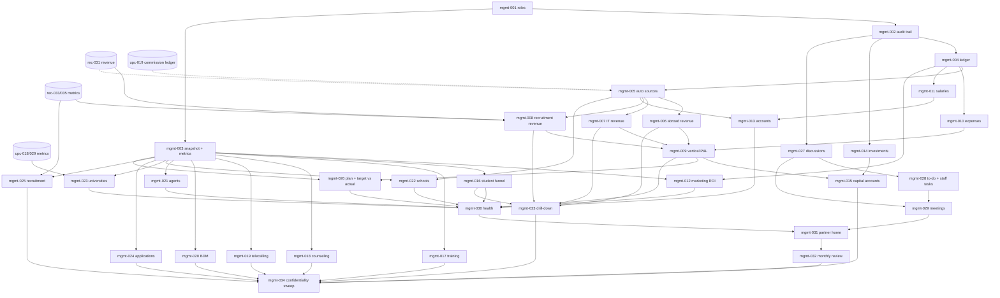

# Management & Business Command Center — Engineering Enhancement Backlog (`mgmt-001` … `mgmt-034`)

NO-ASSUMPTION MODE. Prepared 2026-10-08 at the user's request. **No code was written or changed.**

- **Source:** `functionalities/edusphere_markdown/Management Functionalities.md` = `EVID-017` (`DERIVED_BLUEPRINT`; `SOURCE_MANIFEST.csv`
  sha256 `cc0c8f56…`, re-hashed and matching).
  - I read the whole file: 1,484 lines, 33 numbered sections, and a closing "key difference" drill-down note (1439–1480).
  - The section audit is in §1. Appendix A traces all 728 non-structural lines, and Appendix B defines every counted figure.
- **Scope authority:** the user's in-session answers of 2026-10-08, M1–M14 in §3.1 (`EXPLICIT_APPROVAL`).
  - They lift `PRD_OPEN_ITEMS.md` item 69 and `CONFLICT_MATRIX.md` C-10 for `EVID-017`. C-10 called it "zero evidentiary basis … the most
    sensitive data category", and it is now decided by the user's explicit answers.
  - The answers will be registered as one DEC-SCOPE when mgmt-001 starts.
  - **M3 amends UPC U2** (`UNIVERSITY_PARTNERSHIP_CRM_BACKLOG.md`): partners also see university commission. That backlog's U2 row
    carries a dated amendment note.
- **Method:**
  - graphify, refreshed 2026-10-07, was queried first.
  - Two read-only investigations covered existing money, people and metrics data, and governance.
  - Every cited fact was checked against `origin/main@eb76749d`. The code is the same as at `main@70243aaf`.
  - Context documents: `ARCHITECTURE_BASELINE.md`, and the Recruiter and University Partnership backlogs, whose management-facing items
    this module consumes.
- **Gates:** every item stays behind GATE-09. The §3.2 questions are asked **one at a time** when each item starts.
- **Authorization convention (user, 2026-09-28):** inline checks only.
  - The order is `User.role`, then `services/management_access.py` tier checks (M13), then the action.
  - **Partner-only data** (investments, capital accounts, salaries, per M2/M13) is refused to `super_admin` and the accountant **at the
    route and serializer**, not only in the UI.

---

## 0. What already exists (verified in code, not assumed)

| Capability | Where | State vs this source |
|---|---|---|
| Top role | `super_admin` (`rbac.PERMISSIONS {"*"}`), global; most routes still check explicit role sets. **No partner/owner/accountant role.** `users.role` is `String(50)` with **no CHECK**, so a new role needs no migration | New `partner` and `accountant` roles (M2, M5) |
| Money in | `Payment` (`models.py:716`): amount, currency, status, `division` (it/overseas), **polymorphic `reference_type`/`reference_id`, no FK**. `Invoice`, `Receipt`, `EMISchedule`. `reference_type` ∈ `enrollment_fee` (IT, via Enrollment → Batch → Program, `workflows.py:437`), `service_fee` (admin, `admin.py:969`), `agent_deposit` (pass-through university deposit, `agent_deposits.py:106`) | Auto income lines (mgmt-005). Overseas service fees have **no country/university link**, so only partial attribution is possible (Q-10) |
| Money out | `AgentCommission` paid (EduSphere → agent); `BdmTrip.estimated_cost`, `BdmTripExpense` (travel/stay/food/local/other) | Auto expense lines (mgmt-005). **Nothing else exists**: no rent, salary, trainer payment, budget, tax or payables |
| Admin money figure | `GET /admin/dashboard` revenue = SUM(paid Payment) **across currencies and including agent deposits** (`admin.py:220-238`). `ReportPreview.tsx` shows **hard-coded placeholder values** | Superseded for management by mgmt-004/005. The existing admin figure is kept unchanged (Q-07 records the difference) |
| School revenue | `School`: tier, tier_valid_until, partnership_date, `mou_reference` text, `branch` text. **No contract or renewal value.** `BdmMou` has no value. Renewal dates exist (`school_analytics._renewal_due`) | School revenue/contract value per Q-23 (mgmt-022) |
| Forecast money | `BdmAppointment.expected_revenue` only | Not used (not in the source) |
| People | **No employee, HR, department, branch or staff-attendance model.** `BdmProfile.department` (free text), `TelecallerProfile`. Staff are countable by `User.role` | Salaries are department totals (M6). Branch is not tracked (M10) |
| Marketing | `TelCampaign` (no budget/spend), 13 lead sources (`tel_sources.py`), `Enquiry.source/campaign_id` | Budget per channel-month + ledger spend tag (M7) |
| Trainer data | `Batch.trainer_id`, `Attendance` (students), `Assessment`/`AssessmentAttempt`, `CourseFeedback` (per batch), `Certificate` | Training KPIs (mgmt-017) |
| Funnels | IT: Enquiry → Enrollment → Attendance/Assessment → Certificate → PlacementProfile → JobApplication → Offer. Overseas: application statuses enquiry … enrolled + withdrawn; `submitted_on`; offer fields; `ApplicationDeposit`; `VisaCase` (decision approved). **No documents-complete, under-review, accepted or CAS/COE stage** | Mapped funnel + "not tracked" (M9) |
| Module metrics | `telecaller_metrics` (`flow_counts_by_user`, `tiles`, …), `telecaller_performance.performance`, `telecaller_reports.report`, `bdm_metrics` (`college_business`, `monthly_counts`, `fee_filter`), `bdm_performance.figures/hierarchy`, `school_analytics` (`student_indicators`, cross-school rows), AGN-022 network view (`admin.py:1280-1406`). Agency CRM routes **refuse super_admin** (`agent_students.py:40-47`) | Reused by management dashboards (mgmt-016–025) through `services/management_metrics.py` |
| Tasks/meetings | `BdmTask`, `AgentTask`, `BdmAppointment`/`BdmMeetingReport`, `services/meetings.py` (links only). **No generic to-do, meeting, minutes, decision or plan model** | New (mgmt-026–029) |
| Audit | `AuditLog` (actor, action, entity, outcome, metadata). `GET /admin/audit` (latest 500), `POST /admin/audit/export` (super_admin, JSON) | Management audit view (mgmt-002) |
| PDF | `reporting/pdf.py` (pure reportlab renderer) | Monthly review PDF (mgmt-032) |
| Charts | No chart library. Hand-built `GradeBarChart`, `CompletionRing`, `GlobalEducationFunnel` | Hand-built charts (no new dependency) |
| Dependent backlogs | Recruiter rec-031 (revenue tracked only), rec-033/035 (management views). UPC upc-018/019/029 (funnel, commission ledger, global dashboard). **Neither is built yet** | mgmt-008, 023, 025 depend on them. Until then they show "not available yet" |
| Governance | No DEC on finance, payroll, partners or branches. `DEC-PAY-002` (GST / multi-currency) is open. `DEC-PRIV-001` (UK GDPR, retention open) | M4 (no GST computation); Q-06, Q-33 |
| Numbering | `main` head `0099` / `DEC-SCOPE-115` / API §12AH / RBAC §2.41. Recruiter and UPC hold provisional claims on the next numbers | See §5.4 |

---

## 1. Source coverage audit (section by section)

| Source § (lines) | Content | Covered by | Notes |
|---|---|---|---|
| Title (1) | Command center | all | M1 |
| §1 Structure (3–57) | Partners → Management dashboard → Operations / Finance / Strategy | mgmt-001 (nav), mgmt-031, mgmt-033 | Box diagram |
| §2 Partner login (59–129) | 2 partner accounts; same data; 7 "who did X" audit points; 15 dashboard items | mgmt-001, mgmt-002, mgmt-031 | M2 |
| §3 Business snapshot (131–155) | 15 KPIs from the DB | mgmt-003 | Appendix B S1–S15 |
| §4 Abroad revenue (157–199) | 8 breakdowns; revenue / expenses / contribution | mgmt-006 | M4, M3; Q-09/Q-10 |
| §5 IT training revenue (201–243) | 6 courses; 7 views | mgmt-007 | — |
| §6 Recruitment revenue (245–281) | 6 revenue kinds; 9 KPIs | mgmt-008 | Needs Recruiter |
| §7 Profitability (283–296) | P&L per vertical | mgmt-009 | — |
| §8 Expenses (298–354) | 8 fixed + 9 variable categories; dashboard | mgmt-004, mgmt-010 | M4 |
| §9 Salary (356–386) | 7 figures; employee cost ratio | mgmt-011 | M6 |
| §10 Marketing ROI (388–407) | Budget → Spend → Leads → Conversions → Revenue → ROI | mgmt-012 | M7 |
| §11 Student funnel (409–467) | 9 stages; 9 breakdowns | mgmt-016 | Branch not tracked (M10) |
| §12 Training (469–511) | 11 KPIs; 7 trainer metrics | mgmt-017 | — |
| §13 Counseling (513–535) | 8 KPIs | mgmt-018 | Q-20 |
| §14 Telecalling (537–559) | 8 KPIs; conversion chain | mgmt-019 | — |
| §15 Marketing (561–593) | 15 figures | mgmt-012 | — |
| §16 BDM (595–647) | Agent / School / College BDM figure sets | mgmt-020 | — |
| §17 Agents (649–681) | 12 figures; Agent → Staff → … → Revenue chain | mgmt-021 | Q-22 |
| §18 Schools (683–715) | 12 figures; school-wise revenue / contract / renewal | mgmt-022 | Q-23 |
| §19 University partnership (717–785) | 12 KPIs; 8-step pipeline; expected date | mgmt-023 | Needs UPC |
| §20 Applications (787–849) | 11-step funnel; 8 filters | mgmt-024 | M9 |
| §21 Recruitment (851–879) | 11 KPIs; company pipeline | mgmt-025 | Needs Recruiter |
| §22 Accounts (881–929) | 5 income, 8 expense, 6 position figures | mgmt-013 | M4 |
| §23 Investments (931–969) | 11 fields; ROI example | mgmt-014 | Partner-only (M13) |
| §24 Capital accounts (971–995) | 8 figures per partner; permission-controlled | mgmt-015 | M8 |
| §25 Next month plan (997–1045) | Plan per vertical | mgmt-026 | M11 |
| §26 Target vs actual (1047–1060) | 8 example rows | mgmt-026 | M11 |
| §27 Discussions and decisions (1062–1100) | 11 fields | mgmt-027 | M14 |
| §28 To-do (1102–1131) | 4 bands; 7 examples; owner / priority / deadline / status | mgmt-028 | M14 |
| §29 Meetings (1133–1155) | 7 meeting kinds; Meeting → Minutes → Decision → Task → Deadline → Completion | mgmt-029 | — |
| §30 Health score (1157–1203) | 12 factors; 7 RAG lines | mgmt-030 | Q-29 |
| §31 Partner home (1205–1239) | Greeting; 7 snapshot figures; 9 panels | mgmt-031 | — |
| §32 Monthly review (1241–1361) | 10 sections | mgmt-032 | M12 |
| §33 Final structure (1363–1437) | 5 pillars; BI this month / next month / long term | mgmt-001 (nav), mgmt-031, mgmt-033 | "Long-term strategy" → Q-35 |
| Key difference (1439–1480) | Business → Department → Employee → Transaction drill-down; 3 chains | mgmt-033 | — |
| "Top/Bottom of Form" (1482, 1484) | Copy-paste artefacts | — | Not requirements |

**Not in the source, so not added:**
- Accounting-software sync (M4).
- GST/tax computation (M4, `DEC-PAY-002`).
- Per-employee payroll (M6).
- Company branches (M10).
- Automatic profit distribution (M8).
- External BI tools.

**Added though not in the source** (your conventions):
- The `accountant` role. You chose it in M5.
- mgmt-034, a confidentiality and permission sweep (the tel-026 / upc-033 precedent).

---

## 2. Backlog summary

| ID | Title | Cx | Risk | Migration | Depends on |
|---|---|---|---|---|---|
| mgmt-001 | `partner` + `accountant` roles: provisioning, sign-in, Command Center shell/nav | M | High | No (roles are strings) | — |
| mgmt-002 | Management audit trail ("who did what") | S | Medium | Maybe (index) | 001 |
| mgmt-003 | Business snapshot + `management_metrics` foundation | M | Medium | No | 001 |
| mgmt-004 | Management ledger: categories, manual income/expense, approval, tags | L | High | Yes | 001 |
| mgmt-005 | Automatic ledger sources (payments, commissions, trips, rec/upc receipts) | M | High | No | 004 |
| mgmt-006 | Abroad Education revenue dashboard | M | Medium | No | 005 |
| mgmt-007 | IT Training revenue dashboard | M | Medium | No | 005 |
| mgmt-008 | Recruitment & Placement revenue dashboard | M | Medium | No | 005, rec-031, rec-033 |
| mgmt-009 | Company profitability (vertical P&L) | M | Medium | No | 006, 007, 008, 010 |
| mgmt-010 | Expense dashboard | S | Low | No | 004 |
| mgmt-011 | Salary management (department totals) + employee cost ratio | M | High | Yes | 004 |
| mgmt-012 | Marketing budget, spend, ROI + marketing dashboard | M | Medium | Yes | 004, 003 |
| mgmt-013 | Accounts dashboard (income, expense, receivables, payables, cash, tax) | M | High | Yes | 005, 011 |
| mgmt-014 | Investment register + ROI | M | High | Yes | 001 |
| mgmt-015 | Partner capital accounts | M | High | Yes | 014, 009 |
| mgmt-016 | Student funnel dashboard | L | Medium | No | 003 |
| mgmt-017 | Training & trainer dashboard | M | Low | No | 003 |
| mgmt-018 | Counseling dashboard | M | Medium | No | 003 |
| mgmt-019 | Telecalling dashboard (company-wide) | S | Low | No | 003 |
| mgmt-020 | BDM dashboards (agent/school/college) | M | Low | No | 003 |
| mgmt-021 | Agent network dashboard | M | Medium | No | 003 |
| mgmt-022 | School dashboard + school revenue / contract / renewal value | M | Medium | Yes | 003, 005 |
| mgmt-023 | University partnership dashboard | S | Low | No | 003, upc-018, upc-029 |
| mgmt-024 | Applications funnel dashboard | M | Medium | No | 003 |
| mgmt-025 | Recruitment dashboard | S | Low | No | 003, rec-033, rec-035 |
| mgmt-026 | Next month plan + target vs actual | L | Medium | Yes | 003, 009 |
| mgmt-027 | Discussions & decisions | M | Medium | Yes | 001 |
| mgmt-028 | Management to-do + staff "Management tasks" list | M | Medium | Yes | 001, 027 |
| mgmt-029 | Management meetings + minutes chain | M | Medium | Yes | 027, 028 |
| mgmt-030 | Business health score | M | Medium | No | 009, 012, 013, 016, 021, 022, 023, 026 |
| mgmt-031 | Partner home dashboard | M | Medium | No | 003, 009, 013, 026–030 |
| mgmt-032 | Monthly Business Review (snapshot + PDF + beat) | L | Medium | Yes | 031 |
| mgmt-033 | Drill-down navigation (business → transaction) | M | High | No | 006, 007, 008, 016 |
| mgmt-034 | Confidentiality + permission sweep | M | High | No | all of 001–033 |

---

## 3. Decisions and questions

### 3.1 Answered in-session 2026-10-08 (`EXPLICIT_APPROVAL`; to be registered as one DEC-SCOPE at mgmt-001)

| # | Question | Answer | Items |
|---|---|---|---|
| M1 | Is `EVID-017` in scope? | **Yes, all sections** (33 + the closing note), including finance, people and partner capital. Every item stays behind GATE-09. This lifts PRD item 69 and C-10 for EVID-017 | all |
| M2 | Partner login | **A new `partner` role** (division global, `/admin/login`, created only by `super_admin`, with no hard cap of 2). Partners read every module's figures and write management-only data. **Partner-only data (investments, capital accounts, salaries) is hidden from `super_admin` and everyone else.** `super_admin` stays the system administrator | 001, 011, 014, 015, 034 |
| M3 | University commission for partners | **Amend UPC U2:** commission is visible to `super_admin` + the partnership roles + **partner**. Partners see commission terms, expected and received amounts, and university-wise revenue | 006, 023, 034 (upc-016/033) |
| M4 | Finance data source | **An internal management ledger, part automatic and part manual.**  • Income: paid `Payment` rows by vertical (agent deposits excluded as pass-through), plus rec-031 and upc-019 receipts, plus manual income entries.  • Expenses: manual entries by category (§8), plus automatic lines from paid agent commissions and BDM trip expenses.  • Receivables come from unpaid payments and invoices. Payables, cash/bank and tax liabilities are entered manually.  • **No GST computation and no accounting-software sync** | 004, 005, 006–013 |
| M5 | Who records ledger entries | **A new `accountant` role** (global) enters and edits income, expenses, salary totals, receivables/payables and cash. It sees the finance dashboards but **not** investments or capital. **Partners approve expenses** and can also edit | 001, 004, 011, 013 |
| M6 | Salary detail | **Department totals per month** (managed department list): headcount, salary payable, salary paid, incentives, commissions, employer cost. **No per-person salaries.** The Employee Cost Ratio is computed | 011 |
| M7 | Marketing ROI | Channels = the existing lead sources (+ campaigns). **Monthly budget per channel** is entered by the partner or accountant. **Spend = ledger expenses tagged with a channel.** Leads, qualified leads and customers are computed from `enquiries` (customer = converted lead). Revenue = paid fees of converted leads' students in the period. ROI = (revenue − spend) ÷ spend | 012 |
| M8 | Capital accounts | Partners record capital transactions (initial, additional, withdrawal, profit distribution) and each partner's share %. The **balance is computed.** "Profit share" = share % × net profit, shown as an **indicative figure only** (no automatic distribution). Outstanding contribution = commitment − invested. Every entry is audited. **Partner-only** | 015 |
| M9 | Application funnel gaps | **Map to existing data, and show "not tracked" otherwise.** Created, Submitted, Offer, Deposit, Visa, Visa Approved and Enrollment are computed. Documents Complete is derived where possible. Under Review, Accepted and CAS/COE show "not tracked". **No change to the overseas workflow** | 024, 016 |
| M10 | Branch | **Not tracked for now.** "Branch" breakdowns show "not tracked" | 016 |
| M11 | Plans | Plan items are typed per vertical, with an **optional KPI from a fixed catalogue** + a target. KPI-linked items get a **live Actual** (target vs actual). Free-text items are tracked done/not done. Module-level targets (BDM, telecaller, partnership) stay separate | 026 |
| M12 | Monthly review | A **beat job on the 1st (IST)** drafts the previous month. Computed sections are **frozen as a snapshot**. Partners add the Problems and Next-Month narrative, then **finalise**. On screen + **PDF** (`reporting/pdf.py`), emailed to partners on finalise | 032 |
| M13 | Visibility | **Tiered.**  • **partner:** everything.  • **super_admin:** operational dashboards (§3, §11–§21), plans/targets, tasks, meetings and discussions, but **no finance figures, salaries, investments or capital**.  • **accountant:** ledger + finance dashboards (§4–§10, §22) + salaries, but no investments or capital.  • Division admins and module managers: unchanged (their existing module dashboards only) | 001, 034, all dashboards |
| M14 | Assignees | **Any active staff user** can be named responsible on a decision or own a task. They see only that item (title, deadline, status, shareable attachments) in a "Management tasks" list in their portal and can update its status. Discussion notes stay management-only | 027, 028, 029 |

### 3.2 Item-level questions (asked one at a time when the item starts; `NEEDS_CONFIRMATION` until then)

| # | Question | Item |
|---|---|---|
| Q-01 | Exactly two partner accounts (hard cap), or any number? Who creates the accountant: `super_admin` only, or partners too? | 001 |
| Q-02 | Do partners also get operational write powers outside management data (e.g. approve agents), or are they read + management-only? | 001 |
| Q-03 | Snapshot definitions: Total vs Active students; "Placement Students"; "Agent Students"; "Partner Schools" (active tier?); "Partner Companies" and "Recruiters" before Recruiter is built | 003 |
| Q-04 | Final income and expense category lists; how shared costs (rent, salaries) reach vertical P&L: unallocated line, fixed %, or manual split per entry | 004, 009 |
| Q-05 | Expense approval: every expense or above a threshold? Either partner or both? What happens to an unapproved expense in the figures? | 004 |
| Q-06 | Currency: the ledger is INR only? How are non-INR payments shown (per currency, or converted at a manual rate)? (`DEC-PAY-002` is open) | 004, 005 |
| Q-07 | Revenue recognition: cash basis on paid date (proposed). Refunds and EMI instalments counted when paid. The existing admin "revenue" figure stays as it is (it differs) | 005 |
| Q-08 | Mapping `Payment.reference_type`/division to verticals (`enrollment_fee` → IT; overseas `service_fee` → Abroad "student service fees"; an IT `service_fee` → ?) | 005 |
| Q-09 | "Application-related revenue" and "Agent-generated revenue" (§4): which payments count? Agent deposits are pass-through (excluded) | 006 |
| Q-10 | Country, university and intake-wise revenue: only attributable payments (deposits, linked applications) and an "unattributed" bucket for the rest? | 006 |
| Q-11 | Trainer, marketing and operational cost per course or batch: expenses tagged to a course/batch? | 007 |
| Q-12 | Recruitment revenue kinds not in the Recruiter backlog (internship programs, corporate training, other employer revenue): manual income categories? | 008 |
| Q-13 | Department list for salaries, and the role → department mapping for headcount and productivity | 011, 032 |
| Q-14 | Marketing channel list (the 13 lead sources + Schools/Events/Influencer?) and the revenue attribution window (fees paid within N days of conversion?) | 012 |
| Q-15 | Payables, cash/bank and tax liabilities: monthly balances, or transactions? | 013 |
| Q-16 | Investment status values. The ROI formula is (actual return − amount) ÷ amount (the source example, 5 L → 18 L = 260%) | 014 |
| Q-17 | Capital accounts: commitment amounts, share % change history, how distributions are recorded | 015 |
| Q-18 | Student funnel stage definitions across IT and overseas ("Registration", "Training/Abroad", "Offer/Certification", "Visa/Placement", "Enrollment/Joining") | 016 |
| Q-19 | Trainer "student feedback" = `CourseFeedback` per batch; how placement outcomes link to a trainer (batch → students → placements) | 017 |
| Q-20 | Counseling KPIs: which counselors (overseas, IT via tel-017) and data (appointments, applications); how "Revenue" is credited per counselor | 018 |
| Q-21 | BDM figures not tracked today (course promotions, internships): "not tracked"? | 020 |
| Q-22 | Agent "Commission" vs "Revenue": commission = paid `AgentCommission` (a cost); revenue = what EduSphere earns from that agent's students (service fees + university commission)? | 021 |
| Q-23 | School revenue, contract value and renewal value: new fields on `School` (contract value, renewal value), or ledger income tagged with the school? | 022 |
| Q-24 | University KPIs "Exclusive", "Countries", "Revenue" (shared with UPC Q-31) | 023 |
| Q-25 | Final KPI catalogue for plans. Plan lock (editable after the month starts?) | 026 |
| Q-26 | Discussion attachments (types, size). Participants: users only or free-text names? | 027 |
| Q-27 | To-do "This Week" = Monday–Sunday IST? Is "Completed" shown for the last 7 days? | 028 |
| Q-28 | Meeting link: typed (as elsewhere)? Minutes: free text + decisions list? | 029 |
| Q-29 | Health score weights and RAG thresholds per factor | 030 |
| Q-30 | "Urgent Issues" (§31): which conditions count (overdue decisions, cash below a threshold, red health factors, expiring agreements…) | 031 |
| Q-31 | Monthly review: generation hour; regenerate before finalise; whether "Attendance" (§32 People) means staff attendance (not tracked) | 032 |
| Q-32 | Drill-down to individual students and payments: do partners see student PII? Is every drill-down read audited? | 033 |
| Q-33 | Financial data retention, CSV export rules and masking (`DEC-PRIV-001` retention is open) | 004, 013, 034 |
| Q-34 | Paths: `/management/*` with partner/accountant sign-in at `/admin/login`? | 001 |
| Q-35 | §33 "Long-term strategy" (expansion, new countries, new products): a plan horizon beyond next month (quarter/year) or free-text strategy notes? | 026 |

---

## 4. Backlog items

Common conventions for every item:
- **Metrics.** One owner, `services/management_metrics.py`, wraps the module metrics services. It holds no copies of module data.
- **Money.** `services/ledger.py` is the single money source. All money is INR unless Q-06 says otherwise. Days are IST.
- **Dashboards.** Each tile links to its list or drill-down (mgmt-033). Figures that cannot be computed show "not tracked" or "not
  available yet", never 0.
- **Writes.** Every write records `created_by` / `updated_by` + `AuditLog`. This is the §2 audit trail.
- **Lists.** `LIMIT/OFFSET` paging.
- **Access tiers** (M13) come from `services/management_access.py`:
  - `can_view_operational(user)`
  - `can_view_finance(user)`
  - `can_view_partner_only(user)`

### mgmt-001 — `partner` + `accountant` roles, sign-in, Command Center shell
- **Business requirement:**
  - §2: two partners, each with their own login and dashboard, "full management access".
  - §1/§33: the hierarchy.
  - M2, M5, M13. Under the user-lifecycle convention, this means the full account lifecycle.
- **Existing behavior:** `super_admin` is the top role. There is no partner or accountant role. `admin.create_user` allows only
  super_admin, bdm_manager and telecaller_manager in the global division (`admin.py:549`).
- **Expected behavior:**
  - Roles:
    - `partner`: global, created only by `super_admin` (cap per Q-01).
    - `accountant`: global, created by `super_admin` or a partner (Q-01).
  - Each gets a set-password welcome email and uses the existing forgot/change password flows.
  - Both sign in at `/admin/login` and land on `/management` (Q-34).
  - The Command Center shell has nav pillars per §33 (Students, Sales, Finance, People, Partnerships + Business Intelligence). Entries
    appear as their items land and are filtered by tier.
  - `services/management_access.py` holds the tier helpers.
  - Partners are not added to existing module gates unless an item says so (Q-02).
- **User roles affected:** new `partner` and `accountant`; `super_admin`.
- **Frontend impact:**
  - `ROLES_BY_DIVISION.global`, the admin create-user form, `lib/navigation.ts` `MANAGEMENT_NAV`.
  - `middleware.ts` protects `/management` → `/admin/login`.
  - Landing map; management layout.
- **Backend impact:**
  - `rbac.PERMISSIONS` (`partner: {"management:*"}`, `accountant: {"management:finance"}`).
  - `admin.create_user`/`update_user` guards; `auth` landing.
  - `api/management.py` (`/management/me`).
- **Database impact:** none (no CHECK on `users.role`).
- **API impact:** `GET /management/me` returns the role + tier flags.
- **Integration impact:** SMTP welcome email.
- **Authentication impact:** new landing pages. Partners are high-value accounts: session revocation (`session_version`) applies.
  Stronger auth (MFA) is not in scope.
- **Authorization impact:** new top-tier data boundary. **`super_admin` is explicitly excluded from partner-only data.**
- **Security impact:** **high.** Privilege boundaries (a `super_admin` creating a partner can't then read partner-only data); every
  partner action is audited.
- **Performance impact:** negligible.
- **Reusable existing modules:** bdm_manager/telecaller_manager provisioning (`admin.py:525-526`), `provisioning.py`, `PortalShell`.
- **Dependencies:** none. It shares the role files with **rec-001** and **upc-001**: strictly one at a time.
- **Acceptance criteria:**
  1. `super_admin` creates two partners and an accountant, and all of them set passwords.
  2. An `it_admin` creating a partner → 403.
  3. A partner lands on `/management`.
  4. A signed-out `/management/*` redirects to `/admin/login?next=`.
  5. No existing role's access changes.
- **Positive scenarios:** Partner 1 and Partner 2 sign in separately and see the same Command Center.
- **Negative scenarios:** an accountant opening a partner-only page → 403; a third partner beyond the cap → 422 (if Q-01 caps).
- **Edge cases:** a deactivated partner (sessions end); the last active partner can't be deactivated (design).
- **Regression risks:** admin user-create; login landing; middleware.
- **Complexity:** medium · **Risk:** high

### mgmt-002 — Management audit trail ("who did what")
- **Business requirement:** §2: record who created a task, changed a target, approved an expense, added an investment, changed a
  financial figure, made a decision, completed an action.
- **Existing behavior:** `AuditLog` exists. `/admin/audit` shows the latest 500 rows; export is super_admin JSON.
- **Expected behavior:**
  - Every management write records actor + before/after field names (values only for non-PII financial fields, per Q-33) in
    `AuditLog` with `entity_type` `mgmt.*`.
  - Every management record shows "created by / last changed by".
  - A Management Activity page lists actions filterable by partner, kind and date. Partner-only entries are visible to partners only.
- **User roles affected:** partner (all); accountant (finance entries); super_admin (operational entries).
- **Frontend impact:** activity page; "by X on date" stamps on records.
- **Backend impact:** `services/management_audit.py` (one helper used by every mgmt write).
- **Database impact:** maybe an index on `audit_logs(entity_type, created_at)`.
- **API impact:** `GET /management/activity`.
- **Integration impact:** none.
- **Authentication impact:** none.
- **Authorization impact:** tier filtering of entries.
- **Security impact:** the audit cannot be edited; partner-only entries are hidden from others.
- **Performance impact:** indexed; paginated.
- **Reusable existing modules:** `AuditLog`, `services/staff_activity.py` idiom.
- **Dependencies:** mgmt-001. Every later mgmt write uses it.
- **Acceptance criteria:**
  1. Each of the 7 §2 action kinds produces an entry with the actor.
  2. An accountant can't see an investment entry.
- **Positive scenarios:** Partner 2 sees that Partner 1 approved an expense.
- **Negative scenarios:** super_admin filtering for capital entries → none returned.
- **Edge cases:** a bulk import is logged as one entry with a count.
- **Regression risks:** none.
- **Complexity:** small · **Risk:** medium

### mgmt-003 — Business snapshot + `management_metrics` foundation
- **Business requirement:** §3, 15 KPIs: "the actual numbers should come from your database".
- **Existing behavior:** the admin dashboard counts users, enquiries, programs, universities and applications only.
- **Expected behavior:**
  - `services/management_metrics.py` (owner) computes S1–S15 (Appendix B).
  - Figures from modules not yet built (S10 Partner Companies, S15 Recruiters, S9 University Partners before UPC) show "not available
    yet".
  - The snapshot page is shown to partner and super_admin (operational tier).
- **User roles affected:** partner, super_admin.
- **Frontend impact:** snapshot tiles.
- **Backend impact:** `management_metrics.snapshot()`.
- **Database impact:** none.
- **API impact:** `GET /management/snapshot`.
- **Integration impact:** none.
- **Authentication impact:** none.
- **Authorization impact:** operational tier.
- **Security impact:** counts only.
- **Performance impact:** a fixed query count (one grouped query per source); test.
- **Reusable existing modules:** `admin.py:220` counts, `school_analytics`, `bdm_metrics`, `telecaller_metrics`.
- **Dependencies:** mgmt-001.
- **Acceptance criteria:**
  1. Each KPI equals its Appendix B definition in fixtures.
  2. Missing modules show "not available yet", not 0.
- **Positive scenarios:** n/a.
- **Negative scenarios:** an accountant → 403 (operational tier).
- **Edge cases:** deactivated users excluded.
- **Regression risks:** none.
- **Complexity:** medium · **Risk:** medium

### mgmt-004 — Management ledger: categories, manual income/expense, approval, tags
- **Business requirement:** §8 "one centralized expense module" (8 fixed + 9 variable categories); §22 income/expense heads; §2 "who
  approved an expense"; M4, M5, M7.
- **Existing behavior:** no expense or income ledger.
- **Expected behavior:**
  - `ledger_categories`: kind income/expense, fixed/variable, managed list seeded from §8 and §22 (Q-04).
  - `ledger_entries` (manual):
    - date, kind, category, amount (INR, Q-06), description, vertical (abroad / it / recruitment / school / other / shared, Q-04)
    - optional tags: marketing channel (M7), course/batch (Q-11), school (Q-23)
    - attachment (receipt), status draft → submitted → **approved** (expenses: partner per Q-05) / rejected
    - `created_by`, `approved_by`
  - Only approved entries count in the figures (Q-05).
  - The accountant and partners create entries. Partners approve.
- **User roles affected:** accountant, partner.
- **Frontend impact:** ledger list (filters: month, kind, category, vertical, status), entry form with upload, approval queue for
  partners.
- **Backend impact:** `api/management_ledger.py`, `services/ledger.py` (owner).
- **Database impact:** `ledger_categories` (+ seed), `ledger_entries`, `ledger_entry_events`.
- **API impact:** `GET/POST /management/ledger`, `PATCH /management/ledger/{id}`, `POST …/submit|approve|reject`,
  `GET/POST/PATCH /management/ledger/categories`.
- **Integration impact:** storage (attachments).
- **Authentication impact:** none.
- **Authorization impact:** finance tier. Only a partner can approve, and an approver cannot approve their own entry (design).
- **Security impact:** **high.** Financial integrity: approved entries are immutable except through a reversing entry (design); every
  change is audited.
- **Performance impact:** indexed by month, category and vertical.
- **Reusable existing modules:** `read_upload`, `services/storage`, the BDM trip approval idiom.
- **Dependencies:** mgmt-001, mgmt-002.
- **Acceptance criteria:**
  1. An accountant records a rent expense, a partner approves it, and it appears in the expense totals.
  2. An unapproved entry is excluded.
  3. A super_admin → 403.
- **Positive scenarios:** Office rent ₹1,20,000 for October, shared vertical.
- **Negative scenarios:** a negative amount → 422; an accountant approving → 403.
- **Edge cases:** correcting an approved entry (reversal); a category deactivated after use.
- **Regression risks:** none (new tables).
- **Complexity:** large · **Risk:** high

### mgmt-005 — Automatic ledger sources
- **Business requirement:** M4 ("auto from paid Payments … + rec-031/upc-019 receipts … + auto lines from paid agent commissions and
  BDM trip expenses"); §22 "connected to every module".
- **Existing behavior:**
  - Payments are scattered across modules.
  - The admin revenue figure mixes currencies and includes deposits.
- **Expected behavior:**
  - `ledger.lines(period)` = a UNION of (computed on read; nothing is copied):
    - Manual approved entries.
    - Paid `Payment` rows by vertical. `enrollment_fee` → IT; overseas `service_fee` → Abroad; the rest per Q-08. **`agent_deposit`
      is excluded.**
    - Paid `AgentCommission` → expense "Agent commissions".
    - `BdmTripExpense` (approved trips) → expense "Travel".
    - rec-031 payments received → Recruitment income (when rec-031 exists).
    - upc-019 receipts → Abroad "University commission" (when upc-019 exists).
  - Each line keeps its source link for drill-down.
  - Recognition is cash basis (Q-07).
- **User roles affected:** accountant, partner.
- **Frontend impact:** the ledger shows auto lines read-only, with a source badge.
- **Backend impact:** `services/ledger.py`.
- **Database impact:** none.
- **API impact:** `GET /management/ledger?include=auto`.
- **Integration impact:** none.
- **Authentication impact:** none.
- **Authorization impact:** finance tier.
- **Security impact:** student names in payment lines (PII) are partner/accountant only (Q-32).
- **Performance impact:** UNION over indexed date columns; monthly aggregation queries.
- **Reusable existing modules:** `bdm_metrics.fee_filter` (deposit exclusion), `Payment`/`Receipt`.
- **Dependencies:** mgmt-004 (+ rec-031, upc-019 optional).
- **Acceptance criteria:**
  1. A paid IT enrolment fee appears once under IT income.
  2. A paid agent deposit never appears.
  3. A paid agent commission appears as an expense.
  4. Totals reconcile with the source tables.
- **Positive scenarios:** n/a.
- **Negative scenarios:** a refunded payment (Q-07) is excluded or shown as a negative.
- **Edge cases:** EMI instalments; non-INR payments (Q-06).
- **Regression risks:** none (read-only).
- **Complexity:** medium · **Risk:** high (figures must reconcile)

### mgmt-006 — Abroad Education revenue dashboard
- **Business requirement:** §4: student service fees, application-related revenue, university commission, agent-generated revenue,
  country/university/intake/agent-wise revenue; Revenue / Expenses / Gross Contribution.
- **Existing behavior:** none (overseas reporting is revenue-agnostic).
- **Expected behavior:**
  - Abroad income by kind (Q-09).
  - Breakdowns by country/university/intake/agent where attributable, plus an "unattributed" bucket (Q-10).
  - Expenses tagged Abroad (+ allocated shared per Q-04).
  - Contribution = revenue − expenses.
  - University commission shown to partners (M3), hidden from the accountant? (follows U2 as amended: **not** the accountant).
- **User roles affected:** partner (full); accountant (no university commission).
- **Frontend impact:** vertical dashboard with breakdown tables (hand-built bars).
- **Backend impact:** `management_metrics.vertical('abroad')`.
- **Database impact:** none.
- **API impact:** `GET /management/revenue/abroad`.
- **Integration impact:** none.
- **Authentication impact:** none.
- **Authorization impact:** finance tier + the commission rule.
- **Security impact:** the commission strip (`partnership_access.strip_commission`, extended for partner).
- **Performance impact:** grouped queries.
- **Reusable existing modules:** `agent_reports` grouping, upc-018/019.
- **Dependencies:** mgmt-005.
- **Acceptance criteria:** the sum of breakdowns + unattributed = Abroad revenue; contribution = revenue − expenses.
- **Positive scenarios:** n/a.
- **Negative scenarios:** an accountant sees no university-commission line.
- **Edge cases:** a period with no expenses.
- **Regression risks:** none.
- **Complexity:** medium · **Risk:** medium

### mgmt-007 — IT Training revenue dashboard
- **Business requirement:** §5: revenue per course (example: 5 courses + other), course-wise, batch-wise, student-wise payments,
  trainer/marketing/operational cost, placement revenue if applicable; the example table course/students/revenue.
- **Existing behavior:** RPT-001 shows the IT funnel and progress, with no revenue per course.
- **Expected behavior:**
  - Per `Program` and `Batch`: students (enrolments) and revenue (paid `enrollment_fee`, + `service_fee` per Q-08).
  - Student payments list (drill-down).
  - Costs from expenses tagged course/batch/IT (Q-11).
  - Placement revenue from rec-031 for IT-sourced candidates (when present).
- **User roles affected:** partner, accountant.
- **Frontend impact:** dashboard + the course table.
- **Backend impact:** `management_metrics.vertical('it')`.
- **Database impact:** none.
- **API impact:** `GET /management/revenue/it`.
- **Integration impact:** none.
- **Authentication impact:** none.
- **Authorization impact:** finance tier.
- **Security impact:** student-wise payments are PII (Q-32).
- **Performance impact:** grouped.
- **Reusable existing modules:** `workflows.py:437` fee linkage, RPT-001.
- **Dependencies:** mgmt-005.
- **Acceptance criteria:** course revenue = the sum of its batches; student counts = enrolments.
- **Positive scenarios:** the source's 5-course table from fixtures.
- **Negative scenarios:** n/a.
- **Edge cases:** a course with no fee; EMI students.
- **Regression risks:** none.
- **Complexity:** medium · **Risk:** medium

### mgmt-008 — Recruitment & Placement revenue dashboard
- **Business requirement:** §6: recruitment fees, placement fees, employer payments, internship programs, corporate training, other;
  9 KPIs.
- **Existing behavior:** none (the Recruiter backlog is not built).
- **Expected behavior:**
  - Revenue from rec-031 receipts + manual income categories for the kinds not in rec (Q-12).
  - KPIs from `recruiter_metrics` (rec-033): recruiters, partner companies, open positions, candidates, interviews, selections,
    joining, placement %, revenue per placement.
  - Shows "not available yet" until rec-031/033 exist.
- **User roles affected:** partner, accountant (revenue); super_admin (KPIs only).
- **Frontend impact:** dashboard.
- **Backend impact:** `management_metrics.vertical('recruitment')`.
- **Database impact:** none.
- **API impact:** `GET /management/revenue/recruitment`.
- **Integration impact:** none.
- **Authentication impact:** none.
- **Authorization impact:** tiered.
- **Security impact:** low.
- **Performance impact:** reuses rec metrics.
- **Reusable existing modules:** rec-031, rec-033.
- **Dependencies:** mgmt-005, **rec-031, rec-033**.
- **Acceptance criteria:**
  1. Revenue per placement = recruitment revenue ÷ joined.
  2. KPIs match rec-033.
- **Positive scenarios:** n/a.
- **Negative scenarios:** before Recruiter exists → "not available yet".
- **Edge cases:** n/a.
- **Regression risks:** none.
- **Complexity:** medium · **Risk:** medium

### mgmt-009 — Company profitability (vertical P&L)
- **Business requirement:** §7: revenue, expenses and contribution per vertical + total; "which business is actually making money".
- **Existing behavior:** none.
- **Expected behavior:** a P&L table for Abroad / IT / Recruitment (+ School/Other per §22) with shared costs per Q-04 (shown as a
  separate "Shared/Unallocated" row if not allocated). Month, quarter or year selection. Net profit and margin feed mgmt-013/015/030/032.
- **User roles affected:** partner, accountant.
- **Frontend impact:** P&L page.
- **Backend impact:** `management_metrics.pnl(period)`.
- **Database impact:** none.
- **API impact:** `GET /management/pnl`.
- **Integration impact:** none.
- **Authentication impact:** none.
- **Authorization impact:** finance tier.
- **Security impact:** low.
- **Performance impact:** aggregate.
- **Reusable existing modules:** mgmt-005.
- **Dependencies:** mgmt-006, 007, 008, 010.
- **Acceptance criteria:** the total row = the sum of the rows; contribution = revenue − expenses.
- **Positive scenarios:** n/a.
- **Negative scenarios:** n/a.
- **Edge cases:** a negative contribution is shown in red.
- **Regression risks:** none.
- **Complexity:** medium · **Risk:** medium

### mgmt-010 — Expense dashboard
- **Business requirement:** §8 dashboard (monthly + annual per category + total).
- **Existing behavior:** none.
- **Expected behavior:** expense totals per category for the month and year-to-date (financial-year start per Q-04?), from approved
  manual + auto lines.
- **User roles affected:** partner, accountant.
- **Frontend impact:** table + bars.
- **Backend impact:** `ledger.totals`.
- **Database impact:** none.
- **API impact:** `GET /management/expenses`.
- **Integration impact:** none.
- **Authentication impact:** none.
- **Authorization impact:** finance tier.
- **Security impact:** low.
- **Performance impact:** low.
- **Reusable existing modules:** mgmt-004/005.
- **Dependencies:** mgmt-004 (005 for the auto lines).
- **Acceptance criteria:** the total = the sum of the categories; annual = the sum of the months.
- **Positive scenarios:** n/a.
- **Negative scenarios:** n/a.
- **Edge cases:** n/a.
- **Regression risks:** none.
- **Complexity:** small · **Risk:** low

### mgmt-011 — Salary management + employee cost ratio
- **Business requirement:** §9 (total employees, department-wise salary, payable, paid, incentives, commissions, employer cost; total
  monthly employee cost; ratio = employee cost ÷ revenue × 100) (M6).
- **Existing behavior:** none.
- **Expected behavior:**
  - `departments` (managed list, Q-13).
  - `salary_month_totals` (month, department, headcount, payable, paid, incentives, commissions, employer cost), entered by the
    accountant.
  - Total employee cost and ratio vs ledger revenue.
  - **Visible to partner and accountant; super_admin excluded (M13).**
  - Salary paid can post an expense line (salaries) automatically, so it is not entered twice (design).
- **User roles affected:** accountant, partner.
- **Frontend impact:** monthly grid per department.
- **Backend impact:** `services/salaries.py`.
- **Database impact:** `departments`, `salary_month_totals`.
- **API impact:** `GET/PUT /management/salaries?month`.
- **Integration impact:** none.
- **Authentication impact:** none.
- **Authorization impact:** finance tier, but not super_admin.
- **Security impact:** aggregate salary data is sensitive: partner and accountant only.
- **Performance impact:** negligible.
- **Reusable existing modules:** none.
- **Dependencies:** mgmt-004.
- **Acceptance criteria:**
  1. The ratio matches the formula.
  2. super_admin → 403.
  3. Salary cost appears once in expenses.
- **Positive scenarios:** n/a.
- **Negative scenarios:** paid > payable (warning).
- **Edge cases:** a department with a headcount of 1 effectively reveals one salary (Q-33: show anyway to partners only).
- **Regression risks:** none.
- **Complexity:** medium · **Risk:** high

### mgmt-012 — Marketing budget, spend, ROI + marketing dashboard
- **Business requirement:** §10 (Budget → Spend → Leads → Conversions → Revenue → ROI per channel; "what is working?") and §15 (15
  figures) (M7).
- **Existing behavior:** leads per source and campaign exist (telecaller reports). There is no budget or spend.
- **Expected behavior:**
  - `marketing_budgets` (month, channel, amount).
  - Spend = expense entries tagged with the channel.
  - Leads, qualified leads and customers come from `enquiries` by source/campaign. Website, school, college, agent and influencer leads
    are source groups (Q-14).
  - Revenue = paid fees of converted leads' students in the window (Q-14). ROI computed.
  - Campaign list. "Social media performance" = leads from social sources (no platform API).
- **User roles affected:** partner, accountant (budget/spend/ROI); super_admin (lead counts only, M13).
- **Frontend impact:** the ROI table per channel + the marketing dashboard.
- **Backend impact:** `management_metrics.marketing()`.
- **Database impact:** `marketing_budgets`.
- **API impact:** `GET/PUT /management/marketing/budgets`, `GET /management/marketing`.
- **Integration impact:** none (no ad-platform APIs).
- **Authentication impact:** none.
- **Authorization impact:** tiered.
- **Security impact:** low.
- **Performance impact:** grouped over `enquiries`.
- **Reusable existing modules:** `telecaller_reports` (source/campaign funnels), `tel_sources.py`.
- **Dependencies:** mgmt-004, mgmt-003.
- **Acceptance criteria:**
  1. The source's Instagram row computes ROI from its figures.
  2. Spend never double-counts.
- **Positive scenarios:** n/a.
- **Negative scenarios:** a budget for an unknown channel → 422.
- **Edge cases:** zero spend (ROI "—").
- **Regression risks:** none.
- **Complexity:** medium · **Risk:** medium

### mgmt-013 — Accounts dashboard
- **Business requirement:** §22: income (5 heads), expenses (8 heads), and financial position (receivables, payables, cash/bank,
  profit, tax liabilities, pending invoices).
- **Existing behavior:** none (unpaid payments exist).
- **Expected behavior:**
  - Income and expenses come from the ledger.
  - Receivables = unpaid or overdue `Payment` (due date) + manual receivables (e.g. university commission outstanding from upc-019,
    recruiter outstanding from rec-031).
  - `finance_balances` (month-end cash/bank, payables, tax liabilities; Q-15), entered by the accountant.
  - Profit = net from mgmt-009.
  - Pending invoices = unpaid invoices (Payment + rec-031 + upc-019).
- **User roles affected:** partner, accountant.
- **Frontend impact:** accounts page.
- **Backend impact:** `management_metrics.accounts()`.
- **Database impact:** `finance_balances`.
- **API impact:** `GET /management/accounts`, `PUT /management/accounts/balances?month`.
- **Integration impact:** none.
- **Authentication impact:** none.
- **Authorization impact:** finance tier.
- **Security impact:** high (financial position).
- **Performance impact:** low.
- **Reusable existing modules:** mgmt-005, rec-031, upc-019.
- **Dependencies:** mgmt-005, mgmt-011.
- **Acceptance criteria:** receivables reconcile with unpaid payments + outstanding external invoices.
- **Positive scenarios:** n/a.
- **Negative scenarios:** super_admin → 403.
- **Edge cases:** a month without balances entered ("not entered").
- **Regression risks:** none.
- **Complexity:** medium · **Risk:** high

### mgmt-014 — Investment register + ROI
- **Business requirement:** §23 (11 fields; the example ₹5 L → ₹18 L = 260%; "where company money is being invested and what it
  produces").
- **Existing behavior:** none.
- **Expected behavior:**
  - `investments`: code, date, investor/partner (partner user or "company"), amount, purpose, vertical, expected return, actual return,
    status (Q-16), notes.
  - ROI = (actual − amount) ÷ amount × 100. Totals for the period.
  - **Partner-only (M13).**
- **User roles affected:** partner.
- **Frontend impact:** register + detail.
- **Backend impact:** `services/investments.py`.
- **Database impact:** `investments`, code seq.
- **API impact:** `GET/POST/PATCH /management/investments`.
- **Integration impact:** none.
- **Authentication impact:** none.
- **Authorization impact:** partner-only (super_admin and accountant → 403).
- **Security impact:** high.
- **Performance impact:** negligible.
- **Reusable existing modules:** none.
- **Dependencies:** mgmt-001, mgmt-002.
- **Acceptance criteria:**
  1. The source example computes 260%.
  2. Every add or change appears in the audit (§2 "who added an investment").
- **Positive scenarios:** n/a.
- **Negative scenarios:** an accountant → 403.
- **Edge cases:** actual return not yet known (ROI "—").
- **Regression risks:** none.
- **Complexity:** medium · **Risk:** high

### mgmt-015 — Partner capital accounts
- **Business requirement:** §24 (8 figures per partner; "permission-controlled") (M8).
- **Existing behavior:** none.
- **Expected behavior:**
  - `partner_capital_entries` (partner, date, kind: initial / additional / withdrawal / profit_distribution, amount, note).
  - `partner_shares` (partner, share %, commitment, effective from).
  - Computed: capital invested, additional, withdrawals, share %, indicative profit share (share % × net profit from mgmt-009), returns
    (distributions), outstanding contribution, capital balance.
  - Partner-only, fully audited.
- **User roles affected:** partner.
- **Frontend impact:** per-partner capital account page.
- **Backend impact:** `services/partner_capital.py`.
- **Database impact:** the two tables.
- **API impact:** `GET /management/capital`, `POST /management/capital/entries`, `PUT /management/capital/shares`.
- **Integration impact:** none.
- **Authentication impact:** none.
- **Authorization impact:** partner-only. Can each partner see both accounts? Yes, both partners see company data (§2); confirm in
  Q-17.
- **Security impact:** **highest sensitivity.**
- **Performance impact:** negligible.
- **Reusable existing modules:** none.
- **Dependencies:** mgmt-014 (ordering only), mgmt-009.
- **Acceptance criteria:**
  1. Share % totals 100% (warn otherwise).
  2. Balance = invested + additional − withdrawals.
  3. Profit share = share % × net profit.
  4. super_admin and accountant → 403.
- **Positive scenarios:** n/a.
- **Negative scenarios:** a withdrawal exceeding the balance (warn).
- **Edge cases:** a share % change mid-year (effective dating).
- **Regression risks:** none.
- **Complexity:** medium · **Risk:** high

### mgmt-016 — Student funnel dashboard
- **Business requirement:** §11: Leads → Telecalling → Counseling → Registration → Training/Abroad → Application → Offer/Certification →
  Visa/Placement → Enrollment/Joining; 9 breakdowns (country, course, agent, school, counselor, marketing source, BDM, intake, branch).
- **Existing behavior:** per-module funnels only.
- **Expected behavior:**
  - A unified funnel over the period: IT path and Abroad path side by side.
  - Stage counts per Q-18, from lead stages, appointments, enrolments, applications, certificates, visas, placements and offers.
  - Breakdowns where the dimension exists. **Branch = "not tracked" (M10).**
- **User roles affected:** partner, super_admin.
- **Frontend impact:** funnel page with a breakdown selector (`GlobalEducationFunnel` reuse).
- **Backend impact:** `management_metrics.student_funnel()`.
- **Database impact:** none.
- **API impact:** `GET /management/funnel?by=`.
- **Integration impact:** none.
- **Authentication impact:** none.
- **Authorization impact:** operational tier.
- **Security impact:** counts only.
- **Performance impact:** heavy; fixed query count, cached per request.
- **Reusable existing modules:** `telecaller_metrics`, `school_analytics`, `agent_reports`, RPT-001.
- **Dependencies:** mgmt-003.
- **Acceptance criteria:**
  1. Each stage count equals its definition.
  2. Breakdown totals equal the stage totals (+ "unknown").
- **Positive scenarios:** n/a.
- **Negative scenarios:** accountant → 403.
- **Edge cases:** a student in both IT and abroad.
- **Regression risks:** none.
- **Complexity:** large · **Risk:** medium

### mgmt-017 — Training & trainer dashboard
- **Business requirement:** §12: 11 training KPIs + 7 trainer metrics.
- **Existing behavior:** RPT-001 IT progress; batch data.
- **Expected behavior:**
  - Training KPIs: courses, active batches, students, trainers, attendance %, completion, dropouts, assessments, certifications,
    placement-ready (`PlacementProfile.readiness`), placements.
  - Trainer table: students trained, attendance, completion, feedback (`CourseFeedback` avg), assessment results, batch performance,
    placement outcomes (Q-19).
- **User roles affected:** partner, super_admin.
- **Frontend impact:** dashboard + trainer table.
- **Backend impact:** `management_metrics.training()`.
- **Database impact:** none.
- **API impact:** `GET /management/training`.
- **Integration impact:** none.
- **Authentication impact:** none.
- **Authorization impact:** operational tier.
- **Security impact:** trainer performance is personnel data (management only).
- **Performance impact:** grouped.
- **Reusable existing modules:** RPT-001 queries.
- **Dependencies:** mgmt-003.
- **Acceptance criteria:** figures match definitions in fixtures.
- **Positive scenarios:** n/a.
- **Negative scenarios:** n/a.
- **Edge cases:** a batch with two trainers (LiveSession).
- **Regression risks:** none.
- **Complexity:** medium · **Risk:** low

### mgmt-018 — Counseling dashboard
- **Business requirement:** §13 (Leads → Counseling → Conversion; 8 KPIs).
- **Existing behavior:** counselor data is spread across modules (appointments, applications, tel-017/018 handover).
- **Expected behavior:** per counselor (overseas and IT) and in total: leads assigned (handed-over leads), calls (if logged), counseling
  sessions (completed appointments), follow-ups, conversions (T5 conversion), revenue (Q-20), conversion %.
- **User roles affected:** partner, super_admin.
- **Frontend impact:** dashboard + per-counselor table.
- **Backend impact:** `management_metrics.counseling()`.
- **Database impact:** none.
- **API impact:** `GET /management/counseling`.
- **Integration impact:** none.
- **Authentication impact:** none.
- **Authorization impact:** operational tier.
- **Security impact:** low.
- **Performance impact:** grouped.
- **Reusable existing modules:** tel-018 conversion logic, `lead_appointments`.
- **Dependencies:** mgmt-003.
- **Acceptance criteria:** conversions match the telecaller definition (T5).
- **Positive scenarios:** n/a.
- **Negative scenarios:** n/a.
- **Edge cases:** a counselor in both divisions.
- **Regression risks:** none.
- **Complexity:** medium · **Risk:** medium

### mgmt-019 — Telecalling dashboard (company-wide)
- **Business requirement:** §14 (8 KPIs; Calls → Interested → Counseling → Registration).
- **Existing behavior:** tel-021/023/024 for managers and admins.
- **Expected behavior:** company-wide figures + per-team, reusing `telecaller_metrics.flow_counts_by_user` over all telecallers.
- **User roles affected:** partner, super_admin.
- **Frontend impact:** dashboard.
- **Backend impact:** a thin wrapper.
- **Database impact:** none.
- **API impact:** `GET /management/telecalling`.
- **Integration impact:** none.
- **Authentication impact:** none.
- **Authorization impact:** operational tier.
- **Security impact:** low.
- **Performance impact:** reuses tested metrics.
- **Reusable existing modules:** `telecaller_metrics`, `telecaller_performance`.
- **Dependencies:** mgmt-003.
- **Acceptance criteria:** totals equal the sum of the tel-023 rows.
- **Positive scenarios:** n/a.
- **Negative scenarios:** n/a.
- **Edge cases:** n/a.
- **Regression risks:** none.
- **Complexity:** small · **Risk:** low

### mgmt-020 — BDM dashboards (agent / school / college)
- **Business requirement:** §16: three figure sets (9 / 7 / 6).
- **Existing behavior:** bdm-023/024 manager dashboards and hierarchy.
- **Expected behavior:** per BDM type, company-wide, from `bdm_performance.figures` / `bdm_metrics`. Course promotions and internships
  show "not tracked" (Q-21).
- **User roles affected:** partner, super_admin.
- **Frontend impact:** three tabs.
- **Backend impact:** wrapper.
- **Database impact:** none.
- **API impact:** `GET /management/bdm?type=`.
- **Integration impact:** none.
- **Authentication impact:** none.
- **Authorization impact:** operational tier.
- **Security impact:** low.
- **Performance impact:** reuse.
- **Reusable existing modules:** `bdm_performance`, `bdm_metrics`.
- **Dependencies:** mgmt-003.
- **Acceptance criteria:** figures equal the bdm-024 totals.
- **Positive scenarios:** n/a.
- **Negative scenarios:** n/a.
- **Edge cases:** n/a.
- **Regression risks:** none.
- **Complexity:** medium · **Risk:** low

### mgmt-021 — Agent network dashboard
- **Business requirement:** §17: 12 figures; the Agent → Staff → Student → Application → Enrollment → Revenue chain; "which agents are
  genuinely producing business".
- **Existing behavior:** agency CRM routes refuse `super_admin`. The cross-agency view is AGN-022 (`admin.py:1280-1406`, overseas admin).
- **Expected behavior:**
  - Company-wide agent figures:
    - total, new, active and inactive agents; agent staff
    - students, applications, offers, visa, enrollments
    - commission (paid AgentCommission = cost) and revenue (Q-22)
  - A per-agent ranking table with the chain columns.
- **User roles affected:** partner, super_admin (commission/revenue to partner only, M13).
- **Frontend impact:** dashboard + ranking.
- **Backend impact:** reuses AGN-022 network queries (new service function, no agency-scope bypass of the CRM routes).
- **Database impact:** none.
- **API impact:** `GET /management/agents`.
- **Integration impact:** none.
- **Authentication impact:** none.
- **Authorization impact:** tiered.
- **Security impact:** agent-isolation rules (AGT-002) are not weakened. This is a management-only aggregate.
- **Performance impact:** grouped.
- **Reusable existing modules:** AGN-022 network view, `agent_reports`.
- **Dependencies:** mgmt-003.
- **Acceptance criteria:** the per-agent chain sums to the totals; super_admin sees no money columns.
- **Positive scenarios:** n/a.
- **Negative scenarios:** n/a.
- **Edge cases:** a suspended agency.
- **Regression risks:** AGN-022.
- **Complexity:** medium · **Risk:** medium

### mgmt-022 — School dashboard + school revenue / contract / renewal value
- **Business requirement:** §18: 12 figures + "School-wise revenue / contract value / renewal value".
- **Existing behavior:** cross-school analytics (ENH-016) and BDM school figures. **There is no school money data.**
- **Expected behavior:**
  - Operational figures: schools contacted (BDM school orgs), meetings, proposals, MoUs, active schools, students, teachers, parents,
    career guidance, psychometric tests, academic results, profile completion.
  - Money per Q-23: either `schools.contract_value` + `renewal_value` fields maintained by the accountant, or ledger income tagged with
    the school. School-wise revenue table.
- **User roles affected:** partner, super_admin (operational), accountant (money).
- **Frontend impact:** dashboard + school table.
- **Backend impact:** `management_metrics.schools()`.
- **Database impact:** maybe the `schools` value columns (Q-23).
- **API impact:** `GET /management/schools`.
- **Integration impact:** none.
- **Authentication impact:** none.
- **Authorization impact:** tiered.
- **Security impact:** low.
- **Performance impact:** reuse `school_analytics.cross_school_rows`.
- **Reusable existing modules:** ENH-016 cross-school, bdm metrics.
- **Dependencies:** mgmt-003, mgmt-005.
- **Acceptance criteria:** operational figures equal the ENH-016 totals; revenue per Q-23.
- **Positive scenarios:** n/a.
- **Negative scenarios:** n/a.
- **Edge cases:** a school with no contract value ("not entered").
- **Regression risks:** if `schools` gains columns: the school admin edit form and the ENH-022 tier logic untouched.
- **Complexity:** medium · **Risk:** medium

### mgmt-023 — University partnership dashboard
- **Business requirement:** §19: 12 KPIs, the 8-step pipeline, Expected Partnership Date ("expected to be signed next month?").
- **Existing behavior:** none (UPC not built).
- **Expected behavior:** a read-through of `partnership_metrics` (upc-018/022/023/029) using the UPC Appendix B Management mapping.
  Revenue / commission is visible to partners (M3). Shows "not available yet" until UPC lands.
- **User roles affected:** partner, super_admin (no commission).
- **Frontend impact:** dashboard.
- **Backend impact:** wrapper.
- **Database impact:** none.
- **API impact:** `GET /management/universities`.
- **Integration impact:** none.
- **Authentication impact:** none.
- **Authorization impact:** tiered + the commission rule.
- **Security impact:** commission strip.
- **Performance impact:** reuse.
- **Reusable existing modules:** upc-018, 023, 029.
- **Dependencies:** mgmt-003, **upc-018, upc-029**.
- **Acceptance criteria:** totals equal upc-029's.
- **Positive scenarios:** n/a.
- **Negative scenarios:** super_admin sees no revenue column.
- **Edge cases:** n/a.
- **Regression risks:** none.
- **Complexity:** small · **Risk:** low

### mgmt-024 — Applications funnel dashboard
- **Business requirement:** §20: 11-step funnel; 8 filters (agent, counselor, country, university, course, intake, staff, status) (M9).
- **Existing behavior:** application lists per role; agency reports.
- **Expected behavior:** the funnel over all overseas applications (student, school and agency). The mapped stages are computed;
  Documents Complete is derived where possible; Under Review, Accepted and CAS/COE show "not tracked". Filters as listed.
- **User roles affected:** partner, super_admin.
- **Frontend impact:** funnel + filters (URL-held).
- **Backend impact:** `management_metrics.applications()`.
- **Database impact:** none.
- **API impact:** `GET /management/applications`.
- **Integration impact:** none.
- **Authentication impact:** none.
- **Authorization impact:** operational tier.
- **Security impact:** counts only.
- **Performance impact:** grouped.
- **Reusable existing modules:** `application_filters.py`, `agent_reports`.
- **Dependencies:** mgmt-003.
- **Acceptance criteria:** each stage matches its definition; filters narrow consistently.
- **Positive scenarios:** n/a.
- **Negative scenarios:** n/a.
- **Edge cases:** withdrawn applications.
- **Regression risks:** none.
- **Complexity:** medium · **Risk:** medium

### mgmt-025 — Recruitment dashboard
- **Business requirement:** §21: 11 KPIs; company pipeline Lead → Meeting → Requirement → Candidate → Interview → Selection → Joining.
- **Existing behavior:** none (Recruiter not built).
- **Expected behavior:** a read-through of `recruiter_metrics` (rec-033/035) and the rec-005 pipeline groupings. Revenue goes to
  partner and accountant only. Shows "not available yet" until Recruiter lands.
- **User roles affected:** partner, super_admin.
- **Frontend impact:** dashboard.
- **Backend impact:** wrapper.
- **Database impact:** none.
- **API impact:** `GET /management/recruitment`.
- **Integration impact:** none.
- **Authentication impact:** none.
- **Authorization impact:** tiered.
- **Security impact:** low.
- **Performance impact:** reuse.
- **Reusable existing modules:** rec-033, 035.
- **Dependencies:** mgmt-003, **rec-033, rec-035**.
- **Acceptance criteria:** totals equal rec-035's.
- **Positive scenarios:** n/a.
- **Negative scenarios:** n/a.
- **Edge cases:** n/a.
- **Regression risks:** none.
- **Complexity:** small · **Risk:** low

### mgmt-026 — Next month plan + target vs actual
- **Business requirement:** §25 (a dedicated module; plans per vertical with the example items); §26 ("every plan should automatically
  become a target"; the example table with achievement %); §33 Next Month / Long-term (Q-35) (M11).
- **Existing behavior:** module targets only (BDM, telecaller).
- **Expected behavior:**
  - `management_plans` (month, status draft/active/closed).
  - `plan_items`: vertical, text, optional KPI from the catalogue (Q-25), target value, done flag for free-text items.
  - Actual is computed live per KPI via `management_metrics.kpi(kpi, month)`. Achievement % = actual ÷ target.
  - Target vs Actual table. Plan items can create to-dos (mgmt-028).
- **User roles affected:** partner, super_admin (M13).
- **Frontend impact:** plan editor + target vs actual page.
- **Backend impact:** `services/management_plans.py`, the KPI catalogue in `management_metrics`.
- **Database impact:** `management_plans`, `plan_items`.
- **API impact:** `GET/POST/PATCH /management/plans`, `GET /management/plans/{month}/progress`.
- **Integration impact:** none.
- **Authentication impact:** none.
- **Authorization impact:** operational tier, except revenue KPIs (partner only).
- **Security impact:** low.
- **Performance impact:** one query per KPI (bounded catalogue).
- **Reusable existing modules:** `management_metrics`, the BDM/tel target idiom.
- **Dependencies:** mgmt-003, mgmt-009 (revenue KPI).
- **Acceptance criteria:**
  1. The source's October 2026 plan is representable.
  2. "Agents 30 → 27 = 90%" computes from data.
  3. A free-text item toggles done.
- **Positive scenarios:** n/a.
- **Negative scenarios:** a KPI not in the catalogue → 422.
- **Edge cases:** editing targets after the month starts (Q-25; audited "who changed a target").
- **Regression risks:** none.
- **Complexity:** large · **Risk:** medium

### mgmt-027 — Discussions & decisions
- **Business requirement:** §27 (11 fields; the Japan example) (M14).
- **Existing behavior:** none.
- **Expected behavior:**
  - `management_discussions`: topic, date, participants (users), department, discussion points, decision, person responsible (any staff
    user), deadline, status, attachments, follow-up date.
  - A decision with a responsible person creates their "Management task" (mgmt-028).
  - Notes are management-only. The responsible person sees only the decision line.
- **User roles affected:** partner, super_admin; any staff (assigned decision only).
- **Frontend impact:** discussions list + detail; "Pending decisions" panel.
- **Backend impact:** `services/management_discussions.py`.
- **Database impact:** `management_discussions` (+ participants, attachments).
- **API impact:** `GET/POST/PATCH /management/discussions`.
- **Integration impact:** storage (attachments); in-app/email notification to the responsible person.
- **Authentication impact:** none.
- **Authorization impact:** operational tier; per-assignee slice.
- **Security impact:** notes are not leaked to the assignee.
- **Performance impact:** low.
- **Reusable existing modules:** `BdmMeetingReport`, notifications outbox.
- **Dependencies:** mgmt-001, mgmt-002.
- **Acceptance criteria:**
  1. The Japan example is stored.
  2. The University BDM user sees "Proceed with agreement — 10 Oct — In Progress" and can update its status.
  3. The BDM cannot read the discussion points.
- **Positive scenarios:** n/a.
- **Negative scenarios:** a responsible user who is inactive → 422.
- **Edge cases:** a decision changed after assignment (the assignee is notified).
- **Regression risks:** none.
- **Complexity:** medium · **Risk:** medium

### mgmt-028 — Management to-do + staff "Management tasks" list
- **Business requirement:** §28 (My Tasks bands Overdue / Due Today / This Week / Completed; 7 examples; owner + priority + deadline +
  status) (M14).
- **Existing behavior:** none generic.
- **Expected behavior:**
  - `management_tasks`: title, owner (any staff user), priority, deadline, status, source (manual / decision / meeting / plan),
    created_by.
  - Bands per Q-27.
  - Each staff portal gets a "Management tasks" list (own tasks only, status update).
- **User roles affected:** partner, super_admin (create/assign); any staff (own tasks).
- **Frontend impact:** My Tasks page; a staff-portal list component (shared, reused in each portal nav).
- **Backend impact:** `services/management_tasks.py`.
- **Database impact:** `management_tasks`.
- **API impact:** `GET/POST/PATCH /management/tasks`, `GET /me/management-tasks`, `PATCH /me/management-tasks/{id}`.
- **Integration impact:** notification on assignment.
- **Authentication impact:** none.
- **Authorization impact:** the assignee sees only their own tasks.
- **Security impact:** low.
- **Performance impact:** index (owner, deadline, status).
- **Reusable existing modules:** `BdmTask`, tel-011 bands.
- **Dependencies:** mgmt-001, mgmt-027.
- **Acceptance criteria:**
  1. Bands are correct for IST.
  2. A completed task leaves Overdue.
  3. A staff user can't see others' tasks.
- **Positive scenarios:** "Approve marketing budget" for Partner 1.
- **Negative scenarios:** a staff user PATCHing another's task → 404.
- **Edge cases:** an owner deactivated (reassign prompt).
- **Regression risks:** the staff portal nav (every portal).
- **Complexity:** medium · **Risk:** medium

### mgmt-029 — Management meetings + minutes chain
- **Business requirement:** §29 (Meeting Calendar with 7 kinds; Meeting → Minutes → Decision → Task → Deadline → Completion).
- **Existing behavior:** none for management.
- **Expected behavior:**
  - `management_meetings` (kind 7, date/time, participants, typed link per Q-28, agenda, minutes, status).
  - From the minutes, create decisions (mgmt-027) and tasks (mgmt-028), linked back.
  - A calendar view (month/week) and "Today's meetings".
- **User roles affected:** partner, super_admin; participants (see the meeting).
- **Frontend impact:** calendar + meeting detail with the decision/task chain.
- **Backend impact:** `services/management_meetings.py`.
- **Database impact:** `management_meetings` (+ participants).
- **API impact:** `GET/POST/PATCH /management/meetings`, `POST …/minutes`.
- **Integration impact:** none.
- **Authentication impact:** none.
- **Authorization impact:** operational tier.
- **Security impact:** low.
- **Performance impact:** low.
- **Reusable existing modules:** `bdm_calendar` idiom.
- **Dependencies:** mgmt-027, mgmt-028.
- **Acceptance criteria:** a meeting's minutes show their decisions and tasks, with completion status rolled up.
- **Positive scenarios:** n/a.
- **Negative scenarios:** n/a.
- **Edge cases:** a recurring partner meeting (design: no recurrence, or simple weekly).
- **Regression risks:** none.
- **Complexity:** medium · **Risk:** medium

### mgmt-030 — Business health score
- **Business requirement:** §30 (12 factors; overall 0–100; 7 RAG example lines).
- **Existing behavior:** none.
- **Expected behavior:** H1–H12 (Appendix B) each scored 0–100 vs thresholds (Q-29). Overall = weighted average. RAG per factor.
  Partners see all; super_admin sees only the operational factors (M13).
- **User roles affected:** partner, super_admin (partial).
- **Frontend impact:** health panel.
- **Backend impact:** `management_metrics.health()`.
- **Database impact:** none (weights and thresholds as settings: design).
- **API impact:** `GET /management/health`.
- **Integration impact:** none.
- **Authentication impact:** none.
- **Authorization impact:** tiered.
- **Security impact:** financial factors are hidden from super_admin.
- **Performance impact:** reuses dashboard metrics.
- **Reusable existing modules:** UPC health idiom.
- **Dependencies:** mgmt-009, 012, 013, 016, 021, 022, 023, 026.
- **Acceptance criteria:** the breakdown recomputes the overall score.
- **Positive scenarios:** n/a.
- **Negative scenarios:** n/a.
- **Edge cases:** a factor "not available" is excluded from the weights.
- **Regression risks:** none.
- **Complexity:** medium · **Risk:** medium

### mgmt-031 — Partner home dashboard
- **Business requirement:** §31 (greeting, month, Today's Business Snapshot with 7 figures, 9 panels) and §2 partner dashboard (15
  items).
- **Existing behavior:** none.
- **Expected behavior:**
  - The landing page for partners:
    - snapshot (revenue, expenses, profit, cash, students, applications, enrollments)
    - panels: Urgent Issues (Q-30), Pending Decisions, Today's Meetings, Target vs Actual, Financial Position, Business Growth (MoM),
      My Tasks, Recent Discussions, Next Month Plan
  - Each panel links to its page. super_admin gets an operational variant without the money panels.
- **User roles affected:** partner, super_admin.
- **Frontend impact:** home page.
- **Backend impact:** `GET /management/home`, which composes existing metrics.
- **Database impact:** none.
- **API impact:** that endpoint.
- **Integration impact:** none.
- **Authentication impact:** none.
- **Authorization impact:** tiered.
- **Security impact:** low.
- **Performance impact:** one composite call with a fixed query count.
- **Reusable existing modules:** all of the above.
- **Dependencies:** mgmt-003, 009, 013, 026, 027, 028, 029, 030.
- **Acceptance criteria:** every panel matches its page's figure; super_admin sees no money.
- **Positive scenarios:** n/a.
- **Negative scenarios:** n/a.
- **Edge cases:** the first month with no data.
- **Regression risks:** none.
- **Complexity:** medium · **Risk:** medium

### mgmt-032 — Monthly Business Review
- **Business requirement:** §32 (auto-generate at month end; 10 sections) (M12).
- **Existing behavior:** none.
- **Expected behavior:**
  - A beat job on the 1st (IST) creates `monthly_reviews` (month, status draft/final, snapshot JSON of sections 1–8 + 10's computed
    parts).
  - Partners write section 9 Problems (3 prompts) and the section 10 narrative (targets, budget, initiatives, hiring, investments,
    partnerships), then finalise.
  - The finalised review is immutable, rendered on screen + PDF, and emailed to partners.
  - "People → Attendance" = "not tracked" (Q-31).
- **User roles affected:** partner.
- **Frontend impact:** review page + editor + PDF download.
- **Backend impact:** `services/monthly_review.py`, `reporting/pdf.py` layout, `worker.py` task + beat entry.
- **Database impact:** `monthly_reviews`.
- **API impact:** `GET /management/reviews`, `GET /management/reviews/{month}`, `PATCH …` (narrative), `POST …/finalise`,
  `GET …/pdf`.
- **Integration impact:** SMTP.
- **Authentication impact:** none.
- **Authorization impact:** partner-only (it contains finance + investments).
- **Security impact:** the PDF contains sensitive finance data: a signed download, not emailed as an attachment (link only, design).
- **Performance impact:** generation off the request path (Celery).
- **Reusable existing modules:** `reporting/pdf.py`, the beat schedule, `notifications.dispatch`.
- **Dependencies:** mgmt-031 (and every section's source).
- **Acceptance criteria:**
  1. The draft for September is created on 1 October.
  2. Figures are frozen after finalise even if the ledger changes.
  3. The PDF matches the screen.
- **Positive scenarios:** n/a.
- **Negative scenarios:** finalising without the Problems section → 422.
- **Edge cases:** regenerating a draft (allowed before finalise).
- **Regression risks:** the beat schedule.
- **Complexity:** large · **Risk:** medium

### mgmt-033 — Drill-down navigation (business → transaction)
- **Business requirement:** the "key difference" note: Business → Department → Employee → Student/Application/Transaction, with three
  example chains (Abroad, IT, Recruitment). §1/§33 structure.
- **Existing behavior:** none.
- **Expected behavior:**
  - Every management figure links one level down:
    - **Abroad revenue:** country → university → agent → staff → student → application → payment.
    - **IT revenue:** course → batch → trainer → student → payment → placement.
    - **Recruitment revenue:** company → recruiter → job → candidate → selection → joining.
  - Breadcrumbs with the active filter. The last level opens the existing record screen read-only.
  - Each drill-down read of individual student or payment records is audited (Q-32).
- **User roles affected:** partner (full); super_admin (operational chains only); accountant (money chains without capital).
- **Frontend impact:** a shared `DrillDown` breadcrumb/table component; URL-held path.
- **Backend impact:** `management_metrics.drill(chain, path)`.
- **Database impact:** none.
- **API impact:** `GET /management/drill/{chain}?path=…`.
- **Integration impact:** none.
- **Authentication impact:** none.
- **Authorization impact:** each level re-checks the tier. The final record view uses management read access (no edit).
- **Security impact:** **high.** It reaches individual PII; audit + tier checks.
- **Performance impact:** each level is one grouped query; paginated.
- **Reusable existing modules:** mgmt-006/007/008, `Student360` read views.
- **Dependencies:** mgmt-006, 007, 008, 016.
- **Acceptance criteria:**
  1. The sum at each level equals the parent figure.
  2. The final level shows the record.
  3. super_admin cannot open money chains.
- **Positive scenarios:** n/a.
- **Negative scenarios:** a tampered path → 404/422.
- **Edge cases:** an unattributed bucket at a level ("Unknown country").
- **Regression risks:** none.
- **Complexity:** medium · **Risk:** high

### mgmt-034 — Confidentiality + permission sweep
- **Business requirement:** M2, M3, M13, M14; §24 "permission-controlled".
- **Existing behavior:** none.
- **Expected behavior:**
  - RBAC_MATRIX rows for every `/management/*` route.
  - A route-inventory test.
  - A **tier sweep**: every endpoint called as partner, accountant, super_admin, division admins, module managers and staff; asserts:
    - partner-only (investments, capital, salaries, monthly review) → partner only;
    - finance → partner + accountant;
    - operational → partner + super_admin;
    - the university commission rule (U2 as amended);
    - assignees see only their own tasks/decisions.
  - Updates upc-016/033 expectations for the partner role (M3).
- **User roles affected:** all.
- **Frontend impact:** none.
- **Backend impact:** tests only.
- **Database impact:** none.
- **API impact:** none.
- **Integration impact:** none.
- **Authentication impact:** none.
- **Authorization impact:** verification.
- **Security impact:** **the** safety net for the most sensitive data in the system.
- **Performance impact:** none.
- **Reusable existing modules:** `test_tel_026_*`, upc-033.
- **Dependencies:** all of 001–033.
- **Acceptance criteria:** every route is in the inventory; the sweep fails on any extra field or extra role.
- **Positive scenarios:** n/a.
- **Negative scenarios:** n/a.
- **Edge cases:** n/a.
- **Regression risks:** none.
- **Complexity:** medium · **Risk:** high

---

## 5. Dependency graph and sequencing

Dotted edges: optional sources. Their lines appear in the ledger when the dependency exists.

### 5.1 Must be sequential
1. **mgmt-001 is never in parallel with rec-001 or upc-001.** All three edit `rbac.py`, `admin.create_user`, `middleware.ts`,
   `navigation.ts` and the landing map. Merge them one at a time.
2. **mgmt-002 → mgmt-004 → mgmt-005.** The audit helper comes before any finance write, and the ledger before its automatic sources.
   `services/ledger.py` freezes after mgmt-005.
3. **mgmt-005 → mgmt-006/007/008 → mgmt-009 → mgmt-015, mgmt-026 (revenue KPI), mgmt-030.** P&L is the single source of net profit.
4. **mgmt-003 before every dashboard.** `services/management_metrics.py` is owned by mgmt-003. Later items add functions only.
5. **mgmt-027 → mgmt-028 → mgmt-029**, which form the decision, task and meeting chain.
6. **mgmt-031 → mgmt-032.** The review snapshot reuses the home composition.
7. **mgmt-034 last**, grown after each wave.
8. **Cross-backlog:**
   - mgmt-008 and mgmt-025 wait for rec-031 and rec-033/035.
   - mgmt-023 waits for upc-018/029.
   - Before those exist, ship the shells with "not available yet" **only if** you choose to (the default is to wait).

### 5.2 Can run independently (separate worktrees, after their prerequisites)
- **After mgmt-003:** the operational dashboards mgmt-016, 017, 018, 019, 020, 021, 022 (operational part) and 024 can run in parallel.
  They are read-only over built modules: the "read-only slices over built modules can run in parallel" from the agreed module order.
- **After mgmt-002:** the finance track (004 → 005 → …), the investment track (014) and the workflow track (027 → 028 → 029) are
  mutually independent.
- **mgmt-011 and mgmt-012** run in parallel after mgmt-004.
- **The whole Management track is independent of the Recruiter and UPC tracks**, except for the role files (rule 1), the
  `models.py`/`schemas.py`/`main.py` append conflicts and the three consumer items.

### 5.3 Shared files and modules (hot spots)

| File / module | Items | Rule |
|---|---|---|
| `models.py`, `schemas.py`, `main.py` | most (and Recruiter/UPC items) | Append-only; merge one at a time |
| `rbac.py`, `admin.create_user/update_user`, `middleware.ts`, `navigation.ts`, `ROLES_BY_DIVISION`, auth landing | 001 (+ rec-001, upc-001) | Strictly sequential across all three backlogs |
| `services/management_access.py` | 001 (owner); every item | Tier helpers only; used by every route and serializer |
| `services/management_metrics.py` | 003 (owner); 006–009, 012, 016–026, 030, 031, 033 | Add functions; never change existing signatures |
| `services/ledger.py` | 004 (owner), 005; read by 006–013, 015, 022 | Frozen after 005 |
| `services/telecaller_metrics.py`, `bdm_performance.py`, `bdm_metrics.py`, `school_analytics.py`, AGN-022 network queries | read by 016–022, 024 | **Read-only reuse.** If a function needs widening, the module's own tests must stay green |
| `services/partnership_access.strip_commission` (UPC) | 006, 023 (+ M3 partner role) | Coordinate with upc-016/033 |
| `schools` table | 022 (if Q-23 → columns) | ENH-022 tier and admin-edit regressions |
| Staff portal navs (every portal) | 028 ("Management tasks" entry) | One shared component, added to each nav once |
| `worker.py` `beat_schedule` | 032 (+ UPC 015, tel/bdm jobs) | One entry; no shared state |
| `reporting/pdf.py` | 032 | Add a layout; the existing ENH-015 outputs untouched |

### 5.4 Migrations
**Numbering is provisional.** `main` is at `0099` / `DEC-SCOPE-115` / §12AH / §2.41. The Recruiter and UPC backlogs hold provisional
claims, and **nothing is registered**. Whichever item merges first takes the next head; the others re-chain at merge.

| Item | Migration content |
|---|---|
| mgmt-002 | maybe an index `audit_logs(entity_type, created_at)` |
| mgmt-004 | `ledger_categories` (+ seed from §8/§22), `ledger_entries`, `ledger_entry_events` |
| mgmt-011 | `departments` (+ seed per Q-13), `salary_month_totals` |
| mgmt-012 | `marketing_budgets` |
| mgmt-013 | `finance_balances` |
| mgmt-014 | `investments`, code seq |
| mgmt-015 | `partner_capital_entries`, `partner_shares` |
| mgmt-022 | maybe `schools.contract_value`, `renewal_value` (Q-23) |
| mgmt-026 | `management_plans`, `plan_items` |
| mgmt-027 | `management_discussions` (+ participants, attachments) |
| mgmt-028 | `management_tasks` |
| mgmt-029 | `management_meetings` (+ participants) |
| mgmt-032 | `monthly_reviews` |

**No migration:** mgmt-001 (roles are strings; `users.role` has no CHECK), 003, 005–010, 016–021, 023–025, 030, 031, 033, 034.

**Highest-risk:** none alter existing tables except mgmt-022 (optional) and mgmt-002 (index). The risk here is **confidentiality and
reconciliation**, not schema.

### 5.5 Implement first
1. **mgmt-001.** Choose its order against rec-001 and upc-001, since all three edit the same role files.
2. **mgmt-002 and mgmt-003** in parallel (audit helper; snapshot + metrics foundation).
3. **The operational dashboard wave** (mgmt-016–022, 024) over modules that already exist. Value comes early and the risk is low.
4. **The finance foundation, mgmt-004 → mgmt-005.** Reconcile with the source tables before building any money dashboard, and run the
   full backend suite after mgmt-005.
5. Then mgmt-006/007/010/011/012/013 → 009, and 014 → 015.
6. Then mgmt-027 → 028 → 029, mgmt-026, mgmt-030 → 031 → 032, mgmt-033.
7. mgmt-008, 023 and 025 once Recruiter and UPC land. mgmt-034 last.

---

## Appendix A — Field-level source traceability (every source line)

The script `mgmt_trace.py` (session scratchpad, 2026-10-08) generated this table from `EVID-017`. The "Source point" column is copied
from the file, not retyped.
- **Coverage:** all **728** non-empty, non-structural lines are mapped to an item. The file has 1,484 lines, 786 of them non-empty; 58
  table separators, arrows and box-drawing glyphs from §1 and §33 are excluded as structural.
- **Check:** the script exits non-zero on any unmapped line or extra mapping. This run found **0 unmapped and 0 extra**.
- **Items:** a coverage check confirms that **every item mgmt-001 … mgmt-034 is referenced** by at least one line.
- "—" rows are headings, narrative, illustrative figures or copy-paste artefacts. "Appendix B X" points to the definition there.

| L# | Source point | Item(s) | How it is covered |
|---|---|---|---|
| 1 | EDUSPHERE — COMPLETE MANAGEMENT & BUSINESS COMMAND CENTER | all | Module title (M1) |
| 3 | 1. Top-Level Structure | mgmt-001, mgmt-031 | Section → top-level structure |
| 5 | I recommend this hierarchy: | — | Narrative lead-in |
| 7 | EDUSPHERE | mgmt-001 | Company root (diagram) |
| 15 | PARTNER LOGIN 1 PARTNER LOGIN 2 | mgmt-001 | Two partner logins (M2) |
| 23 | MANAGEMENT DASHBOARD | mgmt-031 | Management dashboard = partner home |
| 31 | OPERATIONS FINANCE STRATEGY | mgmt-001, mgmt-033 | Three pillars Operations / Finance / Strategy → Command Center nav |
| 37 | Students Revenue Next Month Plan | mgmt-001 | Nav entry row: Students \| Revenue \| Next Month Plan → mgmt-016, mgmt-006–009, mgmt-026 |
| 39 | Training Expenses Goals | mgmt-001 | Nav entry row: Training \| Expenses \| Goals → mgmt-017, mgmt-010, mgmt-026 |
| 41 | Counseling Salaries Discussions | mgmt-001 | Nav entry row: Counseling \| Salaries \| Discussions → mgmt-018, mgmt-011, mgmt-027 |
| 43 | Marketing Rent To-Do | mgmt-001 | Nav entry row: Marketing \| Rent \| To-Do → mgmt-012, mgmt-004 (rent category), mgmt-028 |
| 45 | Telecalling Investment Decisions | mgmt-001 | Nav entry row: Telecalling \| Investment \| Decisions → mgmt-019, mgmt-014, mgmt-027 |
| 47 | BDM ROI Targets | mgmt-001 | Nav entry row: BDM \| ROI \| Targets → mgmt-020, mgmt-012/014, mgmt-026 |
| 49 | Agents Profit | mgmt-001 | Nav entry row: Agents \| Profit → mgmt-021, mgmt-009 |
| 51 | Schools | mgmt-001, mgmt-022 | Operations nav entry → mgmt-022 |
| 53 | Universities | mgmt-001, mgmt-023 | Operations nav entry → mgmt-023 |
| 55 | Applications | mgmt-001, mgmt-024 | Operations nav entry → mgmt-024 |
| 57 | Recruitment | mgmt-001, mgmt-025 | Operations nav entry → mgmt-025 |
| 59 | 2. PARTNER LOGIN | mgmt-001 | Section → partner login (M2) |
| 61 | Since Edusphere has 2 partners, create two separate Partner accounts. | mgmt-001 | Partner accounts (count Q-01) |
| 63 | Partner Login | — | Sub-heading |
| 65 | Partner 1 | mgmt-001 | Partner account |
| 67 | Individual login | mgmt-001 | Individual login (role `partner`) |
| 69 | Own dashboard | mgmt-031 | Own dashboard (partner home) |
| 71 | Full management access | mgmt-001, mgmt-034 | Full management access (tier P, M13) |
| 73 | Partner 2 | mgmt-001 | Partner account |
| 75 | Individual login | mgmt-001 | Individual login (role `partner`) |
| 77 | Own dashboard | mgmt-031 | Own dashboard (partner home) |
| 79 | Full management access | mgmt-001, mgmt-034 | Full management access (tier P, M13) |
| 81 | Both partners see the same company-level data, but the system should record: | mgmt-001, mgmt-002 | Same company data; record actions |
| 83 | Who created a task | mgmt-002 | Audit point: Who created a task (actor recorded) |
| 85 | Who changed a target | mgmt-002 | Audit point: Who changed a target (actor recorded) |
| 87 | Who approved an expense | mgmt-002 | Audit point: Who approved an expense (actor recorded) |
| 89 | Who added an investment | mgmt-002 | Audit point: Who added an investment (actor recorded) |
| 91 | Who changed a financial figure | mgmt-002 | Audit point: Who changed a financial figure (actor recorded) |
| 93 | Who made a decision | mgmt-002 | Audit point: Who made a decision (actor recorded) |
| 95 | Who completed an action | mgmt-002 | Audit point: Who completed an action (actor recorded) |
| 97 | This gives you a complete audit trail. | mgmt-002 | Complete audit trail |
| 99 | Partner Dashboard should include: | mgmt-031 | Partner dashboard contents |
| 101 | Company overview | mgmt-031, mgmt-003 | Partner dashboard panel → mgmt-003 |
| 103 | Revenue | mgmt-031, mgmt-006–008 | Partner dashboard panel → mgmt-006–008 |
| 105 | Expenses | mgmt-031, mgmt-010 | Partner dashboard panel → mgmt-010 |
| 107 | Profit | mgmt-031, mgmt-009 | Partner dashboard panel → mgmt-009 |
| 109 | Cash position | mgmt-031, mgmt-013 | Partner dashboard panel → mgmt-013 |
| 111 | Investments | mgmt-031, mgmt-014 | Partner dashboard panel → mgmt-014 |
| 113 | ROI | mgmt-031, mgmt-012, mgmt-014 | Partner dashboard panel → mgmt-012, mgmt-014 |
| 115 | Department performance | mgmt-031, mgmt-016–025 | Partner dashboard panel → mgmt-016–025 |
| 117 | Targets | mgmt-031, mgmt-026 | Partner dashboard panel → mgmt-026 |
| 119 | Upcoming plans | mgmt-031, mgmt-026 | Partner dashboard panel → mgmt-026 |
| 121 | Pending decisions | mgmt-031, mgmt-027 | Partner dashboard panel → mgmt-027 |
| 123 | Tasks | mgmt-031, mgmt-028 | Partner dashboard panel → mgmt-028 |
| 125 | Meetings | mgmt-031, mgmt-029 | Partner dashboard panel → mgmt-029 |
| 127 | Strategic discussions | mgmt-031, mgmt-027 | Partner dashboard panel → mgmt-027 |
| 129 | Business pipeline | mgmt-031, mgmt-016 | Partner dashboard panel → mgmt-016 |
| 131 | 3. MAIN MANAGEMENT DASHBOARD | mgmt-003 | Section → main management dashboard |
| 133 | The first screen should be extremely powerful. | — | Narrative lead-in |
| 135 | BUSINESS SNAPSHOT | mgmt-003 | Business snapshot |
| 137 | \| KPI                   \| Current \| | — | Table header |
| 139 | \| Total Students            \| 5,240       \| | mgmt-003 | Snapshot KPI (Appendix B S1); count illustrative |
| 140 | \| Active Students           \| 3,850       \| | mgmt-003 | Snapshot KPI (Appendix B S2); count illustrative |
| 141 | \| IT Training Students      \| 2,200       \| | mgmt-003 | Snapshot KPI (Appendix B S3); count illustrative |
| 142 | \| Abroad Education Students \| 1,650       \| | mgmt-003 | Snapshot KPI (Appendix B S4); count illustrative |
| 143 | \| Agent Students            \| 1,100       \| | mgmt-003 | Snapshot KPI (Appendix B S5); count illustrative |
| 144 | \| Placement Students        \| 290         \| | mgmt-003 | Snapshot KPI (Appendix B S6); count illustrative |
| 145 | \| Active Agents             \| 250         \| | mgmt-003 | Snapshot KPI (Appendix B S7); count illustrative |
| 146 | \| Partner Schools           \| 120         \| | mgmt-003 | Snapshot KPI (Appendix B S8); count illustrative |
| 147 | \| University Partners       \| 180         \| | mgmt-003 | Snapshot KPI (Appendix B S9); count illustrative |
| 148 | \| Partner Companies         \| 180         \| | mgmt-003 | Snapshot KPI (Appendix B S10); count illustrative |
| 149 | \| Trainers                  \| 35          \| | mgmt-003 | Snapshot KPI (Appendix B S11); count illustrative |
| 150 | \| Counselors                \| 28          \| | mgmt-003 | Snapshot KPI (Appendix B S12); count illustrative |
| 151 | \| Telecallers               \| 20          \| | mgmt-003 | Snapshot KPI (Appendix B S13); count illustrative |
| 152 | \| BDMs                      \| 15          \| | mgmt-003 | Snapshot KPI (Appendix B S14); count illustrative |
| 153 | \| Recruiters                \| 25          \| | mgmt-003 | Snapshot KPI (Appendix B S15); count illustrative |
| 155 | These are example fields—the actual numbers should come from your database. | mgmt-003 | Numbers computed from the database |
| 157 | 4. REVENUE MUST BE SEPARATED | mgmt-006 | Section → revenue by vertical |
| 159 | This is extremely important for your business. | — | Narrative lead-in |
| 161 | Don't show only: | — | Narrative lead-in |
| 163 | Total Revenue: ₹XX Lakhs | mgmt-009 | Total revenue alone is insufficient |
| 165 | Break it into business verticals. | mgmt-006, mgmt-007, mgmt-008, mgmt-009 | Revenue split by vertical (ledger vertical tag) |
| 167 | A. 🌍 Abroad Education Revenue | mgmt-006 | Abroad Education vertical |
| 169 | Show: | — | Narrative lead-in |
| 171 | Student service fees | mgmt-006 | Overseas `service_fee` payments (Q-08) |
| 173 | Application-related revenue | mgmt-006 | Per Q-09 |
| 175 | University commission | mgmt-006, mgmt-005 | upc-019 receipts (partner-visible, M3) |
| 177 | Agent-generated revenue | mgmt-006 | Per Q-09/Q-22 |
| 179 | Country-wise revenue | mgmt-006 | Breakdown; attributable + unattributed (Q-10) |
| 181 | University-wise revenue | mgmt-006 | Breakdown (Q-10) |
| 183 | Intake-wise revenue | mgmt-006 | Breakdown (Q-10) |
| 185 | Agent-wise revenue | mgmt-006 | Breakdown (Q-10) |
| 187 | Dashboard: | — | Sub-heading |
| 189 | Abroad Education Revenue | mgmt-006 | Abroad revenue figure (Appendix B R1) |
| 191 | ₹ XX,XX,XXX | — | Illustrative example (not a requirement value) (amount) |
| 193 | Expenses | mgmt-006 | Abroad expenses (R2) |
| 195 | ₹ XX,XX,XXX | — | Illustrative example (not a requirement value) (amount) |
| 197 | Gross Contribution | mgmt-006 | Gross contribution (R3) |
| 199 | ₹ XX,XX,XXX | — | Illustrative example (not a requirement value) (amount) |
| 201 | 5. 💻 IT TRAINING REVENUE | mgmt-007 | Section → IT training revenue |
| 203 | Separate dashboard: | mgmt-007 | Separate dashboard |
| 205 | IT Training Revenue | mgmt-007 | IT training revenue figure |
| 207 | Digital Marketing | mgmt-007 | Course row (from `programs`): Digital Marketing |
| 209 | Cyber Security | mgmt-007 | Course row (from `programs`): Cyber Security |
| 211 | SAP MM | mgmt-007 | Course row (from `programs`): SAP MM |
| 213 | Python Full Stack | mgmt-007 | Course row (from `programs`): Python Full Stack |
| 215 | Java | mgmt-007 | Course row (from `programs`): Java |
| 217 | Other courses | mgmt-007 | Course row (from `programs`): Other courses |
| 219 | Show: | — | Narrative lead-in |
| 221 | Course-wise revenue | mgmt-007 | Per Program |
| 223 | Batch-wise revenue | mgmt-007 | Per Batch |
| 225 | Student-wise payments | mgmt-007 | Payments list (drill-down) |
| 227 | Trainer cost | mgmt-007 | Expenses tagged trainer/course (Q-11) |
| 229 | Marketing cost | mgmt-007 | Expenses tagged marketing/IT (Q-11) |
| 231 | Operational cost | mgmt-007 | Expenses tagged IT operations (Q-11) |
| 233 | Placement revenue, if applicable | mgmt-007, mgmt-008 | rec-031 for IT-sourced candidates |
| 235 | Example: | — | Illustrative example (not a requirement value) |
| 237 | \| Course        \| Students \| Revenue \| | mgmt-007 | Table columns: course, students, revenue |
| 239 | \| Cyber Security    \| 250          \| ₹XX         \| | — | Illustrative example (not a requirement value): \| Cyber Security    \| 250          \| ₹XX         \| |
| 240 | \| Python Full Stack \| 300          \| ₹XX         \| | — | Illustrative example (not a requirement value): \| Python Full Stack \| 300          \| ₹XX         \| |
| 241 | \| SAP MM            \| 150          \| ₹XX         \| | — | Illustrative example (not a requirement value): \| SAP MM            \| 150          \| ₹XX         \| |
| 242 | \| Digital Marketing \| 200          \| ₹XX         \| | — | Illustrative example (not a requirement value): \| Digital Marketing \| 200          \| ₹XX         \| |
| 243 | \| Java              \| 180          \| ₹XX         \| | — | Illustrative example (not a requirement value): \| Java              \| 180          \| ₹XX         \| |
| 245 | 6. 👔 RECRUITMENT & PLACEMENT REVENUE | mgmt-008 | Section → recruitment revenue |
| 247 | Separate this as the third business vertical. | mgmt-008 | Third vertical |
| 249 | Revenue | — | Sub-heading |
| 251 | Recruitment fees | mgmt-008 | Recruitment income kind: Recruitment fees (rec-031 + manual categories, Q-12) |
| 253 | Placement fees | mgmt-008 | Recruitment income kind: Placement fees (rec-031 + manual categories, Q-12) |
| 255 | Employer payments | mgmt-008 | Recruitment income kind: Employer payments (rec-031 + manual categories, Q-12) |
| 257 | Internship programs | mgmt-008 | Recruitment income kind: Internship programs (rec-031 + manual categories, Q-12) |
| 259 | Corporate training | mgmt-008 | Recruitment income kind: Corporate training (rec-031 + manual categories, Q-12) |
| 261 | Other employer revenue | mgmt-008 | Recruitment income kind: Other employer revenue (rec-031 + manual categories, Q-12) |
| 263 | KPIs | — | Sub-heading |
| 265 | Recruiters | mgmt-008, mgmt-025 | Recruitment KPI (rec-033): Recruiters |
| 267 | Partner companies | mgmt-008, mgmt-025 | Recruitment KPI (rec-033): Partner companies |
| 269 | Open positions | mgmt-008, mgmt-025 | Recruitment KPI (rec-033): Open positions |
| 271 | Candidates | mgmt-008, mgmt-025 | Recruitment KPI (rec-033): Candidates |
| 273 | Interviews | mgmt-008, mgmt-025 | Recruitment KPI (rec-033): Interviews |
| 275 | Selections | mgmt-008, mgmt-025 | Recruitment KPI (rec-033): Selections |
| 277 | Joining | mgmt-008, mgmt-025 | Recruitment KPI (rec-033): Joining |
| 279 | Placement percentage | mgmt-008, mgmt-025 | Recruitment KPI (rec-033): Placement percentage |
| 281 | Revenue per placement | mgmt-008, mgmt-025 | Recruitment KPI (rec-033): Revenue per placement |
| 283 | 7. COMPANY PROFITABILITY DASHBOARD | mgmt-009 | Section → profitability |
| 285 | Now combine all three. | mgmt-009 | Combine verticals |
| 287 | Business Vertical P&L | mgmt-009 | Vertical P&L |
| 289 | \| Vertical        \| Revenue \| Expenses \| Contribution \| | mgmt-009 | Columns: revenue, expenses, contribution |
| 291 | \| 🌍 Abroad Education \| ₹XX         \| ₹XX          \| ₹XX              \| | mgmt-009 | P&L row: \| 🌍 Abroad Education \| ₹XX         \| ₹XX          \| ₹XX              \| (Appendix B R1–R3) |
| 292 | \| 💻 IT Training      \| ₹XX         \| ₹XX          \| ₹XX              \| | mgmt-009 | P&L row: \| 💻 IT Training      \| ₹XX         \| ₹XX          \| ₹XX              \| (Appendix B R1–R3) |
| 293 | \| 👔 Recruitment      \| ₹XX         \| ₹XX          \| ₹XX              \| | mgmt-009 | P&L row: \| 👔 Recruitment      \| ₹XX         \| ₹XX          \| ₹XX              \| (Appendix B R1–R3) |
| 294 | \| TOTAL           \| ₹XX     \| ₹XX      \| ₹XX          \| | mgmt-009 | P&L row: \| TOTAL           \| ₹XX     \| ₹XX      \| ₹XX          \| (Appendix B R1–R3) |
| 296 | This will tell the partners which business is actually making money. | mgmt-009 | Purpose: which business makes money |
| 298 | 8. EXPENSE MANAGEMENT | mgmt-004, mgmt-010 | Section → expense management |
| 300 | Create one centralized expense module. | mgmt-004 | One centralised ledger (M4) |
| 302 | Expense Categories | — | Sub-heading |
| 304 | Fixed Expenses | mgmt-004 | Category group: fixed |
| 306 | Office rent | mgmt-004 | Seed expense category (fixed): Office rent |
| 308 | Salaries | mgmt-004 | Seed expense category (fixed): Salaries |
| 310 | Internet | mgmt-004 | Seed expense category (fixed): Internet |
| 312 | Software | mgmt-004 | Seed expense category (fixed): Software |
| 314 | Utilities | mgmt-004 | Seed expense category (fixed): Utilities |
| 316 | Maintenance | mgmt-004 | Seed expense category (fixed): Maintenance |
| 318 | Insurance | mgmt-004 | Seed expense category (fixed): Insurance |
| 320 | Other fixed costs | mgmt-004 | Seed expense category (fixed): Other fixed costs |
| 322 | Variable Expenses | mgmt-004 | Category group: variable |
| 324 | Marketing | mgmt-004, mgmt-012 | Seed variable category; channel-tagged spend (M7) |
| 326 | Travel | mgmt-004, mgmt-005 | Seed; BDM trip auto lines |
| 328 | Events | mgmt-004 | Seed variable category |
| 330 | Trainer payments | mgmt-004 | Seed variable category |
| 332 | Agent commissions | mgmt-004, mgmt-005 | Seed; auto from paid AgentCommission |
| 334 | University expenses | mgmt-004 | Seed variable category |
| 336 | Recruitment expenses | mgmt-004 | Seed variable category |
| 338 | School activities | mgmt-004 | Seed variable category |
| 340 | Student activities | mgmt-004 | Seed variable category |
| 342 | Expense Dashboard | mgmt-010 | Expense dashboard |
| 344 | \| Expense \| Monthly \| Annual \| | mgmt-010 | Columns: monthly, annual |
| 346 | \| Rent        \| ₹XX         \| ₹XX        \| | mgmt-010 | Expense dashboard row: \| Rent        \| ₹XX         \| ₹XX        \| |
| 347 | \| Salaries    \| ₹XX         \| ₹XX        \| | mgmt-010 | Expense dashboard row: \| Salaries    \| ₹XX         \| ₹XX        \| |
| 348 | \| Marketing   \| ₹XX         \| ₹XX        \| | mgmt-010 | Expense dashboard row: \| Marketing   \| ₹XX         \| ₹XX        \| |
| 349 | \| Travel      \| ₹XX         \| ₹XX        \| | mgmt-010 | Expense dashboard row: \| Travel      \| ₹XX         \| ₹XX        \| |
| 350 | \| Trainers    \| ₹XX         \| ₹XX        \| | mgmt-010 | Expense dashboard row: \| Trainers    \| ₹XX         \| ₹XX        \| |
| 351 | \| Commissions \| ₹XX         \| ₹XX        \| | mgmt-010 | Expense dashboard row: \| Commissions \| ₹XX         \| ₹XX        \| |
| 352 | \| Technology  \| ₹XX         \| ₹XX        \| | mgmt-010 | Expense dashboard row: \| Technology  \| ₹XX         \| ₹XX        \| |
| 353 | \| Other       \| ₹XX         \| ₹XX        \| | mgmt-010 | Expense dashboard row: \| Other       \| ₹XX         \| ₹XX        \| |
| 354 | \| Total   \| ₹XX     \| ₹XX    \| | mgmt-010 | Expense dashboard row: \| Total   \| ₹XX     \| ₹XX    \| |
| 356 | 9. SALARY MANAGEMENT | mgmt-011 | Section → salary management (M6) |
| 358 | Partners should see: | mgmt-011 | Partner/accountant visibility (not super_admin, M13) |
| 360 | Employee Cost | — | Sub-heading |
| 362 | Total employees | mgmt-011 | Σ headcount |
| 364 | Department-wise salary | mgmt-011 | Per department |
| 366 | Salary payable | mgmt-011 | `payable` |
| 368 | Salary paid | mgmt-011 | `paid` |
| 370 | Incentives | mgmt-011 | `incentives` |
| 372 | Commissions | mgmt-011 | `commissions` |
| 374 | Employer cost | mgmt-011 | `employer_cost` |
| 376 | And: | — | Narrative lead-in |
| 378 | Total Monthly Employee Cost: ₹XX | mgmt-011 | Appendix B R6 |
| 380 | Then compare it against revenue. | mgmt-011 | Compare with revenue |
| 382 | Employee Cost Ratio | mgmt-011 | Employee cost ratio |
| 384 | Employee Cost ÷ Revenue × 100 | mgmt-011 | Formula (Appendix B R7) |
| 386 | This is a very important business KPI. | mgmt-011 | Key KPI (also health H10) |
| 388 | 10. MARKETING BUDGET & ROI | mgmt-012 | Section → marketing budget & ROI (M7) |
| 390 | Don't just track marketing expenses. | — | Narrative lead-in |
| 392 | Track: | — | Narrative lead-in |
| 394 | Budget → Spend → Leads → Conversions → Revenue → ROI | mgmt-012 | Chain Budget → Spend → Leads → Conversions → Revenue → ROI (K1–K7) |
| 396 | Example: | — | Illustrative example (not a requirement value) |
| 398 | \| Marketing Channel \| Budget \| Spent \| Leads \| Customers \| Revenue \| | mgmt-012 | Columns: channel, budget, spent, leads, customers, revenue |
| 400 | \| Instagram             \| ₹1L        \| ₹85K      \| 500       \| 35            \| ₹5L … | — | Illustrative example (not a requirement value): \| Instagram             \| ₹1L        \| ₹85K      \| 500       \| 35            \| ₹5L         \| |
| 401 | \| Google                \| ₹2L        \| ₹1.7L     \| 400       \| 42            \| ₹7L … | — | Illustrative example (not a requirement value): \| Google                \| ₹2L        \| ₹1.7L     \| 400       \| 42            \| ₹7L         \| |
| 402 | \| Schools               \| ₹1L        \| ₹70K      \| 250       \| 30            \| ₹4L … | — | Illustrative example (not a requirement value): \| Schools               \| ₹1L        \| ₹70K      \| 250       \| 30            \| ₹4L         \| |
| 403 | \| Events                \| ₹1.5L      \| ₹1.2L     \| 300       \| 28            \| ₹5L … | — | Illustrative example (not a requirement value): \| Events                \| ₹1.5L      \| ₹1.2L     \| 300       \| 28            \| ₹5L         \| |
| 405 | Management can immediately identify: | — | Narrative lead-in |
| 407 | What is working? What should we stop? Where should we invest more? | mgmt-012 | Decision support (ROI ranking) |
| 409 | 11. STUDENT DASHBOARD | mgmt-016 | Section → student dashboard |
| 411 | Management sees: | — | Narrative lead-in |
| 413 | Total Student Funnel | mgmt-016 | Total student funnel |
| 415 | Leads | mgmt-016 | Funnel stage: Leads (Q-18) |
| 419 | Telecalling | mgmt-016 | Funnel stage: Telecalling (Q-18) |
| 423 | Counseling | mgmt-016 | Funnel stage: Counseling (Q-18) |
| 427 | Registration | mgmt-016 | Funnel stage: Registration (Q-18) |
| 431 | Training / Abroad Education | mgmt-016 | Funnel stage: Training / Abroad Education (Q-18) |
| 435 | Application | mgmt-016 | Funnel stage: Application (Q-18) |
| 439 | Offer / Certification | mgmt-016 | Funnel stage: Offer / Certification (Q-18) |
| 443 | Visa / Placement | mgmt-016 | Funnel stage: Visa / Placement (Q-18) |
| 447 | Enrollment / Joining | mgmt-016 | Funnel stage: Enrollment / Joining (Q-18) |
| 449 | Break it down by: | mgmt-016 | Breakdowns |
| 451 | Country | mgmt-016 | Breakdown |
| 453 | Course | mgmt-016 | Breakdown |
| 455 | Agent | mgmt-016 | Breakdown |
| 457 | School | mgmt-016 | Breakdown |
| 459 | Counselor | mgmt-016 | Breakdown |
| 461 | Marketing source | mgmt-016 | Breakdown (lead source) |
| 463 | BDM | mgmt-016 | Breakdown (bdm attribution) |
| 465 | Intake | mgmt-016 | Breakdown |
| 467 | Branch | mgmt-016 | Not tracked (M10) |
| 469 | 12. TRAINING & TRAINERS | mgmt-017 | Section → training & trainers |
| 471 | Management sees: | — | Narrative lead-in |
| 473 | Training KPIs | — | Sub-heading |
| 475 | Total courses | mgmt-017 | Training KPI: Total courses |
| 477 | Active batches | mgmt-017 | Training KPI: Active batches |
| 479 | Students | mgmt-017 | Training KPI: Students |
| 481 | Trainers | mgmt-017 | Training KPI: Trainers |
| 483 | Attendance | mgmt-017 | Training KPI: Attendance |
| 485 | Completion | mgmt-017 | Training KPI: Completion |
| 487 | Dropouts | mgmt-017 | Training KPI: Dropouts |
| 489 | Assessments | mgmt-017 | Training KPI: Assessments |
| 491 | Certifications | mgmt-017 | Training KPI: Certifications |
| 493 | Placement-ready students | mgmt-017 | Training KPI: Placement-ready students |
| 495 | Placements | mgmt-017 | Training KPI: Placements |
| 497 | Trainer performance | — | Sub-heading |
| 499 | Students trained | mgmt-017 | Trainer metric: Students trained (Q-19) |
| 501 | Attendance | mgmt-017 | Trainer metric: Attendance (Q-19) |
| 503 | Completion | mgmt-017 | Trainer metric: Completion (Q-19) |
| 505 | Student feedback | mgmt-017 | Trainer metric: Student feedback (Q-19) |
| 507 | Assessment results | mgmt-017 | Trainer metric: Assessment results (Q-19) |
| 509 | Batch performance | mgmt-017 | Trainer metric: Batch performance (Q-19) |
| 511 | Placement outcomes | mgmt-017 | Trainer metric: Placement outcomes (Q-19) |
| 513 | 13. COUNSELING | mgmt-018 | Section → counseling |
| 515 | Management should see: | — | Narrative lead-in |
| 517 | Leads → Counseling → Conversion | mgmt-018 | Leads → Counseling → Conversion |
| 519 | KPIs: | — | Narrative lead-in |
| 521 | Leads assigned | mgmt-018 | Counseling KPI: Leads assigned (Q-20) |
| 523 | Calls | mgmt-018 | Counseling KPI: Calls (Q-20) |
| 525 | Counseling sessions | mgmt-018 | Counseling KPI: Counseling sessions (Q-20) |
| 527 | Follow-ups | mgmt-018 | Counseling KPI: Follow-ups (Q-20) |
| 529 | Conversions | mgmt-018 | Counseling KPI: Conversions (Q-20) |
| 531 | Revenue | mgmt-018 | Counseling KPI: Revenue (Q-20) |
| 533 | Conversion % | mgmt-018 | Counseling KPI: Conversion % (Q-20) |
| 535 | Counselor-wise performance | mgmt-018 | Counseling KPI: Counselor-wise performance (Q-20) |
| 537 | 14. TELECALLING | mgmt-019 | Section → telecalling |
| 539 | Track: | — | Narrative lead-in |
| 541 | Leads assigned | mgmt-019 | Telecalling KPI (telecaller_metrics): Leads assigned |
| 543 | Calls attempted | mgmt-019 | Telecalling KPI (telecaller_metrics): Calls attempted |
| 545 | Connected | mgmt-019 | Telecalling KPI (telecaller_metrics): Connected |
| 547 | Interested | mgmt-019 | Telecalling KPI (telecaller_metrics): Interested |
| 549 | Follow-up | mgmt-019 | Telecalling KPI (telecaller_metrics): Follow-up |
| 551 | Appointment | mgmt-019 | Telecalling KPI (telecaller_metrics): Appointment |
| 553 | Converted | mgmt-019 | Telecalling KPI (telecaller_metrics): Converted |
| 555 | Lost | mgmt-019 | Telecalling KPI (telecaller_metrics): Lost |
| 557 | Telecaller conversion | mgmt-019 | Telecaller conversion |
| 559 | Calls → Interested → Counseling → Registration | mgmt-019 | Chain Calls → Interested → Counseling → Registration |
| 561 | 15. MARKETING | mgmt-012 | Section → marketing dashboard |
| 563 | Management dashboard: | — | Narrative lead-in |
| 565 | Marketing budget | mgmt-012 | Marketing figure (K1) |
| 567 | Marketing spend | mgmt-012 | Marketing figure (K2) |
| 569 | Leads | mgmt-012 | Marketing figure (K3) |
| 571 | Qualified leads | mgmt-012 | Marketing figure (K4) |
| 573 | Campaigns | mgmt-012 | Marketing figure (campaign list) |
| 575 | Social media performance | mgmt-012 | Marketing figure (leads from social sources (no platform API)) |
| 577 | Website leads | mgmt-012 | Marketing figure (source group) |
| 579 | School leads | mgmt-012 | Marketing figure (source group) |
| 581 | College leads | mgmt-012 | Marketing figure (source group) |
| 583 | Agent leads | mgmt-012 | Marketing figure (source group) |
| 585 | Influencer leads | mgmt-012 | Marketing figure (source group (Q-14)) |
| 587 | Events | mgmt-012 | Marketing figure (source group) |
| 589 | Conversion | mgmt-012 | Marketing figure (K5) |
| 591 | Revenue | mgmt-012 | Marketing figure (K6) |
| 593 | ROI | mgmt-012 | Marketing figure (K7) |
| 595 | 16. BDM DASHBOARD | mgmt-020 | Section → BDM dashboards |
| 597 | Separate: | — | Narrative lead-in |
| 599 | Agent BDM | mgmt-020 | Agent BDM tab |
| 601 | Agent prospects | mgmt-020 | Agent BDM figure: Agent prospects |
| 603 | Meetings | mgmt-020 | Agent BDM figure: Meetings |
| 605 | Visits | mgmt-020 | Agent BDM figure: Visits |
| 607 | Agreements | mgmt-020 | Agent BDM figure: Agreements |
| 609 | New agents | mgmt-020 | Agent BDM figure: New agents |
| 611 | Active agents | mgmt-020 | Agent BDM figure: Active agents |
| 613 | Agent students | mgmt-020 | Agent BDM figure: Agent students |
| 615 | Applications | mgmt-020 | Agent BDM figure: Applications |
| 617 | Enrollments | mgmt-020 | Agent BDM figure: Enrollments |
| 619 | School BDM | mgmt-020 | School BDM tab |
| 621 | School leads | mgmt-020 | School BDM figure: School leads |
| 623 | Meetings | mgmt-020 | School BDM figure: Meetings |
| 625 | Visits | mgmt-020 | School BDM figure: Visits |
| 627 | Proposals | mgmt-020 | School BDM figure: Proposals |
| 629 | MoUs | mgmt-020 | School BDM figure: MoUs |
| 631 | Active schools | mgmt-020 | School BDM figure: Active schools |
| 633 | Students | mgmt-020 | School BDM figure: Students |
| 635 | College BDM | mgmt-020 | College BDM tab |
| 637 | College prospects | mgmt-020 | College BDM figure: College prospects (not-tracked items per Q-21) |
| 639 | Meetings | mgmt-020 | College BDM figure: Meetings (not-tracked items per Q-21) |
| 641 | MoUs | mgmt-020 | College BDM figure: MoUs (not-tracked items per Q-21) |
| 643 | Course promotions | mgmt-020 | College BDM figure: Course promotions (not-tracked items per Q-21) |
| 645 | Internships | mgmt-020 | College BDM figure: Internships (not-tracked items per Q-21) |
| 647 | Student registrations | mgmt-020 | College BDM figure: Student registrations (not-tracked items per Q-21) |
| 649 | 17. AGENT DASHBOARD | mgmt-021 | Section → agent dashboard |
| 651 | Management sees: | — | Narrative lead-in |
| 653 | Total agents | mgmt-021 | Agent figure: Total agents (money columns tier P/F, Q-22) |
| 655 | New agents | mgmt-021 | Agent figure: New agents (money columns tier P/F, Q-22) |
| 657 | Active agents | mgmt-021 | Agent figure: Active agents (money columns tier P/F, Q-22) |
| 659 | Inactive agents | mgmt-021 | Agent figure: Inactive agents (money columns tier P/F, Q-22) |
| 661 | Agent staff | mgmt-021 | Agent figure: Agent staff (money columns tier P/F, Q-22) |
| 663 | Students | mgmt-021 | Agent figure: Students (money columns tier P/F, Q-22) |
| 665 | Applications | mgmt-021 | Agent figure: Applications (money columns tier P/F, Q-22) |
| 667 | Offers | mgmt-021 | Agent figure: Offers (money columns tier P/F, Q-22) |
| 669 | Visa | mgmt-021 | Agent figure: Visa (money columns tier P/F, Q-22) |
| 671 | Enrollments | mgmt-021 | Agent figure: Enrollments (money columns tier P/F, Q-22) |
| 673 | Commission | mgmt-021 | Agent figure: Commission (money columns tier P/F, Q-22) |
| 675 | Revenue | mgmt-021 | Agent figure: Revenue (money columns tier P/F, Q-22) |
| 677 | Most important: | — | Narrative lead-in |
| 679 | Agent → Staff → Student → Application → Enrollment → Revenue | mgmt-021, mgmt-033 | Agent → Staff → Student → Application → Enrollment → Revenue chain |
| 681 | So the partners can identify which agents are genuinely producing business. | mgmt-021 | Purpose: rank productive agents |
| 683 | 18. SCHOOL DASHBOARD | mgmt-022 | Section → school dashboard |
| 685 | Track: | — | Narrative lead-in |
| 687 | Schools contacted | mgmt-022 | School figure: Schools contacted |
| 689 | Meetings | mgmt-022 | School figure: Meetings |
| 691 | Proposals | mgmt-022 | School figure: Proposals |
| 693 | MoUs | mgmt-022 | School figure: MoUs |
| 695 | Active schools | mgmt-022 | School figure: Active schools |
| 697 | Students | mgmt-022 | School figure: Students |
| 699 | Teachers | mgmt-022 | School figure: Teachers |
| 701 | Parents | mgmt-022 | School figure: Parents |
| 703 | Career guidance | mgmt-022 | School figure: Career guidance |
| 705 | Psychometric tests | mgmt-022 | School figure: Psychometric tests |
| 707 | Academic results | mgmt-022 | School figure: Academic results |
| 709 | Student profile completion | mgmt-022 | School figure: Student profile completion |
| 711 | School revenue | mgmt-022 | School revenue |
| 713 | Also show: | — | Narrative lead-in |
| 715 | School-wise revenue / contract value / renewal value. | mgmt-022 | School-wise revenue / contract value / renewal value (Q-23) |
| 717 | 19. UNIVERSITY PARTNERSHIP DASHBOARD | mgmt-023 | Section → university partnership dashboard |
| 719 | Management gets a global partnership view. | mgmt-023 | Global view (UPC read-through) |
| 721 | KPIs | — | Sub-heading |
| 723 | Universities identified | mgmt-023 | University KPI (UPC metrics): Universities identified (Q-24) |
| 725 | Contacted | mgmt-023 | University KPI (UPC metrics): Contacted (Q-24) |
| 727 | Meetings | mgmt-023 | University KPI (UPC metrics): Meetings (Q-24) |
| 729 | Negotiations | mgmt-023 | University KPI (UPC metrics): Negotiations (Q-24) |
| 731 | MoUs | mgmt-023 | University KPI (UPC metrics): MoUs (Q-24) |
| 733 | Signed | mgmt-023 | University KPI (UPC metrics): Signed (Q-24) |
| 735 | Active | mgmt-023 | University KPI (UPC metrics): Active (Q-24) |
| 737 | Exclusive | mgmt-023 | University KPI (UPC metrics): Exclusive (Q-24) |
| 739 | Countries | mgmt-023 | University KPI (UPC metrics): Countries (Q-24) |
| 741 | Applications | mgmt-023 | University KPI (UPC metrics): Applications (Q-24) |
| 743 | Enrollments | mgmt-023 | University KPI (UPC metrics): Enrollments (Q-24) |
| 745 | Revenue | mgmt-023 | University KPI (UPC metrics): Revenue (Q-24) |
| 747 | Partnership pipeline | mgmt-023 | Partnership pipeline (UPC Appendix B Management mapping) |
| 749 | Identified | mgmt-023 | Pipeline step: Identified |
| 753 | Contacted | mgmt-023 | Pipeline step: Contacted |
| 757 | Meeting | mgmt-023 | Pipeline step: Meeting |
| 761 | Proposal | mgmt-023 | Pipeline step: Proposal |
| 765 | Negotiation | mgmt-023 | Pipeline step: Negotiation |
| 769 | Agreement | mgmt-023 | Pipeline step: Agreement |
| 773 | Signed | mgmt-023 | Pipeline step: Signed |
| 777 | Active Partner | mgmt-023 | Pipeline step: Active Partner |
| 779 | Also include: | — | Narrative lead-in |
| 781 | Expected Partnership Date | mgmt-023 | Expected partnership date (upc-023) |
| 783 | This is important because management can see: | — | Narrative lead-in |
| 785 | "Which universities are expected to be signed next month?" | mgmt-023 | Next-month expected signings (upc E2) |
| 787 | 20. APPLICATIONS DASHBOARD | mgmt-024 | Section → applications dashboard (M9) |
| 789 | Show the entire application funnel: | mgmt-024 | Entire funnel |
| 791 | Applications Created | mgmt-024 | Funnel step: Applications Created (Appendix B funnels) |
| 795 | Documents Complete | mgmt-024 | Funnel step: Documents Complete (Appendix B funnels) |
| 799 | Submitted | mgmt-024 | Funnel step: Submitted (Appendix B funnels) |
| 803 | Under Review | mgmt-024 | Funnel step: Under Review (Appendix B funnels) |
| 807 | Offer | mgmt-024 | Funnel step: Offer (Appendix B funnels) |
| 811 | Accepted | mgmt-024 | Funnel step: Accepted (Appendix B funnels) |
| 815 | Deposit | mgmt-024 | Funnel step: Deposit (Appendix B funnels) |
| 819 | CAS/COE | mgmt-024 | Funnel step: CAS/COE (Appendix B funnels) |
| 823 | Visa | mgmt-024 | Funnel step: Visa (Appendix B funnels) |
| 827 | Visa Approved | mgmt-024 | Funnel step: Visa Approved (Appendix B funnels) |
| 831 | Enrollment | mgmt-024 | Funnel step: Enrollment (Appendix B funnels) |
| 833 | Management should be able to filter by: | mgmt-024 | Filters |
| 835 | Agent | mgmt-024 | Filter: Agent |
| 837 | Counselor | mgmt-024 | Filter: Counselor |
| 839 | Country | mgmt-024 | Filter: Country |
| 841 | University | mgmt-024 | Filter: University |
| 843 | Course | mgmt-024 | Filter: Course |
| 845 | Intake | mgmt-024 | Filter: Intake |
| 847 | Staff | mgmt-024 | Filter: Staff |
| 849 | Status | mgmt-024 | Filter: Status |
| 851 | 21. RECRUITMENT DASHBOARD | mgmt-025 | Section → recruitment dashboard |
| 853 | Recruiter KPIs | — | Sub-heading |
| 855 | Recruiters | mgmt-025 | Recruiter KPI (rec-033/035): Recruiters |
| 857 | Employer partners | mgmt-025 | Recruiter KPI (rec-033/035): Employer partners |
| 859 | New companies | mgmt-025 | Recruiter KPI (rec-033/035): New companies |
| 861 | Job openings | mgmt-025 | Recruiter KPI (rec-033/035): Job openings |
| 863 | Internship openings | mgmt-025 | Recruiter KPI (rec-033/035): Internship openings |
| 865 | Candidates | mgmt-025 | Recruiter KPI (rec-033/035): Candidates |
| 867 | Interviews | mgmt-025 | Recruiter KPI (rec-033/035): Interviews |
| 869 | Selections | mgmt-025 | Recruiter KPI (rec-033/035): Selections |
| 871 | Joining | mgmt-025 | Recruiter KPI (rec-033/035): Joining |
| 873 | Placement rate | mgmt-025 | Recruiter KPI (rec-033/035): Placement rate |
| 875 | Revenue | mgmt-025 | Recruiter KPI (rec-033/035): Revenue |
| 877 | Company pipeline | mgmt-025 | Company pipeline |
| 879 | Lead → Meeting → Requirement → Candidate → Interview → Selection → Joining | mgmt-025 | Pipeline mapped from rec-005 stages |
| 881 | 22. ACCOUNTS DASHBOARD | mgmt-013 | Section → accounts dashboard |
| 883 | This should be connected to every module. | mgmt-005, mgmt-013 | Connected to every module (auto sources) |
| 885 | Management sees: | — | Narrative lead-in |
| 887 | Income | mgmt-013 | Income heads |
| 889 | Abroad education | mgmt-004, mgmt-013 | Income vertical/category: Abroad education |
| 891 | IT training | mgmt-004, mgmt-013 | Income vertical/category: IT training |
| 893 | Recruitment | mgmt-004, mgmt-013 | Income vertical/category: Recruitment |
| 895 | School projects | mgmt-004, mgmt-013 | Income vertical/category: School projects |
| 897 | Other | mgmt-004, mgmt-013 | Income vertical/category: Other |
| 899 | Expenses | mgmt-013 | Expense heads |
| 901 | Salaries | mgmt-004, mgmt-013 | Expense head: Salaries |
| 903 | Rent | mgmt-004, mgmt-013 | Expense head: Rent |
| 905 | Marketing | mgmt-004, mgmt-013 | Expense head: Marketing |
| 907 | Travel | mgmt-004, mgmt-013 | Expense head: Travel |
| 909 | Trainers | mgmt-004, mgmt-013 | Expense head: Trainers |
| 911 | Commissions | mgmt-004, mgmt-013 | Expense head: Commissions |
| 913 | Operations | mgmt-004, mgmt-013 | Expense head: Operations |
| 915 | Technology | mgmt-004, mgmt-013 | Expense head: Technology |
| 917 | Financial position | mgmt-013 | Financial position |
| 919 | Receivables | mgmt-013 | Position figure (R8) |
| 921 | Payables | mgmt-013 | Position figure (R10 (entered)) |
| 923 | Cash/bank | mgmt-013 | Position figure (R10 (entered)) |
| 925 | Profit | mgmt-013 | Position figure (R4) |
| 927 | Tax liabilities | mgmt-013 | Position figure (R10 (entered; no GST computation, M4)) |
| 929 | Pending invoices | mgmt-013 | Position figure (R9) |
| 931 | 23. INVESTMENT DASHBOARD | mgmt-014 | Section → investment dashboard (tier P) |
| 933 | This is something I would definitely add for the partners. | — | Narrative lead-in |
| 935 | Whenever Edusphere invests money: | mgmt-014 | Record every investment |
| 937 | Investment Record | mgmt-014 | Investment record |
| 939 | Investment ID | mgmt-014 | Investment field: Investment ID |
| 941 | Date | mgmt-014 | Investment field: Date |
| 943 | Investor/Partner | mgmt-014 | Investment field: Investor/Partner |
| 945 | Amount | mgmt-014 | Investment field: Amount |
| 947 | Purpose | mgmt-014 | Investment field: Purpose |
| 949 | Business vertical | mgmt-014 | Investment field: Business vertical |
| 951 | Expected return | mgmt-014 | Investment field: Expected return |
| 953 | Actual return | mgmt-014 | Investment field: Actual return |
| 955 | Status | mgmt-014 | Investment field: Status |
| 957 | ROI | mgmt-014 | Investment field: ROI |
| 959 | Notes | mgmt-014 | Investment field: Notes |
| 961 | Example: | — | Illustrative example (not a requirement value) |
| 963 | Investment: ₹5,00,000 | mgmt-014 | ROI acceptance example: Investment: ₹5,00,000 |
| 964 | Purpose: Marketing Campaign | mgmt-014 | ROI acceptance example: Purpose: Marketing Campaign |
| 965 | Expected Revenue: ₹15,00,000 | mgmt-014 | ROI acceptance example: Expected Revenue: ₹15,00,000 |
| 966 | Actual Revenue: ₹18,00,000 | mgmt-014 | ROI acceptance example: Actual Revenue: ₹18,00,000 |
| 967 | ROI: 260% | mgmt-014 | Appendix B I1 (260%) |
| 969 | Management can see where company money is being invested and what it produces. | mgmt-014 | Purpose: where money goes and what it produces |
| 971 | 24. PARTNER INVESTMENT & RETURNS | mgmt-015 | Section → partner capital (M8) |
| 973 | Because you have two partners, create: | — | Narrative lead-in |
| 975 | Partner Capital Account | mgmt-015 | Partner capital account |
| 977 | For each partner: | — | Narrative lead-in |
| 979 | Capital invested | mgmt-015 | Capital figure (initial entries) |
| 981 | Additional investment | mgmt-015 | Capital figure (additional entries) |
| 983 | Withdrawals | mgmt-015 | Capital figure (withdrawal entries) |
| 985 | Share % | mgmt-015 | Capital figure (`partner_shares`) |
| 987 | Profit share | mgmt-015 | Capital figure (I3 (indicative)) |
| 989 | Returns | mgmt-015 | Capital figure (I5) |
| 991 | Outstanding contribution | mgmt-015 | Capital figure (I4) |
| 993 | Capital balance | mgmt-015 | Capital figure (I2) |
| 995 | Important: This should be permission-controlled because partner-level financial informati… | mgmt-015, mgmt-034 | Permission-controlled: partner-only (M2, M13) |
| 997 | 25. NEXT MONTH PLAN | mgmt-026 | Section → next month plan (M11) |
| 999 | This should be a dedicated module. | mgmt-026 | Dedicated module |
| 1001 | 📅 NEXT MONTH BUSINESS PLAN | mgmt-026 | Plan page |
| 1003 | For example: | — | Narrative lead-in |
| 1005 | October 2026 | mgmt-026 | Plan month |
| 1007 | Abroad Education | mgmt-026 | Plan vertical: Abroad Education |
| 1009 | Recruit 30 new agents | mgmt-026 | Example plan item (KPI-linked or free text, M11): Recruit 30 new agents |
| 1011 | 100+ applicants | mgmt-026 | Example plan item (KPI-linked or free text, M11): 100+ applicants |
| 1013 | 300 enrollments target | mgmt-026 | Example plan item (KPI-linked or free text, M11): 300 enrollments target |
| 1015 | Sign Korean universities | mgmt-026 | Example plan item (KPI-linked or free text, M11): Sign Korean universities |
| 1017 | Sign Japanese universities | mgmt-026 | Example plan item (KPI-linked or free text, M11): Sign Japanese universities |
| 1019 | Increase UK/Germany/Australia applications | mgmt-026 | Example plan item (KPI-linked or free text, M11): Increase UK/Germany/Australia applications |
| 1021 | IT Training | mgmt-026 | Plan vertical: IT Training |
| 1023 | 500 new students | mgmt-026 | Example plan item (KPI-linked or free text, M11): 500 new students |
| 1025 | 10 new batches | mgmt-026 | Example plan item (KPI-linked or free text, M11): 10 new batches |
| 1027 | 90% course completion | mgmt-026 | Example plan item (KPI-linked or free text, M11): 90% course completion |
| 1029 | 100 placement-ready students | mgmt-026 | Example plan item (KPI-linked or free text, M11): 100 placement-ready students |
| 1031 | Schools | mgmt-026 | Plan vertical: Schools |
| 1033 | 20 new school meetings | mgmt-026 | Example plan item (KPI-linked or free text, M11): 20 new school meetings |
| 1035 | 10 MoUs | mgmt-026 | Example plan item (KPI-linked or free text, M11): 10 MoUs |
| 1037 | 500 students onboarded | mgmt-026 | Example plan item (KPI-linked or free text, M11): 500 students onboarded |
| 1039 | Recruitment | mgmt-026 | Plan vertical: Recruitment |
| 1041 | 20 new companies | mgmt-026 | Example plan item (KPI-linked or free text, M11): 20 new companies |
| 1043 | 100 job openings | mgmt-026 | Example plan item (KPI-linked or free text, M11): 100 job openings |
| 1045 | 50 placements | mgmt-026 | Example plan item (KPI-linked or free text, M11): 50 placements |
| 1047 | 26. TARGET VS ACTUAL | mgmt-026 | Section → target vs actual |
| 1049 | Every plan should automatically become a target. | mgmt-026 | Plans become targets automatically |
| 1051 | \| Department \| Target \| Actual \| Achievement \| | mgmt-026 | Columns: department, target, actual, achievement |
| 1053 | \| Agents         \| 30         \| 27         \| 90%             \| | mgmt-026 | Example row (actual computed via KPI catalogue): \| Agents         \| 30         \| 27         \| 90%             \| |
| 1054 | \| Applications   \| 300        \| 250        \| 83%             \| | mgmt-026 | Example row (actual computed via KPI catalogue): \| Applications   \| 300        \| 250        \| 83%             \| |
| 1055 | \| Enrollments    \| 100        \| 92         \| 92%             \| | mgmt-026 | Example row (actual computed via KPI catalogue): \| Enrollments    \| 100        \| 92         \| 92%             \| |
| 1056 | \| Schools        \| 10         \| 8          \| 80%             \| | mgmt-026 | Example row (actual computed via KPI catalogue): \| Schools        \| 10         \| 8          \| 80%             \| |
| 1057 | \| Universities   \| 10         \| 6          \| 60%             \| | mgmt-026 | Example row (actual computed via KPI catalogue): \| Universities   \| 10         \| 6          \| 60%             \| |
| 1058 | \| IT Students    \| 500        \| 450        \| 90%             \| | mgmt-026 | Example row (actual computed via KPI catalogue): \| IT Students    \| 500        \| 450        \| 90%             \| |
| 1059 | \| Placements     \| 50         \| 42         \| 84%             \| | mgmt-026 | Example row (actual computed via KPI catalogue): \| Placements     \| 50         \| 42         \| 84%             \| |
| 1060 | \| Revenue        \| ₹50L       \| ₹46L       \| 92%             \| | mgmt-026 | Example row (actual computed via KPI catalogue): \| Revenue        \| ₹50L       \| ₹46L       \| 92%             \| |
| 1062 | 27. DISCUSSION & DECISION MODULE | mgmt-027 | Section → discussion & decision |
| 1064 | This is excellent for the two partners. | — | Narrative lead-in |
| 1066 | Create: | — | Narrative lead-in |
| 1068 | 🗣️ Management Discussions | mgmt-027 | Management discussions |
| 1070 | Every discussion can have: | — | Narrative lead-in |
| 1072 | Topic | mgmt-027 | `topic` |
| 1074 | Date | mgmt-027 | `date` |
| 1076 | Participants | mgmt-027 | participants (Q-26) |
| 1078 | Department | mgmt-027 | `department` |
| 1080 | Discussion points | mgmt-027 | `points` (management-only) |
| 1082 | Decision | mgmt-027 | `decision` |
| 1084 | Person responsible | mgmt-027 | responsible staff user (M14) |
| 1086 | Deadline | mgmt-027 | `deadline` |
| 1088 | Status | mgmt-027 | `status` |
| 1090 | Attachments | mgmt-027 | attachments (Q-26) |
| 1092 | Follow-up date | mgmt-027 | `follow_up_date` |
| 1094 | Example: | — | Illustrative example (not a requirement value) |
| 1096 | Topic: Japan University Partnership | mgmt-027 | Acceptance example: Topic: Japan University Partnership |
| 1097 | Decision: Proceed with agreement | mgmt-027 | Acceptance example: Decision: Proceed with agreement |
| 1098 | Responsible: University BDM | mgmt-027 | Acceptance example: Responsible: University BDM |
| 1099 | Deadline: 10 October | mgmt-027 | Acceptance example: Deadline: 10 October |
| 1100 | Status: In Progress | mgmt-027 | Acceptance example: Status: In Progress |
| 1102 | 28. MANAGEMENT TO-DO LIST | mgmt-028 | Section → to-do |
| 1104 | A simple but powerful feature. | — | Narrative lead-in |
| 1106 | My Tasks | mgmt-028 | My Tasks |
| 1108 | 🔴 Overdue | mgmt-028 | Band Overdue |
| 1109 | 🟠 Due Today | mgmt-028 | Band Due Today |
| 1110 | 🟡 This Week | mgmt-028 | Band This Week (Q-27) |
| 1111 | 🟢 Completed | mgmt-028 | Band Completed |
| 1113 | Examples: | — | Narrative lead-in |
| 1115 | Approve marketing budget | mgmt-028 | Example task: Approve marketing budget |
| 1117 | Review agent performance | mgmt-028 | Example task: Review agent performance |
| 1119 | Meet university representative | mgmt-028 | Example task: Meet university representative |
| 1121 | Review monthly P&L | mgmt-028 | Example task: Review monthly P&L |
| 1123 | Approve new trainer | mgmt-028 | Example task: Approve new trainer |
| 1125 | Review school proposal | mgmt-028 | Example task: Review school proposal |
| 1127 | Discuss recruitment targets | mgmt-028 | Example task: Discuss recruitment targets |
| 1129 | Each task should have: | — | Narrative lead-in |
| 1131 | Owner + Priority + Deadline + Status | mgmt-028 | Task fields owner, priority, deadline, status |
| 1133 | 29. MANAGEMENT MEETINGS | mgmt-029 | Section → management meetings |
| 1135 | Create: | — | Narrative lead-in |
| 1137 | Meeting Calendar | mgmt-029 | Meeting calendar |
| 1139 | Partner meetings | mgmt-029 | Meeting kind: Partner meetings |
| 1141 | Department meetings | mgmt-029 | Meeting kind: Department meetings |
| 1143 | School meetings | mgmt-029 | Meeting kind: School meetings |
| 1145 | University meetings | mgmt-029 | Meeting kind: University meetings |
| 1147 | Agent meetings | mgmt-029 | Meeting kind: Agent meetings |
| 1149 | Recruiter meetings | mgmt-029 | Meeting kind: Recruiter meetings |
| 1151 | Marketing reviews | mgmt-029 | Meeting kind: Marketing reviews |
| 1153 | Every meeting should connect to: | — | Narrative lead-in |
| 1155 | Meeting → Minutes → Decision → Task → Deadline → Completion | mgmt-029, mgmt-027, mgmt-028 | Meeting → Minutes → Decision → Task → Deadline → Completion chain |
| 1157 | 30. BUSINESS HEALTH SCORE | mgmt-030 | Section → health score |
| 1159 | I'd also add one big section: | — | Narrative lead-in |
| 1161 | 🟢 EDUSPHERE BUSINESS HEALTH | mgmt-030 | Health panel |
| 1163 | Calculate automatically from: | mgmt-030 | Computed automatically |
| 1165 | Revenue | mgmt-030 | Health factor (Appendix B H): Revenue |
| 1167 | Profit | mgmt-030 | Health factor (Appendix B H): Profit |
| 1169 | Cash flow | mgmt-030 | Health factor (Appendix B H): Cash flow |
| 1171 | Sales pipeline | mgmt-030 | Health factor (Appendix B H): Sales pipeline |
| 1173 | Student growth | mgmt-030 | Health factor (Appendix B H): Student growth |
| 1175 | Enrollment | mgmt-030 | Health factor (Appendix B H): Enrollment |
| 1177 | Agent growth | mgmt-030 | Health factor (Appendix B H): Agent growth |
| 1179 | School growth | mgmt-030 | Health factor (Appendix B H): School growth |
| 1181 | University partnerships | mgmt-030 | Health factor (Appendix B H): University partnerships |
| 1183 | Employee productivity | mgmt-030 | Health factor (Appendix B H): Employee productivity |
| 1185 | Marketing ROI | mgmt-030 | Health factor (Appendix B H): Marketing ROI |
| 1187 | Expenses | mgmt-030 | Health factor (Appendix B H): Expenses |
| 1189 | Example: | — | Illustrative example (not a requirement value) |
| 1191 | Overall Business Health: 84/100 | mgmt-030 | Overall score 0–100 |
| 1193 | Then: | — | Narrative lead-in |
| 1195 | Revenue: 🟢 | mgmt-030 | RAG line example: Revenue: 🟢 (thresholds Q-29) |
| 1196 | Cash Flow: 🟡 | mgmt-030 | RAG line example: Cash Flow: 🟡 (thresholds Q-29) |
| 1197 | Sales: 🟢 | mgmt-030 | RAG line example: Sales: 🟢 (thresholds Q-29) |
| 1198 | Marketing ROI: 🟢 | mgmt-030 | RAG line example: Marketing ROI: 🟢 (thresholds Q-29) |
| 1199 | Agent Growth: 🟡 | mgmt-030 | RAG line example: Agent Growth: 🟡 (thresholds Q-29) |
| 1200 | University Pipeline: 🟢 | mgmt-030 | RAG line example: University Pipeline: 🟢 (thresholds Q-29) |
| 1201 | Expenses: 🔴 | mgmt-030 | RAG line example: Expenses: 🔴 (thresholds Q-29) |
| 1203 | This gives partners an instant understanding of the company. | mgmt-030 | Purpose: instant understanding |
| 1205 | 31. WHAT EACH PARTNER SHOULD SEE | mgmt-031 | Section → partner home |
| 1207 | When either partner logs in: | mgmt-031 | Shown at partner sign-in |
| 1209 | Header | — | Sub-heading |
| 1211 | Good Morning, Partner | mgmt-031 | Greeting |
| 1213 | September 2026 | mgmt-031 | Current month |
| 1215 | Then: | — | Narrative lead-in |
| 1217 | Today's Business Snapshot | mgmt-031 | Today's business snapshot |
| 1219 | Revenue \| Expenses \| Profit \| Cash \| Students \| Applications \| Enrollments | mgmt-031 | Snapshot figures revenue/expenses/profit/cash/students/applications/enrollments |
| 1221 | Then: | — | Narrative lead-in |
| 1223 | 🔴 Urgent Issues | mgmt-031 | Home panel (Q-30) |
| 1225 | 🟡 Pending Decisions | mgmt-031 | Home panel (mgmt-027) |
| 1227 | 📅 Today's Meetings | mgmt-031 | Home panel (mgmt-029) |
| 1229 | 🎯 Target vs Actual | mgmt-031 | Home panel (mgmt-026) |
| 1231 | 💰 Financial Position | mgmt-031 | Home panel (mgmt-013) |
| 1233 | 📈 Business Growth | mgmt-031 | Home panel (MoM growth) |
| 1235 | 📋 My Tasks | mgmt-031 | Home panel (mgmt-028) |
| 1237 | 🗣️ Recent Discussions | mgmt-031 | Home panel (mgmt-027) |
| 1239 | 📅 Next Month Plan | mgmt-031 | Home panel (mgmt-026) |
| 1241 | 32. THE MOST IMPORTANT MANAGEMENT REPORT | mgmt-032 | Section → monthly review (M12) |
| 1243 | At the end of every month, automatically generate: | mgmt-032 | Auto-generated by beat job on the 1st |
| 1245 | EDUSPHERE MONTHLY BUSINESS REVIEW | mgmt-032 | Review title |
| 1247 | 1. Revenue | mgmt-032 | Review section: 1. Revenue |
| 1249 | Abroad Education | mgmt-032 | Revenue line (R1 per vertical): Abroad Education |
| 1251 | IT Training | mgmt-032 | Revenue line (R1 per vertical): IT Training |
| 1253 | Recruitment | mgmt-032 | Revenue line (R1 per vertical): Recruitment |
| 1255 | Other | mgmt-032 | Revenue line (R1 per vertical): Other |
| 1257 | 2. Expenses | mgmt-032 | Review section: 2. Expenses |
| 1259 | Salaries | mgmt-032 | Expense line: Salaries |
| 1261 | Rent | mgmt-032 | Expense line: Rent |
| 1263 | Marketing | mgmt-032 | Expense line: Marketing |
| 1265 | Operations | mgmt-032 | Expense line: Operations |
| 1267 | Trainer | mgmt-032 | Expense line: Trainer |
| 1269 | Travel | mgmt-032 | Expense line: Travel |
| 1271 | Commission | mgmt-032 | Expense line: Commission |
| 1273 | Other | mgmt-032 | Expense line: Other |
| 1275 | 3. Profitability | mgmt-032 | Review section: 3. Profitability |
| 1277 | Gross revenue | mgmt-032 | Profitability line (R4/R5): Gross revenue |
| 1279 | Total expense | mgmt-032 | Profitability line (R4/R5): Total expense |
| 1281 | Net profit | mgmt-032 | Profitability line (R4/R5): Net profit |
| 1283 | Profit margin | mgmt-032 | Profitability line (R4/R5): Profit margin |
| 1285 | 4. Sales | mgmt-032 | Review section: 4. Sales |
| 1287 | Leads | mgmt-032 | Sales line: Leads |
| 1289 | Students | mgmt-032 | Sales line: Students |
| 1291 | Applications | mgmt-032 | Sales line: Applications |
| 1293 | Enrollments | mgmt-032 | Sales line: Enrollments |
| 1295 | Placements | mgmt-032 | Sales line: Placements |
| 1297 | 5. Partnerships | mgmt-032 | Review section: 5. Partnerships |
| 1299 | New agents | mgmt-032 | Partnerships line: New agents |
| 1301 | New schools | mgmt-032 | Partnerships line: New schools |
| 1303 | New universities | mgmt-032 | Partnerships line: New universities |
| 1305 | New companies | mgmt-032 | Partnerships line: New companies |
| 1307 | 6. People | mgmt-032 | Review section: 6. People |
| 1309 | Employees | mgmt-032 | People line: headcount (mgmt-011) |
| 1311 | Department performance | mgmt-032 | People line: department dashboards |
| 1313 | Attendance | mgmt-032 | People line: not tracked (Q-31) |
| 1315 | Productivity | mgmt-032 | People line: revenue ÷ headcount |
| 1317 | 7. Marketing | mgmt-032 | Review section: 7. Marketing |
| 1319 | Budget | mgmt-032 | Marketing line (K1–K7): Budget |
| 1321 | Spend | mgmt-032 | Marketing line (K1–K7): Spend |
| 1323 | Leads | mgmt-032 | Marketing line (K1–K7): Leads |
| 1325 | Conversion | mgmt-032 | Marketing line (K1–K7): Conversion |
| 1327 | Revenue | mgmt-032 | Marketing line (K1–K7): Revenue |
| 1329 | ROI | mgmt-032 | Marketing line (K1–K7): ROI |
| 1331 | 8. Investments | mgmt-032 | Review section: 8. Investments |
| 1333 | New investments | mgmt-032 | Investment line (I1): New investments |
| 1335 | Total investment | mgmt-032 | Investment line (I1): Total investment |
| 1337 | Return | mgmt-032 | Investment line (I1): Return |
| 1339 | ROI | mgmt-032 | Investment line (I1): ROI |
| 1341 | 9. Problems | mgmt-032 | Review section: 9. Problems |
| 1343 | What went wrong? | mgmt-032 | Problems narrative prompt (partner-written): What went wrong? |
| 1345 | What is delayed? | mgmt-032 | Problems narrative prompt (partner-written): What is delayed? |
| 1347 | What needs management intervention? | mgmt-032 | Problems narrative prompt (partner-written): What needs management intervention? |
| 1349 | 10. Next Month | mgmt-032 | Review section: 10. Next Month |
| 1351 | Targets | mgmt-032 | Next-month line (targets/budget computed; rest narrative): Targets |
| 1353 | Budget | mgmt-032 | Next-month line (targets/budget computed; rest narrative): Budget |
| 1355 | New initiatives | mgmt-032 | Next-month line (targets/budget computed; rest narrative): New initiatives |
| 1357 | Hiring | mgmt-032 | Next-month line (targets/budget computed; rest narrative): Hiring |
| 1359 | Investments | mgmt-032 | Next-month line (targets/budget computed; rest narrative): Investments |
| 1361 | Partnerships | mgmt-032 | Next-month line (targets/budget computed; rest narrative): Partnerships |
| 1363 | 33. FINAL EDUSPHERE CRM STRUCTURE | mgmt-001, mgmt-033 | Section → final structure |
| 1365 | So the complete system should ultimately look like this: | — | Narrative lead-in |
| 1367 | EDUSPHERE | mgmt-001 | Company root (diagram) |
| 1375 | PARTNER 1 PARTNER 2 | mgmt-001 | Partner logins |
| 1377 | LOGIN LOGIN | mgmt-001 | Partner logins (cont.) |
| 1385 | MANAGEMENT COMMAND CENTER | mgmt-031 | Management command center = partner home |
| 1393 | STUDENTS SALES FINANCE PEOPLE PARTNERSHIPS | mgmt-001 | Five pillars: Students / Sales / Finance / People / Partnerships (nav) |
| 1397 | ├ Training ├ BDM ├ P&L ├ Trainers ├ Agents | mgmt-001 | Pillar nav row: Training(017) \| BDM(020) \| P&L(009) \| Trainers(017) \| Agents(021) |
| 1399 | ├ Trainers ├ Leads ├ Salary ├ Counselors ├ Schools | mgmt-001 | Pillar nav row: Trainers(017) \| Leads(016) \| Salary(011) \| Counselors(018) \| Schools(022) |
| 1401 | ├ Counseling ├ Calls ├ Rent ├ Telecallers ├ Universities | mgmt-001 | Pillar nav row: Counseling(018) \| Calls(019) \| Rent(004) \| Telecallers(019) \| Universities(023) |
| 1403 | ├ Applications └ Mktg ├ Budget ├ Recruiters └ Companies | mgmt-001 | Pillar nav row: Applications(024) \| Mktg(012) \| Budget(012) \| Recruiters(025) \| Companies(025) |
| 1405 | ├ Recruitment ├ Invest └ HR | mgmt-001 | Pillar nav row: Recruitment(025) \| Invest(014) \| HR(011) |
| 1407 | └ Enrollment └ ROI | mgmt-001 | Pillar nav row: Enrollment(024) \| ROI(012/014) |
| 1413 | BUSINESS INTELLIGENCE | mgmt-031, mgmt-032 | Business intelligence layer |
| 1421 | THIS MONTH NEXT MONTH LONG TERM | mgmt-031, mgmt-026 | This month / next month / long term |
| 1423 | PERFORMANCE PLAN STRATEGY | mgmt-031, mgmt-026 | Performance / plan / strategy (long term per Q-35) |
| 1427 | ├ Revenue ├ Targets ├ Expansion | mgmt-026, mgmt-031 | BI row: Revenue(006–009) \| Targets(026) \| Expansion(Q-35) |
| 1429 | ├ Expenses ├ Budget ├ Investment | mgmt-026, mgmt-031 | BI row: Expenses(010) \| Budget(012) \| Investment(014) |
| 1431 | ├ Profit ├ Hiring ├ New Countries | mgmt-026, mgmt-031 | BI row: Profit(009) \| Hiring(032 narrative) \| New Countries(Q-35) |
| 1433 | ├ ROI ├ Marketing ├ Universities | mgmt-026, mgmt-031 | BI row: ROI(012/014) \| Marketing(012) \| Universities(023) |
| 1435 | ├ Growth ├ Agents └ New Products | mgmt-026, mgmt-031 | BI row: Growth(031) \| Agents(021) \| New Products(Q-35) |
| 1437 | └ Problems └ Partnerships | mgmt-026, mgmt-031 | BI row: Problems(032) \| Partnerships(026) |
| 1439 | The key difference | mgmt-033 | Key difference |
| 1441 | Your employees need department dashboards. | mgmt-033 | Employees keep department dashboards (existing modules, M13) |
| 1443 | Your partners need business dashboards. | mgmt-031 | Partners get business dashboards |
| 1445 | So don't show the partners 50 separate screens first. The Partner Dashboard should summar… | mgmt-031, mgmt-033 | Summary first, then drill down |
| 1447 | Business → Department → Employee → Student/Application/Transaction | mgmt-033 | Drill path Business → Department → Employee → Transaction |
| 1449 | For example: | — | Narrative lead-in |
| 1451 | Abroad Education Revenue ₹XX | mgmt-033 | Abroad drill chain level: Abroad Education Revenue ₹XX |
| 1452 | → Country | mgmt-033 | Abroad drill chain level: → Country |
| 1453 | → University | mgmt-033 | Abroad drill chain level: → University |
| 1454 | → Agent | mgmt-033 | Abroad drill chain level: → Agent |
| 1455 | → Staff | mgmt-033 | Abroad drill chain level: → Staff |
| 1456 | → Student | mgmt-033 | Abroad drill chain level: → Student |
| 1457 | → Application | mgmt-033 | Abroad drill chain level: → Application |
| 1458 | → Payment | mgmt-033 | Abroad drill chain level: → Payment |
| 1460 | And: | — | Narrative lead-in |
| 1462 | IT Training Revenue ₹XX | mgmt-033 | IT drill chain level: IT Training Revenue ₹XX |
| 1463 | → Course | mgmt-033 | IT drill chain level: → Course |
| 1464 | → Batch | mgmt-033 | IT drill chain level: → Batch |
| 1465 | → Trainer | mgmt-033 | IT drill chain level: → Trainer |
| 1466 | → Student | mgmt-033 | IT drill chain level: → Student |
| 1467 | → Payment | mgmt-033 | IT drill chain level: → Payment |
| 1468 | → Placement | mgmt-033 | IT drill chain level: → Placement |
| 1470 | And: | — | Narrative lead-in |
| 1472 | Recruitment Revenue ₹XX | mgmt-033 | Recruitment drill chain level: Recruitment Revenue ₹XX |
| 1473 | → Company | mgmt-033 | Recruitment drill chain level: → Company |
| 1474 | → Recruiter | mgmt-033 | Recruitment drill chain level: → Recruiter |
| 1475 | → Job | mgmt-033 | Recruitment drill chain level: → Job |
| 1476 | → Candidate | mgmt-033 | Recruitment drill chain level: → Candidate |
| 1477 | → Selection | mgmt-033 | Recruitment drill chain level: → Selection |
| 1478 | → Joining | mgmt-033 | Recruitment drill chain level: → Joining |
| 1480 | That is the architecture I'd recommend if you're building one serious Edusphere ERP/CRM r… | mgmt-033 | One ERP/CRM with drill-down |
| 1482 | Top of Form | — | Copy-paste artefact (not a requirement) |
| 1484 | Bottom of Form | — | Copy-paste artefact (not a requirement) |

---

## Appendix B — Metric definitions

All figures are computed live in `services/management_metrics.py` (money: `services/ledger.py`). The period is the IST month unless
stated. A figure that can't be computed shows "not tracked" (no data model) or "not available yet" (dependent module not built). Tier:
O = operational (partner + super_admin), F = finance (partner + accountant), P = partner-only.

### Business snapshot (§3, mgmt-003) — tier O

| ID | KPI | Definition (proposed; Q-03) |
|---|---|---|
| S1 | Total Students | Distinct active student accounts (it_student, overseas_student, school students) + agency students |
| S2 | Active Students | Students with an active enrolment, an open application, or school enrolment this academic year |
| S3 | IT Training Students | Distinct users with an `Enrollment` in an active batch |
| S4 | Abroad Education Students | Distinct students (any owner type) with ≥ 1 non-withdrawn `OverseasApplication` |
| S5 | Agent Students | `AgentStudent` rows of active agencies |
| S6 | Placement Students | Opted-in candidates in the pool (rec-010), or active `PlacementProfile` before Recruiter |
| S7 | Active Agents | Agencies with status active |
| S8 | Partner Schools | Schools with a valid tier (`tier_valid_until` ≥ today) |
| S9 | University Partners | UPC group G1 (not available yet until UPC) |
| S10 | Partner Companies | Recruiter companies past "Interested" (not available yet) |
| S11 | Trainers | Active users with role trainer |
| S12 | Counselors | Active counselors (it + overseas) |
| S13 | Telecallers | Active telecallers |
| S14 | BDMs | Active BDMs |
| S15 | Recruiters | Active `placement_team` users with a recruiter profile (not available yet) |

### Revenue, expense and P&L (§4–§9, §22) — tier F (university commission: P + U2 roles per M3)

| ID | Figure | Definition |
|---|---|---|
| R1 | Vertical revenue | Σ ledger income lines (mgmt-005) whose vertical = X in the period, cash basis (Q-07) |
| R2 | Vertical expenses | Σ approved expense lines tagged X (+ the allocated share of "shared" per Q-04) |
| R3 | Gross contribution | R1 − R2 |
| R4 | Net profit | Σ R1 − Σ all expenses (including shared, unallocated) |
| R5 | Profit margin | R4 ÷ Σ R1 × 100 |
| R6 | Total monthly employee cost | Σ `salary_month_totals.employer_cost` (or paid + incentives + commissions; Q-13) |
| R7 | Employee Cost Ratio | R6 ÷ Σ R1 × 100 (the source formula) |
| R8 | Receivables | Unpaid or overdue `Payment` amounts + outstanding rec-031/upc-019 invoices |
| R9 | Pending invoices | Count + amount of invoices not fully paid |
| R10 | Cash/bank, payables, tax liabilities | Month-end values entered in `finance_balances` |
| R11 | Revenue per placement (§6) | Recruitment revenue ÷ joined (rec) |

### Marketing (§10, §15, mgmt-012) — budget, spend and ROI: F; counts: O

| ID | Figure | Definition |
|---|---|---|
| K1 | Budget | `marketing_budgets.amount` for channel and month |
| K2 | Spend | Σ approved expenses tagged with the channel |
| K3 | Leads | `enquiries` created in the period with the channel's source (or campaign) |
| K4 | Qualified leads | Leads that reached Qualified or later (lead stage history) |
| K5 | Customers (conversions) | Leads converted (tel T5) in the period |
| K6 | Revenue | Paid fees of K5's linked students within the attribution window (Q-14) |
| K7 | ROI | (K6 − K2) ÷ K2 × 100; "—" when K2 = 0 |

### Investments and capital (§23–§24) — tier P

| ID | Figure | Definition |
|---|---|---|
| I1 | ROI | (actual return − amount) ÷ amount × 100. Source example: (18 L − 5 L) ÷ 5 L = 260% |
| I2 | Capital balance | initial + additional − withdrawals |
| I3 | Indicative profit share | share % × R4 for the period |
| I4 | Outstanding contribution | commitment − (initial + additional) |
| I5 | Returns | Σ profit_distribution entries |

### Funnels (§11, §20)

The student funnel (§11) is per Q-18. The application funnel (§20) per M9:
- **Created:** application `created_at` in the period.
- **Documents Complete:** all `DocumentRequest`s for the application verified, or "not tracked".
- **Submitted:** `submitted_on` set.
- **Under Review:** not tracked.
- **Offer:** offer recorded.
- **Accepted:** not tracked.
- **Deposit:** `ApplicationDeposit` paid or remitted.
- **CAS/COE:** not tracked.
- **Visa:** a `VisaCase` exists.
- **Visa Approved:** decision = approved.
- **Enrollment:** status enrolled.

### Plans (§26, mgmt-026)
Achievement % = Actual ÷ Target × 100, where Actual = `management_metrics.kpi(kpi, month)`. Example rows: Agents = agencies activated in
the month; Applications = applications created; Enrollments = applications enrolled + IT enrolments (per KPI); Schools = schools signed
(tier start in month); Universities = UPC entries into Agreement Signed; IT Students = new IT enrolments; Placements = rec joined;
Revenue = Σ R1. The final catalogue is per Q-25.

### Business health (§30, mgmt-030)

H1–H12 cover the 12 source factors:
1. Revenue (MoM growth)
2. Profit (margin)
3. Cash flow (cash change)
4. Sales pipeline (open leads + applications)
5. Student growth
6. Enrollment
7. Agent growth
8. School growth
9. University partnerships (UPC G1 change)
10. Employee productivity (revenue ÷ headcount)
11. Marketing ROI (K7)
12. Expenses (growth vs revenue)

Each factor is scored 0–100 against thresholds and weighted into an overall score (weights and thresholds per Q-29). RAG: green ≥ 70,
amber 40–69, red < 40 (proposed). Tier P for factors 1–3, 10, 11 and 12; O for the rest.
