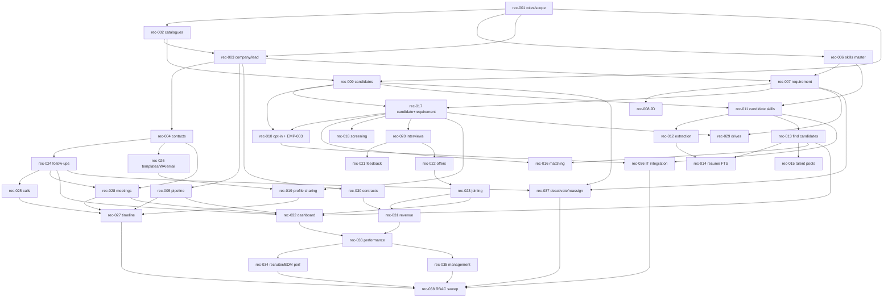

# Recruiter CRM — Engineering Enhancement Backlog (`rec-001` … `rec-038`)

NO-ASSUMPTION MODE. Prepared 2026-10-07 at the user's request. **No code was written or changed.**

- **Source:** `functionalities/edusphere_markdown/Recruiter Functionalities.md`, which is `EVID-018` (`DERIVED_BLUEPRINT`;
  `SOURCE_MANIFEST.csv` sha256 `112a68a2…`, re-hashed and matching). I read it end to end: 1,794 lines in two passes.
  - Pass 1: §1–§27, the B2B recruitment CRM.
  - Pass 2: a user follow-up question at line 1092, then a renumbered §1–§20 on skills and search.

  §1 below audits the 47 sections. Appendix A traces all 905 non-structural lines, and Appendix B defines every counted figure.
- **Scope authority:** the user's answers given in this session on 2026-10-07, R1–R15 in §3.1 (`EXPLICIT_APPROVAL`). They lift
  `PRD_OPEN_ITEMS.md` item 69 and `CONFLICT_MATRIX.md` C-10 for `EVID-018`, the same way `DEC-SCOPE-073` T1 did for `EVID-019`. They
  also answer C-10's question ("extend Placement Team, or a separate concept?"): **extend**. They will be registered as one DEC-SCOPE when
  rec-001 starts. The next free number is **`DEC-SCOPE-116`**, provisional.
- **Method:**
  - I refreshed graphify (`graphify update .`, 31,045 nodes) and oriented with it first.
  - Three read-only investigations covered the employer/placement code, governance, and reusable CRM blocks.
  - I checked each cited fact against source at `main@70243aaf`. `origin/main` was re-fetched and is the same commit. No `rec`,
    `recruit`, `employer` or `placement` branch exists.
  - Architecture context comes from `docs/architecture/ARCHITECTURE_BASELINE.md` (2026-10-07).
- **Gates:** every item stays behind `APPROVAL_GATES.md` GATE-09. The item-level questions in §3.2 are asked **one at a time** when each
  item starts.
- **Authorization convention (user, 2026-09-28):** new routes follow the inline pattern: a `User.role` check, then the scope helper
  (`services/recruiter*.scope(user)`: 403 for a role with no access, 404 when out of scope), then the write. They do not use the
  `require_*` dependencies.

---

## 0. What already exists (verified in code, not assumed)

| Capability | Where | State vs this source |
|---|---|---|
| Companies | `Company` (`companies`, `models.py:317`): `name` **unique**, website, `partner_type` default `"recruiter"`, logo_url, `owner_type` (`internal` / `employer_self_service`), `employer_user_id` | Thin: no contacts, code, pipeline, assignment, or lead fields. **Extended into the lead and company master (R3).** |
| Employer self-service | `api/employer.py` (EMP-001…005, COMPLETE): self-registration at `/it/employer-register`, company and profile, own jobs (start as `draft`), candidate search, shortlist, interviews. There are no offers (EMP-006 is NOT_STARTED) | Kept. Employers see the same `companies`/`jobs` rows. EMP-003 now reads the opted-in pool (R12). Shared profiles show on the portal (R8). |
| Jobs | `Job` (`jobs`, `models.py:345`): company, title, location, description, `skills` JSON, free-text `status` (employer schema allows `draft/open/closed`; the staff PATCH accepts anything, `workflows.py:1586`), `closes_on` | **Becomes the Job Requirement (R5).** |
| Applications | `JobApplication` (`models.py:358`): `student_id` → users, free-text `status` (app-validated set at `workflows.py:1603`: applied, screening, shortlisted, interview_scheduled, rejected, offer_received, hired, withdrawn), `resume_url`. **No unique (job, student)** | **Becomes the Candidate + Requirement record (R6).** |
| Interviews | `Interview` (`models.py:367`): application, scheduled_at, mode, typed `meeting_url`, free-text `result`. No round, interviewer, duration or history. No notification on scheduling | Extended (rec-020/021). |
| Offers | `JobOffer` (`models.py:394`): application **unique**, offered_on, compensation, currency, status (`accepted`/`joined` ⇒ hired, `workflows.py:1742`), `joining_date`, `letter_url` (text only) | Extended (rec-022/023). Overlaps EMP-006. |
| Placement profile | `PlacementProfile` (`models.py:377`): readiness, resume, mock and aptitude statuses, available, notes, withdrawn. Created by staff; there is **no student opt-in** | Kept as the student's readiness record and linked to the candidate (R4). |
| Candidate skills | Free-form `User.profile["skills"]`, self-edited via `PATCH /auth/me`. No skills table and no resume upload for students | **Replaced for recruiting** by `candidates` + `candidate_skills` + the Skills Master (R4, R7). |
| Public careers | `CareerApplication` (`models.py:2468`) + `/public/career-upload` (PDF/DOC/DOCX ≤ 5 MB). **No staff endpoint reads it** | Open question Q-31 (rec-009). |
| Staff routes | `workflows.py:1468-1730` `/workflows/it/{jobs,placement,interviews,offers}`. Roles `placement_team`, `hr_team`, `it_admin` (`_require(..., "it")`). Untyped dict bodies, no ownership scope, no pagination | Kept for `hr_team` and legacy screens. New recruiter routes live in `api/recruiter_*.py`. |
| Roles | `placement_team` (`it:placement:manage`) and `hr_team` (`it:hiring:manage`), both IT, created by an admin (`admin.py:547`). Portal `PORTAL_NAV["it/placement"]` (`navigation.ts:160`) and `"it/hr"` (`:161`); dashboards are global, not scoped (`services/portal.py:852`) | **placement_team = recruiter with own scope + new `placement_manager` (R2).** |
| BDM organisation pattern | `BdmOrganization` + `BdmOrganizationContact` (one primary), `ORG-000001` sequence, archive, `BdmAssignmentHistory`, `bdm_stages.py` stage catalogue + `BdmPipelineEvent` | **Copied as a pattern, not shared (R3).** College BDM orgs are referenced by drives (R15). |
| MoU pattern | `BdmMou` + `BdmMouEvent` (status flow, validity, signed document via `agent_documents.read_upload`, renewal = new row), `bdm_reminders` | Copied for recruiter contracts (rec-030). |
| Telecaller engines | follow-ups, calls (`tel:`), wa.me and SMTP messages (`LeadMessage`, `deliver_lead_email_task`), template library (`TelMessageTemplate`, placeholder check), `lead_timeline` (UNION ALL), CSV `to_csv`, `telecaller_metrics.py` | Copied as patterns (R13). Each table is FK-bound to `enquiries`, so none is reused directly. |
| Files | `services/storage.py` (S3 or local), `/files` routes. Limits: `max_upload_bytes` 20 MB, MIME allowlist. `agent_documents.read_upload` sniffs bytes (PDF and images only) | Resume, JD, offer letter, joining proof and contract uploads. |
| Text extraction / search | **None.** `requirements.txt` has no `pypdf`, `python-docx` or `pdfminer`. No `pg_trgm`, `tsvector` or `unaccent` in any of the 99 migrations. Search is ILIKE only (`lookups._pattern`, `api.bdm._matching`) | New (R7): rec-012 and rec-014 add the libraries and FTS. |
| B2B invoicing | `Invoice`/`Payment` require `user_id`. `billing_documents` takes a payer name only | Not built. Revenue is **tracked only** (R9). |
| IT student data | `Program` (no skill tags, `models.py:112`), `Batch`, `Enrollment` (status, progress), `Certificate`, `Assessment`/`AssessmentAttempt` | Source of opted-in candidates and of "Course Completed" skills (rec-010, rec-036). |
| Consent | `ConsentRecord` (enrolment agreements). `DEC-PRIV-001` = UK GDPR defaults. No placement or candidate consent | Opt-in record (rec-010). Retention is Q-09. |
| Numbering | Alembic head `0099_tel_settings`. Last decision `DEC-SCOPE-115`. API addendum `§12AH`. RBAC `§2.41` | Next: `0100`, `DEC-SCOPE-116`, `§12AI`, `§2.42`. All provisional and re-checked at each merge. |

---

## 1. Source coverage audit (section by section)

Pass 1 = §1–§27 (lines 1–1090). Pass 2 = the user question (1092), then §1–§20 (1094–1790), shown here as "S2-§n".

| Source § (lines) | Content | Covered by | Notes |
|---|---|---|---|
| Preamble (1–5) | Recruiter = B2B client/company lead; 10-step workflow | all | R1 |
| §1 Dashboard (9–48) | 14 tiles + 6 quick actions | rec-032 | Appendix B D1–D14 |
| §2 Lead generation (50–118) | 15 sources; 17 lead fields | rec-002, rec-003 | R3 |
| §3 Company master (120–174) | 14 company + 10 business fields | rec-003, rec-004, rec-030 | Lead and company are one record (R3) |
| §4 Contacts (176–216) | Many contacts per company; 5 example roles; 10 fields | rec-004 | — |
| §5 Pipeline (218–270) | 14 B2B stages | rec-005 | Later stages driven by the system (Q-06) |
| §6 Job requirement (272–348) | 23 fields; 11 statuses | rec-007 | `jobs` extended (R5) |
| §7 JD (350–388) | 14 fields; upload or create; auto-link | rec-008 | `job_descriptions` (R5) |
| §8 Candidate master (390–434) | 20 fields | rec-009 | `candidates` (R4) |
| §9 Sourcing (436–473) | 12 sources; source detail (course) | rec-002, rec-009, rec-036 | — |
| §10 Matching (475–498) | Rule-based score when a requirement is created | rec-016 | R7 |
| §11 Profile sharing (500–530) | Multi-select; 4 channels; 7 recorded fields | rec-019 | R8 |
| §12 Per-requirement status (532–554) | Candidate + Requirement key; 8 statuses | rec-017 | R6 |
| §13 Screening (556–592) | 11 checklist items; 4 results | rec-018 | — |
| §14 Interviews (594–652) | 12 fields; 5 rounds; 8 statuses | rec-020 | Typed link (R14) |
| §15 Interview feedback (654–674) | 9 fields | rec-021 | — |
| §16 Offers (676–702) | 9 fields; 4 statuses | rec-022 | Supersedes EMP-006 offer part (Q-21) |
| §17 Joining (704–730) | 7 fields; Joined / Did Not Join | rec-023 | "Selection ≠ placement" (B) |
| §18 Follow-ups (732–756) | 9 reasons; automatic daily list | rec-024 | — |
| §19 Communication (758–794) | Calls; 5 WhatsApp kinds; 7 email kinds; company timeline | rec-025, rec-026, rec-027 | R13 |
| §20 Meetings (796–836) | 7 types; 11 fields | rec-028 | Recruiters schedule (R10); typed link (R14) |
| §21 Drives (838–886) | 13 fields; funnel example | rec-029 | R15 |
| §22 Contracts / MoU (888–916) | 9 fields; 7 statuses | rec-030 | BDM MoU pattern |
| §23 Revenue (918–940) | 9 fields | rec-031 | Track only (R9) |
| §24 Performance dashboard (942–971) | 8 KPIs + 7 ratios | rec-033 | Appendix B P1–P15 |
| §25 Recruiter/BDM performance (973–1005) | 6 BD + 6 recruitment metrics | rec-034 | R10 |
| §26 Management dashboard (1007–1034) | 7 totals; top companies; top job categories | rec-035 | Appendix B M1–M9 |
| §27 IT integration (1036–1090) | Lead → IT student → trained → recruiter → placed candidate | rec-010, rec-036 | Opt-in (R4) |
| User question (1092) | "Extract the exact skills … all Java-skilled people at one place" | rec-011, rec-012, rec-013 | — |
| S2-§1 Skills DB (1094–1124) | Structured, separately searchable skills | rec-011 | — |
| S2-§2 Skills Master (1126–1216) | 5 categories, 37 seed skills; admin add/edit | rec-006 | — |
| S2-§3 Skill profile (1218–1233) | Level, experience, last used | rec-011 | Level values: Q-12 |
| S2-§4 Extraction (1235–1285) | Resume scan → 9 kinds; verify before save | rec-012 | Rule-based, in-house (R7) |
| S2-§5 Exact search (1287–1305) | Skill → all candidates → filter further | rec-013 | — |
| S2-§6 Advanced filters (1307–1327) | Required + preferred skills | rec-013, rec-016 | — |
| S2-§7 AND/OR (1329–1349) | AND, OR, grouped expression | rec-013 | UI: Q-15 |
| S2-§8 Talent pools (1351–1379) | 10 example pools; automatic membership | rec-015 | Pool rules: Q-16 |
| S2-§9 One-click search (1381–1425) | Dashboard box; facets (experience, location, availability) | rec-013, rec-032 | Appendix B F1–F3 |
| S2-§10 Requirement matching (1427–1473) | Auto search; result table; 4 actions | rec-016 | — |
| S2-§11 Match score (1475–1501) | Weighted skills + experience | rec-016 | Weights: Q-14 |
| S2-§12 Whole-database search (1503–1539) | Not limited to own candidates; progressive filters | rec-013 | R11 |
| S2-§13 Source visible (1541–1561) | Source shown on the result | rec-009, rec-013 | — |
| S2-§14 Requirement-specific status (1563–1583) | Same as §12 | rec-017 | — |
| S2-§15 Resume search (1585–1605) | Full text over skills, resume, titles, certifications, projects | rec-014 | R7 (tsvector) |
| S2-§16 Synonyms (1607–1643) | Skill → aliases, admin-maintained | rec-006, rec-013 | — |
| S2-§17 Verification (1645–1675) | 6 skill sources; 3 skill statuses | rec-011 | Who verifies: Q-13 |
| S2-§18 Search screen (1677–1714) | 10 controls | rec-013 | — |
| S2-§19 Result screen (1716–1734) | Card fields + 4 actions | rec-013 | — |
| S2-§20 Full flow (1736–1790) | 15-step flow; common candidate DB; Java pool after opt-in | all, rec-010, rec-015 | R4 |
| "Top/Bottom of Form" (1792, 1794) | Copy-paste artefacts | — | Not requirements |

**Not in the source, so not added:**
- Telephony or dialer integration (R13).
- WhatsApp Business API (R13).
- LLM or AI providers (R7).
- B2B invoice generation (R9).
- A candidate self-service portal for external candidates.
- Job-board posting integrations.
- Background checks.
- Replacement-guarantee tracking beyond the contract field (Q-22).
- Candidate CSV import (the source lists "Database" only as a sourcing channel; see Q-32).

**Added though not in the source** (required by your standing conventions):
- rec-001: the full account lifecycle (user-lifecycle convention).
- rec-037: deactivation and reassignment (the tel-025 precedent).
- rec-038: a permission-matrix sweep (the tel-026 precedent).

---

## 2. Backlog summary

| ID | Title | Cx | Risk | Migration | Depends on |
|---|---|---|---|---|---|
| rec-001 | Recruiter scope for `placement_team` + new `placement_manager`: profile, provisioning, sign-in, shell | M | High | Yes | — |
| rec-002 | Recruiter catalogues (lead/candidate sources, campaigns, industries, job categories, contact roles) | S | Low | Yes | 001 |
| rec-003 | Company master + recruiter lead record (`companies` extension, code, assignment, duplicates) | L | High | Yes | 001, 002 |
| rec-004 | Company contacts (many per company, one primary) | M | Medium | Yes | 003 |
| rec-005 | Company B2B pipeline engine + stage history | M | High | Yes | 003 |
| rec-006 | Skills Master + categories + aliases/synonyms (seeded) | M | Medium | Yes | 001 |
| rec-007 | Job Requirement (`jobs` extension, required/preferred skills, statuses + history) | L | High | Yes | 003, 006 |
| rec-008 | JD management (`job_descriptions`, create/upload, versions) | M | Medium | Yes | 007 |
| rec-009 | Candidate master (`candidates`, code, resume upload, source, duplicates) | L | High | Yes | 001, 002 |
| rec-010 | IT-student opt-in to the candidate pool + EMP-003 re-pointed | L | High | Yes | 009, 017 |
| rec-011 | Candidate skill profile (level, experience, last used, source, verification) | M | Medium | Yes | 006, 009 |
| rec-012 | Resume text + rule-based skill extraction, verify before save | M | Medium | Yes | 006, 009, 011 |
| rec-013 | Find Candidates: skill AND/OR search, synonyms, filters, facets, result cards | L | High | Maybe (indexes) | 006, 009, 011 |
| rec-014 | Resume full-text search (Postgres FTS) | M | Medium | Yes | 012, 013 |
| rec-015 | Talent pools (rule-based automatic membership) | M | Low | Yes | 011, 013 |
| rec-016 | Requirement → candidate matching + weighted match score | M | Medium | No | 007, 013, 017 |
| rec-017 | Candidate + Requirement tracking (`job_applications` → candidate, statuses, history, backfill) | L | High | Yes | 007, 009 |
| rec-018 | Screening form + result | S | Low | Yes | 017 |
| rec-019 | Profile sharing (Email / WhatsApp / Portal / Other) + response tracking | L | High | Yes | 004, 017, 026 |
| rec-020 | Interview management (rounds, statuses, reschedule, history) | M | Medium | Yes | 017 |
| rec-021 | Interview feedback | S | Low | Yes | 020 |
| rec-022 | Offer management (statuses, letter upload) | M | Medium | Yes | 020 |
| rec-023 | Joining management + placement closure | M | Medium | Yes | 022 |
| rec-024 | Recruiter follow-ups + automatic daily list | M | Medium | Yes | 004 |
| rec-025 | Call logging (company contacts and candidates) | M | Low | Yes | 024 |
| rec-026 | Message template library + WhatsApp (wa.me) + email (SMTP) | M | Medium | Yes | 004 |
| rec-027 | Company timeline (+ candidate timeline) | M | Low | No | 005, 019, 024, 025, 026, 028 |
| rec-028 | Company meetings | M | Medium | Yes | 004, 024 |
| rec-029 | Campus recruitment drives | M | Medium | Yes | 007, 017 |
| rec-030 | Recruiter contracts / MoU | M | Medium | Yes | 003 |
| rec-031 | Revenue / commercial tracking (track only) | M | Medium | Yes | 023, 030 |
| rec-032 | Recruiter dashboard + quick actions + one-click skill search | M | Medium | No | 005, 007, 013, 017, 020, 023, 024, 028 |
| rec-033 | Recruiter performance dashboard (management KPIs + ratios) | M | Medium | No | 031, 032 |
| rec-034 | Recruiter/BDM performance (per recruiter, BD + recruitment) | M | Medium | No | 033 |
| rec-035 | Management dashboard (recruiter business view) | S | Low | No | 033 |
| rec-036 | IT-training ↔ recruiter integration (course skill tags, journey view) | M | Medium | Yes | 010, 011 |
| rec-037 | Recruiter deactivation + bulk reassignment | M | High | No | 003, 007, 009, 024 |
| rec-038 | Permission matrix + cross-role 403/404 sweep | M | Medium | No | all of 001–037 |

---

## 3. Decisions and questions

### 3.1 Answered in session on 2026-10-07 (`EXPLICIT_APPROVAL`; to be registered as one DEC-SCOPE at rec-001)

| # | Question | Answer | Items |
|---|---|---|---|
| R1 | Is `EVID-018` in scope? | **Yes, all 47 sections.** Every item stays behind GATE-09 and keeps its own questions. Lifts PRD item 69 and C-10 for EVID-018 | all |
| R2 | Who operates the CRM? | **`placement_team` = recruiter**, with own-assignment scope (my companies, requirements and candidates' applications). **`hr_team` keeps its current hiring scope.** New **`placement_manager`** role: division `global`, signs in at `/admin/login`, sees direct reports (the BDM/telecaller manager pattern). `super_admin` sees all | 001, 037, 038, all |
| R3 | Lead and company store | **Extend `companies`.** One row per company carries the §5 pipeline from New Lead onward, plus the lead, company and business fields. New `company_contacts` table. Recruiter Lead ID = company code. Employer self-registered companies live in the same table. BDM patterns are copied, not shared | 003, 004, 005 |
| R4 | Candidate master | **New `candidates` table** for everyone (external candidates have no login). An IT student appears **only after opting in** from their portal, which creates or links a candidate (`user_id`) seeded from course and enrolment data. `PlacementProfile` stays and links to it. Opting out hides them from search | 009, 010, 036 |
| R5 | Requirement and JD | **`jobs` becomes the Job Requirement** (code, §6 fields, required/preferred skills, §6 statuses with history). **`job_descriptions`** child holds the JD (number, §7 fields, file), one current version per requirement, with each re-upload versioned. Employer-posted jobs are requirements too | 007, 008 |
| R6 | Per-requirement tracking and legacy rows | **`job_applications` gains `candidate_id`** + the §12 status set + history + a unique (candidate, requirement). The migration backfills a candidate for every student with an application or `PlacementProfile`, linked to the user and marked **not opted in**. History keeps working, but these students are hidden from pool search until they opt in | 017, 010 |
| R7 | Extraction and scoring | **Rule-based and in-house.** Text is extracted locally from PDF/DOCX (`pypdf`, `python-docx`), matched against the Skills Master + aliases, and verified by the recruiter before saving. Match score = weighted rule (skills + experience + location). Resume text is stored for Postgres FTS. **No AI provider; no data leaves the system** | 012, 013, 014, 016 |
| R8 | Profile sharing | **Log + send, contacts masked.** Email = SMTP to a company contact with a summary and the resume via a signed, expiring link. WhatsApp = wa.me, logged on confirm. Portal = shared profiles appear on that company's employer portal. Other = log only. Candidate phone and email are **never** shared. Each share records candidate, company, requirement, date, recruiter, response and feedback | 019 |
| R9 | Revenue | **Track only.** Contracts follow the BDM MoU pattern. Revenue = fee per hire × joined, plus manually recorded invoice no./date/amount, due date and payments received → outstanding. EduSphere generates no invoice PDF | 030, 031, 033 |
| R10 | BDM role | **Reference + read-only.** "Assigned BDM" is an optional BDM user (who brought the company in), and that BDM gets read-only access to the company and its requirements. Recruiters do every write and every meeting. "Account Manager" = assigned recruiter. §25 metrics are per recruiter, from their own activity | 003, 028, 034 |
| R11 | Pool access | **Every recruiter searches and views the whole opted-in pool** (contacts and resume included), can add any candidate to their own requirements, and can edit any candidate (audited). Manager and `super_admin` the same. `hr_team` keeps read access to candidates | 009, 011, 013 |
| R12 | EMP-003 | **Kept, with today's limited fields** (no email, phone or resume), but it reads the **opted-in pool**. Employers also see profiles shared to them (R8). EMP-003 tests are updated for the opt-in rule | 010, 019 |
| R13 | Communications | **Telecaller pattern.** Calls = manual log + `tel:`. WhatsApp = wa.me with editable templates, logged on confirm. Email = SMTP from the system address with reply-to set to the recruiter, via the outbox. The template library is maintained by `placement_manager`. Everything appears on the company timeline (and the candidate timeline when the recipient is a candidate) | 025, 026, 027 |
| R14 | Meeting links | **Typed in** for interviews and company meetings. No auto-creation | 020, 028 |
| R15 | Campus drives | A drive links a company + requirement(s) and a **college picked from BDM college organisations (or free text)**. Registered and attended are typed counts. Shortlisted, interviewed, selected and joined are **computed** from applications that carry the drive | 029 |

### 3.2 Item-level questions (asked one at a time when the item starts; `NEEDS_CONFIRMATION` until then)

| # | Question | Item |
|---|---|---|
| Q-01 | Company code format. The proposal is `CMP-000001` (the bdm-002 ORG sequence idiom), backfilled for existing companies | 003 |
| Q-02 | `companies.name` is globally **unique** today. Keep that, or use a name+city duplicate key (branches)? Which fields become mandatory at which pipeline stage ("genuine prospect", line 122)? | 003 |
| Q-03 | Employer self-registered companies: which stage do they enter, and who is the assigned recruiter (unassigned queue?) | 003, 005 |
| Q-04 | Mapping the existing `jobs.status` values (`draft/open/closed` + free text) to the 11 §6 statuses. Does an employer-posted requirement need recruiter acceptance? (FEATURE_QUESTIONS #1, still open) | 007 |
| Q-05 | "Requirements About to Expire": how many days before the Application Deadline? Is "Requirement Date" the received date? | 007, 032 |
| Q-06 | §5 stages after "Requirement Received": computed from the company's furthest-progressed requirement, or set by hand? Can a company go back? | 005 |
| Q-07 | Candidate duplicate rule (normalised mobile OR email?) and merging two candidates | 009 |
| Q-08 | Candidate master "Candidate Status" values (Available / Interviewing / Placed / Not looking / Blacklisted?): set by hand or computed from applications? | 009 |
| Q-09 | Resume formats and size (PDF/DOCX ≤ 5 MB?). Retention and deletion of candidate data, and a UK GDPR (`DEC-PRIV-001`) erasure path. Does DPDP also apply? | 009, 012 |
| Q-10 | Opt-in: which students (any `it_student`, or only enrolled/completed?), the consent wording, and which data seeds the candidate | 010 |
| Q-11 | Course → skill tags: who maintains them per `Program`, and does a `Certificate` auto-add "Course Completed" skills? | 011, 036 |
| Q-12 | Skill level values (Beginner / Intermediate / Advanced / Expert?) | 011 |
| Q-13 | Who may set a skill to Verified or Assessed, and is it per source (interview, assessment, employer)? | 011, 021 |
| Q-14 | Match score: default weights (the source example is Java 30 / Spring Boot 25 / SQL 15 / Microservices 10 / AWS 10 / Experience 10), how location and availability score, and whether weights are editable per requirement | 016 |
| Q-15 | AND/OR input: a chip builder with groups, or a typed query (`Java AND (AWS OR Azure)`)? | 013 |
| Q-16 | Talent pools: manager-defined rule pools only, or manual pools too? The "Fresher" and "Experienced" thresholds | 015 |
| Q-17 | Mapping the existing `job_applications` statuses to the 8 §12 statuses. How interview results drive Selected and Rejected | 017 |
| Q-18 | Is screening required before Shortlisted? Does "Need More Information" pause the application? | 018 |
| Q-19 | Expiry of the shared-resume link. Is a Portal share visible to every employer user of the company? Is the company's response recorded by the recruiter, the employer, or both? | 019 |
| Q-20 | Interview notifications to candidates (external candidates have no login, so email only?) and to company contacts | 020 |
| Q-21 | Offer status semantics ("Offer Pending" before the letter?). Who uploads the letter? Does rec-022 supersede EMP-006 in full? | 022 |
| Q-22 | "Did Not Join": is a reason required? Is joining proof mandatory for Joined? Is replacement tracked beyond the contract's policy text? | 023, 030 |
| Q-23 | Automatic follow-ups: which events create one (JD pending, feedback pending after N days, offer pending, joining date)? | 024 |
| Q-24 | Revenue: is the fee per hire set on the contract or per requirement? Currency? Is GST excluded? Does a "Did Not Join" after invoicing reduce revenue? | 031 |
| Q-25 | Metric meanings: "Hot Recruiters", "Active Companies", "Active Recruiters" (§26: company contacts or recruiter users?), "Average closure time" | 032–035 |
| Q-26 | CSV export of reports, and masking of candidate contacts in exports | 033–035 |
| Q-27 | Recruiter deactivation: what happens to their companies, open requirements and follow-ups | 037 |
| Q-28 | Does `hr_team` see the new recruiter data (companies, requirements, contacts) read-only, or only today's legacy screens? | 001, 038 |
| Q-29 | Workspace path: new pages under `/it/placement/*` (existing portal, `/it/login`) with the manager under `/admin/recruitment/*`? Can a manager also own companies? | 001 |
| Q-30 | Drive funnel: can one application belong to only one drive? Is a drive closed by hand? | 029 |
| Q-31 | Public `CareerApplication` submissions: should they flow into the candidate master (source "Website")? | 009 |
| Q-32 | Is a candidate CSV import needed for the "Database" source, or is entry manual only? | 009 |

---

## 4. Backlog items

Conventions for every item: own-scope checks via `services/recruiter*.scope(user)`; one commit per write in the router; `AuditLog`
(ids and field names only) in the same transaction; a structured log after the commit; lists `limit=LIMIT, offset=OFFSET` →
`{items,total,limit,offset}`; IST business dates via `db_now`/`today_ist`; human-readable `detail` strings; API contract addendum
§12AI onward; RBAC §2.42 onward.

### rec-001 — Recruiter scope for `placement_team` + new `placement_manager`: profile, provisioning, sign-in, shell
- **Status (2026-10-08):** **MERGED** to `main` as PR #143 @ `9e957bee`. The next rec item takes the next migration after `0100`,
  `DEC-SCOPE-117`, API §12AJ and RBAC §2.43, re-checked on `main` first.
  - Numbering: `DEC-SCOPE-116`, migration `0100_recruiter_profiles`, API §12AI, RBAC §2.42.
  - Owner answers:
    - Q-29: `/recruiter/*` workspace.
    - Q-28: `hr_team` unchanged.
    - Admin page: `/admin/recruiter-staff`.
  - QA: `docs/quality/REC-001_EXPLORATORY_QA_2026-10-08.md`.
- **Business requirement:**
  - §1 "the recruiter should see"; §24 "Management should see"; §26 "CEO/Manager"; S2-§12 "with appropriate permissions" (R2).
  - Under your user-lifecycle convention, creating a user means the full lifecycle.
- **Existing behavior:**
  - `placement_team` and `hr_team` (IT) share the unscoped `/workflows/it/*` routes. Their dashboards count globally.
  - There is no manager role and no profile table. An admin creates them via `admin.py:547`, and the generic form lists them
    (`WorkflowPanel.tsx:364`).
- **Expected behavior:**
  - A `recruiter_profiles` row (user_id PK, employee_id unique, reporting_manager_user_id → a `placement_manager`, active) is required for
    every `placement_team` user.
  - New role `placement_manager`: division `global`, created by `super_admin` only.
  - Recruiters: created by `super_admin` or `it_admin`, with a set-password welcome email. Forgot/change password use the existing flows.
  - Recruiter workspace shell and navigation (path per Q-29). Manager team list. Profile page.
  - Existing `placement_team` users are backfilled with a profile that has no manager. The admin page flags them until a manager is set.
- **User roles affected:** `placement_team`, `placement_manager` (new), `super_admin`, `it_admin`, `hr_team` (unchanged; Q-28).
- **Frontend impact:**
  - Admin "Recruiters" page (the `AdminTelecaller*` pattern).
  - `ROLES_BY_DIVISION.global` + `placement_manager`.
  - `lib/navigation.ts` `RECRUITER_NAV`/`RECRUITER_MANAGER_NAV`.
  - `middleware.ts` manager path → `/admin/login`.
  - Landing map.
- **Backend impact:**
  - `rbac.PERMISSIONS["placement_manager"]`.
  - New `api/recruiter.py` + `services/recruiter.py` (`recruiter_context`, `scope`, `require_manager`, `team_filter`, mirroring
    `services/telecaller.py`).
  - `admin.create_user`/`update_user` gain a nested `recruiter_profile`. `auth` landing.
- **Database impact:** `recruiter_profiles` (+ backfill for existing `placement_team` users).
- **API impact:** `GET /recruiter/me`, `PATCH /recruiter/profile`, `GET /recruiter/manager/team`, `GET /admin/recruiters`,
  `GET /admin/placement-managers`. Create and edit go through `POST/PATCH /admin/users`.
- **Integration impact:** SMTP welcome email (existing).
- **Authentication impact:** the manager signs in at `/admin/login`. The recruiter keeps `/it/login`, with a new landing page.
- **Authorization impact:** new role. An `it_admin` cannot create a manager. A manager sees direct reports only.
- **Security impact:** privilege boundary on the new global role. No password is ever known to an admin.
- **Performance impact:** negligible.
- **Reusable existing modules:** tel-001 / bdm-001 (`services/telecaller.py`, `AdminTelecaller*`), `services/provisioning.py`,
  `mailer.send_welcome_email`, `PortalShell`.
- **Dependencies:** none. It shares `rbac.py`, `admin.create_user`, `middleware.ts` and `navigation.ts` with every role item, so it is
  never run in parallel with other role work.
- **Acceptance criteria:**
  1. `super_admin` creates a manager and a recruiter (with a manager), and both set passwords from the email link.
  2. An `it_admin` creating a `placement_manager` → 403.
  3. A recruiter signs in at `/it/login` and lands on the recruiter dashboard.
  4. A manager sees only their direct reports.
  5. Existing `placement_team` users keep working and show "no manager" until one is set.
  6. `hr_team` behaviour is unchanged.
- **Positive scenarios:** create recruiter R under manager M; M's team list shows R.
- **Negative scenarios:** reporting manager is not a `placement_manager` → 422; duplicate employee id → 409; a recruiter calls a manager
  route → 403.
- **Edge cases:** an inactive manager cannot be chosen; a `placement_team` user created via the legacy generic form gets a profile row.
- **Regression risks:** admin user-create for every existing role; login landing; middleware for `/it`, `/admin`, `/bdm`, `/telecaller`;
  ADM-007 and ADM-008 tests.
- **Complexity:** medium · **Risk:** high

### rec-002 — Recruiter catalogues
- **Status (2026-10-08):** **MERGED** to `main` as PR #146 @ `ea3e9189`. The next rec item takes the next migration after `0102`,
  `DEC-SCOPE-118`, API §12AL and RBAC §2.44, re-checked on `main` first.
  - Numbering: `DEC-SCOPE-117`, migration `0102_rec_catalogues` (re-chained after upc-002's `0101_country_master`), API §12AK (upc-002 took §12AJ), RBAC §2.43.
  - Owner answers:
    - C1: industries start empty.
    - C2: `rec_company_sizes` is a managed list seeded with 1-10 … 1001+.
    - C3: readers are the recruiter roles only.
  - Page: `/recruiter/manager/catalogue/[kind]`.
  - QA: `docs/quality/REC-002_EXPLORATORY_QA_2026-10-08.md`.
- **Business requirement:**
  - §2: 15 lead sources and "Campaign". §9: 12 candidate sources.
  - §3: "Industry", "Company Size". §6: "Job Category". §26: "Top Job Categories". §4: contact roles.
- **Existing behavior:** none. The telecaller sources (`tel_sources.py`) and campaigns (`tel_campaigns`) are education-specific.
- **Expected behavior:**
  - Managed lists, editable by `placement_manager` and `super_admin` (deactivate, never delete), seeded from the source:
    - `rec_lead_sources` (15)
    - `rec_candidate_sources` (12)
    - `rec_campaigns` (name, source, start/end, active)
    - `rec_industries`
    - `rec_job_categories` (seeded with IT, Sales, Marketing, Finance, HR, Engineering)
    - company size bands
    - `rec_contact_roles` (HR Manager, Talent Acquisition Manager, Recruiter, Hiring Manager, HR Head)
- **User roles affected:** `placement_manager`, `super_admin` (write); recruiters (read).
- **Frontend impact:** a manager catalogue page with tabs (the tel-002 `TelecallerCatalogue` pattern).
- **Backend impact:** `api/recruiter_catalogue.py`, `services/recruiter_catalogue.py`.
- **Database impact:** the catalogue tables + seed rows.
- **API impact:** `GET/POST/PATCH /recruiter/catalogue/{kind}`.
- **Integration impact:** none.
- **Authentication impact:** none.
- **Authorization impact:** write is manager or `super_admin` only.
- **Security impact:** low.
- **Performance impact:** negligible.
- **Reusable existing modules:** tel-002 (`telecaller_catalogue.py`), `useUrlList`.
- **Dependencies:** rec-001.
- **Acceptance criteria:**
  1. The seed values match the source lists exactly.
  2. A deactivated value is hidden from pickers but kept on existing records.
  3. A recruiter cannot edit.
- **Positive scenarios:** the manager adds the source "Naukri".
- **Negative scenarios:** duplicate name → 409; a recruiter calls POST → 403.
- **Edge cases:** renaming a value used by records (records keep the id).
- **Regression risks:** none (new tables).
- **Complexity:** small · **Risk:** low

### rec-003 — Company master + recruiter lead record
- **Status (2026-10-08):** **MERGED** to `main` as PR #152 @ `22319014`. The next rec item takes the next migration after `0106`,
  `DEC-SCOPE-122`, API §12AP and RBAC §2.48, re-checked on `main` first. Numbering: `DEC-SCOPE-121`, migration `0106_rec_companies` (re-chained after
  upc-001's `0103`, rec-006's `0104` and upc-003's `0105_university_master`), API §12AO, RBAC §2.47. Q-01–Q-03 answered with the recommended defaults (D1–D6 in
  `DEC-SCOPE-121`): `CMP-000001` codes; `name` stays unique plus a normalised-name warning; employer companies enter with source Website
  and no recruiter. "+ Add Recruiter" and the §2 person fields move to rec-004.
- **Business requirement:**
  - §2 "Every recruiter lead should have" (17 fields).
  - §3 Company Details (14) and Business Details (10).
  - Quick actions "+ Add Recruiter" and "+ Add Company" (R3, R10).
- **Existing behavior:** `companies` has a unique `name`, website, `partner_type`, `owner_type` and `employer_user_id`. Staff create a
  company implicitly by job name (`workflows.py:1530`). There is no list screen beyond `GET /admin/companies`.
- **Expected behavior:**
  - `companies` gains:
    - `company_code` (Q-01) and the lead fields: industry, company size, employee count, city/state/country, head office, branches,
      LinkedIn, description, source, campaign, priority (hot/warm/cold)
    - `assigned_recruiter_user_id`, `assigned_bdm_user_id` (R10)
    - `next_follow_up_at` (derived from rec-024), and `archived_at`
  - "Add Recruiter" creates the company **and** its first contact (rec-004) in one step. "Add Company" creates the company alone.
  - Duplicate warning on name (+ city) per Q-02.
  - List with URL filters and detail page. Manager reassignment with `assignment_history`.
- **User roles affected:** recruiter (own), manager (team), `super_admin`, assigned BDM (read, R10), employer (own company, unchanged
  fields).
- **Frontend impact:** Companies list (filters: stage, priority, source, industry, recruiter), Company detail (tabs later filled by
  004/005/007/024/027/030), create form.
- **Backend impact:** `api/recruiter_companies.py`, `services/recruiter_companies.py` (`scope`: recruiter = assigned to them; manager =
  their reports' companies + unassigned; BDM = `assigned_bdm_user_id` read). `employer.register` sets a code and a source.
- **Database impact:**
  - `companies` columns + CHECKs + indexes, and `company_code_seq` with a backfill.
  - `company_assignment_history`.
  - The `name` unique constraint stays or changes per Q-02.
- **API impact:** `GET/POST /recruiter/companies`, `GET/PATCH /recruiter/companies/{id}`, `POST …/archive|restore|assign`.
- **Integration impact:** none.
- **Authentication impact:** none.
- **Authorization impact:** own/team scope (404 outside scope); assigned BDM gets read-only; an employer may not use recruiter routes.
- **Security impact:** commercial data is visible to the right roles only. Audit every reassignment.
- **Performance impact:** indexed list filters; paginated.
- **Reusable existing modules:** bdm-002 (`services/bdm_organizations.py`: code sequence, `name_key`, archive, assign),
  `BdmAssignmentHistory`, `SearchableSelect`.
- **Dependencies:** rec-001, rec-002.
- **Acceptance criteria:**
  1. A recruiter creates a lead with all §2 fields. The code is server-assigned, and the recruiter is assigned to themselves by default.
  2. A recruiter sees only their own companies; another recruiter's company → 404.
  3. The manager reassigns, history is kept, and the new recruiter sees the company.
  4. An employer's self-registered company appears with source "Website" per Q-03.
  5. EMP-001…005 are unchanged.
- **Positive scenarios:** Add Recruiter "Priya, TA Manager, ABC Technologies" creates a company and a contact.
- **Negative scenarios:** invalid priority → 422; duplicate name → 409 (or a warning per Q-02); a BDM PATCH → 403.
- **Edge cases:** existing companies created by staff job-posting get a code and no recruiter (unassigned queue); archived companies are
  hidden from pickers.
- **Regression risks:** `/workflows/it/jobs` auto-create by name; EMP-001 registration; `/admin/companies`.
- **Complexity:** large · **Risk:** high

### rec-004 — Company contacts
- **Status (2026-10-08):** **MERGED** to `main` as PR #160 @ `721c23f7`. The next rec item takes the next migration after `0110`, `DEC-SCOPE-126`, API §12AT and RBAC §2.52, re-checked on `main` first. Numbering: `DEC-SCOPE-125`, migration `0110_company_contacts` (after upc-004's
  `0109_university_duplicates`), API §12AS, RBAC §2.51. C1–C7 in `DEC-SCOPE-125` are recommended defaults (UNVERIFIED): writes follow the company's
  `can_edit`, contacts are deactivated and never deleted, at most 50 per company, and §3 Business Details are read from the contact
  roles. "+ Add Recruiter" ships here. AC3 (Last contacted after a logged call) waits for rec-025.
- **Business requirement:** §4 "multiple contacts under one company" with 10 fields per contact. §3 HR Contact, Talent Acquisition
  Contact, Hiring Manager, HR Email, HR Phone.
- **Existing behavior:** none. Employer users are the only people tied to a company.
- **Expected behavior:**
  - `company_contacts`: name, designation, department, role (catalogue), mobile (normalised), email, LinkedIn, preferred communication
    (call/whatsapp/email), notes, `is_primary` (one per company).
  - `last_contacted_at` is computed from calls, messages and meetings. `next_follow_up` comes from rec-024.
  - The §3 HR/TA/Hiring-Manager fields are the contacts holding those roles. HR email and phone are the primary HR contact's.
- **User roles affected:** recruiter, manager, `super_admin` (write per scope); BDM (read).
- **Frontend impact:** a Contacts tab with add, edit, make-primary and deactivate.
- **Backend impact:** `services/recruiter_contacts.py`.
- **Database impact:** `company_contacts` (a partial unique index for the primary contact).
- **API impact:** `GET/POST /recruiter/companies/{id}/contacts`, `PATCH /recruiter/contacts/{id}`.
- **Integration impact:** none.
- **Authentication impact:** none.
- **Authorization impact:** the company's scope.
- **Security impact:** contact PII; no export in this item.
- **Performance impact:** low.
- **Reusable existing modules:** `BdmOrganizationContact` + `BdmOrganizationContacts.tsx`.
- **Dependencies:** rec-003.
- **Acceptance criteria:**
  1. Five contacts can be added to ABC Technologies.
  2. Only one is primary.
  3. Last contacted updates after a logged call (once rec-025 lands).
- **Positive scenarios:** add a Hiring Manager contact.
- **Negative scenarios:** invalid email → 422; out-of-scope company → 404.
- **Edge cases:** deactivating the primary contact requires another primary to be chosen first; one person working for two companies is
  two rows.
- **Regression risks:** none.
- **Complexity:** medium · **Risk:** medium

### rec-005 — Company B2B pipeline engine + stage history
- **Status (2026-10-08):** **MERGED** to `main` as PR #162 @ `ada23b4d`. The next rec item takes the next migration after `0112`,
  `DEC-SCOPE-128`, API §12AV and RBAC §2.54, re-checked on `main` first. Numbering: `DEC-SCOPE-127`, migration
  `0112_company_pipeline` (re-chained after upc-007's `0111_university_pipeline`), API §12AU, RBAC §2.53. Q-06 answered with the recommended default (P2/P3 in `DEC-SCOPE-127`):
  later stages are driven by events only, forward; the source has 13 stages, not 14 (P1).
- **Business requirement:** §5 pipeline (14 stages, New Lead → Requirement Closed).
- **Existing behavior:** none.
- **Expected behavior:**
  - `recruiter_stages.py` holds the catalogue (the `bdm_stages.py` idiom).
  - `companies.stage` + `stage_changed_at`, with lost/reopen with a reason.
  - `company_stage_history` is append-only.
  - Manual stages: Contacted, Interested, Meeting Scheduled, Requirement Discussion.
  - Stages from Requirement Received to Requirement Closed are driven by requirement progress, per Q-06.
  - Pipeline board grouped by stage.
- **User roles affected:** recruiter, manager.
- **Frontend impact:** stage control on Company detail; Pipeline board (the `BdmPipelineBoard` pattern).
- **Backend impact:** `services/company_pipeline.py` (the single writer, `apply_event`), called by 007/017/020/023/028.
- **Database impact:** `companies.stage` CHECK, `company_stage_history`.
- **API impact:** `POST /recruiter/companies/{id}/stage|lost|reopen`, `GET …/stage-history`, `GET /recruiter/pipeline`.
- **Integration impact:** none.
- **Authentication impact:** none.
- **Authorization impact:** company scope; reopening is manager-only (as tel-004 T13).
- **Security impact:** low.
- **Performance impact:** board query bounded by scope; indexed by `(stage, assigned_recruiter_user_id)`.
- **Reusable existing modules:** `bdm_stages.py`, `BdmPipelineEvent`, `services/lead_pipeline.apply_event` (locking idiom),
  `BdmPipelineBoard`.
- **Dependencies:** rec-003.
- **Acceptance criteria:**
  1. Every stage change writes history (from, to, actor, reason).
  2. Manual moves allowed only to manual stages.
  3. Driven stages update on requirement events.
  4. Lost requires a reason.
- **Positive scenarios:** New Lead → Contacted after the first call.
- **Negative scenarios:** setting "Joined" by hand → 422; reopen by a recruiter → 403.
- **Edge cases:** a company with two requirements at different stages (Q-06); concurrent moves (row lock).
- **Regression risks:** none (new column).
- **Complexity:** medium · **Risk:** high (the shared engine used by later items)

### rec-006 — Skills Master + categories + aliases
- **Status (2026-10-08):** **MERGED** to `main` as PR #150 @ `0ef88a98`.
  - Numbering: `DEC-SCOPE-119`, migration `0104_skills_master` (after upc-001's `0103_partnership_profiles`), API §12AM, RBAC §2.45 (upc-002 took `0101` / §12AJ; rec-002 `0102` / 117 / §12AK / §2.43; upc-001 `0103` / 118 / §12AL / §2.44).
  - Owner answers: S1 merge deferred to rec-011; S2 recruiters read-only. S3–S6 took the recommended answers.
  - QA: `docs/quality/REC-006_EXPLORATORY_QA_2026-10-08.md`.
- **Business requirement:** S2-§2 (5 categories, 37 seed skills, "admin should be able to add/edit"); S2-§16 synonyms ("Skill → Related
  Skills/Aliases").
- **Existing behavior:** `jobs.skills` and `User.profile.skills` are free-text lists. `school_skills` is an unrelated school concept.
- **Expected behavior:**
  - `skills` (name unique case-insensitive, category, active)
  - `skill_categories`
  - `skill_aliases` (alias unique → skill; e.g. "Java 8", "J2EE" → Java; "ReactJS" → React)
  - Optional `skill_related` (Java ⇄ Core Java) used by search expansion
  - Seeded from S2-§2 and S2-§16, managed by `placement_manager` and `super_admin`
- **User roles affected:** manager and `super_admin` (write); recruiters (read and suggest).
- **Frontend impact:** a Skills Master page (categories, skills, aliases).
- **Backend impact:** `services/skills.py` (`resolve(text)` → skill id via name or alias; the single normaliser used by 007/011/012/013).
- **Database impact:** 3–4 tables + seed.
- **API impact:** `GET /recruiter/skills?q`, `POST/PATCH /recruiter/skills`, `…/aliases`.
- **Integration impact:** none.
- **Authentication impact:** none.
- **Authorization impact:** manager-only writes.
- **Security impact:** low.
- **Performance impact:** alias lookup is indexed on `lower(alias)`.
- **Reusable existing modules:** the tel-002 catalogue pattern, `lookups._pattern`.
- **Dependencies:** rec-001.
- **Acceptance criteria:**
  1. The seed contains every S2-§2 skill under its category. (JavaScript appears in both "Programming" and "Frontend" in the source; it
     becomes one skill with a primary category plus a secondary tag.)
  2. An alias resolves to its skill.
  3. A duplicate alias → 409.
- **Positive scenarios:** add the alias "Java 21" → Java.
- **Negative scenarios:** an alias equal to another skill's name → 409.
- **Edge cases:** merging two skills (re-points candidate skills: manager only, audited).
- **Regression risks:** none.
- **Complexity:** medium · **Risk:** medium

### rec-007 — Job Requirement (`jobs` extension)
- **Business requirement:** §6 "core functionality": a Requirement ID, 23 fields and 11 statuses. Quick action "+ Add Job Requirement".
  S2-§6 required/preferred skills.
- **Existing behavior:**
  - `jobs`: title, location, description, `skills` JSON, free-text status, `closes_on`.
  - The staff POST opens the job immediately; employers create drafts.
  - No vacancies, salary, experience or assignment.
- **Expected behavior:**
  - `jobs` gains: `requirement_code`, company contact (the recruiter contact on the requirement), department, job category, vacancies,
    qualification, experience min/max, salary min/max, work mode, shift, employment type, joining requirement, application deadline
    (`closes_on` kept), requirement date, priority, assigned recruiter.
  - `job_skills` (skill_id, `required|preferred`, weight) replaces the JSON list. Legacy values are resolved through rec-006 aliases;
    unmatched values are kept as free text and flagged.
  - The 11 §6 statuses with `job_status_history`. The staff PATCH validates them. Events feed rec-005.
- **User roles affected:** recruiter, manager, employer (own postings; mapping per Q-04), `hr_team` (legacy read), `it_student` (open-jobs
  list unchanged).
- **Frontend impact:** requirement form + list + detail (Candidates/JD/Interviews tabs). The employer jobs panel shows the new status
  labels.
- **Backend impact:** `api/recruiter_requirements.py`, `services/recruiter_requirements.py`. `workflows.py` job routes and `employer.py`
  jobs keep working through a status-mapping shim.
- **Database impact:** `jobs` columns + CHECKs, `job_skills`, `job_status_history`, and a status data migration (Q-04).
- **API impact:** `GET/POST /recruiter/requirements`, `GET/PATCH /recruiter/requirements/{id}`, `POST …/status`.
- **Integration impact:** none.
- **Authentication impact:** none.
- **Authorization impact:** recruiter = assigned requirement, or requirement of an own company; manager = team; employer = own company
  (existing).
- **Security impact:** salary data limited to staff and the owning employer.
- **Performance impact:** list indexed by status, recruiter and deadline.
- **Reusable existing modules:** `Job` model, `services/skills.resolve`, the bdm-005 status-history idiom.
- **Dependencies:** rec-003, rec-006.
- **Acceptance criteria:**
  1. All §6 fields are captured.
  2. Each status change is in history and drives the company stage.
  3. Open jobs are still listed for students (`/workflows/it/jobs/open`) when status ∈ the mapped "open" set.
  4. EMP-002 tests pass with the mapped statuses.
- **Positive scenarios:** a "Python Developer, 0–2 yrs, Hyderabad" requirement with three required skills.
- **Negative scenarios:** experience min > max → 422; a status not allowed from the current one → 409.
- **Edge cases:** the deadline passes → expiring/expired (Appendix B D14); vacancies reduced below the joined count → 409.
- **Regression risks:** EMP-002, ADM-007, ADM-008, student job lists, `bdm_metrics` placement counts (`bdm_metrics.py:50`).
- **Complexity:** large · **Risk:** high
- **Status (2026-10-08):** **MERGED** to `main` as PR #166 @ `176b71b6`. The next rec item takes the next migration after `0115` (upc-010), i.e. `0116` / DEC-SCOPE-131 / §12AY / §2.57. `DEC-SCOPE-129` (J1–J7 recommended defaults, UNVERIFIED);
  migration `0114_job_requirements`, API §12AW, RBAC §2.55.
  - **AC2:** status changes fire rec-005's `requirement_received` / `requirement_closed`.
  - The §6 "Recruiter" contact field is a follow-up on rec-004's `company_contacts`.
  - `bdm_metrics` was unaffected: it counts offers, not job statuses.

### rec-008 — JD management
- **Status (2026-10-08):** **MERGED** to `main` as PR #170 @ `09abb21e`. The next rec item takes `0118`, `DEC-SCOPE-133`, §12BA and §2.59 (re-check `main`). `DEC-SCOPE-132` (JD1–JD9 recommended defaults, UNVERIFIED);
  migration `0117_job_descriptions`, API §12AZ, RBAC §2.58. Spec `docs/superpowers/specs/2026-10-08-rec-008-jd-management-design.md`.
  - AC3: a non-PDF/DOCX file is `415` (rec-009's code), not `422` (JD5). The employer view is deferred (JD7). There is no automatic JD
    follow-up (JD9).
- **Business requirement:** §7: upload or create a JD (14 fields), "📎 Upload JD and automatically connect it to the Job Requirement".
- **Existing behavior:** `jobs.description` text only.
- **Expected behavior:**
  - `job_descriptions`: JD number, requirement (FK), role, experience, qualification, skills, salary, location, description,
    responsibilities, requirements, openings, contact person (contact FK), closing date, file key/name/type, version, `is_current`.
  - Create from the requirement (prefilled) or upload a file (PDF/DOCX). A new upload makes a new version.
  - The current JD's text can update the requirement fields on recruiter confirmation (no silent overwrite).
- **User roles affected:** recruiter, manager; employer (view own, Q-04).
- **Frontend impact:** a JD tab with the form, upload, versions and download.
- **Backend impact:** `services/job_descriptions.py`, storage via `read_upload`-style sniffing (extended to DOCX).
- **Database impact:** `job_descriptions` + `jd_number_seq`.
- **API impact:** `GET/POST /recruiter/requirements/{id}/jd`, `PUT …/jd/file`, `GET …/jd/{v}/file`.
- **Integration impact:** S3 or local storage.
- **Authentication impact:** none.
- **Authorization impact:** the requirement's scope.
- **Security impact:** file-type sniffing, size cap, signed download.
- **Performance impact:** low.
- **Reusable existing modules:** `BdmMouDocument`, `agent_documents.read_upload`, `services/storage`.
- **Dependencies:** rec-007.
- **Acceptance criteria:**
  1. An uploaded JD is linked to the requirement automatically.
  2. Versions are kept, and only one is current.
  3. A non-PDF/DOCX file → 422.
- **Positive scenarios:** upload a JD PDF; v2 replaces v1 as current.
- **Negative scenarios:** a 30 MB file → 413/422; another recruiter's requirement → 404.
- **Edge cases:** a JD created without a file; JD closing date ≠ requirement deadline (warning).
- **Regression risks:** none.
- **Complexity:** medium · **Risk:** medium

### rec-009 — Candidate master
- **Status (2026-10-08):** **MERGED** to `main` as PR #155 @ `e234f31f`. The next rec item takes the next migration after `0107`,
  `DEC-SCOPE-123`, API §12AQ and RBAC §2.49, re-checked on `main` first.
  - Numbering: `DEC-SCOPE-122`, migration `0107_candidates` (chained after rec-003's `0106_rec_companies`), API §12AP, RBAC §2.48. It
    was drafted as `0105` / 120 / §12AN / §2.46; upc-001, rec-006, upc-003 and rec-003 merged first and took `0103`–`0106` and
    118–121.
  - Owner answers:
    - **Q-07:** a duplicate mobile or email blocks the save, with a panel.
    - **Q-08:** the status is set by hand, from five values.
  - Recommended defaults:
    - **Q-09:** PDF/DOCX up to 5 MB; retention stays `NEEDS_CONFIRMATION`.
    - **Q-31:** no `CareerApplication` intake.
    - **Q-32:** manual entry only.
    - `hr_team` reads.
  - Spec: `docs/superpowers/specs/2026-10-08-rec-009-candidate-master-design.md`.
- **Business requirement:** §8 "one central Candidate Master" (20 fields); §9 "record candidate source"; quick action "+ Add Candidate";
  S2-§13 source visible.
- **Existing behavior:** candidates are `users` with `PlacementProfile`. External people exist only as public `CareerApplication` rows.
- **Expected behavior:**
  - `candidates`: candidate code, name, mobile (+ normalised), email, location, qualification, college, passing year, total experience
    (months), current company, current/expected salary, notice period (days), preferred locations, preferred role, LinkedIn, source
    (catalogue) + source detail, status (Q-08), `user_id` (nullable, unique), `opted_in` (bool), resume (current file + versions), owner
    (who added).
  - Staff create, edit and archive.
  - Duplicate panel on mobile/email (Q-07).
- **User roles affected:** recruiter and manager (all candidates, R11); `hr_team` (read); `super_admin`.
- **Frontend impact:** candidate list, detail (tabs: profile, skills, resume, applications, timeline), create form with duplicate panel.
- **Backend impact:** `api/recruiter_candidates.py`, `services/candidates.py` (`pool_filter`: opted-in or external; staff-only fields).
- **Database impact:** `candidates`, `candidate_resumes`, `candidate_code_seq`, indexes on normalised mobile and `lower(email)`.
- **API impact:** `GET/POST /recruiter/candidates`, `GET/PATCH /recruiter/candidates/{id}`, `PUT …/resume`, `GET …/resume/{v}`.
- **Integration impact:** storage.
- **Authentication impact:** none (external candidates have no login).
- **Authorization impact:** all recruiters (R11); never employers (employers see the masked EMP-003 view and shared profiles only).
- **Security impact:** candidate PII and resumes: audit reads of the resume, signed download, retention (Q-09).
- **Performance impact:** paginated list; indexed.
- **Reusable existing modules:** tel-005 duplicate panel (`phone_normalized` idiom), `services/storage`, `read_upload`.
- **Dependencies:** rec-001, rec-002.
- **Acceptance criteria:**
  1. All §8 fields are captured.
  2. Source is required and shown in lists.
  3. A duplicate mobile shows the existing candidate (create blocked or allowed per Q-07).
  4. A resume upload is versioned.
- **Positive scenarios:** add "Rahul, Source: Edusphere Python Full Stack Course".
- **Negative scenarios:** no mobile and no email → 422; an employer calls the API → 403.
- **Edge cases:** a candidate later found to be an IT student (link to the user on opt-in, rec-010); `CareerApplication` intake (Q-31).
- **Regression risks:** none (new table).
- **Complexity:** large · **Risk:** high

### rec-010 — IT-student opt-in to the candidate pool + EMP-003 re-pointed
- **Status (2026-10-09):**
  - **MERGED** to `main` as PR #182 @ `333a7706`. The next rec item takes `0124`, `DEC-SCOPE-139`, §12BG and §2.65 (re-check `main`).
  - Numbers: `DEC-SCOPE-138`, migration `0123_candidate_consents` (after rec-011's `0122`), API §12BF, RBAC §2.64.
  - Q-10 was answered by the owner in session (OI1–OI4, the recommended options):
    - any active `it_student`;
    - consent text `v1`;
    - seed name/email/phone, the course as source detail, and Master-resolved profile skills, filling empty fields only;
    - EMP-003 availability = candidate status, with withdrawn and archived students hidden; the EMP-004 shortlist is gated the same way.
  - The new routes are `/account/placement-pool[/opt-in|/opt-out]`.
  - Spec: `docs/superpowers/specs/2026-10-09-rec-010-placement-pool-opt-in-design.md`.
- **Business requirement:** §27 "IT student … enters Recruiter Candidate Pool"; S2-§20 "after they opt into recruitment/placement
  services"; R4, R12.
- **Existing behavior:**
  - Students are visible to employers once staff create a `PlacementProfile`.
  - There is no opt-in, and `/employer/candidates` reads `PlacementProfile`.
- **Expected behavior:**
  - The student portal gets "Join placement candidate pool" (consent text per Q-10). This creates or links a candidate (`user_id`) seeded
    from the student's name, email, phone, latest enrolment course and profile skills, with source "Edusphere IT training" and the source
    detail = course.
  - Opting out sets `opted_in=false`, which hides the student from pool search, matching and EMP-003. Their applications stay.
  - `ConsentRecord`-style opt-in and opt-out history.
  - EMP-003 (`/employer/candidates`) reads opted-in candidates, with today's fields only.
- **User roles affected:** `it_student`, employer (EMP-003), recruiters.
- **Frontend impact:** a student portal opt-in card; the employer search panel (unchanged UI, new data source).
- **Backend impact:**
  - `services/candidates.opt_in/opt_out`.
  - `employer.py` candidates query.
  - The student portal section in `services/portal.py`.
- **Database impact:** `candidate_consents` (who, when, version, action).
- **API impact:** `POST /account/placement-pool/opt-in|opt-out`, `GET /account/placement-pool`.
- **Integration impact:** none.
- **Authentication impact:** none.
- **Authorization impact:** a student can opt in or out only for themselves.
- **Security impact:** **consent is the gate to employer visibility.** No PII reaches EMP-003 beyond today's fields.
- **Performance impact:** low.
- **Reusable existing modules:** `PlacementProfile`, the enrolment/course lookup in `employer.py:146`, `ConsentRecord` idiom.
- **Dependencies:** rec-009, rec-017 (backfilled candidates exist, R6).
- **Acceptance criteria:**
  1. Before opt-in, a student with a `PlacementProfile` is **not** in EMP-003 results (a deliberate change; EMP-003 tests updated, R12).
  2. After opt-in they appear in recruiter search and EMP-003.
  3. Opt-out hides them again.
  4. Consent history is kept.
- **Positive scenarios:** a student who completed Python Full Stack opts in and appears in "Python" search.
- **Negative scenarios:** a student opts in for another user id → 403/404; a non-student calls opt-in → 403.
- **Edge cases:** a student who was already backfilled (R6) is linked to the same candidate, never duplicated; an opted-out student with
  in-flight interviews (the applications continue).
- **Regression risks:** **EMP-003** (API + e2e), student portal sections, ADM-007.
- **Complexity:** large · **Risk:** high

### rec-011 — Candidate skill profile
- **Status (2026-10-09):** **MERGED** to `main` as PR #180 @ `010898a2`. `DEC-SCOPE-137` (SK1–SK7 recommended defaults, UNVERIFIED; Q-12
  levels, Q-13 any writer verifies, SK7 the rec-006 S1 merge); migration `0122_candidate_skills` (after rec-017's
  `0121_job_application_tracking`), API §12BE, RBAC §2.63. Drafted as `0120` / `DEC-SCOPE-135` / §12BC / §2.61; rec-026 and rec-017
  merged first and took `0120`/`0121`, 135/136, §12BC/§12BD and §2.61/§2.62. The status route is `…/status` (the backlog said
  `…/verify`). The next rec item takes `0123`, `DEC-SCOPE-138`, §12BF and §2.64 (re-check `main`).
- **Business requirement:** S2-§1 separate searchable skills; S2-§3 level, experience, last used; S2-§17 skill source (6) and status
  (Claimed/Verified/Assessed).
- **Existing behavior:** `User.profile.skills` is a free list.
- **Expected behavior:**
  - `candidate_skills` (candidate, skill FK, level per Q-12, experience months, last used year, source ∈ {resume, interview_verified,
    assessment_verified, course_completed, certification, employer_verified}, status ∈ {claimed, verified, assessed}, verified_by/at).
  - Unique (candidate, skill).
  - Search can filter on status (e.g. verified only).
- **User roles affected:** recruiters and manager (write per R11; verification per Q-13); `hr_team` (read).
- **Frontend impact:** a Skills tab (table + add from the Skills Master).
- **Backend impact:** `services/candidate_skills.py`.
- **Database impact:** `candidate_skills` (+ index (skill_id, candidate_id)).
- **API impact:** `GET/POST /recruiter/candidates/{id}/skills`, `PATCH/DELETE …/skills/{sid}`, `POST …/verify`.
- **Integration impact:** none.
- **Authentication impact:** none.
- **Authorization impact:** Verified/Assessed set only per Q-13.
- **Security impact:** low.
- **Performance impact:** the core search index.
- **Reusable existing modules:** `services/skills.resolve`.
- **Dependencies:** rec-006, rec-009.
- **Acceptance criteria:**
  1. Each skill is stored as its own row.
  2. A duplicate skill → 409.
  3. A status change records who and when.
- **Positive scenarios:** add Java (Advanced, 36 months, 2026, resume, claimed).
- **Negative scenarios:** a skill not in the master → 422 (suggest via alias).
- **Edge cases:** a skill merged in rec-006 is re-pointed.
- **Regression risks:** none.
- **Complexity:** medium · **Risk:** medium

### rec-012 — Resume text + rule-based skill extraction
- **Business requirement:** S2-§4: upload a CV → extract skills, technologies, qualification, experience, job titles, certifications,
  tools, industry and location → "verify/edit the extracted skills before saving" (R7).
- **Existing behavior:** none. No extraction libraries.
- **Expected behavior:**
  - On resume upload, extract text locally (`pypdf` for PDF, `python-docx` for DOCX; scanned PDFs yield no text, noted).
  - Match tokens and n-grams against skill names and aliases → suggested skills.
  - Simple patterns suggest qualification, experience years, job titles, certifications and location.
  - The recruiter reviews a suggestion panel and accepts into `candidate_skills` (source=resume, status=claimed).
  - Resume text is stored on `candidate_resumes.text` for rec-014.
- **User roles affected:** recruiters.
- **Frontend impact:** a "Review extracted details" panel after upload.
- **Backend impact:** `services/resume_extract.py` (pure: bytes in, suggestions out).
- **Database impact:** `candidate_resumes.extracted_text`, `extraction_json`.
- **API impact:** `POST /recruiter/candidates/{id}/resume/{v}/extract` (returns suggestions), `POST …/apply`.
- **Integration impact:** **new Python dependencies** `pypdf`, `python-docx` (licence and security review; pinned).
- **Authentication impact:** none.
- **Authorization impact:** candidate write scope (R11).
- **Security impact:** parsing untrusted files is a risk: size and page caps, timeout, run in a thread, no macros, zip-bomb guard for
  DOCX.
- **Performance impact:** extraction runs off the request thread (`asyncio.to_thread`) and is bounded by page and size caps; a Celery task
  if it is slow (decided at design).
- **Reusable existing modules:** `services/skills.resolve`, `reporting/pdf.py` purity idiom, `read_upload`.
- **Dependencies:** rec-006, rec-009, rec-011.
- **Acceptance criteria:**
  1. The source example sentence yields Java, Spring Boot, Hibernate, REST API and MySQL.
  2. Nothing is saved until the recruiter accepts.
  3. A scanned or empty PDF reports "no text found".
- **Positive scenarios:** a DOCX resume yields the skills plus "3 years".
- **Negative scenarios:** an encrypted PDF → a readable error, not a 500.
- **Edge cases:** an alias collision ("Go" vs the word "go") goes on the stop-word list; very long resumes are truncated at the cap.
- **Regression risks:** none (new path); container image size.
- **Status (2026-10-09):** **MERGED** to `main` as PR #197 @ `87f7cfa4`. `DEC-SCOPE-150` (EX1–EX10 recommended defaults, UNVERIFIED);
  migration `0135_resume_extraction` (after `0134_application_screenings`), API §12BR, RBAC §2.76 (drafted as `0133` / 148 / §12BP /
  §2.74; rec-020 and rec-018 merged first). Extraction runs in a thread (no Celery task). The next rec item takes `0136`,
  `DEC-SCOPE-151`, §12BS and §2.77 (re-check `main`).
- **Complexity:** medium · **Risk:** medium

### rec-013 — Find Candidates: skill AND/OR search, filters, facets, result cards
- **Status (2026-10-09):** **MERGED** to `main` as PR #199 @ `4b260e21`; the next rec item takes `0136`, `DEC-SCOPE-152`, §12BT and §2.78 (re-check `main`). `DEC-SCOPE-151` (FS1–FS12 recommended defaults, UNVERIFIED;
  Q-15 = a chip builder with "all of" skills and up to 5 "at least one of" groups). **No migration** (rec-011's
  `ix_candidate_skills_skill_candidate` serves the search; the 10k-candidate test stays under 2 s). API §12BS, RBAC §2.77 (drafted as
  141 / §12BI / §2.67; the upc items, rec-020, rec-018 and rec-012 merged first and hold 139–150 / §12BG–§12BR / §2.65–§2.76 — re-check `main`
  before the merge). Not built here: job-type filter (FS6, no candidate field), match % (rec-016), Share (rec-019).
- **Business requirement:** user question at line 1092; S2-§5, §6, §7, §9, §12, §13, §18, §19.
- **Existing behavior:** `/workflows/it/placement/candidates?q` does a name ILIKE; `/employer/candidates` does an in-Python substring
  match. No skill logic.
- **Expected behavior:**
  - A "Find Candidates" screen with:
    - Skills, with All/Any logic and grouped expressions (Q-15), expanded through aliases and related skills
    - Experience range, location, availability (notice-period bands), qualification, job type, salary range, candidate source, status
    - Optional "verified only"
  - Results:
    - Total count + facets (experience bands, location, availability: Appendix B F1–F3)
    - Cards with name, current role, experience, skills, location, availability, expected salary, match % (when a requirement is
      chosen), source
    - Actions: View Profile, Share, Shortlist (add to requirement), Contact
  - Scope = the whole opted-in + external pool (R11).
- **User roles affected:** recruiters, manager; `hr_team` (read, per Q-28).
- **Frontend impact:** a new search page with URL-held filters (`useUrlList` generalised); dashboard search box (rec-032).
- **Backend impact:** `services/candidate_search.py`: SQL built from the expression (EXISTS per required skill, OR groups), facets via
  grouped counts in one round trip, paginated.
- **Database impact:** maybe indexes only (`candidate_skills(skill_id)`, `candidates(location, notice_days, experience_months)`).
- **API impact:** `POST /recruiter/candidates/search` (expression body) → `{items,total,limit,offset,facets}`.
- **Integration impact:** none.
- **Authentication impact:** none.
- **Authorization impact:** recruiters/manager/`super_admin`; employers never; external + opted-in only (never non-opted students).
- **Security impact:** an expression parser must not build raw SQL (bind parameters only; depth and term caps).
- **Performance impact:** **hot path.** Fixed query count, capped expression size, indexes; a test at 10k candidates (budget set at
  design).
- **Reusable existing modules:** `services/skills`, `api.bdm.LIMIT/OFFSET`, `lookups._pattern`, the `school_analytics` fixed-query-count
  test idiom.
- **Dependencies:** rec-006, rec-009, rec-011.
- **Acceptance criteria:**
  1. "Java" finds every candidate with Java **or an alias of it**.
  2. Java AND Spring Boot AND SQL returns only candidates with all three.
  3. Java AND Spring Boot AND (AWS OR Azure) works.
  4. Facet counts equal the filtered totals.
  5. A non-opted-in student is never returned.
- **Positive scenarios:** the source's progression 1,245 → 87 → 24 by adding filters.
- **Negative scenarios:** an empty expression → 422; a 50-term expression → 422; an employer → 403.
- **Edge cases:** unknown skill text (suggest aliases); candidates with no skills; salary in LPA vs ₹ (normalised to INR/year).
- **Regression risks:** none (new endpoint); DB load.
- **Complexity:** large · **Risk:** high

### rec-014 — Resume full-text search
- **Status (2026-10-09):** **MERGED** to `main` as PR #204 @ `dd32255d`. `DEC-SCOPE-154` (FT1–FT10 recommended defaults, UNVERIFIED). Migration
  `0137_resume_search` (generated `search_vector` + GIN), API §12BV, RBAC §2.80 (drafted as 0136 / 152 / §12BT / §2.78; upc-011 and upc-018 merged
  first). The next rec item takes `0138`, `DEC-SCOPE-155`, §12BW and §2.81 (re-check `main`).
- **Business requirement:** S2-§15 global resume search over structured skills, resume content, previous job titles, certifications and
  projects.
- **Existing behavior:** none.
- **Expected behavior:**
  - A Postgres `tsvector` (generated or trigger-maintained) over the current resume text + skills + titles, with a GIN index.
  - A text box on Find Candidates that combines with rec-013 filters. Hits are highlighted with `ts_headline`.
- **User roles affected:** recruiters, manager.
- **Frontend impact:** "Resume search" input + snippet on cards.
- **Backend impact:** `candidate_search` adds `plainto_tsquery`/`websearch_to_tsquery`.
- **Database impact:** `candidate_resumes.search_vector` + GIN index (migration; the `english` config, decided at design).
- **API impact:** a `text` parameter on the search endpoint.
- **Integration impact:** none.
- **Authentication impact:** none.
- **Authorization impact:** as rec-013.
- **Security impact:** snippets expose resume text to recruiters only.
- **Performance impact:** GIN index; cap on snippet length.
- **Reusable existing modules:** rec-013.
- **Dependencies:** rec-012, rec-013.
- **Acceptance criteria:**
  1. "Java Spring Boot Microservices" finds a candidate whose resume mentions Microservices even if it was not extracted.
  2. Combining it with a skill filter narrows the results.
- **Positive scenarios:** a certification name found in the resume.
- **Negative scenarios:** a query of only stop words → empty with a message.
- **Edge cases:** resumes with no text (scanned) are not matched.
- **Regression risks:** migration on a large table (build the index concurrently if needed).
- **Complexity:** medium · **Risk:** medium

### rec-015 — Talent pools
- **Business requirement:** S2-§8 pools (10 examples), "automatically placed into the relevant pools based on their skills"; S2-§20 the
  Java Talent Pool.
- **Existing behavior:** none.
- **Expected behavior:**
  - `talent_pools`: name, rule = a saved rec-013 expression + experience band, active, owner = manager.
  - Membership is **computed on read** from the rule, so it is always current and nothing is copied.
  - A pool page lists its members with counts. Seeded with the 10 example pools if the manager confirms (Q-16).
- **User roles affected:** manager (define); recruiters (use).
- **Frontend impact:** Pools list + pool page (members = a pre-filtered search).
- **Backend impact:** reuses `candidate_search` with the stored expression.
- **Database impact:** `talent_pools`.
- **API impact:** `GET/POST/PATCH /recruiter/pools`, `GET /recruiter/pools/{id}/candidates`.
- **Integration impact:** none.
- **Authentication impact:** none.
- **Authorization impact:** manager writes.
- **Security impact:** low.
- **Performance impact:** the same as search.
- **Reusable existing modules:** rec-013.
- **Dependencies:** rec-011, rec-013.
- **Acceptance criteria:**
  1. Adding a Java skill to a candidate places them in "Java Developers" with no other action.
  2. The "Freshers" pool uses experience = 0 (per Q-16).
- **Positive scenarios:** the manager creates a "Cloud Engineers" pool (AWS OR Azure OR GCP).
- **Negative scenarios:** an invalid expression → 422.
- **Edge cases:** a pool whose skills were deactivated.
- **Regression risks:** none.
- **Complexity:** medium · **Risk:** low

### rec-016 — Requirement → candidate matching + match score
- **Status (2026-10-09):** **MERGED** to `main` as PR #211 @ `ccfb66bb` (2026-10-09), built on `feature/rec-016`.
  - `DEC-SCOPE-157` (M1–M8, the recommended answers to Q-14; UNVERIFIED).
  - No migration. API §12BY, RBAC §2.83. The next rec item takes `0140`, `DEC-SCOPE-158`, §12BZ and §2.84 (re-check `main`).
  - Share waits for rec-019.
- **Business requirement:** §10 "when a new job requirement is created … CRM searches"; S2-§10 auto search + results table + actions;
  S2-§11 weighted score (R7).
- **Existing behavior:** none.
- **Expected behavior:**
  - On the requirement page, "Matching candidates" runs rec-013 with required skills (AND), preferred skills (boost), the experience
    range and location.
  - Score = Σ(weights of matched skills, aliases counted) + experience fit + location fit, normalised to 100 (weights per Q-14, stored
    on `job_skills.weight` from rec-007).
  - Each row shows the per-skill breakdown and the candidate's status for this requirement ("Interviewing" etc. from rec-017).
  - Actions: View, Share, Shortlist (creates the rec-017 application at Sourced/Shortlisted), Contact.
- **User roles affected:** recruiters, manager.
- **Frontend impact:** a Matching tab on the requirement.
- **Backend impact:** `services/matching.py` (a pure scoring function + the query).
- **Database impact:** none (weights live on `job_skills`).
- **API impact:** `GET /recruiter/requirements/{id}/matches`.
- **Integration impact:** none.
- **Authentication impact:** none.
- **Authorization impact:** the requirement's scope + the pool rule.
- **Security impact:** low.
- **Performance impact:** bounded by rec-013 + scoring in SQL or in batch.
- **Reusable existing modules:** rec-013, the `school_analytics` batched-function idiom.
- **Dependencies:** rec-007, rec-013, rec-017.
- **Acceptance criteria:**
  1. A candidate with every required + preferred skill and experience in range scores 100.
  2. The score breakdown sums to the total.
  3. Shortlist creates exactly one application (unique).
- **Positive scenarios:** the source's Java requirement: Rahul ranks first.
- **Negative scenarios:** a requirement with no skills → explanatory empty state.
- **Edge cases:** weights not summing to 100 (normalised); a candidate already rejected for this requirement is shown with that status.
- **Regression risks:** none.
- **Complexity:** medium · **Risk:** medium

### rec-017 — Candidate + Requirement tracking
- **Status (2026-10-08):** **MERGED** to `main` as PR #178 @ `efd5d0cb`. `DEC-SCOPE-136` (A1–A4 owner answers, UNVERIFIED); migration
  `0121_job_application_tracking` (after rec-026's `0120_recruiter_messages`), API §12BD, RBAC §2.62. `drive_id` moves to rec-029 (A4).
  Drafted as `0119` / 134 / §12BB / §2.60, then `0120` / 135 / §12BC / §2.61; rec-028 and rec-026 merged first. rec-011 then took
  `0122`, `DEC-SCOPE-137`, §12BE and §2.63; the next rec item takes `0123`, `DEC-SCOPE-138`, §12BF and §2.64 (re-check `main`). Run the
  full backend suite after this item.
- **Business requirement:** §12 "Candidate ID + Requirement ID" with status Sourced → Screened → Shortlisted → Profile Shared → Interview
  → Selected → Joined / Rejected; S2-§14 "maintained against each Job Requirement" (R6).
- **Existing behavior:** `job_applications` (`student_id`, an app-validated status set, no unique key, no history). Staff PATCH at
  `workflows.py:1596`; students apply at `:1560`.
- **Expected behavior:**
  - `job_applications` gains `candidate_id` (NOT NULL after backfill), the §12 status CHECK (+ withdrawn, on hold?), `stage_changed_at`,
    `drive_id` (rec-029), and a unique (candidate_id, job_id).
  - `application_status_history` records every change.
  - The backfill creates candidates for students with an application or `PlacementProfile` (`opted_in=false`) and maps the legacy
    statuses (Q-17).
  - Student self-apply creates or links their candidate (opt-in prompt per Q-10).
  - Status changes run through one service that feeds rec-005.
- **User roles affected:** recruiters, manager, `hr_team` (legacy screens, mapped statuses), `it_student` (own applications view), employer
  (shortlist/interviews on own jobs).
- **Frontend impact:** a candidates-per-requirement board/table; the candidate's "Applications" tab (status per company); legacy panels
  show the mapped labels.
- **Backend impact:** `services/applications.py` (single writer). `workflows.py` and `employer.py` call it.
- **Database impact:** **high-risk data migration**: new column + backfill + status mapping + unique constraint (pre-check for existing
  duplicates).
- **API impact:** `POST /recruiter/requirements/{id}/candidates` (add), `POST /recruiter/applications/{id}/status`,
  `GET …/history`. Legacy endpoints are kept and mapped.
- **Integration impact:** student notifications (existing on status change).
- **Authentication impact:** none.
- **Authorization impact:** requirement scope; employer limited to own jobs (existing).
- **Security impact:** low.
- **Performance impact:** index (job_id, status), (candidate_id).
- **Reusable existing modules:** `lead_pipeline` single-writer idiom, the `LeadStageHistory` idiom.
- **Dependencies:** rec-007, rec-009.
- **Acceptance criteria:**
  1. The same candidate has different statuses for ABC (Interview) and XYZ (Rejected).
  2. Adding them twice to one requirement → 409.
  3. Every legacy application has a candidate after migration, and the old screens still show them.
  4. ADM-007/ADM-008/EMP-004 tests pass on mapped statuses.
- **Positive scenarios:** Sourced → Screened → Shortlisted for Rahul on ABC.
- **Negative scenarios:** skipping to Joined without an offer → 409 (rule per Q-17).
- **Edge cases:** existing duplicate (job, student) rows (merge rule in the migration); a withdrawn student application.
- **Regression risks:** **ADM-007, ADM-008, EMP-003/004/005, the student job-application views, `bdm_metrics` placement counts,
  `rpt-001`**.
- **Complexity:** large · **Risk:** high

### rec-018 — Screening form + result
- **Status (2026-10-09):** **MERGED** to `main` as PR #195 @ `0d80aadf`. `DEC-SCOPE-149` (SC1–SC8 recommended defaults, UNVERIFIED; Q-18
  answered: screening not required before Shortlisted, Hold / Need More Information do not pause and are a board flag); one current
  screening per application, overwritten. Migration `0134_application_screenings` (after rec-020's `0133_interview_management`), API
  §12BQ, RBAC §2.75. Drafted as `0125` / 140 / §12BH / §2.66, then `0126` / 141; rec-010, upc-026, upc-012, upc items to `0132` and
  rec-020 merged first. The next rec item takes `0135`, `DEC-SCOPE-150`, §12BR and §2.76 (re-check `main`).
- **Business requirement:** §13 checklist (11 items) and result (Shortlisted / Hold / Rejected / Need More Information).
- **Existing behavior:** none (an application status "screening" exists).
- **Expected behavior:**
  - `application_screenings`: the 11 fields (booleans for the verified items; values for salary, notice, location, relocation;
    communication and technical ratings; remarks) + the result.
  - The result moves the application (Shortlisted → shortlisted; Rejected → rejected; Hold/Need More Info → stays, flagged; per Q-18).
- **User roles affected:** recruiters.
- **Frontend impact:** a Screening form on the application.
- **Backend impact:** `services/applications.screen`.
- **Database impact:** `application_screenings` (one current per application; edits kept or overwritten at design).
- **API impact:** `GET/PUT /recruiter/applications/{id}/screening`.
- **Integration impact:** none.
- **Authentication impact:** none.
- **Authorization impact:** requirement scope.
- **Security impact:** salary data internal only.
- **Performance impact:** negligible.
- **Reusable existing modules:** the tel-009 qualification form.
- **Dependencies:** rec-017.
- **Acceptance criteria:**
  1. Saving with result Shortlisted moves the status and writes history.
  2. Rejected requires remarks.
- **Positive scenarios:** a complete screening → Shortlisted.
- **Negative scenarios:** a rating out of range → 422.
- **Edge cases:** re-screening after Hold.
- **Regression risks:** none.
- **Complexity:** small · **Risk:** low

### rec-019 — Profile sharing
- **Business requirement:** §11: select multiple candidates → Share Profiles via Email/WhatsApp/Portal/Other; record 7 fields (R8).
- **Existing behavior:** none. Employers see only search and their shortlists.
- **Expected behavior:**
  - Multi-select (search, matching, requirement board) → share to one company contact for one requirement.
  - Channels:
    - **Email:** SMTP via the outbox; summary + resume via a signed expiring link (Q-19).
    - **WhatsApp:** wa.me text, logged when the recruiter confirms.
    - **Portal:** visible on the employer portal "Shared with you".
    - **Other:** log only.
  - `profile_shares` (+ items): candidate, company, requirement, channel, date, recruiter, response (pending/interested/not
    interested/interview requested), recruiter feedback.
  - Moves applications to "Profile Shared".
  - Candidate phone and email are never included.
- **User roles affected:** recruiters; employer (portal view + response if Q-19 allows).
- **Frontend impact:** share dialog; Shares tab on requirement and company; employer portal "Shared profiles" section.
- **Backend impact:** `services/profile_sharing.py`, `employer.py` new read (+ response), signed-link route.
- **Database impact:** `profile_shares`, `profile_share_items`.
- **API impact:** `POST /recruiter/shares`, `PATCH /recruiter/shares/{id}/items/{iid}` (response/feedback),
  `GET /employer/shared-profiles`, `GET /public/shared-resume/{token}`.
- **Integration impact:** SMTP (outbox); wa.me link.
- **Authentication impact:** the signed resume link works without login (token, expiry, single company).
- **Authorization impact:** an employer sees only shares addressed to their company.
- **Security impact:** **high.** PII masking enforced server-side; token entropy and expiry; audit each resume download.
- **Performance impact:** low.
- **Reusable existing modules:** tel-013/014 (`WhatsAppComposer`, `EmailComposer`, `deliver_lead_email_task`), the tel-012 signed asset
  links, `notifications.dispatch`.
- **Dependencies:** rec-004, rec-017, rec-026 (templates and message log).
- **Acceptance criteria:**
  1. Sharing 3 candidates by email records 3 items and sends one email to the contact.
  2. The email and the portal view contain no candidate phone or email.
  3. The resume link expires.
  4. Applications move to Profile Shared.
- **Positive scenarios:** a portal share; the employer marks "interested".
- **Negative scenarios:** a contact of another company → 422; a non-opted-in student → refused.
- **Edge cases:** the same candidate shared twice to the same company for the same requirement (warn, allow with note?); an SMTP failure
  (retries; status visible).
- **Regression risks:** the employer portal.
- **Complexity:** large · **Risk:** high

### rec-020 — Interview management
- **Status (2026-10-09):** **MERGED** to `main` as PR #193 @ `10da5148`. `DEC-SCOPE-148` (IV1–IV12 recommended defaults, UNVERIFIED; IV9 answers Q-20); migration
  `0133_interview_management` (after `0132_university_courses`), API §12BP, RBAC §2.74. Drafted as `0124` / 139 / §12BG / §2.65, then
  `0126` / 141 / §12BI / §2.67; rec-010 and ten upc items merged first. rec-020 then took `0133`, `DEC-SCOPE-148`, §12BP and §2.74;
  the next rec item takes `0134`, `DEC-SCOPE-149`, §12BQ and §2.75 (re-check `main`). The status and reschedule routes are `POST …/status` and `POST …/reschedule` as planned.
- **Business requirement:** §14 (12 fields, 5 rounds, 8 statuses); quick action "+ Schedule Interview"; R14.
- **Existing behavior:** `interviews` (application, time, mode, link, free-text result); staff create at `workflows.py:1614`, employers at
  `employer.py:241`; no notification.
- **Expected behavior:**
  - `interviews` gains: `interview_code`, round, interviewer, location, status (8) + `interview_events` (scheduled/confirmed/rescheduled
    with old→new time).
  - The link is typed.
  - A clash check per candidate (the existing 409 kept).
  - Status Selected/Rejected feeds rec-017. Notifications per Q-20.
- **User roles affected:** recruiters, employer (own jobs), `hr_team` (legacy).
- **Frontend impact:** schedule form, interview list/calendar, reschedule.
- **Backend impact:** `services/interviews.py`; `workflows.py` and `employer.py` delegate to it.
- **Database impact:** `interviews` columns + CHECK, `interview_events`, `interview_code_seq`.
- **API impact:** `POST /recruiter/interviews`, `PATCH /recruiter/interviews/{id}`, `POST …/reschedule|status`.
- **Integration impact:** email to the candidate and contact (Q-20).
- **Authentication impact:** none.
- **Authorization impact:** requirement scope; employer own jobs.
- **Security impact:** low.
- **Performance impact:** low.
- **Reusable existing modules:** `bdm_appointments` (events, reschedule), `lead_appointments` clash check.
- **Dependencies:** rec-017.
- **Acceptance criteria:**
  1. A rescheduled interview keeps history.
  2. No Show is allowed only after the scheduled time.
  3. The EMP-004/005 tests pass.
- **Positive scenarios:** HR round → Technical round for the same application.
- **Negative scenarios:** scheduling in the past → 422; an overlapping time for the same candidate → 409.
- **Edge cases:** the company cancels (status On Hold?); multiple rounds on one day.
- **Regression risks:** EMP-004, EMP-005, ADM-007/008 interview screens.
- **Complexity:** medium · **Risk:** medium

### rec-021 — Interview feedback
- **Business requirement:** §15 (9 fields).
- **Existing behavior:** only a free-text `result`.
- **Expected behavior:**
  - `interview_feedback`: technical/communication/overall ratings (1–5), strengths, weaknesses, recruiter comments, company feedback,
    next round (suggested round), final decision.
  - The decision sets the interview status. "Interview Verified" may mark candidate skills (Q-13).
- **User roles affected:** recruiters; employer (company feedback, if allowed).
- **Frontend impact:** a feedback form on a completed interview.
- **Backend impact:** `services/interviews.feedback`.
- **Database impact:** `interview_feedback`.
- **API impact:** `PUT /recruiter/interviews/{id}/feedback`.
- **Integration impact:** none.
- **Authentication impact:** none.
- **Authorization impact:** scope.
- **Security impact:** low.
- **Performance impact:** negligible.
- **Reusable existing modules:** `BdmMeetingReport`.
- **Dependencies:** rec-020.
- **Acceptance criteria:**
  1. Feedback is allowed only for Completed interviews.
  2. Next round creates a draft for the next interview.
- **Positive scenarios:** overall 4/5, "Next: Manager round".
- **Negative scenarios:** a rating of 6 → 422.
- **Edge cases:** feedback edited later (history kept or overwritten at design).
- **Regression risks:** none.
- **Complexity:** small · **Risk:** low

### rec-022 — Offer management
- **Business requirement:** §16 (9 fields; Offer Pending → Offer Received → Accepted → Declined).
- **Existing behavior:**
  - `job_offers` (one per application, compensation, free status, joining_date, `letter_url` text). Staff only.
  - Offer creation notifies the student. EMP-006 (employer view) is NOT_STARTED.
- **Expected behavior:**
  - `job_offers` gains: position, salary (kept as compensation), offer status CHECK (4) + history.
  - Offer letter **upload** (stored file, signed download) replaces the typed URL (legacy URLs kept).
  - Accepted feeds joining (rec-023). Declined → application Rejected/Withdrawn (Q-21).
- **User roles affected:** recruiters, employer (view per Q-21), `it_student` (own offer).
- **Frontend impact:** offer form + letter upload; candidate offer view.
- **Backend impact:** `services/offers.py`; `workflows.py` offer routes delegate.
- **Database impact:** `job_offers` columns + CHECK, `offer_status_history`; status data mapping (`offered` → offer_received?).
- **API impact:** `POST /recruiter/applications/{id}/offer`, `PATCH /recruiter/offers/{id}`, `PUT …/letter`.
- **Integration impact:** storage; notifications (existing).
- **Authentication impact:** none.
- **Authorization impact:** scope.
- **Security impact:** salary and the letter are PII; signed download.
- **Performance impact:** negligible.
- **Reusable existing modules:** `read_upload`, `BdmMouDocument`.
- **Dependencies:** rec-020 (and 017).
- **Acceptance criteria:**
  1. An offer only for a Selected application.
  2. Status history kept.
  3. The legacy `accepted/joined ⇒ hired` behaviour is preserved through the mapping.
- **Status (2026-10-09):** **MERGED** to `main` as PR #206 @ `27c41baa`; the next rec item takes `0139`, `DEC-SCOPE-156`, §12BX and §2.82 (re-check `main`). `DEC-SCOPE-155` (OF1–OF10 recommended defaults, UNVERIFIED; Q-21
  answered by OF2, OF6–OF8); migration `0138_offer_management` (after rec-014's `0137`), API §12BW, RBAC §2.81 (drafted as 0136 / 152 / 12BT / 2.78). Spec
  `docs/superpowers/specs/2026-10-09-rec-022-offer-management-design.md`.
- **Positive scenarios:** Offer Received with a letter, then Accepted.
- **Negative scenarios:** a second offer for one application → 409 (existing unique).
- **Edge cases:** a revised offer (re-issue = update with history).
- **Regression risks:** ADM-007 offers screen; `bdm_metrics.py:50` placed count.
- **Complexity:** medium · **Risk:** medium

### rec-023 — Joining management + placement closure
- **Status (2026-10-09):** **BUILT** on `feature/rec-023` (PR pending). `DEC-SCOPE-158` (JN1–JN10, the recommended answers to Q-22;
  UNVERIFIED). Migration `0140_joining_management`, API §12BZ, RBAC §2.84. The next rec item takes `0141`, `DEC-SCOPE-159`, §12CA and §2.85
  (re-check `main`). Spec `docs/superpowers/specs/2026-10-09-rec-023-joining-management-design.md`.
- **Business requirement:** §17 (7 fields; Joined / Did Not Join; "selection is not the same as placement").
- **Existing behavior:** `joining_date` + offer status `joined`.
- **Expected behavior:**
  - `placements` (or `job_offers` joining columns, at design): expected and actual joining date, joining location, reporting manager,
    confirmation (by whom), proof file, joining status (pending/joined/did_not_join + reason per Q-22).
  - Joined → application Joined → the vacancy count is decremented.
  - When every vacancy is filled or the recruiter closes it, the requirement goes to Closed, which feeds the company stage.
- **User roles affected:** recruiters.
- **Frontend impact:** a Joining panel; "Joining due" list.
- **Backend impact:** `services/placements.py`.
- **Database impact:** new table or columns + proof file.
- **API impact:** `PUT /recruiter/offers/{id}/joining`.
- **Integration impact:** storage.
- **Authentication impact:** none.
- **Authorization impact:** scope.
- **Security impact:** proof documents are PII.
- **Performance impact:** negligible.
- **Reusable existing modules:** rec-022 upload.
- **Dependencies:** rec-022.
- **Acceptance criteria:**
  1. Joined requires the actual date (+ proof per Q-22).
  2. Did Not Join requires a reason.
  3. Revenue (rec-031) counts only Joined.
- **Positive scenarios:** expected 01-Nov, actual 03-Nov, Joined.
- **Negative scenarios:** an actual date before the offer date → 422.
- **Edge cases:** Joined then left within the replacement period (Q-22).
- **Regression risks:** placement counts in reports.
- **Complexity:** medium · **Risk:** medium

### rec-024 — Recruiter follow-ups + automatic daily list
- **Status (2026-10-08):** **MERGED** to `main` as PR #168 @ `e92e2094`. Numbering: `DEC-SCOPE-131`, migration `0116_recruiter_follow_ups` (re-chained after
  rec-005's `0112_company_pipeline`, upc-005's `0113_university_imports`, rec-007's `0114_job_requirements` and
  upc-010's `0115_university_visits`), API §12AY, RBAC §2.57. Q-23 was answered with the recommended default (FU1): rec-024 provides the
  engine and the computed daily list, and the triggering items create their own automatic follow-ups. The next rec item takes `0117`,
  `DEC-SCOPE-132`, §12AZ and §2.58 (re-check `main`).
- **Business requirement:** §18 (9 reasons; "automatically generate the daily follow-up list"); §2/§4 "Next Follow-up".
- **Existing behavior:** none for companies.
- **Expected behavior:**
  - `recruiter_follow_ups`: company, optional contact, requirement or application, reason (9), due, notes, status (open/done/cancelled),
    completed outcome.
  - Auto-created follow-ups per Q-23 (e.g. on JD pending or feedback pending).
  - "Today's follow-ups" = due today + overdue in scope, computed in IST.
  - `companies.next_follow_up_at` = the earliest open one.
- **User roles affected:** recruiters, manager.
- **Frontend impact:** Follow-ups list (Today/Overdue/Upcoming) + form on company/contact.
- **Backend impact:** `services/recruiter_follow_ups.py`.
- **Database impact:** `recruiter_follow_ups`.
- **API impact:** `GET /recruiter/follow-ups?due=today|overdue|upcoming`, `POST/PATCH …`, `POST …/complete|reschedule|cancel`.
- **Integration impact:** none (alerts are not in the source).
- **Authentication impact:** none.
- **Authorization impact:** company scope.
- **Security impact:** low.
- **Performance impact:** index (assignee, due, status).
- **Reusable existing modules:** tel-011 (`lead_follow_ups`, `FollowUpForm`), `BdmTask`.
- **Dependencies:** rec-004 (rec-003).
- **Acceptance criteria:**
  1. The daily list shows due + overdue for the recruiter only.
  2. Completing one updates the next follow-up.
  3. Reasons are the 9 from the source.
- **Positive scenarios:** a follow-up for JD due tomorrow.
- **Negative scenarios:** a due date in the past on create → 422.
- **Edge cases:** reassignment moves open follow-ups (rec-037).
- **Regression risks:** none.
- **Complexity:** medium · **Risk:** medium

### rec-025 — Call logging
- **Status (2026-10-08):** **MERGED** to `main` as PR #172 @ `1353ca12`. The next rec item takes `0119`, `DEC-SCOPE-134`, §12BB and §2.60 (re-check `main`). Numbering: `DEC-SCOPE-133`, migration `0118_recruiter_calls` (re-chained after rec-008's
  `0117_job_descriptions`), API §12BA, RBAC §2.59. CA1–CA9 in `DEC-SCOPE-133` are recommended defaults (UNVERIFIED): a fixed outcome
  list, exactly one party, the next follow-up only on contact calls, and Last contacted = the latest call (rec-004 AC3 is now met).
- **Business requirement:** §19 "📞 Calls: Call history and notes" (R13).
- **Existing behavior:** none for companies or candidates.
- **Expected behavior:**
  - `recruiter_calls`: party (contact or candidate), direction, outcome (catalogue), notes, duration (optional), next follow-up (creates
    a rec-024 follow-up).
  - `tel:` link. Same-day edit window (the tel-010 CL4 idiom).
- **User roles affected:** recruiters.
- **Frontend impact:** `CallLogForm`-style form on contact and candidate.
- **Backend impact:** `services/recruiter_calls.py`.
- **Database impact:** `recruiter_calls`.
- **API impact:** `POST /recruiter/calls`, `PATCH/DELETE /recruiter/calls/{id}`, list per company or candidate.
- **Integration impact:** none.
- **Authentication impact:** none.
- **Authorization impact:** scope (company scope for contacts; R11 for candidates).
- **Security impact:** low.
- **Performance impact:** low.
- **Reusable existing modules:** tel-010 (`lead_calls`, `CallLogForm`).
- **Dependencies:** rec-024.
- **Acceptance criteria:**
  1. A call updates contact "last contacted".
  2. "Next follow-up" creates one.
  3. Edit only on the same IST day.
- **Positive scenarios:** a connected call with notes.
- **Negative scenarios:** editing yesterday's call → 409.
- **Edge cases:** a call to a contact of an archived company.
- **Regression risks:** none.
- **Complexity:** medium · **Risk:** low

### rec-026 — Message template library + WhatsApp + email
- **Status (2026-10-08):** **MERGED** to `main` as PR #176 @ `98d94a66`. rec-017 then took `0121`, `DEC-SCOPE-136`, §12BD and §2.62; the next rec item takes
  `0122`, `DEC-SCOPE-137`, §12BE and §2.63 (re-check `main`). Numbering: `DEC-SCOPE-135`, migration `0120_recruiter_messages` (after rec-028's `0119_recruiter_meetings`; briefly re-chained to `0119` / 134 after rec-025), API §12BC, RBAC §2.61. MS1–MS11 are `UNVERIFIED` defaults.
- **Business requirement:** §19 WhatsApp (5 kinds) and Email (7 kinds) (R13).
- **Existing behavior:** none for recruiting (the telecaller library is lead-specific).
- **Expected behavior:**
  - `recruiter_message_templates` (channel, kind = the 12 source kinds, body with placeholders checked on save), maintained by the
    manager.
  - `recruiter_messages`: party (contact or candidate), channel, template, final text, status.
  - WhatsApp = wa.me, logged on confirm. Email = SMTP via the outbox, reply-to the recruiter.
- **User roles affected:** manager (templates), recruiters (send).
- **Frontend impact:** template admin; `WhatsAppComposer`/`EmailComposer` reused.
- **Backend impact:** `services/recruiter_messages.py`, a Celery delivery task (or the generalised `deliver_lead_email_task`).
- **Database impact:** the two tables.
- **API impact:** `GET/POST/PATCH /recruiter/templates`, `POST /recruiter/messages`, `GET` per party.
- **Integration impact:** SMTP (existing).
- **Authentication impact:** none.
- **Authorization impact:** manager writes templates.
- **Security impact:** email injection guards (the existing mailer); masking rules when the recipient is a company (R8).
- **Performance impact:** outbox, not inline.
- **Reusable existing modules:** tel-012/013/014 (`TelMessageTemplate`, `lead_messages`, `mailer.py:391`, `worker.deliver_lead_email_task`).
- **Dependencies:** rec-004.
- **Acceptance criteria:**
  1. The 12 template kinds are seeded with placeholders.
  2. An email send is queued, delivered and its status shown.
  3. A WhatsApp send is logged only on confirm.
- **Positive scenarios:** an "Interview confirmation" email to a candidate.
- **Negative scenarios:** a template with an unknown placeholder → 422.
- **Edge cases:** a candidate with no email.
- **Regression risks:** the shared email worker if generalised.
- **Complexity:** medium · **Risk:** medium

### rec-027 — Company timeline (+ candidate timeline)
- **Business requirement:** §19 "Every communication should appear in the company timeline".
- **Existing behavior:** none.
- **Expected behavior:** a read-only timeline that is a UNION ALL over stage history, calls, messages, meetings, follow-ups, shares,
  requirement and contract events for one company. The candidate timeline does the same for candidate events. Paginated, newest first.
- **User roles affected:** recruiters, manager, BDM (read).
- **Frontend impact:** a Timeline tab (the `LeadTimeline` component pattern).
- **Backend impact:** `services/company_timeline.py`.
- **Database impact:** none.
- **API impact:** `GET /recruiter/companies/{id}/timeline`, `GET /recruiter/candidates/{id}/timeline`.
- **Integration impact:** none.
- **Authentication impact:** none.
- **Authorization impact:** scope.
- **Security impact:** must not leak masked fields to a BDM.
- **Performance impact:** UNION over indexed tables; fixed query count.
- **Reusable existing modules:** tel-015 (`services/lead_timeline.py`).
- **Dependencies:** rec-005, rec-019, rec-024, rec-025, rec-026, rec-028 (and 030 when present).
- **Acceptance criteria:**
  1. Every communication kind appears with time, actor and summary.
  2. Order is stable on ties.
- **Positive scenarios:** a call then an email appear in order.
- **Negative scenarios:** out of scope → 404.
- **Edge cases:** deleted calls (excluded).
- **Regression risks:** none.
- **Complexity:** medium · **Risk:** low

### rec-028 — Company meetings
- **Status (2026-10-08):** **MERGED** to `main` as PR #174 @ `f34b4b42`. `DEC-SCOPE-134` (MT1–MT10 recommended defaults, UNVERIFIED);
  migration `0119_recruiter_meetings` (after rec-025's `0118_recruiter_calls`), API §12BB, RBAC §2.60.
  Drafted as `0117` / `DEC-SCOPE-132` / §12AZ / §2.58, then `0118` / 133 / §12BA / §2.59. rec-008 and then rec-025 merged first and took
  those numbers. The next rec item takes `0120`, `DEC-SCOPE-135`, §12BC and §2.61 (re-check `main`).
- **Business requirement:** §20 (7 types, 11 fields); quick action "+ Schedule Meeting" (R10, R14).
- **Existing behavior:** BDM appointments are BDM-only.
- **Expected behavior:**
  - `recruiter_meetings`: meeting code, company, contact, type (7), date/time, mode, location or typed link, purpose, participants
    (recruiters + contacts), outcome, next action (→ a rec-024 follow-up).
  - Scheduled/completed/cancelled.
  - "Meeting Scheduled" drives the company stage.
- **User roles affected:** recruiters.
- **Frontend impact:** schedule form; meetings list; outcome form.
- **Backend impact:** `services/recruiter_meetings.py`.
- **Database impact:** `recruiter_meetings` (+ participants), code sequence.
- **API impact:** `POST/PATCH /recruiter/meetings`, `POST …/outcome`.
- **Integration impact:** none.
- **Authentication impact:** none.
- **Authorization impact:** company scope.
- **Security impact:** low.
- **Performance impact:** low.
- **Reusable existing modules:** `bdm_appointments`, `BdmMeetingReport`.
- **Dependencies:** rec-004, rec-024.
- **Acceptance criteria:**
  1. Scheduling moves the company to Meeting Scheduled (when earlier in the pipeline).
  2. The outcome with a next action creates a follow-up.
- **Positive scenarios:** a contract discussion meeting with two contacts.
- **Negative scenarios:** a participant contact from another company → 422.
- **Edge cases:** rescheduling (history).
- **Regression risks:** none.
- **Complexity:** medium · **Risk:** medium

### rec-029 — Campus recruitment drives
- **Business requirement:** §21 (13 fields; funnel example) (R15).
- **Existing behavior:** none.
- **Expected behavior:**
  - `recruitment_drives`: drive code, college (BDM college org FK or free-text name), company, requirement(s), date, job role, vacancies,
    eligibility, students registered and attended (typed).
  - Shortlisted, interviewed, selected and joined are computed from applications with `drive_id`. Add candidates to the drive's
    requirement with the drive tag.
- **User roles affected:** recruiters; BDM of the college (read? Q-30).
- **Frontend impact:** drives list + detail with funnel.
- **Backend impact:** `services/drives.py`.
- **Database impact:** `recruitment_drives`, `drive_requirements`; `job_applications.drive_id` (added in rec-017).
- **API impact:** `GET/POST/PATCH /recruiter/drives`, `GET …/{id}/funnel`.
- **Integration impact:** none.
- **Authentication impact:** none.
- **Authorization impact:** company scope.
- **Security impact:** low.
- **Performance impact:** funnel counts in one query.
- **Reusable existing modules:** `BdmOrganization` (college picker via `SearchableSelect`).
- **Dependencies:** rec-007, rec-017.
- **Acceptance criteria:**
  1. Funnel numbers equal the counts of drive-tagged applications by status.
  2. Attended ≤ registered.
- **Positive scenarios:** the source's ABC College + XYZ Technologies funnel.
- **Negative scenarios:** attended > registered → 422.
- **Edge cases:** a college not in BDM (free text); a drive spanning two requirements.
- **Regression risks:** none.
- **Complexity:** medium · **Risk:** medium

### rec-030 — Recruiter contracts / MoU
- **Status (2026-10-09):** **MERGED** to `main` as PR #208 @ `819ce385` (2026-10-09), built on `feature/rec-030`.
  - `DEC-SCOPE-156` (CT1–CT10 recommended defaults, UNVERIFIED).
  - Migration `0139_recruiter_contracts`, API §12BX, RBAC §2.82. It was drafted as 0137 / 153 / §12BU / §2.79; upc-018, rec-014 and rec-022
    merged first.
  - The next rec item takes `0140`, `DEC-SCOPE-157`, §12BY and §2.83 (re-check `main`).
- **Business requirement:** §22 (9 fields; Discussion → Proposal Sent → Negotiation → Contract Sent → Signed → Active → Expired); §3
  Existing Agreement, MoU/Contract Status, Payment/Commercial Terms.
- **Existing behavior:** none for companies (`BdmMou` is BDM-only).
- **Expected behavior:**
  - `recruiter_contracts`: company, agreement type, start/end, recruitment fee (+ basis: fixed / % of CTC per Q-24), payment terms,
    replacement policy, MoU file, contract file, status (6 stored, **Expired derived** when end < today IST) + `recruiter_contract_events`.
  - One current contract per company; a renewal is a new row.
  - The company shows the current contract status.
- **User roles affected:** recruiters, manager.
- **Frontend impact:** a Contract tab (the `BdmMouForm`/`BdmMouDocument` pattern).
- **Backend impact:** `services/recruiter_contracts.py`.
- **Database impact:** the two tables.
- **API impact:** `GET/POST/PATCH /recruiter/companies/{id}/contracts`, `PUT …/document`.
- **Integration impact:** storage.
- **Authentication impact:** none.
- **Authorization impact:** company scope; BDM read.
- **Security impact:** commercial terms are staff only.
- **Performance impact:** negligible.
- **Reusable existing modules:** **bdm-008 `bdm_mous` (clone).**
- **Dependencies:** rec-003.
- **Acceptance criteria:**
  1. Statuses follow the source order (skips allowed? at design).
  2. Expired is shown automatically after the end date.
  3. "Signed" requires a document.
- **Positive scenarios:** Proposal Sent → Signed with the PDF.
- **Negative scenarios:** end before start → 422.
- **Edge cases:** two overlapping contracts (409).
- **Regression risks:** none.
- **Complexity:** medium · **Risk:** medium

### rec-031 — Revenue / commercial tracking (track only)
- **Business requirement:** §23 (9 fields) (R9).
- **Existing behavior:** none.
- **Expected behavior:**
  - Per requirement: candidates selected and joined (computed), fee per hire (from the contract or overridden per requirement, Q-24),
    expected revenue = fee × joined.
  - `recruiter_invoices` (manual): number, date, amount, due date.
  - `recruiter_payments`: received date and amount.
  - Outstanding = invoiced − received.
- **User roles affected:** recruiters (enter), manager, `super_admin`.
- **Frontend impact:** a Revenue tab on the requirement and company; a receivables list.
- **Backend impact:** `services/recruiter_revenue.py`.
- **Database impact:** `recruiter_invoices`, `recruiter_payments` (+ fee override on `jobs`).
- **API impact:** `GET /recruiter/requirements/{id}/revenue`, `POST /recruiter/invoices`, `POST /recruiter/invoices/{id}/payments`.
- **Integration impact:** none (no accounting sync).
- **Authentication impact:** none.
- **Authorization impact:** scope; edits restricted to manager? (Q-24).
- **Security impact:** financial data, audited.
- **Performance impact:** low.
- **Reusable existing modules:** none direct (`AgentCommission` idiom).
- **Dependencies:** rec-023, rec-030.
- **Acceptance criteria:**
  1. Outstanding = invoiced − received.
  2. Payments can't exceed the invoice (or allowed with a warning; design).
  3. Revenue uses Joined only.
- **Positive scenarios:** 3 joined × ₹50,000 = ₹1,50,000 invoiced; ₹1,00,000 received → ₹50,000 outstanding.
- **Negative scenarios:** a negative amount → 422.
- **Edge cases:** a "Did Not Join" after invoicing (Q-24).
- **Regression risks:** none.
- **Complexity:** medium · **Risk:** medium

### rec-032 — Recruiter dashboard + quick actions + one-click skill search
- **Business requirement:** §1 (14 tiles, 6 quick actions); S2-§9 "Find Candidates by Skill" box on the dashboard.
- **Existing behavior:** `services/portal.py` `_operations` placement dashboard: global counts, not scoped.
- **Expected behavior:**
  - Tiles D1–D14 (Appendix B) computed in IST for the caller's scope (recruiter = own; manager = team, with a recruiter filter); each
    links to its filtered list.
  - Quick actions link to the create forms.
  - A skill search box opens rec-013 with the skill + facets.
  - All counts come from `services/recruiter_metrics.py` (the single source for 032–035).
- **User roles affected:** recruiters, manager.
- **Frontend impact:** a dashboard page (the `TelecallerDashboardTiles` pattern).
- **Backend impact:** `services/recruiter_metrics.py`, `api/recruiter_dashboard.py`.
- **Database impact:** none.
- **API impact:** `GET /recruiter/dashboard`.
- **Integration impact:** none.
- **Authentication impact:** none.
- **Authorization impact:** scope.
- **Security impact:** low.
- **Performance impact:** fixed query count (test).
- **Reusable existing modules:** tel-021 (`telecaller_metrics.py`).
- **Dependencies:** rec-005, rec-007, rec-013, rec-017, rec-020, rec-023, rec-024, rec-028.
- **Acceptance criteria:**
  1. Each tile equals its definition (Appendix B) in fixtures.
  2. A recruiter sees only their own figures.
  3. A tile click opens the matching list.
- **Positive scenarios:** 3 interviews today → "Interviews Scheduled 3".
- **Negative scenarios:** an `hr_team` user → 403 (or legacy dashboard).
- **Edge cases:** the day boundary in IST.
- **Regression risks:** the legacy placement dashboard (kept for `hr_team`).
- **Complexity:** medium · **Risk:** medium

### rec-033 — Recruiter performance dashboard
- **Business requirement:** §24 (8 KPIs + 7 ratios) "Management should see".
- **Existing behavior:** none.
- **Expected behavior:** P1–P15 (Appendix B) for a period (month by default) and scope (team/all), with drill-down per recruiter and an
  optional CSV export (Q-26).
- **User roles affected:** manager, `super_admin`, `it_admin` (Q-25).
- **Frontend impact:** a performance page.
- **Backend impact:** `recruiter_metrics`.
- **Database impact:** none.
- **API impact:** `GET /recruiter/performance?from&to&recruiter`.
- **Integration impact:** none.
- **Authentication impact:** none.
- **Authorization impact:** manager scope.
- **Security impact:** low.
- **Performance impact:** aggregate queries; fixed count.
- **Reusable existing modules:** tel-023/024, `to_csv`.
- **Dependencies:** rec-031, rec-032.
- **Acceptance criteria:**
  1. Ratios match definitions, with division by zero shown as "—".
  2. Totals equal the sum of recruiters.
- **Positive scenarios:** the monthly view for the team.
- **Negative scenarios:** a recruiter → 403.
- **Edge cases:** an empty period.
- **Regression risks:** none.
- **Complexity:** medium · **Risk:** medium

### rec-034 — Recruiter/BDM performance (per recruiter)
- **Business requirement:** §25 (6 BD + 6 recruitment metrics); "prevents management from measuring a recruiter only on calls" (R10).
- **Existing behavior:** none.
- **Expected behavior:** a per-recruiter comparison table: BD columns (companies contacted, meetings, new leads, new companies, new
  contracts, new requirements) and recruitment columns (sourced, shared, interviews, selections, joining, revenue), per Appendix B
  B1–B12.
- **User roles affected:** manager, `super_admin`; a recruiter sees their own row (Q-25).
- **Frontend impact:** a comparison table.
- **Backend impact:** `recruiter_metrics`.
- **Database impact:** none.
- **API impact:** `GET /recruiter/performance/by-recruiter`.
- **Integration impact:** none.
- **Authentication impact:** none.
- **Authorization impact:** scope.
- **Security impact:** low.
- **Performance impact:** grouped query.
- **Reusable existing modules:** tel-023.
- **Dependencies:** rec-033.
- **Acceptance criteria:** each column equals its definition; credit after reassignment follows the actor of the event (Q-25).
- **Positive scenarios:** a team of 4 compared side by side.
- **Negative scenarios:** a recruiter requesting another recruiter's row → 403.
- **Edge cases:** a deactivated recruiter in the period.
- **Regression risks:** none.
- **Complexity:** medium · **Risk:** medium

### rec-035 — Management dashboard (recruiter business)
- **Business requirement:** §26 (7 totals, top companies by hires, top job categories).
- **Existing behavior:** none.
- **Expected behavior:** M1–M9 (Appendix B), a single page for `super_admin` and the manager (+ `it_admin`? Q-25).
- **User roles affected:** `super_admin`, manager.
- **Frontend impact:** a management page.
- **Backend impact:** `recruiter_metrics`.
- **Database impact:** none.
- **API impact:** `GET /recruiter/management`.
- **Integration impact:** none.
- **Authentication impact:** none.
- **Authorization impact:** scope.
- **Security impact:** low.
- **Performance impact:** aggregate.
- **Reusable existing modules:** `BdmManagerDashboard`.
- **Dependencies:** rec-033.
- **Acceptance criteria:** top companies are ordered by joined count (ties by name); top job categories are by open requirements or hires
  (Q-25).
- **Positive scenarios:** ABC Technologies (18 hires) on top.
- **Negative scenarios:** a recruiter → 403.
- **Edge cases:** no data.
- **Regression risks:** none.
- **Complexity:** small · **Risk:** low

### rec-036 — IT-training ↔ recruiter integration
- **Business requirement:** §27 (Lead → IT Student → Trained Candidate → Recruiter Candidate → Placed Candidate); §9 example source = course;
  S2-§17 "Course Completed" skill source; S2-§20 "500 Java students … Java Talent Pool".
- **Existing behavior:** `Program` has no skill tags; nothing links training to placement.
- **Expected behavior:**
  - `program_skills` (program → skills from the Skills Master, maintained per Q-11).
  - On opt-in, or when a certificate is issued, the candidate gets those skills with source `course_completed`, status `verified`?
    (Q-11/Q-13).
  - A journey view on the candidate: originating lead (telecaller `enquiries` via the linked user, if any) → enrolment(s) → certificate →
    applications → placement.
- **User roles affected:** recruiters, `it_admin` (program skill tags), trainers? (Q-11).
- **Frontend impact:** program skill tags editor; candidate journey panel.
- **Backend impact:** `services/candidates.course_skills`, a hook in certificate issue (or a read-time union).
- **Database impact:** `program_skills`.
- **API impact:** `GET/PUT /admin/programs/{id}/skills`, `GET /recruiter/candidates/{id}/journey`.
- **Integration impact:** none.
- **Authentication impact:** none.
- **Authorization impact:** `it_admin`/`super_admin` edit tags.
- **Security impact:** the journey shows lead and enrolment data to recruiters (read-only, opted-in only).
- **Performance impact:** low.
- **Reusable existing modules:** `Enrollment`, `Certificate`, `lead_timeline` read idiom, rec-011.
- **Dependencies:** rec-010, rec-011.
- **Acceptance criteria:**
  1. An opted-in student who completed "Python Full Stack" has Python/Django/SQL skills marked course_completed.
  2. The journey shows each stage with dates.
- **Positive scenarios:** a Java course completer appears in the Java pool.
- **Negative scenarios:** a non-opted-in student is never shown.
- **Edge cases:** a program re-tagged after students completed it (re-derive vs keep).
- **Regression risks:** the certificate issue path.
- **Complexity:** medium · **Risk:** medium

### rec-037 — Recruiter deactivation + bulk reassignment
- **Business requirement:** derived from R2 (own-assignment scope) and the tel-025 precedent. A deactivated recruiter's companies,
  requirements and follow-ups must not be orphaned.
- **Existing behavior:** user deactivation is generic.
- **Expected behavior:**
  - Deactivating a recruiter with open companies or requirements is refused until they are reassigned (or reassigned in the same action,
    per Q-27).
  - The manager bulk-reassigns companies (+ their requirements and open follow-ups) between their reports, with history.
- **User roles affected:** manager, `super_admin`, `it_admin`.
- **Frontend impact:** a reassign dialog on the team page.
- **Backend impact:** `services/recruiter_lifecycle.py`.
- **Database impact:** none.
- **API impact:** `POST /recruiter/manager/reassign`, deactivation pre-check in `admin.update_user`.
- **Integration impact:** none.
- **Authentication impact:** session revocation (existing `session_version`).
- **Authorization impact:** manager scope.
- **Security impact:** audit.
- **Performance impact:** bulk update in one transaction.
- **Reusable existing modules:** tel-025 (`telecaller_lifecycle.py`).
- **Dependencies:** rec-003, rec-007, rec-009, rec-024.
- **Acceptance criteria:**
  1. Deactivation is blocked with open work.
  2. Reassignment moves everything, writes history, and the old recruiter loses access.
- **Positive scenarios:** move 12 companies from R1 to R2.
- **Negative scenarios:** reassigning to a recruiter outside the manager's team → 422.
- **Edge cases:** a recruiter with no manager.
- **Regression risks:** admin user update.
- **Complexity:** medium · **Risk:** high

### rec-038 — Permission matrix + cross-role 403/404 sweep
- **Business requirement:** R2, R10, R11, R12 together. "With appropriate permissions" (S2-§12).
- **Existing behavior:** RBAC_MATRIX §2.5/§2.6 cover placement, hr and employer.
- **Expected behavior:**
  - RBAC_MATRIX §2.42+ rows for every recruiter route.
  - A route-inventory test with one row per new route (the tel-026 idiom) that asserts: 403 for roles with no access, 404 out of scope,
    employer and student exclusions, and BDM read-only.
- **User roles affected:** all.
- **Frontend impact:** none.
- **Backend impact:** tests only.
- **Database impact:** none.
- **API impact:** none.
- **Integration impact:** none.
- **Authentication impact:** none.
- **Authorization impact:** verification.
- **Security impact:** **the** security net for the module.
- **Performance impact:** none.
- **Reusable existing modules:** `test_tel_026_*`.
- **Dependencies:** all of 001–037.
- **Acceptance criteria:** every `/recruiter/*` route is in the inventory; the test fails on an unlisted route.
- **Positive scenarios:** n/a.
- **Negative scenarios:** n/a.
- **Edge cases:** n/a.
- **Regression risks:** none.
- **Complexity:** medium · **Risk:** medium

---

## 5. Dependency graph and sequencing

### 5.1 Must be sequential
1. **rec-001 before everything.** It owns `rbac.py`, `admin.create_user`, `middleware.ts`, `navigation.ts` and the landing map. Never run it
   in parallel with other role work (BDM/TEL precedent).
2. **rec-003 → rec-005.** Both alter `companies`. rec-005's engine API is frozen once merged, and later items only add events.
3. **rec-007 → rec-017 → rec-010.**
   - rec-007 and rec-017 alter `jobs` and `job_applications` and rewrite statuses that `workflows.py`, `employer.py` and `bdm_metrics`
     read.
   - rec-010 needs rec-017's backfilled candidates and changes EMP-003.
   - **Run the full backend suite after rec-017** (your 4–5-story cadence).
4. **rec-017 → rec-020 → rec-022 → rec-023.** They form one application lifecycle and all write through `services/applications.py`.
5. **rec-011 → rec-012**, and **rec-011 → rec-013 → rec-014 / rec-015 / rec-016**, because the search service is shared.
6. **rec-024 → rec-025 and rec-028.** Calls and meetings create follow-ups.
7. **rec-026 → rec-019.** Sharing uses the message log and email path.
8. **rec-032 → rec-033 → rec-034 / rec-035.** `services/recruiter_metrics.py` is the single source of truth, and rec-032 owns it.
9. **rec-038 last**, then grown after each wave.

### 5.2 Can run independently (separate worktrees, after their prerequisites)
- **After rec-001:** rec-002, rec-006 and rec-009 (rec-009 needs rec-002's sources: merge rec-002 first and rebase).
- **After rec-003:** rec-004, rec-030 and rec-005 in parallel. rec-005 and rec-030 both add columns or tables near `companies`, so merge
  one, then rebase the other.
- **After rec-009 + rec-006:** rec-011 runs in parallel with rec-007 and rec-008.
- **After rec-004:** rec-024 and rec-026 in parallel.
- **After rec-017:** rec-018, rec-020 and rec-029 in parallel. rec-018 and rec-029 do not touch the interview or offer tables.
- **After rec-013:** rec-014, rec-015 and rec-016 in parallel (all three add to `candidate_search`; merge one at a time).
- **rec-036** after rec-010 + rec-011, independent of the company side.
- **rec-030 / rec-031** are independent of the candidate side until rec-023.

### 5.3 Shared files and modules (hot spots)

| File / module | Items | Rule |
|---|---|---|
| `app/models.py`, `app/schemas.py` | almost all | Append-only blocks per item; merge one item at a time |
| `app/main.py` router tuple | most | One-line additions; trivial conflicts |
| `app/core/rbac.py`, `admin.create_user/update_user`, `web/middleware.ts`, `lib/navigation.ts`, `WorkflowPanel.tsx ROLES_BY_DIVISION`, `auth` landing | 001, 037 | 001 first; 037 last |
| `companies` table / `Company` model | 003, 004 (FK), 005, 030, 031 | 003 → 005; others add FKs only |
| `jobs` table / `Job` model | 007, 008 (FK), 016 (reads), 029 (FK), 031 | 007 owns the columns |
| `job_applications` / `JobApplication` | **017**, 018, 019, 020, 022, 023, 029 | 017 owns the columns and status engine; the others go through `services/applications.py` |
| `interviews`, `job_offers` | 020, 021, 022, 023 | Sequential 020 → 022 → 023 |
| `api/workflows.py` placement routes (`1468-1730`) | 007, 017, 020, 022 | Sequential; delegate to services, keep legacy behaviour |
| `api/employer.py` | 003, 007, 010, 017, 019, 020, 022 | Sequential; the EMP-001…005 tests are run each time |
| `services/portal.py` `_operations` + student sections | 001, 010, 032 | 001 → 010 → 032 |
| `services/bdm_metrics.py:50` (placement counts) | 017, 022, 023 | Check that the BDM college KPIs are unchanged |
| `services/skills.py` | 006 (owner); 007, 011, 012, 013, 036 | API frozen after 006 |
| `services/candidate_search.py` | 013 (owner); 014, 015, 016, 032 | Merge one at a time |
| `services/applications.py` | 017 (owner); 016, 018, 019, 020, 022, 023, 029 | Single writer |
| `services/company_pipeline.py` | 005 (owner); 007, 017, 023, 025, 028 | Callers only add events |
| `services/recruiter_metrics.py` | 032 (owner); 033, 034, 035 | 032 first |
| `worker.py` (email task, beat if any) | 019, 026 (+ 024 if auto-generation uses beat, Q-23) | 026 → 019 |
| `requirements.txt` / API image | 012 (`pypdf`, `python-docx`) | Rebuild the image; licence check |

### 5.4 Migrations
Numbers are **provisional**. `main` is at `0099_tel_settings`, so the first recruiter migration is `0100`. Each item takes the next free
head when it merges (the existing re-chain idiom), and API §12AI and RBAC §2.42 move the same way.

| Item | Migration content |
|---|---|
| rec-001 | `recruiter_profiles` + backfill for existing `placement_team` users |
| rec-002 | **`0102_rec_catalogues`:** `rec_lead_sources`, `rec_candidate_sources`, `rec_campaigns`, `rec_industries`, `rec_job_categories`, `rec_contact_roles`, `rec_company_sizes` (+ seeds) |
| rec-003 | `companies` columns/CHECKs/indexes, `company_code_seq` + backfill, `company_assignment_history`, `name` uniqueness per Q-02 |
| rec-004 | `company_contacts` (+ primary partial unique) |
| rec-005 | `companies.stage` CHECK + backfill, `company_stage_history` |
| rec-006 | `skill_categories`, `skills`, `skill_aliases` (+ `skill_related`) + seeds |
| rec-007 | `jobs` columns/CHECKs, `job_skills` (+ JSON → rows migration), `job_status_history`, status data mapping (Q-04), `requirement_code_seq` |
| rec-008 | `job_descriptions`, `jd_number_seq` |
| rec-009 | `candidates`, `candidate_resumes`, `candidate_code_seq`, indexes |
| rec-010 | `candidate_consents` |
| rec-011 | `candidate_skills` |
| rec-012 | `candidate_resumes.extracted_text`, `extraction_json` |
| rec-013 | indexes only (if needed) |
| rec-014 | `search_vector` + GIN index |
| rec-015 | `talent_pools` |
| rec-017 | **`job_applications.candidate_id` + candidate backfill (R6) + status mapping (Q-17) + unique (candidate, job) + `drive_id` + `application_status_history`** |
| rec-018 | `application_screenings` |
| rec-019 | `profile_shares`, `profile_share_items` (+ share tokens) |
| rec-020 | `interviews` columns + CHECK, `interview_events`, `interview_code_seq` |
| rec-021 | `interview_feedback` |
| rec-022 | `job_offers` columns + CHECK + status mapping, `offer_status_history` |
| rec-023 | `placements` (or joining columns) + proof file |
| rec-024 | `recruiter_follow_ups` |
| rec-025 | `recruiter_calls` |
| rec-026 | `recruiter_message_templates` (+ 12 seeds), `recruiter_messages` |
| rec-028 | `recruiter_meetings` (+ participants), code sequence |
| rec-029 | `recruitment_drives`, `drive_requirements` |
| rec-030 | `recruiter_contracts`, `recruiter_contract_events` |
| rec-031 | `recruiter_invoices`, `recruiter_payments` (+ fee override on `jobs`) |
| rec-036 | `program_skills` |

**No migration:** rec-016, rec-027, rec-032, rec-033, rec-034, rec-035, rec-037, rec-038 (rec-013 is likely none).

**Highest-risk migrations:** rec-017 (backfill + status remap + new unique on a live table), rec-007 (status remap + skills JSON → rows),
rec-003 (code backfill; the `name` unique decision). Each needs a pre-check query for conflicting data, a down-migration, and a
staging dry run on a copy of production data.

### 5.5 Implement first
1. **rec-001.** It unblocks everything and has the largest blast radius on shared auth files.
2. **rec-002 and rec-006** in parallel. Both are small and isolated catalogues that every later item references.
3. **rec-003 → rec-005** (with rec-004 in parallel after rec-003): the company side's foundation.
4. **rec-009 → rec-007 → rec-017**: the candidate and application foundation.
   - This is the highest regression risk: `workflows.py`, `employer.py`, EMP and ADM tests, and `bdm_metrics`.
   - Run the full backend suite after rec-017.
5. **rec-010** (opt-in + EMP-003). The pool is empty of students until this lands, so do it right after rec-017.
6. Then fan out:
   - Candidate side: rec-011 → rec-013 → (014/015/016) and rec-012.
   - Company side: rec-024/026 → (025/028/019).
   - Hiring flow: rec-018/020 → 021/022 → 023.
7. Then rec-030/031, rec-029, rec-027, rec-036, then the metrics wave rec-032 → 033 → 034/035, then rec-037, then rec-038.

---

## Appendix A — Field-level source traceability (every source line)

The script `rec_trace.py` generated this table from `EVID-018` (session scratchpad, 2026-10-07), so the "Source point" column is copied
from the file, not retyped.
- **All 905 non-empty, non-structural lines are mapped to an item.** The file has 1,794 lines. Of its 953 non-empty lines, 48 are
  excluded as structural: table separators and arrow-only lines.
- The script exits non-zero on any unmapped line or any extra mapping. This run found **0 unmapped and 0 extra**.
- Rows marked "—" are headings, narrative, illustrative figures or copy-paste artefacts with no behaviour to build.
- "Appendix B X" means the figure is defined there.
- rec-001, rec-037 and rec-038 have no source lines. They come from R2 and from your lifecycle and RBAC-sweep conventions.

| L# | Source point | Item(s) | How it is covered |
|---|---|---|---|
| 1 | For Edusphere Recruiter CRM, I recommend treating the recruiter as a B2B client/company l… | all | Module framing: recruiter = B2B client/company lead, candidate module connected (R1, R3) |
| 3 | The main workflow should be: | — | Narrative lead-in |
| 5 | Recruiter Lead → Company Profile → Requirement/JD → Candidate Sourcing → Screening → Prof… | all | End-to-end workflow; each step is an item (rec-003 … rec-023) |
| 7 | 👔 Recruiter CRM – Complete Functionalities | — | Title |
| 9 | 1. Recruiter Dashboard | rec-032 | Section → recruiter dashboard |
| 11 | The recruiter should see: | — | Narrative lead-in |
| 13 | 🆕 New Recruiter Leads | rec-032 | Dashboard tile; computed (Appendix B D1) |
| 15 | 📞 Calls/Contacts Pending | rec-032 | Dashboard tile; computed (Appendix B D2) |
| 17 | 🔥 Hot Recruiters | rec-032 | Dashboard tile; computed (Appendix B D3) |
| 19 | 📅 Meetings Scheduled | rec-032 | Dashboard tile; computed (Appendix B D4) |
| 21 | 🏢 Active Companies | rec-032 | Dashboard tile; computed (Appendix B D5) |
| 23 | 📋 New Job Requirements | rec-032 | Dashboard tile; computed (Appendix B D6) |
| 25 | 👥 Candidates Sourced | rec-032 | Dashboard tile; computed (Appendix B D7) |
| 27 | 📤 Profiles Shared | rec-032 | Dashboard tile; computed (Appendix B D8) |
| 29 | 🎤 Interviews Scheduled | rec-032 | Dashboard tile; computed (Appendix B D9) |
| 31 | ✅ Candidates Selected | rec-032 | Dashboard tile; computed (Appendix B D10) |
| 33 | 🎉 Candidates Joined | rec-032 | Dashboard tile; computed (Appendix B D11) |
| 35 | ❌ Rejected Candidates | rec-032 | Dashboard tile; computed (Appendix B D12) |
| 37 | ⏰ Follow-ups Due | rec-032 | Dashboard tile; computed (Appendix B D13) |
| 39 | 🚨 Requirements About to Expire | rec-032 | Dashboard tile; computed (Appendix B D14) |
| 41 | Quick Actions | rec-032 | Quick-actions block on the dashboard |
| 43 | + Add Recruiter | rec-032, rec-003, rec-004 | Quick action → create company + first contact |
| 44 | + Add Company | rec-032, rec-003 | Quick action → create company |
| 45 | + Add Job Requirement | rec-032, rec-007 | Quick action → create requirement |
| 46 | + Add Candidate | rec-032, rec-009 | Quick action → create candidate |
| 47 | + Schedule Meeting | rec-032, rec-028 | Quick action → schedule company meeting |
| 48 | + Schedule Interview | rec-032, rec-020 | Quick action → schedule interview |
| 50 | 2. Recruiter/Company Lead Generation | rec-003 | Section → recruiter lead = `companies` row at stage New Lead (R3) |
| 52 | Recruiters can come from: | rec-002 | Lead-source list follows |
| 54 | LinkedIn | rec-002, rec-003 | Seed value of `rec_lead_sources`: LinkedIn |
| 56 | College visits | rec-002, rec-003 | Seed value of `rec_lead_sources`: College visits |
| 58 | Job fairs | rec-002, rec-003 | Seed value of `rec_lead_sources`: Job fairs |
| 60 | Recruitment events | rec-002, rec-003 | Seed value of `rec_lead_sources`: Recruitment events |
| 62 | Company visits | rec-002, rec-003 | Seed value of `rec_lead_sources`: Company visits |
| 64 | Website | rec-002, rec-003 | Seed value of `rec_lead_sources`: Website |
| 66 | Google | rec-002, rec-003 | Seed value of `rec_lead_sources`: Google |
| 68 | Social media | rec-002, rec-003 | Seed value of `rec_lead_sources`: Social media |
| 70 | Referrals | rec-002, rec-003 | Seed value of `rec_lead_sources`: Referrals |
| 72 | Existing clients | rec-002, rec-003 | Seed value of `rec_lead_sources`: Existing clients |
| 74 | BDM network | rec-002, rec-003 | Seed value of `rec_lead_sources`: BDM network |
| 76 | Corporate database | rec-002, rec-003 | Seed value of `rec_lead_sources`: Corporate database |
| 78 | Cold calling | rec-002, rec-003 | Seed value of `rec_lead_sources`: Cold calling |
| 80 | Email campaigns | rec-002, rec-003 | Seed value of `rec_lead_sources`: Email campaigns |
| 82 | WhatsApp campaigns | rec-002, rec-003 | Seed value of `rec_lead_sources`: WhatsApp campaigns |
| 84 | Every recruiter lead should have: | rec-003 | Lead field list follows |
| 86 | Recruiter Lead ID | rec-003 | `companies.company_code` (Q-01) — Recruiter Lead ID = company code (R3) |
| 88 | Company Name | rec-003 | `companies.name` (existing) |
| 90 | Recruiter Name | rec-003, rec-004 | First `company_contacts.name` created with the lead |
| 92 | Designation | rec-004 | `company_contacts.designation` |
| 94 | Mobile | rec-004 | `company_contacts.mobile` (+ normalised) |
| 96 | Email | rec-004 | `company_contacts.email` |
| 98 | LinkedIn Profile | rec-004 | `company_contacts.linkedin` |
| 100 | City | rec-003 | `companies.city` |
| 102 | Industry | rec-002, rec-003 | `companies.industry_id` → `rec_industries` |
| 104 | Company Size | rec-002, rec-003 | `companies.size_band` |
| 106 | Website | rec-003 | `companies.website` (existing) |
| 108 | Lead Source | rec-002, rec-003 | `companies.source_id` → `rec_lead_sources` |
| 110 | Campaign | rec-002, rec-003 | `companies.campaign_id` → `rec_campaigns` |
| 112 | Assigned BDM/Recruiter | rec-003 | `assigned_recruiter_user_id` + optional `assigned_bdm_user_id` (R10) |
| 114 | Priority | rec-003 | `companies.priority` (hot/warm/cold) |
| 116 | Status | rec-005 | `companies.stage` (§5 pipeline) |
| 118 | Next Follow-up | rec-024 | `companies.next_follow_up_at` = earliest open follow-up (derived) |
| 120 | 3. Company Master | rec-003 | Section → company master (same row as the lead, R3) |
| 122 | Once a recruiter becomes a genuine prospect, create a Company Profile. | rec-003, rec-005 | Genuine prospect = past 'Interested' stage; mandatory fields per stage (Q-02) |
| 124 | Company Details | — | Sub-heading |
| 126 | Company ID | rec-003 | `company_code` (Q-01) |
| 128 | Company Name | rec-003 | `name` (existing) |
| 130 | Industry | rec-002, rec-003 | `industry_id` |
| 132 | Website | rec-003 | `website` (existing) |
| 134 | LinkedIn | rec-003 | `linkedin_url` |
| 136 | Head Office | rec-003 | `head_office` |
| 138 | Branches | rec-003 | `branches` (text list) |
| 140 | City | rec-003 | `city` |
| 142 | State | rec-003 | `state` |
| 144 | Country | rec-003 | `country` |
| 146 | Company Size | rec-002, rec-003 | `size_band` |
| 148 | Number of Employees | rec-003 | `employee_count` |
| 150 | Industry Type | rec-002, rec-003 | `industry_type` (sub-classification; values at design) |
| 152 | Company Description | rec-003 | `description` |
| 154 | Business Details | — | Sub-heading |
| 156 | HR Contact | rec-004 | Contact with role HR (`company_contacts.role_id`) |
| 158 | Talent Acquisition Contact | rec-004 | Contact with role Talent Acquisition |
| 160 | Hiring Manager | rec-004 | Contact with role Hiring Manager |
| 162 | HR Email | rec-004 | Primary HR contact's email |
| 164 | HR Phone | rec-004 | Primary HR contact's mobile |
| 166 | Existing Agreement | rec-030 | Has a current `recruiter_contracts` row (derived) |
| 168 | MoU/Contract Status | rec-030 | Current contract status (Expired derived) |
| 170 | Payment/Commercial Terms | rec-030 | `recruiter_contracts.fee`, `payment_terms` |
| 172 | Assigned BDM | rec-003 | `assigned_bdm_user_id` (reference + read-only, R10) |
| 174 | Account Manager | rec-003 | = assigned recruiter (R10) |
| 176 | 4. Recruiter Contact Management | rec-004 | Section → company contacts |
| 178 | One company may have multiple recruiters. | rec-004 | Many contacts per company |
| 180 | Example: | — | Narrative lead-in |
| 182 | ABC Technologies | — | Illustrative example (not a requirement value) |
| 184 | HR Manager | rec-002, rec-004 | Seed value of `rec_contact_roles`: HR Manager |
| 186 | Talent Acquisition Manager | rec-002, rec-004 | Seed value of `rec_contact_roles`: Talent Acquisition Manager |
| 188 | Recruiter | rec-002, rec-004 | Seed value of `rec_contact_roles`: Recruiter |
| 190 | Hiring Manager | rec-002, rec-004 | Seed value of `rec_contact_roles`: Hiring Manager |
| 192 | HR Head | rec-002, rec-004 | Seed value of `rec_contact_roles`: HR Head |
| 194 | CRM should allow multiple contacts under one company. | rec-004 | `company_contacts` 1:N with one primary |
| 196 | For each contact: | — | Narrative lead-in |
| 198 | Name | rec-004 | `name` |
| 200 | Designation | rec-004 | `designation` |
| 202 | Department | rec-004 | `department` |
| 204 | Mobile | rec-004 | `mobile` + normalised |
| 206 | Email | rec-004 | `email` |
| 208 | LinkedIn | rec-004 | `linkedin` |
| 210 | Preferred communication | rec-004 | `preferred_channel` (call/whatsapp/email) |
| 212 | Last contacted | rec-004, rec-025, rec-026, rec-028 | Computed from calls/messages/meetings |
| 214 | Next follow-up | rec-024 | Earliest open follow-up for the contact (derived) |
| 216 | Notes | rec-004 | `notes` |
| 218 | 5. Recruiter Lead Pipeline | rec-005 | Section → company pipeline |
| 220 | Use a proper B2B pipeline: | — | Narrative lead-in |
| 222 | New Lead | rec-005 | Pipeline stage in `recruiter_stages.py`: New Lead (manual vs driven per Q-06) |
| 226 | Contacted | rec-005 | Pipeline stage in `recruiter_stages.py`: Contacted (manual vs driven per Q-06) |
| 230 | Interested | rec-005 | Pipeline stage in `recruiter_stages.py`: Interested (manual vs driven per Q-06) |
| 234 | Meeting Scheduled | rec-005 | Pipeline stage in `recruiter_stages.py`: Meeting Scheduled (manual vs driven per Q-06) |
| 238 | Requirement Discussion | rec-005 | Pipeline stage in `recruiter_stages.py`: Requirement Discussion (manual vs driven per Q-06) |
| 242 | Requirement Received | rec-005 | Pipeline stage in `recruiter_stages.py`: Requirement Received (manual vs driven per Q-06) |
| 246 | JD Received | rec-005 | Pipeline stage in `recruiter_stages.py`: JD Received (manual vs driven per Q-06) |
| 250 | Candidates Sourcing | rec-005 | Pipeline stage in `recruiter_stages.py`: Candidates Sourcing (manual vs driven per Q-06) |
| 254 | Profiles Shared | rec-005 | Pipeline stage in `recruiter_stages.py`: Profiles Shared (manual vs driven per Q-06) |
| 258 | Interview | rec-005 | Pipeline stage in `recruiter_stages.py`: Interview (manual vs driven per Q-06) |
| 262 | Selected | rec-005 | Pipeline stage in `recruiter_stages.py`: Selected (manual vs driven per Q-06) |
| 266 | Joined | rec-005 | Pipeline stage in `recruiter_stages.py`: Joined (manual vs driven per Q-06) |
| 270 | Requirement Closed | rec-005 | Pipeline stage in `recruiter_stages.py`: Requirement Closed (manual vs driven per Q-06) |
| 272 | 6. Job Requirement Management | rec-007 | Section → job requirement (`jobs` extended, R5) |
| 274 | This is the core functionality. | rec-007 | Marks requirement as the core item |
| 276 | When a recruiter gives a requirement, create a Job Requirement ID. | rec-007 | `jobs.requirement_code`, server-assigned |
| 278 | Job Requirement Details | — | Sub-heading |
| 280 | Requirement ID | rec-007 | `requirement_code` |
| 282 | Company | rec-007 | `company_id` (existing) |
| 284 | Recruiter | rec-004, rec-007 | `contact_id` → company contact who gave it |
| 286 | Job Title | rec-007 | `title` (existing) |
| 288 | Department | rec-007 | `department` |
| 290 | Job Category | rec-002, rec-007 | `job_category_id` |
| 292 | Number of Vacancies | rec-007 | `vacancies` |
| 294 | Qualification | rec-007 | `qualification` |
| 296 | Skills | rec-006, rec-007 | `job_skills` rows (required/preferred) — replaces JSON list |
| 298 | Technical Skills | rec-006, rec-007 | `job_skills` (skill category = technical) |
| 300 | Experience | rec-007 | `experience_min/max_months` |
| 302 | Salary Range | rec-007 | `salary_min/max` |
| 304 | Job Location | rec-007 | `location` (existing) |
| 306 | Work Mode | rec-007 | `work_mode` |
| 308 | Shift | rec-007 | `shift` |
| 310 | Employment Type | rec-007 | `employment_type` |
| 312 | Joining Requirement | rec-007 | `joining_requirement` |
| 314 | Job Description | rec-007, rec-008 | `description` + current JD |
| 316 | Application Deadline | rec-007 | `closes_on` (existing) |
| 318 | Requirement Date | rec-007 | `requirement_date` (Q-05) |
| 320 | Priority | rec-007 | `priority` |
| 322 | Assigned Recruiter | rec-007 | `assigned_recruiter_user_id` |
| 324 | Status | rec-007 | `status` (§6 set) + `job_status_history` |
| 326 | Status | — | Sub-heading |
| 328 | New | rec-007 | `jobs.status` value: New (legacy mapping Q-04) |
| 330 | Requirement Received | rec-007 | `jobs.status` value: Requirement Received (legacy mapping Q-04) |
| 332 | Sourcing | rec-007 | `jobs.status` value: Sourcing (legacy mapping Q-04) |
| 334 | Shortlisting | rec-007 | `jobs.status` value: Shortlisting (legacy mapping Q-04) |
| 336 | Profiles Shared | rec-007 | `jobs.status` value: Profiles Shared (legacy mapping Q-04) |
| 338 | Interviewing | rec-007 | `jobs.status` value: Interviewing (legacy mapping Q-04) |
| 340 | Selected | rec-007 | `jobs.status` value: Selected (legacy mapping Q-04) |
| 342 | Joined | rec-007 | `jobs.status` value: Joined (legacy mapping Q-04) |
| 344 | On Hold | rec-007 | `jobs.status` value: On Hold (legacy mapping Q-04) |
| 346 | Closed | rec-007 | `jobs.status` value: Closed (legacy mapping Q-04) |
| 348 | Cancelled | rec-007 | `jobs.status` value: Cancelled (legacy mapping Q-04) |
| 350 | 7. JD Management | rec-008 | Section → JD management |
| 352 | Recruiter should be able to upload or create a JD. | rec-008 | Create or upload |
| 354 | JD Fields | — | Sub-heading |
| 356 | JD Number | rec-008 | `job_descriptions.jd_number` |
| 358 | Company | rec-008 | via requirement → company |
| 360 | Job Role | rec-008 | `role` |
| 362 | Experience | rec-008 | `experience` |
| 364 | Qualification | rec-008 | `qualification` |
| 366 | Skills | rec-008 | `skills` (text; requirement skills stay authoritative) |
| 368 | Salary | rec-008 | `salary` |
| 370 | Location | rec-008 | `location` |
| 372 | Job Description | rec-008 | `description` |
| 374 | Responsibilities | rec-008 | `responsibilities` |
| 376 | Requirements | rec-008 | `requirements` |
| 378 | Number of Openings | rec-008 | `openings` |
| 380 | Contact Person | rec-004, rec-008 | `contact_id` → company contact |
| 382 | Closing Date | rec-008 | `closing_date` |
| 384 | Allow: | — | Narrative lead-in |
| 386 | 📎 Upload JD | rec-008 | Upload JD file (PDF/DOCX), versioned |
| 388 | and automatically connect it to the Job Requirement. | rec-008 | JD row FK to requirement — linked on upload |
| 390 | 8. Candidate Database | rec-009 | Section → candidate master (R4) |
| 392 | Create one central Candidate Master. | rec-009 | One `candidates` table for everyone |
| 394 | Candidate Details | — | Sub-heading |
| 396 | Candidate ID | rec-009 | `candidate_code` |
| 398 | Name | rec-009 | `name` |
| 400 | Mobile | rec-009 | `mobile` + normalised |
| 402 | Email | rec-009 | `email` |
| 404 | Location | rec-009 | `location` |
| 406 | Qualification | rec-009 | `qualification` |
| 408 | College | rec-009 | `college` |
| 410 | Passing Year | rec-009 | `passing_year` |
| 412 | Skills | rec-011 | `candidate_skills` rows |
| 414 | Experience | rec-009 | `experience_months` |
| 416 | Current Company | rec-009 | `current_company` |
| 418 | Current Salary | rec-009 | `current_salary` |
| 420 | Expected Salary | rec-009 | `expected_salary` |
| 422 | Notice Period | rec-009 | `notice_days` |
| 424 | Preferred Location | rec-009 | `preferred_locations` |
| 426 | Preferred Role | rec-009 | `preferred_role` |
| 428 | Resume | rec-009 | `candidate_resumes` (versioned file) |
| 430 | LinkedIn | rec-009 | `linkedin` |
| 432 | Source | rec-002, rec-009 | `source_id` → `rec_candidate_sources` + `source_detail` |
| 434 | Candidate Status | rec-009 | `status` (values Q-08) |
| 436 | 9. Candidate Sourcing | rec-009 | Section → candidate sourcing |
| 438 | Candidates can come from: | — | Narrative lead-in |
| 440 | College placements | rec-002, rec-009 | Seed value of `rec_candidate_sources`: College placements |
| 442 | Edusphere students | rec-002, rec-009 | Seed value of `rec_candidate_sources`: Edusphere students |
| 444 | IT training students | rec-002, rec-009 | Seed value of `rec_candidate_sources`: IT training students |
| 446 | Job portals | rec-002, rec-009 | Seed value of `rec_candidate_sources`: Job portals |
| 448 | LinkedIn | rec-002, rec-009 | Seed value of `rec_candidate_sources`: LinkedIn |
| 450 | Referral | rec-002, rec-009 | Seed value of `rec_candidate_sources`: Referral |
| 452 | Walk-ins | rec-002, rec-009 | Seed value of `rec_candidate_sources`: Walk-ins |
| 454 | Social media | rec-002, rec-009 | Seed value of `rec_candidate_sources`: Social media |
| 456 | Career fairs | rec-002, rec-009 | Seed value of `rec_candidate_sources`: Career fairs |
| 458 | Campus drives | rec-002, rec-009 | Seed value of `rec_candidate_sources`: Campus drives |
| 460 | Database | rec-002, rec-009 | Seed value of `rec_candidate_sources`: Database |
| 462 | Employee referrals | rec-002, rec-009 | Seed value of `rec_candidate_sources`: Employee referrals |
| 464 | CRM should record candidate source. | rec-009 | `source_id` required on create |
| 466 | Example: | — | Narrative lead-in |
| 468 | Candidate: Rahul | rec-009, rec-036 | Example: source detail = course; candidate↔requirement↔company link — Candidate: Rahul |
| 469 | Source: Edusphere Python Full Stack Course | rec-009, rec-036 | Example: source detail = course; candidate↔requirement↔company link — Source: Edusphere Python Full Stack Course |
| 470 | Job: Python Developer | rec-009, rec-036 | Example: source detail = course; candidate↔requirement↔company link — Job: Python Developer |
| 471 | Company: ABC Technologies | rec-009, rec-036 | Example: source detail = course; candidate↔requirement↔company link — Company: ABC Technologies |
| 473 | This is particularly valuable because it connects your IT Training business with your Rec… | rec-036 | IT training ↔ recruiter link (rec-036, rec-010) |
| 475 | 10. Candidate–Job Matching | rec-016 | Section → matching |
| 477 | This should be one of the smarter CRM features. | — | Narrative lead-in |
| 479 | When a new job requirement is created: | rec-016 | Matching available as soon as a requirement exists |
| 481 | Job Requirement | — | Illustrative example (not a requirement value) |
| 483 | Python Developer | rec-016 | Example requirement input: Python Developer |
| 484 | 0–2 years | rec-016 | Example requirement input: 0–2 years |
| 485 | Hyderabad | rec-016 | Example requirement input: Hyderabad |
| 486 | Python + Django + SQL | rec-016 | Example requirement input: Python + Django + SQL |
| 488 | CRM searches the candidate database and shows: | rec-016 | Search over the whole pool (R11) using requirement skills/experience/location |
| 490 | Matching Candidates | — | Illustrative example (not a requirement value) |
| 492 | \| Candidate \| Experience \| Skills Match \| Status   \| | rec-016 | Result columns: candidate, experience, skills match %, status-for-requirement |
| 494 | \| Rahul         \| 1 yr           \| 92%              \| Available    \| | — | Illustrative example (not a requirement value): \| Rahul         \| 1 yr           \| 92%              \| Available    \| |
| 495 | \| Priya         \| Fresher        \| 85%              \| Available    \| | — | Illustrative example (not a requirement value): \| Priya         \| Fresher        \| 85%              \| Available    \| |
| 496 | \| Arjun         \| 2 yrs          \| 90%              \| Interviewing \| | — | Illustrative example (not a requirement value): \| Arjun         \| 2 yrs          \| 90%              \| Interviewing \| |
| 498 | Even if you don't implement AI initially, you can create a rule-based matching score. | rec-016 | Rule-based weighted score, no AI (R7) |
| 500 | 11. Profile Sharing | rec-019 | Section → profile sharing (R8) |
| 502 | Recruiter should be able to select multiple candidates and: | rec-019 | Multi-select candidates → one share |
| 504 | 📤 Share Profiles | rec-019 | Share action |
| 506 | Send to company via: | — | Narrative lead-in |
| 508 | Email | rec-019 | Channel email: SMTP via outbox, resume via signed link (R8) |
| 510 | WhatsApp | rec-019 | Channel WhatsApp: wa.me, logged on confirm (R8, R13) |
| 512 | Portal | rec-019 | Channel portal: employer portal 'Shared with you' (R8) |
| 514 | Other | rec-019 | Channel other: log only (R8) |
| 516 | CRM records: | — | Narrative lead-in |
| 518 | Candidate | rec-019 | `profile_share_items.candidate_id` |
| 520 | Company | rec-019 | `profile_shares.company_id` |
| 522 | Requirement | rec-019 | `profile_shares.job_id` |
| 524 | Date shared | rec-019 | `profile_shares.created_at` |
| 526 | Recruiter | rec-019 | `profile_shares.shared_by` |
| 528 | Response | rec-019 | `profile_share_items.response` |
| 530 | Recruiter feedback | rec-019 | `profile_share_items.feedback` |
| 532 | 12. Candidate Status Against Each Requirement | rec-017 | Section → per-requirement status (R6) |
| 534 | A candidate can have different statuses for different companies. | rec-017 | Status lives on the application, not the candidate |
| 536 | For example: | — | Narrative lead-in |
| 538 | Rahul | — | Illustrative example (not a requirement value): Rahul |
| 540 | ABC Technologies → Interview Scheduled | — | Illustrative example (not a requirement value): ABC Technologies → Interview Scheduled |
| 541 | XYZ Solutions → Rejected | — | Illustrative example (not a requirement value): XYZ Solutions → Rejected |
| 542 | PQR Ltd → Profile Shared | — | Illustrative example (not a requirement value): PQR Ltd → Profile Shared |
| 544 | Therefore, don't keep only one global candidate status. | rec-017 | No single global status — `job_applications.status` per requirement |
| 546 | Create: | — | Narrative lead-in |
| 548 | Candidate + Requirement Tracking | rec-017 | Candidate + Requirement record = `job_applications` |
| 550 | Candidate ID + Requirement ID | rec-017 | Unique (candidate_id, job_id) |
| 552 | Status: | — | Narrative lead-in |
| 554 | Sourced → Screened → Shortlisted → Profile Shared → Interview → Selected → Joined / Rejec… | rec-017 | 8 statuses: sourced, screened, shortlisted, profile_shared, interview, selected, joined, rejected (+ history) |
| 556 | 13. Candidate Screening | rec-018 | Section → screening |
| 558 | Recruiter should have a screening form. | rec-018 | `application_screenings` form |
| 560 | Screening Checklist | — | Sub-heading |
| 562 | Qualification verified | rec-018 | Screening field: Qualification verified |
| 564 | Experience verified | rec-018 | Screening field: Experience verified |
| 566 | Skills verified | rec-018 | Screening field: Skills verified |
| 568 | Salary expectation | rec-018 | Screening field: Salary expectation |
| 570 | Notice period | rec-018 | Screening field: Notice period |
| 572 | Location preference | rec-018 | Screening field: Location preference |
| 574 | Communication skills | rec-018 | Screening field: Communication skills |
| 576 | Technical screening | rec-018 | Screening field: Technical screening |
| 578 | Availability | rec-018 | Screening field: Availability |
| 580 | Willingness to relocate | rec-018 | Screening field: Willingness to relocate |
| 582 | Recruiter remarks | rec-018 | Screening field: Recruiter remarks |
| 584 | Screening Result | — | Sub-heading |
| 586 | Shortlisted | rec-018, rec-017 | Screening result: Shortlisted (status effect per Q-18) |
| 588 | Hold | rec-018, rec-017 | Screening result: Hold (status effect per Q-18) |
| 590 | Rejected | rec-018, rec-017 | Screening result: Rejected (status effect per Q-18) |
| 592 | Need More Information | rec-018, rec-017 | Screening result: Need More Information (status effect per Q-18) |
| 594 | 14. Interview Management | rec-020 | Section → interviews |
| 596 | Create an interview module. | rec-020 | `interviews` extended |
| 598 | Interview Details | — | Sub-heading |
| 600 | Interview ID | rec-020 | `interview_code` |
| 602 | Company | rec-020 | via application → requirement → company |
| 604 | Requirement | rec-020 | via application |
| 606 | Candidate | rec-020 | via application |
| 608 | Round | rec-020 | `round` |
| 610 | Date | rec-020 | `scheduled_at` (date part) |
| 612 | Time | rec-020 | `scheduled_at` (time part) |
| 614 | Interview Mode | rec-020 | `mode` (existing) |
| 616 | Meeting Link | rec-020 | `meeting_url` (typed, R14) |
| 618 | Interviewer | rec-020 | `interviewer` |
| 620 | Location | rec-020 | `location` |
| 622 | Status | rec-020 | `status` + `interview_events` |
| 624 | Rounds | — | Sub-heading |
| 626 | HR Round | rec-020 | `interviews.round` value: HR Round |
| 628 | Technical Round | rec-020 | `interviews.round` value: Technical Round |
| 630 | Manager Round | rec-020 | `interviews.round` value: Manager Round |
| 632 | Final Round | rec-020 | `interviews.round` value: Final Round |
| 634 | Client Round | rec-020 | `interviews.round` value: Client Round |
| 636 | Interview Status | — | Sub-heading |
| 638 | Scheduled | rec-020 | `interviews.status` value: Scheduled |
| 640 | Confirmed | rec-020 | `interviews.status` value: Confirmed |
| 642 | Completed | rec-020 | `interviews.status` value: Completed |
| 644 | Rescheduled | rec-020 | `interviews.status` value: Rescheduled |
| 646 | No Show | rec-020 | `interviews.status` value: No Show |
| 648 | Selected | rec-020 | `interviews.status` value: Selected |
| 650 | Rejected | rec-020 | `interviews.status` value: Rejected |
| 652 | On Hold | rec-020 | `interviews.status` value: On Hold |
| 654 | 15. Interview Feedback | rec-021 | Section → interview feedback |
| 656 | After every interview, recruiter should capture: | — | Narrative lead-in |
| 658 | Technical rating | rec-021 | `interview_feedback` field: Technical rating |
| 660 | Communication rating | rec-021 | `interview_feedback` field: Communication rating |
| 662 | Overall rating | rec-021 | `interview_feedback` field: Overall rating |
| 664 | Strengths | rec-021 | `interview_feedback` field: Strengths |
| 666 | Weaknesses | rec-021 | `interview_feedback` field: Weaknesses |
| 668 | Recruiter comments | rec-021 | `interview_feedback` field: Recruiter comments |
| 670 | Company feedback | rec-021 | `interview_feedback` field: Company feedback |
| 672 | Next round | rec-021 | `interview_feedback` field: Next round |
| 674 | Final decision | rec-021 | `interview_feedback` field: Final decision |
| 676 | 16. Offer Management | rec-022 | Section → offers |
| 678 | Once selected: | rec-022 | Offer only for Selected applications |
| 680 | Offer Details | — | Sub-heading |
| 682 | Candidate | rec-022 | via application |
| 684 | Company | rec-022 | via requirement |
| 686 | Job | rec-022 | via application |
| 688 | Offer Date | rec-022 | `offered_on` (existing) |
| 690 | Position | rec-022 | `position` |
| 692 | Salary | rec-022 | `compensation` (existing) |
| 694 | Joining Date | rec-022 | `joining_date` (existing; expected date) |
| 696 | Offer Letter | rec-022 | Uploaded letter file (replaces typed `letter_url`) |
| 698 | Offer Status | rec-022 | `status` + `offer_status_history` |
| 700 | Statuses: | — | Narrative lead-in |
| 702 | Offer Pending → Offer Received → Accepted → Declined | rec-022 | 4 statuses (semantics Q-21) |
| 704 | 17. Joining Management | rec-023 | Section → joining |
| 706 | Track: | — | Narrative lead-in |
| 708 | Expected Joining Date | rec-023 | `expected_joining_date` |
| 710 | Actual Joining Date | rec-023 | `actual_joining_date` |
| 712 | Joining Location | rec-023 | `joining_location` |
| 714 | Reporting Manager | rec-023 | `reporting_manager` |
| 716 | Joining Confirmation | rec-023 | `confirmed_by` / `confirmed_at` |
| 718 | Proof/Confirmation | rec-023 | Proof file (Q-22) |
| 720 | Joining Status | rec-023 | `joining_status` |
| 722 | Final Status | — | Sub-heading |
| 724 | 🎉 Joined | rec-023 | Final status Joined → application Joined |
| 726 | or | — | Narrative lead-in |
| 728 | ❌ Did Not Join | rec-023 | Final status Did Not Join (+ reason, Q-22) |
| 730 | This is important because selection is not the same as placement. | rec-023, rec-032 | Selected and Joined counted separately (Appendix B D10/D11) |
| 732 | 18. Recruiter Follow-Up | rec-024 | Section → follow-ups |
| 734 | Every recruiter/company should have follow-ups. | rec-024 | Follow-ups per company/contact |
| 736 | Examples: | — | Narrative lead-in |
| 738 | Follow-up for new requirement | rec-024 | Follow-up reason value: Follow-up for new requirement |
| 740 | Follow-up for JD | rec-024 | Follow-up reason value: Follow-up for JD |
| 742 | Follow-up for profile feedback | rec-024 | Follow-up reason value: Follow-up for profile feedback |
| 744 | Interview feedback | rec-024 | Follow-up reason value: Interview feedback |
| 746 | Offer status | rec-024 | Follow-up reason value: Offer status |
| 748 | Joining confirmation | rec-024 | Follow-up reason value: Joining confirmation |
| 750 | New openings | rec-024 | Follow-up reason value: New openings |
| 752 | Contract/MoU | rec-024 | Follow-up reason value: Contract/MoU |
| 754 | Payment/commercial discussion | rec-024 | Follow-up reason value: Payment/commercial discussion |
| 756 | CRM should automatically generate the daily follow-up list. | rec-024 | Daily list computed (today + overdue, IST); auto-created follow-ups per Q-23 |
| 758 | 19. Recruiter Communication | rec-025, rec-026 | Section → communication (R13) |
| 760 | Integrate: | — | Narrative lead-in |
| 762 | 📞 Calls | rec-025 | Call logging with `tel:` link |
| 764 | Call history and notes. | rec-025 | `recruiter_calls` history + notes |
| 766 | 💬 WhatsApp | rec-026 | WhatsApp via wa.me with templates |
| 768 | Candidate profiles | rec-026 | WhatsApp template kind seed: Candidate profiles |
| 770 | JD confirmation | rec-026 | WhatsApp template kind seed: JD confirmation |
| 772 | Interview reminders | rec-026 | WhatsApp template kind seed: Interview reminders |
| 774 | Follow-up | rec-026 | WhatsApp template kind seed: Follow-up |
| 776 | Requirement updates | rec-026 | WhatsApp template kind seed: Requirement updates |
| 778 | 📧 Email | rec-026 | Email via SMTP + outbox |
| 780 | Company introduction | rec-026 | Email template kind seed: Company introduction |
| 782 | Recruitment proposal | rec-026 | Email template kind seed: Recruitment proposal |
| 784 | Candidate profiles | rec-026 | Email template kind seed: Candidate profiles |
| 786 | JD acknowledgement | rec-026 | Email template kind seed: JD acknowledgement |
| 788 | Interview confirmation | rec-026 | Email template kind seed: Interview confirmation |
| 790 | Offer follow-up | rec-026 | Email template kind seed: Offer follow-up |
| 792 | Joining confirmation | rec-026 | Email template kind seed: Joining confirmation |
| 794 | Every communication should appear in the company timeline. | rec-027 | Company timeline (UNION over event tables) |
| 796 | 20. Recruiter Meeting Management | rec-028 | Section → meetings |
| 798 | BDM/Recruiter can schedule: | rec-028 | Recruiters schedule; BDM is read-only (R10) |
| 800 | Company meeting | rec-028 | Meeting type value: Company meeting |
| 802 | HR meeting | rec-028 | Meeting type value: HR meeting |
| 804 | Requirement discussion | rec-028 | Meeting type value: Requirement discussion |
| 806 | Recruitment presentation | rec-028 | Meeting type value: Recruitment presentation |
| 808 | Contract discussion | rec-028 | Meeting type value: Contract discussion |
| 810 | Campus recruitment discussion | rec-028 | Meeting type value: Campus recruitment discussion |
| 812 | Placement drive discussion | rec-028 | Meeting type value: Placement drive discussion |
| 814 | Fields: | — | Narrative lead-in |
| 816 | Meeting ID | rec-028 | `meeting_code` |
| 818 | Company | rec-028 | `company_id` |
| 820 | Contact | rec-028 | `contact_id` (+ participants) |
| 822 | Date | rec-028 | `starts_at` (date) |
| 824 | Time | rec-028 | `starts_at` (time) |
| 826 | Mode | rec-028 | `mode` |
| 828 | Location/Meeting Link | rec-028 | `location` / typed `meeting_url` (R14) |
| 830 | Purpose | rec-028 | `purpose` |
| 832 | Participants | rec-028 | `recruiter_meeting_participants` |
| 834 | Outcome | rec-028 | `outcome` |
| 836 | Next Action | rec-028, rec-024 | Creates a follow-up |
| 838 | 21. Recruitment Drive Management | rec-029 | Section → campus drives (R15) |
| 840 | Very useful for your college network. | — | Narrative lead-in |
| 842 | Create: | — | Narrative lead-in |
| 844 | Campus Recruitment Drive | rec-029 | `recruitment_drives` |
| 846 | Drive ID | rec-029 | `drive_code` |
| 848 | College | rec-029 | BDM college org FK or free-text name (R15) |
| 850 | Company | rec-029 | `company_id` |
| 852 | Date | rec-029 | `drive_date` |
| 854 | Job Role | rec-029 | `job_role` (+ `drive_requirements`) |
| 856 | Vacancies | rec-029 | `vacancies` |
| 858 | Eligibility | rec-029 | `eligibility` |
| 860 | Students Registered | rec-029 | Typed count (Appendix B C2) |
| 862 | Students Attended | rec-029 | Typed count (Appendix B C3) |
| 864 | Shortlisted | rec-029 | Computed (Appendix B C4) |
| 866 | Interviewed | rec-029 | Computed (Appendix B C5) |
| 868 | Selected | rec-029 | Computed (Appendix B C6) |
| 870 | Joined | rec-029 | Computed (Appendix B C7) |
| 872 | Example: | — | Narrative lead-in |
| 874 | ABC College + XYZ Technologies | — | Illustrative example (not a requirement value) |
| 876 | 500 students | rec-029 | Funnel example (Appendix B C1–C7): 500 students |
| 878 | 200 registered | rec-029 | Funnel example (Appendix B C1–C7): 200 registered |
| 880 | 100 attended | rec-029 | Funnel example (Appendix B C1–C7): 100 attended |
| 882 | 35 shortlisted | rec-029 | Funnel example (Appendix B C1–C7): 35 shortlisted |
| 884 | 15 selected | rec-029 | Funnel example (Appendix B C1–C7): 15 selected |
| 886 | 12 joined | rec-029 | Funnel example (Appendix B C1–C7): 12 joined |
| 888 | 22. Recruiter Contracts / MoU | rec-030 | Section → contracts (BDM MoU pattern) |
| 890 | Track the commercial relationship. | rec-030 | Commercial relationship per company |
| 892 | Fields | — | Narrative lead-in |
| 894 | Company | rec-030 | `company_id` |
| 896 | Agreement Type | rec-030 | `agreement_type` |
| 898 | Contract Start Date | rec-030 | `start_date` |
| 900 | Contract End Date | rec-030 | `end_date` |
| 902 | Recruitment Fee | rec-030, rec-031 | `fee` + basis (Q-24) |
| 904 | Payment Terms | rec-030 | `payment_terms` |
| 906 | Replacement Policy | rec-030 | `replacement_policy` (text; Q-22) |
| 908 | MoU | rec-030 | MoU file |
| 910 | Contract Document | rec-030 | Contract file |
| 912 | Status | rec-030 | `status` |
| 914 | Status | — | Sub-heading |
| 916 | Discussion → Proposal Sent → Negotiation → Contract Sent → Signed → Active → Expired | rec-030 | 7 statuses; Expired derived from end date |
| 918 | 23. Revenue / Commercial Tracking | rec-031 | Section → revenue (track only, R9) |
| 920 | If Edusphere charges companies for recruitment: | rec-031 | Conditional: revenue tracked, no invoice generation (R9) |
| 922 | Track: | — | Narrative lead-in |
| 924 | Requirement | rec-031 | Per requirement |
| 926 | Candidates selected | rec-031 | Computed (Appendix B D10 per requirement) |
| 928 | Candidates joined | rec-031 | Computed (Appendix B D11 per requirement) |
| 930 | Fee per hire | rec-031 | Contract fee or requirement override (Q-24) |
| 932 | Total invoice | rec-031 | Σ `recruiter_invoices.amount` |
| 934 | Invoice date | rec-031 | `recruiter_invoices.invoice_date` |
| 936 | Payment due | rec-031 | `recruiter_invoices.due_date` |
| 938 | Payment received | rec-031 | Σ `recruiter_payments.amount` |
| 940 | Outstanding amount | rec-031 | Invoiced − received (computed) |
| 942 | 24. Recruiter Performance Dashboard | rec-033 | Section → performance dashboard |
| 944 | Management should see: | rec-033 | Audience: manager / super_admin |
| 946 | \| KPI            \| Count \| | — | Table header |
| 948 | \| Recruiter Leads    \| 150       \| | rec-033 | KPI computed (Appendix B P1); example count illustrative |
| 949 | \| Active Companies   \| 65        \| | rec-033 | KPI computed (Appendix B P2); example count illustrative |
| 950 | \| Requirements       \| 120       \| | rec-033 | KPI computed (Appendix B P3); example count illustrative |
| 951 | \| Candidates Sourced \| 1,200     \| | rec-033 | KPI computed (Appendix B P4); example count illustrative |
| 952 | \| Profiles Shared    \| 700       \| | rec-033 | KPI computed (Appendix B P5); example count illustrative |
| 953 | \| Interviews         \| 350       \| | rec-033 | KPI computed (Appendix B P6); example count illustrative |
| 954 | \| Selected           \| 120       \| | rec-033 | KPI computed (Appendix B P7); example count illustrative |
| 955 | \| Joined             \| 95        \| | rec-033 | KPI computed (Appendix B P8); example count illustrative |
| 957 | Also: | — | Narrative lead-in |
| 959 | Selection % | rec-033 | Computed (Appendix B P9) |
| 961 | Joining % | rec-033 | Computed (Appendix B P10) |
| 963 | Profile-to-interview ratio | rec-033 | Computed (Appendix B P11) |
| 965 | Interview-to-selection ratio | rec-033 | Computed (Appendix B P12) |
| 967 | Selection-to-joining ratio | rec-033 | Computed (Appendix B P13) |
| 969 | Average closure time | rec-033 | Computed (Appendix B P14) |
| 971 | Requirements closed | rec-033 | Computed (Appendix B P15) |
| 973 | 25. Recruiter/BDM Performance | rec-034 | Section → recruiter/BDM performance |
| 975 | If the same person is generating companies and handling recruitment, track both: | rec-034 | Both BD and recruitment per person (R10) |
| 977 | Business Development | — | Sub-heading |
| 979 | Companies contacted | rec-034 | Per-recruiter metric (Appendix B B1) |
| 981 | Meetings | rec-034 | Per-recruiter metric (Appendix B B2) |
| 983 | New recruiter leads | rec-034 | Per-recruiter metric (Appendix B B3) |
| 985 | New companies | rec-034 | Per-recruiter metric (Appendix B B4) |
| 987 | New contracts | rec-034 | Per-recruiter metric (Appendix B B5) |
| 989 | New requirements | rec-034 | Per-recruiter metric (Appendix B B6) |
| 991 | Recruitment | — | Sub-heading |
| 993 | Candidates sourced | rec-034 | Per-recruiter metric (Appendix B B7) |
| 995 | Profiles shared | rec-034 | Per-recruiter metric (Appendix B B8) |
| 997 | Interviews | rec-034 | Per-recruiter metric (Appendix B B9) |
| 999 | Selections | rec-034 | Per-recruiter metric (Appendix B B10) |
| 1001 | Joining | rec-034 | Per-recruiter metric (Appendix B B11) |
| 1003 | Revenue | rec-034 | Per-recruiter metric (Appendix B B12) |
| 1005 | This prevents management from measuring a recruiter only on calls. | rec-034 | Rationale: multi-metric comparison |
| 1007 | 26. Management Dashboard | rec-035 | Section → management dashboard |
| 1009 | The CEO/Manager should get one view: | rec-035 | Single view for CEO/manager |
| 1011 | 👔 Recruiter Business | — | Sub-heading |
| 1013 | Companies: 85 | rec-035 | Total computed (Appendix B M1); example count illustrative |
| 1014 | Active Recruiters: 62 | rec-035 | Total computed (Appendix B M2); example count illustrative |
| 1015 | Open Requirements: 145 | rec-035 | Total computed (Appendix B M3); example count illustrative |
| 1016 | Candidates in Pipeline: 2,350 | rec-035 | Total computed (Appendix B M4); example count illustrative |
| 1017 | Interviews: 420 | rec-035 | Total computed (Appendix B M5); example count illustrative |
| 1018 | Selected: 160 | rec-035 | Total computed (Appendix B M6); example count illustrative |
| 1019 | Joined: 125 | rec-035 | Total computed (Appendix B M7); example count illustrative |
| 1021 | Top Companies | rec-035 | Top companies by hires (Appendix B M8) |
| 1023 | ABC Technologies – 18 hires | — | Illustrative example (not a requirement value): ABC Technologies – 18 hires |
| 1024 | XYZ Solutions – 14 hires | — | Illustrative example (not a requirement value): XYZ Solutions – 14 hires |
| 1025 | PQR Ltd – 10 hires | — | Illustrative example (not a requirement value): PQR Ltd – 10 hires |
| 1027 | Top Job Categories | rec-035 | Top job categories (Appendix B M9) |
| 1029 | IT | rec-002, rec-035 | Seed value of `rec_job_categories` / example: IT |
| 1030 | Sales | rec-002, rec-035 | Seed value of `rec_job_categories` / example: Sales |
| 1031 | Marketing | rec-002, rec-035 | Seed value of `rec_job_categories` / example: Marketing |
| 1032 | Finance | rec-002, rec-035 | Seed value of `rec_job_categories` / example: Finance |
| 1033 | HR | rec-002, rec-035 | Seed value of `rec_job_categories` / example: HR |
| 1034 | Engineering | rec-002, rec-035 | Seed value of `rec_job_categories` / example: Engineering |
| 1036 | 27. Most Important: Integration With Your Other Edusphere CRM | rec-036 | Section → IT integration |
| 1038 | Since you want one CRM for all three businesses, I strongly recommend connecting Recruite… | rec-036 | One integrated candidate DB (R4) |
| 1040 | Example: | — | Narrative lead-in |
| 1042 | College Visit | rec-036 | Journey example (college visit → leads by interest; telecaller/BDM leads exist): College Visit |
| 1046 | 100 Student Leads | rec-036 | Journey example (college visit → leads by interest; telecaller/BDM leads exist): 100 Student Leads |
| 1050 | 70 interested in IT Courses | rec-036 | Journey example (college visit → leads by interest; telecaller/BDM leads exist): 70 interested in IT Courses |
| 1051 | 20 interested in Abroad Education | rec-036 | Journey example (college visit → leads by interest; telecaller/BDM leads exist): 20 interested in Abroad Education |
| 1052 | 10 interested in Jobs | rec-036 | Journey example (college visit → leads by interest; telecaller/BDM leads exist): 10 interested in Jobs |
| 1056 | IT student completes Python Full Stack | rec-010, rec-036 | Journey example: course completion → candidate pool after opt-in: IT student completes Python Full Stack |
| 1060 | Student enters: | rec-010, rec-036 | Journey example: course completion → candidate pool after opt-in: Student enters: |
| 1062 | Recruiter Candidate Pool | rec-010, rec-036 | Journey example: course completion → candidate pool after opt-in: Recruiter Candidate Pool |
| 1066 | Matching job: | rec-016, rec-019, rec-020, rec-023 | Journey example: match → share → interview → select → join: Matching job: |
| 1068 | Python Developer – ABC Technologies | rec-016, rec-019, rec-020, rec-023 | Journey example: match → share → interview → select → join: Python Developer – ABC Technologies |
| 1072 | Profile Shared | rec-016, rec-019, rec-020, rec-023 | Journey example: match → share → interview → select → join: Profile Shared |
| 1076 | Interview | rec-016, rec-019, rec-020, rec-023 | Journey example: match → share → interview → select → join: Interview |
| 1080 | Selected | rec-016, rec-019, rec-020, rec-023 | Journey example: match → share → interview → select → join: Selected |
| 1084 | Joined | rec-016, rec-019, rec-020, rec-023 | Journey example: match → share → interview → select → join: Joined |
| 1086 | 🎯 This means one student can become: | rec-036 | Candidate journey view |
| 1088 | Lead → IT Student → Trained Candidate → Recruiter Candidate → Placed Candidate | rec-036 | Journey stages: lead → IT student → trained → recruiter candidate → placed (journey panel) |
| 1090 | That's a major advantage of building the CRM as one integrated Edusphere system, rather t… | rec-036 | Rationale: one integrated system |
| 1092 | and also recruiter should be able to extract the exact skills of candidates suppose if sh… | rec-011, rec-013 | User requirement: structured skills + skill search across all candidates |
| 1094 | Yes — this should be a core feature of the Recruiter CRM. What you need is a Skills Datab… | rec-006, rec-011, rec-013 | Skills DB + advanced search are core |
| 1096 | 🔎 1. Central Candidate Skills Database | rec-011 | S2-§1 section → candidate skills |
| 1098 | Every candidate profile should have a structured Skills section. | rec-011 | Structured skills per candidate |
| 1100 | For example: | — | Narrative lead-in |
| 1102 | Candidate: Rahul | — | Illustrative example (not a requirement value) |
| 1104 | Java | — | Illustrative example (not a requirement value) skill: Java |
| 1106 | Spring Boot | — | Illustrative example (not a requirement value) skill: Spring Boot |
| 1108 | Spring | — | Illustrative example (not a requirement value) skill: Spring |
| 1110 | Hibernate | — | Illustrative example (not a requirement value) skill: Hibernate |
| 1112 | Microservices | — | Illustrative example (not a requirement value) skill: Microservices |
| 1114 | REST API | — | Illustrative example (not a requirement value) skill: REST API |
| 1116 | SQL | — | Illustrative example (not a requirement value) skill: SQL |
| 1118 | MySQL | — | Illustrative example (not a requirement value) skill: MySQL |
| 1120 | Git | — | Illustrative example (not a requirement value) skill: Git |
| 1122 | AWS | — | Illustrative example (not a requirement value) skill: AWS |
| 1124 | Each skill should be stored as a separate searchable skill, not just buried inside the up… | rec-011, rec-013 | One `candidate_skills` row per skill, searchable |
| 1126 | 2. Skills Master | rec-006 | S2-§2 section → Skills Master |
| 1128 | Create a central Skills Master in the CRM. | rec-006 | Central `skills` table |
| 1130 | Programming | rec-006 | Seed `skill_categories`: Programming |
| 1132 | Java | rec-006 | Seed `skills`: Java |
| 1134 | Python | rec-006 | Seed `skills`: Python |
| 1136 | JavaScript | rec-006 | Seed `skills`: JavaScript |
| 1138 | C | rec-006 | Seed `skills`: C |
| 1140 | C++ | rec-006 | Seed `skills`: C++ |
| 1142 | C# | rec-006 | Seed `skills`: C# |
| 1144 | PHP | rec-006 | Seed `skills`: PHP |
| 1146 | Java Technologies | rec-006 | Seed `skill_categories`: Java Technologies |
| 1148 | Core Java | rec-006 | Seed `skills`: Core Java |
| 1150 | Advanced Java | rec-006 | Seed `skills`: Advanced Java |
| 1152 | Spring | rec-006 | Seed `skills`: Spring |
| 1154 | Spring Boot | rec-006 | Seed `skills`: Spring Boot |
| 1156 | Hibernate | rec-006 | Seed `skills`: Hibernate |
| 1158 | JPA | rec-006 | Seed `skills`: JPA |
| 1160 | Microservices | rec-006 | Seed `skills`: Microservices |
| 1162 | REST API | rec-006 | Seed `skills`: REST API |
| 1164 | Maven | rec-006 | Seed `skills`: Maven |
| 1166 | Gradle | rec-006 | Seed `skills`: Gradle |
| 1168 | JSP | rec-006 | Seed `skills`: JSP |
| 1170 | Servlets | rec-006 | Seed `skills`: Servlets |
| 1172 | Frontend | rec-006 | Seed `skill_categories`: Frontend |
| 1174 | HTML | rec-006 | Seed `skills`: HTML |
| 1176 | CSS | rec-006 | Seed `skills`: CSS |
| 1178 | JavaScript | rec-006 | Seed `skills`: JavaScript |
| 1180 | React | rec-006 | Seed `skills`: React |
| 1182 | Angular | rec-006 | Seed `skills`: Angular |
| 1184 | Vue.js | rec-006 | Seed `skills`: Vue.js |
| 1186 | Database | rec-006 | Seed `skill_categories`: Database |
| 1188 | SQL | rec-006 | Seed `skills`: SQL |
| 1190 | MySQL | rec-006 | Seed `skills`: MySQL |
| 1192 | PostgreSQL | rec-006 | Seed `skills`: PostgreSQL |
| 1194 | Oracle | rec-006 | Seed `skills`: Oracle |
| 1196 | MongoDB | rec-006 | Seed `skills`: MongoDB |
| 1198 | SQL Server | rec-006 | Seed `skills`: SQL Server |
| 1200 | Cloud/DevOps | rec-006 | Seed `skill_categories`: Cloud/DevOps |
| 1202 | AWS | rec-006 | Seed `skills`: AWS |
| 1204 | Azure | rec-006 | Seed `skills`: Azure |
| 1206 | GCP | rec-006 | Seed `skills`: GCP |
| 1208 | Docker | rec-006 | Seed `skills`: Docker |
| 1210 | Kubernetes | rec-006 | Seed `skills`: Kubernetes |
| 1212 | Jenkins | rec-006 | Seed `skills`: Jenkins |
| 1214 | Git | rec-006 | Seed `skills`: Git |
| 1216 | The admin should be able to add/edit skills whenever required. | rec-006 | Manager/admin add/edit skills |
| 1218 | 3. Candidate Skill Profile | rec-011 | S2-§3 section → skill profile |
| 1220 | Don't just have: | — | Narrative lead-in |
| 1222 | Skills: Java, Python, SQL | — | Illustrative example (not a requirement value) |
| 1224 | Instead, capture: | — | Narrative lead-in |
| 1226 | \| Skill   \| Level    \| Experience \| Last Used \| | rec-011 | Columns: skill, level (Q-12), experience months, last used year |
| 1228 | \| Java        \| Advanced     \| 3 years        \| 2026          \| | — | Illustrative example (not a requirement value) row: \| Java        \| Advanced     \| 3 years        \| 2026          \| |
| 1229 | \| Spring Boot \| Advanced     \| 2 years        \| 2026          \| | — | Illustrative example (not a requirement value) row: \| Spring Boot \| Advanced     \| 2 years        \| 2026          \| |
| 1230 | \| SQL         \| Intermediate \| 3 years        \| 2026          \| | — | Illustrative example (not a requirement value) row: \| SQL         \| Intermediate \| 3 years        \| 2026          \| |
| 1231 | \| AWS         \| Beginner     \| 6 months       \| 2026          \| | — | Illustrative example (not a requirement value) row: \| AWS         \| Beginner     \| 6 months       \| 2026          \| |
| 1233 | This gives the recruiter much better matching capability. | rec-011, rec-016 | Rationale: better matching |
| 1235 | 4. Skill Extraction From Resume | rec-012 | S2-§4 section → extraction (R7) |
| 1237 | This would be a very valuable feature. | — | Narrative lead-in |
| 1239 | When the recruiter uploads a candidate's CV: | rec-012 | Trigger: resume upload |
| 1241 | 📄 Upload Resume | rec-009, rec-012 | Resume upload (versioned) |
| 1245 | CRM scans the resume | rec-012 | Local text extraction (pypdf/python-docx) |
| 1249 | Extracts: | — | Narrative lead-in |
| 1251 | Skills | rec-012 | Matched to Skills Master + aliases |
| 1253 | Technologies | rec-012 | Matched to Skills Master (technology categories) |
| 1255 | Qualification | rec-012 | Pattern → suggested `qualification` |
| 1257 | Experience | rec-012 | Pattern → suggested `experience_months` |
| 1259 | Job titles | rec-012 | Pattern → suggested titles (stored in extraction_json; searchable via rec-014) |
| 1261 | Certifications | rec-012 | Pattern → suggested certifications (extraction_json; rec-014) |
| 1263 | Tools | rec-012 | Matched to Skills Master (tools) |
| 1265 | Industry | rec-012 | Keyword → suggested industry |
| 1267 | Location | rec-012 | Pattern → suggested `location` |
| 1271 | Creates structured candidate profile. | rec-012 | Suggestions → structured profile after acceptance |
| 1273 | For example, resume says: | — | Illustrative example (not a requirement value) |
| 1275 | "Developed enterprise applications using Java, Spring Boot, Hibernate and REST APIs with … | rec-012 | Acceptance-test sentence (AC1) |
| 1277 | CRM automatically identifies: | — | Illustrative example (not a requirement value) |
| 1279 | Java ✓ | rec-012 | Expected extraction in AC1: Java ✓ |
| 1280 | Spring Boot ✓ | rec-012 | Expected extraction in AC1: Spring Boot ✓ |
| 1281 | Hibernate ✓ | rec-012 | Expected extraction in AC1: Hibernate ✓ |
| 1282 | REST API ✓ | rec-012 | Expected extraction in AC1: REST API ✓ |
| 1283 | MySQL ✓ | rec-012 | Expected extraction in AC1: MySQL ✓ |
| 1285 | The recruiter can then verify/edit the extracted skills before saving. | rec-012 | Verify/edit before save — nothing saved until accepted |
| 1287 | 5. Exact Skill Search | rec-013 | S2-§5 section → exact skill search |
| 1289 | Suppose the recruiter receives: | rec-013 | Example flow (skill → all candidates incl. aliases): Suppose the recruiter receives: |
| 1291 | Requirement: Java Developer – 20 positions | rec-013 | Example flow (skill → all candidates incl. aliases): Requirement: Java Developer – 20 positions |
| 1293 | She should simply search: | rec-013 | Example flow (skill → all candidates incl. aliases): She should simply search: |
| 1295 | 🔍 Skill: Java | rec-013 | Example flow (skill → all candidates incl. aliases): 🔍 Skill: Java |
| 1297 | and the CRM should immediately show: | rec-013 | Example flow (skill → all candidates incl. aliases): and the CRM should immediately show: |
| 1299 | All candidates with Java | rec-013 | Example flow (skill → all candidates incl. aliases): All candidates with Java |
| 1301 | For example: | rec-013 | Example flow (skill → all candidates incl. aliases): For example: |
| 1303 | 245 candidates found | rec-013 | Example flow (skill → all candidates incl. aliases): 245 candidates found |
| 1305 | Then she can filter further. | rec-013 | Further filters on the result |
| 1307 | 6. Advanced Skill Filters | rec-013, rec-016 | S2-§6 section → required/preferred skill filters |
| 1309 | The recruiter should be able to select: | — | Narrative lead-in |
| 1311 | Required Skills | rec-013 | Required skills = AND |
| 1313 | ☑ Java | — | Illustrative example (not a requirement value): ☑ Java |
| 1314 | ☑ Spring Boot | — | Illustrative example (not a requirement value): ☑ Spring Boot |
| 1315 | ☑ SQL | — | Illustrative example (not a requirement value): ☑ SQL |
| 1317 | Preferred Skills | rec-013, rec-016 | Preferred skills = boost (score), not filter |
| 1319 | ☑ Microservices | — | Illustrative example (not a requirement value): ☑ Microservices |
| 1320 | ☑ AWS | — | Illustrative example (not a requirement value): ☑ AWS |
| 1321 | ☑ Docker | — | Illustrative example (not a requirement value): ☑ Docker |
| 1323 | Then: | — | Narrative lead-in |
| 1325 | 🔍 Search Candidates | rec-013 | Search action |
| 1327 | CRM returns candidates matching the requirement. | rec-013 | Returns matching candidates |
| 1329 | 7. AND / OR Skill Search | rec-013 | S2-§7 section → AND/OR |
| 1331 | This is extremely important. | — | Narrative lead-in |
| 1333 | AND | rec-013 | AND operator |
| 1335 | Java AND Spring Boot AND SQL | rec-013 | AC2 example |
| 1337 | Only candidates who have all three skills. | rec-013 | AND = all skills |
| 1339 | OR | rec-013 | OR operator |
| 1341 | Java OR Python | rec-013 | OR example |
| 1343 | Candidates having either Java or Python. | rec-013 | OR = any skill |
| 1345 | Advanced | rec-013 | Grouped expressions (UI Q-15) |
| 1347 | Java AND Spring Boot AND (AWS OR Azure) | rec-013 | AC3 example |
| 1349 | This gives recruiters a much more powerful search engine. | — | Narrative lead-in |
| 1351 | 8. Skill-Based Candidate Pool | rec-015 | S2-§8 section → talent pools |
| 1353 | Create a feature called: | — | Narrative lead-in |
| 1355 | 🎯 Talent Pool | rec-015 | `talent_pools` |
| 1357 | Recruiter can create pools such as: | rec-015 | Manager-defined pools (Q-16) |
| 1359 | Java Developers | rec-015 | Example pool (seed if confirmed, Q-16): Java Developers |
| 1361 | Python Developers | rec-015 | Example pool (seed if confirmed, Q-16): Python Developers |
| 1363 | Full Stack Developers | rec-015 | Example pool (seed if confirmed, Q-16): Full Stack Developers |
| 1365 | Cyber Security Professionals | rec-015 | Example pool (seed if confirmed, Q-16): Cyber Security Professionals |
| 1367 | SAP Professionals | rec-015 | Example pool (seed if confirmed, Q-16): SAP Professionals |
| 1369 | Digital Marketing Professionals | rec-015 | Example pool (seed if confirmed, Q-16): Digital Marketing Professionals |
| 1371 | Data Analysts | rec-015 | Example pool (seed if confirmed, Q-16): Data Analysts |
| 1373 | Cloud Engineers | rec-015 | Example pool (seed if confirmed, Q-16): Cloud Engineers |
| 1375 | Freshers | rec-015 | Example pool (seed if confirmed, Q-16): Freshers |
| 1377 | Experienced Professionals | rec-015 | Example pool (seed if confirmed, Q-16): Experienced Professionals |
| 1379 | Whenever a candidate is added, they are automatically placed into the relevant pools base… | rec-015 | Membership computed from the pool rule (automatic) |
| 1381 | 9. One-Click Skill Search | rec-013, rec-032 | S2-§9 section → one-click search |
| 1383 | The recruiter dashboard could have: | rec-032 | Search box on dashboard |
| 1385 | 🔎 Find Candidates by Skill | rec-032 | Find Candidates by Skill box |
| 1387 | Search Skill | — | Narrative lead-in |
| 1389 | Java | — | Illustrative example (not a requirement value) |
| 1391 | Results: 245 candidates | rec-013 | Result total count |
| 1393 | Then: | — | Narrative lead-in |
| 1395 | Experience | rec-013 | Facet F1 experience |
| 1397 | 0–1 year: 85 | rec-013 | Facet band (Appendix B F1): 0–1 year: 85 |
| 1399 | 1–3 years: 100 | rec-013 | Facet band (Appendix B F1): 1–3 years: 100 |
| 1401 | 3–5 years: 45 | rec-013 | Facet band (Appendix B F1): 3–5 years: 45 |
| 1403 | 5+ years: 15 | rec-013 | Facet band (Appendix B F1): 5+ years: 15 |
| 1405 | Location | rec-013 | Facet F2 location |
| 1407 | Hyderabad: 120 | rec-013 | Facet value example (Appendix B F2): Hyderabad: 120 |
| 1409 | Bangalore: 65 | rec-013 | Facet value example (Appendix B F2): Bangalore: 65 |
| 1411 | Chennai: 30 | rec-013 | Facet value example (Appendix B F2): Chennai: 30 |
| 1413 | Pune: 20 | rec-013 | Facet value example (Appendix B F2): Pune: 20 |
| 1415 | Other: 10 | rec-013 | Facet value example (Appendix B F2): Other: 10 |
| 1417 | Availability | rec-013 | Facet F3 availability |
| 1419 | Immediate: 80 | rec-013 | Facet band (Appendix B F3): Immediate: 80 |
| 1421 | 15 days: 40 | rec-013 | Facet band (Appendix B F3): 15 days: 40 |
| 1423 | 30 days: 75 | rec-013 | Facet band (Appendix B F3): 30 days: 75 |
| 1425 | 60+ days: 50 | rec-013 | Facet band (Appendix B F3): 60+ days: 50 |
| 1427 | 10. Requirement-to-Candidate Matching | rec-016 | S2-§10 section → requirement matching |
| 1429 | This is even better. | — | Narrative lead-in |
| 1431 | Recruiter enters: | rec-016 | Input = the requirement |
| 1433 | Job Requirement | rec-016 | Example requirement (required/preferred/experience/location from `jobs` + `job_skills`): Job Requirement |
| 1435 | Java Developer | rec-016 | Example requirement (required/preferred/experience/location from `jobs` + `job_skills`): Java Developer |
| 1437 | Required: | rec-016 | Example requirement (required/preferred/experience/location from `jobs` + `job_skills`): Required: |
| 1439 | Java | rec-016 | Example requirement (required/preferred/experience/location from `jobs` + `job_skills`): Java |
| 1441 | Spring Boot | rec-016 | Example requirement (required/preferred/experience/location from `jobs` + `job_skills`): Spring Boot |
| 1443 | SQL | rec-016 | Example requirement (required/preferred/experience/location from `jobs` + `job_skills`): SQL |
| 1445 | Preferred: | rec-016 | Example requirement (required/preferred/experience/location from `jobs` + `job_skills`): Preferred: |
| 1447 | Microservices | rec-016 | Example requirement (required/preferred/experience/location from `jobs` + `job_skills`): Microservices |
| 1449 | AWS | rec-016 | Example requirement (required/preferred/experience/location from `jobs` + `job_skills`): AWS |
| 1451 | Experience: | rec-016 | Example requirement (required/preferred/experience/location from `jobs` + `job_skills`): Experience: |
| 1453 | 2–5 years | rec-016 | Example requirement (required/preferred/experience/location from `jobs` + `job_skills`): 2–5 years |
| 1455 | Location: | rec-016 | Example requirement (required/preferred/experience/location from `jobs` + `job_skills`): Location: |
| 1457 | Hyderabad | rec-016 | Example requirement (required/preferred/experience/location from `jobs` + `job_skills`): Hyderabad |
| 1461 | CRM automatically searches the entire candidate database. | rec-016 | Automatic search of entire pool |
| 1463 | Matching Results | — | Illustrative example (not a requirement value) |
| 1465 | \| Candidate \| Skill Match \| Experience \| Location \| Availability \| | rec-016 | Result columns: skill match, experience, location, availability |
| 1467 | \| Rahul         \| 100%            \| 3 yrs          \| Hyderabad    \| Immediate       … | — | Illustrative example (not a requirement value): \| Rahul         \| 100%            \| 3 yrs          \| Hyderabad    \| Immediate        \| |
| 1468 | \| Priya         \| 92%             \| 4 yrs          \| Hyderabad    \| 30 days         … | — | Illustrative example (not a requirement value): \| Priya         \| 92%             \| 4 yrs          \| Hyderabad    \| 30 days          \| |
| 1469 | \| Arjun         \| 85%             \| 2 yrs          \| Bangalore    \| Immediate       … | — | Illustrative example (not a requirement value): \| Arjun         \| 85%             \| 2 yrs          \| Bangalore    \| Immediate        \| |
| 1471 | The recruiter can then click: | — | Narrative lead-in |
| 1473 | View Profile \| Share \| Shortlist \| Contact | rec-016, rec-019, rec-017, rec-026 | Actions: View Profile \| Share (rec-019) \| Shortlist (rec-017) \| Contact (rec-025/026) |
| 1475 | 11. Skill Match Score | rec-016 | S2-§11 section → match score |
| 1477 | Give every candidate a matching score. | — | Narrative lead-in |
| 1479 | For example: | — | Narrative lead-in |
| 1481 | Java Developer Requirement | — | Illustrative example (not a requirement value) |
| 1483 | Required skills: | rec-016 | Weighted requirement skills |
| 1485 | Java – 30% | rec-016 | Default weight (Appendix B match score; Q-14): Java – 30% |
| 1487 | Spring Boot – 25% | rec-016 | Default weight (Appendix B match score; Q-14): Spring Boot – 25% |
| 1489 | SQL – 15% | rec-016 | Default weight (Appendix B match score; Q-14): SQL – 15% |
| 1491 | Microservices – 10% | rec-016 | Default weight (Appendix B match score; Q-14): Microservices – 10% |
| 1493 | AWS – 10% | rec-016 | Default weight (Appendix B match score; Q-14): AWS – 10% |
| 1495 | Experience – 10% | rec-016 | Default weight (Appendix B match score; Q-14): Experience – 10% |
| 1497 | Candidate: | — | Illustrative example (not a requirement value) |
| 1499 | Rahul — 95% Match | — | Illustrative example (not a requirement value) |
| 1501 | This helps the recruiter prioritize the strongest profiles. | rec-016 | Rationale: prioritise strongest profiles (sort by score) |
| 1503 | 12. Search Across the Entire Database | rec-013 | S2-§12 section → whole-database search (R11) |
| 1505 | This is important: | — | Narrative lead-in |
| 1507 | The recruiter should not be limited to candidates assigned to her. | rec-013 | Not limited to own candidates (R11) |
| 1509 | With appropriate permissions, she should be able to search the entire Edusphere Candidate… | rec-013 | Whole opted-in + external pool |
| 1511 | Example: | — | Narrative lead-in |
| 1513 | Java requirement received today. | rec-013 | Progressive-filter example (AC: filters narrow totals): Java requirement received today. |
| 1515 | She searches: | rec-013 | Progressive-filter example (AC: filters narrow totals): She searches: |
| 1517 | Java | rec-013 | Progressive-filter example (AC: filters narrow totals): Java |
| 1519 | CRM: | rec-013 | Progressive-filter example (AC: filters narrow totals): CRM: |
| 1521 | 1,245 candidates found | rec-013 | Progressive-filter example (AC: filters narrow totals): 1,245 candidates found |
| 1523 | Then filters: | rec-013 | Progressive-filter example (AC: filters narrow totals): Then filters: |
| 1525 | Java + Spring Boot + Hyderabad + 2–5 Years | rec-013 | Progressive-filter example (AC: filters narrow totals): Java + Spring Boot + Hyderabad + 2–5 Years |
| 1527 | Result: | rec-013 | Progressive-filter example (AC: filters narrow totals): Result: |
| 1529 | 87 candidates | rec-013 | Progressive-filter example (AC: filters narrow totals): 87 candidates |
| 1531 | Then: | rec-013 | Progressive-filter example (AC: filters narrow totals): Then: |
| 1533 | Java + Spring Boot + SQL + Hyderabad + Immediate Joiner | rec-013 | Progressive-filter example (AC: filters narrow totals): Java + Spring Boot + SQL + Hyderabad + Immediate Joiner |
| 1535 | Result: | rec-013 | Progressive-filter example (AC: filters narrow totals): Result: |
| 1537 | 24 candidates | rec-013 | Progressive-filter example (AC: filters narrow totals): 24 candidates |
| 1539 | That is exactly the functionality you're describing. | — | Narrative lead-in |
| 1541 | 13. Candidate Source Should Also Be Visible | rec-009, rec-013 | S2-§13 section → source visible |
| 1543 | When the recruiter finds a candidate, she should know where that candidate came from. | rec-013 | Source shown on result card |
| 1545 | Example: | — | Narrative lead-in |
| 1547 | Rahul Kumar | — | Illustrative example (not a requirement value): Rahul Kumar |
| 1549 | Skills: Java, Spring Boot, SQL | — | Illustrative example (not a requirement value): Skills: Java, Spring Boot, SQL |
| 1550 | Experience: 3 years | — | Illustrative example (not a requirement value): Experience: 3 years |
| 1551 | Location: Hyderabad | — | Illustrative example (not a requirement value): Location: Hyderabad |
| 1552 | Availability: Immediate | — | Illustrative example (not a requirement value): Availability: Immediate |
| 1554 | Source: | rec-009 | Source field |
| 1556 | 🎓 Edusphere IT Training | rec-002, rec-009 | Source value example: 🎓 Edusphere IT Training |
| 1557 | 📍 College Recruitment | rec-002, rec-009 | Source value example: 📍 College Recruitment |
| 1558 | 💼 LinkedIn | rec-002, rec-009 | Source value example: 💼 LinkedIn |
| 1559 | 👥 Referral | rec-002, rec-009 | Source value example: 👥 Referral |
| 1561 | This allows Edusphere to utilize its IT training student database as a recruitment talent… | rec-036 | IT training DB as talent pool (opt-in, R4) |
| 1563 | 14. Candidate Status Must Be Requirement-Specific | rec-017 | S2-§14 section → requirement-specific status |
| 1565 | Suppose Rahul has Java skills. | rec-017 | Example of per-requirement status: Suppose Rahul has Java skills. |
| 1567 | He can be: | rec-017 | Example of per-requirement status: He can be: |
| 1569 | Available | rec-017 | Example of per-requirement status: Available |
| 1571 | But for one particular requirement: | rec-017 | Example of per-requirement status: But for one particular requirement: |
| 1573 | ABC Technologies – Java Developer | rec-017 | Example of per-requirement status: ABC Technologies – Java Developer |
| 1575 | Profile Shared → Interview Scheduled | rec-017 | Example of per-requirement status: Profile Shared → Interview Scheduled |
| 1577 | For another: | rec-017 | Example of per-requirement status: For another: |
| 1579 | XYZ Technologies – Java Developer | rec-017 | Example of per-requirement status: XYZ Technologies – Java Developer |
| 1581 | Rejected | rec-017 | Example of per-requirement status: Rejected |
| 1583 | Therefore, candidate status should be maintained against each Job Requirement, not only o… | rec-017 | Status on application, not candidate master |
| 1585 | 15. Resume Search | rec-014 | S2-§15 section → resume search |
| 1587 | Also include a global resume search. | rec-014 | Global FTS |
| 1589 | Recruiter can search: | — | Narrative lead-in |
| 1591 | Java Spring Boot Microservices | — | Illustrative example (not a requirement value) |
| 1593 | CRM searches: | — | Narrative lead-in |
| 1595 | Structured skills | rec-014 | In `search_vector` (skills) |
| 1597 | Resume content | rec-014 | In `search_vector` (resume text) |
| 1599 | Previous job titles | rec-014 | In `search_vector` (extracted titles) |
| 1601 | Certifications | rec-014 | In `search_vector` (certifications) |
| 1603 | Projects | rec-014 | In `search_vector` (resume text) |
| 1605 | This is useful when a skill wasn't correctly extracted into the structured profile. | rec-014 | Rationale: catch skills not extracted |
| 1607 | 16. Skill Synonyms | rec-006, rec-013 | S2-§16 section → synonyms |
| 1609 | Your CRM should recognize related terms. | rec-013 | Search expands aliases |
| 1611 | For example: | — | Narrative lead-in |
| 1613 | Java | rec-006 | Example skill Java |
| 1615 | should understand: | — | Narrative lead-in |
| 1617 | Core Java | rec-006 | Seed alias → Java: Core Java |
| 1619 | Java 8 | rec-006 | Seed alias → Java: Java 8 |
| 1621 | Java 11 | rec-006 | Seed alias → Java: Java 11 |
| 1623 | Java 17 | rec-006 | Seed alias → Java: Java 17 |
| 1625 | Java 21 | rec-006 | Seed alias → Java: Java 21 |
| 1627 | J2EE | rec-006 | Seed alias → Java: J2EE |
| 1629 | J2SE | rec-006 | Seed alias → Java: J2SE |
| 1631 | Similarly: | — | Narrative lead-in |
| 1633 | React | rec-006 | Example skill React |
| 1635 | could include: | — | Narrative lead-in |
| 1637 | React.js | rec-006 | Seed alias → React: React.js |
| 1639 | ReactJS | rec-006 | Seed alias → React: ReactJS |
| 1641 | React JS | rec-006 | Seed alias → React: React JS |
| 1643 | The admin should be able to maintain Skill → Related Skills/Aliases. | rec-006 | Manager/admin maintain aliases/related skills |
| 1645 | 17. Skill Verification | rec-011 | S2-§17 section → verification |
| 1647 | Don't treat every resume-mentioned skill as equally strong. | rec-011 | Not all skills equally strong |
| 1649 | Add: | — | Narrative lead-in |
| 1651 | Skill Source | rec-011 | `candidate_skills.source` |
| 1653 | Resume | rec-011 | Skill source value: Resume |
| 1655 | Interview Verified | rec-011 | Skill source value: Interview Verified |
| 1657 | Assessment Verified | rec-011 | Skill source value: Assessment Verified |
| 1659 | Course Completed | rec-011 | Skill source value: Course Completed |
| 1661 | Certification | rec-011 | Skill source value: Certification |
| 1663 | Employer Verified | rec-011 | Skill source value: Employer Verified |
| 1665 | And: | — | Narrative lead-in |
| 1667 | Skill Status | rec-011 | `candidate_skills.status` |
| 1669 | Claimed | rec-011 | Skill status value: Claimed (who sets, Q-13) |
| 1671 | Verified | rec-011 | Skill status value: Verified (who sets, Q-13) |
| 1673 | Assessed | rec-011 | Skill status value: Assessed (who sets, Q-13) |
| 1675 | This prevents the recruiter from assuming that every skill listed on a CV is genuinely st… | rec-011, rec-013 | Rationale; search can filter verified only |
| 1677 | 18. Recommended Recruiter Search Screen | rec-013 | S2-§18 section → search screen |
| 1679 | I would ask your CRM developer to create a dedicated screen: | — | Narrative lead-in |
| 1681 | 🔍 Find Candidates | rec-013 | Find Candidates screen |
| 1683 | Skills | rec-013 | Skills input |
| 1684 | Java Spring Boot SQL | — | Illustrative example (not a requirement value) |
| 1686 | Skill Logic | rec-013 | All/Any (+ groups, Q-15) |
| 1687 | ☑ All Skills | rec-013 | All = AND |
| 1688 | ☐ Any Skill | rec-013 | Any = OR |
| 1690 | Experience | rec-013 | Experience range filter |
| 1691 | 2 – 5 years | — | Illustrative example (not a requirement value) |
| 1693 | Location | rec-013 | Location filter |
| 1694 | Hyderabad | — | Illustrative example (not a requirement value) |
| 1696 | Availability | rec-013 | Availability filter (notice bands) |
| 1697 | Immediate / 15 Days / 30 Days | rec-013 | Availability options (F3) |
| 1699 | Qualification | rec-013 | Qualification filter |
| 1700 | B.Tech / MCA / B.Sc | — | Illustrative example (not a requirement value) |
| 1702 | Job Type | rec-013 | Employment type filter |
| 1703 | Full Time | — | Illustrative example (not a requirement value) |
| 1705 | Salary | rec-013 | Expected salary range filter |
| 1706 | ₹5L – ₹10L | — | Illustrative example (not a requirement value) |
| 1708 | Candidate Source | rec-013 | Source filter |
| 1709 | All | rec-013 | Default = all sources |
| 1711 | Status | rec-013 | Candidate status filter (Q-08) |
| 1712 | Available | — | Illustrative example (not a requirement value) |
| 1714 | [ 🔎 Search Candidates ] | rec-013 | Search action |
| 1716 | 19. Result Screen | rec-013 | S2-§19 section → result screen |
| 1718 | 87 Candidates Found | rec-013 | Result count |
| 1720 | Each candidate card: | rec-013 | Card per candidate |
| 1722 | Rahul Kumar | rec-013 | Card: name |
| 1724 | Java Developer \| 3 Years | rec-013 | Card: current/preferred role + experience |
| 1726 | Skills: | rec-013 | Card: skills |
| 1727 | Java • Spring Boot • Hibernate • SQL • Microservices • AWS | — | Illustrative example (not a requirement value) |
| 1729 | Location: Hyderabad | rec-013 | Card: location |
| 1730 | Availability: Immediate | rec-013 | Card: availability |
| 1731 | Expected Salary: ₹8 LPA | rec-013 | Card: expected salary |
| 1732 | Match: ⭐ 96% | rec-013 | Card: match % when a requirement is selected (rec-016) |
| 1734 | [View Profile] [Share] [Shortlist] [Contact] | rec-013 | Card actions (rec-019 share, rec-017 shortlist, rec-025/026 contact) |
| 1736 | 20. The Full Recruiter CRM Flow | all | S2-§20 section → full flow |
| 1738 | Your final Recruiter module should therefore be: | — | Narrative lead-in |
| 1740 | Recruiter Lead Generation | rec-003 | Flow step: Recruiter Lead Generation |
| 1742 | Company Master | rec-003 | Flow step: Company Master |
| 1744 | Recruiter/HR Contact | rec-004 | Flow step: Recruiter/HR Contact |
| 1746 | Job Requirement | rec-007 | Flow step: Job Requirement |
| 1748 | JD Management | rec-008 | Flow step: JD Management |
| 1750 | Central Candidate Database | rec-009 | Flow step: Central Candidate Database |
| 1753 | Skills Extraction & Skills Master | rec-006, rec-012 | Flow step: Skills Extraction & Skills Master |
| 1757 | Advanced Candidate Search | rec-013 | Flow step: Advanced Candidate Search |
| 1761 | Requirement–Candidate Matching | rec-016 | Flow step: Requirement–Candidate Matching |
| 1764 | Shortlisting | rec-017 | Flow step: Shortlisting |
| 1766 | Profile Sharing | rec-019 | Flow step: Profile Sharing |
| 1768 | Interview Management | rec-020 | Flow step: Interview Management |
| 1770 | Offer Management | rec-022 | Flow step: Offer Management |
| 1772 | Joining | rec-023 | Flow step: Joining |
| 1774 | Placement Closure | rec-023 | Flow step: Placement Closure |
| 1776 | ⭐ Most importantly | — | Emphasis heading |
| 1778 | Your Candidate Database should be common across IT Courses + Recruiter/Placements. | rec-009, rec-010 | Common candidate DB across IT + recruiter (R4) |
| 1780 | So if Edusphere trains 500 Java students, those students can automatically become part of… | rec-010, rec-015, rec-036 | Opted-in trained students join skill pools automatically |
| 1782 | Then when a recruiter gets: | — | Narrative lead-in |
| 1784 | “We need 30 Java developers.” | rec-013, rec-015 | Scenario: bulk requirement served from the pool |
| 1786 | She doesn't start sourcing from scratch. She simply goes to: | — | Narrative lead-in |
| 1788 | Recruiter CRM → Find Candidates → Java | rec-013, rec-032 | Navigation path Recruiter CRM → Find Candidates → skill |
| 1790 | and gets the entire relevant candidate pool immediately. | rec-013, rec-015 | Whole relevant pool returned immediately |
| 1792 | Top of Form | — | Copy-paste artefact (not a requirement) |
| 1794 | Bottom of Form | — | Copy-paste artefact (not a requirement) |

---

## Appendix B — Metric, tile, KPI and facet definitions

All counts are computed live in `services/recruiter_metrics.py`, scoped to the caller (recruiter = own; manager = direct reports' + their
unassigned queue; `super_admin` = all). "Today" means an IST date. A **period** defaults to the current IST month. "Q-25" marks a
definition that needs your confirmation.

### Recruiter dashboard (§1, rec-032)

| ID | Tile | Definition (proposed) |
|---|---|---|
| D1 | 🆕 New Recruiter Leads | Companies at stage `new_lead` created in the last 7 days (Q-25: or all at New Lead?) |
| D2 | 📞 Calls/Contacts Pending | Open follow-ups due today or overdue whose reason is a call/contact, plus companies at New Lead never contacted |
| D3 | 🔥 Hot Recruiters | Non-archived companies with priority = hot that are not closed or lost (Q-25) |
| D4 | 📅 Meetings Scheduled | `recruiter_meetings` with status scheduled and start ≥ now (next 7 days) |
| D5 | 🏢 Active Companies | Companies with ≥ 1 requirement in an open status (New … Joined, excluding On Hold/Closed/Cancelled) (Q-25) |
| D6 | 📋 New Job Requirements | Requirements created in the last 7 days (or status New) |
| D7 | 👥 Candidates Sourced | Applications created (status Sourced or later) in the period |
| D8 | 📤 Profiles Shared | `profile_share_items` created in the period |
| D9 | 🎤 Interviews Scheduled | Interviews with status scheduled/confirmed/rescheduled and time ≥ now |
| D10 | ✅ Candidates Selected | Applications that entered Selected in the period (status history) |
| D11 | 🎉 Candidates Joined | Joinings with status Joined and actual date in the period |
| D12 | ❌ Rejected Candidates | Applications that entered Rejected in the period |
| D13 | ⏰ Follow-ups Due | Open follow-ups due today + overdue |
| D14 | 🚨 Requirements About to Expire | Open requirements whose Application Deadline is within N days (N per Q-05), or passed while still open |

### One-click search facets (S2-§9, rec-013)

| ID | Facet | Bands |
|---|---|---|
| F1 | Experience | 0–1 yr, 1–3, 3–5, 5+ (lower-inclusive, in months; 12 months = 1 yr) |
| F2 | Location | Candidate current location, top N + "Other" |
| F3 | Availability | Notice period: Immediate (0), ≤ 15 days, ≤ 30 days, 60+ days (31–59 shown as "31–59 days": the source gap; Q-25) |

### Campus drive funnel (§21, rec-029)

| ID | Figure | Definition |
|---|---|---|
| C1 | Students (500) | Illustrative "students in college". Not tracked (R15) |
| C2 | Registered | Typed count |
| C3 | Attended | Typed count (≤ registered) |
| C4 | Shortlisted | Drive-tagged applications that reached Shortlisted or later |
| C5 | Interviewed | Drive-tagged applications with ≥ 1 completed interview |
| C6 | Selected | Drive-tagged applications that reached Selected or later |
| C7 | Joined | Drive-tagged applications at Joined |

### Recruiter performance dashboard (§24, rec-033), per period

| ID | KPI | Definition |
|---|---|---|
| P1 | Recruiter Leads | Companies created in the period (any source) |
| P2 | Active Companies | As D5, at period end |
| P3 | Requirements | Requirements created in the period |
| P4 | Candidates Sourced | As D7 |
| P5 | Profiles Shared | As D8 |
| P6 | Interviews | Interviews completed in the period |
| P7 | Selected | As D10 |
| P8 | Joined | As D11 |
| P9 | Selection % | P7 ÷ P4 × 100 (Q-25: or ÷ P6) |
| P10 | Joining % | P8 ÷ P7 × 100 |
| P11 | Profile-to-interview ratio | P6 ÷ P5 |
| P12 | Interview-to-selection ratio | P7 ÷ P6 |
| P13 | Selection-to-joining ratio | P8 ÷ P7 |
| P14 | Average closure time | Mean days from requirement date to Closed, for requirements closed in the period (Q-25) |
| P15 | Requirements closed | Requirements that entered Closed in the period |

### Recruiter/BDM performance (§25, rec-034), per recruiter per period (credit = the actor or assignee at the event)

| ID | Metric | Definition |
|---|---|---|
| B1 | Companies contacted | Distinct companies with ≥ 1 logged call, message or meeting by the recruiter |
| B2 | Meetings | Meetings completed |
| B3 | New recruiter leads | Companies created by the recruiter |
| B4 | New companies | Companies that moved past "Interested" (genuine prospect, line 122; Q-02) |
| B5 | New contracts | Contracts that reached Signed |
| B6 | New requirements | Requirements created |
| B7 | Candidates sourced | As D7 for their requirements |
| B8 | Profiles shared | Share items they created |
| B9 | Interviews | Interviews completed on their requirements |
| B10 | Selections | As D10 for their requirements |
| B11 | Joining | As D11 for their requirements |
| B12 | Revenue | Σ fee per hire for Joined in the period (expected revenue; Q-24) |

### Management dashboard (§26, rec-035)

| ID | Figure | Definition |
|---|---|---|
| M1 | Companies | Non-archived companies past New Lead (Q-25) |
| M2 | Active Recruiters | **Q-25:** active company contacts at active companies, or active `placement_team` users? |
| M3 | Open Requirements | Requirements in an open status |
| M4 | Candidates in Pipeline | Distinct candidates with ≥ 1 application not in Joined/Rejected/Withdrawn |
| M5 | Interviews | Interviews in the period (scheduled + completed) |
| M6 | Selected | As D10 (period) |
| M7 | Joined | As D11 (period) |
| M8 | Top Companies | Companies ordered by Joined count in the period, top 10 |
| M9 | Top Job Categories | Job categories ordered by open requirements (Q-25: or by hires) |

### Match score (S2-§11, rec-016)
Score = Σ (weight of each requirement skill the candidate has, by skill or alias) + experience weight × fit (1 when inside the range,
linearly reduced outside it) [+ location weight when configured]. It is normalised to 0–100 and rounded. Default weights follow the
source example (Java 30, Spring Boot 25, SQL 15, Microservices 10, AWS 10, Experience 10); final values per Q-14.
