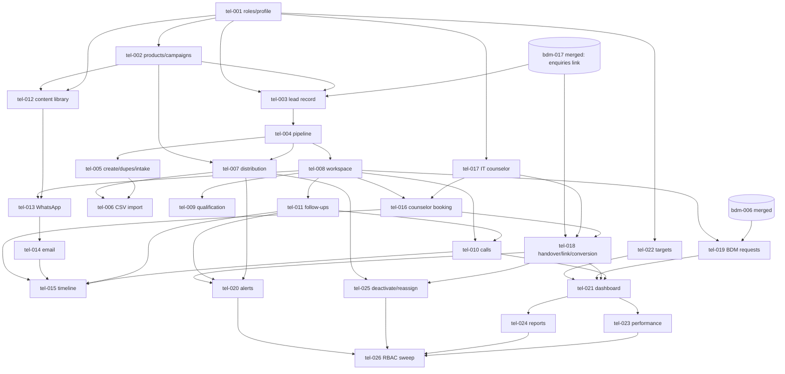

# Telecaller CRM — Engineering Enhancement Backlog (`tel-001` … `tel-026`)

NO-ASSUMPTION MODE. Prepared 2026-10-05 at the user's request. **No code was written or changed.**

- **Source:** `functionalities/edusphere_markdown/Telecaller Functionalities.md` = `EVID-019` (`DERIVED_BLUEPRINT`, `SOURCE_MANIFEST.csv`
  sha256 `24f743e1…`). I read it end to end (742 lines, 22 numbered sections plus an architecture note). The section audit is in §1. Every
  source line is traced in Appendix A, and every counted figure is defined in Appendix B.
- **Scope authority:** the user's in-session answers of 2026-10-05, T1–T29 in §3.1 (`EXPLICIT_APPROVAL`). They lift `PRD_OPEN_ITEMS.md`
  item 61 / `CONFLICT_MATRIX.md` for `EVID-019`, the same way `DEC-SCOPE-055` D1 did for BDM. Registered as `DEC-SCOPE-073`.
- **Correction:** `BDM_CRM_BACKLOG.md` cites "`DEC-SCOPE-036`: the Telecaller CRM, reserves `tel-NNN`, leads extend `enquiries` (D3)".
  No Telecaller decision exists anywhere in git history, and `DEC-SCOPE-036` is ENH-017. The bdm-017 design spec records the same finding.
  The `enquiries` extension is defined by bdm-017 and by this backlog's T6 and T29.
- **Method:** I oriented with the graphify graph first, then checked each finding against source at `08b71553` and again at `origin/main`
  `032ce4bf` (bdm-004 merged). Architecture context: `docs/architecture/ARCHITECTURE_BASELINE.md` and the 2026-10-05 baseline summary.
- **Gates:** every item is behind `APPROVAL_GATES.md` GATE-09 (Coding). The item-level questions in §3.2 are asked one at a time when each
  item starts, as was done for bdm-001 B1–B11.
- **Authorization convention (user, 2026-09-28):** new routes follow the inline pattern: a `User.role` check, then scope helpers, then the
  write. They do not use the `require_*` dependencies.

---

## 0. What already exists (verified in code, not assumed)

| Capability | Where | State vs this source |
|---|---|---|
| Lead store | `Enquiry` (`enquiries`, `models.py:723`): division, name, email (NOT NULL), phone, subject, message, `source` (default `website`), `status` (free text, default `new`), `owner_id`, `crm_sync_status`, `metadata_json` | Minimal. There is no lead code, priority, product, campaign, telecaller or pipeline. **Extended here (T6).** |
| Lead intake | `POST /public/enquiries` (`public.py:274`), then the outbox `sync_enquiry_to_crm_task` (Celery, webhook) | Website only. It is kept, and becomes one intake path into the telecaller queue (tel-005). |
| Admin lead list | `GET/PATCH /admin/leads` (`admin.py:382`): own division, 500-row cap, sets any `status` text and `owner_id`; `AdminLeadManagementPanel.tsx` offers `new/contacted/qualified/converted/lost` | It is kept and aligned to the pipeline (T25, tel-003/tel-004). |
| bdm-017 (**merged to `main` @ `7de5d44f`**, `DEC-SCOPE-072`, migration `0074_enquiry_bdm_attribution`) | Adds `bdm_organization_id`, `bdm_user_id`, `converted_user_id` (unique), `converted_at`, `converted_by_user_id` to `enquiries`, plus admin `POST/DELETE /admin/leads/{id}/conversion` (admin-only; linking sets `status='converted'`) | **Reused, then redefined by tel-018 (T29).** It must merge before tel-003. |
| Counselor | Role `counselor`, **Overseas only**: `workflows._require(..., "overseas")`, `ROLES_BY_DIVISION.overseas`, counselor "My Leads" = `enquiries.owner_id == user.id` in the overseas division (`services/portal.py:1093`) | IT has no counselor. **tel-017 enables IT counselors (T3).** |
| Counselling appointments | `Appointment` (`appointments`: division, `student_id`/`staff_id` → users, `scheduled_at`, type, mode, free-text status); `POST/PATCH /overseas/appointments` (`workflows.py:2298`) need an `overseas_student` user | A lead has no user account, so it can't be booked today. There is no slot or availability model. **Extended in tel-016 (T10).** |
| BDM appointments | `bdm_appointments` (bdm-006, merged): created by the BDM on their own `bdm_organizations` row | There is no inbound request. **tel-019 adds requests that the BDM accepts (T10).** |
| BDM roles pattern | `bdm`/`bdm_manager` (bdm-001): profile table, `/admin/bdms`, manager at `/admin/login`, `WorkflowPanel.tsx` `ROLES_BY_DIVISION.global` | **The template for tel-001 (T2, T21).** |
| Notifications | `Notification` + `NotificationDelivery` outbox (`notifications/dispatch.queue_deliveries`, after-commit publish), `workflows._notify_user`, `services/mailer.py` (SMTP) | Reused for alerts (tel-020) and email (tel-014). |
| Scheduler | `worker.py` `beat_schedule`: `sweep_stale_deliveries_task`, `agn017-daily-reminders` (02:30 UTC) | A 15-minute telecaller job is added (tel-020). |
| WhatsApp | Twilio, one approved Content SID, opted-in **users** only (`notifications/twilio.py`, `NotificationPreference`) | **Not used for leads.** wa.me click-to-chat is used instead (T8). |
| File storage | `services/storage.py` (S3 presigned / local), `/files/download`, `/local-files` | Brochure PDFs (tel-012). A public link for leads is open question Q-15. |
| IST dates | `services/bdm_appointments.today_ist`, `IST`, `db_now` | Reused for "today", overdue and daily windows. |
| Lists | `{items,total,limit,offset}`, `api.bdm.LIMIT/OFFSET`, web `isPage` | Reused everywhere. |
| Audit | `AuditLog`, ids and field names only | Every write. |
| IT enrolment / overseas stage | `Enrollment`, `Payment`; `OverseasApplication` status (`DEC-WF-001`), `VisaCase` | The read-through after linking (T4, T5). |

---

## 1. Source coverage audit (section by section)

| Source § (lines) | Content | Covered by | Notes |
|---|---|---|---|
| Preamble (1) | Lead gen → call → qualify → follow-up → appointment → handover → conversion | all | T1 |
| §1 Dashboard (5–20) | 10 tiles | tel-021 | Appendix B B1–B10 |
| §2 Lead management (22–96) | 18 lead fields; 13 sources; exact campaign/source | tel-002, tel-003 | T6, T16 |
| §3 Product/interest (98–142) | 5 IT, 9 Overseas, 4 Other | tel-002 | Managed and seeded (T17); Other routed per product (T18) |
| §4 Qualification (144–196) | 6 basic + 6 IT + 9 overseas fields | tel-009 | — |
| §5 Call management (198–252) | 10 call fields; 14 outcomes | tel-010 | Manual + tel: link (T7). The "Converted" outcome is not selectable (T5) |
| §6 Call script (254–264) | Script per product, standard steps | tel-012 | Manager library (T9) |
| §7 Follow-ups (266–312) | 5 fields; 10 reasons; Today's follow-ups card | tel-011 | — |
| §8 Priority (314–330) | Hot / Warm / Cold, telecaller-changeable | tel-008 | — |
| §9 Appointments (332–384) | 4 counselor types, 4 BDM types, 12 fields, 6 statuses | tel-016, tel-019 | T10; corporate → college BDM (T26) |
| §10 Handover (386–414) | Telecaller → Counselor → (Enrollment / Application Exec → Visa); "Assign to Counselor" | tel-017, tel-018 | Ends at the counselor; later stages read-only (T4, T19) |
| §11 WhatsApp (416–452) | 9 templates; one click; auto-logged | tel-012, tel-013 | wa.me (T8) |
| §12 Email (454–472) | 7 email kinds; stored on the timeline | tel-012, tel-014 | SMTP (T9) |
| §13 Timeline (474–496) | 9 event kinds | tel-015 | Derived from the event tables |
| §14 Daily activity (498–526) | 13 counts | tel-021 | Fully computed (T27) |
| §15 Targets (528–547) | 6 KPIs, daily/monthly, achieved/target | tel-022, tel-021 | T28 |
| §16 Performance (549–558) | 6-column comparison | tel-023 | T23, T24 |
| §17 Distribution (560–582) | Round robin, product, location, manual | tel-007 | T11 |
| §18 Duplicates (584–606) | Mobile + email; 5-point panel | tel-005 | T12 |
| §19 Pipeline (608–636) | 11 stages + 5 closed outcomes | tel-004 | T13 |
| §20 Alerts (638–650) | 9 alert kinds | tel-020 | T14 |
| §21 Reports (652–686) | 5 reports | tel-024 | T24 |
| §22 RBAC (688–713) | 10 allowed, 7 denied | tel-026 + each item | T2 |
| Architecture note (715–738) | 7-stage company CRM chain | tel-018, tel-019, tel-023/024 | Counselor/App-Exec/Visa CRMs are **not** built (T4) |
| "Top/Bottom of Form" (740, 742) | Copy-paste artefacts | — | Not requirements |

**Not in the source, so not added:**
- Telephony/dialer integration, which is deferred by T7.
- Ad-platform lead APIs (T15).
- Lead deletion, campaign spend, and SMS to leads.
- Lead self-service, and leads' own logins.
- Counselor availability/slot management. Only a clash check is in scope (Q-11).

---

## 2. Backlog summary

| ID | Title | Cx | Risk | Migration | Depends on |
|---|---|---|---|---|---|
| tel-001 | Telecaller + Telecaller Manager roles, profile, provisioning, sign-in, shell | M | High | Yes | — |
| tel-002 | Product/interest catalogue + campaign list (manager-managed, seeded) | S | Low | Yes | 001 |
| tel-003 | Lead record: `enquiries` extension, Lead ID, admin list alignment | L | High | Yes | 001, 002, **bdm-017** |
| tel-004 | Pipeline stage engine + stage history | M | High | Yes | 003 |
| tel-005 | Manual lead creation, duplicate detection, website-enquiry intake/attach | M | Medium | Yes | 003, 004 |
| tel-006 | CSV lead import per campaign | M | Medium | Yes | 005, 007 |
| tel-007 | Lead distribution rules, round robin, unassigned queue, manual (re)assignment | L | High | Yes | 001, 002, 003, 004 |
| tel-008 | Telecaller lead workspace: My Leads, lead detail, priority | M | Medium | No | 003, 004 |
| tel-009 | Qualification form (basic / IT / overseas) | S | Low | Yes | 008 |
| tel-010 | Call logging (tel: link, outcomes, pipeline effects) | M | Medium | Yes | 008, 011 |
| tel-011 | Follow-ups: create/complete/reschedule, Today's follow-ups, overdue | M | Medium | Yes | 008 |
| tel-012 | Script, message-template and brochure library | M | Medium | Yes | 001, 002 |
| tel-013 | WhatsApp click-to-chat + send log | S | Low | Yes | 008, 012 |
| tel-014 | Email to lead (SMTP) + send log | M | Medium | No* | 008, 012, 013 |
| tel-015 | Lead timeline | M | Low | No | 010, 011, 013, 014, 016 |
| tel-016 | Counselor appointment booking for leads | L | High | Yes | 004, 008, 017 |
| tel-017 | Counselor role in the IT division + IT counselor workspace | M | High | No | 001 (shared files) |
| tel-018 | Handover to counselor, return, student link, computed conversion | L | High | Maybe | 004, 008, 016, 017, **bdm-017** |
| tel-019 | BDM meeting requests (college/agent/school/corporate) | M | Medium | Yes | 008, **bdm-006** |
| tel-020 | Alerts & notifications (event + 15-min beat) | L | High | Yes | 007, 011, 016, 018 |
| tel-021 | Telecaller dashboard + daily activity | M | Medium | No | 010, 011, 016, 018, 019, 022 |
| tel-022 | Daily + monthly targets | M | Medium | Yes | 001 |
| tel-023 | Manager performance comparison | M | Medium | No | 021 |
| tel-024 | Management reports (5) + CSV export | L | Medium | No | 018, 021 |
| tel-025 | Deactivation, team move, bulk reassignment | M | High | No | 007, 011, 016, 018 |
| tel-026 | §22 permission matrix + cross-role 403/404 test sweep | M | Medium | No | all of 001–025 |

\* tel-014 writes to tel-013's `lead_messages` table, so it adds no table of its own.

---

## 3. Decisions and questions

### 3.1 Answered in-session 2026-10-05 (`EXPLICIT_APPROVAL`; to be registered as one DEC-SCOPE at tel-001)

| # | Question | Answer | Items |
|---|---|---|---|
| T1 | Is `EVID-019` in scope? | **Yes, all 22 sections.** Each item keeps its own questions and stays behind GATE-09 | all |
| T2 | Role model | **`telecaller` + `telecaller_manager`.** The manager sets targets, manages their team and reassigns. `super_admin` sees all | 001, 007, 022–026 |
| T3 | Who receives a qualified IT lead | **The existing `counselor` role, allowed in the IT division** (a counselor belongs to `it` or `overseas`) | 017, 018 |
| T4 | Chain end | **The Telecaller CRM stops at the counselor.** Enrolment, application and visa are read live from `Enrollment` / `OverseasApplication` / `VisaCase` once the lead is linked. No new downstream roles | 015, 018, 024 |
| T5 | "Converted" | **Computed:** a linked student **and** an IT `Enrollment`, or an `OverseasApplication` that reached `enrolled`. No one can select it | 004, 010, 018, 021–024 |
| T6 | Lead store | **Extend `enquiries`.** Every enquiry is a lead, with one store and one Lead ID | 003 and all |
| T7 | Calls | **A manual log + a `tel:` link.** A telephony provider is deferred | 010 |
| T8 | WhatsApp | **wa.me click-to-chat** with an editable template. The CRM records "WhatsApp sent – date/time – template". No API, approval or consent model now | 013 |
| T9 | Content ownership | **A manager-edited library:** `telecaller_manager` and `super_admin` maintain scripts and templates per product and upload brochure/fee PDFs. Telecallers may edit the text before sending. Email goes via SMTP with a brochure link | 012–014 |
| T10 | Appointments | **Counselor:** extend `appointments` with a lead link, booked straight to the counselor. **BDM:** the telecaller files a meeting request, and the BDM accepts it into `bdm_appointments` | 016, 019 |
| T11 | Distribution | **Manager-configured per team:** product rules, then location rules, then round robin among the team's active telecallers. No match or nobody available → unassigned queue. Manual reassignment is always allowed | 007 |
| T12 | Duplicates | **Normalised mobile OR email.** Manual create shows the §18 panel and blocks a second lead; the telecaller logs the new enquiry on the existing lead. A website enquiry from a known person attaches to the existing lead. Closed leads are matched too | 005, 006 |
| T13 | Pipeline | **System-driven where evidence exists.** The telecaller sets qualified / interested / follow-up and the closed outcomes (with a reason). A manager reopens. Every change is written to stage history | 004 |
| T14 | Alerts | **In-app + email.** Event alerts fire on the write; time-based alerts come from a beat job every 15 minutes, each sent once. The "not contacted" and "hot pending" thresholds are manager-set | 020 |
| T15 | Intake | **Manual + website + CSV import per campaign** (duplicate check per row). Ad-platform APIs are deferred | 005, 006 |
| T16 | Campaigns | **A managed list** (name, source, product, start/end, active). No ad spend | 002, 024 |
| T17 | Products | **A managed list seeded with §3** (group it/overseas/other), editable by the manager. An IT item may link to an existing course | 002 |
| T18 | "Other" products | **Team per product, set by the manager.** Seeded: Job Assistance and Career Change → IT; Career Guidance and General Enquiry → unassigned queue | 002, 007 |
| T19 | After handover | **The counselor owns the lead; the telecaller keeps read access only.** The counselor can return the lead with a reason, which reopens follow-up and alerts the telecaller | 018, 020 |
| T20 | Student link | **The counselor links** (searching by email/mobile); the system suggests a match and the counselor confirms. Never silent. Audited; a manager can undo it (which manager: Q-22) | 018 |
| T21 | Provisioning | **Like BDM:** `super_admin` creates both roles, and division admins create telecallers for their own team, via admin user-create with a set-password welcome email. The telecaller signs in at their division portal and lands on `/telecaller/dashboard`. The manager is division `global` and signs in at `/admin/login`. Deactivation forces reassignment | 001, 025 |
| T22 | Team | **One team each (IT or Overseas).** Division follows the team. Moving teams requires reassigning open leads first | 001, 007, 025 |
| T23 | Manager scope | **Direct reports** (a reporting manager per telecaller) plus the unassigned queue of the teams they manage. `super_admin` sees all | 001, 007, 022–025 |
| T24 | Report visibility | **Managers** see their reports' leads; **division admins** see their division; **`super_admin`** sees all. Telecallers see only their own figures. On-screen tables + CSV export | 021, 023, 024 |
| T25 | Admin lead screen | **Kept and aligned to the pipeline:** paginated, new columns, status only via valid stage rules, owner becomes assignment with the same scope checks, legacy statuses mapped by migration | 003, 004 |
| T26 | "Corporate meeting" | **Routes to college-type BDMs.** No new BDM type | 019 |
| T27 | Daily activity | **Fully computed** for an IST day. Nothing typed or submitted | 021 |
| T28 | Targets | **Daily + monthly**, a team default with a per-telecaller override. Changes apply from the next day/month, with history kept; past results are never re-scored | 022 |
| T29 | bdm-017 reconciliation | **Reuse bdm-017's link columns and admin link/unlink.** tel-018 also lets the assigned counselor link, and changes the meaning: a link moves the lead to `application_enrollment`, and `converted` is computed (T5). This supersedes `DEC-SCOPE-072` (bdm-017) L2/L7 for leads in the telecaller pipeline; it is recorded as a superseding decision | 003, 004, 018 |

### 3.2 Item-level questions (asked one at a time when the item starts; `NEEDS_CONFIRMATION` until then)

| # | Question | Item |
|---|---|---|
| Q-01 | Lead ID format. The proposal is a global sequence `LD-000001` (the bdm-002 ORG sequence idiom), backfilled for existing rows | 003 |
| Q-02 | Mapping existing `enquiries.status` values (`new/contacted/qualified/converted/lost` plus any free text) to stages, and what to do with rows marked `converted` that have no student link | 003, 004 |
| Q-03 | `enquiries.email` is NOT NULL, but a phone-only lead has no email. Make it nullable (website still requires it)? | 003, 005 |
| Q-04 | Mobile normalisation: default `+91` for 10-digit numbers? How are international numbers handled? | 003, 005 |
| Q-05 | A website enquiry has a division and a subject but no product. Does it go to the team's unassigned queue or to round robin? | 005, 007 |
| Q-06 | CSV columns, row cap, and whether a bad file is all-or-nothing or a per-row report | 006 |
| Q-07 | Round-robin eligibility. There is no leave model, so is "active" just the account status? Should a manager be able to pause a telecaller? | 007 |
| Q-08 | Call type values (outgoing / incoming / callback?) | 010 |
| Q-09 | Is `no_response` set by hand, or automatically after N unconnected attempts? | 004, 010 |
| Q-10 | When is a follow-up overdue, and does logging a call auto-complete a due follow-up? | 011 |
| Q-11 | Counselor clash: refuse an overlapping booking (409), or allow it with a warning? What is the default appointment length? | 016 |
| Q-12 | Overseas counselor scope today is `OverseasApplication.counselor_id`. Should a lead handed to a counselor also grant booking without an application? | 016, 018 |
| Q-13 | BDM request routing: to a chosen BDM, or to any BDM of the type through `bdm_manager` triage? What happens on a decline? | 019 |
| Q-14 | Alert threshold defaults, quiet hours, and digest vs one-per-event email | 020 |
| Q-15 | Brochures are sent to people with no account, so links must work signed-out. Signed expiring URL (expiry?) or public file? | 012–014 |
| Q-16 | Email sender: system from-address with reply-to set to the telecaller? Replies are not tracked | 014 |
| Q-17 | Working days for daily targets (Sundays, holidays) | 022 |
| Q-18 | Conversion credit: the original telecaller, the telecaller at handover, or the current one? Does an enrolment that predates the lead count? | 018, 023, 024 |
| Q-19 | Credit for calls after reassignment (whoever logged the call, as proposed) | 023, 024 |
| Q-20 | Mask mobile/email in CSV exports? | 024 |
| Q-21 | Lead consent and retention (India DPDP Act 2023): a consent capture for WhatsApp/email to leads, and a retention period for closed leads | 003, 005, 013, 014 |
| Q-22 | "A manager can undo the link" (T20): the division admin (bdm-017 already allows this), the telecaller's manager, or both? | 018 |
| Q-23 | Which counselor screens and checks become division-aware for IT, and can a counselor's division be changed? | 017 |

---

## 4. Backlog items

### tel-001 — Telecaller + Telecaller Manager roles, profile, provisioning, sign-in, shell

**Status (2026-10-06):** **merged** to `main` as PR #68 @ `e73dfa60` (`DEC-SCOPE-073`, migration `0075_telecaller_profiles`).

- **Business requirement:** §22 "Telecaller should not have access to everything". The source refers throughout to "Management" (§15, §16, §17, §21). Under your account-lifecycle convention, creating a user implies the full lifecycle.
- **Existing behavior:** no telecaller roles. The admin create-user form (`WorkflowPanel.tsx` `ROLES_BY_DIVISION`, `admin.py` create_user) offers fixed role sets per division.
- **Expected behavior:**
  - New roles `telecaller` (division `it`/`overseas` = team, T22) and `telecaller_manager` (division `global`).
  - A `telecaller_profiles` row (employee_id, team, reporting manager, active) with required fields only.
  - Creation by `super_admin`, or by a division admin for their own team, with a set-password welcome email (DEC-SCOPE-019).
  - Forgot/change password via the existing flows: the telecaller uses its division portal, the manager uses `/admin/forgot-password`.
  - Landing pages `/telecaller/dashboard` and `/telecaller/manager/team` as minimal PortalShell pages. A profile page. The manager's team list.
- **User roles affected:** `telecaller`, `telecaller_manager`, `super_admin`, `it_admin`, `overseas_admin`.
- **Frontend impact:** `ROLES_BY_DIVISION`, a Telecallers admin page (the `AdminBdmPage` pattern), `lib/navigation.ts` `TELECALLER_NAV`, `middleware.ts` matcher and redirect rules, and the login landing map.
- **Backend impact:** `rbac.PERMISSIONS` (`telecaller: {"telecaller:self"}`, `telecaller_manager: {"telecaller:team"}`); new `api/telecaller.py` + `services/telecaller.py` (`telecaller_context`, `require_manager`, `team_filter`, mirroring `services/bdm.py`); `admin.py` create/update user; `auth.PORTAL_SIGN_IN`.
- **Database impact:** `telecaller_profiles` (user_id PK/FK, employee_id unique, team, reporting_manager_user_id FK, timestamps). Check: team ∈ {it, overseas} and team = user.division.
- **API impact:** `GET /telecaller/me`, `PATCH /telecaller/profile` (phone only), `GET /telecaller/manager/team`, `GET /admin/telecallers`, `GET /admin/telecaller-managers`; create and edit via `POST/PATCH /admin/users` (`DEC-SCOPE-073` TL4).
- **Integration impact:** SMTP welcome email (existing).
- **Authentication impact:** new sign-in landings. Manager sign-in at `/admin/login`, as for `bdm_manager`.
- **Authorization impact:** new roles; division-admin team lock; manager sees direct reports only (T23).
- **Security impact:** privilege boundary: a division admin cannot create a `telecaller_manager`. No admin-known password.
- **Performance impact:** negligible.
- **Reusable existing modules:** bdm-001 (`api/bdm.py`, `services/bdm.py`, `AdminBdmPage/Panel/Row/CreateForm`), `provisioning.py`, `mailer.send_welcome_email`, `PortalShell`.
- **Dependencies:** none. Shares `rbac.py`, `ROLES_BY_DIVISION`, `admin.create_user` and `middleware.ts` with tel-017 (sequential).
- **Acceptance criteria:**
  1. `super_admin` creates a telecaller (team, employee id, manager) and a manager. The invitee sets a password from the email link.
  2. An `it_admin` can create only IT telecallers. Creating a manager or an overseas telecaller → 403.
  3. A telecaller signs in at its team's portal and lands on `/telecaller/dashboard`. Signing in at the wrong portal gives the existing "use the correct portal" 403.
  4. A manager sees only their direct reports.
  5. Signed-out `/telecaller/*` redirects to sign-in with `next`.
- **Positive scenarios:** create an Overseas telecaller under Manager M; M sees them in the team list.
- **Negative scenarios:** reporting manager is not a `telecaller_manager` → 422; duplicate employee id → 409; a telecaller calls `/telecaller/manager/team` → 403.
- **Edge cases:** an inactive manager can't be chosen as reporting manager; the team can't be edited here (tel-025).
- **Regression risks:** admin user-create for existing roles; login division rule; middleware redirects for `/it`, `/overseas`, `/admin`, `/bdm`.
- **Complexity:** medium · **Risk:** high

### tel-002 — Product/interest catalogue + campaign list

**Status (2026-10-06):** **merged** to `main` as PR #69 @ `c80180be` (`DEC-SCOPE-074` P1–P4, migration `0076_tel_catalogue`).

- **Business requirement:** §3 interest selection; §2 "exact campaign/source", e.g. "Instagram → Cyber Security → September 2026 Campaign".
- **Existing behavior:** none. `enquiries.subject` is free text, and IT courses (`Course`/`Program`) and `seed/countries.json` exist separately.
- **Expected behavior:**
  - `tel_products`: group it/overseas/other, name, team (it/overseas/null = unassigned queue, T18), optional `course_id`, active, sort. Seeded with the 18 §3 values.
  - `tel_campaigns`: name, source, product, start/end dates, active.
  - Managers and `super_admin` create, edit and deactivate both. Others read active items only.
- **User roles affected:** `telecaller_manager`, `super_admin` (write); `telecaller` (read).
- **Frontend impact:** manager Settings → Products / Campaigns pages; shared pickers.
- **Backend impact:** `api/telecaller_catalogue.py`, `services/telecaller_catalogue.py`.
- **Database impact:** `tel_products`, `tel_campaigns`, with unique name per group (campaign: per name) and seed rows in the migration.
- **API impact:** `GET/POST/PATCH /telecaller/products`, `GET/POST/PATCH /telecaller/campaigns`.
- **Integration impact:** none.
- **Authentication impact:** none.
- **Authorization impact:** manager/super_admin write; telecaller read.
- **Security impact:** low.
- **Performance impact:** small tables.
- **Reusable existing modules:** `lookups.py` patterns, `api.bdm.LIMIT/OFFSET`.
- **Dependencies:** tel-001.
- **Acceptance criteria:**
  1. All 18 §3 values are present after migration.
  2. A deactivated product or campaign disappears from pickers but stays on existing leads.
  3. A campaign must name a source from the §2 list and an active product.
  4. Campaign end date before start date → 422.
- **Positive scenarios:** create "Sep 2026 Cyber Security" (Instagram, Cyber Security).
- **Negative scenarios:** a telecaller POSTs a product → 403; duplicate name in a group → 409.
- **Edge cases:** renaming a product keeps lead links; editing an "Other" product's team affects only new distribution.
- **Regression risks:** none.
- **Complexity:** small · **Risk:** low

### tel-003 — Lead record: `enquiries` extension, Lead ID, admin list alignment

**Status (2026-10-06):** **merged** to `main` as PR #75 @ `10fce82e` (`DEC-SCOPE-077` L1–L6, migration `0078_enquiry_lead_record`, re-chained after bdm-008 `0077` and tel-017 `DEC-SCOPE-076`).

- **Business requirement:** §2 "Every lead should have a Lead ID" and the 18 fields; T6, T25.
- **Existing behavior:** see §0. bdm-017 adds attribution and link columns.
- **Expected behavior:**
  - Additive columns on `enquiries` (Appendix A L28–L62): `lead_code` (unique, Q-01), `phone_normalized`, `whatsapp_number`, `city`, `state`, `qualification`, `passing_year`, `institution`, `product_id`, `campaign_id`, `telecaller_user_id`, `priority` (default `warm`), `stage_changed_at`.
  - `owner_id` keeps its meaning of **assigned counselor**.
  - `source` is constrained to the §2 list plus `website`/`bdm`.
  - Backfill `lead_code` and `phone_normalized`.
  - The admin lead list becomes paginated, gains the new columns, and its status editor offers only valid transitions (via tel-004).
- **User roles affected:** all lead readers: admins, counselor, `bdm` (bdm-017 lists), telecaller roles.
- **Frontend impact:** `AdminLeadManagementPanel.tsx` (columns, pagination, stage select); `lib/types.ts` lead type.
- **Backend impact:** `models.Enquiry`, `schemas` lead models, `admin.leads` (pagination replaces the 500 cap), `public.create_enquiry` (sets code and normalised phone), the CRM sync payload (adds `lead_code` only).
- **Database impact:** one migration: columns, FKs, CHECKs (priority, source), unique `lead_code`, indexes `(telecaller_user_id, status)`, `(phone_normalized)`, `(lower(email))`, `(campaign_id)`, `(product_id)`; data backfill.
- **API impact:** `GET /admin/leads` becomes `{items,total,limit,offset}`. **A breaking shape change**, so update the panel in the same item.
- **Integration impact:** the Zoho/CRM webhook payload gains `lead_code` (additive).
- **Authentication impact:** none.
- **Authorization impact:** unchanged for admins.
- **Security impact:** more PII on a shared table. Keep log lines to ids only (Q-21 consent and retention).
- **Performance impact:** the backfill on a large table runs in a migration batch. New indexes.
- **Reusable existing modules:** the bdm-002 sequence-code idiom; 0061's guarded-migration idiom; bdm-017 columns.
- **Dependencies:** tel-001, tel-002, bdm-017 (merged; chain after `0074`).
- **Acceptance criteria:**
  1. Every existing and new enquiry has a unique Lead ID.
  2. Website enquiries still return 201 with the same keys plus `lead_code`.
  3. The admin list paginates and filters by stage, product, campaign and telecaller.
  4. bdm-017 attribution and link columns are untouched.
  5. Downgrade refuses while new data exists.
- **Positive scenarios:** a website form submission gets `LD-000123`.
- **Negative scenarios:** source outside the list → 422.
- **Edge cases:** two concurrent creates never get the same code; legacy rows with an invalid phone keep `phone_normalized` NULL.
- **Regression risks:** **high.** The admin lead list, counselor My Leads, bdm-017 org lead lists, RPT-001 funnel counts, the dashboard "Enquiries" counts, the public enquiry API and the CRM sync all read this table.
- **Complexity:** large · **Risk:** high

### tel-004 — Pipeline stage engine + stage history

**Status (2026-10-06):** **merged** to `main` as PR #81 @ `69829a59` (`DEC-SCOPE-081` PL1–PL4 + D1–D4, migration `0081_lead_stage_pipeline`,
API contract §12H; re-chained after bdm-005, bdm-013 and tel-022's `0080_tel_targets` / `DEC-SCOPE-080`). Spec `docs/superpowers/specs/2026-10-06-tel-004-lead-pipeline-design.md`.

- **Business requirement:** §19 pipeline and closed outcomes; T13.
- **Existing behavior:** `status` is free text, set by admin PATCH; bdm-017 sets `converted` on link.
- **Expected behavior:**
  - One service, `services/lead_pipeline.py`, that owns every stage change. It covers 11 stages + 5 closed outcomes (Appendix A L612–L636).
  - Allowed transitions: system events (assign, first call, connected call, appointment booked/completed, link, conversion), telecaller (qualified, interested, follow_up, closed + reason), manager (reopen a closed lead to `follow_up`).
  - Every change writes `lead_stage_history` (from, to, actor, reason, at).
  - `converted` is never set by a person (T5).
  - Admin PATCH `status` goes through the same service (T25).
- **User roles affected:** telecaller, manager, counselor, admins.
- **Frontend impact:** a stage badge and a "Change stage" control with a reason dialog for closed outcomes.
- **Backend impact:** the new service; `admin.update_lead` routed through it; a data migration for legacy statuses (Q-02).
- **Database impact:** `lead_stage_history` (lead_id, from_stage, to_stage, actor_user_id nullable for system, reason, created_at); a CHECK on `enquiries.status` against the stage list after mapping.
- **API impact:** `POST /telecaller/leads/{id}/stage {to, reason}`.
- **Integration impact:** none.
- **Authentication impact:** none.
- **Authorization impact:** per-actor transition table; out-of-scope lead → 404.
- **Security impact:** status integrity; reasons are free text (never logged).
- **Performance impact:** one insert per change.
- **Reusable existing modules:** the bdm-004 stage-history pattern (`docs/superpowers/specs/2026-10-05-bdm-004-organization-pipelines-design.md`), `AuditLog`.
- **Dependencies:** tel-003.
- **Acceptance criteria:**
  1. Each automatic transition fires exactly once from its event.
  2. A telecaller can't set `counselling_completed`, `application_enrollment` or `converted` → 422.
  3. A closed outcome without a reason → 422.
  4. Only a manager or admin reopens a closed lead.
  5. History lists every change in order.
- **Positive scenarios:** first connected call moves `first_call_pending` → `contacted`.
- **Negative scenarios:** a telecaller tries to reopen → 403.
- **Edge cases:** concurrent changes (lock the lead row); events on a closed lead are recorded on the timeline without moving the stage.
- **Regression risks:** the admin status editor; the bdm-017 link behaviour (moved to tel-018).
- **Complexity:** medium · **Risk:** high

### tel-005 — Manual lead creation, duplicate detection, website-enquiry intake/attach

**Status (2026-10-06):** **merged** to `main` as PR #92 @ `014168b2` (`DEC-SCOPE-088` I1–I6 + R1–R10, migration `0086_lead_enquiries`,
API contract §12L). Spec `docs/superpowers/specs/2026-10-06-tel-005-lead-intake-design.md`. tel-007 merged first (PR #90, `0085` / `DEC-SCOPE-087` / §12K), so
tel-005 re-chained after it, and `lead_intake` sends new website leads and manager-created leads through `lead_distribution.on_intake` (I6).
"Last contact" in the panel waits for tel-010 / tel-013.

- **Business requirement:** §18, T12, T15.
- **Existing behavior:** only the website form creates leads. No duplicate check exists.
- **Expected behavior:**
  - A telecaller or manager creates a lead (§2 fields, source + campaign + product).
  - Before insert, match on normalised mobile OR lower(email) across all leads, including closed ones.
  - On a match, a 409 response carries the §18 panel (existing telecaller, counselor, last contact, stage, previous enquiries) and an "Add enquiry to this lead" action.
  - A website enquiry that matches attaches to the existing lead as a `lead_enquiries` row (timeline event) instead of creating a new lead.
  - New leads go to tel-007 distribution.
- **User roles affected:** telecaller, manager; public website visitors (indirectly).
- **Frontend impact:** a New Lead form; a duplicate panel; "Add enquiry" action.
- **Backend impact:** `services/lead_intake.py` (shared by manual, website and CSV); `public.create_enquiry` calls it.
- **Database impact:** `lead_enquiries` (lead_id, subject, message, source, campaign_id, created_by nullable, created_at).
- **API impact:** `POST /telecaller/leads`, `POST /telecaller/leads/{id}/enquiries`, `GET /telecaller/leads/duplicate-check?phone=&email=`. `POST /public/enquiries` keeps its response shape, and **its `id` becomes the existing lead's id when the enquiry attaches**.
- **Integration impact:** the CRM sync for an attached enquiry. Does the existing webhook fire per enquiry or per lead? Decided in this item; the proposal is per lead.
- **Authentication impact:** none.
- **Authorization impact:** the duplicate panel reveals the other telecaller's name and the stage. Telecaller-visible by T12, but no contact details of other leads are revealed beyond what was typed.
- **Security impact:** a **public enumeration risk**: the website response must not reveal that a person already exists (same 201 either way).
- **Performance impact:** indexed lookups.
- **Reusable existing modules:** `public.create_enquiry`, `sync_enquiry_to_crm_task`.
- **Dependencies:** tel-003, tel-004.
- **Acceptance criteria:**
  1. A duplicate by mobile or by email is blocked with the panel.
  2. A website enquiry from a known email attaches (no new lead) and the public response is identical in shape.
  3. A closed lead also matches, and the telecaller may add an enquiry, which reopens it via the manager rule (Q-10/T13).
  4. A new lead enters distribution.
- **Positive scenarios:** Rahul calls in; the telecaller creates a lead with Instagram / Cyber Security / Sep campaign.
- **Negative scenarios:** same mobile with different formatting (`+91 98…` vs `98…`) → duplicate.
- **Edge cases:** a shared family email (two students) is blocked by T12, and the telecaller adds the second as an enquiry. **Flagged under Q-03/Q-04.**
- **Regression risks:** the public enquiry API, CRM sync, and PUB-002 tests.
- **Complexity:** medium · **Risk:** medium

### tel-006 — CSV lead import per campaign

**Status (2026-10-06):** **merged** to `main` as PR #96 @ `126b454b` (`DEC-SCOPE-091` IM1 + R1–R12, migration `0087_lead_import_batches`, API
contract §12N; 090 / §12M are claimed by the open AGN-023 branch). Spec `docs/superpowers/specs/2026-10-06-tel-006-lead-import-design.md`.
Q-06 answered: one campaign per upload, per-row report, ≤ 1 MB / 500 rows.

- **Business requirement:** T15 (Instagram/Facebook/Google/event leads).
- **Existing behavior:** none. School bulk imports exist (`school_bulk.py`, `school_onboarding_bulk.py`).
- **Expected behavior:**
  - A manager uploads a CSV for a campaign. Validate per row, run the duplicate check per row (T12) and attach duplicates as enquiries.
  - The response is a result report (created / attached / rejected with reason).
  - New leads are distributed (tel-007).
  - Format and limits: Q-06.
- **User roles affected:** `telecaller_manager`, `super_admin`.
- **Frontend impact:** an import page with a template download and a result table.
- **Backend impact:** `api/telecaller_import.py` reusing `lead_intake`.
- **Database impact:** `lead_import_batches` (campaign, uploaded_by, counts, created_at) for traceability.
- **API impact:** `POST /telecaller/imports` (multipart), `GET /telecaller/imports`.
- **Integration impact:** none.
- **Authentication impact:** none.
- **Authorization impact:** manager/super_admin only.
- **Security impact:** CSV/formula injection on export (prefix `=`/`+`/`-`/`@`); file type/size allow-list (existing settings); PII in uploaded files is not stored.
- **Performance impact:** row cap; one transaction per batch or per row (Q-06).
- **Reusable existing modules:** `school_bulk.py` parser and report pattern, `lib/bulkEntry.ts`, `idempotencyKey.ts`.
- **Dependencies:** tel-005, tel-007.
- **Acceptance criteria:**
  1. A valid file creates leads tagged with the campaign and its source/product.
  2. Duplicate rows attach.
  3. Invalid rows are reported with a line number and reason.
  4. Re-uploading the same file with the same idempotency key creates nothing.
- **Positive scenarios:** 250 rows → 230 created, 15 attached, 5 rejected.
- **Negative scenarios:** wrong headers → 422 before any row.
- **Edge cases:** duplicates within the same file; a deactivated campaign → 422.
- **Regression risks:** none.
- **Complexity:** medium · **Risk:** medium

### tel-007 — Lead distribution rules, round robin, unassigned queue, manual (re)assignment

**Status (2026-10-06):** **merged** to `main` as PR #90 @ `595025e4` (`DEC-SCOPE-087` DI1–DI4 + D1–D6, migration `0085_tel_distribution`,
API contract §12K; re-chained after bdm-025 082 / 0082, tel-012 083 / 0083, tel-008 084, bdm-018 085 / 0084 and bdm-021 086). Spec `docs/superpowers/specs/2026-10-06-tel-007-lead-distribution-design.md`.

- **Business requirement:** §17, T11, T18, T23.
- **Existing behavior:** admins set `owner_id` by hand only.
- **Expected behavior:**
  - The manager maintains, per team, product → telecaller rules and city → telecaller rules.
  - Order: product rule, then location rule, then round robin among active telecallers of the product's team (Q-07). Otherwise → unassigned queue.
  - Assignment sets `telecaller_user_id` and triggers stage `assigned` plus the "New Lead Assigned" alert (tel-020).
  - Managers assign and reassign within their reports. History goes through the stage history / an assignment event.
- **User roles affected:** manager, telecaller, `super_admin`.
- **Frontend impact:** manager Rules page; Unassigned queue page; bulk-select reassign.
- **Backend impact:** `services/lead_distribution.py` (a pure rule function + a round-robin cursor under a row lock).
- **Database impact:** `tel_distribution_rules` (team, kind product/city, match value, telecaller_user_id, active); `tel_round_robin_cursors` (team PK, last_user_id).
- **API impact:** `GET/POST/PATCH/DELETE /telecaller/distribution-rules`, `GET /telecaller/leads/unassigned`, `POST /telecaller/leads/assign {lead_ids, telecaller_user_id}`.
- **Integration impact:** none.
- **Authentication impact:** none.
- **Authorization impact:** a manager can assign only to direct reports, and only leads in their scope or the unassigned queue of their teams.
- **Security impact:** a mass reassignment is audited per lead.
- **Performance impact:** the cursor row lock serialises concurrent intake (acceptable at telecaller scale).
- **Reusable existing modules:** `services/bdm.team_filter`, the bdm-002 manager reassign pattern.
- **Dependencies:** tel-001, tel-002, tel-003, tel-004.
- **Acceptance criteria:**
  1. Rules apply in the stated order.
  2. Round robin is even across active telecallers (3 telecallers, 9 leads → 3 each).
  3. A deactivated telecaller is skipped.
  4. No candidate → unassigned.
  5. A manager reassigning to someone outside their reports → 403.
- **Positive scenarios:** Hyderabad rule sends a Hyderabad lead to Telecaller A.
- **Negative scenarios:** a rule pointing at another team's telecaller → 422.
- **Edge cases:** a product with team null (T18) → unassigned; concurrent intake from website + CSV.
- **Regression risks:** website intake latency (distribution runs in the same transaction).
- **Complexity:** large · **Risk:** high

### tel-008 — Telecaller lead workspace: My Leads, lead detail, priority

**Status (2026-10-06):** **merged** to `main` as PR #85 @ `b76c92f7` (`DEC-SCOPE-084` W1 + D1–D6, no migration, API contract §12J). Spec
`docs/superpowers/specs/2026-10-06-tel-008-lead-workspace-design.md`. "Due follow-up" filter → tel-011; other action buttons → their items. The inherited script panel (below) is built (D6).

**Inherited from tel-012 (`DEC-SCOPE-083` C2):** the lead-detail **script panel**. It shows the lead's product's active script from
`GET /telecaller/scripts?product_id=`.

- **Business requirement:** §22 "View assigned leads", §8 priority, §2 field display.
- **Existing behavior:** none for telecallers.
- **Expected behavior:**
  - My Leads: paginated, with filters for stage, priority, product, campaign, due follow-up, and search by name/phone/Lead ID.
  - Lead detail: §2 fields, stage, priority (editable, with a timeline entry), and action buttons (call, WhatsApp, email, follow-up, book, assign to counselor).
  - After handover the detail page is read-only (T19).
- **User roles affected:** telecaller; manager (reports' leads).
- **Frontend impact:** `/telecaller/leads`, `/telecaller/leads/[id]`, `TelecallerLeadTable`, `LeadDetailPanel`.
- **Backend impact:** `services/telecaller_leads.load_scoped` (unreadable = 404), list query.
- **Database impact:** none (indexes from tel-003).
- **API impact:** `GET /telecaller/leads`, `GET /telecaller/leads/{id}`, `PATCH /telecaller/leads/{id}` (contact fields, priority; not owner or stage).
- **Integration impact:** none.
- **Authentication impact:** none.
- **Authorization impact:** a telecaller reads leads where `telecaller_user_id = me` (including handed-over ones, read-only); a manager reads their reports' leads.
- **Security impact:** IDOR: every `{id}` goes through `load_scoped`.
- **Performance impact:** paginated, indexed.
- **Reusable existing modules:** `DataTable`, `PortalShell`, `lib/apiErrors` (`isPage`, `sendJson`), `formatDate`.
- **Dependencies:** tel-003, tel-004.
- **Acceptance criteria:**
  1. A telecaller sees only their leads.
  2. Another telecaller's lead id → 404.
  3. A priority change is saved and appears on the timeline.
  4. A handed-over lead shows read-only.
- **Positive scenarios:** filter Hot + follow-up due today.
- **Negative scenarios:** PATCH `telecaller_user_id` → 422 (not editable here).
- **Edge cases:** a lead reassigned while open in the browser → the next write is 404.
- **Regression risks:** none.
- **Complexity:** medium · **Risk:** medium

### tel-009 — Qualification form

**Status (2026-10-07):** **merged** to `main` as PR #98 @ `d328a705` (`DEC-SCOPE-093` QF1–QF3 + QD1–QD4, migration `0089_lead_qualifications`, API
contract §12O). Spec `docs/superpowers/specs/2026-10-06-tel-009-qualification-form-design.md`. The counselor's read after handover moves
to tel-018 (QF3).

- **Business requirement:** §4.
- **Existing behavior:** none.
- **Expected behavior:**
  - One form on the lead: basic fields always, plus the IT or overseas section by the product's group (Appendix A L150–L196).
  - Shared fields write through to the lead columns (qualification, passing year, city/state).
  - Saving does not change the stage automatically; the telecaller marks Qualified (tel-004).
- **User roles affected:** telecaller.
- **Frontend impact:** `LeadQualificationForm` (fieldsets, `aria-invalid`, leave guard).
- **Backend impact:** `PUT /telecaller/leads/{id}/qualification`.
- **Database impact:** `lead_qualifications` (lead_id PK, typed nullable columns per field, updated_by, updated_at).
- **API impact:** GET/PUT qualification.
- **Integration impact:** none.
- **Authentication impact:** none.
- **Authorization impact:** the owning telecaller before handover; the counselor after handover (read).
- **Security impact:** low.
- **Performance impact:** negligible.
- **Reusable existing modules:** `fieldset.form-section` CSS, `useLeaveGuard`, the AGN-006 counselling form pattern.
- **Dependencies:** tel-008.
- **Acceptance criteria:**
  1. The IT section is shown only for IT products, the overseas section only for overseas products.
  2. Academic percentage is 0–100; passing year is within a plausible range.
  3. Changing the product group keeps the other group's values but hides them.
- **Positive scenarios:** fill the Overseas UK Masters intake Sep 2027.
- **Negative scenarios:** percentage 120 → 422.
- **Edge cases:** a lead with an "Other" product shows basic fields only.
- **Regression risks:** none.
- **Complexity:** small · **Risk:** low

### tel-010 — Call logging

- **Business requirement:** §5, T7.
- **Existing behavior:** none. bdm-009 logs BDM activities.
- **Expected behavior:**
  - "Call" opens `tel:` and the log form: date/time (default now, IST), duration, type (Q-08), outcome (14 values; "Converted" is not offered, T5), remarks, and an optional next follow-up (creates a tel-011 row).
  - Each outcome applies its pipeline effect (Appendix A L226–L252): connected outcomes → `contacted`; Appointment Fixed opens the tel-016 booking; Duplicate flags tel-005 merge; Not Interested / Wrong Number / Not Eligible / Already Joined close with a reason.
- **User roles affected:** telecaller.
- **Frontend impact:** `CallLogForm`; calls list on the lead.
- **Backend impact:** `services/lead_calls.py`.
- **Database impact:** `lead_calls` (lead_id, caller_user_id, occurred_at, duration_seconds, call_type, outcome, remarks, created_at); index `(caller_user_id, occurred_at)`, `(lead_id, occurred_at)`.
- **API impact:** `GET/POST /telecaller/leads/{id}/calls`; edit/delete same IST day only (the bdm-009 rule).
- **Integration impact:** none (no dialer).
- **Authentication impact:** none.
- **Authorization impact:** the owning telecaller only, before handover.
- **Security impact:** remarks are never logged.
- **Performance impact:** indexed for daily counts.
- **Reusable existing modules:** bdm-009 (`check_time`, `day_range`, `DAILY_CAP`, same-day edit), `today_ist`.
- **Dependencies:** tel-008, tel-011.
- **Acceptance criteria:**
  1. A call with a connected outcome moves the first-call stages once.
  2. A future time → 422; more than 7 days back → 422 (bdm-009 V4 precedent; confirm).
  3. "Next follow-up" creates a follow-up.
  4. Daily counts per outcome are exact.
- **Positive scenarios:** No Answer ×2, then Connected – Interested.
- **Negative scenarios:** logging a call on a handed-over lead → 403.
- **Edge cases:** a duration typed as 0 for not-connected calls; an "Appointment Fixed" outcome without a completed booking leaves the stage at `contacted`.
- **Regression risks:** none.
- **Complexity:** medium · **Risk:** medium

### tel-011 — Follow-ups

**Status (2026-10-07):** **merged** to `main` as PR #100 @ `8f9f1676` (`DEC-SCOPE-094` F1–F4 + F5–F10, migration `0090_lead_follow_ups`, API
contract §12P, RBAC §2.22; re-chained after tel-009's `0089_lead_qualifications` / `DEC-SCOPE-093` / §12O). Spec `docs/superpowers/specs/2026-10-06-tel-011-follow-ups-design.md`. The §7 card's "Last
Call" arrives with tel-010 (F8); a follow-up moves with its lead (F3), so tel-025 has nothing to rewrite.

- **Business requirement:** §7 ("one of the most important functions").
- **Existing behavior:** none for leads (bdm-008 for organizations).
- **Expected behavior:**
  - Create, complete, reschedule and cancel follow-ups: due date/time (IST), reason (10 values), notes, next action.
  - "Today's follow-ups" list with the §7 card (student, interest, last call, action time, priority).
  - Overdue after the due time (Q-10).
  - Creating a follow-up moves the stage to `follow_up` only when the telecaller chooses it (T13).
- **User roles affected:** telecaller; manager (read).
- **Frontend impact:** `FollowUpForm`, `TodayFollowUps` card list.
- **Backend impact:** `services/lead_follow_ups.py`.
- **Database impact:** `lead_follow_ups` (lead_id, telecaller_user_id, due_at, reason, notes, next_action, status open/done/cancelled, completed_at); index `(telecaller_user_id, status, due_at)`.
- **API impact:** `GET /telecaller/follow-ups?day=`, `POST /telecaller/leads/{id}/follow-ups`, `PATCH /telecaller/follow-ups/{id}`.
- **Integration impact:** none.
- **Authentication impact:** none.
- **Authorization impact:** own only.
- **Security impact:** low.
- **Performance impact:** indexed day queries.
- **Reusable existing modules:** bdm-008 tasks, `AgentTasks*` components, `today_ist`.
- **Dependencies:** tel-008.
- **Acceptance criteria:**
  1. Today's list shows exactly the open follow-ups due in today's IST window, ordered by time.
  2. Overdue ones are marked.
  3. A due time in the past at creation → 422.
- **Positive scenarios:** "Need to discuss with parents", tomorrow 4 PM.
- **Negative scenarios:** completing someone else's follow-up → 404.
- **Edge cases:** reassignment moves open follow-ups to the new telecaller (tel-025); follow-ups on handed-over leads are cancelled with a reason.
- **Regression risks:** none.
- **Complexity:** medium · **Risk:** medium

### tel-012 — Script, message-template and brochure library

**Status (2026-10-06):** **merged** to `main` as PR #83 @ `50838192` (`DEC-SCOPE-083` C1–C4, migration `0083_tel_content`, re-chained
after tel-003 `0078`, bdm-005 `0079`, tel-022 `0080`, tel-004 `0081` and bdm-025 `0082`). C2 moves `GET /telecaller/leads/{id}/render` and the lead-detail script panel to tel-008 / tel-013.

- **Business requirement:** §6, §11 templates, §12 email kinds, T9.
- **Existing behavior:** none. ENH-014 has notification templates in code.
- **Expected behavior:**
  - The manager maintains scripts per product (ordered steps) and message templates (channel whatsapp/email, kind from the §11/§12 lists, product optional, subject/body with placeholders `{name}`, `{product}`, `{brochure_link}`, `{appointment_time}`).
  - Brochure/fee assets are PDFs uploaded to storage.
  - Seeded with the source's 9 WhatsApp + 7 email kinds and the Cyber Security example script.
- **User roles affected:** manager, `super_admin` (write); telecaller (read).
- **Frontend impact:** Settings → Scripts / Templates / Brochures; a script panel on the lead detail.
- **Backend impact:** `services/telecaller_content.py` (placeholder rendering with escaping).
- **Database impact:** `tel_scripts`, `tel_message_templates`, `tel_assets` (storage key, product, kind).
- **API impact:** CRUD under `/telecaller/scripts`, `/telecaller/templates`, `/telecaller/assets`; `GET /telecaller/leads/{id}/render?template_id=`.
- **Integration impact:** S3/local storage.
- **Authentication impact:** **asset links must open for signed-out leads (Q-15).**
- **Authorization impact:** write manager/super_admin; read telecaller.
- **Security impact:**
  - Uploaded PDFs: type and size allow-list.
  - A signed-out link must not expose other files: a signed URL with expiry, scoped to the asset.
  - Placeholder output is escaped (the ENH-005 mailer escaping precedent).
- **Performance impact:** low.
- **Reusable existing modules:** `services/storage.py`, `mailer` escaping, `files.py`.
- **Dependencies:** tel-001, tel-002.
- **Acceptance criteria:**
  1. Seeded templates exist.
  2. Rendering fills placeholders from the lead.
  3. An unknown placeholder → 422 on save.
  4. An asset link works without login until expiry and fails after.
- **Positive scenarios:** a manager uploads the Cyber Security brochure and links it to "Course details".
- **Negative scenarios:** a non-PDF upload → 422.
- **Edge cases:** a deactivated template disappears from pickers, but the history keeps its name.
- **Regression risks:** none.
- **Complexity:** medium · **Risk:** medium

### tel-013 — WhatsApp click-to-chat + send log

**Inherited from tel-012 (`DEC-SCOPE-083` C2):** `GET /telecaller/leads/{id}/render?template_id=`. It renders through
`services/telecaller_content.render` with the lead's values, using `asset_link` for `{brochure_link}`. The owning-telecaller check comes
from tel-008. The rendered text is plain, so this item URL-encodes it for wa.me.

- **Business requirement:** §11, T8.
- **Existing behavior:** none for leads.
- **Expected behavior:**
  - On the lead, pick a template; the text is rendered and editable.
  - "Open WhatsApp" opens `https://wa.me/<whatsapp_number or phone>?text=…`.
  - Confirming "Sent" records `lead_messages` (channel whatsapp, template, sent_at, sender).
  - The CRM can't verify delivery; the log is the telecaller's confirmation.
- **User roles affected:** telecaller.
- **Frontend impact:** `WhatsAppComposer`.
- **Backend impact:** `services/lead_messages.py`.
- **Database impact:** `lead_messages` (lead_id, channel, template_id nullable, subject, body_excerpt?, sent_by, sent_at, delivery_status for email). Whether to store the full body is part of Q-21.
- **API impact:** `POST /telecaller/leads/{id}/messages {channel:"whatsapp", template_id, body}`.
- **Integration impact:** none (wa.me).
- **Authentication impact:** none.
- **Authorization impact:** the owning telecaller, before handover.
- **Security impact:** URL-encode text; no phone number in logs.
- **Performance impact:** negligible.
- **Reusable existing modules:** tel-012 rendering.
- **Dependencies:** tel-008, tel-012.
- **Acceptance criteria:**
  1. The link uses the WhatsApp number if present, otherwise the mobile.
  2. A log row appears with date, time and template.
  3. A lead with no number → the action is disabled.
- **Positive scenarios:** "Send Cyber Security Brochure" → "WhatsApp sent – 13 Sept 2026 – 10:35 AM".
- **Negative scenarios:** a template from another product's group is still allowed (warning only).
- **Edge cases:** the telecaller cancels in WhatsApp without confirming → no log.
- **Regression risks:** none.
- **Complexity:** small · **Risk:** low

### tel-014 — Email to lead + send log

- **Business requirement:** §12, T9.
- **Existing behavior:** SMTP mailer for system emails only.
- **Expected behavior:**
  - Pick an email template, edit it and send via SMTP.
  - The brochure is sent as a link (not an attachment).
  - The send is recorded in `lead_messages` with delivery status (sent/failed, retry via the existing delivery worker).
  - "Not configured" SMTP → a clear 503 message, and nothing is logged as sent.
- **User roles affected:** telecaller.
- **Frontend impact:** `EmailComposer`.
- **Backend impact:** a mailer function for lead emails (escaping); the outbox through Celery so the request never waits on SMTP.
- **Database impact:** none beyond tel-013's `lead_messages`.
- **API impact:** `POST /telecaller/leads/{id}/messages {channel:"email", …}`.
- **Integration impact:** SMTP; sender identity Q-16.
- **Authentication impact:** none.
- **Authorization impact:** the owning telecaller.
- **Security impact:** header injection (subject newline stripping), HTML escaping, a per-telecaller daily send cap (an abuse bound).
- **Performance impact:** asynchronous send.
- **Reusable existing modules:** `mailer._send_sync`, `notifications/delivery.py` retry pattern.
- **Dependencies:** tel-008, tel-012, tel-013.
- **Acceptance criteria:**
  1. An email reaches the lead's address with rendered placeholders.
  2. A failure shows "failed" on the timeline.
  3. A lead without an email → the action is disabled.
- **Positive scenarios:** "Counselling confirmation" after booking.
- **Negative scenarios:** a subject with a CRLF → stripped.
- **Edge cases:** the cap is reached → 429 with a message.
- **Regression risks:** shared SMTP throughput with system emails.
- **Complexity:** medium · **Risk:** medium

### tel-015 — Lead timeline

- **Business requirement:** §13 ("prevents information from being lost when staff changes").
- **Existing behavior:** none.
- **Expected behavior:**
  - A merged, newest-first timeline of all of the following:
    - stage history
    - assignments
    - calls
    - messages
    - follow-ups
    - appointments
    - repeat enquiries
    - handover/return
    - the student link
    - the computed conversion
    - the read-only downstream milestones (T4)
  - Visible to everyone who can read the lead.
- **User roles affected:** telecaller, manager, counselor, admins.
- **Frontend impact:** `LeadTimeline` (the `jtl` CSS timeline).
- **Backend impact:** `services/lead_timeline.py`: a UNION of the event tables, paginated.
- **Database impact:** none.
- **API impact:** `GET /telecaller/leads/{id}/timeline`; the counselor and admin equivalents reuse the service.
- **Integration impact:** none.
- **Authentication impact:** none.
- **Authorization impact:** the lead's read scope.
- **Security impact:** remarks/notes are shown only to the lead's readers.
- **Performance impact:** UNION over indexed `(lead_id, at)`; paginated.
- **Reusable existing modules:** `SchoolStudentTimeline`, `AgentStudentTimeline`, `.jtl` CSS.
- **Dependencies:** tel-010, tel-011, tel-013, tel-014, tel-016 (others appear as they land).
- **Acceptance criteria:**
  1. Every event kind appears with actor and time.
  2. A reassigned lead keeps the previous telecaller's events.
  3. The order is stable for equal timestamps.
- **Positive scenarios:** the full §13 chain on one lead.
- **Negative scenarios:** an out-of-scope id → 404.
- **Edge cases:** system actor events (auto stages) show "System".
- **Regression risks:** none.
- **Complexity:** medium · **Risk:** low

### tel-016 — Counselor appointment booking for leads

**Status (2026-10-07):** **implemented** on `feature/tel-016` (`DEC-SCOPE-095` AP1–AP4 + AP5–AP14, migration `0091_lead_appointments`, API
contract §12Q, RBAC §2.23). Spec `docs/superpowers/specs/2026-10-07-tel-016-lead-appointments-design.md`. Q-11 → AP1 (refuse, 60 min);
Q-12 → AP4 (any active counselor of the division; not a handover).

- **Business requirement:** §9 counselor types and fields, statuses; T10.
- **Existing behavior:** `appointments` requires an overseas student user; there's no lead link and no IT.
- **Expected behavior:**
  - The telecaller books for a lead: type (4 values), counselor (same division, active), date/time, mode, link/location, purpose, remarks.
  - Statuses: scheduled → confirmed → completed / rescheduled / cancelled / no_show.
  - The counselor confirms, completes or marks no-show.
  - Booking → stage `counselling_scheduled`; completion → `counselling_completed` (tel-004).
  - A clash rule applies (Q-11).
  - The booking appears in the counselor's existing appointments list.
- **User roles affected:** telecaller, counselor (IT + overseas), admins.
- **Frontend impact:** `BookCounsellingForm`; the counselor appointments view shows lead bookings.
- **Backend impact:**
  - New `POST /telecaller/leads/{id}/appointments`.
  - Counselor status actions.
  - **The existing `workflows.create_appointment`/`update_appointment` stay as-is for students.**
  - A shared status-transition helper.
- **Database impact:** `appointments` + `lead_id` (FK enquiries), `purpose`, `meeting_link`, `location`, `remarks`, `booked_by_user_id`, `appointment_code`; a CHECK `student_id IS NOT NULL OR lead_id IS NOT NULL`; legacy free-text statuses are mapped or left (decided in-item).
- **API impact:** new telecaller and counselor endpoints; the existing overseas endpoints are unchanged in shape.
- **Integration impact:** optional meeting link via `services/meetings.py` (Google/Zoho) — **not in source, so not added**; the link is typed.
- **Authentication impact:** none.
- **Authorization impact:** the telecaller books only on own leads; the counselor acts only on their own appointments; division match.
- **Security impact:** IDOR on the appointment id.
- **Performance impact:** index `(staff_id, scheduled_at)`.
- **Reusable existing modules:** bdm-006 status lifecycle and reschedule pattern, `db_now`, `today_ist`.
- **Dependencies:** tel-004, tel-008, tel-017 (IT counselors).
- **Acceptance criteria:**
  1. A booking on a lead without a student account succeeds.
  2. The stage moves on book and on complete.
  3. A past time → 422.
  4. An IT lead with an overseas counselor → 422.
  5. The existing student booking tests still pass.
- **Positive scenarios:** book "IT course counselling" with IT counselor C tomorrow 11:00.
- **Negative scenarios:** a counselor marks another counselor's appointment → 403.
- **Edge cases:** reschedule keeps history; no-show returns the lead to `follow_up` (proposed; confirm in-item).
- **Regression risks:** **high.** Overseas student appointments (OVS/CNS tests), the student portal appointments section, and portal counts.
- **Complexity:** large · **Risk:** high

### tel-017 — Counselor role in the IT division + IT counselor workspace

- **Business requirement:** §9 "IT course counselling", §10 handover for IT, T3.
- **Existing behavior:** `counselor` is overseas-only in role lists, `_require(..., "overseas")` calls, the portal nav, and the "My Leads" query (`division == "overseas"`).
- **Expected behavior:**
  - Admin user-create offers `counselor` under IT.
  - The counselor workspace (`/overseas/counselor` today) gets an IT counterpart (`/it/counselor`) with My Leads, appointments and the student link.
  - All overseas-only counselor features stay overseas-only. IT counselors see only leads and lead appointments.
- **User roles affected:** `counselor`, `it_admin`, `super_admin`.
- **Frontend impact:** `ROLES_BY_DIVISION.it`, `middleware.ts` (`it/counselor`), `PORTAL_NAV` for IT counselor, the login landing.
- **Backend impact:** `services/portal.py` counselor sections parameterised by `user.division`; every overseas-only counselor route keeps `_require(..., "overseas")` (which now correctly refuses an IT counselor).
- **Database impact:** none.
- **API impact:** existing counselor endpoints are unchanged for overseas; the lead endpoints are division-aware.
- **Integration impact:** none.
- **Authentication impact:** IT counselor sign-in at the IT portal.
- **Authorization impact:** **the main risk.** An IT counselor must get no overseas application, document or visa access. Add tests for each overseas counselor route.
- **Security impact:** cross-division leakage.
- **Performance impact:** none.
- **Reusable existing modules:** `PORTAL_NAV`, `services/portal.py` counselor sections.
- **Dependencies:** tel-001 (shared `ROLES_BY_DIVISION`, `admin.create_user`, `middleware.ts`; run after it, not in parallel). Q-23.
- **Acceptance criteria:**
  1. `it_admin` creates an IT counselor.
  2. The IT counselor sees IT leads routed to them.
  3. Every overseas counselor route → 403 for an IT counselor.
  4. Overseas counselor behaviour is unchanged.
- **Positive scenarios:** an IT counselor opens My Leads.
- **Negative scenarios:** an IT counselor calls `/overseas/appointments` → 403.
- **Edge cases:** changing a counselor's division with open leads/appointments → 422 (Q-23).
- **Regression risks:** **high.** CNS-001 counselor workspace tests and overseas counselor scope tests.
- **Complexity:** medium · **Risk:** high

**Status (2026-10-06):** **merged** to `main` as PR #73 @ `675762d3` (`DEC-SCOPE-076` C1: Dashboard + My Leads only; no migration). The
division-change edge case does not apply: `User.division` cannot change after creation.

### tel-018 — Handover to counselor, return, student link, computed conversion

- **Business requirement:** §10, §13 (Counselor Assigned → Application/Enrollment → Converted), T4, T5, T19, T20, T29.
- **Existing behavior:** the admin sets `owner_id`; bdm-017 lets an admin link a student and sets `converted`.
- **Expected behavior:**
  - **Handover:** "Assign to Counselor" picks an active counselor of the lead's division and sets `owner_id`. The lead becomes read-only for the telecaller, open follow-ups are cancelled with a reason, and the counselor is alerted.
  - **Return:** the counselor can return the lead with a reason. It goes back to `follow_up`, the telecaller is re-enabled and alerted.
  - **Student link:** the counselor links a student of the same division (search by email/mobile; suggested matches shown when one exists; confirmed by the counselor). The link moves the lead to `application_enrollment`. The admin link/unlink from bdm-017 stays; undo per Q-22.
  - **Conversion:** `converted` is computed (IT `Enrollment` exists, or an overseas application with status `enrolled`) and recorded once, with `converted_at`, when first observed on read or by the beat job.
  - The downstream read-only milestones are shown.
- **User roles affected:** telecaller, counselor, admins, manager.
- **Frontend impact:** `AssignCounselorDialog`, counselor `ReturnLeadDialog`, `LinkStudentPanel`, conversion badge.
- **Backend impact:** `services/lead_handover.py`; `lead_pipeline` events; changes the bdm-017 admin link so it sets `application_enrollment` instead of `converted` (the T29 supersession).
- **Database impact:** maybe `enquiries.handed_over_at`/`returned_count` (or derived from stage history; decided in-item). `converted_at` already exists from bdm-017; the computed meaning is documented.
- **API impact:** `POST /telecaller/leads/{id}/handover {counselor_id}`, `POST /counselor/leads/{id}/return {reason}`, `POST/DELETE /counselor/leads/{id}/student-link`, `GET /counselor/leads/{id}/link-suggestions`.
- **Integration impact:** none.
- **Authentication impact:** none.
- **Authorization impact:** handover by the owning telecaller (or manager); return/link by the assigned counselor; the link target must be an active student of the lead's division; one lead per student (the bdm-017 unique index).
- **Security impact:** suggestions reveal only that an account exists to a counselor, who already has student access in their division. Audit link and unlink.
- **Performance impact:** the conversion check is per linked lead and indexed.
- **Reusable existing modules:** bdm-017 conversion endpoints and unique index, `services/agent_journey.py` (stage reads), `OverseasApplication` status enum.
- **Dependencies:** tel-004, tel-008, tel-016, tel-017, bdm-017 (merged).
- **Acceptance criteria:**
  1. After handover the telecaller can read but not write (403 on writes).
  2. A return reopens the lead and alerts the telecaller.
  3. Link → `application_enrollment`; an enrolment then makes it `converted` automatically.
  4. Linking a student already linked to another lead → 409.
  5. The bdm-017 admin link follows the same rules.
- **Positive scenarios:** Telecaller → IT counselor → link → Enrollment → Converted.
- **Negative scenarios:** handover to a counselor of another division → 422.
- **Edge cases:** unlink after conversion (Q-22: does the conversion stay counted?); the student withdraws before enrolment.
- **Regression risks:** **high.** The bdm-017 tests and admin panel behaviour (T29 changes its status effect).
- **Complexity:** large · **Risk:** high

### tel-019 — BDM meeting requests

- **Business requirement:** §9 BDM meeting types; T10, T26.
- **Existing behavior:** bdm-006 appointments are created only by the BDM on their own organization.
- **Expected behavior:**
  - The telecaller files a request: type (college / agent / school / corporate → college BDM), organization name, person, contact, proposed date/time, mode, purpose, remarks, and the target BDM or the triage route (Q-13).
  - The BDM accepts it (picking or creating the `bdm_organizations` row, which creates a `bdm_appointments` row) or declines it with a reason.
  - The telecaller sees the status.
- **User roles affected:** telecaller, `bdm`, `bdm_manager`.
- **Frontend impact:** telecaller `MeetingRequestForm`; a BDM "Requests" inbox on My Day.
- **Backend impact:** `services/bdm_meeting_requests.py`; reuses `bdm_appointments` creation.
- **Database impact:** `bdm_meeting_requests` (requester, type, org_name, person, contact, proposed_at, mode, purpose, status pending/accepted/declined, bdm_user_id, bdm_appointment_id, reason).
- **API impact:** `POST/GET /telecaller/meeting-requests`, `GET /bdm/meeting-requests`, `POST /bdm/meeting-requests/{id}/accept|decline`.
- **Integration impact:** none.
- **Authentication impact:** none.
- **Authorization impact:** the BDM sees only requests for their type (and themselves); the telecaller sees only their own.
- **Security impact:** low.
- **Performance impact:** low.
- **Reusable existing modules:** bdm-006 (`services/bdm_appointments.py`), bdm-002 organization picker.
- **Dependencies:** tel-008, bdm-006 (merged).
- **Acceptance criteria:**
  1. A corporate request reaches college BDMs only.
  2. Accept creates exactly one BDM appointment.
  3. A decline requires a reason.
- **Positive scenarios:** a school meeting request accepted by a school BDM.
- **Negative scenarios:** an agent BDM accepts a college request → 404.
- **Edge cases:** the request is accepted after its proposed time (BDM picks a new time).
- **Regression risks:** bdm-006 appointment creation.
- **Complexity:** medium · **Risk:** medium

### tel-020 — Alerts & notifications

- **Business requirement:** §20 (9 kinds), T14.
- **Existing behavior:** `Notification` + deliveries outbox; the beat runs the AGN-017 daily job.
- **Expected behavior:**
  - **Event alerts on the write:** New Lead Assigned, Counselor Appointment Completed, Lead Returned.
  - **Beat every 15 minutes:** Follow-up Due, Missed Follow-up, Appointment Tomorrow (once, from 18:00 IST the day before; confirm), Appointment in 1 Hour, Lead Not Contacted (threshold), Hot Lead Pending (threshold).
  - Each is sent once per (kind, object, user), with a deep link.
- **User roles affected:** telecaller (recipient); manager (thresholds).
- **Frontend impact:** the existing bell/notifications list; Settings → thresholds.
- **Backend impact:**
  - `services/telecaller_alerts.py`.
  - `worker.py` beat entry `tel-alerts` every 15 minutes, using `_run_with_fresh_pool`.
- **Database impact:**
  - `tel_alert_log` (kind, object_id, user_id, sent_at) with a unique key for dedupe.
  - `tel_settings` (team, not_contacted_hours, hot_pending_hours).
- **API impact:** `GET/PUT /telecaller/settings`.
- **Integration impact:** SMTP via the outbox.
- **Authentication impact:** deep links require login.
- **Authorization impact:** a manager sets thresholds for their teams.
- **Security impact:** emails carry only the lead name and time, no phone numbers.
- **Performance impact:** the beat query runs over indexed due times. It must finish well under 15 minutes (bounded batch).
- **Reusable existing modules:** `dispatch.queue_deliveries`, `agent_notifications.notify`, the AGN-017 daily reminder job.
- **Dependencies:** tel-007, tel-011, tel-016, tel-018.
- **Acceptance criteria:**
  1. Each kind fires once.
  2. A missed beat run catches up without duplicates.
  3. A rolled-back write sends nothing (outbox).
  4. Thresholds change behaviour from the next run.
- **Positive scenarios:** a follow-up at 16:00 → "Follow-up Due" at the 15:45–16:00 run.
- **Negative scenarios:** a deactivated telecaller gets no alerts.
- **Edge cases:** DST doesn't apply (IST); a follow-up rescheduled after its alert re-arms.
- **Regression risks:** beat load shared with ENH-014/AGN-017.
- **Complexity:** large · **Risk:** high

### tel-021 — Telecaller dashboard + daily activity

- **Business requirement:** §1 (10 tiles), §14 (13 counts), §15 "dashboard should show"; T27.
- **Existing behavior:** none.
- **Expected behavior:**
  - `/telecaller/dashboard`: the 10 tiles (Appendix B B1–B10), Today's follow-ups, today's appointments, and target progress (daily and month-to-date).
  - The daily activity panel shows the 13 counts for any past IST day (Appendix B D1–D13).
  - Everything is computed, with nothing typed.
- **User roles affected:** telecaller (own); manager (a report's view).
- **Frontend impact:** dashboard page, `metric-grid` tiles, day picker.
- **Backend impact:** `services/telecaller_metrics.py`. **Single source of truth for every count**, reused by tel-023 and tel-024.
- **Database impact:** none.
- **API impact:** `GET /telecaller/dashboard?date=`, `GET /telecaller/activity?date=&user_id=` (manager).
- **Integration impact:** none.
- **Authentication impact:** none.
- **Authorization impact:** own or a report's figures.
- **Security impact:** low.
- **Performance impact:** aggregate queries over indexed `(user, occurred_at)`. One round trip.
- **Reusable existing modules:** `bdm_activities.day_range`, `AgentDashboardPanel`, `metric-grid`.
- **Dependencies:** tel-010, tel-011, tel-016, tel-018, tel-019, tel-022.
- **Acceptance criteria:**
  1. Each tile equals its Appendix B definition on fixture data.
  2. Days are IST.
  3. A future date → 422.
- **Positive scenarios:** Calls 65 / 80.
- **Negative scenarios:** a telecaller asks for another user's activity → 403.
- **Edge cases:** a day with zero activity shows zeros, not "no data".
- **Regression risks:** none.
- **Complexity:** medium · **Risk:** medium

### tel-022 — Daily + monthly targets

**Status (2026-10-06):** **merged** to `main` as PR #80 @ `a38955d5` (`DEC-SCOPE-080`, migration `0080_tel_targets`); owner answers G1–G4.

- **Business requirement:** §15, T28.
- **Existing behavior:** none (bdm-016 is planned for BDMs).
- **Expected behavior:**
  - The manager sets team defaults and per-telecaller overrides for the 6 KPIs, daily and monthly, effective from a date (next day or month).
  - History is kept.
  - Achieved figures come from tel-021 metrics.
- **User roles affected:** manager (write), telecaller (read own).
- **Frontend impact:** Targets page (team defaults grid, per-telecaller overrides).
- **Backend impact:** `services/telecaller_targets.py` (effective-target resolution).
- **Database impact:** `tel_targets` (scope team/user, period daily/monthly, kpi, value, effective_from, set_by).
- **API impact:** `GET/POST /telecaller/targets`, `GET /telecaller/targets/effective?user_id=&date=`.
- **Integration impact:** none.
- **Authentication impact:** none.
- **Authorization impact:** §22 "telecaller should not modify employee targets": telecaller writes → 403.
- **Security impact:** low.
- **Performance impact:** low.
- **Reusable existing modules:** none direct. The bdm-016 design, if it lands first, should be shared.
- **Dependencies:** tel-001.
- **Acceptance criteria:**
  1. The override beats the team default.
  2. A change applies from its effective date only.
  3. Past days keep their old target.
  4. A negative value → 422.
- **Positive scenarios:** set Calls/day 80 for the IT team, 90 for Telecaller A.
- **Negative scenarios:** a telecaller POSTs → 403.
- **Edge cases:** working days (Q-17); a mid-month team move.
- **Regression risks:** none.
- **Complexity:** medium · **Risk:** medium

### tel-023 — Manager performance comparison

- **Business requirement:** §16.
- **Existing behavior:** none.
- **Expected behavior:** a table per telecaller with Leads, Calls, Connected, Qualified, Appointments and Conversions (Appendix B P1–P6) for a date range, sortable and with CSV export (T24). Rows link to that telecaller's activity.
- **User roles affected:** manager, division admin, `super_admin`.
- **Frontend impact:** Performance page.
- **Backend impact:** reuses `telecaller_metrics`.
- **Database impact:** none.
- **API impact:** `GET /telecaller/manager/performance?from=&to=` (+ `format=csv`).
- **Integration impact:** none.
- **Authentication impact:** none.
- **Authorization impact:** T24 scopes. Telecallers → 403.
- **Security impact:** CSV injection escaping.
- **Performance impact:** range-bounded (max 366 days); grouped queries.
- **Reusable existing modules:** `AgentPerformancePanel`, `agent_reports.py` CSV.
- **Dependencies:** tel-021.
- **Acceptance criteria:**
  1. Figures equal the sum of tel-021 daily figures.
  2. A manager sees only their reports.
  3. CSV matches the screen.
- **Positive scenarios:** compare A vs B for September.
- **Negative scenarios:** a range over 366 days → 422.
- **Edge cases:** reassigned leads credited per Q-18/Q-19.
- **Regression risks:** none.
- **Complexity:** medium · **Risk:** medium

### tel-024 — Management reports (5) + CSV export

- **Business requirement:** §21 (Lead Source, Course, Telecaller, Counselor Handover, Campaign); the Ad → Lead → Telecaller → Counselor → Enrollment chain.
- **Existing behavior:** `admin /reports/summary` counts leads per division only.
- **Expected behavior:**
  - Five reports over a date range, filterable by team, product, campaign and source (R1–R5, Appendix B).
  - Funnel columns use the cumulative stage-reached rule (the DEC-SCOPE-036 D3 precedent).
  - CSV export.
- **User roles affected:** manager, division admin, `super_admin`.
- **Frontend impact:** Reports page with tabs.
- **Backend impact:** `services/telecaller_reports.py` on `telecaller_metrics` and stage history.
- **Database impact:** none (perhaps an index on `lead_stage_history(to_stage, created_at)`).
- **API impact:** `GET /telecaller/reports/{source|product|telecaller|handover|campaign}`.
- **Integration impact:** none.
- **Authentication impact:** none.
- **Authorization impact:** §22 "telecaller should not view confidential management reports": 403.
- **Security impact:** PII masking in exports (Q-20); CSV injection.
- **Performance impact:** the heaviest queries in this backlog. Bounded ranges and grouped SQL; consider a materialised daily rollup only if measured as slow.
- **Reusable existing modules:** `agent_reports.py`, `ReportDownloadButton`, the ENH-016 analytics pattern.
- **Dependencies:** tel-018, tel-021.
- **Acceptance criteria:**
  1. Each report reconciles with the lead list for the same filters.
  2. The campaign funnel is monotonic per the cumulative rule.
  3. Telecaller → 403.
- **Positive scenarios:** "Instagram Cyber Security" 250 / 160 / 75 / 40 / 12.
- **Negative scenarios:** an unknown report key → 404.
- **Edge cases:** leads without a campaign show as "No campaign"; website leads show source `website`.
- **Regression risks:** none.
- **Complexity:** large · **Risk:** medium

### tel-025 — Deactivation, team move, bulk reassignment

- **Business requirement:** T21, T22; §13 "when staff changes".
- **Existing behavior:** user deactivation exists (`active=false`, `session_version`), with no lead handling.
- **Expected behavior:**
  - Deactivating a telecaller with open leads, open follow-ups or future appointments requires choosing a target telecaller (or the unassigned queue) in the same transaction.
  - The same applies to a team move.
  - Deactivating a manager requires a new manager for their reports.
  - History and credit stay with the original actors.
- **User roles affected:** manager, admins.
- **Frontend impact:** a deactivate dialog with a reassignment picker.
- **Backend impact:** `services/telecaller_lifecycle.py`; hooks in `admin` user deactivation.
- **Database impact:** none.
- **API impact:** `POST /admin/telecallers/{id}/deactivate {reassign_to}`, `POST /admin/telecallers/{id}/move-team`.
- **Integration impact:** none.
- **Authentication impact:** `session_version` increments, so the session ends at once (the AGN-002 precedent).
- **Authorization impact:** a manager for their reports; admins for their division.
- **Security impact:** a deactivated telecaller is refused on the next request.
- **Performance impact:** a bulk update in one transaction (bounded by the open-lead count).
- **Reusable existing modules:** bdm-025 design; AGN-002 deactivate pattern.
- **Dependencies:** tel-007, tel-011, tel-016, tel-018.
- **Acceptance criteria:**
  1. No open lead or follow-up stays with an inactive telecaller.
  2. Reports still credit past calls to the deactivated telecaller.
  3. Deactivating without a target when open work exists → 422.
- **Positive scenarios:** Telecaller B leaves; 40 open leads go to C.
- **Negative scenarios:** reassigning to a telecaller of another team → 422.
- **Edge cases:** reactivation (allowed? the bdm-001 precedent says yes; confirm).
- **Regression risks:** admin user deactivation for other roles.
- **Complexity:** medium · **Risk:** high

### tel-026 — §22 permission matrix + cross-role 403/404 test sweep

- **Business requirement:** §22 allowed (10) and denied (7).
- **Existing behavior:** each item adds its own checks.
- **Expected behavior:**
  - A documented telecaller/manager/counselor matrix in `RBAC_MATRIX.md`.
  - A parametrised test that calls every telecaller-reachable route as each role and as an out-of-scope user of the same role, plus each §22 denied capability (payments, documents, application status, counselor records, delete, reports, targets).
  - No behaviour change unless a gap is found (then a fix item).
- **User roles affected:** all telecaller-CRM roles.
- **Frontend impact:** nav visibility checks only.
- **Backend impact:** tests only.
- **Database impact:** none.
- **API impact:** none.
- **Integration impact:** none.
- **Authentication impact:** none.
- **Authorization impact:** this is the item's subject.
- **Security impact:** closes IDOR/escalation gaps.
- **Performance impact:** none.
- **Reusable existing modules:** AGN-005 scope-matrix tests.
- **Dependencies:** all of tel-001–tel-025 (run after each wave as a growing suite).
- **Acceptance criteria:**
  1. Every route × role cell has an expected status and a passing test.
  2. Every §22 denied line has a 403 test.
  3. No lead delete endpoint exists.
- **Positive scenarios:** a telecaller views own performance (200).
- **Negative scenarios:** a telecaller PATCHes a payment → 403.
- **Edge cases:** `super_admin` passes everywhere by design.
- **Regression risks:** none (tests).
- **Complexity:** medium · **Risk:** medium

---

## 5. Dependency graph and sequencing

### 5.1 Must be sequential

1. **bdm-017 → tel-003 → tel-004.** All three alter `enquiries` and its status semantics. Nothing that reads or writes lead stages can start before tel-004.
2. **tel-001 → tel-017.** Both edit `ROLES_BY_DIVISION`, `admin.create_user`, `middleware.ts`, the login landing map and `rbac.py`.
3. **tel-011 → tel-010.** A call creates its "next follow-up".
4. **tel-013 → tel-014.** They share the `lead_messages` table, which tel-013 creates.
5. **tel-017 → tel-016 → tel-018.** IT counselors must exist before IT bookings; booking events drive the stages that handover relies on.
6. **tel-021 → tel-023, tel-024.** `services/telecaller_metrics.py` is the single source of every count.
7. **tel-026 last** (and grown after each wave).

### 5.2 Can run independently (separate worktrees, after their prerequisites)

- **After tel-001:** tel-002, tel-022 and tel-012 (tel-012 needs tel-002 for the product FK). tel-022 is fully independent.
- **After tel-004:** tel-005, tel-007 and tel-008 in parallel. tel-005 and tel-007 both touch the intake path, so **merge tel-007 second** and rebase (see 5.3).
- **After tel-008:** tel-009, tel-011, tel-013 (needs tel-012) and tel-019 in parallel.
- **Before any lead work:** tel-017 runs in parallel with tel-002–tel-008. It doesn't touch `enquiries`, only after tel-001's shared files land.

### 5.3 Shared files and modules (hot spots)

| File / module | Items | Rule |
|---|---|---|
| `app/models.py`, `app/schemas.py` | almost all | Append-only blocks per item; expect merge conflicts. Merge one item at a time |
| `app/main.py` router tuple | 001, 002, 005–008, 010–012, 016, 018–024 | One-line additions; trivial conflicts |
| `app/core/rbac.py` `PERMISSIONS` | 001 | Never in parallel with any other role work (BDM/AGN precedent) |
| `models.Enquiry` / `enquiries` migration | **bdm-017**, 003, 004, 005, 018 | Strictly sequential; each re-chains on the previous head |
| `api/public.py create_enquiry` | 003, 005, 007 | Sequential: 003 → 005 → 007 |
| `api/admin.py` (`leads`, `update_lead`, `create_user`, deactivation) | 001, 003, 004, 017, 018, 025 | Sequential within this list |
| `workflows.py` appointments / `models.Appointment` | 016 (and untouched existing flows) | 016 only |
| `services/portal.py` counselor sections | 017, 018 | 017 → 018 |
| `worker.py` `beat_schedule` | 018 (conversion check, if a beat job is used), 020 | 018 → 020 |
| `web/middleware.ts`, `lib/navigation.ts`, `WorkflowPanel.tsx ROLES_BY_DIVISION` | 001, 017 | 001 → 017 |
| `AdminLeadManagementPanel.tsx` | **bdm-017**, 003, 004, 018 | Sequential |
| `services/telecaller_metrics.py` | 021, 023, 024 | 021 owns it |
| `services/lead_pipeline.py` | 004 (owner); called by 005, 007, 010, 011, 016, 018 | API frozen after 004; callers only add events |
| `lead_messages` | 013 (owner), 014 | 013 → 014 |

### 5.4 Migrations

Numbers are **provisional**. `main` is at `0085_tel_distribution` (tel-007, merged 2026-10-06; tel-001 took `0075`, tel-002 `0076`, bdm-008 `0077`, tel-003 `0078`, bdm-005 `0079`, tel-022 `0080`, tel-004 `0081`, bdm-025 `0082`, tel-012 `0083`, bdm-018 `0084`; tel-017 and tel-008 have none; bdm-005/bdm-013/tel-022/tel-004/bdm-025/tel-012/tel-008/bdm-018/bdm-021/tel-007 took `DEC-SCOPE-078`–`087`), so the next telecaller migration will be `0086` or later, and the next decision `DEC-SCOPE-088` or later. tel-005 (merged 2026-10-06 as PR #92, re-chained after tel-007) took `0086_lead_enquiries` / `DEC-SCOPE-088` / §12L, `main` then took bdm-020 (`DEC-SCOPE-089`, no migration). tel-006 (merged 2026-10-06 as PR #96 @ `126b454b`) took `0087_lead_import_batches` / `DEC-SCOPE-091` / §12N (090 / §12M are claimed by the open AGN-023 branch), so `main` was at `0087`; bdm-011 (PR #89) then took `0088_bdm_appointment_trip` / `DEC-SCOPE-092`, so tel-009 (PR #98) chained after it as `0089_lead_qualifications` / `DEC-SCOPE-093` / §12O, and tel-011 (PR #100 @ `8f9f1676`) after
that as `0090_lead_follow_ups` / `DEC-SCOPE-094` / §12P. `main` is at `0090`; the next telecaller item chains after it with
`DEC-SCOPE-095` / §12Q (claimed by tel-016 as `0091_lead_appointments` / RBAC §2.23, on `feature/tel-016`). Each item takes the next free head when it merges, following the existing re-chain notes idiom.

| Item | Migration content |
|---|---|
| tel-001 | `telecaller_profiles` |
| tel-002 | `tel_products` (+ seed 18), `tel_campaigns` |
| tel-003 | `enquiries` columns, CHECKs, indexes, `lead_code` + `phone_normalized` backfill |
| tel-004 | `lead_stage_history`; legacy status mapping (Q-02); `enquiries.status` CHECK |
| tel-005 | `lead_enquiries` |
| tel-006 | `lead_import_batches` |
| tel-007 | `tel_distribution_rules`, `tel_round_robin_cursors` |
| tel-009 | `lead_qualifications` |
| tel-010 | `lead_calls` |
| tel-011 | `lead_follow_ups` (`0090`, merged PR #100 @ `8f9f1676`) |
| tel-012 | `tel_scripts`, `tel_message_templates`, `tel_assets` (+ seeds) |
| tel-013 | `lead_messages` |
| tel-016 | `appointments` + lead_id, appointment_code, duration_minutes, purpose, meeting_link, location, remarks, booked_by; CHECK student-or-lead; `appointment_events`; `appointment_code_seq` (`0091_lead_appointments`, on `feature/tel-016`) |
| tel-018 | possibly `enquiries.handed_over_at` (decided in-item) |
| tel-019 | `bdm_meeting_requests` |
| tel-020 | `tel_alert_log`, `tel_settings` |
| tel-022 | `tel_targets` |

**No migration:** tel-008, 014, 015, 017, 021, 023, 024, 025, 026.

### 5.5 Implement first

1. ~~Wait for bdm-017 to merge.~~ **Done:** bdm-017 merged 2026-10-05 (`7de5d44f`, `DEC-SCOPE-072`, `0074`). tel-003 chains after it.
2. **tel-001** (roles: unblocks everything; highest blast radius on shared auth files).
3. **tel-002** and **tel-022** in parallel (small, isolated), then **tel-017** (after tel-001's shared files).
4. **tel-003 → tel-004** (the lead foundation; high regression risk; run the full backend suite after tel-004 per the 4–5-story cadence).
5. Then the lead-work fan-out: **tel-005 / tel-008 / tel-012**, then **tel-007**.

---

## Appendix A — Field-level source traceability (every source line)

Generated from `EVID-019` by the script `tel_trace.py` (session scratchpad, 2026-10-05), so column 2 is taken from the file rather than
retyped. **All 402 non-empty, non-structural lines** (742 lines total; 32 structural table-separator or arrow-only lines excluded) are mapped
to an item. The script exits non-zero on any unmapped or extra line; the run found **0 unmapped and 0 extra**. Rows marked "—" are
headings, narrative, illustrative figures or copy-paste artefacts with no behaviour to build. "Appendix B X" means the figure is defined there.

| L# | Source point | Item(s) | How it is covered |
|---|---|---|---|
| 1 | For Edusphere, the Telecaller CRM should focus on lead generation → calling → qualificati… | all | Module scope: lead → call → qualify → follow-up → appointment → handover → conversion (T1) |
| 3 | 📞 Telecaller CRM – Complete Functionalities | — | Title |
| 5 | 1. Telecaller Dashboard | tel-021 | Section → telecaller dashboard |
| 7 | The dashboard should show: | — | Narrative lead-in |
| 9 | Section        What it shows | — | Table header |
| 11 | 📥 New Leads       Leads received today | tel-021 | Dashboard tile; computed (Appendix B B1) |
| 12 | 📞 Calls Today     Calls to be completed | tel-021, tel-011 | Dashboard tile; computed (Appendix B B2) |
| 13 | 🔁 Follow-ups Due  Follow-ups scheduled for today | tel-011, tel-021 | Dashboard tile; computed (Appendix B B3) |
| 14 | 🔥 Hot Leads       High-potential leads | tel-008, tel-021 | Dashboard tile; computed (Appendix B B4) |
| 15 | 📅 Appointments    Counselling/BDM appointments | tel-016, tel-019, tel-021 | Dashboard tile; computed (Appendix B B5) |
| 16 | ✅ Connected       Successfully contacted | tel-010, tel-021 | Dashboard tile; computed (Appendix B B6) |
| 17 | ❌ Not Connected   No answer/busy/switched off | tel-010, tel-021 | Dashboard tile; computed (Appendix B B7) |
| 18 | 🎯 Converted       Leads converted | tel-018, tel-021 | Dashboard tile; computed (Appendix B B8) |
| 19 | ⏰ Overdue         Missed calls/follow-ups | tel-011, tel-021 | Dashboard tile; computed (Appendix B B9) |
| 20 | 📊 Daily Target    Calls vs target | tel-022, tel-021 | Dashboard tile; computed (Appendix B B10) |
| 22 | 2. Lead Management | tel-003 | Section → lead record on `enquiries` (T5) |
| 24 | Every lead should have a Lead ID. | tel-003 | `enquiries.lead_code`, unique, server-assigned |
| 26 | Lead information | — | Sub-heading |
| 28 | - Lead ID | tel-003 | `lead_code` (new) |
| 30 | - Student Name | tel-003 | `name` (existing) |
| 32 | - Mobile Number | tel-003 | `phone` (existing) + `phone_normalized` (new, for duplicates) |
| 34 | - WhatsApp Number | tel-003 | `whatsapp_number` (new) |
| 36 | - Email | tel-003 | `email` (existing; nullability is Q-03) |
| 38 | - City | tel-003 | `city` (new) |
| 40 | - State | tel-003 | `state` (new) |
| 42 | - Qualification | tel-003 | `qualification` (new; shared with §4) |
| 44 | - Passing Year | tel-003 | `passing_year` (new) |
| 46 | - College/University | tel-003 | `institution` (new) |
| 48 | - Lead Source | tel-003 | `source` (existing; constrained to the §2 list, T5) |
| 50 | - Campaign | tel-003 | `campaign_id` → `tel_campaigns` (tel-002) |
| 52 | - Product Interest | tel-003 | `product_id` → `tel_products` (tel-002) |
| 54 | - Assigned Telecaller | tel-003, tel-007 | `telecaller_user_id` (new; set by tel-007) |
| 56 | - Assigned Counselor | tel-003, tel-018 | `owner_id` (existing = assigned counselor, CNS-001 meaning kept; tel-018) |
| 58 | - Lead Date | tel-003 | `created_at` (existing) |
| 60 | - Priority | tel-003, tel-008 | `priority` hot/warm/cold (new; tel-008) |
| 62 | - Lead Status | tel-003, tel-004 | `status` = pipeline stage (tel-004) |
| 64 | Lead Sources | tel-003 | Sub-heading → source value list |
| 66 | - Instagram | tel-003 | source value `instagram` |
| 68 | - Facebook | tel-003 | source value `facebook` |
| 70 | - Google | tel-003 | source value `google` |
| 72 | - Website | tel-003 | source value `website` (existing default; website form) |
| 74 | - WhatsApp | tel-003 | source value `whatsapp` |
| 76 | - Walk-in | tel-003 | source value `walk_in` |
| 78 | - College | tel-003 | source value `college` |
| 80 | - School | tel-003 | source value `school` |
| 82 | - Agent | tel-003 | source value `agent` |
| 84 | - Referral | tel-003 | source value `referral` |
| 86 | - Exhibition/Event | tel-003 | source value `exhibition_event` |
| 88 | - BDM | tel-003 | source value `bdm` (bdm-017 already writes it) |
| 90 | - Other | tel-003 | source value `other` |
| 92 | The CRM should capture exact campaign/source, for example: | tel-002 | Exact source + campaign captured on the lead (managed campaign list, T13) |
| 94 | Instagram → Cyber Security → September 2026 Campaign | tel-002, tel-024 | Example of source → product → campaign; campaign carries source + product |
| 96 | This will help management understand which marketing campaigns are actually generating ad… | tel-024 | Campaign report purpose |
| 98 | 3. Product/Interest Selection | tel-002 | Section → managed product list (T14) |
| 100 | Telecaller should select the student's interest. | tel-005, tel-008 | Product picker on create/edit |
| 102 | IT Courses | tel-002 | Group `it` |
| 104 | - Digital Marketing | tel-002 | Seeded IT product |
| 106 | - SAP | tel-002 | Seeded IT product |
| 108 | - Cyber Security | tel-002 | Seeded IT product |
| 110 | - Python Full Stack | tel-002 | Seeded IT product |
| 112 | - Java | tel-002 | Seeded IT product |
| 114 | Overseas Education | tel-002 | Group `overseas` |
| 116 | - UK | tel-002 | Seeded overseas destination product |
| 118 | - USA | tel-002 | Seeded overseas destination product |
| 120 | - Canada | tel-002 | Seeded overseas destination product |
| 122 | - Australia | tel-002 | Seeded overseas destination product |
| 124 | - New Zealand | tel-002 | Seeded overseas destination product |
| 126 | - Germany | tel-002 | Seeded overseas destination product |
| 128 | - Japan | tel-002 | Seeded overseas destination product |
| 130 | - South Korea | tel-002 | Seeded overseas destination product |
| 132 | - Dubai | tel-002 | Seeded overseas destination product |
| 134 | Other | tel-002 | Group `other`; team per product (T15) |
| 136 | - Career Guidance | tel-002 | Seeded other product; team set by manager (T15) |
| 138 | - Job Assistance | tel-002 | Seeded other product; team set by manager (T15) |
| 140 | - Career Change | tel-002 | Seeded other product; team set by manager (T15) |
| 142 | - General Enquiry | tel-002 | Seeded other product; team set by manager (T15) |
| 144 | 4. Lead Qualification | tel-009 | Section → qualification form |
| 146 | The telecaller should have a simple qualification form. | tel-009 | One form, sections by product group |
| 148 | Basic Qualification | tel-009 | Sub-heading: basic |
| 150 | - Name | tel-009 | `name` (lead, existing) |
| 152 | - Qualification | tel-009 | `qualification` (lead, tel-003) |
| 154 | - Current college/company | tel-009 | `current_org` (new) |
| 156 | - Passing year | tel-009 | `passing_year` (lead, tel-003) |
| 158 | - Work experience | tel-009 | `work_experience_years` (new) |
| 160 | - Location | tel-009 | `city`/`state` (lead, tel-003) |
| 162 | Requirement | tel-009 | Sub-heading: requirement |
| 164 | For IT Training: | tel-009 | IT section, shown when product group = it |
| 166 | - Course interested in | tel-009 | `product_id` (IT group) |
| 168 | - Current skill level | tel-009 | `it_skill_level` (new) |
| 170 | - Career objective | tel-009 | `career_objective` (new) |
| 172 | - Preferred batch | tel-009 | `preferred_batch` (new, text) |
| 174 | - Budget range | tel-009 | `budget_range` (new) |
| 176 | - Preferred mode – Online/Offline | tel-009 | `preferred_mode` online/offline (new) |
| 178 | For Overseas: | tel-009 | Overseas section, shown when product group = overseas |
| 180 | - Destination | tel-009 | `product_id` (overseas destination) |
| 182 | - UG/Master's | tel-009 | `study_level` ug/masters (new) |
| 184 | - Preferred course | tel-009 | `preferred_course` (new) |
| 186 | - Intake | tel-009 | `intake` (new) |
| 188 | - Academic percentage | tel-009 | `academic_percentage` (new) |
| 190 | - IELTS/PTE status | tel-009 | `english_test_status` (new) |
| 192 | - Work experience | tel-009 | `work_experience_years` (shared with basic) |
| 194 | - Budget | tel-009 | `budget_range` (shared) |
| 196 | - Passport status | tel-009 | `passport_status` (new) |
| 198 | 5. Call Management | tel-010 | Section → call log |
| 200 | Every call should be logged automatically/manual. | tel-010 | Manual logging + tel: link (T6); automatic capture not built |
| 202 | Call details | tel-010 | Sub-heading |
| 204 | - Call date | tel-010 | `occurred_at` (date part) |
| 206 | - Call time | tel-010 | `occurred_at` (time part) |
| 208 | - Call duration | tel-010 | `duration_seconds` (typed by the telecaller) |
| 210 | - Caller | tel-010 | `caller_user_id` (server-set) |
| 212 | - Lead | tel-010 | `lead_id` |
| 214 | - Call type | tel-010 | `call_type` (Q-08) |
| 216 | - Call outcome | tel-010 | `outcome` (14 selectable values) |
| 218 | - Remarks | tel-010 | `remarks` |
| 220 | - Next follow-up date | tel-010, tel-011 | creates a follow-up (tel-011) |
| 222 | - Next follow-up time | tel-010, tel-011 | creates a follow-up (tel-011) |
| 224 | Call Outcomes | tel-010 | Sub-heading → outcome list |
| 226 | - Connected – Interested | tel-010 | outcome; connected; lead → Interested (tel-004) |
| 228 | - Connected – Need Information | tel-010 | outcome; connected |
| 230 | - Connected – Follow-up Required | tel-010, tel-011 | outcome; connected; follow-up required |
| 232 | - Connected – Appointment Fixed | tel-010, tel-016 | outcome; connected; counselling booking (tel-016) |
| 234 | - Not Interested | tel-010 | outcome; closes lead Not Interested (reason) |
| 236 | - Wrong Number | tel-010 | outcome; closes lead Wrong Number |
| 238 | - Busy | tel-010 | outcome; not connected |
| 240 | - No Answer | tel-010 | outcome; not connected |
| 242 | - Switched Off | tel-010 | outcome; not connected |
| 244 | - Call Back Requested | tel-010 | outcome; connected; follow-up required |
| 246 | - Already Joined Elsewhere | tel-010 | outcome; closes lead Lost (reason) |
| 248 | - Duplicate Lead | tel-010, tel-005 | outcome; flags duplicate → merge (tel-005) |
| 250 | - Not Eligible | tel-010 | outcome; closes lead Not Eligible |
| 252 | - Converted | tel-010, tel-018 | not selectable: Converted is computed (T4) |
| 254 | 6. Call Script / Talking Points | tel-012 | Section → script library |
| 256 | CRM can provide telecallers with a standard script depending on the lead. | tel-012 | Script chosen by the lead's product |
| 258 | For example: | — | Narrative |
| 260 | Cyber Security Lead | tel-012 | Example script for product Cyber Security |
| 262 | Introduction → Understand qualification → Ask career goal → Explain course → Check availa… | tel-012 | Ordered script steps (seeded example) |
| 264 | This ensures every telecaller follows a standard Edusphere process. | tel-012 | Purpose; scripts are manager-maintained (T10) |
| 266 | 7. Follow-Up Management | tel-011 | Section → follow-ups |
| 268 | This is one of the most important functions. | — | Narrative |
| 270 | Telecaller should be able to create: | tel-011 | Create follow-up |
| 272 | - Follow-up date | tel-011 | `due_at` (date part, IST) |
| 274 | - Follow-up time | tel-011 | `due_at` (time part) |
| 276 | - Follow-up reason | tel-011 | `reason` (enum) |
| 278 | - Follow-up notes | tel-011 | `notes` |
| 280 | - Next action | tel-011 | `next_action` (text) |
| 282 | Follow-up reasons | tel-011 | Sub-heading → reason list |
| 284 | - Need to discuss with parents | tel-011 | reason value |
| 286 | - Need course details | tel-011 | reason value |
| 288 | - Need fee details | tel-011 | reason value |
| 290 | - Waiting for salary | tel-011 | reason value |
| 292 | - Waiting for documents | tel-011 | reason value |
| 294 | - Comparing courses | tel-011 | reason value |
| 296 | - Interested next month | tel-011 | reason value |
| 298 | - Interested next intake | tel-011 | reason value |
| 300 | - Waiting for university information | tel-011 | reason value |
| 302 | - Requested counselor call | tel-011 | reason value |
| 304 | CRM should automatically show: | tel-011 | Auto-generated list |
| 306 | 🔔 Today's Follow-ups | tel-011, tel-021 | Today's follow-ups list (IST day) |
| 308 | Student: Rahul | tel-011 | Card: lead name |
| 309 | Interest: Cyber Security | tel-011 | Card: product name |
| 310 | Last Call: 12 Sept | tel-011 | Card: last call date (latest `lead_calls.occurred_at`) |
| 311 | Action: Call today at 4:00 PM | tel-011 | Card: next action + due time |
| 312 | Priority: 🔥 Hot | tel-011 | Card: priority |
| 314 | 8. Lead Priority | tel-008 | Section → priority |
| 316 | Use three levels: | tel-008 | Three values hot/warm/cold |
| 318 | 🔥 Hot | tel-008 | `hot` |
| 320 | Ready to join / immediate requirement. | tel-008 | Help text for hot |
| 322 | 🟡 Warm | tel-008 | `warm` |
| 324 | Interested but needs follow-up. | tel-008 | Help text for warm |
| 326 | 🔵 Cold | tel-008 | `cold` |
| 328 | Long-term / low interest. | tel-008 | Help text for cold |
| 330 | Telecaller should be able to change priority based on the conversation. | tel-008 | Telecaller changes priority; change logged to the timeline |
| 332 | 9. Appointment Fixing | tel-016, tel-019 | Section → counselor booking + BDM meeting request (T11) |
| 334 | Telecaller should be able to directly book appointments for: | tel-016, tel-019 | Telecaller books directly (counselor) / requests (BDM) |
| 336 | Counselor | tel-016 | Sub-heading: counselor types |
| 338 | - Career counselling | tel-016 | appointment type value |
| 340 | - IT course counselling | tel-016 | appointment type value |
| 342 | - Overseas counselling | tel-016 | appointment type value |
| 344 | - University counselling | tel-016 | appointment type value |
| 346 | BDM | tel-019 | Sub-heading: BDM meeting types |
| 348 | - College meeting | tel-019 | request type → college BDM |
| 350 | - Agent meeting | tel-019 | request type → agent BDM |
| 352 | - School meeting | tel-019 | request type → school BDM |
| 354 | - Corporate meeting | tel-019 | request type → college BDM (T21) |
| 356 | Appointment fields: | tel-016, tel-019 | Field list |
| 358 | - Appointment ID | tel-016, tel-019 | appointment / request id + display code |
| 360 | - Lead/Organization | tel-016, tel-019 | lead (counselor) / organization name (BDM request) |
| 362 | - Person | tel-016, tel-019 | person name |
| 364 | - Appointment type | tel-016, tel-019 | type |
| 366 | - Date | tel-016, tel-019 | date (IST) |
| 368 | - Time | tel-016, tel-019 | time |
| 370 | - Mode | tel-016, tel-019 | mode |
| 372 | - Assigned employee | tel-016, tel-019 | assigned counselor / target BDM |
| 374 | - Meeting link/location | tel-016, tel-019 | `meeting_link` or `location` |
| 376 | - Purpose | tel-016, tel-019 | `purpose` |
| 378 | - Status | tel-016, tel-019 | status |
| 380 | - Remarks | tel-016, tel-019 | `remarks` |
| 382 | Statuses: | tel-016 | Sub-heading |
| 384 | Scheduled → Confirmed → Completed / Rescheduled / Cancelled / No Show | tel-016, tel-019 | Status lifecycle scheduled→confirmed→completed/rescheduled/cancelled/no_show |
| 386 | 10. Automatic Lead Handover | tel-018 | Section → handover |
| 388 | This is important for your Edusphere CRM. | — | Narrative |
| 390 | Telecaller → Counselor | tel-018 | Telecaller → counselor handover |
| 392 | Example: | — | Narrative |
| 394 | Telecaller: Qualified Cyber Security lead | tel-018 | Handover of a qualified lead |
| 396 | Counselor: Course counselling | tel-017, tel-018 | Counselor (IT counselors allowed, T2) |
| 398 | Enrollment Team: Payment & admission | tel-018 | Read-only after link: IT enrolment / payment (T3) |
| 400 | For overseas: | — | Narrative |
| 402 | Telecaller | tel-018 | Handover start |
| 404 | Counselor | tel-018 | Overseas counselor |
| 406 | Application Executive | tel-018 | Read-only: overseas application stage after link (T3) |
| 408 | Visa Team | tel-018 | Read-only: visa case after link (T3) |
| 410 | The telecaller should be able to click: | — | Narrative |
| 412 | ➡️ "Assign to Counselor" | tel-018 | 'Assign to Counselor' action |
| 414 | and select the counselor. | tel-018 | Counselor picker (same division, active) |
| 416 | 11. WhatsApp Integration | tel-013 | Section → WhatsApp click-to-chat (T9) |
| 418 | From the CRM, telecaller should have: | — | Narrative |
| 420 | 📱 WhatsApp | tel-013 | WhatsApp action on the lead |
| 422 | Possible templates: | tel-012 | Sub-heading → WhatsApp templates |
| 424 | - Welcome message | tel-012 | Seeded WhatsApp template |
| 426 | - Course details | tel-012 | Seeded WhatsApp template |
| 428 | - Brochure | tel-012 | Seeded WhatsApp template |
| 430 | - Fee details | tel-012 | Seeded WhatsApp template |
| 432 | - Counselling appointment | tel-012 | Seeded WhatsApp template |
| 434 | - Reminder | tel-012 | Seeded WhatsApp template |
| 436 | - Follow-up | tel-012 | Seeded WhatsApp template |
| 438 | - Overseas destination information | tel-012 | Seeded WhatsApp template |
| 440 | - Document request | tel-012 | Seeded WhatsApp template |
| 442 | Example: | — | Narrative |
| 444 | Student asks for Cyber Security details | tel-013 | Example trigger |
| 446 | Telecaller clicks: | tel-013 | Telecaller picks a template |
| 448 | Send Cyber Security Brochure | tel-013 | Template with brochure link (tel-012 asset) |
| 450 | CRM automatically records: | tel-013 | Message logged |
| 452 | WhatsApp sent – 13 Sept 2026 – 10:35 AM | tel-013, tel-015 | `lead_messages` row: channel, template, sent_at → timeline |
| 454 | 12. Email Functionality | tel-014 | Section → email |
| 456 | Telecaller can send: | tel-014 | Telecaller sends email |
| 458 | - Course brochure | tel-012, tel-014 | Seeded email template |
| 460 | - Fee proposal | tel-012, tel-014 | Seeded email template |
| 462 | - Counselling confirmation | tel-012, tel-014 | Seeded email template |
| 464 | - Overseas information | tel-012, tel-014 | Seeded email template |
| 466 | - University information | tel-012, tel-014 | Seeded email template |
| 468 | - Follow-up email | tel-012, tel-014 | Seeded email template |
| 470 | - Appointment confirmation | tel-012, tel-014 | Seeded email template |
| 472 | All communication should be stored under the student's timeline. | tel-014, tel-015 | Logged to `lead_messages` → timeline |
| 474 | 13. Lead Timeline | tel-015 | Section → lead timeline |
| 476 | Each student should have a complete history: | tel-015 | Complete history, derived from the event tables |
| 478 | Lead Created | tel-015 | event: lead created (stage history) |
| 480 | Assigned to Telecaller | tel-015 | event: telecaller assigned (stage history) |
| 482 | Call Made | tel-015 | event: call logged (`lead_calls`) |
| 484 | WhatsApp Sent | tel-015 | event: WhatsApp sent (`lead_messages`) |
| 486 | Follow-up Scheduled | tel-015 | event: follow-up scheduled (`lead_follow_ups`) |
| 488 | Counselling Appointment | tel-015 | event: counselling appointment (`appointments`) |
| 490 | Counselor Assigned | tel-015 | event: counselor assigned (stage history) |
| 492 | Application/Enrollment | tel-015 | event: student linked / enrolment (tel-018) |
| 494 | Converted | tel-015 | event: converted (computed, tel-018) |
| 496 | This prevents information from being lost when staff changes. | tel-015, tel-025 | Purpose; survives reassignment |
| 498 | 14. Telecaller Daily Activity | tel-021 | Section → daily activity (computed, T19) |
| 500 | The telecaller should enter/CRM should automatically capture: | tel-021 | Computed only; nothing typed (T19) |
| 502 | - Total leads assigned | tel-021 | Computed count (Appendix B D1) |
| 504 | - Total calls | tel-021 | Computed count (Appendix B D2) |
| 506 | - Connected calls | tel-021 | Computed count (Appendix B D3) |
| 508 | - Not connected | tel-021 | Computed count (Appendix B D4) |
| 510 | - Follow-ups completed | tel-021 | Computed count (Appendix B D5) |
| 512 | - Follow-ups pending | tel-021 | Computed count (Appendix B D6) |
| 514 | - New appointments | tel-021 | Computed count (Appendix B D7) |
| 516 | - Counselor appointments | tel-021 | Computed count (Appendix B D8) |
| 518 | - BDM appointments | tel-021 | Computed count (Appendix B D9) |
| 520 | - WhatsApp messages | tel-021 | Computed count (Appendix B D10) |
| 522 | - Qualified leads | tel-021 | Computed count (Appendix B D11) |
| 524 | - Hot leads | tel-021 | Computed count (Appendix B D12) |
| 526 | - Converted leads | tel-021 | Computed count (Appendix B D13) |
| 528 | 15. Telecaller Targets | tel-022 | Section → targets |
| 530 | Management should be able to assign monthly/daily targets. | tel-022 | Daily + monthly, team default + per-telecaller override (T20) |
| 532 | Example: | — | Narrative |
| 534 | KPI                   Target | — | Table header |
| 536 | Calls/day                 80 | tel-022 | Target KPI (Appendix B K1); example value is not a default |
| 537 | Connected Calls           40 | tel-022 | Target KPI (Appendix B K2); example value is not a default |
| 538 | Qualified Leads           15 | tel-022 | Target KPI (Appendix B K3); example value is not a default |
| 539 | Follow-ups                25 | tel-022 | Target KPI (Appendix B K4); example value is not a default |
| 540 | Counselling Appointments  8 | tel-022 | Target KPI (Appendix B K5); example value is not a default |
| 541 | Conversions               3 | tel-022 | Target KPI (Appendix B K6); example value is not a default |
| 543 | Dashboard should show: | tel-021, tel-022 | Achieved / target on the dashboard |
| 545 | Calls: 65 / 80 | tel-021 | Calls achieved / target |
| 546 | Qualified: 12 / 15 | tel-021 | Qualified achieved / target |
| 547 | Appointments: 6 / 8 | tel-021 | Counselling appointments achieved / target |
| 549 | 16. Telecaller Performance Dashboard | tel-023 | Section → manager comparison |
| 551 | Management can compare: | tel-023 | Comparison across the manager's telecallers (T18) |
| 553 | Telecaller  Leads  Calls  Connected  Qualified  Appointments  Conversions | tel-023 | Columns (Appendix B P1–P6) |
| 555 | Telecaller A    150        1,200      700            180            75                22 | — | Example row (illustrative figures) |
| 556 | Telecaller B    130        1,050      620            150            60                18 | — | Example row (illustrative figures) |
| 558 | This makes performance measurable rather than just counting calls. | — | Narrative |
| 560 | 17. Lead Distribution | tel-007 | Section → distribution (T12) |
| 562 | CRM should automatically distribute leads based on: | tel-007 | Automatic distribution |
| 564 | Option 1 – Round Robin | tel-007 | Rule: round robin |
| 566 | Lead A → Telecaller 1 | tel-007 | Example |
| 567 | Lead B → Telecaller 2 | tel-007 | Example |
| 568 | Lead C → Telecaller 3 | tel-007 | Example |
| 570 | Option 2 – Product Based | tel-007 | Rule: product based |
| 572 | Cyber Security → IT Telecaller | tel-007 | Product group → team |
| 573 | Overseas → Overseas Telecaller | tel-007 | Product group → team |
| 575 | Option 3 – Location Based | tel-007 | Rule: location based |
| 577 | Hyderabad → Telecaller A | tel-007 | City → telecaller |
| 578 | Bangalore → Telecaller B | tel-007 | City → telecaller |
| 580 | Option 4 – Manual Assignment | tel-007 | Rule: manual |
| 582 | Manager assigns the lead. | tel-007 | Manager assigns / reassigns |
| 584 | 18. Duplicate Lead Detection | tel-005 | Section → duplicate detection (T16) |
| 586 | Before creating a new lead, CRM should check: | tel-005 | Check before create (and on website/CSV intake) |
| 588 | Mobile Number + Email | tel-005 | Match on normalised mobile OR email (T16) |
| 590 | If already existing: | tel-005 | On match |
| 592 | ⚠️ Lead already exists. | tel-005 | Warning text |
| 594 | Show: | tel-005 | Panel |
| 596 | - Existing Telecaller | tel-005 | telecaller name |
| 598 | - Counselor | tel-005 | counselor name |
| 600 | - Last contact | tel-005 | last call / message date |
| 602 | - Current status | tel-005 | pipeline stage |
| 604 | - Previous enquiry | tel-005 | previous enquiries (subject + date) |
| 606 | This prevents duplicate calling. | — | Narrative |
| 608 | 19. Lead Status Pipeline | tel-004 | Section → pipeline (T17) |
| 610 | I recommend this exact pipeline for Edusphere: | — | Narrative |
| 612 | New Lead | tel-004 | stage `new` |
| 614 | Assigned | tel-004 | stage `assigned` (auto on assignment) |
| 616 | First Call Pending | tel-004 | stage `first_call_pending` (auto) |
| 618 | Contacted | tel-004 | stage `contacted` (auto, first connected call) |
| 620 | Qualified | tel-004 | stage `qualified` (telecaller) |
| 622 | Interested | tel-004 | stage `interested` (telecaller) |
| 624 | Follow-up | tel-004 | stage `follow_up` (telecaller) |
| 626 | Counselling Scheduled | tel-004 | stage `counselling_scheduled` (auto, tel-016) |
| 628 | Counselling Completed | tel-004 | stage `counselling_completed` (auto, tel-016) |
| 630 | Application/Enrollment | tel-004 | stage `application_enrollment` (auto on student link, tel-018) |
| 632 | Converted | tel-004 | stage `converted` (computed, tel-018) |
| 634 | Alternative outcomes: | tel-004 | Closed outcomes |
| 636 | Not Interested / Not Eligible / Wrong Number / No Response / Lost | tel-004 | Closed stages not_interested / not_eligible / wrong_number / no_response / lost; reason required; manager reopen |
| 638 | 20. Alerts & Notifications | tel-020 | Section → alerts (T22) |
| 640 | CRM should automatically notify the telecaller: | tel-020 | In-app + email |
| 642 | 🔔 New Lead Assigned | tel-020 | Alert kind (Appendix B A1) |
| 643 | 🔔 Follow-up Due | tel-020 | Alert kind (Appendix B A2) |
| 644 | 🔔 Missed Follow-up | tel-020 | Alert kind (Appendix B A3) |
| 645 | 🔔 Appointment Tomorrow | tel-020 | Alert kind (Appendix B A4) |
| 646 | 🔔 Appointment in 1 Hour | tel-020 | Alert kind (Appendix B A5) |
| 647 | 🔔 Lead Not Contacted | tel-020 | Alert kind (Appendix B A6) |
| 648 | 🔔 Hot Lead Pending | tel-020 | Alert kind (Appendix B A7) |
| 649 | 🔔 Counselor Appointment Completed | tel-020 | Alert kind (Appendix B A8) |
| 650 | 🔔 Lead Returned for Follow-up | tel-020 | Alert kind (Appendix B A9) |
| 652 | 21. Management Reports | tel-024 | Section → management reports |
| 654 | Management should have reports for: | tel-024 | Report list |
| 656 | Lead Source Report | tel-024 | Report R1 lead source |
| 658 | Instagram → 200 leads | — | Example figures |
| 659 | Google → 150 | — | Example figures |
| 660 | Website → 100 | — | Example figures |
| 662 | Course Report | tel-024 | Report R2 course/product |
| 664 | Cyber Security → 120 leads | — | Example figures |
| 665 | Python → 100 | — | Example figures |
| 666 | SAP → 80 | — | Example figures |
| 668 | Telecaller Report | tel-024 | Report R3 telecaller |
| 670 | Calls → Connected → Qualified → Appointments → Conversions | tel-024 | Columns calls → connected → qualified → appointments → conversions |
| 672 | Counselor Handover Report | tel-024 | Report R4 counselor handover |
| 674 | Telecaller → Counselor → Counselling → Enrollment | tel-024 | Columns telecaller → counselor → counselling → enrolment |
| 676 | Campaign Report | tel-024 | Report R5 campaign |
| 678 | Instagram Cyber Security Campaign | — | Example campaign |
| 680 | Leads: 250 | tel-024 | Campaign funnel: leads |
| 681 | Connected: 160 | tel-024 | connected |
| 682 | Qualified: 75 | tel-024 | qualified |
| 683 | Counselling: 40 | tel-024 | counselling |
| 684 | Enrollments: 12 | tel-024 | enrolments |
| 686 | This gives you the complete Ad → Lead → Telecaller → Counselor → Enrollment tracking. | tel-024 | Ad → lead → telecaller → counselor → enrolment chain (T3 read-through) |
| 688 | 22. Telecaller Role-Based Access | tel-026 | Section → permission matrix |
| 690 | Telecaller should not have access to everything in the CRM. | tel-026 | Deny by default |
| 692 | Telecaller can: | tel-026 | Allowed list |
| 694 | ✅ View assigned leads | tel-026 | own leads only (tel-008) |
| 695 | ✅ Call leads | tel-026 | tel: link + call log (tel-010) |
| 696 | ✅ Add call notes | tel-026 | call remarks (tel-010) |
| 697 | ✅ Schedule follow-ups | tel-026 | follow-ups (tel-011) |
| 698 | ✅ Send WhatsApp | tel-026 | WhatsApp (tel-013) |
| 699 | ✅ Send email | tel-026 | email (tel-014) |
| 700 | ✅ Fix appointments | tel-026 | counselor booking (tel-016) |
| 701 | ✅ Assign to counselor | tel-026 | handover (tel-018) |
| 702 | ✅ Update lead status | tel-026 | stage changes per tel-004 rules |
| 703 | ✅ View own performance | tel-026 | own dashboard/activity (tel-021) |
| 705 | Telecaller should not: | tel-026 | Denied list |
| 707 | ❌ Edit financial records | tel-026 | no payment/invoice routes (403 test) |
| 708 | ❌ Modify application documents | tel-026 | no application document routes (403 test) |
| 709 | ❌ Change university application status | tel-026 | no overseas application status routes (403 test) |
| 710 | ❌ Change counselor records | tel-026 | no counselor user/profile edits (403 test) |
| 711 | ❌ Delete leads | tel-026 | no lead delete endpoint exists for anyone (archive not in scope) |
| 712 | ❌ View confidential management reports | tel-026 | no reports routes (tel-024 403 test) |
| 713 | ❌ Modify employee targets | tel-026 | no target writes (tel-022 403 test) |
| 715 | 🔄 Recommended Edusphere CRM Architecture | — | Narrative: suggested architecture |
| 717 | Your CRM can now be structured like this: | — | Narrative |
| 719 | 1. Lead Generation / Marketing | tel-002, tel-005, tel-006 | Lead generation = sources, campaigns, intake |
| 721 | 2. Telecaller CRM | all | This backlog |
| 722 | Lead → Call → Qualification → Follow-up | tel-008…tel-011 | Lead → call → qualification → follow-up |
| 724 | 3. Counselor CRM | tel-017, tel-018 | Counselor side of the handover only (T3) |
| 725 | Counselling → Recommendation → Conversion | tel-018 | Recommendation not tracked; conversion computed (T4) |
| 727 | 4. BDM CRM | tel-019 | Meeting requests into the BDM CRM (bdm-006) |
| 728 | College / Agent / School / Corporate Partnerships | — | Existing BDM CRM scope |
| 730 | 5. Application Executive CRM | tel-018 | Read-only (T3) |
| 731 | Documents → Application → Offer → Deposit | tel-018 | Read-only (T3) |
| 733 | 6. Visa / Admission Team | tel-018 | Read-only (T3) |
| 734 | Visa → Decision → Final Admission | tel-018 | Read-only (T3) |
| 736 | 7. Management Dashboard | tel-023, tel-024 | Management views |
| 738 | This creates a single student journey from the first advertisement/call all the way to en… | — | Narrative |
| 740 | Top of Form | — | Copy-paste artefact |
| 742 | Bottom of Form | — | Copy-paste artefact |

---

## Appendix B — Metric, tile, KPI and alert definitions

All days are IST calendar days (`today_ist`). "Own" = rows where the telecaller is the actor (calls, messages, follow-ups) or the lead's
current `telecaller_user_id` (lead counts). Each definition is a **proposal to confirm at tel-021/tel-024 start** where noted.

**Dashboard tiles (§1, tel-021)**

| # | Tile | Definition |
|---|---|---|
| B1 | New Leads | Own leads whose assignment to this telecaller happened today |
| B2 | Calls Today | Open own leads in `assigned`/`first_call_pending` + follow-ups due today (the to-call list), shown as done / to do |
| B3 | Follow-ups Due | Own open follow-ups with `due_at` in today |
| B4 | Hot Leads | Own open (not closed, not handed over) leads with priority `hot` |
| B5 | Appointments | Counselor appointments booked by me for today + my BDM requests accepted for today |
| B6 | Connected | Calls I logged today with a connected outcome |
| B7 | Not Connected | Calls I logged today with Busy / No Answer / Switched Off / Wrong Number |
| B8 | Converted | Own leads whose computed conversion was first recorded today (T5; credit per Q-18) |
| B9 | Overdue | Own open follow-ups past `due_at` + own leads in `first_call_pending` past the not-contacted threshold |
| B10 | Daily Target | Calls logged today / effective daily Calls target (tel-022) |

**Daily activity (§14, tel-021), for a chosen day**

| # | Count | Definition |
|---|---|---|
| D1 | Total leads assigned | Own open leads at end of day (point-in-time from stage history) |
| D2 | Total calls | Calls logged that day |
| D3 | Connected calls | Calls with a connected outcome |
| D4 | Not connected | Calls with a not-connected outcome |
| D5 | Follow-ups completed | Follow-ups marked done that day |
| D6 | Follow-ups pending | Open follow-ups due that day or earlier, at end of day |
| D7 | New appointments | Counselor appointments + BDM requests created by me that day |
| D8 | Counselor appointments | Counselor appointments created by me that day |
| D9 | BDM appointments | BDM requests created by me that day |
| D10 | WhatsApp messages | `lead_messages` channel whatsapp sent by me that day |
| D11 | Qualified leads | Stage changes to `qualified` by me that day |
| D12 | Hot leads | Own open leads with priority hot at end of day |
| D13 | Converted leads | Conversions first recorded that day credited to me |

**Target KPIs (§15, tel-022):** K1 Calls = D2; K2 Connected = D3; K3 Qualified = D11; K4 Follow-ups = D5; K5 Counselling appointments = D8;
K6 Conversions = D13. Monthly achieved = sum over the month to date.

**Performance columns (§16, tel-023), over a range:** P1 Leads = distinct leads assigned to the telecaller during the range; P2 Calls = ΣD2;
P3 Connected = ΣD3; P4 Qualified = ΣD11; P5 Appointments = ΣD7; P6 Conversions = ΣD13.

**Reports (§21, tel-024), over a range by lead created date:** R1 leads by `source`; R2 leads by product; R3 per telecaller P2→P3→P4→P5→P6;
R4 per telecaller × counselor: handed over → counselling completed → enrolled (linked + enrolment); R5 per campaign: leads → contacted+
→ qualified+ → counselling_scheduled+ → enrolled (cumulative stage reached, a lead counts once in every stage it reached).

**Alerts (§20, tel-020)**

| # | Alert | Fires |
|---|---|---|
| A1 | New Lead Assigned | On assignment (event) |
| A2 | Follow-up Due | Beat run covering `due_at − 15 min … due_at` |
| A3 | Missed Follow-up | First beat run after `due_at` while still open |
| A4 | Appointment Tomorrow | First beat run after 18:00 IST the day before (confirm) |
| A5 | Appointment in 1 Hour | Beat run covering `scheduled_at − 60 min` |
| A6 | Lead Not Contacted | Lead in `first_call_pending` longer than the team's `not_contacted_hours` |
| A7 | Hot Lead Pending | Hot lead with no call for longer than `hot_pending_hours` |
| A8 | Counselor Appointment Completed | On the counselor marking completed (event) |
| A9 | Lead Returned for Follow-up | On counselor return (event) |
