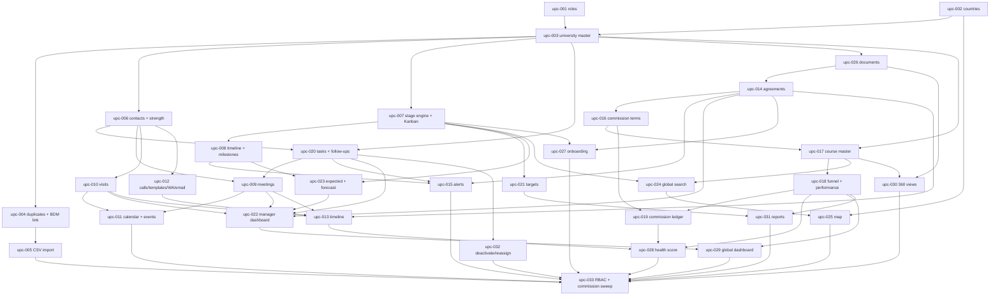

# University Partnership CRM — Engineering Enhancement Backlog (`upc-001` … `upc-033`)

NO-ASSUMPTION MODE. Prepared 2026-10-08 at the user's request. **No code was written or changed.**

- **Source:** `functionalities/edusphere_markdown/University Partnership CRM.md` = `EVID-020`. It is classed `DERIVED_BLUEPRINT`;
  `SOURCE_MANIFEST.csv` gives sha256 `adc4a8cf…`, and the file was re-hashed and matches.
  - I read it end to end: 1,131 lines, 32 numbered sections, a closing "key difference" note (1102–1127), and the user line at 1129:
    "Commissions should not be seen by anyone."
  - §1 below audits each section. Appendix A traces all 575 non-structural lines, and Appendix B defines every counted figure.
- **ID prefix:** `upc-`, chosen by the user (U0). `UNI-001` is the existing University Representative feature (API_CONTRACT §9,
  DATA_MODEL §6.10, RBAC_MATRIX §2.7). Using `uni-` would make citations such as `UNI-001-AC02` ambiguous.
- **Scope authority:** the user's in-session answers of 2026-10-08, U1–U15 in §3.1 (`EXPLICIT_APPROVAL`).
  - They lift `PRD_OPEN_ITEMS.md` item 69 and `CONFLICT_MATRIX.md` C-10 for `EVID-020`, as `DEC-SCOPE-073` T1 did for `EVID-019`.
  - They also answer C-10's two flags:
    - The "Partnership Manager" is a **new internal role, separate from `university_rep`** (U3).
    - The **university-pays-EduSphere commission** is confirmed (U4). It sits alongside, and does not replace, `DEC-SCOPE-005`
      (EduSphere pays the agent).
  - The answers are registered as one DEC-SCOPE when upc-001 starts. See §5.4 for numbering.
- **Method:**
  - graphify was refreshed on 2026-10-07 (31,045 nodes) and queried first.
  - Two read-only investigations covered the university/overseas domain and governance.
  - Each cited fact was checked against `origin/main@7e33f669`, whose code equals `main@70243aaf`.
  - Architecture context comes from `docs/architecture/ARCHITECTURE_BASELINE.md`. Reusable CRM patterns come from the BDM, Telecaller
    and Recruiter backlogs (`RECRUITER_CRM_BACKLOG.md`).
- **Gates:** every item is behind `APPROVAL_GATES.md` GATE-09. The §3.2 questions are asked **one at a time** when each item starts.
- **Authorization convention (user, 2026-09-28):** inline checks run in this order: `User.role`, then `services/partnership*.scope(user)`
  (403 for a role with no access, 404 when out of scope), then the write. The `require_*` dependencies are not used.
  - **Commission fields are removed server-side** from every response for roles other than `super_admin` and the partnership roles
    (U2). Hiding them in the UI is not enough.

---

## 0. What already exists (verified in code, not assumed)

| Capability | Where | State vs this source |
|---|---|---|
| Universities | `University` (`models.py:426`): `country_id` FK NOT NULL, `slug` unique, `name` (**not unique**), city, overview, eligibility, requirements/deadlines/scholarships JSON. 11 seeded (`seed.py:28-40`) | **Becomes the Global University Master (U5).** It has no type, ranking, contacts, owner, stage or publish flag |
| University admin | `POST /admin/universities` (`admin.py:748`, super_admin/overseas_admin, create only; duplicates are blocked only by the slug). `GET /admin/universities` (`:285`) is a list. `AdminUniversityCreatePanel.tsx` | **No edit, import or delete.** Added in upc-003/004/005 |
| Countries | `Country` (`models.py:406`): slug unique, name, overview, tuition/visa text. 12 seeded (`seed/countries.json`). **No region, no ISO code** | Extended in upc-002 (U12) |
| Courses | `OverseasCourse` (`models.py:441`): university FK, title, level, category, duration, `tuition_fee` **free text**, intake. 5 seeded. **No API to create courses** | **Extended into the §16 course master (U6)** |
| Scholarships | `Scholarship` (`models.py:614`): country/university FK, amount text, deadline, active. OVS-006 is listing only | Linked from courses (upc-017) |
| Public catalogue | `/public/countries`, `/universities`, `/overseas-courses`, `/scholarships`, `/search` (`public.py:119-170`). OVS-001 COMPLETE | Kept; it now filters by `catalogue_visible` (U5) |
| Applications | `OverseasApplication.university_id` **FK NOT NULL** (`models.py:463`), `course_id` FK. Stages enquiry → … → enrolled + withdrawn (`services/agent_applications.py:27`). Offer fields, `VisaCase`, `ApplicationDeposit` (AGN-011), `ApplicationStatusHistory` | **The per-university funnel source (U8).** Read-only here |
| Funnel gaps | `Enquiry`/`LeadQualification` (preferred course free text), `Appointment`, and `AgentStudentCounseling` (free-text country) have **no university link** | Leads, Counselling and Eligible are "not tracked" (U8) |
| Shortlist | `AgentStudentShortlistEntry` (`models.py:2337`): university FK or private agency university | "Interested" = shortlisted (U8) |
| University Rep (`UNI-001`) | Role `university_rep`, scoped by `User.profile["university_id"]` (server-owned key, `auth.py:185-192`). Portal `/overseas/university/*` (`services/portal.py:1000-1172`). **No UI sets the university** | Unchanged. It gets a own-university slice of the 360 view (U14) |
| Commissions | `AgentCommission` (`models.py:2251`) = EduSphere → agent (`DEC-SCOPE-005/051/054`), triggered at enrolled (`workflows.py:1756`). **No university → EduSphere model; no finance/accountant role** (`app/finance/` is an empty package) | New terms + expected + manual received (U4) |
| BDM organisations | `BDM_ORG_TYPES` includes `"university"` (profile group college, `models.py:1569-1579`), with free-text country and **no FK to `universities`** | Linked, plus a shared duplicate check (U13) |
| BDM MoU | `BdmMou` + events; renewal reminder 30 days before (`services/bdm_reminders.py:4`); statuses prospect…active/rejected, expired derived | Cloned pattern for agreements (upc-014). The 90/60/30/7 alerts are new (upc-015) |
| BDM trips/calendar | `BdmTrip` (approval draft/submitted/approved/rejected by the reporting manager; `accommodation_required`; no org link). `GET /bdm/calendar` (31-day union) | Pattern only. A new `university_visits` (U9) and calendar (upc-011) |
| Telecaller engines | follow-ups, calls, wa.me/SMTP messages, template library, timeline UNION, alert beat (`telecaller_alerts`, `notifications.dedupe_key`), CSV import batch | Patterns (U10, U11, U15) |
| Geo/charts | No region/ISO/lat-lng fields. `apps/web/package.json` = next/react/react-dom only. Charts are hand-made (`SchoolReportCharts.tsx`) | Inline SVG map, no dependency (U12) |
| Management doc | `Management Functionalities.md` §19 university dashboard (8-step pipeline, 12 KPIs incl. Exclusive, Countries, Revenue), §3 "University Partners", §4 "University commission / University-wise revenue" | Fed by this module. The stage mapping is in Appendix B (U7) |
| Numbering | Alembic head `0099`. Last decision `DEC-SCOPE-115` (`DEC-SCOPE-116` is reserved provisionally by the Recruiter backlog). API `§12AH` (§12AI reserved by Recruiter). RBAC `§2.41` (§2.42 reserved) | See §5.4 |

---

## 1. Source coverage audit (section by section)

| Source § (lines) | Content | Covered by | Notes |
|---|---|---|---|
| Title (1) | University & Institution Partnership CRM | all | U1 |
| §1 Global University Master (3–33) | Central DB, unique ID, 19 field rows | upc-002, upc-003, upc-006 | Contact rows → upc-006 |
| §2 Global map (35–90) | Per-country status counts, click → list, 12 filters | upc-025 | U12; Appendix B G1–G4 |
| §3 Partnership status (92–154) | 14 statuses | upc-007 | U7 |
| §4 Pipeline (156–174) | Kanban, 9 columns | upc-007 | Grouping in Appendix B K1–K9 |
| §5 Expected timeline (176–210) | 6 target dates; milestone table | upc-008 | — |
| §6 Milestone tracker (212–242) | 13 milestones; auto-highlight delays | upc-008, upc-015 | Q-11 |
| §7 Meetings (244–312) | 19 fields; 12 types | upc-009 | — |
| §8 Visits (314–350) | 14 fields; 6 statuses | upc-010 | U9 |
| §9 Calendar (352–365) | 8 event kinds; overlap prevention | upc-011 | U9 |
| §10 Contacts (367–411) | 7 example roles; 11 fields | upc-006 | — |
| §11 Relationship strength (413–435) | 7 values, university and contact | upc-006 | Q-15 |
| §12 Communication history (437–451) | Every email/call/WhatsApp/meeting on the university | upc-012, upc-013 | U10 |
| §13 MoU / agreements (453–497) | 17 fields; 9 statuses | upc-014 | BDM MoU pattern |
| §14 Expiry alerts (499–513) | 90/60/30/7 days | upc-015 | U11 |
| §15 Commercial / commission (515–543) | 9 terms; Finance link | upc-016, upc-019 | U2, U4 |
| §16 Course master (545–579) | 14 fields | upc-017 | U6 |
| §17 Student opportunity (581–619) | 7-step funnel | upc-018 | U8 |
| §18 Performance dashboard (621–637) | 9 metrics | upc-018, upc-019 | U8, U4 |
| §19 Tasks (639–671) | 12 auto-task examples; 5 task fields | upc-020 | U11 |
| §20 Follow-ups (673–693) | Next action + date; 4 urgency bands | upc-020, upc-022 | — |
| §21 Targets (695–719) | 7 monthly KPIs; target vs actual | upc-021 | — |
| §22 Manager dashboard (721–752) | 4 overview + 9 this-month figures | upc-022 | Appendix B D1–D13 |
| §23 Expected partnerships (754–780) | 6-column list; this month/next/quarter | upc-023 | — |
| §24 Probability (782–808) | 7 bands; weighted forecast | upc-023 | Q-09 |
| §25 Global search (810–866) | 6 search fields; 15 filters; 3 examples | upc-024 | Commission filter per U2 |
| §26 Duplicate prevention (868–894) | Search first; 5-point panel | upc-004 | U13 |
| §27 Ownership (896–906) | Primary + backup manager; management visibility | upc-003, upc-032 | Q-04, Q-05 |
| §28 Document centre (908–936) | 12 document kinds | upc-026 | — |
| §29 Onboarding (938–968) | 10 checklist items; 3 statuses | upc-027 | — |
| §30 Health score (970–1002) | 9 factors; bands | upc-028 | Satisfaction not tracked (Q-24) |
| §31 Global dashboard (1004–1058) | 3 columns + pipeline + funnel | upc-029 | — |
| §32 Main menu (1060–1100) | 19 menu entries | upc-001 (nav) + each item | Reports → upc-031 |
| Key difference (1102–1127) | One university record for all roles, each sees only what is relevant | upc-030 | U14 |
| 1129 | "Commissions should not be seen by anyone." | upc-016, upc-033 | U2 |
| "Top/Bottom of Form" (1129, 1131) | Copy-paste artefacts | — | Not requirements |

**Not in the source, so not added:**
- Travel or hotel booking integration, and expense claims (U9).
- Rankings APIs and external university datasets (U15).
- Student satisfaction surveys (Q-24).
- A Finance/Accountant CRM and an Application Executive role (U14).
- University-side self-service. `university_rep` is unchanged apart from the U14 slice.

**Added though not in the source** (your conventions):
- upc-001: full account lifecycle.
- upc-032: deactivation and reassignment (tel-025 precedent).
- upc-033: permission sweep, including commission stripping (tel-026 precedent).

---

## 2. Backlog summary

| ID | Title | Cx | Risk | Migration | Depends on |
|---|---|---|---|---|---|
| upc-001 | `partnership_manager` + `partnership_head` roles: profile, provisioning, sign-in, shell, §32 menu | M | High | Yes | — |
| upc-002 | Country master: ISO code, region, full country list | S | Medium | Yes | — |
| upc-003 | Global University Master (`universities` extension, code, ownership, publish flag, edit) | L | High | Yes | 001, 002 |
| upc-004 | Duplicate prevention + BDM university-org link | M | Medium | Yes | 003 |
| upc-005 | University CSV import | M | Medium | Yes | 003, 004 |
| upc-006 | University contacts + relationship strength | M | Medium | Yes | 003 |
| upc-007 | Partnership stage engine + history + Kanban | M | High | Yes | 003 |
| upc-008 | Expected timeline + milestone tracker | M | Medium | Yes | 007 |
| upc-009 | Meetings | M | Medium | Yes | 006, 020 |
| upc-010 | University visits + approval | M | Medium | Yes | 006, 001 |
| upc-011 | Travel & visit calendar + partnership events | M | Low | Yes | 009, 010 |
| upc-012 | Calls + message templates + WhatsApp + email | M | Medium | Yes | 006 |
| upc-013 | University timeline (communication history) | M | Low | No | 007, 009, 010, 012, 014 |
| upc-014 | MoU / agreement management | L | High | Yes | 003, 026 |
| upc-015 | Alerts engine (expiry 90/60/30/7, delayed milestones, overdue) | M | Medium | Yes | 008, 014, 020 |
| upc-016 | Commercial / commission terms (restricted) | M | High | Yes | 014 |
| upc-017 | Course / program master (`overseas_courses` extension + CSV) | L | High | Yes | 003, 016 |
| upc-018 | Student opportunity funnel + university performance | M | Medium | No | 003, 017 |
| upc-019 | Commission expected + received ledger (restricted) | M | High | Yes | 016, 018 |
| upc-020 | Tasks + follow-ups (auto-generated) | M | Medium | Yes | 003, 006 |
| upc-021 | Monthly targets vs actual | M | Medium | Yes | 001, 007 |
| upc-022 | Partnership manager dashboard | M | Medium | No | 007, 009, 010, 014, 020, 023 |
| upc-023 | Expected partnerships + probability + weighted forecast | M | Medium | Maybe | 007, 008 |
| upc-024 | Global university search | L | Medium | Maybe (indexes) | 003, 007, 017 |
| upc-025 | Global partnership map | M | Medium | No | 002, 007, 024 |
| upc-026 | University document centre | M | Medium | Yes | 003 |
| upc-027 | Partner onboarding checklist | S | Low | Yes | 007, 014 |
| upc-028 | Partnership health score | M | Medium | No | 018, 019, 009, 014, 013 |
| upc-029 | Complete global partnership dashboard (management) | M | Low | No | 022, 023, 018 |
| upc-030 | University 360 view for other roles | M | High | No | 003, 006, 017, 026, 016 |
| upc-031 | Reports + CSV export | M | Medium | No | 018, 021, 023 |
| upc-032 | Manager deactivation + bulk reassignment | M | High | No | 003, 020 |
| upc-033 | Permission matrix + commission-stripping sweep | M | High | No | all of 001–032 |

---

## 3. Decisions and questions

### 3.1 Answered in-session 2026-10-08 (`EXPLICIT_APPROVAL`; to be registered as one DEC-SCOPE at upc-001)

| # | Question | Answer | Items |
|---|---|---|---|
| U0 | ID prefix (UNI-001 is taken) | **`upc-NNN`** | all |
| U1 | Is `EVID-020` in scope? | **Yes, all sections** (32 + the closing note). Every item stays behind GATE-09 with its own questions. This lifts PRD item 69 and C-10 for EVID-020 | all |
| U2 | Line 1129, commission visibility | **Only `super_admin` and the partnership roles** (`partnership_manager`, `partnership_head`) see commission data: terms, per-course commission, expected and received, and the commission search filter. **Fields are stripped server-side** for every other role (counselor, overseas_admin, agent, university_rep, BDM, student, public). **Amended 2026-10-08 by Management M3 (`MANAGEMENT_COMMAND_CENTER_BACKLOG.md`): the new `partner` role also sees commission data** (terms, expected, received, university-wise revenue); the `accountant` role does not | 016, 017, 018, 019, 024, 030, 033 |
| U3 | Roles | **New `partnership_manager`** (division overseas; owns universities as primary or backup) **+ `partnership_head`** (division global, `/admin/login`, sets targets, sees direct reports, reassigns). `overseas_admin` keeps read access (no commission). `super_admin` sees all | 001, 021, 032 |
| U4 | University commission | **Yes, universities pay EduSphere.** The CRM records terms (§15) and per-course commission (§16), and computes **Commission Expected** from enrolled students × terms. **Commission Received** is recorded manually until a Finance module is decided. This sits alongside `DEC-SCOPE-005` | 016, 017, 018, 019 |
| U5 | Master vs catalogue | **Extend `universities`** into the single source of truth, with a **`catalogue_visible`** flag so only chosen universities appear publicly. Target and prospect rows stay internal. Application, shortlist and university_rep FKs are unchanged | 003, 024, 025 |
| U6 | Course master | **Extend `overseas_courses`** with the §16 fields. Partnership managers and overseas_admin maintain courses (CRUD + CSV import). The catalogue, applications and shortlists keep the same rows | 017 |
| U7 | Stage model | **The 14 §3 statuses (+ Lost/Closed) are the one stored stage.** The §4 Kanban, §24 probability bands, §2 map colours and Management §19 pipeline are fixed groupings (Appendix B). §6 milestones are a separate per-university list | 007, 008, 022, 023, 025 |
| U8 | Funnel | **Computed from existing FKs only.** Interested = shortlisted (`AgentStudentShortlistEntry`). Applications, Offers, Deposits, Visa and Enrolled come from `OverseasApplication` and its children. **Leads, Counselling and Eligible are shown as "not tracked"**. The telecaller and counselling modules are not changed | 018, 028 |
| U9 | Visits and calendar | **New `university_visits`** with §8 fields and statuses. **`partnership_head` approves** (`super_admin` when the head is inactive). Travel and hotel are requirement flags + booking notes (no booking integration, no expenses). The calendar is a read-only union with an overlap warning per employee | 010, 011 |
| U10 | Communications | **Telecaller pattern.** Calls are a manual log + `tel:`. WhatsApp is wa.me, logged on confirm. Email goes over SMTP via the outbox with reply-to set to the manager. Templates are maintained by `partnership_head`. Everything appears on the university timeline | 012, 013 |
| U11 | Alerts and tasks | **In-app + email**, raised by a **beat job** (daily, IST), each once (dedupe key), to the primary manager (+ backup/head per kind). Event-driven tasks are created on the triggering write (tel-020 pattern) | 015, 020 |
| U12 | Map | **Inline SVG world map** (public-domain shapes keyed by ISO code, no new npm dependency), shaded by partner status, counts on hover or focus, and a click opens the country list. An accessible table view sits alongside. Countries get ISO-2 + region, and the full ISO list is seeded | 002, 025 |
| U13 | BDM overlap | BDM `university` orgs gain an **optional FK to the master**. **One duplicate check across both** shows the §26 panel. Partnership managers own partnerships. BDMs keep their org record and see the master record read-only (no commission) | 004, 030 |
| U14 | 360 view | **Existing roles, sliced:**  • Counselor + overseas_admin: profile, application/recruitment contacts, courses & entry requirements, shareable documents, partnership status, their students' applications.  • BDM: profile + stage + manager.  • `university_rep`: own university's profile and courses only.  • Agents: unchanged.  No commission for any of them. Application Executive and Accountant views wait until those roles exist | 030 |
| U15 | Data load | **Manual create and edit + CSV import** (per-row report, duplicate check on name + country, idempotent) by `partnership_head` / `overseas_admin`. Manually curated, consistent with `DEC-DATA-002`. No external university or ranking API | 003, 005, 017 |

### 3.2 Item-level questions (asked one at a time when the item starts; `NEEDS_CONFIRMATION` until then)

| # | Question | Item |
|---|---|---|
| Q-01 | University code format. The proposal is `UNV-000001` (the ORG sequence idiom), backfilled for the 11 existing rows | 003 |
| Q-02 | Duplicate key: normalised name + country (+ city?). Do aliases count (e.g. "UCL" = "University College London")? | 004, 005 |
| Q-03 | Ranking fields: which systems (QS, THE, other free-text), year, rank or band | 003 |
| Q-04 | Unowned (target) universities: may any manager claim one, or does only the head assign? | 003, 032 |
| Q-05 | Backup manager: same edit rights as the primary, or read + act only when the primary is inactive? | 003 |
| Q-06 | Region values. The source says "Asia, Europe, UK, North America, Middle East, Australia etc.", with UK separate from Europe. What is the complete list? **Answered 2026-10-08 (upc-002):** nine regions, UK, Europe, North America, Latin America & Caribbean, Middle East, Asia, Oceania, Africa and Antarctica (assignments in the upc-002 design spec §1 C1) | 002 |
| Q-07 | Map and search filter "Exclusive/Non-exclusive": derived from the current agreement's exclusivity? | 014, 024, 025 |
| Q-08 | Partner-status grouping (Appendix B G1–G4): which stages count as Partner, In Progress, Target and Lost? Is "At Risk" the relationship strength? | 007, 022, 025 |
| Q-09 | Probability for the §3 stages that §24 does not list (Researching, Contact Identified, Documents Shared…), and whether a manual override is allowed | 023 |
| Q-10 | Expected month and quarter: derived from the target partnership date, or set separately? | 008 |
| Q-11 | When is a milestone delayed (target date passed, not achieved, with grace days?) | 008, 015 |
| Q-12 | Does a meeting's "Next meeting date" create a draft meeting or a follow-up? | 009 |
| Q-13 | Visit approval when the head travels; can approval be cancelled after booking? | 010 |
| Q-14 | Conferences, education fairs and webinars without a university: a new `partnership_events` record? What counts as an overlap? | 011 |
| Q-15 | Relationship strength is set by hand. Should "Dormant" or "At Risk" be suggested automatically after N days with no interaction? | 006 |
| Q-16 | MoU number format; one active agreement per type or per university; is "Expiring" derived (≤ 90 days) or stored; is "Renewed" a new row? | 014 |
| Q-17 | Alert recipients per kind (primary, backup, head) and the send hour | 015 |
| Q-18 | Commission precedence (per-course vs per-agreement), and currency handling with no FX conversion (expected shown per currency?) | 016, 019 |
| Q-19 | Commission trigger values (enrolment; visa + enrolment; tuition paid). Does expected count only once the trigger is met? | 016, 019 |
| Q-20 | Commission received: who records it (head? `super_admin`?), and is it per student or a lump sum per university/intake? | 019 |
| Q-21 | Course CSV columns. How are legacy free-text tuition fees parsed into amount + currency? | 017 |
| Q-22 | Auto-task rules: which stage or event creates which of the 12 §19 example tasks, and with what due offset? | 020 |
| Q-23 | Targets: the 7 §21 KPIs per manager per month; set by the head; history kept | 021 |
| Q-24 | Health score weights, bands (e.g. Excellent ≥ 80, Needs Attention < 50), the "response time" definition. Student satisfaction is not tracked: exclude it or leave a placeholder? | 028 |
| Q-25 | Which reports (the §32 menu names "Reports" only), with CSV masking rules | 031 |
| Q-26 | The "shareable with counselors" default per document kind; file types and size | 026, 030 |
| Q-27 | Does onboarding start automatically at Agreement Signed, and does completing it move the stage to Partner Activated? | 027 |
| Q-28 | `catalogue_visible` default: existing 11 = true, new = false? Who may publish (head, overseas_admin)? | 003 |
| Q-29 | Workspace paths: `/partnership/*` for managers (sign in at `/overseas/login`), and the head under `/admin/partnerships/*`? | 001 |
| Q-30 | Deactivation: is the backup promoted to primary automatically, or does the head reassign? | 032 |
| Q-31 | Management §19 KPIs "Exclusive", "Countries" and "Revenue": definitions consistent with Appendix B? | 022, 029 |
| Q-32 | Map colour when one country mixes statuses (green if ≥ 1 partner?) | 025 |
| Q-33 | Does `overseas_admin` keep editing universities and courses (it may today), or become read-only for partnership fields? | 003, 017 |

---

## 4. Backlog items

Common conventions:
- Scope comes from `services/partnership*.scope(user)`:
  - Manager: reads every university; edits those where they are primary or backup.
  - Head: their direct reports' universities + unowned ones.
  - `super_admin`: all.
- One commit per write. `AuditLog` (ids and field names only) goes in the same transaction. Structured logs after the commit.
- Lists use `LIMIT/OFFSET` and return `{items,total,limit,offset}`.
- IST dates.
- Commission removal goes through one serializer helper, `partnership_access.strip_commission(user, payload)`.
- API contract addenda and RBAC sections continue from §5.4.

### upc-001 — Partnership roles: profile, provisioning, sign-in, shell, menu
- **Status (2026-10-08):** built on `feature/upc-001` under `DEC-SCOPE-118`, with migration `0103_partnership_profiles`, API §12AL and
  RBAC §2.44. Spec: `docs/superpowers/specs/2026-10-08-upc-001-partnership-roles-design.md`.
  - The U0–U15 answers are registered in `DEC-SCOPE-116`.
  - The PU1–PU11 answers are recommended defaults (`NEEDS_CONFIRMATION`). They include Q-29 (PU1) and "overseas_admin creates managers"
    (PU7).
  - The `active` column is not added: `users.active` only (PU2).
  - `strip_commission` and the university `scope(user)` move to upc-016 and upc-003.
- **Business requirement:** "Partnership Manager" (§4, §7, §19, §27); "Management" (§21, §22, §31); §32 main menu (U3). Under your
  user-lifecycle convention, user creation means the full lifecycle.
- **Existing behavior:** no partnership roles. Overseas roles are student, counselor, university_rep, agent, overseas_admin, bdm and
  telecaller (`admin.py:548`). Global roles are super_admin, bdm_manager and telecaller_manager.
- **Expected behavior:**
  - `partnership_profiles` (user_id PK, employee_id unique, reporting head FK → `partnership_head`, active).
  - Roles `partnership_manager` (division overseas) and `partnership_head` (global, `super_admin`-created).
  - Set-password welcome email. The existing forgot and change-password flows.
  - Shell with the §32 menu: 19 entries, each enabled as its item lands.
  - Manager team list for the head.
- **User roles affected:** new roles; super_admin; overseas_admin (creates managers in their division?).
- **Frontend impact:** admin "Partnership managers" page (the `AdminTelecaller*` pattern); `ROLES_BY_DIVISION.global`; `lib/navigation.ts`
  `PARTNERSHIP_NAV`/`PARTNERSHIP_HEAD_NAV`; `middleware.ts` (path per Q-29); landing map.
- **Backend impact:**
  - `rbac.PERMISSIONS` (`partnership_manager: {"partnership:self"}`, `partnership_head: {"partnership:team"}`).
  - `api/partnership.py` + `services/partnership.py` (`context`, `scope`, `require_head`).
  - `services/partnership_access.py` (commission strip).
  - `admin.create_user`/`update_user` nested profile.
- **Database impact:** `partnership_profiles`.
- **API impact:** `GET /partnership/me`, `PATCH /partnership/profile`, `GET /partnership/head/team`, `GET /admin/partnership-managers`,
  `GET /admin/partnership-heads`.
- **Integration impact:** SMTP welcome (existing).
- **Authentication impact:** head signs in at `/admin/login`; manager at the overseas login (Q-29).
- **Authorization impact:** new roles; only `super_admin` creates a head.
- **Security impact:** commission visibility hinges on these roles (U2); privilege boundary on role assignment.
- **Performance impact:** negligible.
- **Reusable existing modules:** tel-001/bdm-001 (`services/telecaller.py`, `AdminTelecaller*`), `provisioning.py`, `PortalShell`.
- **Dependencies:** none. It shares `rbac.py`, `admin.create_user`, `middleware.ts` and `navigation.ts` with **rec-001**, so the two
  never run in parallel; merge one, then rebase the other.
- **Acceptance criteria:**
  1. `super_admin` creates a head and a manager, and both set passwords.
  2. An `overseas_admin` creating a head → 403.
  3. The manager lands on the partnership dashboard.
  4. The head sees direct reports only.
  5. Existing roles are unaffected.
- **Positive scenarios:** create manager Rahul under head H.
- **Negative scenarios:** head FK not a head → 422; duplicate employee id → 409; a manager calls a head route → 403.
- **Edge cases:** an inactive head cannot be chosen.
- **Regression risks:** admin user-create for every role; login landing; middleware for existing portals.
- **Complexity:** medium · **Risk:** high

### upc-002 — Country master: ISO code, region, full list
- **Business requirement:** §1 Location/Region; §2 country map and region filter; §25 country/region filters (U12).
- **Existing behavior:** 12 countries (slug, name, catalogue text). No ISO code or region.
- **Expected behavior:**
  - `countries` gains `iso2` (unique) and `region` (values per Q-06).
  - All ISO 3166-1 countries are seeded as **internal** rows (no catalogue text, `catalogue_visible=false`). The existing 12 keep their
    content and become visible.
  - The public `/countries` endpoints list only visible rows.
- **User roles affected:** public (no visible change), partnership roles, overseas_admin.
- **Frontend impact:** country pickers become searchable (`SearchableSelect`).
- **Backend impact:** `public.py` country queries filter on visibility.
- **Database impact:** columns + seed (~249 rows) + backfill of ISO for the 12.
- **API impact:** `GET /lookups/countries?q`.
- **Integration impact:** none.
- **Authentication impact:** none.
- **Authorization impact:** none new.
- **Security impact:** low.
- **Performance impact:** negligible.
- **Reusable existing modules:** `seed/countries.json`, `lookups._pattern`.
- **Dependencies:** none.
- **Acceptance criteria:**
  1. The public catalogue still shows exactly the 12 countries with unchanged content.
  2. Every country has a unique ISO-2 code and a region.
- **Positive scenarios:** Japan is selectable for a target university.
- **Negative scenarios:** a duplicate ISO code → migration fails loudly.
- **Edge cases:** "Dubai (UAE)" slug → ISO AE; "UK" as its own region.
- **Regression risks:** OVS-001 and PUB-003 catalogue tests; `seed.py`.
- **Complexity:** small · **Risk:** medium

### upc-003 — Global University Master
- **Status (2026-10-08):** built on `feature/upc-003` under `DEC-SCOPE-120`, with migration `0105_university_master`, API §12AN and
  RBAC §2.46. Spec: `docs/superpowers/specs/2026-10-08-upc-003-university-master-design.md`.
  - Q-01, Q-03, Q-04, Q-05, Q-28 and Q-33 are answered by the recommended defaults UM1–UM7 (`NEEDS_CONFIRMATION`): code `UNV-000001`;
    rankings QS/THE/ARWU/Other + year + rank text; only the head assigns; the backup edits like the primary; existing rows stay public and
    new ones start internal; `overseas_admin` keeps create/edit/publish but does not assign.
  - `stage` is left to upc-007 (UM11); the contact rows stay with upc-006.
- **Business requirement:** §1 (central DB, unique ID, 19 field rows); §27 ownership; closing note "central source of truth" (U5).
- **Existing behavior:**
  - `universities` holds catalogue fields only.
  - `POST /admin/universities` is create-only. There is no edit.
  - Every row is public.
- **Expected behavior:**
  - `universities` gains:
    - `university_code` (Q-01), institution type (University/College/Institute/Language School/Training Institution), public/private
    - state/region text, website, rankings (`university_rankings` rows: system, year, rank, per Q-03)
    - course levels offered (UG/PG/PhD/Diploma/Foundation), popular program areas
    - international office contact text, existing relationship (new/existing)
    - `primary_manager_user_id`, `backup_manager_user_id`, priority A/B/C, partnership potential High/Medium/Low
    - `active`, `catalogue_visible` (Q-28), `stage` (owned by upc-007)
  - A full edit UI. A list with filters, and a detail page with tabs that later items fill in.
  - The country FK is still required.
- **User roles affected:** partnership roles (write per scope), overseas_admin (Q-33), super_admin; public (visibility only).
- **Frontend impact:** University list and detail; create/edit form; existing `AdminUniversityCreatePanel` replaced or redirected.
- **Backend impact:** `api/partnership_universities.py`, `services/partnership_universities.py`. `public.py` university queries filter
  `catalogue_visible`.
- **Database impact:** columns + CHECKs + indexes, `university_rankings`, `university_code_seq` + backfill, `university_assignment_history`.
- **API impact:** `GET/POST /partnership/universities`, `GET/PATCH /partnership/universities/{id}`, `POST …/assign|publish|unpublish|deactivate`.
- **Integration impact:** none.
- **Authentication impact:** none.
- **Authorization impact:**
  - A manager may read all; edit requires being primary or backup (§27).
  - The head reassigns.
  - Publish rights per Q-28.
- **Security impact:** unpublished rows must never leak to `/public/*` (test).
- **Performance impact:** indexed filters (country, stage, manager, priority); paginated.
- **Reusable existing modules:** bdm-002 org service (code seq, assign, history), `SearchableSelect`.
- **Dependencies:** upc-001, upc-002.
- **Acceptance criteria:**
  1. All §1 fields (minus the contact rows, see upc-006) are captured and editable.
  2. The 11 existing universities keep their slugs and stay public.
  3. A new target is not public.
  4. A non-owner manager PATCH → 403/404 per Q-05.
  5. Applications and university_rep keep working.
- **Positive scenarios:** add "ABC University, UK, Priority A, potential High, primary Rahul".
- **Negative scenarios:** an invalid type → 422; publishing without catalogue content → 422 (rule at design).
- **Edge cases:** a university with existing applications cannot be deactivated without a warning; a manager assigned as both primary and
  backup → 422.
- **Regression risks:** OVS-001, PUB-003, UNI-001, agent shortlist, application create (`workflows.py:1785`, `agent_applications.py:118`).
- **Complexity:** large · **Risk:** high

### upc-004 — Duplicate prevention + BDM university-org link
- **Status (2026-10-08):** built on `feature/upc-004` under `DEC-SCOPE-124`, with migration `0109_university_duplicates`, API §12AR and
  RBAC §2.50. Spec: `docs/superpowers/specs/2026-10-08-upc-004-university-duplicates-design.md`.
  - Q-02 is answered by the recommended defaults UD1–UD12 (`NEEDS_CONFIRMATION`): normalised name + country, no aliases; override by the
    head / `super_admin` with an audited reason; stage, last contact and next follow-up show "—" until upc-007/006/020.
  - Follow-up: a link control in the BDM edit form (the API already links and unlinks).
- **Business requirement:** §26 search before adding, the warning panel (5 fields), "prevents two employees contacting the same
  university" (U13).
- **Existing behavior:** duplicate detection is by slug only. BDM `university` orgs are separate (`name_key`/`city_key` check within BDM).
- **Expected behavior:**
  - `universities.name_key` (normalised) + country forms the duplicate key (Q-02).
  - Before create, the search shows "already exists" with the existing relationship, assigned manager, current stage, last contact and
    next follow-up.
  - Create is blocked on an exact duplicate (the head may override with a reason?).
  - `bdm_organizations.university_id` (nullable FK). Creating a BDM `university` org runs the same check and offers the link.
  - The master shows its linked BDM orgs.
- **User roles affected:** partnership roles, BDMs.
- **Frontend impact:** pre-create search panel (university and BDM forms).
- **Backend impact:**
  - `services/partnership_universities.find_duplicates`.
  - `services/bdm_organizations` create calls it for org_type university.
- **Database impact:** `name_key` + index; `bdm_organizations.university_id` FK.
- **API impact:** `GET /partnership/universities/duplicates?name&country`; BDM create response includes matches.
- **Integration impact:** none.
- **Authentication impact:** none.
- **Authorization impact:** BDM sees only the panel fields (no commission).
- **Security impact:** low.
- **Performance impact:** indexed lookup.
- **Reusable existing modules:** tel-005 duplicate panel, bdm-002 `name_key`.
- **Dependencies:** upc-003 (+ upc-006, upc-020 for "last contact" and "next follow-up": shown as "—" until they land).
- **Acceptance criteria:**
  1. Adding "abc university" when "ABC University" exists in the same country shows the panel and blocks.
  2. The BDM create flow shows the same panel.
- **Positive scenarios:** same name, different country → allowed.
- **Negative scenarios:** forced duplicate without the override right → 409.
- **Edge cases:** existing duplicate rows in BDM (migration report only, no auto-merge).
- **Regression risks:** bdm-002 org creation tests.
- **Complexity:** medium · **Risk:** medium

### upc-005 — University CSV import
- **Status (2026-10-08):** built on `feature/upc-005` under `DEC-SCOPE-125`, with migration `0110_university_imports`, API §12AS and
  RBAC §2.51. Spec: `docs/superpowers/specs/2026-10-08-upc-005-university-import-design.md`.
  - The design-level rules are answered by the recommended defaults IM1–IM12 (`NEEDS_CONFIRMATION`): city is required (the master
    requires it); ISO-2 or name countries; imports never override a duplicate; 5,000-row cap.
  - "Stage Target" for imported rows lands with upc-007's stage default (no stage column yet).
- **Business requirement:** §25 "all universities globally"; §22 "Total Universities: 1,250" (U15).
- **Existing behavior:** none.
- **Expected behavior:**
  - CSV upload (columns per design; required: name, country ISO/name, type).
  - Each row is validated, duplicate-checked (upc-004) and either created or reported (created / duplicate / invalid with reason).
  - Idempotent by file hash + idempotency key. Imported rows: unowned, stage Target, not public.
- **User roles affected:** `partnership_head`, `overseas_admin`, `super_admin`.
- **Frontend impact:** import page with a per-row report download.
- **Backend impact:** `services/university_import.py`.
- **Database impact:** `university_import_batches`.
- **API impact:** `POST /partnership/universities/import`, `GET …/imports/{id}`.
- **Integration impact:** none.
- **Authentication impact:** none.
- **Authorization impact:** head, overseas_admin and super_admin only.
- **Security impact:** CSV injection on report export (`school_bulk._safe_cell`); size and row caps.
- **Performance impact:** batch inserts; row cap (e.g. 5,000) at design.
- **Reusable existing modules:** tel-006 (`telecaller_import.py`, `LeadImportBatch`), `school_bulk._safe_cell`.
- **Dependencies:** upc-003, upc-004.
- **Acceptance criteria:**
  1. A 1,000-row file imports with an accurate per-row report.
  2. Re-uploading the same file creates nothing new.
- **Positive scenarios:** 980 created, 15 duplicates, 5 invalid.
- **Negative scenarios:** wrong headers → 422 for the whole file.
- **Edge cases:** an unknown country name → invalid row; BOM/encoding.
- **Regression risks:** none.
- **Complexity:** medium · **Risk:** medium

### upc-006 — University contacts + relationship strength
- **Status (2026-10-08):** built on `feature/upc-006` under `DEC-SCOPE-123`, with migration `0108_university_contacts`, API §12AQ and
  RBAC §2.49. Spec: `docs/superpowers/specs/2026-10-08-upc-006-university-contacts-design.md`.
  - Q-15 and the design-level rules are answered by the recommended defaults CT1–CT14 (`NEEDS_CONFIRMATION`): strength set by hand; a
    seeded read-only role catalogue; overseas_admin reads the shareable slice without notes; first contact primary; delete added (PII).
  - Last interaction and next follow-up are deferred to upc-009/012/013 and upc-020; the counselor slice (AC3) lands with upc-030.
- **Business requirement:**
  - §10: many contacts, 7 example roles, 11 fields.
  - §1 contact rows: International Office, International Director, Partnership Contact, Recruitment Contact, Application Contact,
    Country Manager.
  - §11: relationship status (7 values) per university and per contact.
- **Existing behavior:** none.
- **Expected behavior:**
  - `university_contacts`: name, designation, department, role (catalogue seeded with the §10 and §1 roles), email, phone, WhatsApp,
    LinkedIn, preferred communication, relationship strength, notes, primary flag, `shareable` (visible to counselors, U14).
  - Last interaction is computed. Next follow-up comes from upc-020.
  - `universities.relationship_strength`, set by hand (Q-15).
- **User roles affected:** partnership roles (write per scope); counselor/overseas_admin (read shareable, U14).
- **Frontend impact:** Contacts tab; relationship badge.
- **Backend impact:** `services/university_contacts.py`.
- **Database impact:** `university_contacts`, `university_contact_roles`, `universities.relationship_strength`.
- **API impact:** `GET/POST /partnership/universities/{id}/contacts`, `PATCH /partnership/contacts/{id}`.
- **Integration impact:** none.
- **Authentication impact:** none.
- **Authorization impact:** university scope; shareable slice for other roles.
- **Security impact:** contact PII.
- **Performance impact:** low.
- **Reusable existing modules:** `BdmOrganizationContact`, `BdmOrganizationContacts.tsx`, rec-004.
- **Dependencies:** upc-003.
- **Acceptance criteria:**
  1. 7+ contacts per university, one primary.
  2. Relationship values match §11 exactly.
  3. A counselor sees only contacts marked shareable (once upc-030 lands).
- **Positive scenarios:** add "Regional Manager – India".
- **Negative scenarios:** invalid email → 422.
- **Edge cases:** one person serving two universities (two rows).
- **Regression risks:** none.
- **Complexity:** medium · **Risk:** medium

### upc-007 — Partnership stage engine + history + Kanban
- **Business requirement:** §3 (14 statuses), §4 Kanban (9 columns), §2 status colours (U7).
- **Existing behavior:** none.
- **Expected behavior:**
  - `partnership_stages.py` catalogue holds the 14 stages + Lost/Closed (flag + reason) and the grouping maps (Appendix B K, G, P).
  - `universities.stage`, `stage_changed_at`. `university_stage_history` (append-only).
  - Manual moves are allowed forward and back, with a reason when going back.
  - Kanban board by §4 column, scoped.
- **User roles affected:** partnership roles.
- **Frontend impact:** stage control; Kanban board (the `BdmPipelineBoard` pattern, filters in the URL).
- **Backend impact:** `services/partnership_pipeline.py` (single writer).
- **Database impact:** `universities.stage` CHECK + backfill (`target`; the existing 11 → per Q-08?); `university_stage_history`.
- **API impact:** `POST /partnership/universities/{id}/stage|lost|reopen`, `GET …/stage-history`, `GET /partnership/pipeline`.
- **Integration impact:** none.
- **Authentication impact:** none.
- **Authorization impact:** owner or head; reopen by the head.
- **Security impact:** low.
- **Performance impact:** board counts by group in one query.
- **Reusable existing modules:** `bdm_stages.py`, `BdmPipelineEvent`, `lead_pipeline` locking idiom.
- **Dependencies:** upc-003.
- **Acceptance criteria:**
  1. Every change is in history.
  2. Kanban column counts equal the Appendix B K mapping.
  3. Lost requires a reason.
- **Positive scenarios:** Interested → Meeting Scheduled.
- **Negative scenarios:** a non-owner move → 403.
- **Edge cases:** concurrent moves (row lock); a lost university reopened.
- **Regression risks:** none.
- **Complexity:** medium · **Risk:** high (shared engine)

### upc-008 — Expected timeline + milestone tracker
- **Business requirement:** §5 (6 target dates; milestone table with target date and status) and §6 (13 milestones; "automatically
  highlight delayed milestones").
- **Existing behavior:** none.
- **Expected behavior:**
  - `universities` gains target partnership date, expected month/quarter (Q-10), expected intake, expected agreement date and expected
    recruitment start.
  - `university_milestones`: kind (the 13 §6 kinds), target date, achieved date, status (done / in progress / pending / **delayed**,
    computed per Q-11). Created from a template when a university leaves Target.
  - Some milestones auto-complete from events: first meeting (upc-009), proposal (stage), signed (upc-014), first application and first
    admission (applications).
- **User roles affected:** partnership roles.
- **Frontend impact:** Timeline tab with the milestone table and delayed highlighting.
- **Backend impact:** `services/partnership_milestones.py`.
- **Database impact:** columns + `university_milestones`.
- **API impact:** `GET/PATCH /partnership/universities/{id}/milestones`, `PATCH …/expected`.
- **Integration impact:** none.
- **Authentication impact:** none.
- **Authorization impact:** owner/head.
- **Security impact:** low.
- **Performance impact:** low.
- **Reusable existing modules:** none direct (the BDM daily-report computed idiom).
- **Dependencies:** upc-007.
- **Acceptance criteria:**
  1. A milestone past its target date and not achieved shows as delayed.
  2. The first application for the university auto-marks "First Application".
- **Positive scenarios:** the source's ABC University example.
- **Negative scenarios:** an achieved date in the future → 422.
- **Edge cases:** a target date moved after it was delayed (history kept?).
- **Regression risks:** none.
- **Complexity:** medium · **Risk:** medium

### upc-009 — Meetings
- **Business requirement:** §7 (19 fields; 12 meeting types).
- **Existing behavior:** none for universities.
- **Expected behavior:**
  - `university_meetings`: code, university, contact(s) + designation (copied), type (12), start date/time, location, online/offline, link
    (typed), EduSphere participants, university participants, agenda, notes, discussion points, decisions, next action (→ upc-020
    follow-up), next meeting date (Q-12), responsible employee.
  - Statuses scheduled, completed and cancelled.
  - Completing a meeting can move the stage (Meeting Scheduled/Completed).
- **User roles affected:** partnership roles.
- **Frontend impact:** schedule and outcome forms, meetings list.
- **Backend impact:** `services/university_meetings.py`.
- **Database impact:** `university_meetings` (+ participants), code seq.
- **API impact:** `POST/PATCH /partnership/meetings`, `POST …/complete|cancel`.
- **Integration impact:** none (typed link, as in rec R14).
- **Authentication impact:** none.
- **Authorization impact:** university scope.
- **Security impact:** low.
- **Performance impact:** low.
- **Reusable existing modules:** `bdm_appointments`, `BdmMeetingReport`, rec-028.
- **Dependencies:** upc-006, upc-020.
- **Acceptance criteria:**
  1. All §7 fields are stored.
  2. Next action creates a follow-up.
  3. Scheduling moves the stage to Meeting Scheduled when it is earlier.
- **Positive scenarios:** an MoU discussion meeting with 2 university participants.
- **Negative scenarios:** a contact of another university → 422.
- **Edge cases:** an online meeting without a link (allowed, warning).
- **Regression risks:** none.
- **Complexity:** medium · **Risk:** medium

### upc-010 — University visits + approval
- **Business requirement:** §8 ("separate from normal meetings"; 14 fields; Planned → Approved → Travel Booked → Visit Completed →
  Follow-up → Closed) (U9).
- **Existing behavior:** BDM trips only.
- **Expected behavior:**
  - `university_visits`: code, university (one or several? at design), country, city, purpose, partnership manager, other employees,
    proposed and confirmed dates, travel required + notes, hotel required + notes, meeting contacts, agenda, expected outcome, follow-up
    date (→ follow-up), status (6).
  - Approved is set only by the reporting head (`super_admin` when the head is inactive).
  - The status flow is enforced, with history.
- **User roles affected:** managers (create), head (approve).
- **Frontend impact:** visit form, approval queue for the head.
- **Backend impact:** `services/university_visits.py`.
- **Database impact:** `university_visits`, `university_visit_events`, code seq.
- **API impact:** `POST/PATCH /partnership/visits`, `POST …/submit|approve|reject|book|complete|close`.
- **Integration impact:** none.
- **Authentication impact:** none.
- **Authorization impact:** the approval is head-only; the creator cannot approve their own visit.
- **Security impact:** approval separation, audited.
- **Performance impact:** low.
- **Reusable existing modules:** `services/bdm_travel.py` (approval routing idiom).
- **Dependencies:** upc-001, upc-006.
- **Acceptance criteria:**
  1. A manager cannot set Approved.
  2. Travel Booked only after Approved.
  3. Completing it prompts for the follow-up date.
- **Positive scenarios:** a UK visit approved by the head.
- **Negative scenarios:** Visit Completed before the confirmed date → 422.
- **Edge cases:** the head as the traveller (Q-13).
- **Regression risks:** none.
- **Complexity:** medium · **Risk:** medium

### upc-011 — Travel & visit calendar + partnership events
- **Business requirement:** §9 (8 event kinds; "prevents overlapping travel and meetings").
- **Existing behavior:** none (BDM calendar is BDM-only).
- **Expected behavior:**
  - `partnership_events` (conference, education fair, webinar, MoU signing, presentation, partner meeting; optional university; dates;
    participants), per Q-14.
  - The calendar is a read-only union of meetings, visits and events over ≤ 31 days, filterable by employee.
  - An overlap warning appears when one employee has intersecting items.
- **User roles affected:** partnership roles; head and super_admin (team/all).
- **Frontend impact:** month/week calendar (hand-built, as the BDM calendar).
- **Backend impact:** `services/partnership_calendar.py`.
- **Database impact:** `partnership_events`.
- **API impact:** `GET /partnership/calendar?from&to&user`, `POST/PATCH /partnership/events`.
- **Integration impact:** none.
- **Authentication impact:** none.
- **Authorization impact:** scope.
- **Security impact:** low.
- **Performance impact:** bounded range.
- **Reusable existing modules:** `api/bdm_calendar.py`.
- **Dependencies:** upc-009, upc-010.
- **Acceptance criteria:**
  1. All 8 kinds appear.
  2. An overlap shows a warning on create and on the calendar.
- **Positive scenarios:** education fair week plus two visits.
- **Negative scenarios:** a range > 31 days → 422.
- **Edge cases:** multi-day events across months.
- **Regression risks:** none.
- **Complexity:** medium · **Risk:** low

### upc-012 — Calls + message templates + WhatsApp + email
- **Business requirement:** §12 "every email/call/WhatsApp/meeting should be stored against the university" (U10).
- **Existing behavior:** none for universities.
- **Expected behavior:**
  - `university_calls` (contact, outcome, notes, next follow-up).
  - `partnership_message_templates`, maintained by the head.
  - `university_messages`: WhatsApp via wa.me, logged on confirm; email via SMTP outbox, reply-to the manager.
  - Contact "last interaction" is updated.
- **User roles affected:** partnership roles.
- **Frontend impact:** `CallLogForm`, `WhatsAppComposer`, `EmailComposer` reused.
- **Backend impact:** `services/university_comms.py`, delivery task.
- **Database impact:** the three tables.
- **API impact:** `POST /partnership/calls`, `POST /partnership/messages`, `GET/POST/PATCH /partnership/templates`.
- **Integration impact:** SMTP.
- **Authentication impact:** none.
- **Authorization impact:** scope; the head edits templates.
- **Security impact:** email header injection guards (existing mailer).
- **Performance impact:** outbox.
- **Reusable existing modules:** tel-010/012/013/014, rec-025/026 (if built first, share or generalise).
- **Dependencies:** upc-006.
- **Acceptance criteria:**
  1. A sent email is visible with its delivery status.
  2. WhatsApp is logged only on confirm.
  3. A call updates last interaction.
- **Positive scenarios:** a proposal email from a template.
- **Negative scenarios:** a template placeholder unknown → 422.
- **Edge cases:** a contact without an email.
- **Regression risks:** the shared email worker if generalised.
- **Complexity:** medium · **Risk:** medium

### upc-013 — University timeline (communication history)
- **Business requirement:** §12 timeline example; "never loses the history".
- **Existing behavior:** none.
- **Expected behavior:** a read-only UNION ALL of stage history, calls, messages, meetings, visits, agreement events, follow-ups and
  documents for one university, newest first, paginated.
- **User roles affected:** partnership roles (full); other roles none (U14 excludes the internal timeline).
- **Frontend impact:** Timeline tab (`LeadTimeline` pattern).
- **Backend impact:** `services/university_timeline.py`.
- **Database impact:** none.
- **API impact:** `GET /partnership/universities/{id}/timeline`.
- **Integration impact:** none.
- **Authentication impact:** none.
- **Authorization impact:** partnership scope.
- **Security impact:** commission events stripped for non-commission roles (none can see it anyway).
- **Performance impact:** fixed query count.
- **Reusable existing modules:** tel-015 `lead_timeline.py`.
- **Dependencies:** upc-007, 009, 010, 012, 014.
- **Acceptance criteria:** the §12 example sequence renders in order with actor and summary.
- **Positive scenarios:** n/a.
- **Negative scenarios:** out of scope → 404.
- **Edge cases:** ties on timestamp.
- **Regression risks:** none.
- **Complexity:** medium · **Risk:** low

### upc-014 — MoU / agreement management
- **Business requirement:** §13 ("a major module"; 17 fields; Draft → Sent → Under Review → Negotiation → Approved → Signed → Active →
  Expiring → Renewed).
- **Existing behavior:** none for universities (`BdmMou` is BDM-only).
- **Expected behavior:**
  - `university_agreements`: MoU number (Q-16), university, agreement type, start, expiry, renewal date, commercial-terms summary,
    exclusivity (exclusive/non-exclusive), territory, student recruitment rights, courses covered (course FKs or "all"), countries
    covered, commission (→ upc-016, restricted), payment terms, marketing rights, agreement document (file, via upc-026), signed by
    EduSphere (user + date), signed by university (name + date).
  - Status flow with `university_agreement_events`. Expiring is derived when expiry ≤ 90 days, per Q-16. Renewal creates a new row
    linked to the previous one.
  - Signing moves the stage to Agreement Signed.
- **User roles affected:** partnership roles; head (Approved?).
- **Frontend impact:** Agreements tab (the `BdmMouForm`/`BdmMouDocument` pattern).
- **Backend impact:** `services/university_agreements.py`.
- **Database impact:** the two tables + MoU number seq.
- **API impact:** `GET/POST /partnership/universities/{id}/agreements`, `PATCH /partnership/agreements/{id}`, `POST …/status|renew`.
- **Integration impact:** storage.
- **Authentication impact:** none.
- **Authorization impact:** owner/head; Approved by the head (design).
- **Security impact:** commercial content; the commission part goes through the U2 strip.
- **Performance impact:** low.
- **Reusable existing modules:** **bdm-008 `bdm_mous` (clone)**, `read_upload`.
- **Dependencies:** upc-003, upc-026.
- **Acceptance criteria:**
  1. All 17 fields stored.
  2. Signed requires the document and both signatories.
  3. Expiring appears automatically.
  4. Renewed links the old and new rows.
- **Positive scenarios:** a 3-year exclusive MoU for India.
- **Negative scenarios:** expiry before start → 422.
- **Edge cases:** overlapping active agreements of the same type (409).
- **Regression risks:** none.
- **Complexity:** large · **Risk:** high

### upc-015 — Alerts engine
- **Business requirement:** §14 (90/60/30/7 days before expiry; the example message), §6 delayed milestones, §20 overdue follow-ups, §32
  "🔔 Alerts" (U11).
- **Existing behavior:** none for universities. A BDM MoU renewal reminder at 30 days exists.
- **Expected behavior:**
  - A daily beat job (IST morning) raises, once each (`notifications.dedupe_key`):
    - expiry at 90, 60, 30 and 7 days
    - milestone newly delayed
    - follow-ups overdue (digest)
  - Delivered in-app + email to the recipients per Q-17.
  - An Alerts page lists them.
- **User roles affected:** partnership roles.
- **Frontend impact:** Alerts menu page; notification badge.
- **Backend impact:** `services/partnership_alerts.py`, `worker.py` task + `beat_schedule` entry.
- **Database impact:** `partnership_alert_log` (or reuse dedupe keys only; design).
- **API impact:** `GET /partnership/alerts`.
- **Integration impact:** SMTP.
- **Authentication impact:** none.
- **Authorization impact:** recipients only.
- **Security impact:** low.
- **Performance impact:** the job scans indexed date columns in chunks.
- **Reusable existing modules:** tel-020 (`telecaller_alerts.py`), `bdm_reminders.py`.
- **Dependencies:** upc-008, upc-014, upc-020.
- **Acceptance criteria:**
  1. An agreement expiring in exactly 30 days produces one alert with the source's text pattern.
  2. Re-running the job sends nothing new.
- **Positive scenarios:** the 90-day alert then the 60-day alert.
- **Negative scenarios:** an expired agreement (no more alerts).
- **Edge cases:** an agreement created already inside 30 days (only the next threshold fires).
- **Regression risks:** the beat schedule (worker restart).
- **Complexity:** medium · **Risk:** medium

### upc-016 — Commercial / commission terms (restricted)
- **Business requirement:** §15 (9 terms; the example trigger "visa approval + student enrolment"; Finance manages receipts) (U2, U4).
- **Existing behavior:** none (agent commission only).
- **Expected behavior:**
  - `university_commission_terms` (per agreement, optionally per course/program group): commission %, fixed amount, currency, conditions,
    eligible programs, eligible countries, payment timeline, trigger (values per Q-19), payment terms.
  - Visible only to super_admin and the partnership roles. **Every response path uses `strip_commission`.**
- **User roles affected:** partnership roles, super_admin.
- **Frontend impact:** Commercial Terms tab (menu "💰 Commercial Terms"), hidden for other roles.
- **Backend impact:** `services/university_commission.py`, `services/partnership_access.strip_commission`.
- **Database impact:** `university_commission_terms`.
- **API impact:** `GET/POST/PATCH /partnership/agreements/{id}/commission-terms`.
- **Integration impact:** none (no Finance CRM exists).
- **Authentication impact:** none.
- **Authorization impact:** **U2 is enforced at every route + serializer**, with tests per role (upc-033).
- **Security impact:** **high:** confidentiality of commercial terms.
- **Performance impact:** negligible.
- **Reusable existing modules:** none direct (`AgentCommission` idiom only).
- **Dependencies:** upc-014.
- **Acceptance criteria:**
  1. A counselor, overseas_admin, BDM, agent, university_rep or anonymous caller gets no commission field anywhere (API and HTML).
  2. A manager sees and edits.
- **Positive scenarios:** 15% on first-year tuition, trigger visa + enrolment.
- **Negative scenarios:** % > 100 → 422; an overseas_admin GET → 403.
- **Edge cases:** both % and fixed set (precedence per Q-18).
- **Regression risks:** none.
- **Complexity:** medium · **Risk:** high

### upc-017 — Course / program master
- **Business requirement:** §16 (14 fields; "counselors know exactly what each partner university offers") (U6).
- **Existing behavior:** `overseas_courses` has title, level, category, duration, free-text tuition and intake. No create API.
- **Expected behavior:**
  - `overseas_courses` gains: tuition amount + currency (legacy text kept), application fee + currency, intakes (list), entry
    requirements, English requirement (test + score), scholarship FK(s), application process, deadline, active, and **commission**
    (restricted, U2).
  - CRUD by partnership roles + overseas_admin (Q-33). CSV import (Q-21).
  - The public catalogue shows published universities' active courses without commission.
- **User roles affected:** partnership roles, overseas_admin, counselors (read), public (read).
- **Frontend impact:** Courses tab + course form + import; catalogue unchanged.
- **Backend impact:** `services/university_courses.py`; `public.py` course query (visibility filter).
- **Database impact:** columns + parse of legacy tuition (best-effort, Q-21), `course_import_batches`.
- **API impact:** `GET/POST/PATCH /partnership/universities/{id}/courses`, `POST …/courses/import`.
- **Integration impact:** none.
- **Authentication impact:** none.
- **Authorization impact:** commission stripped for non-commission roles.
- **Security impact:** commission leak risk on the public endpoint (test).
- **Performance impact:** indexed by university and level.
- **Reusable existing modules:** upc-005 import, `OverseasCourse`.
- **Dependencies:** upc-003, upc-016.
- **Acceptance criteria:**
  1. All §16 fields are captured.
  2. Existing applications keep their `course_id`.
  3. `/public/overseas-courses` never includes commission or unpublished universities.
- **Positive scenarios:** "MSc Cyber Security, PG, 1 yr, Sep/Jan, £18,000, IELTS 6.5".
- **Negative scenarios:** negative fee → 422.
- **Edge cases:** a course deactivated with open applications (allowed, shown as inactive).
- **Regression risks:** OVS-001/002, PUB-003, agent shortlist, agent application create.
- **Complexity:** large · **Risk:** high

### upc-018 — Student opportunity funnel + university performance
- **Business requirement:** §17 funnel (7 steps), §18 metrics (9) (U8, U4).
- **Existing behavior:** per-university breakdowns exist only inside agency reports (`agent_dashboard.py:162`, `agent_reports.py:287`).
- **Expected behavior:**
  - For each university over a period: Interested (shortlisted), Applications, Offers, Deposits, Visa, Enrolled, computed. Leads,
    Counselling and Eligible are shown as "not tracked".
  - Commission Expected and Received come from upc-019 (restricted).
  - A ranking of partners by enrolments.
- **User roles affected:** partnership roles, super_admin; counselors/overseas_admin see the non-commission slice (U14).
- **Frontend impact:** Student Opportunities + University Performance pages and a per-university card.
- **Backend impact:** `services/partnership_metrics.py` (the single source for 018/021–023/028/029/031).
- **Database impact:** none.
- **API impact:** `GET /partnership/performance?from&to`, `GET /partnership/universities/{id}/performance`.
- **Integration impact:** none.
- **Authentication impact:** none.
- **Authorization impact:** commission strip.
- **Security impact:** student counts only, no student PII.
- **Performance impact:** grouped queries; fixed query count test.
- **Reusable existing modules:** `agent_reports` grouping, `school_analytics` fixed-count idiom.
- **Dependencies:** upc-003, upc-017 (course detail), upc-019 for the commission columns.
- **Acceptance criteria:**
  1. Counts equal Appendix B F1–F9 in fixtures (including agency and student applications).
  2. "Not tracked" is shown for Leads, Counselling and Eligible.
- **Positive scenarios:** the source's ABC example (45 → 4) reproduced from fixtures.
- **Negative scenarios:** a BDM → 403.
- **Edge cases:** withdrawn applications (excluded from later steps).
- **Regression risks:** none.
- **Complexity:** medium · **Risk:** medium

### upc-019 — Commission expected + received ledger (restricted)
- **Business requirement:** §15 "Finance manages actual receipts"; §17 "University commission generated"; §18 Commission Expected/Received
  (U4).
- **Existing behavior:** none.
- **Expected behavior:**
  - Expected is computed per enrolled application (when the trigger is met, Q-19): course tuition × % or fixed, per the applicable terms,
    in the course currency (Q-18).
  - `university_commission_receipts` (manual): university, amount, currency, date received, reference, optional linked applications.
  - Outstanding = expected − received, per currency.
- **User roles affected:** head / super_admin (record, per Q-20), managers (view).
- **Frontend impact:** commission panel on the university and on performance.
- **Backend impact:** `services/university_commission.expected/received`.
- **Database impact:** `university_commission_receipts`.
- **API impact:** `GET /partnership/universities/{id}/commission`, `POST …/commission/receipts`.
- **Integration impact:** none (Finance CRM not decided).
- **Authentication impact:** none.
- **Authorization impact:** U2.
- **Security impact:** high (financial, confidential).
- **Performance impact:** low.
- **Reusable existing modules:** none direct.
- **Dependencies:** upc-016, upc-018.
- **Acceptance criteria:**
  1. Enrolling an application under 15% terms on £18,000 gives an expected £2,700.
  2. A receipt reduces outstanding.
  3. No other role sees any of it.
- **Positive scenarios:** a lump-sum receipt for the Jan intake.
- **Negative scenarios:** a negative amount → 422.
- **Edge cases:** an application later withdrawn after enrolment (expected reversed?); multi-currency.
- **Regression risks:** `AgentCommission` untouched (separate concept).
- **Complexity:** medium · **Risk:** high

### upc-020 — Tasks + follow-ups (auto-generated)
- **Business requirement:** §19 (12 example tasks; Task → Employee → Due Date → Priority → Status); §20 (Next Action + Date; the
  last-action example; Overdue / Due Today / Due Tomorrow / Upcoming) (U11).
- **Existing behavior:** none.
- **Expected behavior:**
  - `partnership_tasks`: university, kind (follow_up | task), title (catalogue of the 12 + free), assignee, due date, priority, status
    (open/done/cancelled), source (manual / stage / meeting / visit / agreement).
  - Auto-creation on events per Q-22.
  - The university's Next Action and date = its earliest open follow-up; Last Action = the latest timeline event.
  - Urgency bands.
- **User roles affected:** partnership roles.
- **Frontend impact:** Follow-ups & Tasks page (bands), university panel.
- **Backend impact:** `services/partnership_tasks.py`.
- **Database impact:** `partnership_tasks`.
- **API impact:** `GET /partnership/tasks?band=`, `POST/PATCH …`, `POST …/complete|reschedule|cancel`.
- **Integration impact:** none.
- **Authentication impact:** none.
- **Authorization impact:** scope; the head assigns to reports.
- **Security impact:** low.
- **Performance impact:** index (assignee, due, status).
- **Reusable existing modules:** `BdmTask`, tel-011.
- **Dependencies:** upc-003, upc-006.
- **Acceptance criteria:**
  1. The stage moving to Proposal Sent creates "Follow up on proposal" (per Q-22).
  2. The bands match IST dates.
  3. A completed task is not shown as overdue.
- **Positive scenarios:** the source's XYZ example.
- **Negative scenarios:** assigning to someone outside the team → 422.
- **Edge cases:** duplicate auto-task suppression.
- **Regression risks:** none.
- **Complexity:** medium · **Risk:** medium

### upc-021 — Monthly targets vs actual
- **Business requirement:** §21 (7 monthly KPIs; "CRM automatically compares Target vs Actual").
- **Existing behavior:** none.
- **Expected behavior:**
  - `partnership_targets` (manager, month, KPI, value), set by the head (Q-23). Actuals are computed (Appendix B T1–T7).
  - Comparison per manager and team.
- **User roles affected:** head (set), managers (view own).
- **Frontend impact:** Targets & Forecast page (with upc-023).
- **Backend impact:** `partnership_metrics`.
- **Database impact:** `partnership_targets`.
- **API impact:** `GET/PUT /partnership/targets?month`.
- **Integration impact:** none.
- **Authentication impact:** none.
- **Authorization impact:** head writes.
- **Security impact:** low.
- **Performance impact:** low.
- **Reusable existing modules:** bdm-016 `BdmTarget`, tel-022.
- **Dependencies:** upc-001, upc-007 (+ 009, 014 for actuals).
- **Acceptance criteria:** each actual matches its definition; past months are never re-scored.
- **Positive scenarios:** the source's September example.
- **Negative scenarios:** a manager setting their own target → 403.
- **Edge cases:** a manager joining mid-month.
- **Regression risks:** none.
- **Complexity:** medium · **Risk:** medium

### upc-022 — Partnership manager dashboard
- **Business requirement:** §22 (Global Partnership Overview with 4 figures + total; This Month with 9 figures); §20 dashboard bands.
- **Existing behavior:** none.
- **Expected behavior:** home page with D1–D13 (Appendix B) for the caller's scope, each linked to its list, plus the follow-up bands.
- **User roles affected:** partnership roles.
- **Frontend impact:** dashboard (`TelecallerDashboardTiles` pattern).
- **Backend impact:** `partnership_metrics`.
- **Database impact:** none.
- **API impact:** `GET /partnership/dashboard`.
- **Integration impact:** none.
- **Authentication impact:** none.
- **Authorization impact:** scope.
- **Security impact:** low.
- **Performance impact:** fixed query count.
- **Reusable existing modules:** tel-021.
- **Dependencies:** upc-007, 009, 010, 014, 020, 023.
- **Acceptance criteria:** each tile equals its definition; a manager sees their own scope and the head sees their team.
- **Positive scenarios:** n/a.
- **Negative scenarios:** a counselor → 403.
- **Edge cases:** month boundary in IST.
- **Regression risks:** none.
- **Complexity:** medium · **Risk:** medium

### upc-023 — Expected partnerships + probability + weighted forecast
- **Business requirement:** §23 (list: university, country, stage, expected date, owner, probability; this month / next month / this
  quarter); §24 (7 probability bands; weighted forecast).
- **Existing behavior:** none.
- **Expected behavior:**
  - Probability is derived from the stage (Appendix B P, Q-09), with an optional manual override with a reason.
  - The Expected list holds universities not yet signed with an expected agreement date. Totals per window = Σ probability (weighted) and
    the raw count.
- **User roles affected:** partnership roles, super_admin.
- **Frontend impact:** Expected Partnerships page + forecast cards.
- **Backend impact:** `partnership_metrics.forecast`.
- **Database impact:** maybe `universities.probability_override` (+ reason).
- **API impact:** `GET /partnership/expected?window=`.
- **Integration impact:** none.
- **Authentication impact:** none.
- **Authorization impact:** scope.
- **Security impact:** low.
- **Performance impact:** low.
- **Reusable existing modules:** none direct.
- **Dependencies:** upc-007, upc-008.
- **Acceptance criteria:**
  1. 10 universities at 80% show 8 expected.
  2. The window counts use IST months and quarters.
- **Positive scenarios:** the source's table rows.
- **Negative scenarios:** an override outside 0–100 → 422.
- **Edge cases:** no expected date (excluded, listed separately).
- **Regression risks:** none.
- **Complexity:** medium · **Risk:** medium

### upc-024 — Global university search
- **Business requirement:** §25 (6 search fields; 15 filters; 3 combined examples); "all universities globally".
- **Existing behavior:** `/public/universities?q&country` (ILIKE).
- **Expected behavior:**
  - The Global University Database page: search on name, country, city, course, ranking and partner status.
  - Filters: country, region, city, type, public/private, ranking, course (title/category), UG/PG level, intake, tuition range, scholarship
    available, **commission (U2 roles only)**, partner status (group), manager, expected date.
  - Combined queries such as "Japan + Cyber Security + Not Partnered".
  - Results paginated, with counts.
- **User roles affected:** partnership roles, super_admin; counselors/overseas_admin (without the commission filter, U14).
- **Frontend impact:** search page with URL-held filters.
- **Backend impact:** `services/university_search.py`: EXISTS over courses for course and intake filters.
- **Database impact:** maybe indexes (`lower(name)`, course category and level).
- **API impact:** `GET /partnership/universities/search?...` → page + facet counts.
- **Integration impact:** none.
- **Authentication impact:** none.
- **Authorization impact:** a commission filter from other roles → 422/ignored.
- **Security impact:** commission inference via filtering must be impossible for other roles.
- **Performance impact:** at 1,250+ universities × courses: index-backed, fixed query count.
- **Reusable existing modules:** `lookups._pattern`, `api.bdm._matching`, rec-013 search idiom.
- **Dependencies:** upc-003, upc-007, upc-017.
- **Acceptance criteria:** the 3 source examples return the right sets in fixtures.
- **Positive scenarios:** "UK + Business + Partnership in Progress".
- **Negative scenarios:** a counselor sending `commission_min` → ignored or 422 (design), never filtered.
- **Edge cases:** a course with several intakes.
- **Regression risks:** none.
- **Complexity:** large · **Risk:** medium

### upc-025 — Global partnership map
- **Business requirement:** §2 ("one of the most important features"; per-country status counts; click → university list; 12 filters)
  (U12).
- **Existing behavior:** none; no map library.
- **Expected behavior:**
  - An inline SVG world map (public-domain shapes keyed by ISO-2), each country shaded by Q-32.
  - Hover or focus shows the 4 counts (G1–G4). Click goes to search (upc-024) filtered by country.
  - The same filters as §2 apply. An accessible table view sits alongside.
- **User roles affected:** partnership roles, super_admin.
- **Frontend impact:** map component (keyboard-focusable countries, `aria` labels), table toggle.
- **Backend impact:** `GET /partnership/map` (counts per country by group).
- **Database impact:** none.
- **API impact:** that endpoint.
- **Integration impact:** none.
- **Authentication impact:** none.
- **Authorization impact:** scope.
- **Security impact:** low.
- **Performance impact:** one grouped query; SVG size budget (< 300 KB).
- **Reusable existing modules:** hand-built chart idiom (`SchoolReportCharts.tsx`).
- **Dependencies:** upc-002, upc-007, upc-024.
- **Acceptance criteria:**
  1. Counts per country equal the list totals.
  2. Keyboard users can reach every country.
  3. The table view shows identical data.
- **Positive scenarios:** UK 15 / 8 / 12 / 3 as in the source.
- **Negative scenarios:** n/a.
- **Edge cases:** small countries (e.g. Singapore) need a fallback marker.
- **Regression risks:** none.
- **Complexity:** medium · **Risk:** medium

### upc-026 — University document centre
- **Business requirement:** §28 (12 document kinds; "everything related to that university in one place").
- **Existing behavior:** none.
- **Expected behavior:**
  - `university_documents`: kind (12), title, file, version, uploaded by/at, `shareable` (default per kind, Q-26), and commission-related
    kinds (commission agreement) restricted per U2.
- **User roles affected:** partnership roles; counselors/overseas_admin (shareable, U14).
- **Frontend impact:** Documents tab + menu page.
- **Backend impact:** `services/university_documents.py`.
- **Database impact:** `university_documents`.
- **API impact:** `GET/POST /partnership/universities/{id}/documents`, `GET …/{doc}/file`.
- **Integration impact:** storage.
- **Authentication impact:** none.
- **Authorization impact:** restricted kinds hidden from other roles.
- **Security impact:** file sniffing, size cap, signed download, audit.
- **Performance impact:** low.
- **Reusable existing modules:** `read_upload`, `services/storage`, tel-012 asset links.
- **Dependencies:** upc-003.
- **Acceptance criteria:**
  1. All 12 kinds are supported.
  2. A counselor never sees the commission agreement.
- **Positive scenarios:** fee structure PDF shared to counselors.
- **Negative scenarios:** an executable upload → 422.
- **Edge cases:** document versions.
- **Regression risks:** none.
- **Complexity:** medium · **Risk:** medium

### upc-027 — Partner onboarding checklist
- **Business requirement:** §29 (Signed → Partner Onboarding; 10 items; Not Started → In Progress → Completed).
- **Existing behavior:** none.
- **Expected behavior:**
  - `university_onboarding_items` (the 10 kinds, status, owner, date, note), created at Agreement Signed (Q-27).
  - The overall status is derived. "Course database updated" can auto-check when the university has ≥ 1 active course (upc-017).
- **User roles affected:** partnership roles.
- **Frontend impact:** Onboarding tab.
- **Backend impact:** `services/university_onboarding.py`.
- **Database impact:** the table.
- **API impact:** `GET/PATCH /partnership/universities/{id}/onboarding`.
- **Integration impact:** none.
- **Authentication impact:** none.
- **Authorization impact:** scope.
- **Security impact:** low.
- **Performance impact:** negligible.
- **Reusable existing modules:** none direct.
- **Dependencies:** upc-007, upc-014.
- **Acceptance criteria:** signing creates the 10 items as Not Started; all Completed → onboarding Completed (→ Partner Activated per Q-27).
- **Positive scenarios:** n/a.
- **Negative scenarios:** editing onboarding before signing → 409.
- **Edge cases:** re-signing after a renewal.
- **Regression risks:** none.
- **Complexity:** small · **Risk:** low

### upc-028 — Partnership health score
- **Business requirement:** §30 (9 factors; "92/100 – Excellent", "48/100 – Needs Attention"; identify partnerships becoming inactive).
- **Existing behavior:** none.
- **Expected behavior:**
  - A score for each active partner (Partner Activated or later), computed on read from the factors:
    - applications, offers, visa success and enrolments (upc-018)
    - commission (upc-019; the factor is used but its value is not shown to other roles)
    - response time (Q-24)
    - meeting frequency (upc-009)
    - agreement status (upc-014)
    - student satisfaction (**not tracked**, Q-24)
  - Weights and bands per Q-24.
- **User roles affected:** partnership roles, super_admin.
- **Frontend impact:** health badge + breakdown.
- **Backend impact:** `partnership_metrics.health`.
- **Database impact:** none (weights as constants or a settings row, design).
- **API impact:** in the performance responses.
- **Integration impact:** none.
- **Authentication impact:** none.
- **Authorization impact:** scope.
- **Security impact:** the commission factor must not be reverse-engineerable by other roles (they don't see the score breakdown).
- **Performance impact:** batched.
- **Reusable existing modules:** `school_analytics` indicator idiom.
- **Dependencies:** upc-009, 013, 014, 018, 019.
- **Acceptance criteria:** the breakdown sums to the score; the bands match Q-24.
- **Positive scenarios:** n/a.
- **Negative scenarios:** n/a.
- **Edge cases:** a new partner with no data (score "insufficient data").
- **Regression risks:** none.
- **Complexity:** medium · **Risk:** medium

### upc-029 — Complete global partnership dashboard (management)
- **Business requirement:** §31 (Active Partners / In Progress / Target List columns with the sub-views; pipeline; student funnel;
  commission).
- **Existing behavior:** none.
- **Expected behavior:**
  - A management page:
    - three columns: Active by country/university/course; In Progress by expected date/probability/next action; Target by
      priority/country/course
    - pipeline summary
    - funnel totals
    - commission totals (U2 roles)
  - Feeds the Management module (`Management Functionalities.md` §19, Q-31).
- **User roles affected:** super_admin, head.
- **Frontend impact:** page.
- **Backend impact:** `partnership_metrics`.
- **Database impact:** none.
- **API impact:** `GET /partnership/global-dashboard`.
- **Integration impact:** none.
- **Authentication impact:** none.
- **Authorization impact:** head/super_admin.
- **Security impact:** low.
- **Performance impact:** aggregate; fixed query count.
- **Reusable existing modules:** `BdmManagerDashboard`.
- **Dependencies:** upc-018, 022, 023.
- **Acceptance criteria:** the totals reconcile with upc-022 and upc-018.
- **Positive scenarios:** n/a.
- **Negative scenarios:** a manager → 403 (or own scope; design).
- **Edge cases:** n/a.
- **Regression risks:** none.
- **Complexity:** medium · **Risk:** low

### upc-030 — University 360 view for other roles
- **Business requirement:** the closing note (one record; each role sees only what is relevant); §16 "counselors know exactly what each
  partner university offers" (U14).
- **Existing behavior:**
  - Counselors and overseas_admin see the public catalogue and applications.
  - university_rep sees its applications.
  - BDM sees nothing about universities.
- **Expected behavior:**
  - Read-only slices:
    - **Counselor/overseas_admin:** profile, partnership status, application/recruitment contacts (shareable), courses with entry and
      English requirements, shareable documents, their students' applications for that university.
    - **BDM:** profile + stage + manager (U13).
    - **university_rep:** own university's profile and courses.
  - **No commission for any of them** (stripped).
- **User roles affected:** counselor, overseas_admin, bdm, bdm_manager, university_rep.
- **Frontend impact:** "University" page in each portal (reusing one component with role props).
- **Backend impact:** `GET /universities/{id}/view` with a role-sliced serializer.
- **Database impact:** none.
- **API impact:** that endpoint.
- **Integration impact:** none.
- **Authentication impact:** none.
- **Authorization impact:** a university_rep reading another university → 404 (`UNI-001-AC02` pattern).
- **Security impact:** **high:** the slicing is the confidentiality boundary.
- **Performance impact:** low.
- **Reusable existing modules:** `Student360*` slicing idiom, `services/portal.py` university_rep scope.
- **Dependencies:** upc-003, 006, 016, 017, 026.
- **Acceptance criteria:** per-role snapshot tests prove the exact field sets; no commission key appears for any non-commission role.
- **Positive scenarios:** a counselor checks IELTS requirements for ABC.
- **Negative scenarios:** university_rep of X reading Y → 404.
- **Edge cases:** an unpublished target university (counselors see it? design: no).
- **Regression risks:** UNI-001 portal.
- **Complexity:** medium · **Risk:** high

### upc-031 — Reports + CSV export
- **Business requirement:** §32 menu "📑 Reports" (no detail in the source).
- **Existing behavior:** none.
- **Expected behavior:** the reports listed per Q-25 (e.g. pipeline by country, expected partnerships, university performance, agreements
  expiring, targets vs actual), as on-screen tables + CSV, using `to_csv` and `_safe_cell`, with commission columns only for U2 roles.
- **User roles affected:** head, super_admin (+ managers own scope).
- **Frontend impact:** Reports page (`TelecallerReportView` pattern).
- **Backend impact:** `partnership_metrics` + report routes.
- **Database impact:** none.
- **API impact:** `GET /partnership/reports/{kind}(.csv)`.
- **Integration impact:** none.
- **Authentication impact:** none.
- **Authorization impact:** scope + U2.
- **Security impact:** CSV injection guard.
- **Performance impact:** row cap.
- **Reusable existing modules:** tel-024, `agent_reports.to_csv`.
- **Dependencies:** upc-018, 021, 023.
- **Acceptance criteria:** each report reconciles with its dashboard figure.
- **Positive scenarios:** n/a.
- **Negative scenarios:** a counselor → 403.
- **Edge cases:** an empty period.
- **Regression risks:** none.
- **Complexity:** medium · **Risk:** medium

### upc-032 — Manager deactivation + bulk reassignment
- **Business requirement:** §27 primary/backup ownership ("only the assigned manager should normally manage"); tel-025 precedent.
- **Existing behavior:** generic user deactivation.
- **Expected behavior:**
  - Deactivating a manager who is primary on universities is refused until those are reassigned (or the backup is promoted, Q-30).
  - The head can bulk-reassign primary/backup + open tasks, with history.
- **User roles affected:** head, super_admin.
- **Frontend impact:** reassign dialog.
- **Backend impact:** `services/partnership_lifecycle.py`; pre-check in `admin.update_user`.
- **Database impact:** none.
- **API impact:** `POST /partnership/head/reassign`.
- **Integration impact:** none.
- **Authentication impact:** session revocation (existing).
- **Authorization impact:** head scope.
- **Security impact:** audit.
- **Performance impact:** bulk in one transaction.
- **Reusable existing modules:** tel-025 `telecaller_lifecycle.py`, rec-037.
- **Dependencies:** upc-003, upc-020.
- **Acceptance criteria:** blocked with open ownership; after reassignment the old manager cannot edit.
- **Positive scenarios:** move 40 universities.
- **Negative scenarios:** target manager outside the team → 422.
- **Edge cases:** the backup is the same as the new primary.
- **Regression risks:** admin user update.
- **Complexity:** medium · **Risk:** high

### upc-033 — Permission matrix + commission-stripping sweep
- **Business requirement:** U2 (line 1129), U3, U13, U14.
- **Existing behavior:** RBAC_MATRIX §2.7 (university_rep, overseas_admin).
- **Expected behavior:**
  - RBAC_MATRIX rows for every partnership route.
  - A route-inventory test (one row per route) asserting 403/404 per role.
  - A **commission sweep**: every endpoint that can return university, course, agreement or performance data is called as each
    non-commission role, and the response must contain no commission key or value.
  - The public endpoints are included.
- **User roles affected:** all.
- **Frontend impact:** none.
- **Backend impact:** tests only.
- **Database impact:** none.
- **API impact:** none.
- **Integration impact:** none.
- **Authentication impact:** none.
- **Authorization impact:** verification.
- **Security impact:** **the** confidentiality net for line 1129.
- **Performance impact:** none.
- **Reusable existing modules:** `test_tel_026_*`.
- **Dependencies:** all of 001–032.
- **Acceptance criteria:**
  1. Every `/partnership/*` route is in the inventory.
  2. The commission sweep covers every serializer that includes commission.
- **Positive scenarios:** n/a.
- **Negative scenarios:** n/a.
- **Edge cases:** n/a.
- **Regression risks:** none.
- **Complexity:** medium · **Risk:** high

---

## 5. Dependency graph and sequencing

### 5.1 Must be sequential
1. **upc-001 before any other role or auth work.** It shares `rbac.py`, `admin.create_user`, `middleware.ts` and `navigation.ts` with
   **rec-001**. Never run them in parallel: merge whichever is first, then rebase the other.
2. **upc-002 → upc-003.** `universities` and `countries` are touched by public catalogue code. Run OVS-001/PUB-003 regressions on both.
3. **upc-003 → upc-004 → upc-005.** The duplicate key must exist before the import uses it.
4. **upc-003 → upc-007.** Both alter `universities`, and the stage engine API is frozen after it merges.
5. **upc-026 → upc-014 → upc-016 → upc-017 → upc-018 → upc-019.**
   - The commission chain: the agreement document is stored in the document centre, terms hang off agreements, course commission
     reuses the terms' restriction helper, and the ledger needs the funnel.
   - **Run the full backend suite after upc-017** (it changes `overseas_courses`, which OVS, PUB, agent and application flows read).
6. **upc-020 → upc-009** (next action creates a follow-up), and **upc-020 → upc-015** (overdue alerts).
7. **upc-018 → 021/022/023/028/029/031.** `services/partnership_metrics.py` is the single source of truth, and upc-018 owns it.
8. **upc-033 last**, grown after each wave.

### 5.2 Can run independently (separate worktrees, after their prerequisites)
- **upc-002** can start immediately, in parallel with upc-001. It touches only `countries` and the public country queries.
- **After upc-003:** upc-006, upc-007, upc-026 and upc-004 in parallel. upc-004 and upc-007 both add columns to `universities`, so merge
  one and rebase the other.
- **After upc-006:** upc-010, upc-012 and upc-020 in parallel.
- **After upc-007:** upc-008, upc-021 and upc-027 (after upc-014).
- **upc-024/025** are independent of the comms side.
- **The whole Partnership track is independent of the Recruiter track** except for the shared role files (rec-001 vs upc-001), the
  `models.py`/`schemas.py`/`main.py` append conflicts, and the numbering (§5.4).

### 5.3 Shared files and modules (hot spots)

| File / module | Items | Rule |
|---|---|---|
| `app/models.py`, `app/schemas.py`, `app/main.py` | almost all (and the Recruiter items) | Append-only blocks; merge one item at a time |
| `rbac.py`, `admin.create_user/update_user`, `middleware.ts`, `navigation.ts`, `ROLES_BY_DIVISION`, auth landing | 001, 032 (+ rec-001, rec-037) | Strictly sequential across both backlogs |
| `universities` table / `University` | 003 (owner), 004, 007, 008, 023 | 003 → 004/007 (rebase) → 008 |
| `countries` | 002 | 002 only |
| `overseas_courses` / `OverseasCourse` | 017 | 017 only; OVS/PUB/agent regressions |
| `api/public.py` catalogue queries | 002, 003, 017 | Sequential; the public-leak tests run each time |
| `api/admin.py` universities (`:285`, `:748`) + `AdminUniversityCreatePanel` | 003 | 003 replaces or redirects |
| `bdm_organizations` + `services/bdm_organizations.py` | 004 | Coordinate with any open bdm work |
| `services/partnership_access.py` (`strip_commission`) | 001 (stub), 016 (owner), 017, 018, 019, 024, 026, 030, 031 | Every serializer that can carry commission must call it; checked by 033 |
| `services/partnership_metrics.py` | 018 (owner); 021, 022, 023, 028, 029, 031 | 018 first |
| `services/partnership_pipeline.py` | 007 (owner); 008, 009, 014, 027 | Callers only add events |
| `worker.py` `beat_schedule` | 015 (+ 012 email task) | 012 → 015 |
| `services/portal.py` university_rep sections | 030 | UNI-001 regression |
| Email/message engines | 012 (+ rec-026, tel-013/014) | If generalised, one owner at a time |

### 5.4 Migrations
**Numbering is provisional.** `main` is at `0099_tel_settings` / `DEC-SCOPE-115` / API §12AH / RBAC §2.41. The Recruiter backlog reserves
`0100` / `DEC-SCOPE-116` / §12AI / §2.42 for rec-001, but **nothing is registered yet**. Whichever item merges first takes the next free
head, and every other item re-chains at merge time (the existing idiom).

| Item | Migration content |
|---|---|
| upc-001 | `partnership_profiles` |
| upc-002 | `countries.iso2` (unique), `region`, `catalogue_visible`; seed of the ISO list; backfill of the 12 |
| upc-003 | `universities` columns/CHECKs/indexes, `university_rankings`, `university_code_seq` + backfill, `university_assignment_history` |
| upc-004 | `universities.name_key` + index (+ backfill), `bdm_organizations.university_id` FK |
| upc-005 | `university_import_batches` |
| upc-006 | `university_contacts`, `university_contact_roles` (+ seed), `universities.relationship_strength` |
| upc-007 | `universities.stage` CHECK + backfill, `university_stage_history` |
| upc-008 | expected-date columns, `university_milestones` |
| upc-009 | `university_meetings` (+ participants), code seq |
| upc-010 | `university_visits`, `university_visit_events`, code seq |
| upc-011 | `partnership_events` |
| upc-012 | `university_calls`, `partnership_message_templates` (+ seed), `university_messages` |
| upc-014 | `university_agreements`, `university_agreement_events`, MoU seq |
| upc-015 | `partnership_alert_log` (if not dedupe-only) |
| upc-016 | `university_commission_terms` |
| upc-017 | `overseas_courses` columns + tuition parse, `course_import_batches` |
| upc-019 | `university_commission_receipts` |
| upc-020 | `partnership_tasks` |
| upc-021 | `partnership_targets` |
| upc-023 | maybe `universities.probability_override` + reason |
| upc-024 | maybe indexes |
| upc-026 | `university_documents` |
| upc-027 | `university_onboarding_items` |

**No migration:** upc-013, 018, 022, 025, 028, 029, 030, 031, 032, 033.

**Highest-risk migrations:**
- upc-003: alters a table that has live FKs from applications, shortlists and university_rep.
- upc-017: the tuition text parse on a table read by the public catalogue and applications.
- upc-002: the full country seed alongside the 12 catalogue rows.

Each needs a pre-check query, a down-migration and a dry run on a copy of production data.

### 5.5 Implement first
1. **upc-001** (roles) and **upc-002** (countries) in parallel. upc-001 must not overlap rec-001 (pick the order with the Recruiter work).
2. **upc-003** (University Master). It is the foundation, and highest regression risk on the catalogue and applications.
3. **upc-007** and **upc-006** (rebase after each other), then **upc-004 → upc-005** so data can be loaded early.
4. **upc-020**, then the interaction wave **upc-009 / upc-010 / upc-012**, and **upc-026 → upc-014**.
5. The confidential chain **upc-016 → upc-017 → upc-018 → upc-019**, running a commission-strip check per item.
6. Then the dashboards and views (008, 015, 021–025, 027–031), upc-032, and upc-033 last.

---

## Appendix A — Field-level source traceability (every source line)

Generated from `EVID-020` by `upc_trace.py` (session scratchpad, 2026-10-08), so the "Source point" column comes from the file, not
retyped.
- **All 575 non-empty, non-structural lines are mapped** to an item. The file has 1,131 lines and 616 non-empty lines. 41 lines are
  excluded as structural: table separators, arrows, and the §31 box-drawing glyphs.
- The script exits non-zero on any unmapped line or extra mapping. This run found **0 unmapped and 0 extra**.
- A separate coverage check confirms that **every item upc-001 … upc-033 is referenced** by at least one source line.
- "—" rows are headings, narrative, illustrative figures or copy-paste artefacts.
- "Appendix B X" means the figure is defined there.

| L# | Source point | Item(s) | How it is covered |
|---|---|---|---|
| 1 | EDUSPHERE – UNIVERSITY & INSTITUTION PARTNERSHIP CRM | all | Module title (U1) |
| 3 | 1. GLOBAL UNIVERSITY MASTER | upc-003 | Section → Global University Master (U5) |
| 5 | This should be the central database of universities and institutions worldwide. | upc-003, upc-005, upc-024 | Central DB of universities worldwide; bulk load via CSV (U5, U15) |
| 7 | Every institution gets a unique: | upc-003 | Unique ID per institution |
| 9 | University ID / Institution ID | upc-003 | `universities.university_code` (Q-01) |
| 11 | University Master Fields | — | Sub-heading |
| 13 | \| Category           \| Fields                                                          … | — | Table header |
| 15 | \| Basic                  \| University ID, University Name, Institution Type            … | upc-003 | University ID → `university_code`; Name → `name` (existing); Institution Type → `institution_type` |
| 16 | \| Location               \| Country, State/Region, City                                 … | upc-002, upc-003 | Country → `country_id` (existing); State/Region → `state_region`; City → `city` (existing) |
| 17 | \| Region                 \| Asia, Europe, UK, North America, Middle East, Australia etc.… | upc-002 | `countries.region` (values Q-06) |
| 18 | \| Website                \| University Website                                          … | upc-003 | `website` |
| 19 | \| Ranking                \| QS/THE/Other ranking fields                                 … | upc-003 | `university_rankings` rows (system, year, rank; Q-03) |
| 20 | \| Institution Type       \| University / College / Institute / Language School / Trainin… | upc-003 | `institution_type` CHECK: university/college/institute/language_school/training_institution |
| 21 | \| Public/Private         \| Public / Private                                            … | upc-003 | `ownership` CHECK public/private |
| 22 | \| Courses                \| UG / PG / PhD / Diploma / Foundation                        … | upc-003, upc-017 | `levels_offered` (UG/PG/PhD/Diploma/Foundation); course rows carry level |
| 23 | \| Popular Programs       \| IT, Business, Engineering, Healthcare etc.                  … | upc-003 | `popular_programs` (program-area list) |
| 24 | \| International Office   \| Contact details                                             … | upc-003, upc-006 | `international_office` text + contacts with role International Office |
| 25 | \| International Director \| Name + designation                                          … | upc-006 | Contact with role International Director (name + designation) |
| 26 | \| Partnership Contact    \| Name, email, phone                                          … | upc-006 | Contact with role Partnership Contact (name, email, phone) |
| 27 | \| Recruitment Contact    \| Name + email                                                … | upc-006 | Contact with role Recruitment Contact |
| 28 | \| Application Contact    \| Name + email                                                … | upc-006 | Contact with role Application Contact |
| 29 | \| Country Manager        \| If applicable                                               … | upc-006 | Contact with role Country Manager (optional) |
| 30 | \| Existing Relationship  \| New / Existing                                              … | upc-003 | `existing_relationship` new/existing |
| 31 | \| Edusphere Owner        \| CRM employee responsible                                    … | upc-003 | `primary_manager_user_id` (+ backup, §27) |
| 32 | \| Priority               \| A / B / C                                                   … | upc-003 | `priority` A/B/C |
| 33 | \| Partnership Potential  \| High / Medium / Low                                         … | upc-003 | `partnership_potential` high/medium/low |
| 35 | 2. GLOBAL UNIVERSITY MAP | upc-025 | Section → global map (U12) |
| 37 | This is one of the most important features you requested. | upc-025 | Priority emphasis |
| 39 | Create a Global University Partnership Map. | upc-025 | Global Partnership Map page |
| 41 | The CRM should visually display universities by country. | upc-025 | Inline SVG world map by country |
| 43 | Example | — | Illustrative example (not a requirement value) |
| 45 | UK | — | Illustrative example (not a requirement value) (country) |
| 47 | 🟢 15 Partner Universities | upc-025 | Per-country count (Appendix B G1); figure illustrative |
| 48 | 🟡 8 Partnership in Progress | upc-025 | Per-country count (Appendix B G2); figure illustrative |
| 49 | 🔵 12 Target Universities | upc-025 | Per-country count (Appendix B G3); figure illustrative |
| 50 | 🔴 3 Partnership Lost/Closed | upc-025 | Per-country count (Appendix B G4); figure illustrative |
| 52 | Germany | — | Illustrative example (not a requirement value) (country) |
| 54 | 🟢 8 Partners | upc-025 | Per-country count (Appendix B G1); figure illustrative |
| 55 | 🟡 5 In Discussion | upc-025 | Per-country count (Appendix B G2); figure illustrative |
| 56 | 🔵 20 Targets | upc-025 | Per-country count (Appendix B G3); figure illustrative |
| 58 | Japan | — | Illustrative example (not a requirement value) (country) |
| 60 | 🟢 4 Partners | upc-025 | Per-country count (Appendix B G1); figure illustrative |
| 61 | 🟡 7 In Discussion | upc-025 | Per-country count (Appendix B G2); figure illustrative |
| 62 | 🔵 15 Targets | upc-025 | Per-country count (Appendix B G3); figure illustrative |
| 64 | Clicking a country should open its university list. | upc-025, upc-024 | Click → country university list (search filtered by country) |
| 66 | Map filters | upc-025 | Map filter set |
| 68 | Country | upc-025 | Filter country |
| 70 | Region | upc-025 | Filter region (upc-002) |
| 72 | Partner status | upc-025 | Filter group G1–G4 |
| 74 | Partnership stage | upc-025 | Filter stored stage (upc-007) |
| 76 | University type | upc-025 | Filter institution_type |
| 78 | Ranking | upc-025 | Filter ranking range |
| 80 | Courses | upc-025 | Filter course level/category (upc-017) |
| 82 | Priority | upc-025 | Filter priority |
| 84 | Partnership manager | upc-025 | Filter primary/backup manager |
| 86 | Expected partnership date | upc-025 | Filter expected agreement date (upc-008) |
| 88 | Active/Inactive | upc-025 | Filter `active` |
| 90 | Exclusive/Non-exclusive | upc-025 | Filter current agreement exclusivity (Q-07, upc-014) |
| 92 | 3. PARTNERSHIP STATUS | upc-007 | Section → partnership status (U7) |
| 94 | Every university must have a clear partnership status. | upc-007 | Every university has exactly one stored stage |
| 96 | Recommended statuses | — | Sub-heading |
| 98 | Target University | upc-007 | Stored stage: Target University (groupings Appendix B) |
| 102 | Researching | upc-007 | Stored stage: Researching (groupings Appendix B) |
| 106 | Contact Identified | upc-007 | Stored stage: Contact Identified (groupings Appendix B) |
| 110 | Initial Contact | upc-007 | Stored stage: Initial Contact (groupings Appendix B) |
| 114 | Interested | upc-007 | Stored stage: Interested (groupings Appendix B) |
| 118 | Meeting Scheduled | upc-007 | Stored stage: Meeting Scheduled (groupings Appendix B) |
| 122 | Meeting Completed | upc-007 | Stored stage: Meeting Completed (groupings Appendix B) |
| 126 | Proposal Sent | upc-007 | Stored stage: Proposal Sent (groupings Appendix B) |
| 130 | Commercial Discussion | upc-007 | Stored stage: Commercial Discussion (groupings Appendix B) |
| 134 | Documents Shared | upc-007 | Stored stage: Documents Shared (groupings Appendix B) |
| 138 | Agreement Under Review | upc-007 | Stored stage: Agreement Under Review (groupings Appendix B) |
| 142 | Agreement Signed | upc-007 | Stored stage: Agreement Signed (groupings Appendix B) |
| 146 | Partner Activated | upc-007 | Stored stage: Partner Activated (groupings Appendix B) |
| 150 | Student Recruitment Started | upc-007 | Stored stage: Student Recruitment Started (groupings Appendix B) |
| 154 | Active Partner | upc-007 | Stored stage: Active Partner (groupings Appendix B) |
| 156 | 4. PARTNERSHIP PIPELINE | upc-007 | Section → pipeline |
| 158 | The Partnership Manager should have a Kanban pipeline. | upc-007 | Kanban board for the manager |
| 160 | Example: | — | Illustrative example (not a requirement value) |
| 162 | \| Stage         \| Universities \| | — | Table header |
| 164 | \| Target            \| 150              \| | upc-007 | Kanban column (Appendix B K1); count illustrative |
| 165 | \| Contacted         \| 65               \| | upc-007 | Kanban column (Appendix B K2); count illustrative |
| 166 | \| Interested        \| 35               \| | upc-007 | Kanban column (Appendix B K3); count illustrative |
| 167 | \| Meeting Scheduled \| 20               \| | upc-007 | Kanban column (Appendix B K4); count illustrative |
| 168 | \| Proposal Sent     \| 15               \| | upc-007 | Kanban column (Appendix B K5); count illustrative |
| 169 | \| Negotiation       \| 10               \| | upc-007 | Kanban column (Appendix B K6); count illustrative |
| 170 | \| Agreement Pending \| 8                \| | upc-007 | Kanban column (Appendix B K7); count illustrative |
| 171 | \| Signed            \| 25               \| | upc-007 | Kanban column (Appendix B K8); count illustrative |
| 172 | \| Active Partners   \| 42               \| | upc-007 | Kanban column (Appendix B K9); count illustrative |
| 174 | This gives management an immediate view of partnership growth. | upc-007, upc-029 | Management growth view |
| 176 | 5. PARTNERSHIP EXPECTED TIMELINE | upc-008 | Section → expected timeline |
| 178 | This directly addresses your requirement. | — | Narrative lead-in |
| 180 | Every university should have: | upc-008 | Per-university targets |
| 182 | Partnership Target | — | Sub-heading |
| 184 | Target partnership date | upc-008 | `target_partnership_date` |
| 186 | Expected month | upc-008 | Expected month (derived or stored, Q-10) |
| 188 | Expected quarter | upc-008 | Expected quarter (Q-10) |
| 190 | Expected intake | upc-008 | `expected_intake` |
| 192 | Expected agreement date | upc-008 | `expected_agreement_date` (drives upc-023) |
| 194 | Expected student recruitment start date | upc-008 | `expected_recruitment_start` |
| 196 | Example | — | Illustrative example (not a requirement value) |
| 198 | University: ABC University | — | Illustrative example (not a requirement value): University: ABC University |
| 199 | Country: UK | — | Illustrative example (not a requirement value): Country: UK |
| 200 | Current Stage: Commercial Discussion | — | Illustrative example (not a requirement value): Current Stage: Commercial Discussion |
| 202 | \| Milestone          \| Target Date \| Status \| | upc-008 | Milestone table columns: milestone, target date, status |
| 204 | \| First Contact          \| 05 Sep          \| ✅         \| | upc-008 | Milestone example row (kinds/status icons done/in-progress/pending): \| First Contact          \| 05 Sep          \| ✅         \| |
| 205 | \| Meeting                \| 12 Sep          \| ✅         \| | upc-008 | Milestone example row (kinds/status icons done/in-progress/pending): \| Meeting                \| 12 Sep          \| ✅         \| |
| 206 | \| Proposal               \| 15 Sep          \| ✅         \| | upc-008 | Milestone example row (kinds/status icons done/in-progress/pending): \| Proposal               \| 15 Sep          \| ✅         \| |
| 207 | \| Commercial Discussion  \| 20 Sep          \| 🔄         \| | upc-008 | Milestone example row (kinds/status icons done/in-progress/pending): \| Commercial Discussion  \| 20 Sep          \| 🔄         \| |
| 208 | \| Agreement              \| 30 Sep          \| ⏳         \| | upc-008 | Milestone example row (kinds/status icons done/in-progress/pending): \| Agreement              \| 30 Sep          \| ⏳         \| |
| 209 | \| Partnership Activation \| 05 Oct          \| ⏳         \| | upc-008 | Milestone example row (kinds/status icons done/in-progress/pending): \| Partnership Activation \| 05 Oct          \| ⏳         \| |
| 210 | \| First Student Intake   \| Jan 2027        \| ⏳         \| | upc-008 | Milestone example row (kinds/status icons done/in-progress/pending): \| First Student Intake   \| Jan 2027        \| ⏳         \| |
| 212 | 6. PARTNERSHIP TIMELINE / MILESTONE TRACKER | upc-008 | Section → milestone tracker |
| 214 | Each partnership should have its own timeline. | upc-008 | `university_milestones` per university |
| 216 | University Contacted | upc-008 | Milestone kind: University Contacted |
| 218 | → Meeting | upc-008 | Milestone kind: → Meeting |
| 220 | → Presentation | upc-008 | Milestone kind: → Presentation |
| 222 | → Proposal | upc-008 | Milestone kind: → Proposal |
| 224 | → Documents | upc-008 | Milestone kind: → Documents |
| 226 | → Negotiation | upc-008 | Milestone kind: → Negotiation |
| 228 | → Agreement | upc-008 | Milestone kind: → Agreement |
| 230 | → Signed | upc-008 | Milestone kind: → Signed |
| 232 | → Onboarding | upc-008 | Milestone kind: → Onboarding |
| 234 | → Student Recruitment | upc-008 | Milestone kind: → Student Recruitment |
| 236 | → First Application | upc-008 | Milestone kind: → First Application |
| 238 | → First Admission | upc-008 | Milestone kind: → First Admission |
| 240 | → Active Partnership | upc-008 | Milestone kind: → Active Partnership |
| 242 | The system should automatically highlight delayed milestones. | upc-008, upc-015 | Delayed = computed (Q-11) + alert |
| 244 | 7. MEETING MANAGEMENT | upc-009 | Section → meetings |
| 246 | The Partnership Manager should be able to schedule every interaction. | upc-009 | Manager schedules every interaction |
| 248 | Meeting Fields | — | Sub-heading |
| 250 | Meeting ID | upc-009 | `meeting_code` |
| 252 | University | upc-009 | `university_id` |
| 254 | Contact Person | upc-009 | `contact_id` |
| 256 | Designation | upc-009 | Contact designation (copied) |
| 258 | Meeting type | upc-009 | `meeting_type` |
| 260 | Date | upc-009 | `starts_at` date |
| 262 | Time | upc-009 | `starts_at` time |
| 264 | Location | upc-009 | `location` |
| 266 | Online/Offline | upc-009 | `mode` |
| 268 | Meeting link | upc-009 | Typed link |
| 270 | Participants from Edusphere | upc-009 | EduSphere participants |
| 272 | University participants | upc-009 | University participants |
| 274 | Agenda | upc-009 | `agenda` |
| 276 | Notes | upc-009 | `notes` |
| 278 | Discussion points | upc-009 | `discussion_points` |
| 280 | Decisions | upc-009 | `decisions` |
| 282 | Next action | upc-009, upc-020 | Creates follow-up |
| 284 | Next meeting date | upc-009 | Next meeting date (Q-12) |
| 286 | Responsible employee | upc-009 | `responsible_user_id` |
| 288 | Meeting types | — | Sub-heading |
| 290 | Introduction | upc-009 | Meeting type value: Introduction |
| 292 | Partnership discussion | upc-009 | Meeting type value: Partnership discussion |
| 294 | Commercial discussion | upc-009 | Meeting type value: Commercial discussion |
| 296 | MoU discussion | upc-009 | Meeting type value: MoU discussion |
| 298 | Product presentation | upc-009 | Meeting type value: Product presentation |
| 300 | Student recruitment discussion | upc-009 | Meeting type value: Student recruitment discussion |
| 302 | Application process discussion | upc-009 | Meeting type value: Application process discussion |
| 304 | Marketing discussion | upc-009 | Meeting type value: Marketing discussion |
| 306 | University visit | upc-009 | Meeting type value: University visit |
| 308 | Campus visit | upc-009 | Meeting type value: Campus visit |
| 310 | Webinar | upc-009 | Meeting type value: Webinar |
| 312 | Training session | upc-009 | Meeting type value: Training session |
| 314 | 8. UNIVERSITY VISIT MANAGEMENT | upc-010 | Section → visits (U9) |
| 316 | This should be separate from normal meetings. | upc-010 | Separate entity from meetings |
| 318 | Visit Planning | — | Sub-heading |
| 320 | University | upc-010 | `university_id` |
| 322 | Country | upc-010 | Country (from university) |
| 324 | City | upc-010 | `city` |
| 326 | Visit purpose | upc-010 | `purpose` |
| 328 | Partnership manager | upc-010 | `manager_user_id` |
| 330 | Other Edusphere employees | upc-010 | Participants |
| 332 | Proposed visit date | upc-010 | `proposed_date` |
| 334 | Confirmed visit date | upc-010 | `confirmed_date` |
| 336 | Travel requirement | upc-010 | `travel_required` + notes |
| 338 | Hotel requirement | upc-010 | `hotel_required` + notes |
| 340 | Meeting contacts | upc-010 | Contacts to meet |
| 342 | Agenda | upc-010 | `agenda` |
| 344 | Expected outcome | upc-010 | `expected_outcome` |
| 346 | Follow-up date | upc-010, upc-020 | Creates follow-up |
| 348 | Visit status | — | Sub-heading |
| 350 | Planned → Approved → Travel Booked → Visit Completed → Follow-up → Closed | upc-010 | 6 statuses; Approved by head only (U9) |
| 352 | 9. TRAVEL & VISIT CALENDAR | upc-011 | Section → calendar |
| 354 | Management should see a calendar containing: | upc-011 | Management sees team calendar |
| 356 | 📅 University meetings | upc-011 | Calendar item kind: 📅 University meetings (meetings/visits/events) |
| 357 | 📅 University visits | upc-011 | Calendar item kind: 📅 University visits (meetings/visits/events) |
| 358 | 📅 Conferences | upc-011 | Calendar item kind: 📅 Conferences (meetings/visits/events) |
| 359 | 📅 Education fairs | upc-011 | Calendar item kind: 📅 Education fairs (meetings/visits/events) |
| 360 | 📅 Partner meetings | upc-011 | Calendar item kind: 📅 Partner meetings (meetings/visits/events) |
| 361 | 📅 MoU signing | upc-011 | Calendar item kind: 📅 MoU signing (meetings/visits/events) |
| 362 | 📅 Webinars | upc-011 | Calendar item kind: 📅 Webinars (meetings/visits/events) |
| 363 | 📅 University presentations | upc-011 | Calendar item kind: 📅 University presentations (meetings/visits/events) |
| 365 | This prevents overlapping travel and meetings. | upc-011 | Overlap warning per employee |
| 367 | 10. UNIVERSITY CONTACT MANAGEMENT | upc-006 | Section → contacts |
| 369 | One university can have multiple contacts. | upc-006 | Many contacts per university |
| 371 | For example: | — | Narrative lead-in |
| 373 | ABC University | — | Illustrative example (not a requirement value) |
| 375 | International Director | upc-006 | Seed contact role: International Director |
| 377 | International Recruitment Manager | upc-006 | Seed contact role: International Recruitment Manager |
| 379 | Regional Manager – India | upc-006 | Seed contact role: Regional Manager – India |
| 381 | Admissions Manager | upc-006 | Seed contact role: Admissions Manager |
| 383 | Marketing Manager | upc-006 | Seed contact role: Marketing Manager |
| 385 | Application Officer | upc-006 | Seed contact role: Application Officer |
| 387 | Finance Contact | upc-006 | Seed contact role: Finance Contact |
| 389 | Each contact should have: | — | Narrative lead-in |
| 391 | Name | upc-006 | `name` |
| 393 | Designation | upc-006 | `designation` |
| 395 | Department | upc-006 | `department` |
| 397 | Email | upc-006 | `email` |
| 399 | Phone | upc-006 | `phone` |
| 401 | WhatsApp | upc-006 | `whatsapp` |
| 403 | LinkedIn | upc-006 | `linkedin` |
| 405 | Preferred communication | upc-006 | `preferred_channel` |
| 407 | Relationship strength | upc-006 | `relationship_strength` (§11 values) |
| 409 | Last interaction | upc-006, upc-012 | Computed from calls/messages/meetings |
| 411 | Next follow-up | upc-020 | Earliest open follow-up (derived) |
| 413 | 11. RELATIONSHIP STRENGTH | upc-006 | Section → relationship strength |
| 415 | Very useful for the Partnership Manager. | — | Narrative lead-in |
| 417 | Every university/contact can have: | upc-006 | On university and contact |
| 419 | Relationship Status | — | Sub-heading |
| 421 | New | upc-006 | Relationship value: New |
| 423 | Developing | upc-006 | Relationship value: Developing |
| 425 | Good | upc-006 | Relationship value: Good |
| 427 | Strong | upc-006 | Relationship value: Strong |
| 429 | Strategic | upc-006 | Relationship value: Strategic |
| 431 | At Risk | upc-006 | Relationship value: At Risk |
| 433 | Dormant | upc-006 | Relationship value: Dormant |
| 435 | Management can immediately identify important relationships. | upc-006, upc-022 | At Risk surfaced on dashboard (Appendix B D5) |
| 437 | 12. COMMUNICATION HISTORY | upc-012, upc-013 | Section → communication history (U10) |
| 439 | Every email/call/WhatsApp/meeting should be stored against the university. | upc-012, upc-013 | Every interaction stored against the university |
| 441 | Timeline | upc-013 | University timeline |
| 443 | 05 Sep – Email sent | upc-013 | Timeline example entry: 05 Sep – Email sent |
| 444 | 07 Sep – Call completed | upc-013 | Timeline example entry: 07 Sep – Call completed |
| 445 | 10 Sep – Meeting scheduled | upc-013 | Timeline example entry: 10 Sep – Meeting scheduled |
| 446 | 12 Sep – Meeting completed | upc-013 | Timeline example entry: 12 Sep – Meeting completed |
| 447 | 14 Sep – Proposal sent | upc-013 | Timeline example entry: 14 Sep – Proposal sent |
| 448 | 18 Sep – Follow-up | upc-013 | Timeline example entry: 18 Sep – Follow-up |
| 449 | 22 Sep – Commercial discussion | upc-013 | Timeline example entry: 22 Sep – Commercial discussion |
| 451 | This means the Partnership Manager never loses the history. | upc-013 | History never lost (append-only sources) |
| 453 | 13. MOU / AGREEMENT MANAGEMENT | upc-014 | Section → agreements |
| 455 | This should be a major module. | upc-014 | Major module (large item) |
| 457 | Track | — | Sub-heading |
| 459 | MoU number | upc-014 | `mou_number` (Q-16) |
| 461 | University | upc-014 | `university_id` |
| 463 | Agreement type | upc-014 | `agreement_type` |
| 465 | Start date | upc-014 | `start_date` |
| 467 | Expiry date | upc-014 | `expiry_date` |
| 469 | Renewal date | upc-014 | `renewal_date` |
| 471 | Commercial terms | upc-014 | Commercial-terms summary |
| 473 | Exclusivity | upc-014 | `exclusivity` |
| 475 | Territory | upc-014 | `territory` |
| 477 | Student recruitment rights | upc-014 | `recruitment_rights` |
| 479 | Courses covered | upc-014, upc-017 | Course FKs or 'all' |
| 481 | Countries covered | upc-014 | `countries_covered` |
| 483 | Commission | upc-016 | Commission terms (restricted, U2) |
| 485 | Payment terms | upc-014 | `payment_terms` |
| 487 | Marketing rights | upc-014 | `marketing_rights` |
| 489 | Agreement document | upc-014, upc-026 | Document in document centre |
| 491 | Signed by Edusphere | upc-014 | Signatory user + date |
| 493 | Signed by University | upc-014 | Signatory name + date |
| 495 | Status | — | Sub-heading |
| 497 | Draft → Sent → Under Review → Negotiation → Approved → Signed → Active → Expiring → Renew… | upc-014 | 9 statuses; Expiring derived (Q-16); Renewed = new linked row |
| 499 | 14. AGREEMENT EXPIRY ALERTS | upc-015 | Section → expiry alerts (U11) |
| 501 | Automatic alerts: | upc-015 | Automatic (beat job) |
| 503 | 90 days before expiry | upc-015 | Alert threshold 90 days, sent once |
| 505 | 60 days before expiry | upc-015 | Alert threshold 60 days, sent once |
| 507 | 30 days before expiry | upc-015 | Alert threshold 30 days, sent once |
| 509 | 7 days before expiry | upc-015 | Alert threshold 7 days, sent once |
| 511 | Example: | — | Illustrative example (not a requirement value) |
| 513 | ⚠️ ABC University partnership expires in 30 days. Renewal action required. | upc-015 | Alert message pattern (AC1) |
| 515 | 15. COMMERCIAL / COMMISSION MANAGEMENT | upc-016 | Section → commercial/commission terms (U2, U4) |
| 517 | Since you already want the Accountant CRM to track university commissions, the Partnershi… | upc-016, upc-019 | CRM records terms; receipts recorded manually until a Finance module is decided (U4) |
| 519 | Partnership CRM records: | — | Sub-heading |
| 521 | Commission % | upc-016 | `percent` |
| 523 | Fixed commission | upc-016 | `fixed_amount` |
| 525 | Currency | upc-016 | `currency` |
| 527 | Commission conditions | upc-016 | `conditions` |
| 529 | Eligible programs | upc-016 | `eligible_programs` |
| 531 | Eligible countries | upc-016 | `eligible_countries` |
| 533 | Payment timeline | upc-016 | `payment_timeline` |
| 535 | Commission trigger | upc-016 | `trigger` (Q-19) |
| 537 | Payment terms | upc-016 | `payment_terms` |
| 539 | Example: | — | Illustrative example (not a requirement value) |
| 541 | Commission payable after visa approval + student enrolment. | upc-016, upc-019 | Example trigger visa + enrolment (Q-19) |
| 543 | Then this connects to your Finance CRM, where the actual commission becomes due/received. | upc-019 | Finance link: manual receipts now (U4) |
| 545 | 16. UNIVERSITY PRODUCT / COURSE MASTER | upc-017 | Section → course master (U6) |
| 547 | For every university, show: | upc-017 | Per-university course list |
| 549 | Programs available through Edusphere | — | Sub-heading |
| 551 | University | upc-017 | `university_id` (existing) |
| 553 | Country | upc-017 | From university |
| 555 | Course | upc-017 | `title` (existing) |
| 557 | Level | upc-017 | `level` (existing) |
| 559 | Duration | upc-017 | `duration` (existing) |
| 561 | Intake | upc-017 | `intakes` |
| 563 | Tuition fee | upc-017 | `tuition_amount` + currency (legacy text kept) |
| 565 | Application fee | upc-017 | `application_fee` + currency |
| 567 | Entry requirements | upc-017 | `entry_requirements` |
| 569 | English requirement | upc-017 | `english_requirement` |
| 571 | Scholarship | upc-017 | Scholarship FK(s) |
| 573 | Commission | upc-017, upc-016 | Per-course commission (restricted, U2) |
| 575 | Application process | upc-017 | `application_process` |
| 577 | Deadline | upc-017 | `deadline` |
| 579 | This will allow your counselors to know exactly what each partner university offers. | upc-017, upc-030 | Counselors read courses via 360 view (U14) |
| 581 | 17. STUDENT OPPORTUNITY TRACKING | upc-018 | Section → student opportunity (U8) |
| 583 | This is where Partnership CRM connects with your Counselor CRM. | upc-018 | Counselor-side data read-only (applications) |
| 585 | Example: | — | Narrative lead-in |
| 587 | ABC University | — | Illustrative example (not a requirement value) |
| 589 | Partnered with Edusphere | upc-018 | Funnel start: partner group G1 |
| 593 | 45 students interested | upc-018 | Appendix B F3 (shortlisted) |
| 597 | 20 profiles eligible | upc-018 | Appendix B F4 — not tracked (U8) |
| 601 | 12 applications | upc-018 | Appendix B F5 |
| 605 | 8 offers | upc-018 | Appendix B F6 |
| 609 | 5 visa approvals | upc-018 | Appendix B F8 |
| 613 | 4 enrolled | upc-018 | Appendix B F9 |
| 617 | University commission generated | upc-019 | Appendix B F10 (restricted) |
| 619 | Management can see the business value of every partnership. | upc-018, upc-029 | Business value per partnership |
| 621 | 18. UNIVERSITY PERFORMANCE DASHBOARD | upc-018 | Section → university performance |
| 623 | For every active university: | upc-018 | Per active university |
| 625 | \| Metric          \| Value \| | — | Table header |
| 627 | \| Leads               \| 120       \| | upc-018 | Metric (Appendix B F1 (not tracked)); value illustrative |
| 628 | \| Counselling         \| 75        \| | upc-018 | Metric (Appendix B F2 (not tracked)); value illustrative |
| 629 | \| Applications        \| 40        \| | upc-018 | Metric (Appendix B F5); value illustrative |
| 630 | \| Offers              \| 25        \| | upc-018 | Metric (Appendix B F6); value illustrative |
| 631 | \| Deposits            \| 18        \| | upc-018 | Metric (Appendix B F7); value illustrative |
| 632 | \| Visa                \| 15        \| | upc-018 | Metric (Appendix B F8); value illustrative |
| 633 | \| Enrolled            \| 12        \| | upc-018 | Metric (Appendix B F9); value illustrative |
| 634 | \| Commission Expected \| ₹X        \| | upc-018, upc-019 | Metric (Appendix B F10 (restricted)); value illustrative |
| 635 | \| Commission Received \| ₹X        \| | upc-018, upc-019 | Metric (Appendix B F11 (restricted)); value illustrative |
| 637 | This lets you identify your best-performing university partners. | upc-018 | Rank partners by enrolments |
| 639 | 19. PARTNERSHIP MANAGER TASK MANAGEMENT | upc-020 | Section → tasks (U11) |
| 641 | The CRM should automatically generate tasks. | upc-020 | Auto-generated tasks (rules Q-22) |
| 643 | Examples: | — | Narrative lead-in |
| 645 | Follow up with university | upc-020 | Task catalogue entry: Follow up with university |
| 647 | Send partnership proposal | upc-020 | Task catalogue entry: Send partnership proposal |
| 649 | Schedule meeting | upc-020 | Task catalogue entry: Schedule meeting |
| 651 | Send MoU | upc-020 | Task catalogue entry: Send MoU |
| 653 | Follow up on MoU | upc-020 | Task catalogue entry: Follow up on MoU |
| 655 | Arrange university visit | upc-020 | Task catalogue entry: Arrange university visit |
| 657 | Collect documents | upc-020 | Task catalogue entry: Collect documents |
| 659 | Negotiate commission | upc-020 | Task catalogue entry: Negotiate commission |
| 661 | Activate university | upc-020 | Task catalogue entry: Activate university |
| 663 | Conduct training | upc-020 | Task catalogue entry: Conduct training |
| 665 | Send student applications | upc-020 | Task catalogue entry: Send student applications |
| 667 | Follow up on offers | upc-020 | Task catalogue entry: Follow up on offers |
| 669 | Each task has: | — | Narrative lead-in |
| 671 | Task → Employee → Due Date → Priority → Status | upc-020 | Task fields: title, assignee, due date, priority, status |
| 673 | 20. FOLLOW-UP MANAGEMENT | upc-020 | Section → follow-ups |
| 675 | Every university should have: | upc-020 | Per university |
| 677 | Next Action + Next Action Date | upc-020 | Next Action + date = earliest open follow-up |
| 679 | Example: | — | Illustrative example (not a requirement value) |
| 681 | University: XYZ | upc-020 | Example (last action = latest timeline event; owner; priority): University: XYZ |
| 682 | Last Action: Proposal sent | upc-020 | Example (last action = latest timeline event; owner; priority): Last Action: Proposal sent |
| 683 | Next Action: Follow-up call | upc-020 | Example (last action = latest timeline event; owner; priority): Next Action: Follow-up call |
| 684 | Date: 18 September | upc-020 | Example (last action = latest timeline event; owner; priority): Date: 18 September |
| 685 | Owner: Rahul | upc-020 | Example (last action = latest timeline event; owner; priority): Owner: Rahul |
| 686 | Priority: High | upc-020 | Example (last action = latest timeline event; owner; priority): Priority: High |
| 688 | The CRM dashboard should show: | upc-022 | Dashboard bands |
| 690 | 🔴 Overdue | upc-020, upc-022 | Urgency band Overdue (IST) |
| 691 | 🟠 Due Today | upc-020, upc-022 | Urgency band Due Today (IST) |
| 692 | 🟡 Due Tomorrow | upc-020, upc-022 | Urgency band Due Tomorrow (IST) |
| 693 | 🟢 Upcoming | upc-020, upc-022 | Urgency band Upcoming (IST) |
| 695 | 21. UNIVERSITY PARTNERSHIP TARGETS | upc-021 | Section → targets |
| 697 | Management can give the Partnership Manager monthly targets. | upc-021 | Head sets monthly targets per manager |
| 699 | Example: | — | Illustrative example (not a requirement value) |
| 701 | September Target | — | Illustrative example (not a requirement value) |
| 703 | 50 new universities identified | upc-021 | Target KPI (Appendix B T1); number illustrative |
| 705 | 30 contacted | upc-021 | Target KPI (Appendix B T2); number illustrative |
| 707 | 20 meetings | upc-021 | Target KPI (Appendix B T3); number illustrative |
| 709 | 15 proposals | upc-021 | Target KPI (Appendix B T4); number illustrative |
| 711 | 10 negotiations | upc-021 | Target KPI (Appendix B T5); number illustrative |
| 713 | 5 MoUs | upc-021 | Target KPI (Appendix B T6); number illustrative |
| 715 | 3 new active universities | upc-021 | Target KPI (Appendix B T7); number illustrative |
| 717 | CRM automatically compares: | upc-021 | Automatic comparison |
| 719 | Target vs Actual | upc-021 | Target vs Actual view |
| 721 | 22. PARTNERSHIP MANAGER DASHBOARD | upc-022 | Section → manager dashboard |
| 723 | The manager's home page should show: | upc-022 | Home page |
| 725 | GLOBAL PARTNERSHIP OVERVIEW | — | Sub-heading |
| 727 | Total Universities: 1,250 | upc-022 | Overview figure (Appendix B D1); number illustrative |
| 729 | 🟢 Active Partners: 85 | upc-022 | Overview figure (Appendix B D2); number illustrative |
| 730 | 🟡 Partnership in Progress: 65 | upc-022 | Overview figure (Appendix B D3); number illustrative |
| 731 | 🔵 Target Universities: 1,050 | upc-022 | Overview figure (Appendix B D4); number illustrative |
| 732 | 🔴 At Risk: 12 | upc-022 | Overview figure (Appendix B D5); number illustrative |
| 734 | THIS MONTH | — | Sub-heading |
| 736 | New universities contacted | upc-022 | This-month figure (Appendix B D6) |
| 738 | Meetings | upc-022 | This-month figure (Appendix B D7) |
| 740 | University visits | upc-022 | This-month figure (Appendix B D8) |
| 742 | Proposals sent | upc-022 | This-month figure (Appendix B D9) |
| 744 | MoUs under negotiation | upc-022 | This-month figure (Appendix B D10) |
| 746 | MoUs signed | upc-022 | This-month figure (Appendix B D11) |
| 748 | New partnerships activated | upc-022 | This-month figure (Appendix B D12) |
| 750 | Expected partnerships | upc-022 | This-month figure (Appendix B D13) |
| 752 | Overdue follow-ups | upc-022 | This-month figure (Appendix B D14) |
| 754 | 23. "EXPECTED PARTNERSHIPS" DASHBOARD | upc-023 | Section → expected partnerships |
| 756 | This is particularly important for your requirement. | — | Narrative lead-in |
| 758 | Create a dedicated screen: | upc-023 | Dedicated screen |
| 760 | Expected University Partnerships | upc-023 | Expected list |
| 762 | \| University \| Country \| Stage   \| Expected Date \| Owner \| Probability \| | upc-023 | Columns: university, country, stage, expected date, owner, probability |
| 764 | \| ABC University \| UK          \| Negotiation \| Sep 30            \| Rahul     \| 80% … | — | Illustrative example (not a requirement value): \| ABC University \| UK          \| Negotiation \| Sep 30            \| Rahul     \| 80%             \| |
| 765 | \| XYZ University \| Germany     \| MoU Review  \| Oct 10            \| Priya     \| 90% … | — | Illustrative example (not a requirement value): \| XYZ University \| Germany     \| MoU Review  \| Oct 10            \| Priya     \| 90%             \| |
| 766 | \| DEF University \| Japan       \| Meeting     \| Oct 15            \| Rahul     \| 60% … | — | Illustrative example (not a requirement value): \| DEF University \| Japan       \| Meeting     \| Oct 15            \| Rahul     \| 60%             \| |
| 768 | Then management can see: | — | Narrative lead-in |
| 770 | Expected Partnerships This Month | upc-023 | Window figure (Appendix B E1) |
| 772 | 8 | — | Illustrative example (not a requirement value) (count) |
| 774 | Expected Next Month | upc-023 | Window figure (Appendix B E2) |
| 776 | 12 | — | Illustrative example (not a requirement value) (count) |
| 778 | Expected This Quarter | upc-023 | Window figure (Appendix B E3) |
| 780 | 25 | — | Illustrative example (not a requirement value) (count) |
| 782 | 24. PARTNERSHIP PROBABILITY | upc-023 | Section → probability |
| 784 | Add: | — | Narrative lead-in |
| 786 | 10% – Initial Target | upc-023 | Probability band (Appendix B P column): 10% – Initial Target |
| 788 | 25% – Contacted | upc-023 | Probability band (Appendix B P column): 25% – Contacted |
| 790 | 40% – Interested | upc-023 | Probability band (Appendix B P column): 40% – Interested |
| 792 | 60% – Meeting Completed | upc-023 | Probability band (Appendix B P column): 60% – Meeting Completed |
| 794 | 75% – Proposal/Negotiation | upc-023 | Probability band (Appendix B P column): 75% – Proposal/Negotiation |
| 796 | 90% – Agreement Pending | upc-023 | Probability band (Appendix B P column): 90% – Agreement Pending |
| 798 | 100% – Signed | upc-023 | Probability band (Appendix B P column): 100% – Signed |
| 800 | Then CRM calculates: | upc-023 | Computed forecast |
| 802 | Weighted Partnership Forecast | upc-023 | Appendix B E4 |
| 804 | For example: | — | Illustrative example (not a requirement value) |
| 806 | 10 universities × 80% probability = 8 expected partnerships | upc-023 | AC1 example 10 × 80% = 8 |
| 808 | This gives management a realistic forecast. | — | Narrative lead-in |
| 810 | 25. GLOBAL UNIVERSITY SEARCH | upc-024 | Section → global search |
| 812 | You specifically asked to be able to see all universities globally. | upc-024, upc-005 | All universities globally (U5); populated by manual + CSV import (U15) |
| 814 | I would create a dedicated menu: | — | Narrative lead-in |
| 816 | 🌍 GLOBAL UNIVERSITY DATABASE | upc-024 | Global University Database menu page |
| 818 | Search: | — | Sub-heading |
| 820 | University Name \| Country \| City \| Course \| Ranking \| Partner Status | upc-024 | Search fields: name, country, city, course, ranking, partner status |
| 822 | Filters | — | Sub-heading |
| 824 | Country | upc-024 | Filter |
| 826 | Region | upc-024 | Filter (upc-002) |
| 828 | City | upc-024 | Filter |
| 830 | University type | upc-024 | Filter |
| 832 | Public/private | upc-024 | Filter |
| 834 | Ranking | upc-024 | Filter |
| 836 | Course | upc-024 | Filter over courses (EXISTS) |
| 838 | UG/PG | upc-024 | Filter course level |
| 840 | Intake | upc-024 | Filter course intakes |
| 842 | Tuition fee | upc-024 | Filter tuition range |
| 844 | Scholarship | upc-024 | Filter scholarship available |
| 846 | Commission | upc-024 | Filter — U2 roles only (stripped otherwise) |
| 848 | Partner status | upc-024 | Filter G1–G4 |
| 850 | Partnership manager | upc-024 | Filter |
| 852 | Expected partnership date | upc-024 | Filter (upc-008) |
| 854 | Search examples | — | Sub-heading |
| 856 | "Japan + Cyber Security + Not Partnered" | upc-024 | Combined-query acceptance example: "Japan + Cyber Security + Not Partnered" |
| 858 | → Shows potential Japanese universities. | upc-024 | Expected result of the example: → Shows potential Japanese universities. |
| 860 | "UK + Business + Partnership in Progress" | upc-024 | Combined-query acceptance example: "UK + Business + Partnership in Progress" |
| 862 | → Shows universities currently being negotiated. | upc-024 | Expected result of the example: → Shows universities currently being negotiated. |
| 864 | "Germany + IT + Active Partner" | upc-024 | Combined-query acceptance example: "Germany + IT + Active Partner" |
| 866 | → Shows current partners. | upc-024 | Expected result of the example: → Shows current partners. |
| 868 | 26. DUPLICATE PREVENTION | upc-004 | Section → duplicate prevention (U13) |
| 870 | Very important because multiple BDMs/partnership employees may approach the same universi… | upc-004 | Shared check across BDM + partnership (U13) |
| 872 | Before adding a university: | upc-004 | Search before create |
| 874 | Search University | upc-004 | Pre-create search |
| 878 | If already exists: | upc-004 | Match found |
| 880 | ⚠️ University already exists in CRM. | upc-004 | Warning message |
| 882 | Show: | — | Narrative lead-in |
| 884 | Existing relationship | upc-004 | Panel field `existing_relationship` |
| 886 | Assigned manager | upc-004 | Panel field primary/backup manager |
| 888 | Current stage | upc-004 | Panel field stage (upc-007) |
| 890 | Last contact | upc-004 | Panel field last interaction (upc-012) |
| 892 | Next follow-up | upc-004 | Panel field next follow-up (upc-020) |
| 894 | This prevents two employees contacting the same university. | upc-004 | Create blocked on exact duplicate |
| 896 | 27. UNIVERSITY OWNERSHIP | upc-003 | Section → ownership |
| 898 | Every university should have: | — | Narrative lead-in |
| 900 | Primary Partnership Manager | upc-003 | `primary_manager_user_id` |
| 902 | and optionally: | — | Narrative lead-in |
| 904 | Backup Manager | upc-003 | `backup_manager_user_id` (rights Q-05) |
| 906 | Only the assigned manager should normally manage the active partnership, while management… | upc-003, upc-032 | Edit = primary/backup; head/super_admin visibility; reassignment (upc-032) |
| 908 | 28. UNIVERSITY DOCUMENT CENTRE | upc-026 | Section → document centre |
| 910 | Store: | — | Narrative lead-in |
| 912 | MoU | upc-026 | Document kind: MoU |
| 914 | Partnership agreement | upc-026 | Document kind: Partnership agreement |
| 916 | Commission agreement | upc-026 | Document kind: Commission agreement |
| 918 | University brochure | upc-026 | Document kind: University brochure |
| 920 | Course list | upc-026 | Document kind: Course list |
| 922 | Fee structure | upc-026 | Document kind: Fee structure |
| 924 | Entry requirements | upc-026 | Document kind: Entry requirements |
| 926 | Scholarship information | upc-026 | Document kind: Scholarship information |
| 928 | Marketing materials | upc-026 | Document kind: Marketing materials |
| 930 | Application guidelines | upc-026 | Document kind: Application guidelines |
| 932 | Contact documents | upc-026 | Document kind: Contact documents |
| 934 | Training documents | upc-026 | Document kind: Training documents |
| 936 | Everything related to that university should be in one place. | upc-026 | One place per university |
| 938 | 29. UNIVERSITY TRAINING / ONBOARDING | upc-027 | Section → onboarding |
| 940 | After partnership signing: | upc-027 | Starts after signing (Q-27) |
| 942 | Signed → Partner Onboarding | upc-027 | Signed → onboarding |
| 944 | Track: | — | Narrative lead-in |
| 946 | Counselor training | upc-027 | Onboarding item: Counselor training |
| 948 | Application team training | upc-027 | Onboarding item: Application team training |
| 950 | Product training | upc-027 | Onboarding item: Product training |
| 952 | University portal access | upc-027 | Onboarding item: University portal access |
| 954 | Application process | upc-027 | Onboarding item: Application process |
| 956 | Marketing material | upc-027 | Onboarding item: Marketing material |
| 958 | Course database updated | upc-027 | Onboarding item: Course database updated |
| 960 | Commission setup | upc-027 | Onboarding item: Commission setup |
| 962 | University contact setup | upc-027 | Onboarding item: University contact setup |
| 964 | First student campaign | upc-027 | Onboarding item: First student campaign |
| 966 | Status: | — | Sub-heading |
| 968 | Not Started → In Progress → Completed | upc-027 | 3 statuses per item; overall derived |
| 970 | 30. UNIVERSITY PARTNERSHIP HEALTH SCORE | upc-028 | Section → health score |
| 972 | Give every active university a score based on: | upc-028 | Active partners only |
| 974 | Student applications | upc-028 | Health factor: Student applications (weights Q-24) |
| 976 | Offers | upc-028 | Health factor: Offers (weights Q-24) |
| 978 | Visa success | upc-028 | Health factor: Visa success (weights Q-24) |
| 980 | Enrolments | upc-028 | Health factor: Enrolments (weights Q-24) |
| 982 | Commission | upc-028 | Health factor: Commission (weights Q-24) |
| 984 | Response time | upc-028 | Health factor: Response time (weights Q-24) |
| 986 | Meeting frequency | upc-028 | Health factor: Meeting frequency (weights Q-24) |
| 988 | Agreement status | upc-028 | Health factor: Agreement status (weights Q-24) |
| 990 | Student satisfaction | upc-028 | Health factor: Student satisfaction (weights Q-24) |
| 992 | Example: | — | Illustrative example (not a requirement value) |
| 994 | ABC University | — | Illustrative example (not a requirement value) |
| 996 | Partnership Health: 92/100 – Excellent | upc-028 | Band example Excellent (Q-24) |
| 998 | XYZ University | — | Illustrative example (not a requirement value) |
| 1000 | Partnership Health: 48/100 – Needs Attention | upc-028 | Band example Needs Attention (Q-24) |
| 1002 | This allows management to identify partnerships that are becoming inactive. | upc-028 | Purpose: detect becoming-inactive partners |
| 1004 | 31. COMPLETE GLOBAL PARTNERSHIP DASHBOARD | upc-029 | Section → global dashboard |
| 1006 | The final dashboard I recommend is: | — | Narrative lead-in |
| 1008 | 🌍 EDUSPHERE GLOBAL PARTNERSHIPS | upc-029 | Dashboard title |
| 1016 | ACTIVE PARTNERS IN PROGRESS TARGET LIST | upc-029 | Three columns: Active Partners / In Progress / Target List |
| 1022 | Country-wise Expected Date Priority | upc-029 | Sub-views: Country-wise \| Expected Date \| Priority |
| 1024 | University-wise Probability Country | upc-029 | Sub-views: University-wise \| Probability \| Country |
| 1026 | Course-wise Next Action Course | upc-029 | Sub-views: Course-wise \| Next Action \| Course |
| 1034 | PARTNERSHIP PIPELINE | upc-029 | Pipeline summary |
| 1038 | Contact → Meeting → Proposal → MoU | upc-029 | Pipeline stages summary (Management §19 mapping) |
| 1042 | PARTNER ACTIVE | upc-029 | Active partners |
| 1046 | STUDENT RECRUITMENT | upc-029, upc-018 | Recruitment funnel |
| 1050 | APPLICATIONS | upc-029, upc-018 | Applications |
| 1054 | OFFER → VISA → ENROLMENT | upc-029, upc-018 | Offer → Visa → Enrolment |
| 1058 | UNIVERSITY COMMISSION | upc-029, upc-019 | University commission (U2) |
| 1060 | 32. MAIN CRM MENU | upc-001 | Section → main menu (nav) |
| 1062 | For the University Partnership Manager, I would structure the CRM like this: | upc-001 | Menu for partnership roles |
| 1064 | Dashboard | upc-001, upc-022 | Menu entry → upc-022 |
| 1066 | 🌍 Global University Database | upc-001, upc-024 | Menu entry → upc-024 |
| 1068 | 🏫 University Master | upc-001, upc-003 | Menu entry → upc-003 |
| 1070 | 👤 Contact Management | upc-001, upc-006 | Menu entry → upc-006 |
| 1072 | 🤝 Partnership Pipeline | upc-001, upc-007 | Menu entry → upc-007 |
| 1074 | 📅 Meetings | upc-001, upc-009 | Menu entry → upc-009 |
| 1076 | ✈️ University Visits | upc-001, upc-010 | Menu entry → upc-010 |
| 1078 | 📋 MoU & Agreements | upc-001, upc-014 | Menu entry → upc-014 |
| 1080 | 💰 Commercial Terms | upc-001, upc-016 | Menu entry → upc-016 |
| 1082 | 🎓 Courses & Programs | upc-001, upc-017 | Menu entry → upc-017 |
| 1084 | 📈 Student Opportunities | upc-001, upc-018 | Menu entry → upc-018 |
| 1086 | 📊 University Performance | upc-001, upc-018 | Menu entry → upc-018 |
| 1088 | ⏰ Follow-ups & Tasks | upc-001, upc-020 | Menu entry → upc-020 |
| 1090 | 📅 Calendar | upc-001, upc-011 | Menu entry → upc-011 |
| 1092 | 📁 Documents | upc-001, upc-026 | Menu entry → upc-026 |
| 1094 | 🔔 Alerts | upc-001, upc-015 | Menu entry → upc-015 |
| 1096 | 📈 Targets & Forecast | upc-001, upc-021, upc-023 | Menu entry → upc-021, upc-023 |
| 1098 | 🌍 Global Partnership Map | upc-001, upc-025 | Menu entry → upc-025 |
| 1100 | 📑 Reports | upc-001, upc-031 | Menu entry → upc-031 |
| 1102 | The key difference from a normal CRM | upc-030 | Key difference: one record |
| 1104 | I would design this so that one university record becomes the central source of truth for… | upc-030 | University record = source of truth (U5, U14) |
| 1106 | For example: | — | Narrative lead-in |
| 1108 | University of XYZ | — | Illustrative example (not a requirement value) |
| 1110 | → Partnership status | upc-030, upc-007 | University record tab → upc-007 |
| 1111 | → All contacts | upc-030, upc-006 | University record tab → upc-006 |
| 1112 | → MoU | upc-030, upc-014 | University record tab → upc-014 |
| 1113 | → Commission terms | upc-030, upc-016 | University record tab → upc-016 |
| 1114 | → Courses | upc-030, upc-017 | University record tab → upc-017 |
| 1115 | → Application requirements | upc-030, upc-017 | University record tab → upc-017 |
| 1116 | → Meetings | upc-030, upc-009 | University record tab → upc-009 |
| 1117 | → Visits | upc-030, upc-010 | University record tab → upc-010 |
| 1118 | → Follow-ups | upc-030, upc-020 | University record tab → upc-020 |
| 1119 | → Students interested | upc-030, upc-018 | University record tab → upc-018 |
| 1120 | → Applications | upc-030, upc-018 | University record tab → upc-018 |
| 1121 | → Offers | upc-030, upc-018 | University record tab → upc-018 |
| 1122 | → Visa approvals | upc-030, upc-018 | University record tab → upc-018 |
| 1123 | → Enrolments | upc-030, upc-018 | University record tab → upc-018 |
| 1124 | → Commission received | upc-030, upc-019 | University record tab → upc-019 |
| 1125 | → Partnership performance | upc-030, upc-018 | University record tab → upc-018 |
| 1127 | So the University Partnership Manager, Counsellor, Application Executive, Accountant, BDM… | upc-030 | Role-sliced views (U14); Application Executive / Accountant deferred |
| 1129 | Commissions should not be seen by anyone.Top of Form | upc-016, upc-033 | Commission visibility restricted to super_admin + partnership roles (U2); trailing 'Top of Form' is an artefact |
| 1131 | Bottom of Form | — | Copy-paste artefact (not a requirement) |

---

## Appendix B — Metric, grouping and score definitions

All figures are computed live in `services/partnership_metrics.py` for the caller's scope (manager = primary/backup universities; head =
reports' + unowned; super_admin = all). "Period" is an IST month unless stated. Commission figures appear only for U2 roles.

### Stage groupings (U7; confirmation per Q-08/Q-09)

| Stored §3 stage | §4 Kanban (K) | Map / overview group (G) | §24 probability (P) |
|---|---|---|---|
| Target University | K1 Target | G3 Target (🔵) | 10% Initial Target |
| Researching | K1 Target | G3 Target | 10% (Q-09) |
| Contact Identified | K1 Target | G3 Target | 10% (Q-09) |
| Initial Contact | K2 Contacted | G2 In Progress (🟡) | 25% Contacted |
| Interested | K3 Interested | G2 | 40% Interested |
| Meeting Scheduled | K4 Meeting Scheduled | G2 | 40% (Q-09) |
| Meeting Completed | K4 Meeting Scheduled | G2 | 60% Meeting Completed |
| Proposal Sent | K5 Proposal Sent | G2 | 75% Proposal/Negotiation |
| Commercial Discussion | K6 Negotiation | G2 | 75% |
| Documents Shared | K6 Negotiation | G2 | 75% (Q-09) |
| Agreement Under Review | K7 Agreement Pending | G2 | 90% Agreement Pending |
| Agreement Signed | K8 Signed | G2 (Q-08: or Partner) | 100% Signed |
| Partner Activated | K8 Signed | G1 Partner (🟢) | 100% |
| Student Recruitment Started | K9 Active Partners | G1 | 100% |
| Active Partner | K9 Active Partners | G1 | 100% |
| Lost/Closed (flag) | — (excluded) | G4 Lost/Closed (🔴) | 0% |

Management §19 pipeline (Q-31):
- Identified = K1
- Contacted = K2–K3
- Meeting = K4
- Proposal = K5
- Negotiation = K6
- Agreement = K7
- Signed = K8
- Active Partner = K9

### Map (§2, upc-025)

| ID | Figure | Definition |
|---|---|---|
| G1 | 🟢 Partner Universities | Universities of the country in group G1 |
| G2 | 🟡 Partnership in Progress | … in G2 |
| G3 | 🔵 Target Universities | … in G3 |
| G4 | 🔴 Lost/Closed | … with the Lost/Closed flag |

### Manager dashboard (§22, upc-022)

| ID | Figure | Definition |
|---|---|---|
| D1 | Total Universities | Active (non-deactivated) universities in scope |
| D2 | 🟢 Active Partners | G1 |
| D3 | 🟡 Partnership in Progress | G2 |
| D4 | 🔵 Target Universities | G3 |
| D5 | 🔴 At Risk | Relationship strength = At Risk (Q-08) |
| D6 | New universities contacted | Universities that first entered Initial Contact or later this month (stage history) |
| D7 | Meetings | Meetings completed this month |
| D8 | University visits | Visits with status Visit Completed this month |
| D9 | Proposals sent | Entries into Proposal Sent this month |
| D10 | MoUs under negotiation | Agreements currently in Sent/Under Review/Negotiation |
| D11 | MoUs signed | Agreements that reached Signed this month |
| D12 | New partnerships activated | Entries into Partner Activated this month |
| D13 | Expected partnerships | Upc-023 "this month" weighted figure (and the raw count) |
| D14 | Overdue follow-ups | Open follow-ups with due < today (IST) |

### Expected / forecast (§23–§24, upc-023)

| ID | Figure | Definition |
|---|---|---|
| E1 | Expected Partnerships This Month | Universities not yet Signed whose expected agreement date falls in the current IST month: raw count and Σ probability |
| E2 | Expected Next Month | Same, for the next month |
| E3 | Expected This Quarter | Same, for the current calendar quarter |
| E4 | Weighted Partnership Forecast | Σ (probability) over the window, e.g. 10 × 80% = 8 |

### Student funnel and performance (§17–§18, upc-018/019), per university per period

| ID | Figure | Definition |
|---|---|---|
| F1 | Leads | **Not tracked** (U8): no university link on leads |
| F2 | Counselling | **Not tracked** (U8) |
| F3 | Students interested | Distinct agent students with a shortlist entry for the university |
| F4 | Profiles eligible | **Not tracked** (U8) |
| F5 | Applications | `OverseasApplication` rows for the university created in the period (excluding withdrawn before submission? design) |
| F6 | Offers | Applications with an offer recorded (`offer_date` in the period, or status reached offer) |
| F7 | Deposits | `ApplicationDeposit` paid/remitted in the period |
| F8 | Visa (approvals) | `VisaCase.decision = approved` in the period |
| F9 | Enrolled | Applications reaching `enrolled` in the period |
| F10 | Commission Expected (U2) | Σ expected commission for F9 applications whose trigger is met (upc-019) |
| F11 | Commission Received (U2) | Σ recorded receipts in the period |

### Targets (§21, upc-021), monthly per manager

| ID | KPI | Actual |
|---|---|---|
| T1 | New universities identified | Universities created with this manager as primary |
| T2 | Contacted | = D6 for the manager |
| T3 | Meetings | = D7 |
| T4 | Proposals | = D9 |
| T5 | Negotiations | Entries into Commercial Discussion |
| T6 | MoUs | Agreements reaching Signed (= D11) |
| T7 | New active universities | = D12 |

### Health score (§30, upc-028)
Score (0–100) = Σ weight × normalised factor over:
- applications, offers and visa success rate (F8 ÷ visa decisions)
- enrolments and commission (U2-hidden)
- response time (Q-24: e.g. median days between our outbound message and the contact's next logged interaction)
- meeting frequency (meetings in the last 90 days)
- agreement status (active = full, expiring = partial, expired = 0)

Student satisfaction is not tracked and is excluded (Q-24). Bands: Excellent ≥ 80, Good 60–79, Needs Attention < 60. Both the weights and
the bands are subject to Q-24.
