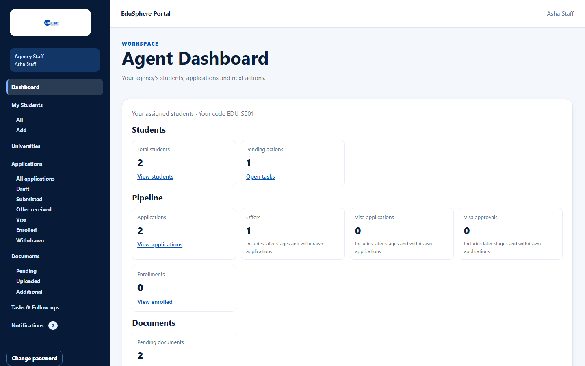

# Quick-start guide: Agency Staff

> Verified 2026-10-05 against docs commit `717d6aa8` (`main` @ `6a9be770`).

## Role Purpose
Agency Staff work on the students their agency Master assigns to them: counseling, shortlists, applications, offers,
deposits, visas, documents and follow-ups.

## Login
1. Your Master creates your login. You receive the email **"Welcome to EduSphere -- set your password"**.
2. Click **Set your password** in the email (valid 72 hours) and choose a password of at least 10 characters.
3. Sign in at the Overseas sign-in page (`/overseas/login`).

See [Reset your password](../user-manual/account-access/auth-004-reset-password.md) if the link expired.

## Dashboard
You land on the **Agent Dashboard** with "Your assigned students · Your code {code}" — figures for your own students only.

## Menus Available
| Sidebar | Notes |
|---|---|
| Dashboard | Your students only |
| My Students (All, Add) | Your assigned students; **Add** creates a student assigned to you |
| Universities | View the agency list (no add/edit) |
| Applications, Documents, Tasks & Follow-ups, Notifications | Your students only |
| Reports | Only if your Master gave you **View reports** |
| Change password / My profile / Sign out | Your account |

You do **not** see Team, Commissions or Staff Performance.

## Main Activities
| Activity | Guide |
|---|---|
| Add a student (assigned to you) | [Add a student](../user-manual/students/stu-002-add-a-student.md) |
| Counseling and shortlist | [Counseling](../user-manual/students/stu-006-record-counseling.md), [Shortlist](../user-manual/students/stu-007-university-shortlist.md) |
| Applications, offers, deposits, visas | [Applications](../user-manual/applications/app-001-view-applications.md) |
| Upload and request documents | [Upload](../user-manual/documents/doc-002-upload-a-document.md), [Request](../user-manual/documents/doc-006-request-a-document.md) |
| Verify documents (with permission) | [Review a document](../user-manual/documents/doc-004-review-a-document.md) |
| Follow-ups | [Tasks](../user-manual/tasks/task-002-manage-a-task.md) |

## Daily Workflows
1. Read **Notifications** ("Student assigned to you", reminders, overdue tasks).
2. Work through **Tasks & Follow-ups > Open / Overdue**.
3. Upload documents and move applications forward.

## Restrictions
- Only your assigned students are visible.
- You cannot archive or assign students, manage universities, confirm enrollment ("An agency Master confirms
  enrollment."), reject documents or see commissions.
- Verifying documents and Reports need permission from your Master.

## Common Problems
| Problem | Cause |
|---|---|
| "Invalid credentials" although your password is right | Your login was deactivated by your Master |
| "Access unavailable — Only an agency Master can open this page" | You opened a Master-only page |
| "Access unavailable — Your agency Master hasn't given you access to reports" | No **View reports** permission |
| No **Review** button on documents | No **Verify documents** permission |

More: [Troubleshooting](../troubleshooting.md), [FAQ](../faq.md).

## Related Features
[User manual index](../user-manual/README.md) · [Agency Master guide](agency-master.md)
