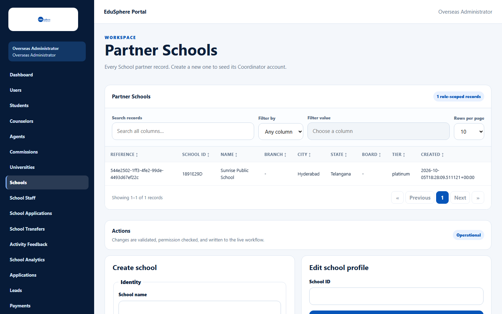
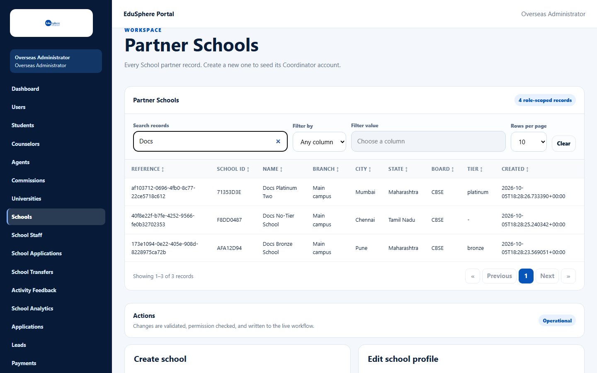

# Partner Schools list

> Doc ID: DOC-SCH-SADM-001 · Verified on 2026-10-05 against `main` @ `ce1f07c2` · Roles: Overseas Admin

## Purpose
See every partner school in one table, find a school quickly, and copy its **School ID**. You need the School ID to
edit a school (see [Edit a school profile and its partnership tier](sadm-003-edit-school-and-tier.md)).

## Who Can Use This Feature
**Overseas Admin.** A Super Admin who opens this page sees "Access unavailable — Workspace not found" (see
[Super Admin and the school screens](sadm-011-super-admin-access.md)).

## Prerequisites
You are signed in as an Overseas Admin.

## How to Access
Overseas Admin sidebar > **Schools**.

## Steps

### Step 1 — Open the list
In the sidebar, click **Schools**. The page **Partner Schools** opens. The badge on the right of the table shows how
many schools there are (for example "4 role-scoped records").

### Step 2 — Find a school
Type part of a name, city or School ID in **Search records**. The table narrows as you type. To search one column
only, choose it in **Filter by** and type in **Filter value**. Click **Clear** to show every school again.

### Step 3 — Sort and page
Click a column heading to sort by that column; click again to reverse. Use **Rows per page** (10, 25 or 50) and the
**Previous** / **Next** buttons when there are many schools.

## Fields
| Column | Description |
|---|---|
| Reference | The system's internal record number. You do not need it. |
| School ID | The 8-character school code. Use it to look a school up for editing. |
| Name, Branch, City, State | From the school profile. |
| Board | CBSE, ICSE, State, IB or Other ("-" when not set). |
| Tier | The partnership tier in lower case: bronze, silver, gold or platinum ("-" when no tier is set). |
| Created | When the school was created (date and time as stored). |

## Expected Result
You can see and find every partner school. The newest school is at the top.

## Validation Messages
None. The list only reads data.

## Common Errors
**Problem:** "No matching records" appears.
**Cause:** The search or filter matches no school.
**Resolution:** Click **Clear controls** (or **Clear**) and search again.

## Tips
- Search, filter, sort and paging work on the schools already loaded on the page; refresh the page after creating a
  school elsewhere.
- Rows are not clickable. To change a school, copy its **School ID** into **Edit school profile** below the table.

## Related Features
- [Create a school and its Coordinator](sadm-002-create-a-school.md)
- [Edit a school profile and its partnership tier](sadm-003-edit-school-and-tier.md)
- [Onboard several schools by CSV](sadm-004-bulk-onboard-schools.md)
