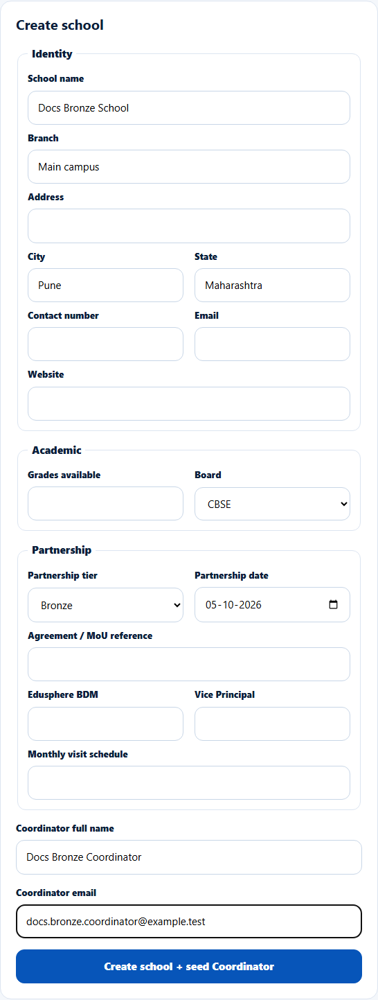
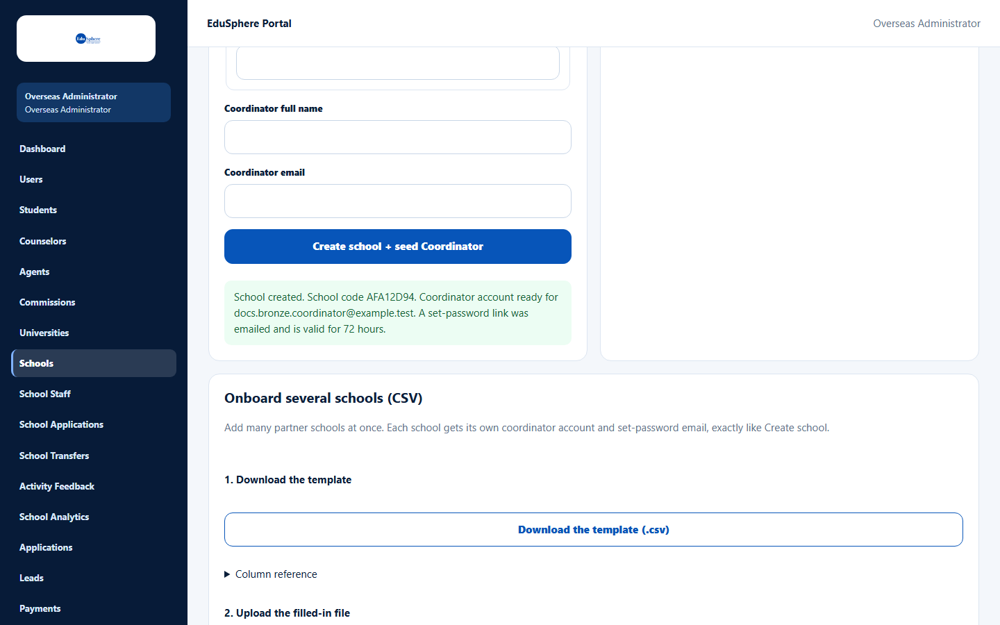
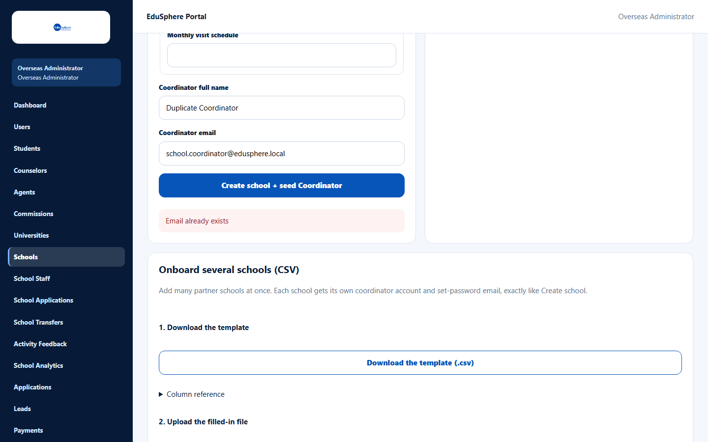

# Create a school and its Coordinator

> Doc ID: DOC-SCH-SADM-002 · Verified on 2026-10-05 against `main` @ `ce1f07c2` · Roles: Overseas Admin

## Purpose
Add a new partner school and, in the same step, create the login for its **School Coordinator**. The Coordinator
receives an email with a link to set their password.

## Who Can Use This Feature
**Overseas Admin.**

## Prerequisites
- The Coordinator's email address is not used by any other EduSphere account.
- Decide the school's **partnership tier** (Bronze, Silver, Gold or Platinum). It controls which services the school
  can use (see [Partnership tiers explained](../user-manual/entitlements/ent-002-partnership-tiers-explained.md)).

## How to Access
Overseas Admin sidebar > **Schools** > **Create school** (below the Partner Schools table).

## Steps

### Step 1 — Fill in the school's details
Scroll to **Create school**. Fill in at least **School name**, **Coordinator full name** and **Coordinator email**.
Fill in the other fields if you have them.

### Step 2 — Create the school
Click **Create school + seed Coordinator**. A green message confirms the school, shows its new **School code**, and says
the set-password email was sent:

"School created. School code {code}. Coordinator account ready for {email}. A set-password link was emailed and is
valid for 72 hours."

The form clears and the new school appears at the top of the Partner Schools list.

## Fields
| Field | Description | Required | Example |
|---|---|---|---|
| School name | The school's name. | Yes | Docs Bronze School |
| Branch | Campus or branch name. | No | Main campus |
| Address | Street address. | No | 12 FC Road |
| City / State | Location. | No | Pune / Maharashtra |
| Contact number | School phone number. | No | +91 20 0000 0000 |
| Email | The school's own email (not the Coordinator's). | No | office@school.example |
| Website | School website. | No | https://school.example |
| Grades available | Free text. | No | Grades 1–12 |
| Board | Not set, CBSE, ICSE, State, IB or Other. | No | CBSE |
| Partnership tier | Not set, Bronze, Silver, Gold or Platinum. | No | Bronze |
| Partnership date | Date the partnership started. | No | 05-10-2026 |
| Agreement / MoU reference | Your agreement number. | No | MOU-2026-014 |
| Edusphere BDM | Name of the EduSphere business developer (free text). | No | — |
| Vice Principal | Name. | No | — |
| Monthly visit schedule | Free text. | No | First Monday |
| Coordinator full name | The School Coordinator's name. | Yes | Docs Bronze Coordinator |
| Coordinator email | The Coordinator's login email. | Yes | coordinator@school.example |

## Expected Result
- The school exists with a new 8-character **School ID**.
- The School Coordinator account exists and is waiting for its password to be set.
- The Coordinator receives the email "Welcome to EduSphere -- set your password". The link is valid for 72 hours (see
  [Set your first password from a welcome link](../user-manual/account-access/auth-003-set-your-first-password.md)).

## Validation Messages
| Message | When |
|---|---|
| Your browser asks you to fill in the field | **School name**, **Coordinator full name** or **Coordinator email** is empty. |
| Email already exists | The Coordinator email already belongs to an EduSphere account. |
| A valid email address is required | The Coordinator email is not a valid address. *(From code; not seen in the browser.)* |

## Common Errors
**Problem:** The message ends with "The email was not delivered (email is not configured on this server). Re-send the
link from the Users page or dashboard once email works, or ask the user to use "Forgot your password?" on the sign-in
page." (shown in amber instead of green).
**Cause:** The school and the Coordinator account were created, but the server could not send the email.
**Resolution:** Do not create the school again. Re-send the link when email works — see
[Re-send a set-password link](sadm-010-resend-set-password-link.md).

**Problem:** "Email already exists".
**Cause:** The Coordinator already has an EduSphere login (any role).
**Resolution:** Use a different email address for the Coordinator, or ask EduSphere support how to handle the
existing account.

**Problem:** "Network error -- it is not known whether the school was created. Check the schools list before trying
again." *(From code; not seen in the browser.)*
**Cause:** The connection dropped while saving.
**Resolution:** Refresh the page and search the list for the school before creating it again.

## Tips
- There is no **Valid until** field here. To give the partnership an end date, create the school, then set **Valid
  until** in [Edit school profile](sadm-003-edit-school-and-tier.md) (or use the CSV upload, which has a
  `tier_valid_until` column).
- Setting a tier here does not send the school a "tier changed" notice; only later changes do.
- **School name**, **City** and **State** cannot be changed after the school is created. Check them before you click
  the button.
- This form does not stop you creating a second school with the same name and city (the CSV upload does) *(from
  code)*. Search the list first.

## Related Features
- [Partner Schools list](sadm-001-partner-schools-list.md)
- [Edit a school profile and its partnership tier](sadm-003-edit-school-and-tier.md)
- [Onboard several schools by CSV](sadm-004-bulk-onboard-schools.md)
- [Re-send a set-password link](sadm-010-resend-set-password-link.md)
