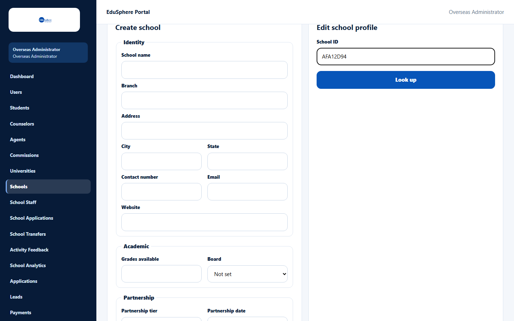
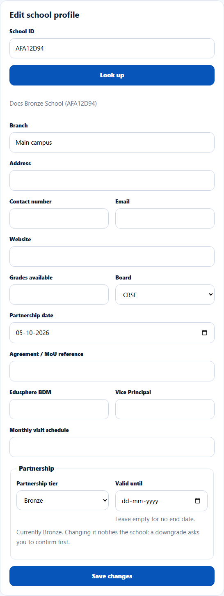
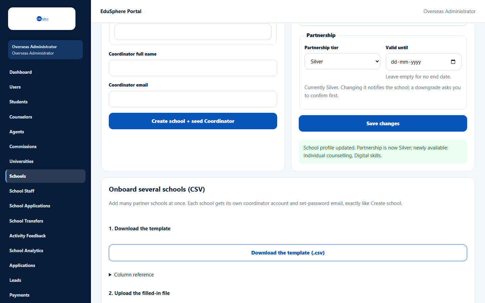
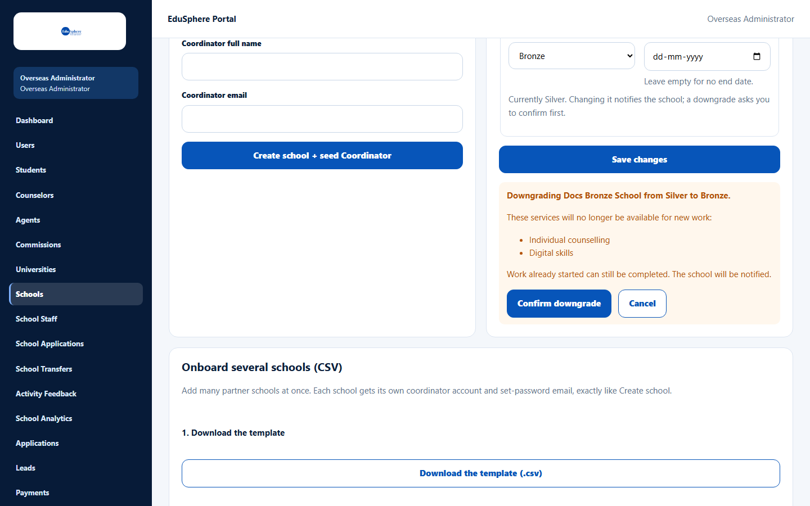
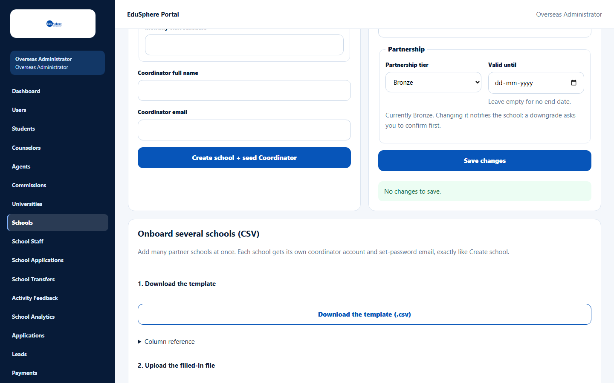
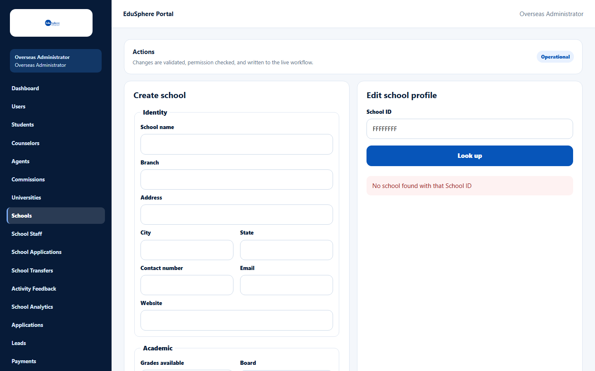

# Edit a school profile and its partnership tier

> Doc ID: DOC-SCH-SADM-003 · Verified on 2026-10-05 against `main` @ `ce1f07c2` · Roles: Overseas Admin

## Purpose
Update a partner school's details, change its **partnership tier** (upgrade or downgrade), or set the date the
partnership is valid until.

## Who Can Use This Feature
**Overseas Admin.**

## Prerequisites
You know the school's **School ID** (copy it from the [Partner Schools list](sadm-001-partner-schools-list.md)).

## How to Access
Overseas Admin sidebar > **Schools** > **Edit school profile** (to the right of **Create school**).

## Steps

### Step 1 — Look the school up
Type the **School ID** and click **Look up**.

The school's name and School ID appear, with its current details in the form.

### Step 2 — Change the details
Change any field. To clear a field, empty it. Under **Partnership**, the line "Currently {tier}. Changing it notifies
the school; a downgrade asks you to confirm first." shows the tier the school has now.

### Step 3a — Upgrade the tier
Choose a higher **Partnership tier** and click **Save changes**. The message lists the services the school gains, for
example: "School profile updated. Partnership is now Silver; newly available: Individual counselling, Digital
skills."

### Step 3b — Downgrade the tier
Choose a lower tier (or **Not set**) and click **Save changes**. Nothing is saved yet. An orange box explains what
the school loses, for example:

"Downgrading Docs Bronze School from Silver to Bronze. These services will no longer be available for new work:
Individual counselling, Digital skills. Work already started can still be completed. The school will be notified."

Click **Confirm downgrade** to save, or **Cancel** to go back. When saved, the message reads "School profile updated.
Partnership is now {tier}."

## Fields
| Field | Description | Required | Example |
|---|---|---|---|
| School ID | The 8-character code used to find the school. | Yes | B681F08A |
| Branch, Address, Contact number, Email, Website, Grades available | School profile. | No | Main campus |
| Board | Not set, CBSE, ICSE, State, IB or Other. | No | CBSE |
| Partnership date, Agreement / MoU reference, Edusphere BDM, Vice Principal, Monthly visit schedule | Partnership details. | No | — |
| Partnership tier | Not set, Bronze, Silver, Gold or Platinum. | No | Gold |
| Valid until | Last day of the partnership. Leave empty for no end date. | No | 31-03-2027 |

School name, City, State and the Coordinator cannot be changed here.

## Expected Result
- The school's profile is saved.
- When the tier goes up or down, the school's Coordinator(s) and Principal(s) receive a notice, by email and in
  EduSphere, such as "Your partnership is now Silver" or "Your partnership changed from Silver to Bronze". You also
  receive a notice "Tier change recorded: {school}, {old} → {new}".
- From now on, the school can start only the services its new tier includes.

## Validation Messages
| Message | When |
|---|---|
| No changes to save. | You clicked **Save changes** without changing anything. |
| No school found with that School ID | The School ID does not exist. |
| This school's tier changed to {tier} since you looked it up. Look it up again before changing the tier. | Another admin changed the tier while you were editing. *(From code; not seen in the browser.)* |

## Common Errors
**Problem:** "No school found with that School ID".
**Cause:** The code is mistyped, or it is the long "Reference" number instead of the School ID.
**Resolution:** Copy the 8-character value from the **School ID** column.

**Problem:** "The save could not be confirmed. Look the school up again to check before retrying." *(From code; not
seen in the browser.)*
**Cause:** The server did not confirm the save.
**Resolution:** Look the school up again and check its values before saving again.

## Tips
- Changing only **Valid until** does not notify the school.
- To renew a partnership, move **Valid until** to the new end date. Once the date has passed, the school's
  tier-limited work is refused with "This school's partnership expired on {date}." (seen in S5 when scheduling an
  activity at the expired school; see [Schedule an activity](../user-manual/activities/act-001-schedule-an-activity.md)).
- A downgrade never removes work the school already started; that work can still be completed.

## Related Features
- [Partner Schools list](sadm-001-partner-schools-list.md)
- [School Analytics](sadm-008-school-analytics.md) (flags "Renewal due" and "No active tier")
