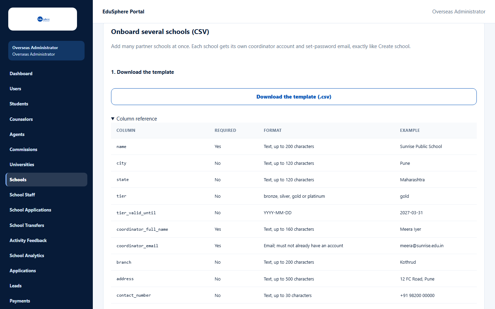
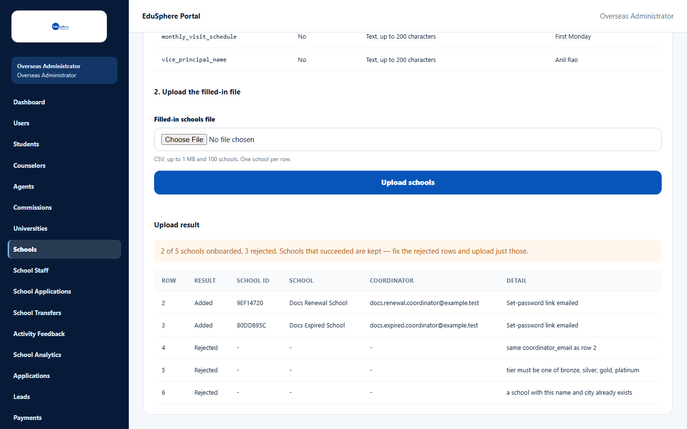
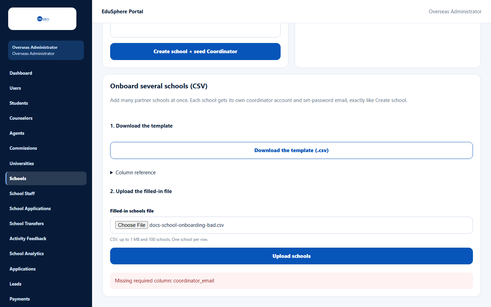

# Onboard several schools by CSV

> Doc ID: DOC-SCH-SADM-004 · Verified on 2026-10-05 against `main` @ `ce1f07c2` · Roles: Overseas Admin

## Purpose
Create many partner schools at once from a spreadsheet saved as CSV. Each school gets its own School Coordinator
account and set-password email, exactly as if you had used **Create school**.

## Who Can Use This Feature
**Overseas Admin.**

## Prerequisites
- A spreadsheet program that can save as CSV (UTF-8).
- One row per school, with a unique Coordinator email for each.

## How to Access
Overseas Admin sidebar > **Schools** > **Onboard several schools (CSV)** (below Create school and Edit school
profile).

## Steps

### Step 1 — Download the template
Click **Download the template (.csv)**. Open **Column reference** to see what each column expects.

### Step 2 — Fill in the file
Open the template in your spreadsheet program. Keep the header row exactly as it is. Add one row per school and save as
CSV.

### Step 3 — Upload the file
Under **2. Upload the filled-in file**, choose the file in **Filled-in schools file** and click **Upload schools**.
Large files can take up to a minute.

### Step 4 — Read the result
The **Upload result** shows a summary and one line per row:
- **Added** — the school was created; the Detail column says "Set-password link emailed".
- **Rejected** — the row was skipped; the Detail column says why.

Rows that were added stay added even when other rows are rejected. The summary reads, for example, "2 of 5 schools
onboarded, 3 rejected. Schools that succeeded are kept — fix the rejected rows and upload just those."

## Fields
| Column | Description | Required | Example |
|---|---|---|---|
| name | School name, up to 200 characters. | Yes | Sunrise Public School |
| city | Up to 120 characters. | No | Pune |
| state | Up to 120 characters. | No | Maharashtra |
| tier | bronze, silver, gold or platinum. | No | gold |
| tier_valid_until | Last day of the partnership, YYYY-MM-DD. | No | 2027-03-31 |
| coordinator_full_name | Up to 160 characters. | Yes | Meera Iyer |
| coordinator_email | Must not already have an EduSphere account. | Yes | meera@sunrise.edu.in |
| branch, address, contact_number, email, website, grades_available, board, partnership_date, mou_reference, edusphere_bdm, monthly_visit_schedule, vice_principal_name | Same as the Create school form. board is CBSE, ICSE, State, IB or Other. | No | Kothrud |

The file can be up to 1 MB and 100 schools.

## Expected Result
Each added row is a new school with its own **School ID** and a School Coordinator who receives a set-password email.

## Validation Messages
Messages about the whole file (nothing is created):

| Message | When |
|---|---|
| Missing required column: {column} | The header row lacks **name**, **coordinator_full_name** or **coordinator_email**. |
| The file is larger than 1 MB | The file is too big. *(From code.)* |
| The file has more than 100 filled-in rows | Too many schools in one file. *(From code.)* |
| The file must be a UTF-8 CSV | The file was saved in another format. *(From code.)* |
| Unknown column: {column} / Duplicate column: {column} | The header row was changed. *(From code.)* |

Messages about one row (only that row is skipped):

| Message | Meaning |
|---|---|
| same coordinator_email as row {n} | Two rows use the same Coordinator email. |
| tier must be one of bronze, silver, gold, platinum | The tier is misspelled. |
| a school with this name and city already exists | That school is already a partner. |
| Email already exists | The Coordinator email already has an account. *(From code.)* |
| same school name and city as row {n} | The same school appears twice in the file. *(From code.)* |

Row numbers count the header as row 1, so the first school is row 2.

## Common Errors
**Problem:** "No schools were onboarded. Fix the rows below and upload again." *(From code.)*
**Cause:** Every row was rejected.
**Resolution:** Read each Detail message, fix the rows, and upload again.

**Problem:** Detail says "Email not delivered — re-send from the Users page". *(Seen when email was switched off on
the documentation server.)*
**Cause:** The school was created but the email could not be sent.
**Resolution:** See [Re-send a set-password link](sadm-010-resend-set-password-link.md).

**Problem:** "The connection dropped. Upload again — the same file won't be added twice." *(From code.)*
**Cause:** The network dropped during the upload.
**Resolution:** Upload the same file again; schools already created are not created twice.

## Tips
- After fixing rejected rows, upload a file that contains only those rows.
- Unlike **Create school**, the CSV can set **tier_valid_until**.

## Related Features
- [Create a school and its Coordinator](sadm-002-create-a-school.md)
- [Partner Schools list](sadm-001-partner-schools-list.md)
