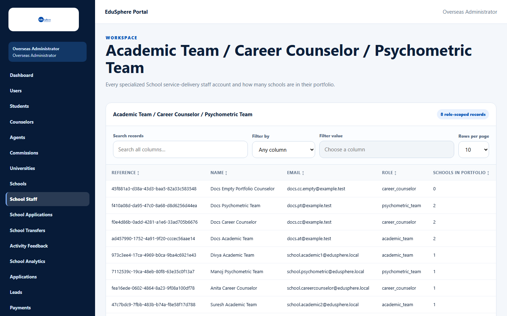
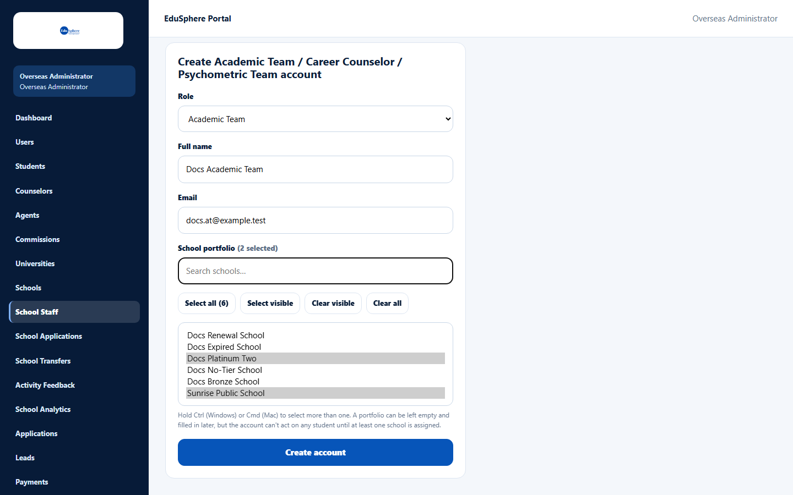
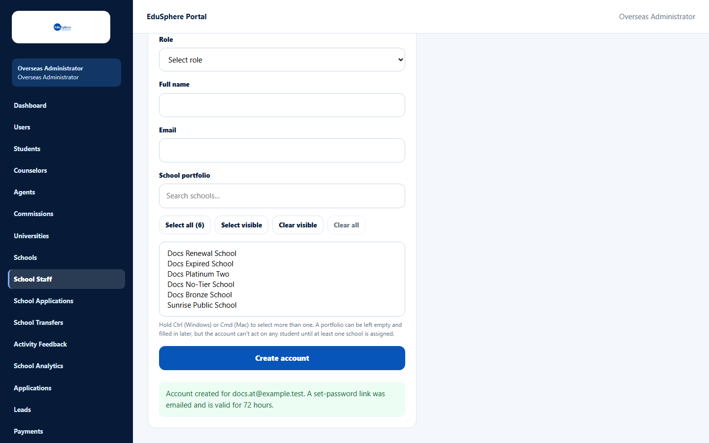

# Create school staff accounts and their school portfolio

> Doc ID: DOC-SCH-SADM-005 · Verified on 2026-10-05 against `main` @ `ce1f07c2` · Roles: Overseas Admin

## Purpose
Create logins for EduSphere's school specialists — **Academic Team**, **Career Counselor** and **Psychometric Team** —
and choose which partner schools each one works with (their **school portfolio**). A specialist can only see and work
on students at the schools in their school portfolio.

## Who Can Use This Feature
**Overseas Admin.**

## Prerequisites
- The schools exist (see [Create a school and its Coordinator](sadm-002-create-a-school.md)).
- The person's email is not used by any other EduSphere account.

## How to Access
Overseas Admin sidebar > **School Staff**.

## Steps

### Step 1 — Review existing staff
The table lists every specialist account, with its **Role** and how many **Schools in portfolio** it has. Use
**Search records**, **Filter by** and the column headings as on the Partner Schools list.

### Step 2 — Fill in the new account
Scroll to **Create Academic Team / Career Counselor / Psychometric Team account**. Choose the **Role**, then type the
**Full name** and **Email**.

### Step 3 — Choose the school portfolio
In **School portfolio**, select the schools. Hold **Ctrl** (Windows) or **Cmd** (Mac) and click to select more than
one. Type in **Search schools…** to narrow the list. The buttons help:
- **Select all (N)** — every school.
- **Select visible** / **Clear visible** — the schools shown by your search.
- **Clear all** — remove every selection.

The label shows how many are selected, for example "(2 selected)".

### Step 4 — Create the account
Click **Create account**. The message reads "Account created for {email}. A set-password link was emailed and is valid
for 72 hours."

## Fields
| Field | Description | Required | Example |
|---|---|---|---|
| Role | Academic Team, Career Counselor or Psychometric Team. | Yes | Academic Team |
| Full name | The person's name. | Yes | Docs Academic Team |
| Email | Their login email. | Yes | name@edusphere.example |
| School portfolio | The schools they work with. | No (but see Tips) | Sunrise Public School, Docs Platinum Two |

## Expected Result
- The account appears in the table (role shown as `academic_team`, `career_counselor` or `psychometric_team`) with
  its number of schools.
- The person receives "Welcome to EduSphere -- set your password". After setting a password and signing in, they see
  the students of the schools in their school portfolio.

## Validation Messages
| Message | When |
|---|---|
| Your browser asks you to fill in the field | **Role**, **Full name** or **Email** is empty. |
| Email already exists | The email already belongs to an account. *(From code.)* |
| A valid email address is required | The email is not valid. *(From code.)* |
| Full name must be at most 160 characters | The name is too long. *(From code.)* |

## Common Errors
**Problem:** The success message is amber and says the email was not delivered.
**Cause:** The account was created but the email could not be sent.
**Resolution:** [Re-send a set-password link](sadm-010-resend-set-password-link.md) when email works.

**Problem:** The specialist signs in but sees no students.
**Cause:** Their school portfolio is empty ("0" in **Schools in portfolio**) or the school has no students yet.
**Resolution:** See the tip below about changing a school portfolio.

## Tips
- **Choose the school portfolio carefully.** The help text says a school portfolio "can be left empty and filled in
  later", but this screen has no way to add or remove schools for an existing account. Ask EduSphere's technical
  team if a specialist's school portfolio must change.
- The table shows how many schools a specialist has, not which ones.

## Related Features
- [Re-send a set-password link](sadm-010-resend-set-password-link.md)
- User manual: *Set your first password from a welcome link* (session S3)
