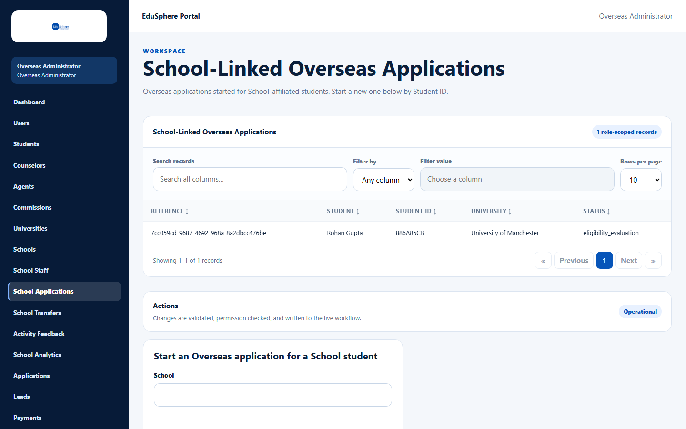
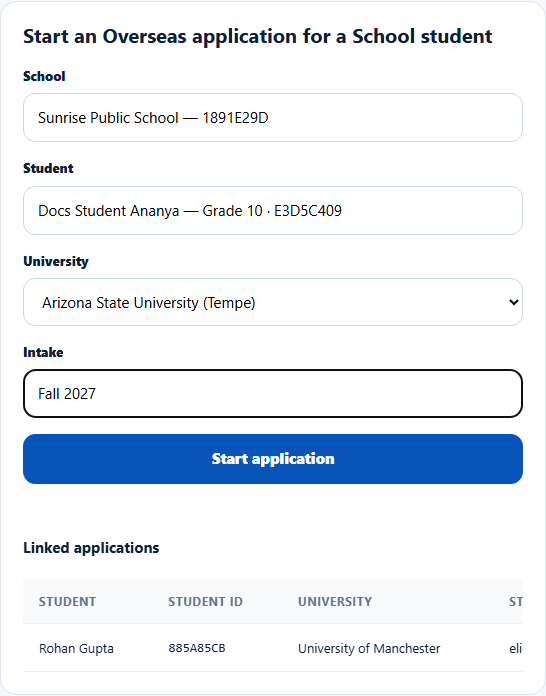
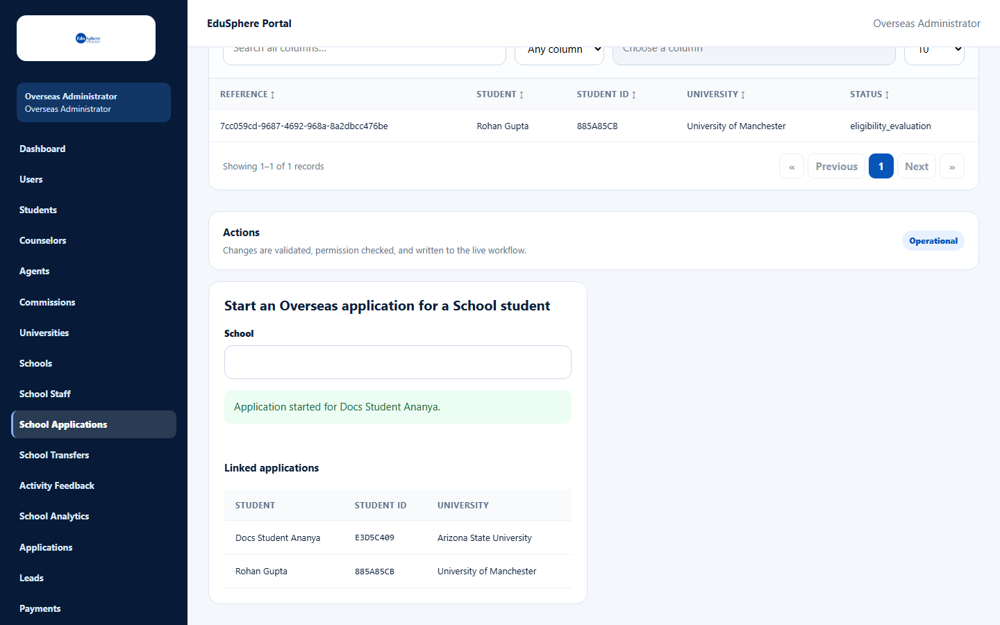
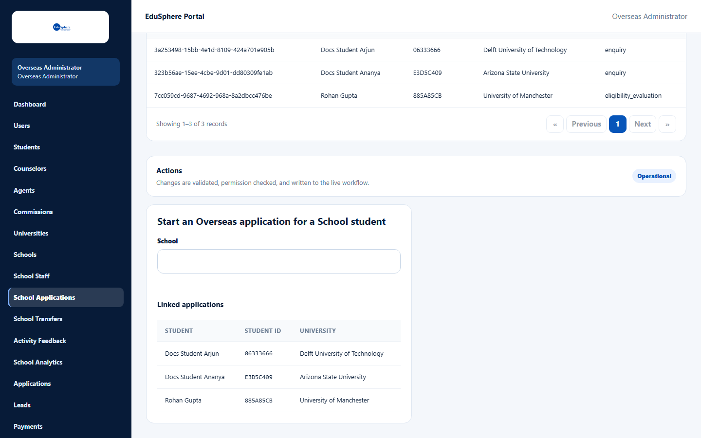
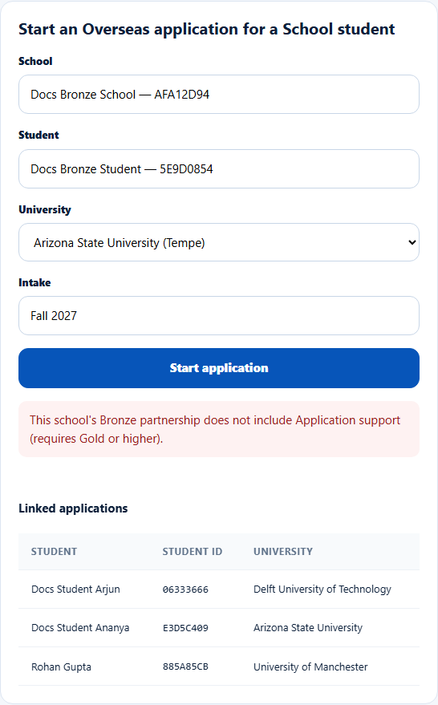
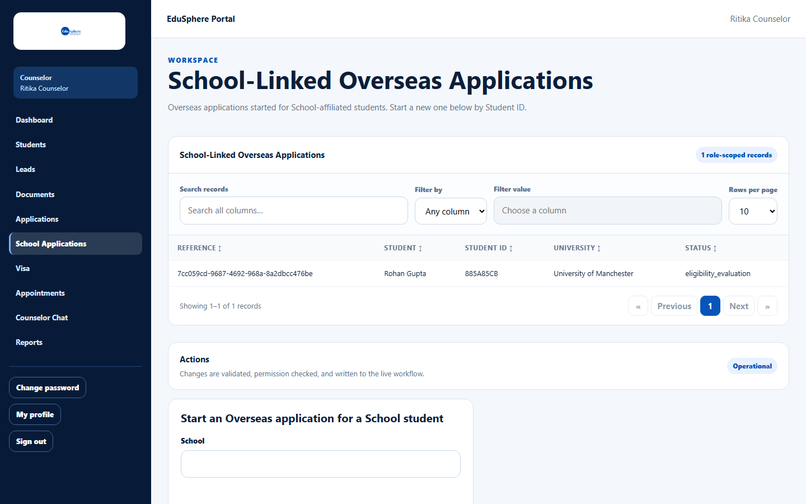

# Start an overseas application for a school student

> Doc ID: DOC-SCH-SADM-006 · Verified on 2026-10-06 against `main` @ `ce1f07c2` · Roles: Overseas Admin, Counselor

## Purpose
Start an overseas university application for a student of a partner school. The application then counts on the
school's **Global Education** page, and the student's parents are told.

## Who Can Use This Feature
- **Overseas Admin**: sidebar **School Applications**.
- **Counselor** (Overseas): sidebar **School Applications** (`/overseas/counselor/school-applications`). The list shows
  only applications the counselor started.
- A **Super Admin** gets "Workspace not found" on this page (see [Super Admin and the school screens](sadm-011-super-admin-access.md)).

## Prerequisites
The student's school has an unexpired **Gold** or **Platinum** partnership (Application support).

## How to Access
Sidebar > **School Applications**.

## Steps

### Step 1 — Open the page
The page shows **School-Linked Overseas Applications** (a searchable table) and the panel **Start an Overseas
application for a School student**.

### Step 2 — Pick school and student
In **School**, type the school's name or School ID and pick it. Then in **Student**, type the student's name or Student
ID and pick them.

### Step 3 — University and intake
Choose the **University** and type the **Intake** (for example "Fall 2027").

### Step 4 — Start
Click **Start application**. The message "Application started for {student}." appears and the application is added to
**Linked applications** with status `enquiry`.

## Fields
| Field | Description | Required | Example |
|---|---|---|---|
| School | Search by name or School ID. | Yes | Sunrise Public School |
| Student | Search by name or Student ID within that school. | Yes | Docs Student Ananya |
| University | From EduSphere's university list. | Yes | Arizona State University (Tempe) |
| Intake | Free text. | Yes | Fall 2027 |

## Expected Result
- The student appears on the school's **Global Education** page at the "Global education pathway" stage.
- The parents are notified "Overseas application started for {name}" *(from code)*.

## Validation Messages
| Message | When |
|---|---|
| This school's {Tier} partnership does not include Application support (requires Gold or higher). | The school has a valid Bronze or Silver tier. |
| This school has no active partnership tier. | The school has no tier. *(From code.)* |
| This school's partnership expired on {date}. | The school's tier has expired. *(From code.)* |
| An application for this university already exists for this student | Same student and university again. |
| Choose a school, then a student, first. | Missing picks. *(From code.)* |

## Common Errors
**Problem:** The tier message.
**Cause:** Application support needs Gold or Platinum.
**Resolution:** Upgrade the school's tier first (see [Edit a school profile and its partnership tier](sadm-003-edit-school-and-tier.md)).

## Tips
- The page shows the same applications twice: the generic table at the top (refreshed when you reload) and **Linked
  applications** below the form. The page subtitle says "by Student ID", but the form uses a school-then-student picker.
- Moving the application past `enquiry` is done by EduSphere's application team in the overseas application screens,
  which are outside this guide. School-linked applications did not appear in the Counselor's **Applications** list on
  the documentation server. VERIFICATION REQUIRED: how stages are advanced for school-linked applications.

## Related Features
- User manual: [Global education pipeline](../user-manual/reports/rpt-006-global-education.md)
