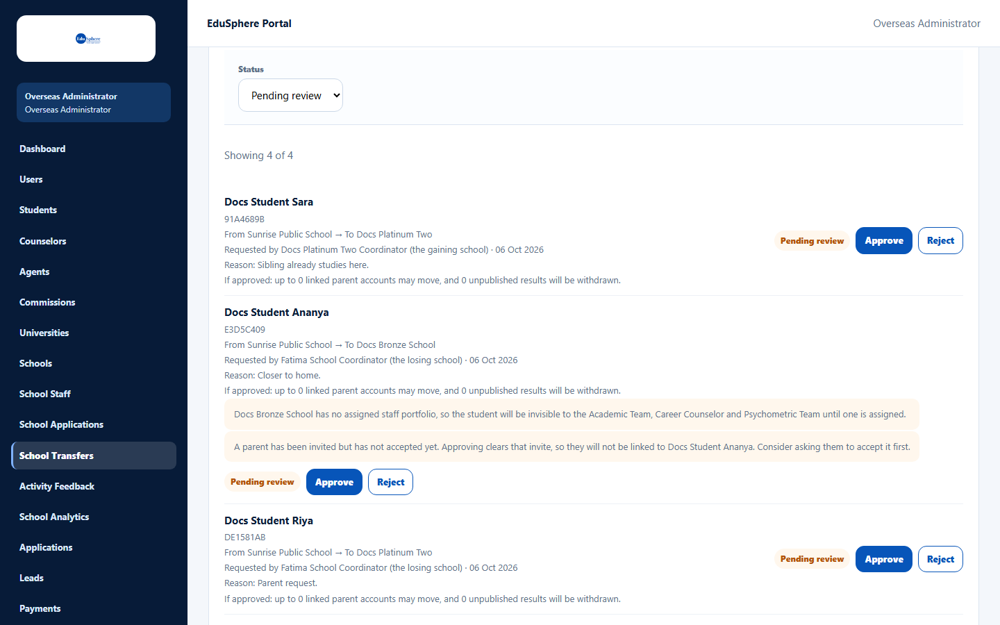
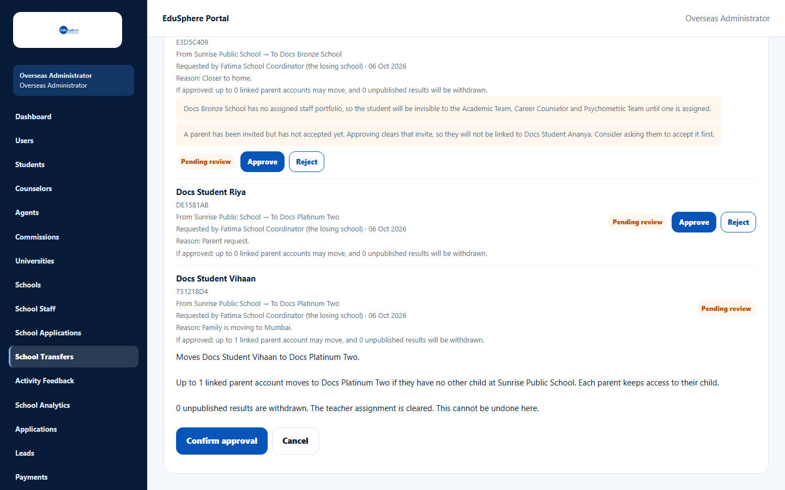
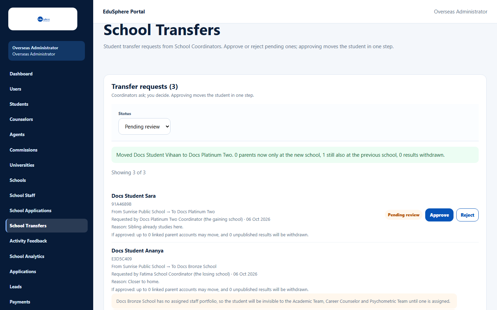
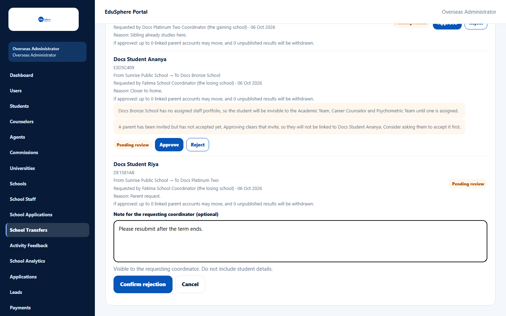
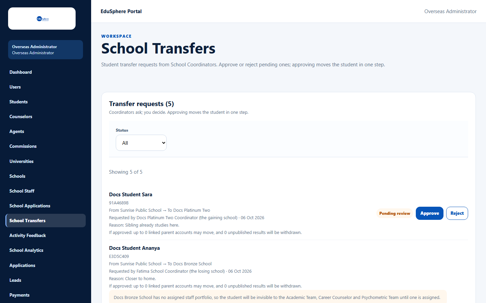

# Review school transfer requests

> Doc ID: DOC-SCH-SADM-007 · Verified on 2026-10-06 against `main` @ `ce1f07c2` · Roles: Overseas Admin, Super Admin

## Purpose
Approve or reject requests from School Coordinators to move a student between partner schools. Approving moves the
student in one step.

## Who Can Use This Feature
**Overseas Admin.** A **Super Admin** can open the page by typing its address (it shows the Overseas Admin sidebar).

## Prerequisites
A coordinator has filed a request (outgoing from the losing school, or incoming from the gaining school).

## How to Access
Overseas Admin sidebar > **School Transfers**.

## Steps

### Step 1 — Review the queue
**Transfer requests ({n})** opens on **Pending review**, newest first. Each request shows the student, Student ID, "From
{A} → To {B}", who requested it (the losing or the gaining school), the reason and what approval would do ("If approved:
up to {n} linked parent accounts may move, and {n} unpublished results will be withdrawn.").

### Step 2 — Read the warnings
Orange warnings appear when:
- the destination has no EduSphere staff assigned ("{school} has no assigned staff portfolio, so the student will be
  invisible to the Academic Team, Career Counselor and Psychometric Team until one is assigned."), or
- a parent invitation is still pending ("Approving clears that invite, so they will not be linked to {student}.").

### Step 3a — Approve
Click **Approve**. The page explains the consequences; click **Confirm approval** (or **Cancel**). The message
"Moved {student} to {school}. {n} parents now only at the new school, {n} still also at the previous school, {n} results
withdrawn." appears.

### Step 3b — Reject
Click **Reject**, optionally type a **Note for the requesting coordinator (optional)** (no student details), then
**Confirm rejection**. The message "Request rejected for {student}." appears.

### Step 4 — Look back
Set **Status** to **All**, **Approved**, **Rejected** or **Cancelled** to see decided requests and their outcomes.

## Fields
| Field | Description | Required | Example |
|---|---|---|---|
| Status | Pending review, All, Approved, Rejected, Cancelled. | — | Pending review |
| Note for the requesting coordinator (optional) | Up to 500 characters, shown to the coordinator. | No | Please resubmit after the term ends. |

## Expected Result
- **Approved:**
  - The student moves; their teacher, section and roll number are cleared, and unpublished results are withdrawn.
  - Both coordinators and the linked parents are notified.
  - Parents keep access to their child.
- **Rejected:** nothing changes; the requesting coordinator gets an in-app notice (without your note), and your note
  appears with the request on their **Transfers** page ("Admin note: …").

## Validation Messages
| Message | When |
|---|---|
| This transfer request has already been decided | Someone else decided it first. *(From code.)* |
| The student is no longer at the school this request was filed for; reject it and file a new one | The student moved in the meantime. *(From code.)* |

## Common Errors
**Problem:** "The decision did not complete. Check your connection and refresh the queue before trying again." *(From
code.)*
**Cause:** Network problem.
**Resolution:** Refresh the page and check the request's status before deciding again.

## Tips
- An approval cannot be undone from this page. To reverse it, the coordinator files a new request the other way.
- Before approving into a school with no staff school portfolio, consider assigning specialists first (see
  [Create school staff accounts](sadm-005-create-school-staff.md)).

## Related Features
- User manual: [Request a transfer out](../user-manual/transfers/xfer-001-request-a-transfer-out.md),
  [Track and cancel transfer requests](../user-manual/transfers/xfer-003-track-and-cancel-transfers.md)
