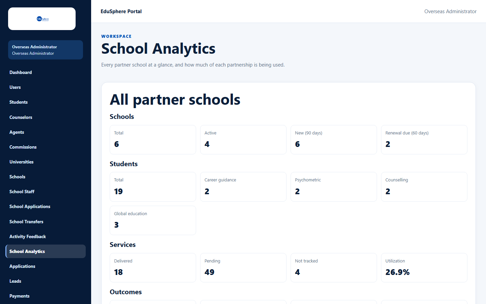
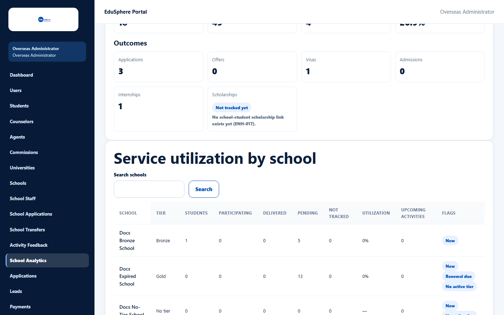
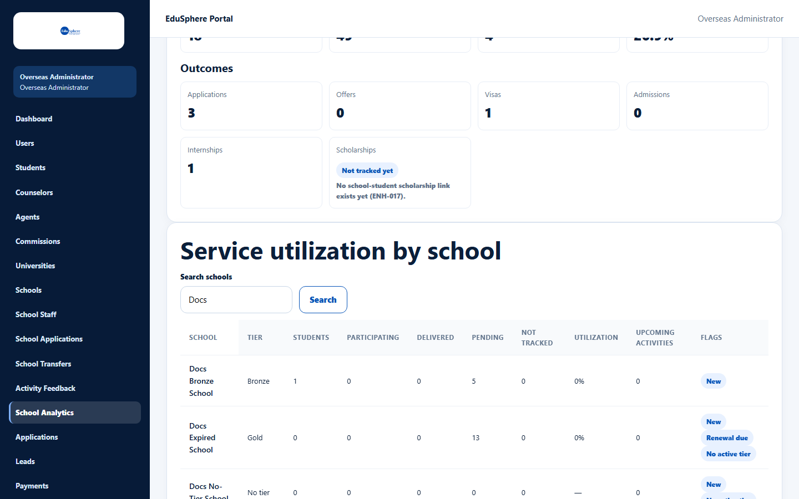
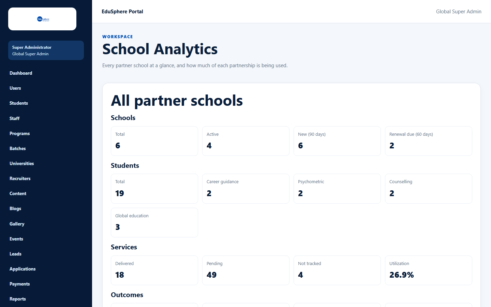

# School Analytics

> Doc ID: DOC-SCH-SADM-008 · Verified on 2026-10-06 against `main` @ `ce1f07c2` · Roles: Overseas Admin, Super Admin

## Purpose
See every partner school at a glance and how much of each partnership is being used, so you can spot schools that need
attention or renewal.

## Who Can Use This Feature
**Overseas Admin** and **Super Admin** (both have **School Analytics** in the sidebar).

## Prerequisites
None.

## How to Access
Sidebar > **School Analytics** (`/overseas/admin/school-analytics`).

## Steps

### Step 1 — Read "All partner schools"
Four groups of figures: **Schools**, **Students**, **Services** and **Outcomes**.

### Step 2 — Read the utilization table
**Service utilization by school** lists every school (sorted by name) with its tier, students, service figures,
upcoming activities and **Flags**.

### Step 3 — Search
Type part of a school's name in **Search schools** and click **Search**. The search ignores upper and lower case.

### Step 4 — Page through
25 schools per page, with **← Previous** / **Next →** *(from code; the documentation server has 6 schools)*.

## Fields
| Figure | Meaning |
|---|---|
| Schools: Total / Active | All partner schools / schools with a tier that has not expired. |
| New (90 days) | Partnership started (or school created) in the last 90 days. |
| Renewal due (60 days) | Tier ends within 60 days or has already ended. |
| Students: Total, Career guidance, Psychometric, Counselling, Global education | Students across all schools, and how many received each service. |
| Services: Delivered / Pending / Not tracked | Included services used, included services not yet used, and included services EduSphere does not track. |
| Utilization | Delivered ÷ (Delivered + Pending), for example 18 ÷ 67 = 26.9% on the documentation server ("—" when the school has no tier). |
| Outcomes | Applications, Offers, Visas, Admissions, Internships. **Scholarships** shows "Not tracked yet — No school-student scholarship link exists yet (ENH-017)." |

| Flag | Meaning |
|---|---|
| New | Partnership started in the last 90 days. |
| Renewal due | Tier ends within 60 days or has ended. |
| No active tier | No tier, or the tier has expired. |

*(Definitions from code. Seen in S10: the expired Gold school shows Tier "Gold" with all three flags; the school
without a tier shows "No tier" and "—" utilization.)*

## Expected Result
You can see which schools are under-using their partnership or need renewal.

## Validation Messages
| Message | When |
|---|---|
| No schools match "{search}". | Nothing matches your search *(from code)*. |
| No partner schools yet. | No schools exist *(from code)*. |

## Common Errors
**Problem:** "This section couldn't load. Refresh to try again." *(From code.)*
**Cause:** The figures could not be fetched.
**Resolution:** Refresh the page.

## Tips
- An expired school still shows its old tier name in **Tier**; check the **No active tier** flag. (The school's own
  Entitlements page shows no warning; see [View your school's partnership entitlements](../user-manual/entitlements/ent-001-view-entitlements.md).)
- To change a school, open it from sidebar > **Schools**.
- The Super Admin sees the same page with the Super Admin sidebar.

## Related Features
- [Partner schools list](sadm-001-partner-schools-list.md)
- [Edit a school profile and its partnership tier](sadm-003-edit-school-and-tier.md)
