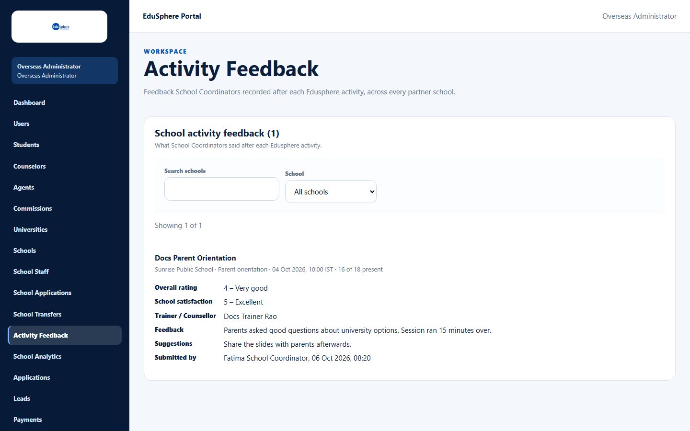
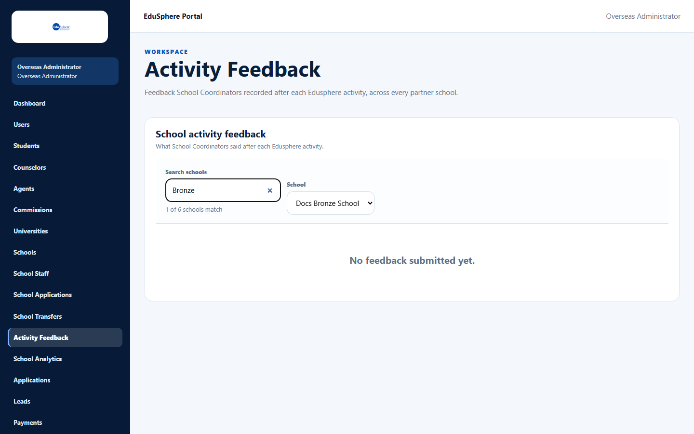

# Activity Feedback across schools

> Doc ID: DOC-SCH-SADM-009 · Verified on 2026-10-06 against `main` @ `ce1f07c2` · Roles: Overseas Admin, Super Admin

## Purpose
Read what School Coordinators said after each EduSphere activity, across every partner school, to improve the sessions.

## Who Can Use This Feature
**Overseas Admin.** A **Super Admin** can open the page by typing its address (it then shows the Overseas Admin
sidebar — see [Super Admin and the school screens](sadm-011-super-admin-access.md)).

## Prerequisites
None. Feedback appears once coordinators submit it.

## How to Access
Overseas Admin sidebar > **Activity Feedback**.

## Steps

### Step 1 — Read the feedback
**School activity feedback ({n})** lists every submission, newest first. Each shows the activity, school, type, date
(IST), attendance and the ratings, trainer, feedback, suggestions and who submitted it.

### Step 2 — Filter by school
Type in **Search schools** to narrow the **School** list ("{n} of {N} schools match"), then pick the school. The list
shows that school's feedback only.

### Step 3 — More results
When there are more than 25, click **Load more**.

## Fields
| Item | Description |
|---|---|
| Overall rating, School satisfaction | 1 – Poor to 5 – Excellent. |
| Trainer / Counsellor | "Not recorded" when empty. |
| Feedback, Suggestions | The coordinator's text ("None" when no suggestions). |
| Submitted by | Coordinator and time (IST, not labelled). |

## Expected Result
You can review the quality of EduSphere sessions by school.

## Validation Messages
| Message | When |
|---|---|
| No feedback submitted yet. | Nothing matches (all schools, or the chosen school). |

## Common Errors
**Problem:** "Could not load activity feedback." *(From code.)*
**Cause:** A temporary loading problem.
**Resolution:** Click **Try again**.

## Tips
- Feedback is read only here; coordinators submit it from their **Feedback** page.

## Related Features
- User manual: [Give feedback on a completed activity](../user-manual/activities/act-003-give-activity-feedback.md)
