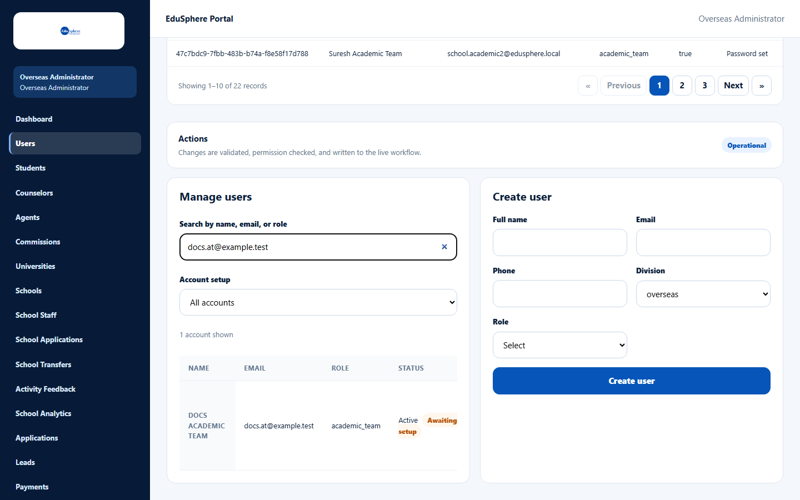
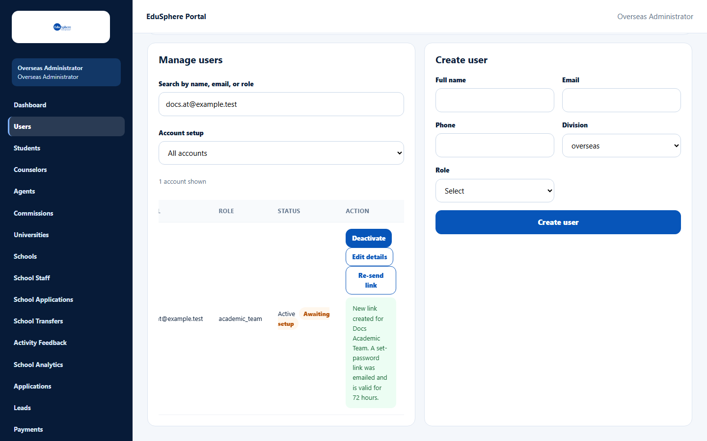

# Re-send a set-password link

> Doc ID: DOC-SCH-SADM-010 · Verified on 2026-10-05 against `main` @ `ce1f07c2` · Roles: Overseas Admin

## Purpose
Send a new "set your password" link to a School Coordinator or school specialist (Academic Team, Career Counselor,
Psychometric Team) who has not set a password yet — for example because the first email was lost or the 72-hour link
expired.

## Who Can Use This Feature
**Overseas Admin.**

## Prerequisites
The account is active and still waiting for setup (its password has never been set).

## How to Access
Overseas Admin sidebar > **Users** > **Manage users**.

## Steps

### Step 1 — Find the account
In **Search by name, email, or role**, type the person's email and press **Enter**. The row's status shows **Active**
and **Awaiting setup**, with a **Re-send link** button.

### Step 2 — Re-send
Click **Re-send link**. The message "New link created for {name}. A set-password link was emailed and is valid for 72
hours." appears in the row.

## Fields
| Field | Description | Required | Example |
|---|---|---|---|
| Search by name, email, or role | Finds the account. | No | docs.at@example.test |
| Account setup | Filters by setup state. | No | All accounts |

## Expected Result
The person receives a new "Welcome to EduSphere -- set your password" email.

## Validation Messages
These messages come from the same Users page and were verified in the Agent CRM documentation (DOC-ADM-008):

| Message | When |
|---|---|
| A link was just sent; wait N seconds before re-sending | **Re-send link** was pressed again within a minute. |
| This account has no pending invitation (its password is already set) | The person already set a password. |
| Reactivate this account before re-sending its link | The account is deactivated. |

## Common Errors
**Problem:** There is no **Re-send link** button on the row.
**Cause:** The person has already set a password, or the account is deactivated.
**Resolution:** Ask them to use **Forgot your password?** on the sign-in page.

## Tips
- Principals, Teachers and Parents do not get set-password links from EduSphere. Their School Coordinator invites them
  from the school's **Team** page (user manual, session S3).
- The table may need scrolling sideways to see the **Action** column.

## Related Features
- [Create a school and its Coordinator](sadm-002-create-a-school.md)
- [Create school staff accounts](sadm-005-create-school-staff.md)
