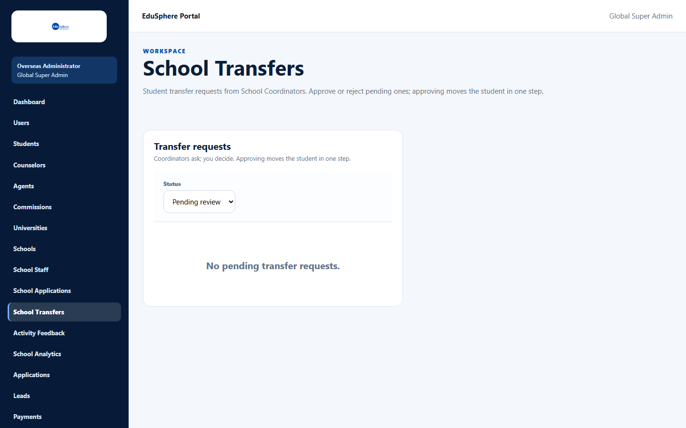

# Super Admin and the school screens

> Doc ID: DOC-SCH-SADM-011 · Verified on 2026-10-05 against `main` @ `ce1f07c2` · Roles: Super Admin

## Purpose
Explain which School CRM administration screens a **Super Admin** can use, and which ones they must leave to an
Overseas Admin.

## Who Can Use This Feature
**Super Admin.**

## Prerequisites
You are signed in as Super Admin.

## How to Access
- **School Analytics** is in the Super Admin sidebar.
- The other school screens are not in the Super Admin sidebar. You can only reach them by typing their address.

## What you can and cannot open
| Screen | Address | What a Super Admin sees |
|---|---|---|
| School Analytics | `/overseas/admin/school-analytics` | Works, with the Super Admin sidebar. |
| School Transfers | `/overseas/admin/school-transfers` | Works, but the page shows the Overseas Admin sidebar and the label "Overseas Administrator". |
| Activity Feedback | `/overseas/admin/activity-feedback` | Works, but with the Overseas Admin sidebar and label. |
| Schools | `/overseas/admin/schools` | "Access unavailable — Workspace not found". |
| School Staff | `/overseas/admin/school-staff` | "Access unavailable — Workspace not found". |
| School Applications | `/overseas/admin/school-applications` | "Access unavailable — Workspace not found". |

## Steps

### Step 1 — Use School Analytics
In the Super Admin sidebar, click **School Analytics**.

### Step 2 — Review transfers or activity feedback (optional)
Type the address of **School Transfers** or **Activity Feedback** in the browser. You can use them as an Overseas
Admin would. The sidebar shows Overseas Admin links; to return to your own pages, go to `/admin`.

### Step 3 — Ask an Overseas Admin for everything else
Creating or editing schools, changing partnership tiers, onboarding schools by CSV, creating school staff and starting
applications for school students must be done by an **Overseas Admin**.

## Fields
None.

## Expected Result
You know which screens to use and which to hand to an Overseas Admin.

## Validation Messages
| Message | When |
|---|---|
| Access unavailable — Workspace not found | A Super Admin opens Schools, School Staff or School Applications. |

## Common Errors
**Problem:** "Access unavailable — Workspace not found" on the Schools page.
**Cause:** These three pages are only built for the Overseas Admin.
**Resolution:** Click **Go to your dashboard** and ask an Overseas Admin to make the change.

## Tips
- On School Transfers and Activity Feedback, the sidebar links lead to Overseas Admin pages. Some of them (for example
  **Schools** and **School Staff**) show "Workspace not found" for you.

## Related Features
- [Partner Schools list](sadm-001-partner-schools-list.md)
- [Create school staff accounts](sadm-005-create-school-staff.md)
