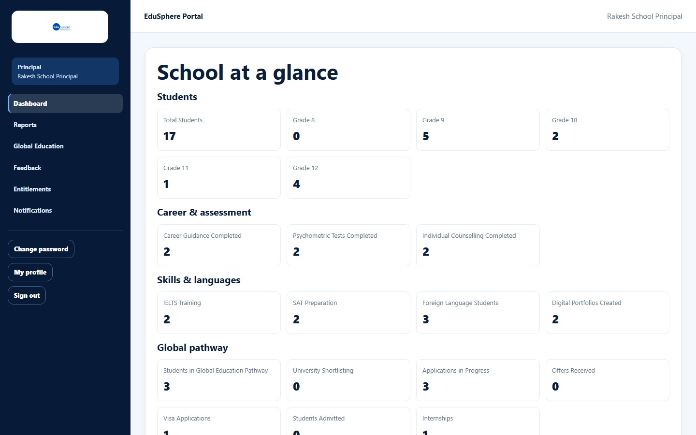

# Quick-start guide: Principal

> Verified 2026-10-06 against `main` @ `ce1f07c2` (School CRM documentation, sessions S2–S10).

## Role Purpose
The Principal follows the school's progress with EduSphere: key figures, reports, students on the overseas pathway,
activity feedback and the partnership. The Principal's portal is read-only.

## Login
1. Open the invitation email from your School Coordinator and click the link (valid for 7 days). Set your password.
   See [Accept a school invitation](../user-manual/account-access/auth-002-accept-an-invitation.md).
2. Afterwards, sign in at **/overseas/login**. See [Sign in](../user-manual/account-access/auth-001-sign-in.md).

## Dashboard
**School at a glance** shows the same 20 figures as the Coordinator's dashboard, followed by **Your school**, a list
of every student with a **Timeline** button.

Details: [Principal dashboard](../user-manual/dashboards/dash-002-principal-dashboard.md).

## Menus Available
| Sidebar | Use it to |
|---|---|
| Dashboard | Key figures and the student list |
| Reports | School report PDF, summary, grade comparison, at-risk lists, scorecards |
| Global Education | Students on the overseas pathway |
| Feedback | Read the Coordinator's feedback on EduSphere activities |
| Entitlements | What your partnership includes |
| Notifications | Partnership changes |
| Change password / My profile / Sign out | Your account |

## Main Activities
| Activity | Guide |
|---|---|
| Follow the school | [Dashboard](../user-manual/dashboards/dash-002-principal-dashboard.md), [Summary](../user-manual/reports/rpt-002-school-summary.md), [Grade-wise](../user-manual/reports/rpt-003-grade-wise-comparison.md) |
| Spot students needing help | [Development, at-risk and top performers](../user-manual/reports/rpt-004-student-development.md), [Scorecards](../user-manual/reports/rpt-005-student-scorecards.md) |
| Look at one student | [Profile and timeline](../user-manual/students/stu-006-student-profile-and-timeline.md), [360° view](../user-manual/student-360/s360-001-student-360-view.md), [Progress report](../user-manual/students/stu-008-progress-report-pdf.md) |
| Share figures | [School report PDF](../user-manual/reports/rpt-001-school-report-pdf.md) |
| Overseas pathway | [Global education](../user-manual/reports/rpt-006-global-education.md) |
| Activity feedback | [View activity feedback](../user-manual/activities/act-004-view-activity-feedback.md) |
| Partnership | [Entitlements](../user-manual/entitlements/ent-001-view-entitlements.md), [Notifications](../user-manual/notifications/notif-001-staff-notifications.md) |

## Daily Workflows
1. Glance at the dashboard figures.
2. Weekly: open **Reports** and check the at-risk list and scorecards.
3. After EduSphere activities: read **Feedback**.
4. Before parent meetings: download the student's progress report.

## Restrictions
- You cannot add or change students, team members or activities; the School Coordinator does that.
- There is no **Students** menu; reach students from the dashboard list or the scorecards.
- You are notified only about partnership changes, not transfers.

## Common Problems
| Problem | What to do |
|---|---|
| "No notifications yet…" | Normal; you are only told about partnership changes. |
| A student is missing from the list | Ask the School Coordinator to add them. |
| A section says it couldn't load | Refresh the page. |

More: [Troubleshooting](../troubleshooting.md) · [FAQ](../faq.md).

## Related Features
- [Find your way around](../user-manual/account-access/auth-009-find-your-way-around.md)
- [Partnership tiers explained](../user-manual/entitlements/ent-002-partnership-tiers-explained.md)
