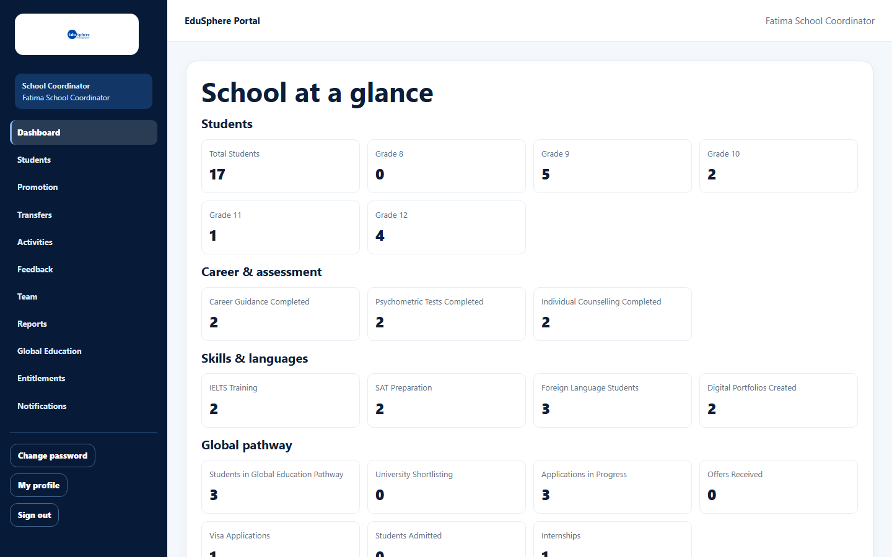

# Quick-start guide: School Coordinator

> Verified 2026-10-06 against `main` @ `ce1f07c2` (School CRM documentation, sessions S2–S10).

## Role Purpose
The School Coordinator runs the school's EduSphere workspace. They keep the student roster up to date, invite the
Principal, Teachers and Parents, schedule activities and mark attendance, handle transfers and promotion, and follow the
school's reports and partnership. Each partner school has a Coordinator, created by EduSphere's Overseas Admin.

## Login
1. Open the welcome email from EduSphere and set your first password (the link is valid for 72 hours). See
   [Set your first password](../user-manual/account-access/auth-003-set-your-first-password.md).
2. Afterwards, sign in at **/overseas/login** with your email and password. See
   [Sign in](../user-manual/account-access/auth-001-sign-in.md).

## Dashboard
You land on **School at a glance**: 20 figures about students, career and assessment services, skills and languages,
and the global pathway, followed by shortcuts, upcoming activities and a results summary.

Details: [School Coordinator dashboard](../user-manual/dashboards/dash-001-coordinator-dashboard.md).

## Menus Available
| Sidebar | Use it to |
|---|---|
| Dashboard | See the school at a glance |
| Students | Roster, add/edit students, link parents, photos, bulk upload, student profiles |
| Promotion | Move students to the new academic year |
| Transfers | Request students in, track and cancel transfer requests |
| Activities | Schedule activities and mark attendance |
| Feedback | Give feedback on EduSphere activities |
| Team | Invite and manage Principal, Teachers and Parents |
| Reports | School report PDF, summary, grade comparison, at-risk lists, scorecards |
| Global Education | Students on the overseas pathway |
| Entitlements | What your partnership includes |
| Notifications | Transfer decisions and partnership changes |
| Change password / My profile / Sign out | Your account |

## Main Activities
| Activity | Guide |
|---|---|
| Build the roster | [Add a student](../user-manual/students/stu-002-add-a-student.md), [Bulk upload](../user-manual/students/stu-005-bulk-upload-roster.md), [Edit](../user-manual/students/stu-003-edit-a-student.md), [Photo](../user-manual/students/stu-007-student-photo.md) |
| Invite your team and parents | [Invite](../user-manual/team/team-001-invite-a-team-member.md), [Your team](../user-manual/team/team-002-view-your-team.md), [Link a parent](../user-manual/students/stu-004-link-a-parent.md) |
| Deactivate or reactivate accounts | [Deactivate or reactivate](../user-manual/team/team-003-deactivate-or-reactivate.md) |
| Schedule activities and take attendance | [Schedule](../user-manual/activities/act-001-schedule-an-activity.md), [Attendance](../user-manual/activities/act-002-mark-activity-attendance.md), [Feedback](../user-manual/activities/act-003-give-activity-feedback.md) |
| Follow a student | [Profile and timeline](../user-manual/students/stu-006-student-profile-and-timeline.md), [360° view](../user-manual/student-360/s360-001-student-360-view.md), [Progress report](../user-manual/students/stu-008-progress-report-pdf.md), [Digital Portfolio](../user-manual/portfolio/port-001-digital-portfolio-overview.md) |
| Transfers | [Transfer out](../user-manual/transfers/xfer-001-request-a-transfer-out.md), [Request a student in](../user-manual/transfers/xfer-002-request-a-student-in.md), [Track and cancel](../user-manual/transfers/xfer-003-track-and-cancel-transfers.md) |
| New academic year | [Promote or hold back](../user-manual/students/stu-009-promote-students.md) |
| Reports | [School report PDF](../user-manual/reports/rpt-001-school-report-pdf.md), [Summary](../user-manual/reports/rpt-002-school-summary.md), [Grade-wise](../user-manual/reports/rpt-003-grade-wise-comparison.md), [Development](../user-manual/reports/rpt-004-student-development.md), [Scorecards](../user-manual/reports/rpt-005-student-scorecards.md), [Global education](../user-manual/reports/rpt-006-global-education.md) |
| Partnership | [Entitlements](../user-manual/entitlements/ent-001-view-entitlements.md), [Tiers explained](../user-manual/entitlements/ent-002-partnership-tiers-explained.md) |

## Daily Workflows
1. Check **Notifications** for transfer decisions and partnership changes.
2. Add new students and keep grades, class teachers and parent emails correct.
3. After each activity, mark attendance on **Activities** and, for EduSphere activities, give **Feedback**.
4. Check **Team** for pending invitations that have not been accepted.
5. Weekly: **Reports** (at-risk students, scorecards) and **Global Education**.
6. At the start of a new academic year (once EduSphere opens it): **Promotion**.

## Restrictions
- You cannot delete students; ask EduSphere.
- You cannot approve transfers; EduSphere's Overseas Admin decides.
- You cannot change your school's tier or open a new academic year; ask your Overseas Admin.
- Invitations cannot be re-sent, revoked or copied from the screen.
- Services outside your tier are refused with a partnership message (see [Tiers explained](../user-manual/entitlements/ent-002-partnership-tiers-explained.md)).

## Common Problems
| Problem | What to do |
|---|---|
| A partnership message when scheduling an activity | Check **Entitlements**; contact your Overseas Admin. |
| Invitation email not sent ("share the link manually") | Contact your Overseas Admin. |
| Attendance card shows everyone ticked again | Untick absentees again each time; saving replaces the earlier record. |
| Every student shows "Already in {year}" on Promotion | The new year is not open yet; ask EduSphere. |
| Report and dashboard grade numbers differ | The chart groups by Grade/Class text; use consistent wording. |

More: [Troubleshooting](../troubleshooting.md) · [FAQ](../faq.md).

## Related Features
- [Find your way around](../user-manual/account-access/auth-009-find-your-way-around.md)
- [User manual index](../user-manual/README.md)
