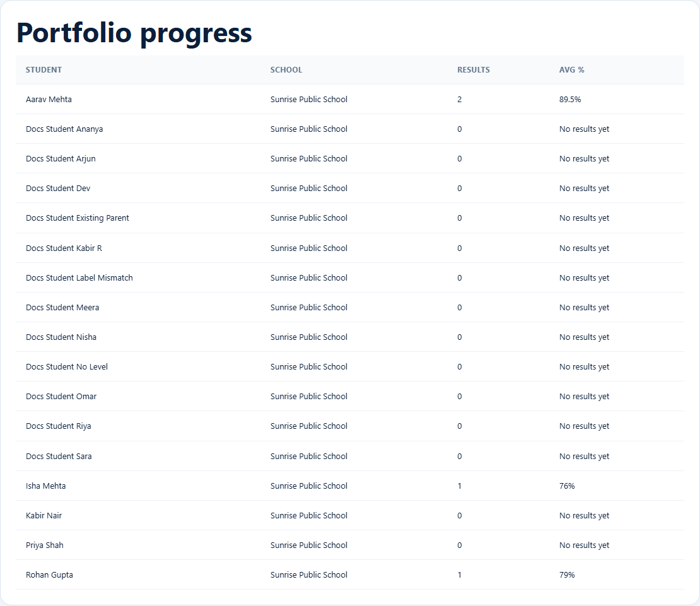

# Portfolio progress

> Doc ID: DOC-SCH-ACAD-001 · Verified on 2026-10-06 against `main` @ `ce1f07c2` · Roles: Academic Team

## Purpose
See, for every student in the schools assigned to you, how many results have been entered and their average score.

## Who Can Use This Feature
**Academic Team.**

## Prerequisites
EduSphere has assigned at least one school to you (your **school portfolio**).

## How to Access
Sidebar > **Dashboard** > **Portfolio progress** (the first card).

## Steps

### Step 1 — Open your dashboard
After signing in you land on the Academic Team dashboard. It contains, from top to bottom: **Portfolio progress**,
**Results** with **Upload a result**, **Bulk entry — results (CSV)**, **Test preparation**, **Foreign language classes**,
two more bulk-entry panels and **Students**.

### Step 2 — Read the table
**Portfolio progress** lists each student with their school, the number of results and the average percentage.

## Fields
| Column | Description |
|---|---|
| Student, School | The student and their school. |
| Results | How many results exist for the student (draft, verified and published). |
| Avg % | The average of those results, or "No results yet". |

## Expected Result
You can see which students still need results.

## Validation Messages
None.

## Common Errors
**Problem:** "No students in your portfolio yet. Contact your Overseas Admin." *(From code.)*
**Cause:** No school has been assigned to you.
**Resolution:** Ask your Overseas Admin to assign your schools.

## Tips
- The average includes results that are not published yet, so it can differ from what schools and parents see.
- The table has no search or sorting; students are listed by name.

## Related Features
- [Upload a result as Draft](acad-002-upload-a-result.md)
