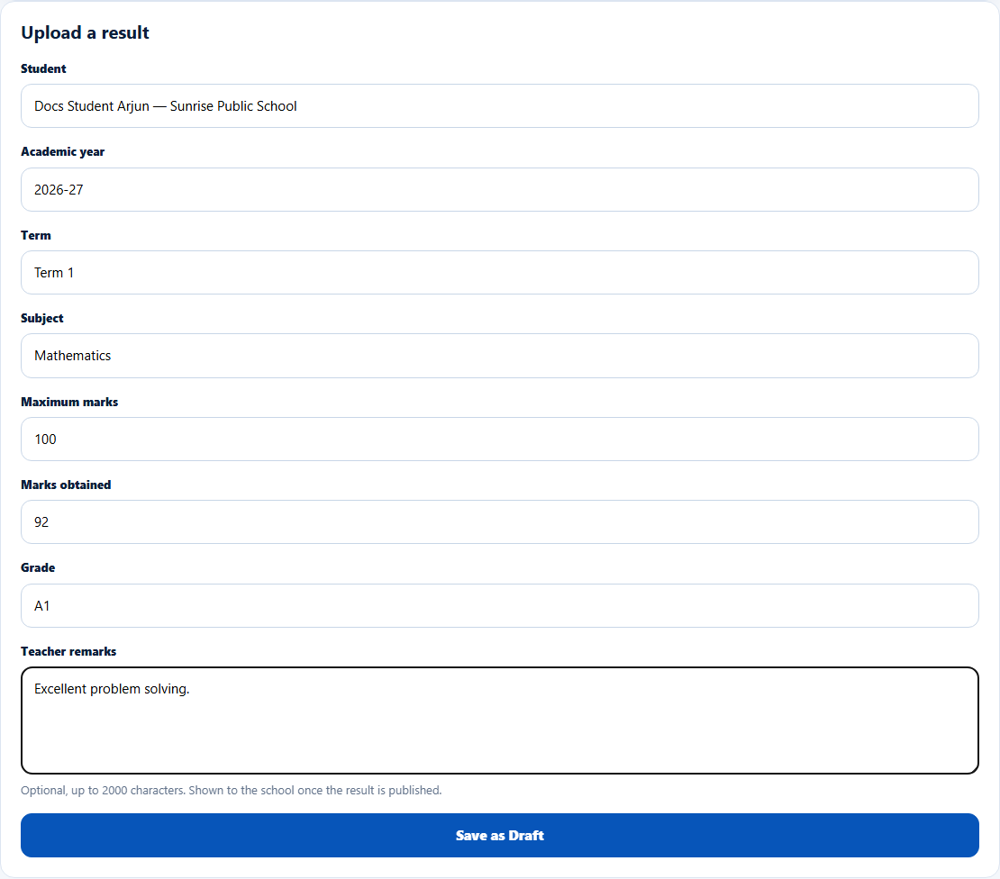
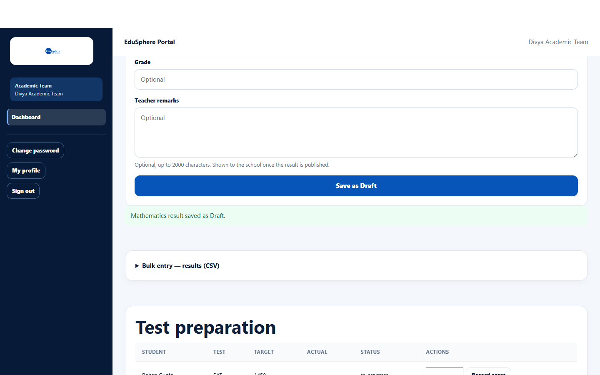

# Upload a result as Draft

> Doc ID: DOC-SCH-ACAD-002 · Verified on 2026-10-06 against `main` @ `ce1f07c2` · Roles: Academic Team

## Purpose
Enter one exam result for a student. New results start as **Draft**; a different Academic Team member must verify and
publish them before the school and parents can see them.

## Who Can Use This Feature
**Academic Team.**

## Prerequisites
The student is at a school in your school portfolio.

## How to Access
Sidebar > **Dashboard** > **Upload a result** (below the Results table).

## Steps

### Step 1 — Choose the student
In **Student**, type part of the name and pick the student from the list.

### Step 2 — Fill in the result
Fill in **Academic year**, **Term**, **Subject**, **Maximum marks** and **Marks obtained**. **Grade** and **Teacher
remarks** are optional.

### Step 3 — Save as Draft
Click **Save as Draft**. The message "{Subject} result saved as Draft." appears and the result is listed in **Results** with
status **draft**.

## Fields
| Field | Description | Required | Example |
|---|---|---|---|
| Student | Search and pick from your portfolio students. | Yes | Docs Student Arjun |
| Academic year | Up to 20 characters. | Yes | 2026-27 |
| Term | Up to 40 characters. | Yes | Term 1 |
| Subject | Up to 80 characters. | Yes | Mathematics |
| Maximum marks | Number. | Yes | 100 |
| Marks obtained | Number. | Yes | 92 |
| Grade | Up to 10 characters. | No | A1 |
| Teacher remarks | Up to 2000 characters; shown to the school once published. | No | Excellent problem solving. |

## Expected Result
A Draft result, visible only to the Academic Team.

## Validation Messages
| Message | When |
|---|---|
| Your browser asks you to choose a student / fill in the field | A required field is empty. |
| Something went wrong. | The subject (or another text) is longer than allowed — for example a 90-character subject. |

## Common Errors
**Problem:** The marks are higher than the maximum, and the result was saved anyway (for example "75/50 (150%)").
**Cause:** The single-result form does not check marks against the maximum.
**Resolution:** **Check the numbers before saving.** A Draft cannot be edited from the screen; ask EduSphere to correct
it, or have the verifier not verify it.

## Tips
- Use the same **Academic year** and **Term** wording as your colleagues (for example "2026-27" and "Term 1"), so reports
  group results correctly.
- For many results, use [bulk entry](acad-004-bulk-results.md) — it checks marks and duplicates.

## Related Features
- [Verify and publish results](acad-003-verify-and-publish-results.md)
- [Bulk entry: results](acad-004-bulk-results.md)
