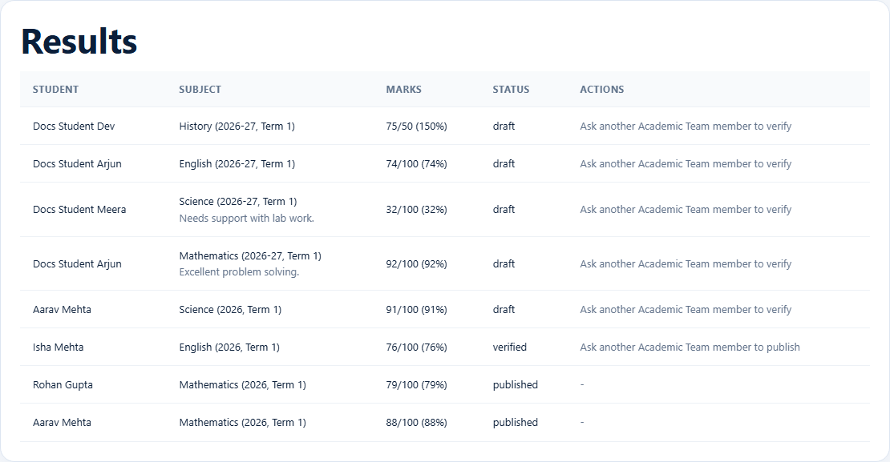
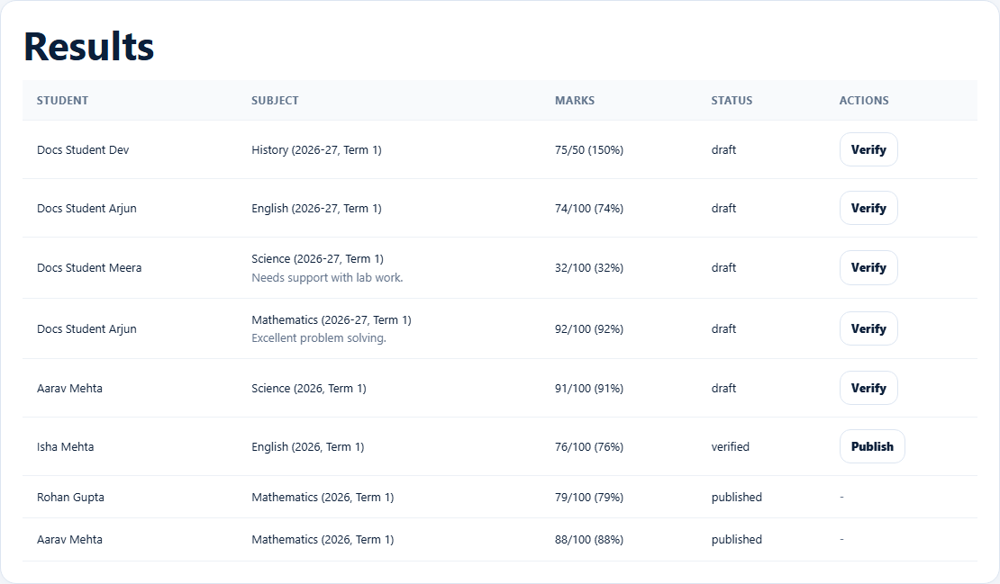
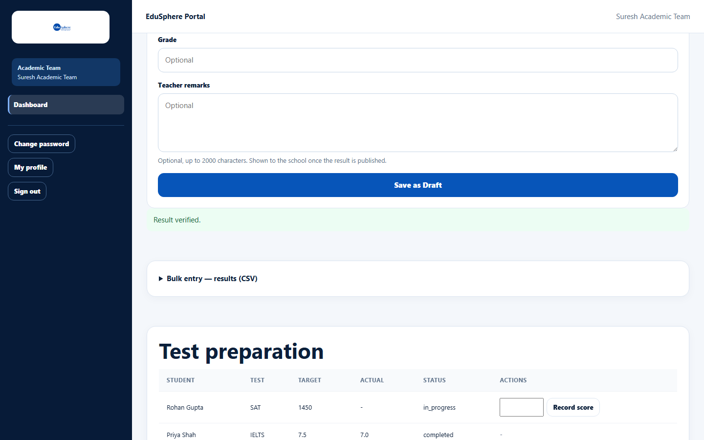
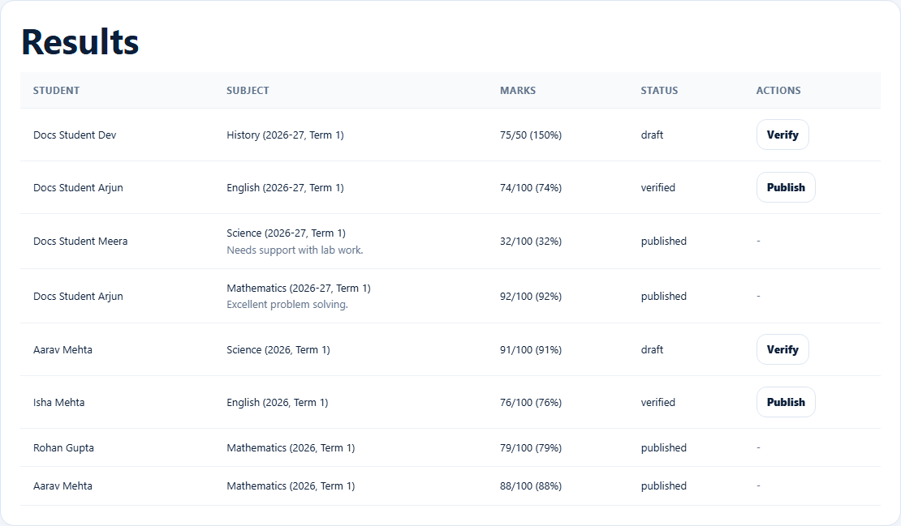

# Verify and publish results

> Doc ID: DOC-SCH-ACAD-003 · Verified on 2026-10-06 against `main` @ `ce1f07c2` · Roles: Academic Team

## Purpose
Check a colleague's Draft result (**Verify**) and release it to the school and parents (**Publish**). Two people are
always involved: you cannot verify or publish a result you uploaded yourself.

## Who Can Use This Feature
**Academic Team** members other than the one who uploaded the result.

## Prerequisites
A Draft (to verify) or Verified (to publish) result uploaded by someone else.

## How to Access
Sidebar > **Dashboard** > **Results**.

## Steps

### Step 1 — Find the result
**Results** lists results newest first with Student, Subject (year, term and remarks), Marks and Status (`draft`,
`verified`, `published`). On your own uploads the Actions column says "Ask another Academic Team member to verify" (or
"…to publish").

On a colleague's uploads you see **Verify** (for drafts) or **Publish** (for verified results).

### Step 2 — Verify
Click **Verify**. The message "Result verified." appears and the status becomes `verified`.

### Step 3 — Publish
Click **Publish** on a verified result. The message "Result published." appears and the status becomes `published`.

## Fields
None.

## Expected Result
- Published results appear on the student's page, timeline ("Academic result published") and Digital Portfolio, and in
  school reports.
- The student's parents are notified: "{Term} {Subject} result published for {name}" *(from code; parent notifications
  are checked in S10)*.

## Validation Messages
| Message | When |
|---|---|
| A different Academic Team member must perform this step -- you cannot verify or publish your own upload | Not reachable from the screen (your own rows have no buttons). *(From code.)* |

## Common Errors
**Problem:** No **Verify** or **Publish** button.
**Cause:** You uploaded the result yourself, or it is already published.
**Resolution:** Ask another Academic Team member.

## Tips
- Check the marks before verifying: the single-result form accepts marks above the maximum.
- A member who verified a result may also publish it; only the uploader is excluded.
- Draft and verified results are not visible to the school or parents.

## Related Features
- [Upload a result as Draft](acad-002-upload-a-result.md)
