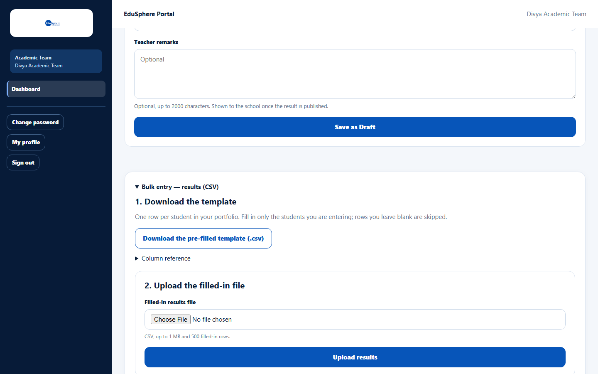
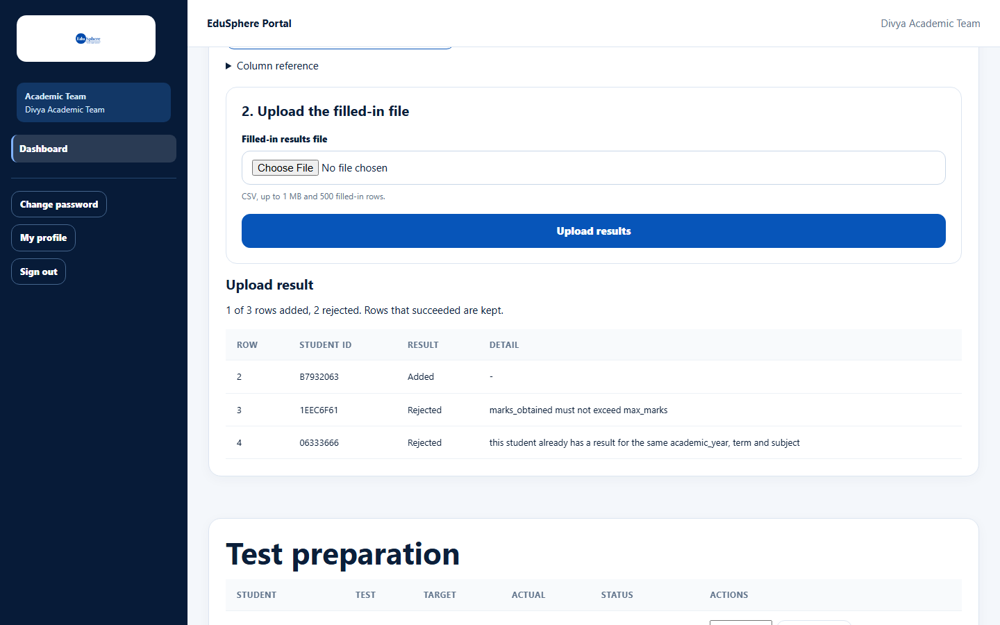

# Bulk entry: results (CSV)

> Doc ID: DOC-SCH-ACAD-004 · Verified on 2026-10-06 against `main` @ `ce1f07c2` · Roles: Academic Team

## Purpose
Enter many results at once from a spreadsheet. Each row becomes a Draft result.

## Who Can Use This Feature
**Academic Team.**

## Prerequisites
At least one school in your school portfolio.

## How to Access
Sidebar > **Dashboard** > **Bulk entry — results (CSV)** (click to open).

## Steps

### Step 1 — Download the pre-filled template
Open **Bulk entry — results (CSV)** and click **Download the pre-filled template (.csv)**. It has one row per student in
your portfolio, with **student_code**, **student_name** and **school_name** already filled in. **Column reference**
explains each column.

### Step 2 — Fill in the rows you need
Fill in academic_year, term, subject, max_marks and marks_obtained (and optionally grade, teacher_remarks) for the
students you are entering. Leave other rows blank — blank rows are skipped.

### Step 3 — Upload
Choose the file in **Filled-in results file** and click **Upload results**. The **Upload result** lists each filled-in
row as Added or Rejected with the reason. Rows that succeeded are kept.

## Fields
| Column | Required | Format |
|---|---|---|
| student_code | Yes (pre-filled) | 8-character Student ID |
| student_name, school_name | — | For reference only |
| academic_year, term, subject | Yes | Text (up to 20 / 40 / 80 characters) |
| max_marks | Yes | Above 0, up to 9999.99 |
| marks_obtained | Yes | 0 up to max_marks |
| grade | No | Up to 10 characters |
| teacher_remarks | No | Up to 2000 characters |

Limits: 1 MB and 500 filled-in rows per file.

## Expected Result
Each added row is a Draft result, ready for a colleague to verify.

## Validation Messages
Row numbers count the header as row 1, so the first student is **row 2**.

| Message | Meaning |
|---|---|
| marks_obtained must not exceed max_marks | Marks above the maximum. |
| this student already has a result for the same academic_year, term and subject | Duplicate result. |
| Choose a filled-in CSV file first. | No file chosen. *(From code.)* |
| The file has more than 500 filled-in rows / The file is larger than 1 MB | File too big. *(From code.)* |

## Common Errors
**Problem:** "The connection dropped. Upload again — the same file won't be added twice." *(From code.)*
**Cause:** Network problem.
**Resolution:** Upload the same file again.

## Tips
- Bulk entry checks marks and duplicates, unlike the single-result form.
- The same steps work for test preparation, language classes and assessments (see
  [Bulk entry: test preparation and language classes](acad-007-bulk-test-prep-and-language.md)).

## Related Features
- [Upload a result as Draft](acad-002-upload-a-result.md)
- [Verify and publish results](acad-003-verify-and-publish-results.md)
