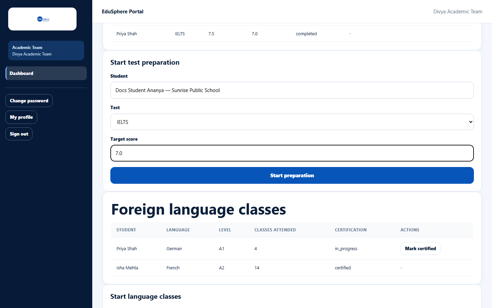
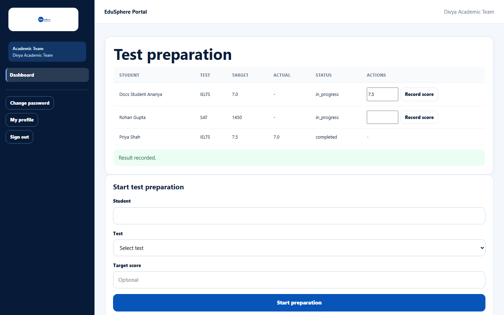

# Test preparation (IELTS / SAT)

> Doc ID: DOC-SCH-ACAD-005 · Verified on 2026-10-06 against `main` @ `ce1f07c2` · Roles: Academic Team

## Purpose
Track a student's IELTS or SAT preparation from start to final score.

## Who Can Use This Feature
**Academic Team.**

## Prerequisites
The student's school has a **Gold** or **Platinum** partnership (IELTS coaching / SAT coaching).

## How to Access
Sidebar > **Dashboard** > **Test preparation**.

## Steps

### Step 1 — Start test preparation
In **Start test preparation**, pick the **Student**, choose the **Test** (IELTS or SAT) and optionally a **Target score**.
Click **Start preparation**. The message "{IELTS|SAT} preparation started." appears and the student is listed with status
`in_progress`.

### Step 2 — Record the actual score
When the student has taken the test, type the score in the row's box and click **Record score**. The message "Result
recorded." appears, the score shows under **Actual** and the status becomes `completed`.

## Fields
| Field | Description | Required | Example |
|---|---|---|---|
| Student | Pick from your portfolio. | Yes | Docs Student Ananya |
| Test | IELTS or SAT. | Yes | IELTS |
| Target score | Up to 20 characters. | No | 7.0 |
| Actual score (row) | The score achieved. | To record | 7.5 |

## Expected Result
The test preparation appears in the student's 360° view (English Testing) and the parent is notified when it starts and
when the result is recorded *(notifications from code)*.

## Validation Messages
| Message | When |
|---|---|
| This school's {Tier} partnership does not include IELTS coaching (requires Gold or higher). | The school's tier is below Gold. *(From code; the message format was seen for other services.)* |

## Common Errors
**Problem:** Clicking **Record score** does nothing.
**Cause:** The score box is empty.
**Resolution:** Type the score first.

## Tips
- Mock-test scores cannot be recorded on this screen.
- Status values appear as `in_progress` and `completed`.

## Related Features
- [Foreign language classes](acad-006-foreign-language-classes.md)
- [Bulk entry: test preparation and language classes](acad-007-bulk-test-prep-and-language.md)
