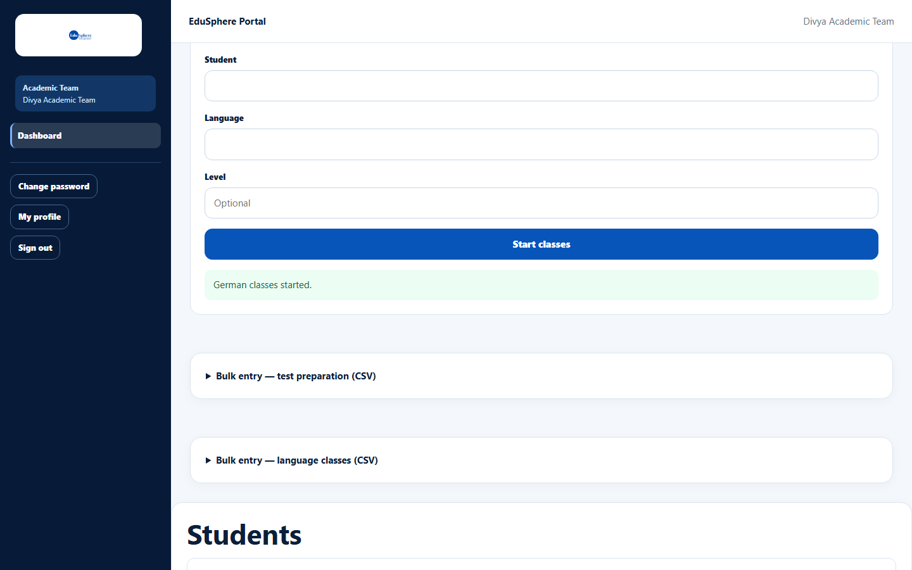
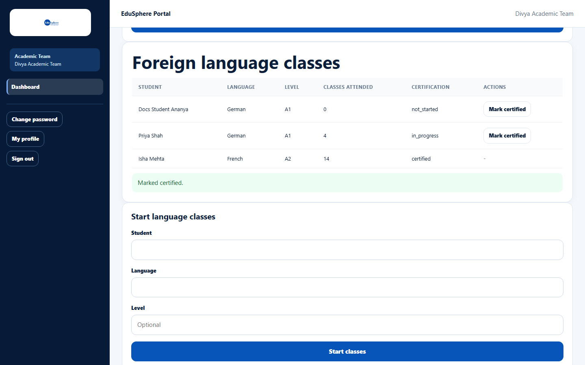

# Foreign language classes

> Doc ID: DOC-SCH-ACAD-006 · Verified on 2026-10-06 against `main` @ `ce1f07c2` · Roles: Academic Team

## Purpose
Record that a student has started classes in a foreign language and, later, that they earned the certification.

## Who Can Use This Feature
**Academic Team.**

## Prerequisites
The student's school has a **Gold** or **Platinum** partnership (Foreign language classes).

## How to Access
Sidebar > **Dashboard** > **Foreign language classes**.

## Steps

### Step 1 — Start language classes
In **Start language classes**, pick the **Student**, type the **Language** and optionally the **Level**. Click **Start
classes**. The message "{Language} classes started." appears.

### Step 2 — Mark certified
When the student passes, click **Mark certified** on the row. The message "Marked certified." appears and the
certification shows as `certified`.

## Fields
| Field | Description | Required | Example |
|---|---|---|---|
| Student | Pick from your portfolio. | Yes | Docs Student Ananya |
| Language | Up to 60 characters. | Yes | German |
| Level | Up to 30 characters. | No | A1 |

## Expected Result
The language appears in the student's 360° view (Foreign Languages) and Digital Portfolio (Languages); parents are
notified when classes start and on certification *(notifications from code)*.

## Validation Messages
| Message | When |
|---|---|
| Your browser asks you to fill in the field | Student or Language is empty. |

## Common Errors
**Problem:** **Classes attended** always shows 0.
**Cause:** Attendance for language classes cannot be entered on this screen.
**Resolution:** None needed; the certification is what counts.

## Tips
- Certification values appear as `not_started` and `certified`.

## Related Features
- [Test preparation](acad-005-test-preparation.md)
