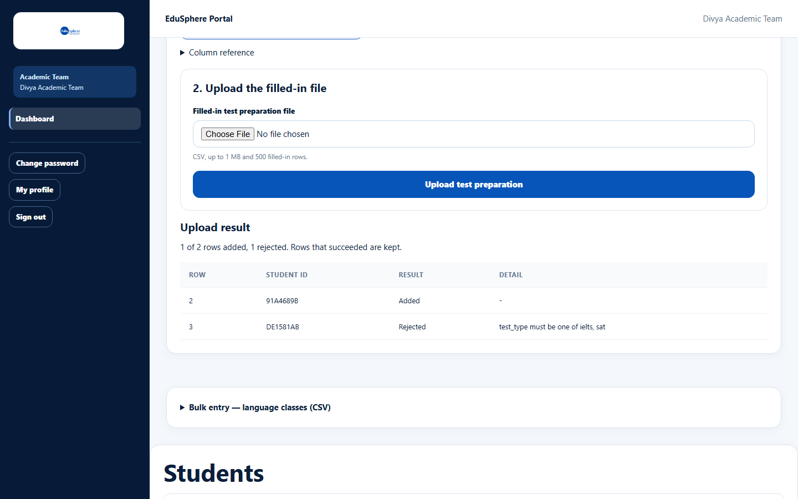

# Bulk entry: test preparation and language classes (CSV)

> Doc ID: DOC-SCH-ACAD-007 · Verified on 2026-10-06 against `main` @ `ce1f07c2` · Roles: Academic Team

## Purpose
Start test preparation or language classes for many students at once from a spreadsheet.

## Who Can Use This Feature
**Academic Team.**

## Prerequisites
At least one school in your portfolio; the schools' tiers include the service (Gold or higher).

## How to Access
Sidebar > **Dashboard** > **Bulk entry — test preparation (CSV)** or **Bulk entry — language classes (CSV)**.

## Steps

### Step 1 — Download the pre-filled template
Open the panel and click **Download the pre-filled template (.csv)**.

### Step 2 — Fill in and upload
Fill in the rows you need (see Fields), choose the file and click **Upload test preparation** (or **Upload language
classes**). The **Upload result** shows each row as Added or Rejected.

## Fields
| Panel | Columns to fill | Format |
|---|---|---|
| Test preparation | test_type (required), target_score | `ielts` or `sat`; target up to 20 characters |
| Language classes | language (required), level | Up to 60 / 30 characters |

student_code is pre-filled; student_name and school_name are for reference only. Limits: 1 MB, 500 filled-in rows.

## Expected Result
Each added row starts test preparation or language classes, exactly as the single forms do; parents are notified
after the upload *(from code)*.

## Validation Messages
| Message | Meaning |
|---|---|
| test_type must be one of ielts, sat | The test name is not ielts or sat. |

Row numbers count the header as row 1.

## Common Errors
See [Bulk entry: results](acad-004-bulk-results.md#common-errors).

## Tips
- Scores and certifications are recorded on the dashboard afterwards (**Record score**, **Mark certified**).

## Related Features
- [Test preparation](acad-005-test-preparation.md)
- [Foreign language classes](acad-006-foreign-language-classes.md)
