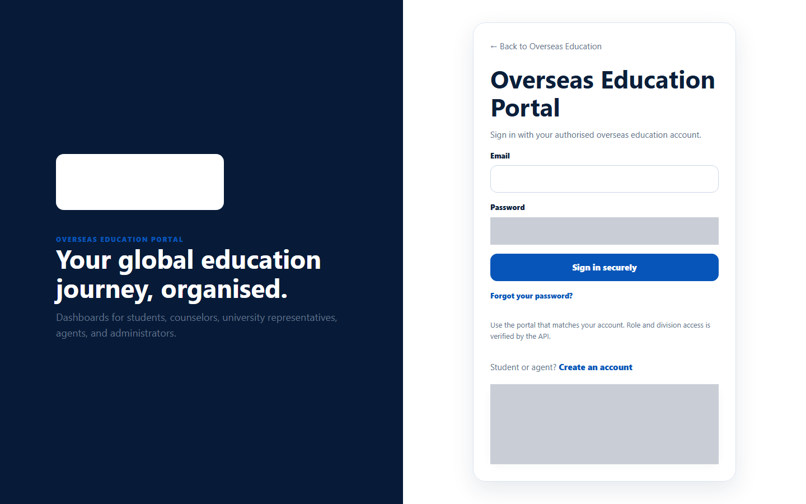
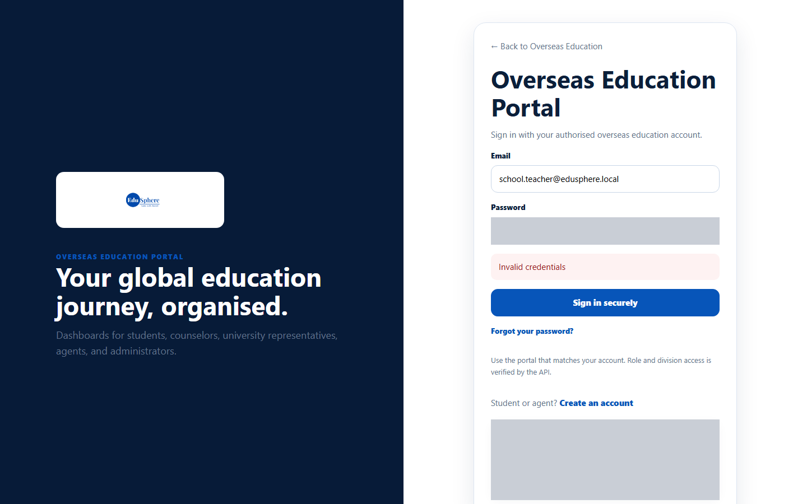
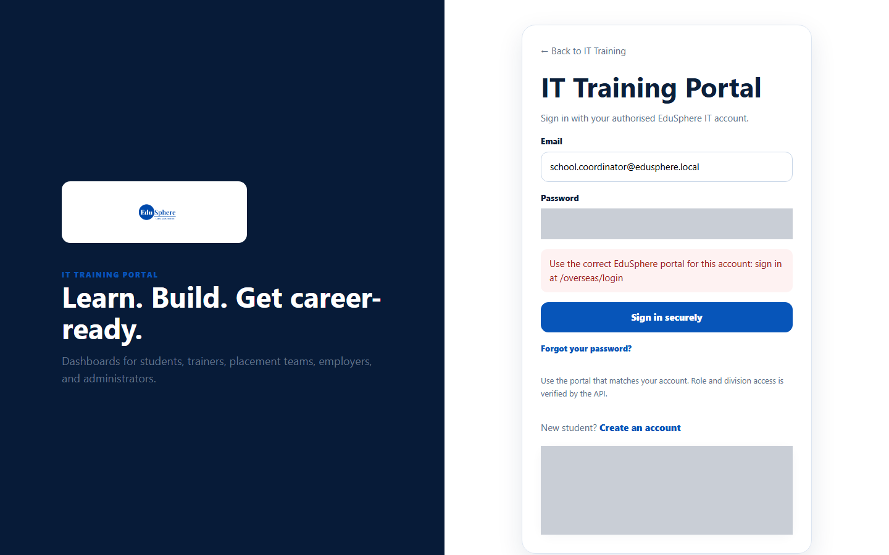

# Sign in to the School portals

> Doc ID: DOC-SCH-AUTH-001 · Verified on 2026-10-06 against `main` @ `ce1f07c2` · Roles: School Coordinator, Principal, Teacher, Parent, Academic Team, Career Counselor, Psychometric Team

## Purpose
Open your own EduSphere school portal. Every school user signs in on the **Overseas Education Portal** sign-in page;
EduSphere then takes you to the dashboard for your role.

## Who Can Use This Feature
Everyone with a school account: **School Coordinator**, **Principal**, **Teacher**, **Parent**, **Academic Team**,
**Career Counselor** and **Psychometric Team**.

## Prerequisites
- Your account has a password. New users set one first:
  - Coordinators and EduSphere specialists: [Set your first password from a welcome link](auth-003-set-your-first-password.md).
  - Principals, Teachers and Parents: [Accept a school invitation](auth-002-accept-an-invitation.md).
- Your account is active (your School Coordinator or EduSphere has not deactivated it).

## How to Access
Go to the EduSphere website and open **/overseas/login** (the "Overseas Portal" link in the site footer also leads
there).

## Steps

### Step 1 — Open the sign-in page
The page is titled **Overseas Education Portal**. It talks about overseas education, but it is also the sign-in page for
every school role.

### Step 2 — Sign in
Type your **Email** and **Password** and click **Sign in securely**.

### Step 3 — Arrive at your dashboard
EduSphere opens the dashboard for your role:

| Your role | You land on | Sidebar menu |
|---|---|---|
| School Coordinator | School Coordinator dashboard | Dashboard, Students, Promotion, Transfers, Activities, Feedback, Team, Reports, Global Education, Entitlements, Notifications |
| Principal | Principal dashboard | Dashboard, Reports, Global Education, Feedback, Entitlements, Notifications |
| Teacher | Teacher dashboard ("Your students") | Dashboard, Attendance |
| Parent | Parent dashboard ("My children") | Dashboard, Notifications |
| Academic Team | Academic Team dashboard | Dashboard |
| Career Counselor | Career Counselor dashboard | Dashboard, Skills, Funding |
| Psychometric Team | Psychometric Team dashboard | Dashboard |

## Fields
| Field | Description | Required | Example |
|---|---|---|---|
| Email | The email your account was created with. | Yes | coordinator@school.example |
| Password | Your password. | Yes | (your password) |

## Expected Result
You see your role's dashboard, with your role and name at the top of the sidebar.

## Validation Messages
| Message | When |
|---|---|
| Invalid credentials | The email or password is wrong, **or** the account has been deactivated. |
| Use the correct EduSphere portal for this account: sign in at /overseas/login | You signed in on the IT Training portal (/it/login) with a school account. |

## Common Errors
**Problem:** "Invalid credentials" although you are sure of your password.
**Cause:** Your account may have been deactivated. The message is the same for a wrong password and a deactivated
account.
**Resolution:** Try [Forgot your password?](auth-004-forgot-password.md). If that does not help, ask your School
Coordinator (Principals, Teachers, Parents) or EduSphere (Coordinators and specialists) whether your account is active.

**Problem:** "Use the correct EduSphere portal for this account…".
**Cause:** You used the IT Training sign-in page.
**Resolution:** Sign in at **/overseas/login**.

## Tips
- A sign-in does not last forever; when it ends you see "Access unavailable — Not authenticated" (see
  [Sign out and session expiry](auth-007-sign-out-and-session-expiry.md)).
- The demo-accounts box on the sign-in page (development servers only) lists overseas accounts, not school ones.

## Related Features
- [Accept a school invitation](auth-002-accept-an-invitation.md)
- [Set your first password from a welcome link](auth-003-set-your-first-password.md)
- [Forgot your password](auth-004-forgot-password.md)
- ["Access unavailable" messages](auth-008-access-unavailable.md)
- [Find your way around](auth-009-find-your-way-around.md)
