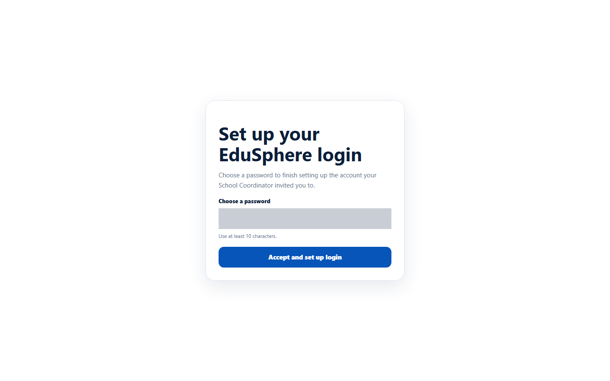
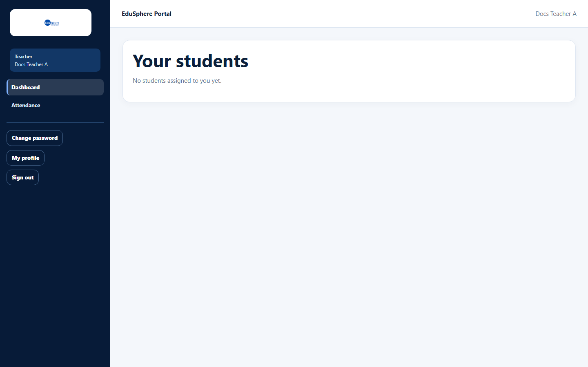
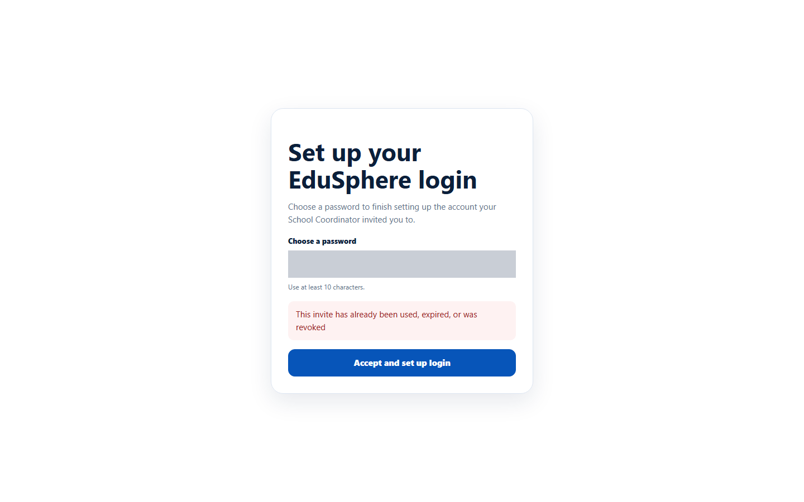

# Accept a school invitation and set up your login

> Doc ID: DOC-SCH-AUTH-002 · Verified on 2026-10-06 against `main` @ `ce1f07c2` · Roles: Principal, Teacher, Parent (invited)

## Purpose
Create your EduSphere login after your School Coordinator invites you as a **Principal**, **Teacher** or **Parent**.

## Who Can Use This Feature
A person who has received the invitation email. You choose only a password — your name, email and role come from the
invitation.

## Prerequisites
- An email titled **"You're invited to join {school} on EduSphere"**.
- The invitation is less than 7 days old and has not been used.

## How to Access
Open the link in the invitation email. It opens the page **Set up your EduSphere login**.

## Steps

### Step 1 — Open the invitation link
Click the link in the email.

### Step 2 — Choose a password
Type a password of at least 10 characters in **Choose a password** and click **Accept and set up login**.

### Step 3 — Start using EduSphere
You are signed in straight away and taken to your dashboard (no separate message is shown). Next time, sign in at
**/overseas/login** with your email and this password.

## Fields
| Field | Description | Required | Example |
|---|---|---|---|
| Choose a password | Your new password; at least 10 characters. | Yes | (your password) |

## Expected Result
Your account exists, you are signed in, and you see your role's dashboard. A Teacher with no students yet sees "No
students assigned to you yet."

## Validation Messages
| Message | When |
|---|---|
| Your browser asks for a longer password | The password has fewer than 10 characters. |
| This invite has already been used, expired, or was revoked | The link was already used, or is more than 7 days old. |
| Email already exists | An EduSphere account with this email already exists. *(From code.)* |

## Common Errors
**Problem:** "This invite has already been used, expired, or was revoked".
**Cause:** You (or someone using your email) already accepted it, or 7 days have passed.
**Resolution:** If you already set a password, [sign in](auth-001-sign-in.md) or use
[Forgot your password?](auth-004-forgot-password.md). Otherwise ask your School Coordinator to invite you again.

**Problem:** You never received the invitation email.
**Cause:** The email went to spam, or the school's email could not be sent (the Coordinator then sees "share the link
manually").
**Resolution:** Ask your School Coordinator.

## Tips
- Keep the invitation email until you have signed in once; the link works only once.
- VERIFICATION REQUIRED: the screen shown for an invitation older than 7 days was not tested; the code returns the same
  message as for a used invitation.

## Related Features
- [Sign in](auth-001-sign-in.md)
- [Invite a Principal, Teacher or Parent](../team/team-001-invite-a-team-member.md) (Coordinator side)
