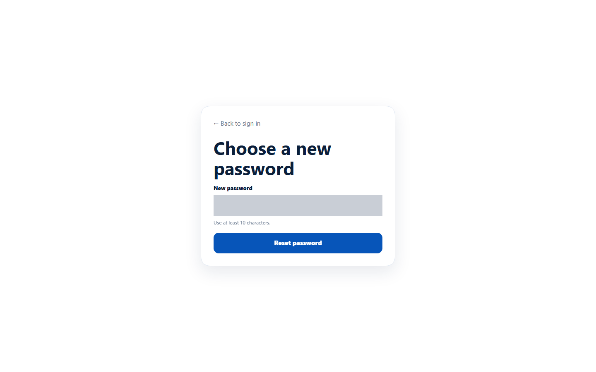
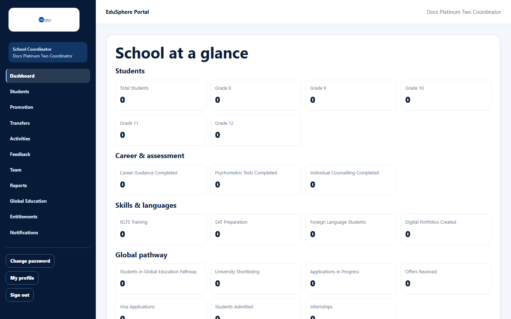
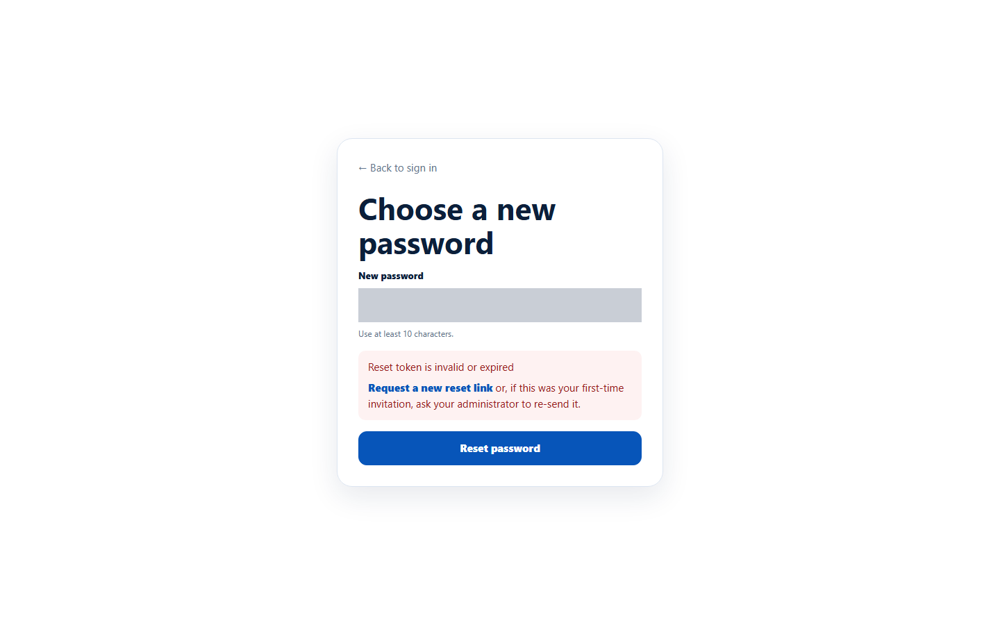
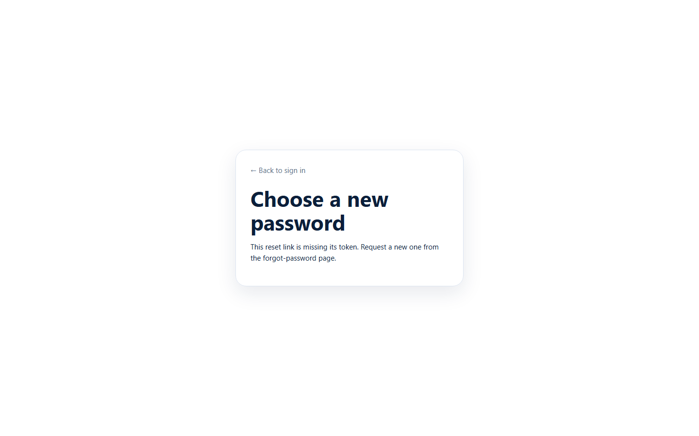

# Set your first password from a welcome link

> Doc ID: DOC-SCH-AUTH-003 · Verified on 2026-10-06 against `main` @ `ce1f07c2` · Roles: School Coordinator, Academic Team, Career Counselor, Psychometric Team

## Purpose
Choose your password the first time, after EduSphere creates your account as a **School Coordinator** or as an
EduSphere school specialist (**Academic Team**, **Career Counselor**, **Psychometric Team**).

## Who Can Use This Feature
New School Coordinators and school specialists.

## Prerequisites
An email titled **"Welcome to EduSphere -- set your password"**, less than 72 hours old.

## How to Access
Open the link in the welcome email. It opens the page **Choose a new password**.

## Steps

### Step 1 — Open the link
Click the link in the welcome email.

### Step 2 — Choose your password
Type a password of at least 10 characters in **New password** and click **Reset password**.

### Step 3 — Sign in
You are taken to the sign-in page. Sign in with your email and the new password (see [Sign in](auth-001-sign-in.md)).
EduSphere opens your dashboard.

## Fields
| Field | Description | Required | Example |
|---|---|---|---|
| New password | 10 to 128 characters. | Yes | (your password) |

## Expected Result
Your password is set and you can sign in. A new school's dashboard shows zeros until students are added.

## Validation Messages
| Message | When |
|---|---|
| Reset token is invalid or expired — "Request a new reset link or, if this was your first-time invitation, ask your administrator to re-send it." | The link was already used, is older than 72 hours, or was replaced by a newer link. |
| This reset link is missing its token. Request a new one from the forgot-password page. | The address was cut short (for example copied without its end). |
| Password must be at least 10 characters / at most 128 characters | The password length is wrong. *(From code.)* |

## Common Errors
**Problem:** "Reset token is invalid or expired".
**Cause:** More than 72 hours have passed, the link was already used, or an administrator sent you a newer link (only the
newest works — *from code*).
**Resolution:** Ask your Overseas Admin to re-send the link, then use the newest email.

## Tips
- The welcome page is the same page used for password resets, which is why its button says **Reset password**.

## Related Features
- [Sign in](auth-001-sign-in.md)
- [Forgot your password](auth-004-forgot-password.md)
- Admin manual: [Re-send a set-password link](../../admin-manual/sadm-010-resend-set-password-link.md)
