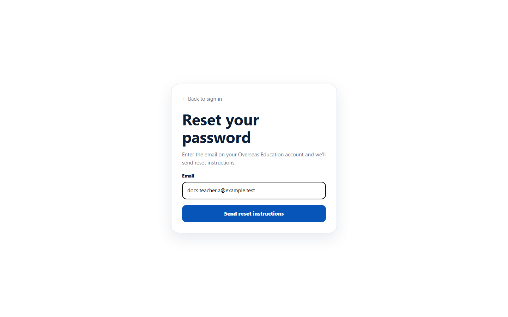

# Forgot your password

> Doc ID: DOC-SCH-AUTH-004 · Verified on 2026-10-06 against `main` @ `ce1f07c2` · Roles: all school roles

## Purpose
Ask for a link to choose a new password when you have forgotten yours.

## Who Can Use This Feature
Any school user with an active account.

## Prerequisites
Your account is active and already has a password. (New users who never set a password use their welcome or invitation
link instead.)

## How to Access
Sign-in page > **Forgot your password?** (opens **/overseas/forgot-password**).

## Steps

### Step 1 — Request instructions
Type your **Email** and click **Send reset instructions**.

The page always answers: "If an account exists for that email, we've sent instructions to reset the password." — even
when the email is unknown, so nobody can use this page to find out who has an account.

### Step 2 — Open the reset link and choose a new password
Open the reset link you receive. On **Choose a new password**, type a new password (10 to 128 characters) and click
**Reset password**. You are taken to the sign-in page.

### Step 3 — Sign in
Sign in with your new password.

## Fields
| Field | Description | Required | Example |
|---|---|---|---|
| Email | The email of your account. | Yes | teacher@school.example |
| New password | 10 to 128 characters. | Yes | (your password) |

## Expected Result
Your password is changed and you can sign in with it. A reset link works for **30 minutes** and only once *(from
code)*.

## Validation Messages
| Message | When |
|---|---|
| If an account exists for that email, we've sent instructions to reset the password. | Always, after **Send reset instructions**. |
| Reset token is invalid or expired | The link was already used, is older than 30 minutes, or you changed your password after requesting it. |

## Common Errors
**Problem:** No reset email arrives.
**Cause:** On the documentation server no reset email was sent at all: reset instructions are delivered through a
separate EduSphere message service that must be set up by EduSphere (VERIFICATION REQUIRED for your environment).
Deactivated accounts also never receive one.
**Resolution:** Check spam, wait a few minutes, then contact your administrator — your School Coordinator (Principals,
Teachers, Parents) or EduSphere's Overseas Admin (Coordinators and specialists). An Overseas Admin can also re-send a
set-password link to accounts that never set a password.

**Problem:** "Reset token is invalid or expired".
**Cause:** More than 30 minutes passed, the link was already used, or you changed your password since.
**Resolution:** Request a new link and use it straight away. (Requesting another link does not cancel earlier ones;
each link works for 30 minutes.)

## Tips
- If you know your current password and only want to change it, use
  [Change your password](auth-005-change-password.md) instead.

## Related Features
- [Sign in](auth-001-sign-in.md)
- [Set your first password from a welcome link](auth-003-set-your-first-password.md)
- [Change your password](auth-005-change-password.md)
