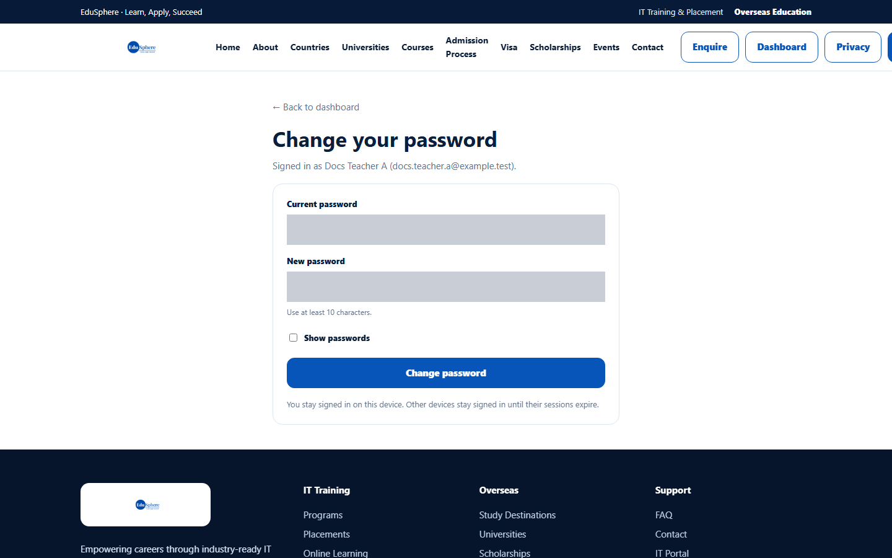
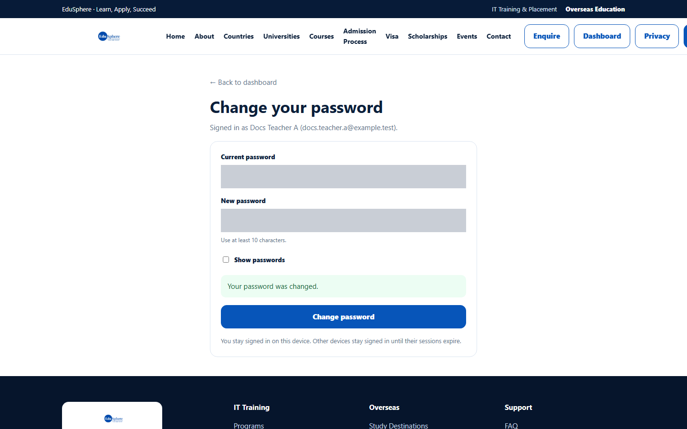
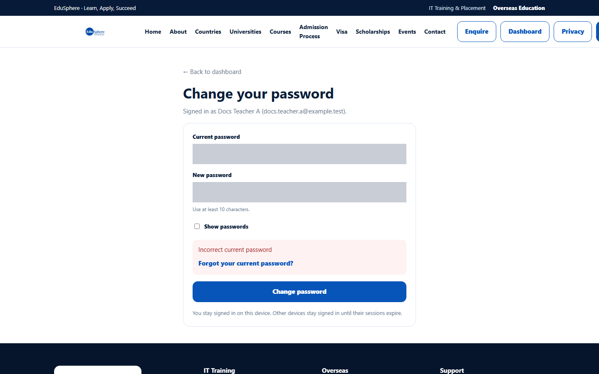

# Change your password

> Doc ID: DOC-SCH-AUTH-005 · Verified on 2026-10-06 against `main` @ `ce1f07c2` · Roles: all school roles

## Purpose
Replace your password with a new one while you are signed in.

## Who Can Use This Feature
Any signed-in school user.

## Prerequisites
You know your current password. (If not, use [Forgot your password](auth-004-forgot-password.md).)

## How to Access
Sidebar footer > **Change password**. The page opens in the public website layout, with **← Back to dashboard** at the
top.

## Steps

### Step 1 — Fill in the form
Type your **Current password** and your **New password** (at least 10 characters). Tick **Show passwords** if you want to
check what you typed.

### Step 2 — Save
Click **Change password**. The message "Your password was changed." appears.

## Fields
| Field | Description | Required | Example |
|---|---|---|---|
| Current password | The password you use now. | Yes | (current password) |
| New password | 10 to 128 characters, different from the current one. | Yes | (new password) |
| Show passwords | Shows both passwords as plain text. | No | — |

## Expected Result
Use the new password the next time you sign in. You stay signed in on this device; other devices stay signed in until
their sessions end.

## Validation Messages
| Message | When |
|---|---|
| Incorrect current password (with a **Forgot your current password?** link) | The current password is wrong. |
| New password must be different from the current password | Both passwords are the same. *(From code.)* |
| Password must not consist only of spaces | The new password is only spaces. *(From code.)* |
| Too many incorrect attempts. Try again in … | Five wrong current passwords within 15 minutes. *(From code.)* |

## Common Errors
**Problem:** "Incorrect current password".
**Cause:** The current password was mistyped.
**Resolution:** Type it again, or click **Forgot your current password?**.

**Problem:** "Your session has expired. Sign in again to change your password." *(From code.)*
**Cause:** Your sign-in ended.
**Resolution:** Sign in again and repeat.

## Tips
- Changing your password also cancels any reset links you requested earlier *(from code)*.

## Related Features
- [Forgot your password](auth-004-forgot-password.md)
- [My profile and notification settings](auth-006-my-profile.md)
