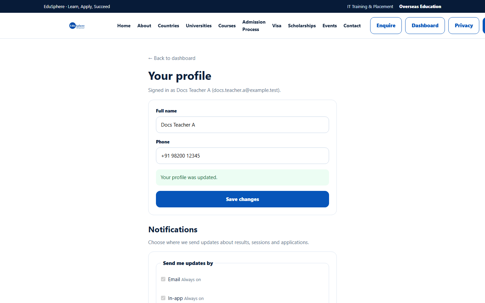
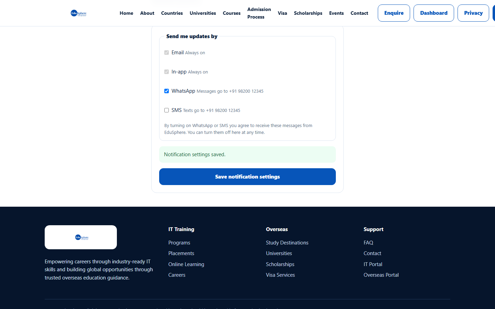

# My profile and notification settings

> Doc ID: DOC-SCH-AUTH-006 · Verified on 2026-10-06 against `main` @ `ce1f07c2` · Roles: all school roles

## Purpose
Keep your name and phone number up to date, and choose whether EduSphere may also send you updates by WhatsApp or SMS.

## Who Can Use This Feature
Any signed-in school user.

## Prerequisites
You are signed in.

## How to Access
Sidebar footer > **My profile**. The page opens in the public website layout, with **← Back to dashboard** at the top.

## Steps

### Step 1 — Update your details
Change **Full name** or **Phone** and click **Save changes**. The message "Your profile was updated." appears.

### Step 2 — Choose notification channels
Under **Notifications** ("Choose where we send updates about results, sessions and applications"), **Email** and
**In-app** are always on. Tick **WhatsApp** and/or **SMS** to receive updates there too; the line next to each shows the
number they go to. Click **Save notification settings**. The message "Notification settings saved." appears.

## Fields
| Field | Description | Required | Example |
|---|---|---|---|
| Full name | Your name as shown to others. 2–160 characters. | Yes | Docs Teacher A |
| Phone | Your mobile number. Needed for WhatsApp/SMS. | No | +91 98200 12345 |
| Email / In-app | Always on; cannot be turned off. | — | — |
| WhatsApp | Also send updates by WhatsApp. | No | ticked |
| SMS | Also send updates by SMS. | No | not ticked |

Your email address cannot be changed here.

## Expected Result
Your details and channel choices are saved. By ticking WhatsApp or SMS you agree to receive those messages; you can turn
them off here at any time.

## Validation Messages
| Message | When |
|---|---|
| Add a mobile number in your profile above to turn on WhatsApp or SMS. | You have no phone number saved. *(From code.)* |
| Add a valid mobile number to your profile first | The saved number cannot be used for WhatsApp/SMS. *(From code.)* |
| Couldn't save your settings. Check your connection and try again. | The settings could not be saved. *(From code.)* |

## Common Errors
**Problem:** WhatsApp and SMS cannot be ticked.
**Cause:** No valid mobile number is saved.
**Resolution:** Enter your **Phone**, click **Save changes**, then tick the channel.

## Tips
- Save the phone number first; the WhatsApp/SMS boxes unlock after the profile is saved.
- VERIFICATION REQUIRED: whether WhatsApp and SMS messages are actually delivered depends on how EduSphere has set up
  those services (they were not active on the documentation server).

## Related Features
- [Change your password](auth-005-change-password.md)
