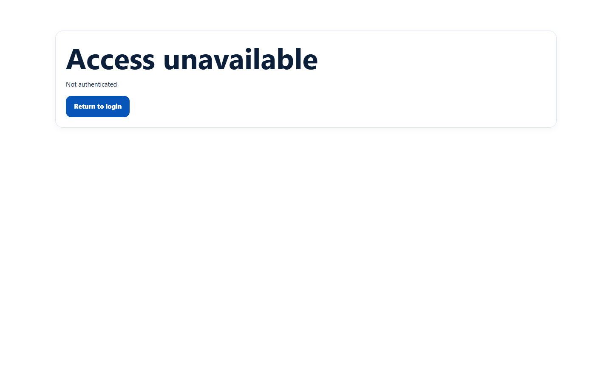
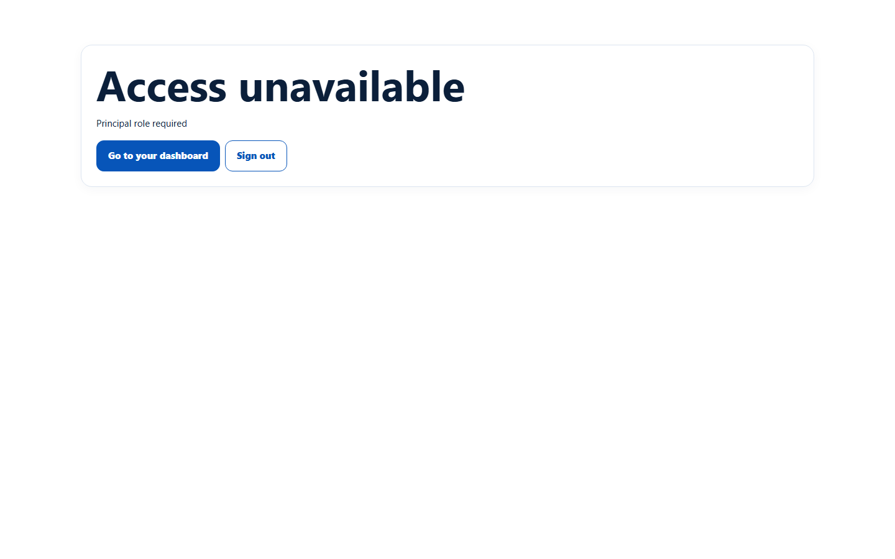
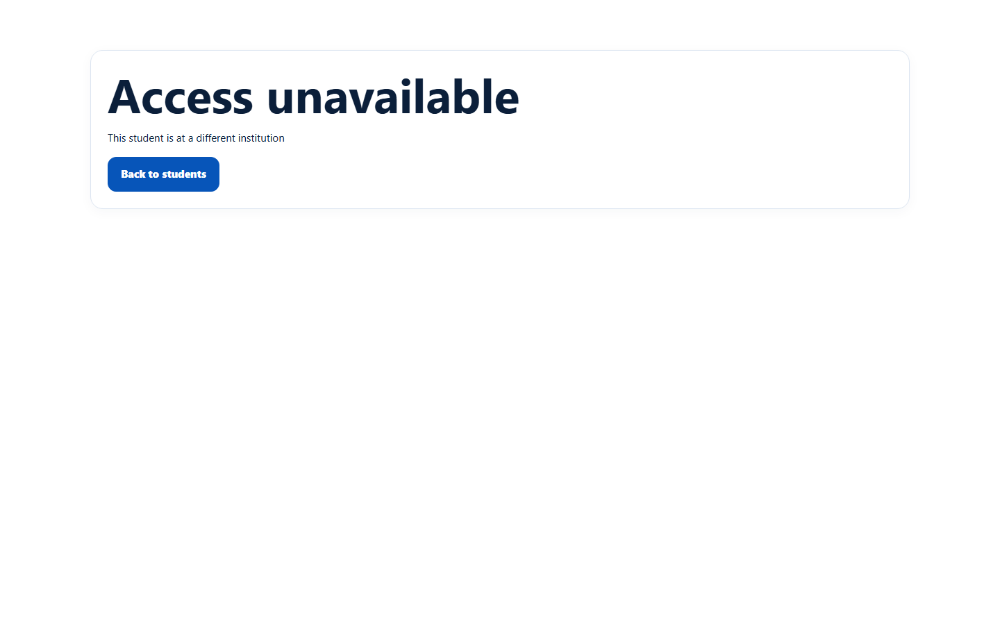
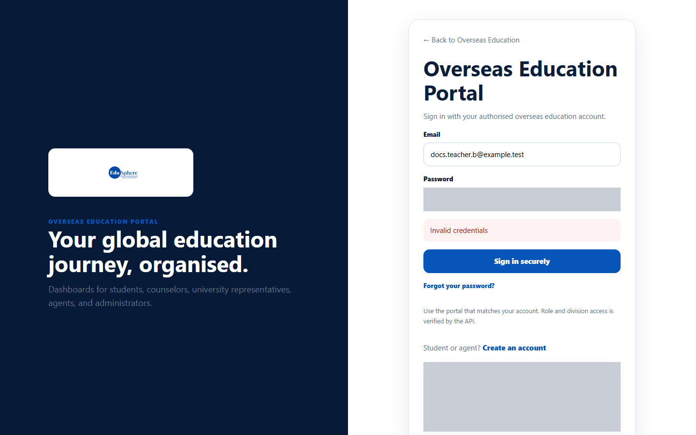

# "Access unavailable" messages

> Doc ID: DOC-SCH-AUTH-008 · Verified on 2026-10-06 against `main` @ `ce1f07c2` · Roles: all school roles

## Purpose
Understand why EduSphere shows **Access unavailable** and what to do next.

## Who Can Use This Feature
Any school user.

## Prerequisites
None.

## How to Access
The message appears instead of a page you tried to open.

## What the messages mean
| You see | Why | What to do |
|---|---|---|
| **Access unavailable — Not authenticated** with **Return to login** | You are signed out, or your session ended. | Click **Return to login** and sign in. |
| **Access unavailable — {Role} role required** (for example "Principal role required") with **Go to your dashboard** and **Sign out** | The page belongs to another role. | Click **Go to your dashboard**. |
| **Access unavailable — This student is at a different institution** with **Back to students** | The student belongs to another school. | Go back; you can only open your own school's students. |
| **Invalid credentials** on the sign-in page | Wrong email or password, or your account has been deactivated. | See [Sign in](auth-001-sign-in.md). |

## Steps

### Step 1 — Signed out
Opening a portal page without being signed in shows "Not authenticated".

### Step 2 — Another role's page
A Teacher opening a Principal page sees "Principal role required".

### Step 3 — Another school's student
A Coordinator opening a student from a different school sees "This student is at a different institution".

### Step 4 — Deactivated account
A deactivated user cannot sign in; the sign-in page says only "Invalid credentials".

## Fields
None.

## Expected Result
You understand the reason and can return to a page you are allowed to use.

## Validation Messages
See the table above.

## Common Errors
**Problem:** You think you should be able to see the page.
**Cause:** Your role or school does not match the page, or your account was deactivated.
**Resolution:** School staff and parents: ask your School Coordinator. Coordinators and EduSphere specialists: ask your
Overseas Admin.

## Tips
- Similar messages exist for other cases, for example "This student is not assigned to you" (Teachers) and "This
  student is not linked to your account" (Parents) *(from code; documented with those pages in later sessions)*.
- Some pages of another role may open instead of showing this message, but they only ever show your own data. Use the
  pages in your own sidebar.

## Related Features
- [Sign in](auth-001-sign-in.md)
- [Sign out and session expiry](auth-007-sign-out-and-session-expiry.md)
- [Deactivate or reactivate a team account](../team/team-003-deactivate-or-reactivate.md)
