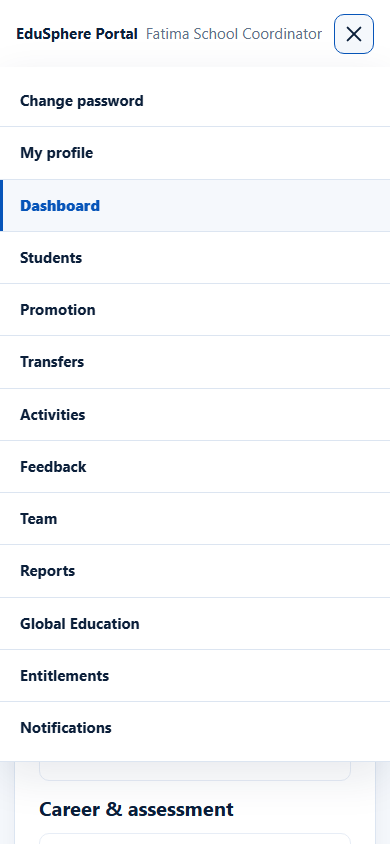

# Find your way around

> Doc ID: DOC-SCH-AUTH-009 · Verified on 2026-10-06 against `main` @ `ce1f07c2` · Roles: all school roles

## Purpose
Learn the parts of the school portal screen that are the same for every role.

## Who Can Use This Feature
Every school user.

## Prerequisites
You are signed in.

## How to Access
Every portal page.

## Steps

### Step 1 — The sidebar (wide screens)
On the left:
1. The EduSphere logo (links to the website home page).
2. Your **role** and **name** (for example "School Coordinator — Docs Platinum Two Coordinator").
3. Your role's pages. The page you are on is highlighted.
4. **Change password**, **My profile** and **Sign out** at the bottom.

The top bar shows **EduSphere Portal** and your name.

### Step 2 — The menu (phones and narrow windows)
When the window is narrower than about 980 pixels *(from code; seen at 390 pixels)*, the sidebar is replaced by a menu button (**Open menu**) at the top
right. It lists **Change password**, **My profile** and your role's pages.

## Pages per role
| Role | Sidebar pages |
|---|---|
| School Coordinator | Dashboard, Students, Promotion, Transfers, Activities, Feedback, Team, Reports, Global Education, Entitlements, Notifications |
| Principal | Dashboard, Reports, Global Education, Feedback, Entitlements, Notifications |
| Teacher | Dashboard, Attendance |
| Parent | Dashboard, Notifications |
| Academic Team | Dashboard |
| Career Counselor | Dashboard, Skills, Funding |
| Psychometric Team | Dashboard |

## Fields
None.

## Expected Result
You can reach every page your role uses.

## Validation Messages
None.

## Common Errors
**Problem:** No **Sign out** on a phone.
**Cause:** The narrow-screen menu does not include it.
**Resolution:** See [Sign out and session expiry](auth-007-sign-out-and-session-expiry.md).

## Tips
- Pages opened from inside another page (for example a student's profile) do not highlight anything in the sidebar
  *(from code)*. Use the page's own **Back** button or the sidebar to return.
- **Change password** and **My profile** open in the public website layout; use **← Back to dashboard** to return.

## Related Features
- [Sign in](auth-001-sign-in.md)
- [My profile and notification settings](auth-006-my-profile.md)
