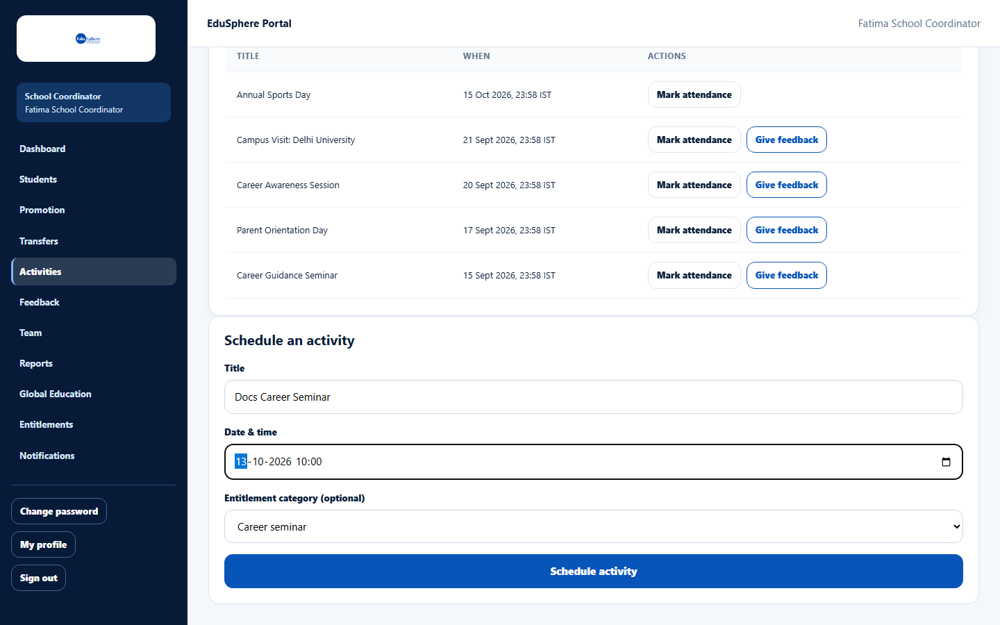
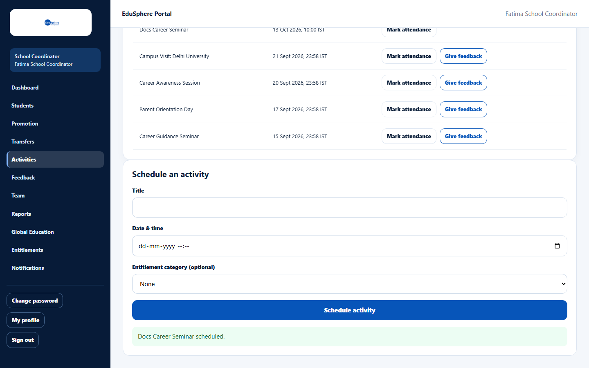
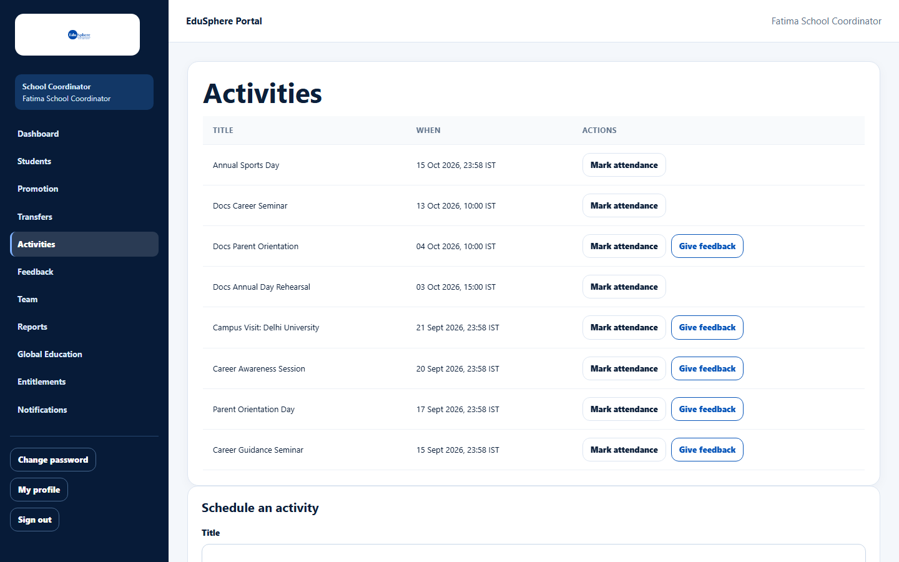
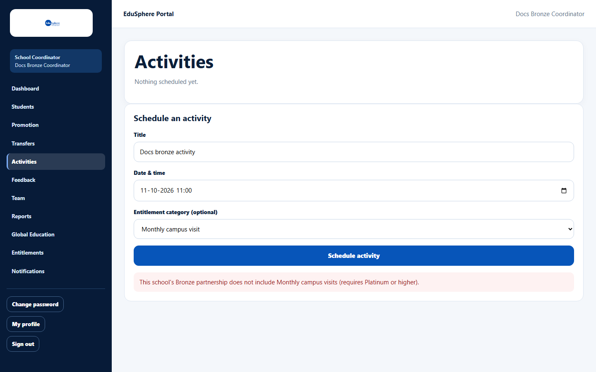
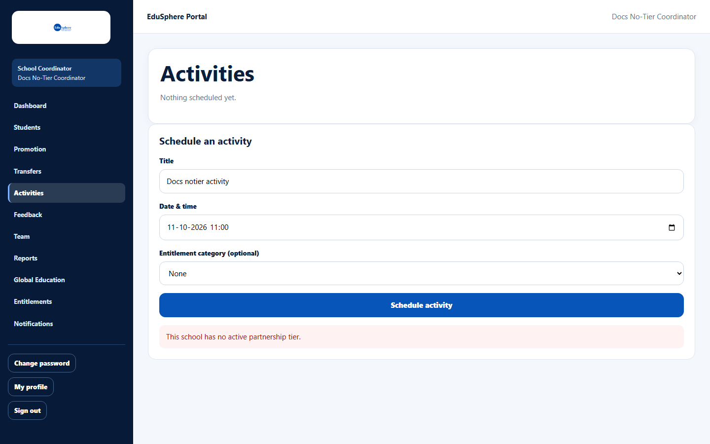
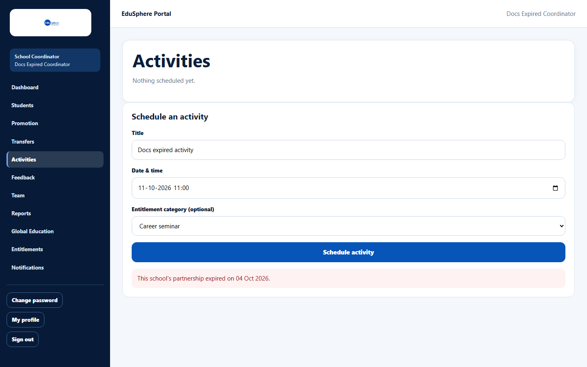

# Schedule an activity

> Doc ID: DOC-SCH-ACT-001 · Verified on 2026-10-06 against `main` @ `ce1f07c2` · Roles: School Coordinator

## Purpose
Put a school event on the calendar — for example an EduSphere career seminar or a parent orientation — so parents are
told about it and you can record attendance and feedback afterwards.

## Who Can Use This Feature
**School Coordinator.**

## Prerequisites
Your school has an active partnership tier. EduSphere activity types (career seminar, career awareness session, parent
orientation, monthly campus visit) must be included in your tier (see [Partnership tiers explained](../entitlements/ent-002-partnership-tiers-explained.md)).

## How to Access
Sidebar > **Activities** > **Schedule an activity** (below the activities list).

## Steps

### Step 1 — Fill in the activity
Type the **Title**, choose the **Date & time** and, for an EduSphere activity, an **Entitlement category (optional)**.

### Step 2 — Schedule it
Click **Schedule activity**. The message "{Title} scheduled." appears and the activity is added to the list.

### Step 3 — Check the list
**Activities** lists every activity, newest first, with its date and time in IST and the actions **Mark attendance**
and, for EduSphere activities that have taken place, **Give feedback**.

## Fields
| Field | Description | Required | Example |
|---|---|---|---|
| Title | Name of the activity. | Yes | Career Seminar for Grade 10 |
| Date & time | When it takes place (your local time). | Yes | 13-10-2026 10:00 |
| Entitlement category (optional) | None, Career seminar, Student career awareness session, Parent orientation or Monthly campus visit. Choose one for EduSphere activities; it counts toward your partnership usage and allows feedback later. | No | Career seminar |

## Expected Result
- The activity appears in the list, and on your dashboard's **Upcoming activities** while it is in the future *(dashboard: from code, verified in S10)*.
- **Every linked parent at your school** receives a notification "Upcoming session: {title}".

## Validation Messages
| Message | When |
|---|---|
| This school's {Tier} partnership does not include {service} (requires {Tier} or higher). | The chosen category is not in your tier (for example a Monthly campus visit on Bronze). |
| This school has no active partnership tier. | Your school has no tier. |
| This school's partnership expired on {date}. | Your tier has expired. |
| Something went wrong. | The title is very long (over 200 characters). |

## Common Errors
**Problem:** One of the partnership messages above.
**Cause:** Your school's tier does not allow this activity.
**Resolution:** Choose another category, or ask your Overseas Admin about the partnership.

## Tips
- Activities cannot be edited, cancelled or deleted after scheduling. Check the date before you click.
- Past dates are accepted, so you can record an activity after it happened.
- The activity type is not shown in the list; use clear titles.
- The notification parents receive shows the time **in UTC, not IST** (for example a 10:00 IST session is shown as
  04:30). Mention the time in IST in the title or tell parents separately.

## Related Features
- [Mark attendance for an activity](act-002-mark-activity-attendance.md)
- [Give feedback on a completed activity](act-003-give-activity-feedback.md)
