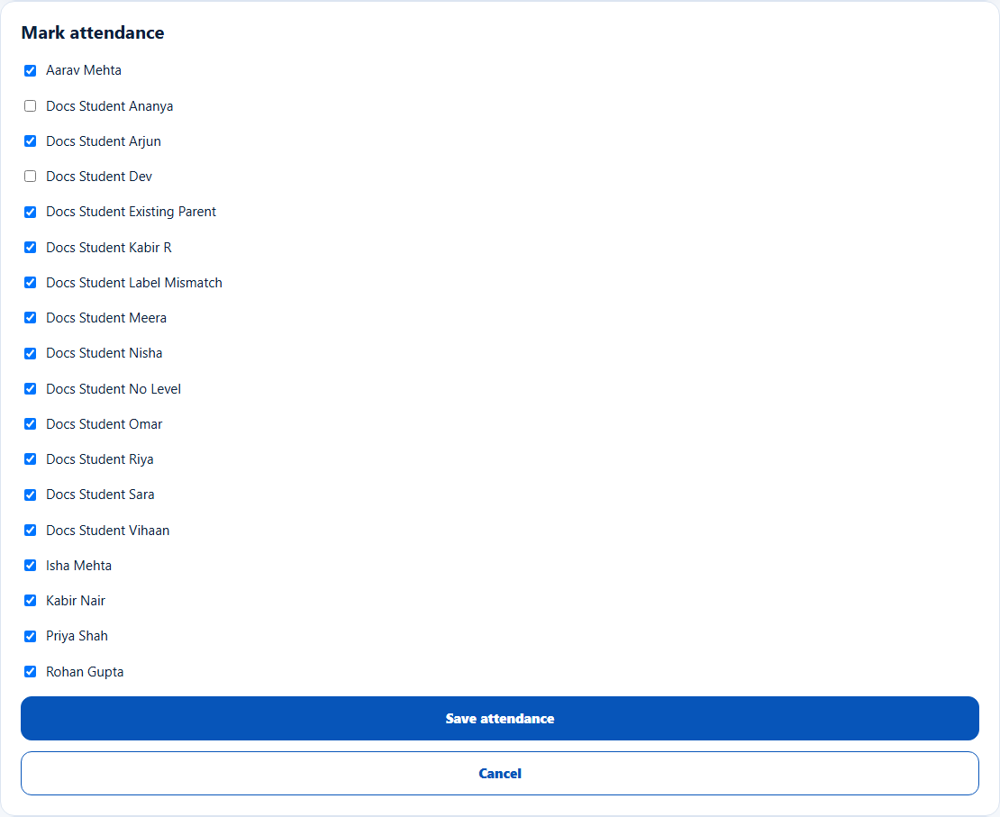
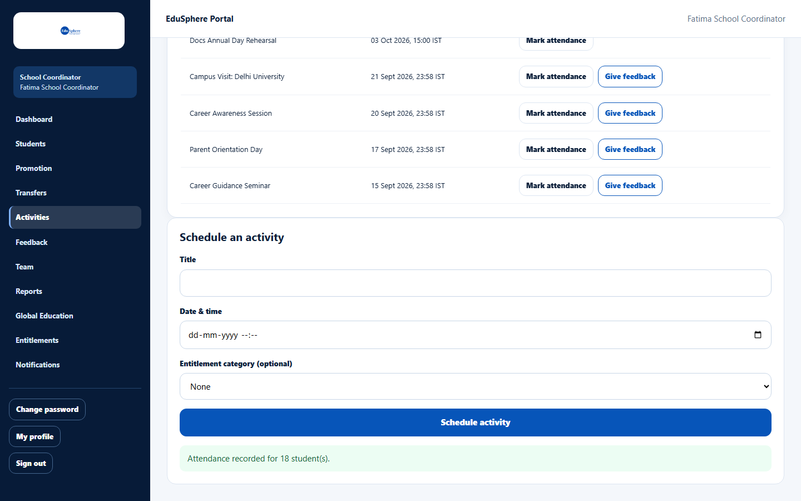

# Mark attendance for an activity

> Doc ID: DOC-SCH-ACT-002 · Verified on 2026-10-06 against `main` @ `ce1f07c2` · Roles: School Coordinator

## Purpose
Record which students attended an activity. Attendance appears on each student's timeline and in your reports.

## Who Can Use This Feature
**School Coordinator.**

## Prerequisites
The activity is in the **Activities** list.

## How to Access
Sidebar > **Activities** > **Mark attendance** on the activity's row.

## Steps

### Step 1 — Open the attendance card
Click **Mark attendance**. The **Mark attendance** card lists every student at your school, **all ticked**.

### Step 2 — Untick absent students
Untick each student who did not attend.

### Step 3 — Save
Click **Save attendance**. The message "Attendance recorded for {n} student(s)." appears.

## Fields
| Field | Description | Required | Example |
|---|---|---|---|
| One checkbox per student | Ticked = present. | — | ✓ Aarav Mehta |

## Expected Result
Present students get an "Attended {activity}" entry on their journey timeline, and the feedback list shows "{x} of {y}
present" for the activity.

## Validation Messages
| Message | When |
|---|---|
| Attendance recorded for {n} student(s). | Saved. |
| This school's partnership expired on {date}. | The tier has expired. *(From code.)* |

## Common Errors
**Problem:** Students you unticked earlier are ticked again when you reopen the card.
**Cause:** The card always starts with everyone ticked; it does not show what you saved before.
**Resolution:** Untick the absent students again every time, then save. Saving replaces the earlier record.

## Tips
- Take attendance once, at the end of the activity, to avoid overwriting it.
- Daily class attendance is separate and is taken by teachers (see [Take daily class attendance](act-005-daily-class-attendance.md)).

## Related Features
- [Schedule an activity](act-001-schedule-an-activity.md)
- [Give feedback on a completed activity](act-003-give-activity-feedback.md)
