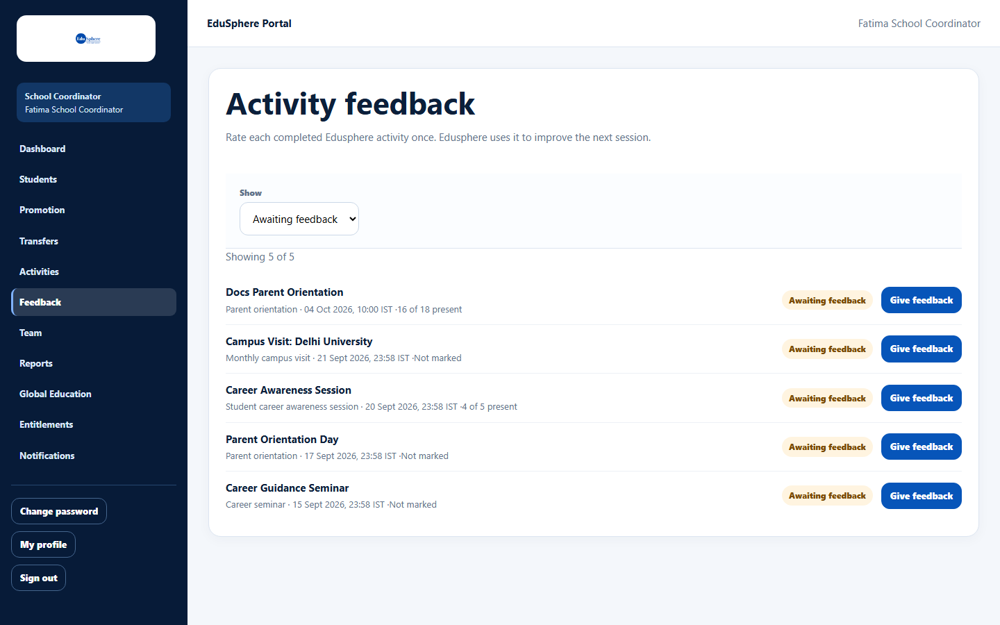
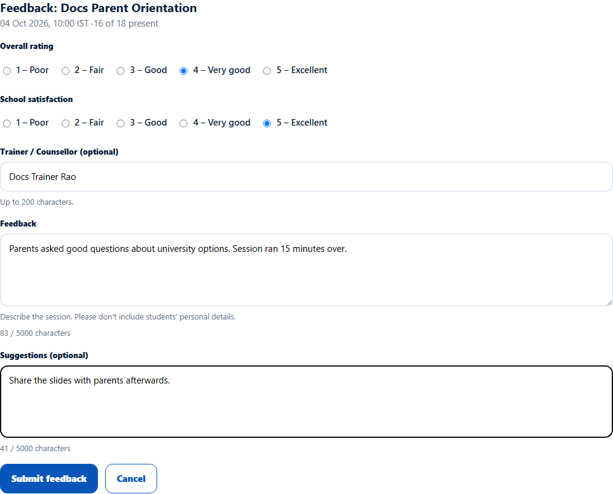
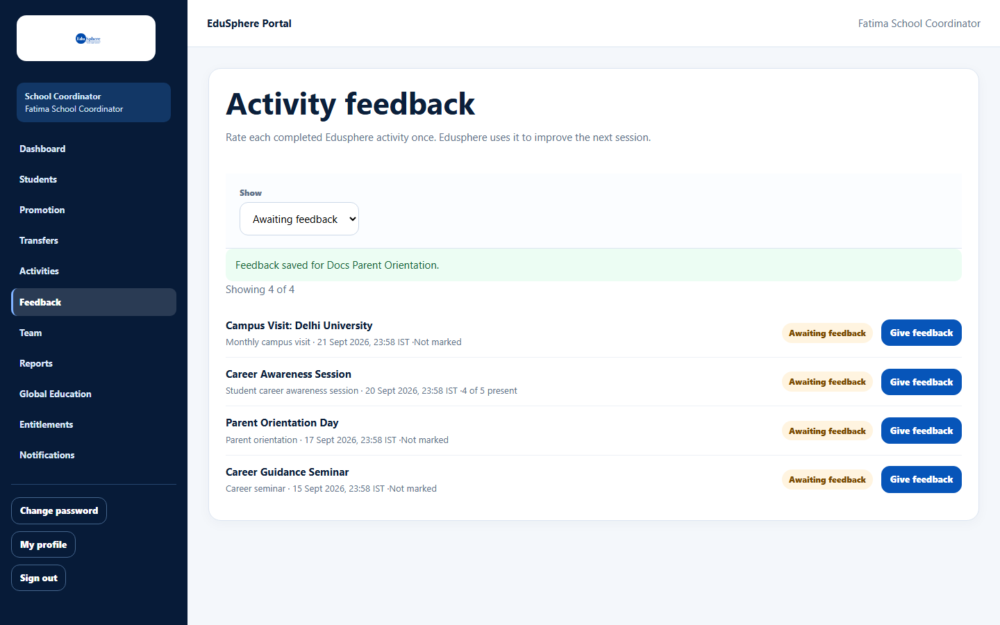
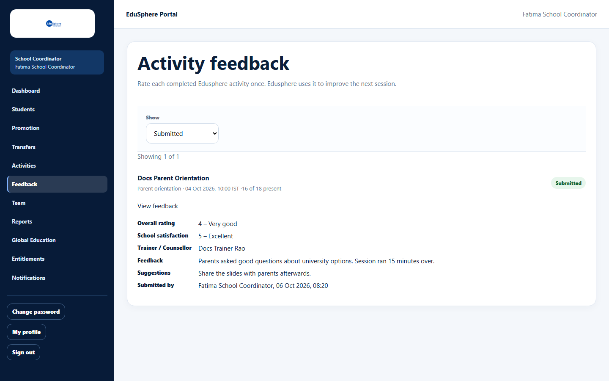
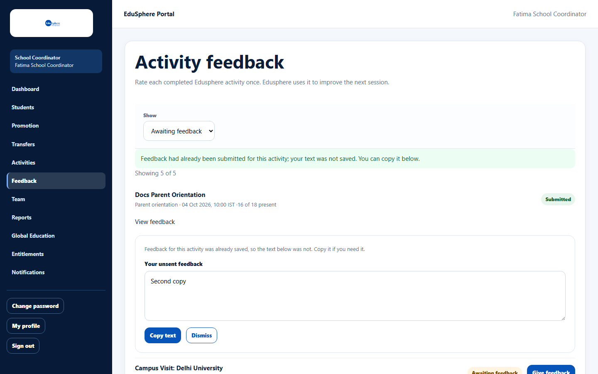

# Give feedback on a completed EduSphere activity

> Doc ID: DOC-SCH-ACT-003 · Verified on 2026-10-06 against `main` @ `ce1f07c2` · Roles: School Coordinator

## Purpose
Rate each EduSphere activity once it has taken place, so EduSphere can improve the next session.

## Who Can Use This Feature
**School Coordinator.** The Principal and EduSphere's Overseas Admin can read the feedback.

## Prerequisites
The activity has an **Entitlement category** (career seminar, career awareness session, parent orientation or campus
visit) and its date has passed. Activities without a category never ask for feedback.

## How to Access
Sidebar > **Feedback**, or **Give feedback** on the activity's row in **Activities**.

## Steps

### Step 1 — Find the activity
On **Activity feedback**, set **Show** to **Awaiting feedback**. Each row shows the type, date (IST) and attendance, and
a **Give feedback** button.

### Step 2 — Fill in the feedback
Click **Give feedback**. Choose **Overall rating** and **School satisfaction** (1 – Poor to 5 – Excellent), and write the
**Feedback**. **Trainer / Counsellor (optional)** and **Suggestions (optional)** can be left empty.

### Step 3 — Submit
Click **Submit feedback**. The message "Feedback saved for {title}." appears and the activity moves to **Submitted**.

### Step 4 — Read it later
With **Show** set to **Submitted**, open **View feedback** under an activity.

## Fields
| Field | Description | Required | Example |
|---|---|---|---|
| Overall rating | 1 – Poor, 2 – Fair, 3 – Good, 4 – Very good, 5 – Excellent. | Yes | 4 – Very good |
| School satisfaction | Same scale. | Yes | 5 – Excellent |
| Trainer / Counsellor (optional) | Who ran the session; up to 200 characters. | No | Ms Rao |
| Feedback | What happened; up to 5000 characters. Do not include students' personal details. | Yes | Parents asked good questions… |
| Suggestions (optional) | Ideas for next time; up to 5000 characters. | No | Share the slides afterwards. |

## Expected Result
The feedback is saved and visible to your Principal and to EduSphere.

## Validation Messages
| Message | When |
|---|---|
| Your browser asks you to choose an option / fill in the field | A rating or the Feedback text is missing. |
| Feedback had already been submitted for this activity; your text was not saved. You can copy it below. | Someone (or you in another tab) already submitted feedback for this activity. |

## Common Errors
**Problem:** "Feedback had already been submitted…" (shown in a green box).
**Cause:** Feedback can be given only once per activity.
**Resolution:** Use **Copy text** to keep what you wrote, then **Dismiss**. Feedback cannot be changed after it is
submitted.

**Problem:** An activity is missing from the feedback list.
**Cause:** It has no category, or it has not taken place yet.
**Resolution:** Only EduSphere activities that already happened can receive feedback.

## Tips
- Leaving the page with unsaved text asks you to confirm *(from code)*.
- The "Submitted by" time is shown in UTC, not IST.

## Related Features
- [View activity feedback (Principal)](act-004-view-activity-feedback.md)
- Admin manual: [Activity Feedback across schools](../../admin-manual/sadm-009-activity-feedback.md)
