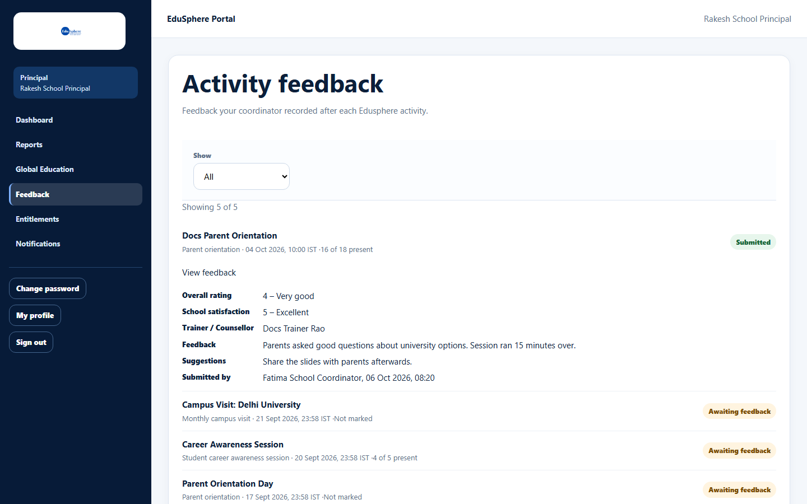

# View activity feedback

> Doc ID: DOC-SCH-ACT-004 · Verified on 2026-10-06 against `main` @ `ce1f07c2` · Roles: Principal

## Purpose
Read the feedback your School Coordinator recorded after each EduSphere activity, and see which activities still need
feedback.

## Who Can Use This Feature
**Principal** (read only).

## Prerequisites
None.

## How to Access
Sidebar > **Feedback**.

## Steps

### Step 1 — Open Feedback
Click **Feedback**. **Activity feedback** lists completed EduSphere activities, newest first, each marked **Submitted** or
**Awaiting feedback**, with the type, date (IST) and attendance ("{x} of {y} present" or "Not marked").

### Step 2 — Read the feedback
Click **View feedback** under a submitted activity to see the ratings, trainer, feedback, suggestions and who submitted
it.

### Step 3 — Filter
Use **Show**: **All**, **Awaiting feedback** or **Submitted**. When there are more than 25, click **Load more**.

## Fields
| Item | Description |
|---|---|
| Overall rating, School satisfaction | 1 – Poor to 5 – Excellent. |
| Trainer / Counsellor | Who ran the session ("Not recorded" if empty). |
| Feedback, Suggestions | The Coordinator's text. |
| Submitted by | Coordinator and time (shown in UTC). |

## Expected Result
You can follow how EduSphere activities went at your school.

## Validation Messages
None.

## Common Errors
**Problem:** "No completed Edusphere activities yet." *(From code.)*
**Cause:** No categorised activity has taken place yet.
**Resolution:** Nothing to do; activities appear after they happen.

## Tips
- Only the School Coordinator can submit feedback. Ask them if an activity stays "Awaiting feedback".

## Related Features
- [Give feedback on a completed activity](act-003-give-activity-feedback.md)
