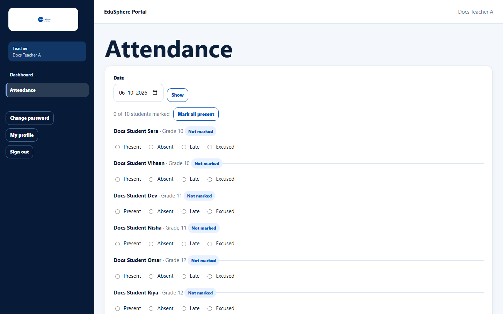
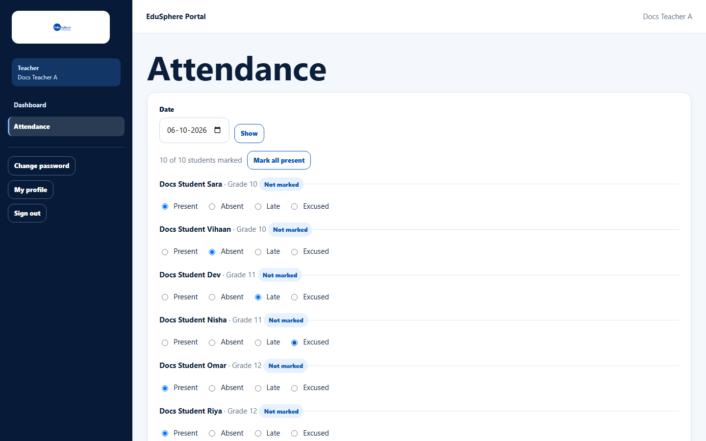
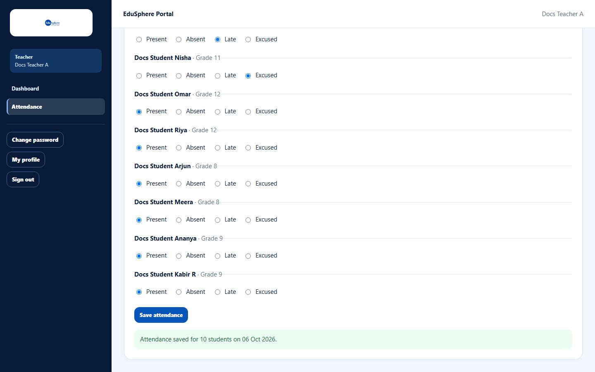
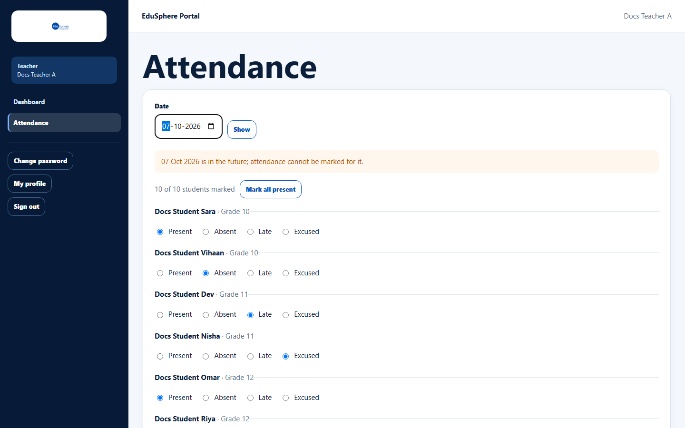
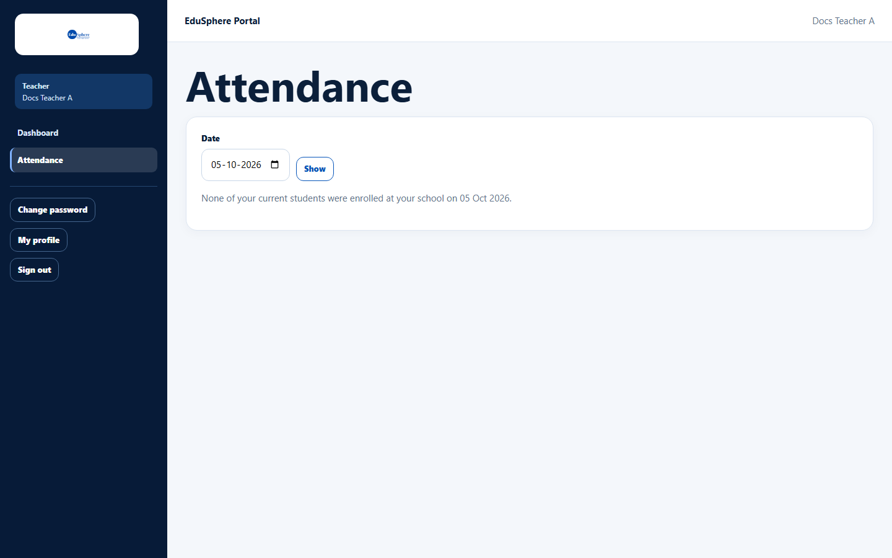

# Take daily class attendance

> Doc ID: DOC-SCH-ACT-005 · Verified on 2026-10-06 against `main` @ `ce1f07c2` · Roles: Teacher

## Purpose
Record each day whether your students were present, absent, late or excused. Parents see the totals on their child's
page.

## Who Can Use This Feature
**Teacher**, for the students assigned to them.

## Prerequisites
- The School Coordinator has assigned students to you.
- Your school's partnership is active.

## How to Access
Sidebar > **Attendance**.

## Steps

### Step 1 — Choose the day
The page opens on today. To take attendance for another day, choose the **Date** and click **Show**.

### Step 2 — Mark each student
For each student choose **Present**, **Absent**, **Late** or **Excused**. **Mark all present** fills in Present for every
student not yet marked; then change the exceptions. "Not marked" shows students without a saved status.

### Step 3 — Save
Click **Save attendance**. The message "Attendance saved for {n} students on {date}." appears.

## Fields
| Field | Description | Required | Example |
|---|---|---|---|
| Date | The school day; today or earlier. | Yes | 06-10-2026 |
| Present / Absent / Late / Excused | One choice per student. | At least one student | Absent |

## Expected Result
The marks are saved; students left blank stay "Not marked". You can come back and change a day's marks; saving again
replaces them *(from code)*.

## Validation Messages
| Message | When |
|---|---|
| Choose a status for at least one student. | You clicked **Save attendance** without marking anyone. |
| {date} is in the future; attendance cannot be marked for it. | The chosen date is after today. |
| None of your current students were enrolled at your school on {date}. | Your students joined the school after that date. |
| You have unsaved attendance. Leave without saving it? | You try to change the date or leave the page with unsaved marks. |
| Your class list changed since this page was opened, so nothing was saved. The list has been updated — check the marks and save again. | Students were reassigned while you were marking. *(From code.)* |

## Common Errors
**Problem:** "No students assigned to you yet." *(From code.)*
**Cause:** The Coordinator has not assigned students to you.
**Resolution:** Ask your School Coordinator.

**Problem:** "This school's partnership expired on {date}." *(From code.)*
**Cause:** The school's partnership needs renewing.
**Resolution:** Tell your School Coordinator.

## Tips
- The list is sorted by grade, then name.
- Parents are not notified of daily attendance; they see the totals on their child's page *(from code; parent page verified in S10)*.

## Related Features
- [Mark attendance for an activity](act-002-mark-activity-attendance.md) (Coordinator, for events)
