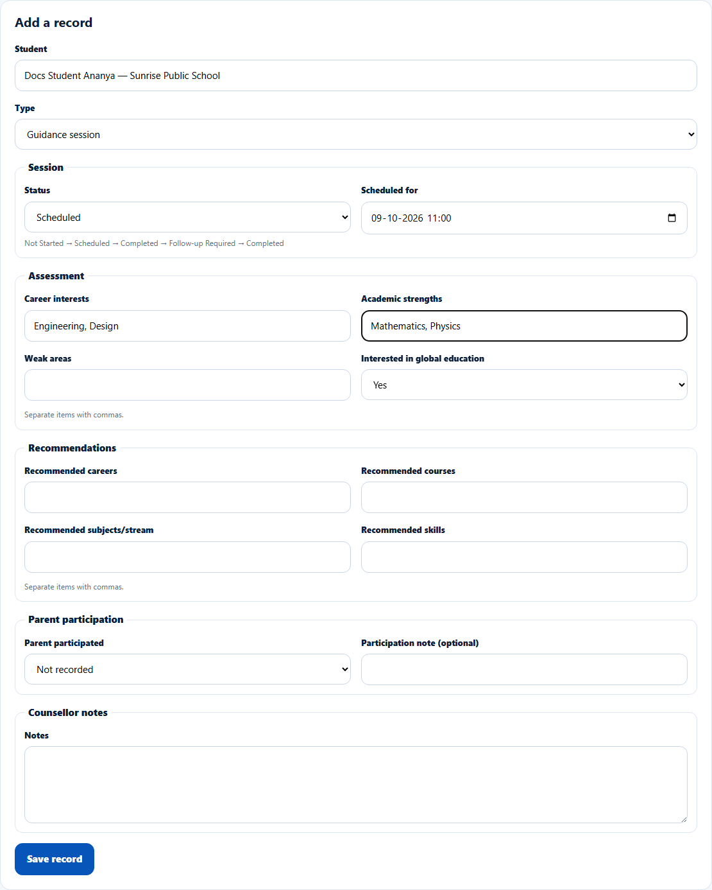
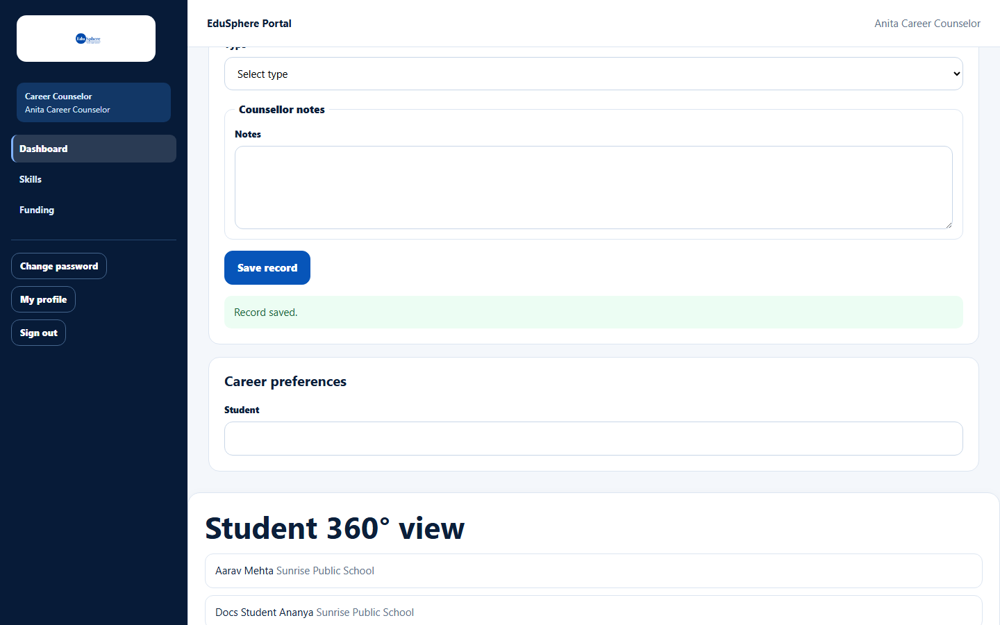
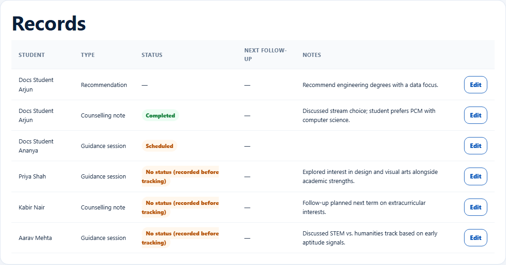
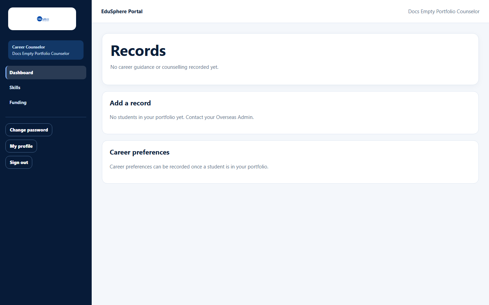

# Add a career guidance or counselling record

> Doc ID: DOC-SCH-CAR-001 · Verified on 2026-10-06 against `main` @ `ce1f07c2` · Roles: Career Counselor

## Purpose
Record a career guidance session, a counselling note or a career recommendation for a student, with what you learned
about their interests, strengths and options.

## Who Can Use This Feature
**Career Counselor.**

## Prerequisites
- The student is at a school in your school portfolio.
- The school's partnership includes Individual counselling (**Silver** or higher).

## How to Access
Sidebar > **Dashboard** > **Add a record** (below **Records**).

## Steps

### Step 1 — Choose student and type
Pick the **Student** (type part of the name) and the **Type**: **Guidance session**, **Counselling note** or
**Recommendation**.

### Step 2 — Fill in the session details
For a guidance session or counselling note, choose the **Status**: **Not Started**, **Scheduled** (then enter **Scheduled
for**) or **Completed** (optionally **Completed on**, which defaults to today). Fill in what you know under
**Assessment**, **Recommendations** and **Parent participation**, and write **Notes**.

### Step 3 — Save
Click **Save record**. The message "Record saved." appears and the record is added to **Records**.

## Fields
| Field | Description | Required | Example |
|---|---|---|---|
| Student | Pick from your portfolio. | Yes | Docs Student Ananya |
| Type | Guidance session, Counselling note, Recommendation. | Yes | Guidance session |
| Status | Not Started, Scheduled, Completed (sessions and notes only). | Yes | Scheduled |
| Scheduled for | Date and time (when Scheduled). | When Scheduled | 09-10-2026 11:00 |
| Completed on | Date (when Completed); defaults to today. | No | — |
| Career interests, Academic strengths, Weak areas | Comma-separated. | No | Engineering, Design |
| Interested in global education | Not recorded, Yes, No. | No | Yes |
| Recommended careers, courses, subjects/stream, skills | Comma-separated. | No | Product design |
| Parent participated / Participation note (optional) | Whether a parent took part (note up to 500 characters). | No | Yes / Mother attended. |
| Notes | Your notes. | For a Recommendation, and for Completed or Follow-up Required | Discussed stream choice… |

A **Recommendation** has notes only (no status or session fields).

## Expected Result
- The record is listed in **Records** (newest first) and on the student's timeline and 360° view (Career Guidance).
- Parents are notified, for example "Career guidance session recorded for {name}" *(from code; checked in S10)*.

## Validation Messages
| Message | When |
|---|---|
| Your browser asks you to fill in the field | A required field (for example Notes for a completed counselling note) is empty. |
| A scheduled session needs a date and time. | Scheduled without a date. *(From code.)* |
| This school's … partnership does not include Individual counselling (requires Silver or higher). | Bronze school. *(From code; message format seen elsewhere.)* |

## Common Errors
**Problem:** "No students in your portfolio yet. Contact your Overseas Admin."
**Cause:** No school is assigned to you yet.
**Resolution:** Ask your Overseas Admin.

## Tips
- Records made before status tracking existed show "No status (recorded before tracking)".
- Lists accept up to 20 items of up to 80 characters each.

## Related Features
- [Edit a record and move its status](car-002-edit-a-record.md)
- [Record career preferences](car-003-career-preferences.md)
