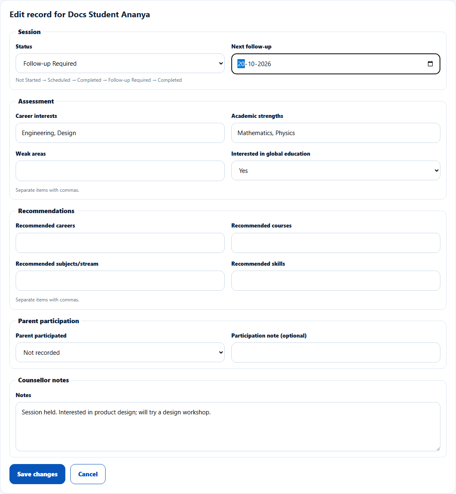
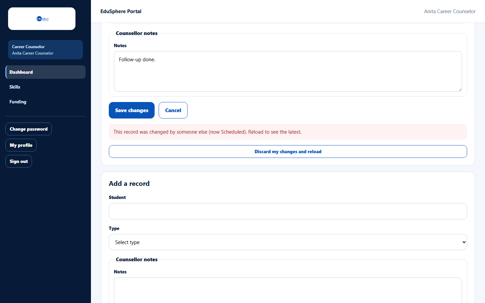

# Edit a record and move its status

> Doc ID: DOC-SCH-CAR-002 · Verified on 2026-10-06 against `main` @ `ce1f07c2` · Roles: Career Counselor

## Purpose
Update a guidance session or counselling note as it progresses — for example from Scheduled to Completed, or to
Follow-up Required with a next follow-up date.

## Who Can Use This Feature
**Career Counselor.**

## Prerequisites
The record exists in **Records**.

## How to Access
Sidebar > **Dashboard** > **Records** > **Edit** on the record's row.

## Steps

### Step 1 — Open the record
Click **Edit** on the row. **Edit record for {student}** opens with the same fields (Student and Type cannot change).

### Step 2 — Move the status
The **Status** list offers only the allowed next steps:

| Current status | You can choose |
|---|---|
| Not Started | Scheduled |
| Scheduled | Completed |
| Completed | Follow-up Required |
| Follow-up Required | Scheduled, Completed |
| No status (older records) | Completed, Follow-up Required *(from code)* |

For **Follow-up Required**, enter the **Next follow-up** date (today or later).

### Step 3 — Save
Click **Save changes**. The form closes and the row shows the new status (reload the page if it does not update straight
away).

## Fields
See [Add a record](car-001-add-a-record.md#fields), plus **Next follow-up** (date, required for Follow-up Required).

## Expected Result
The record shows the new status; the parent is notified of status changes *(from code)*.

## Validation Messages
| Message | When |
|---|---|
| This record was changed by someone else (now {status}). Reload to see the latest. | Another person (or you in another tab) saved the record after you opened it. |
| Choose the next follow-up date. / The next follow-up date must be today or later. | Follow-up date missing or in the past. *(From code.)* |
| Cannot change status from {X} to {Y} | Not reachable from the list. *(From code.)* |

## Common Errors
**Problem:** "This record was changed by someone else…".
**Cause:** The record was saved elsewhere while your form was open.
**Resolution:** Copy anything you need, click **Discard my changes and reload**, and edit again.

## Tips
- Keep one edit form open at a time to avoid conflicts.

## Related Features
- [Add a record](car-001-add-a-record.md)
